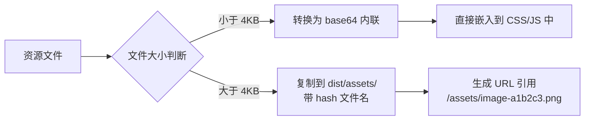
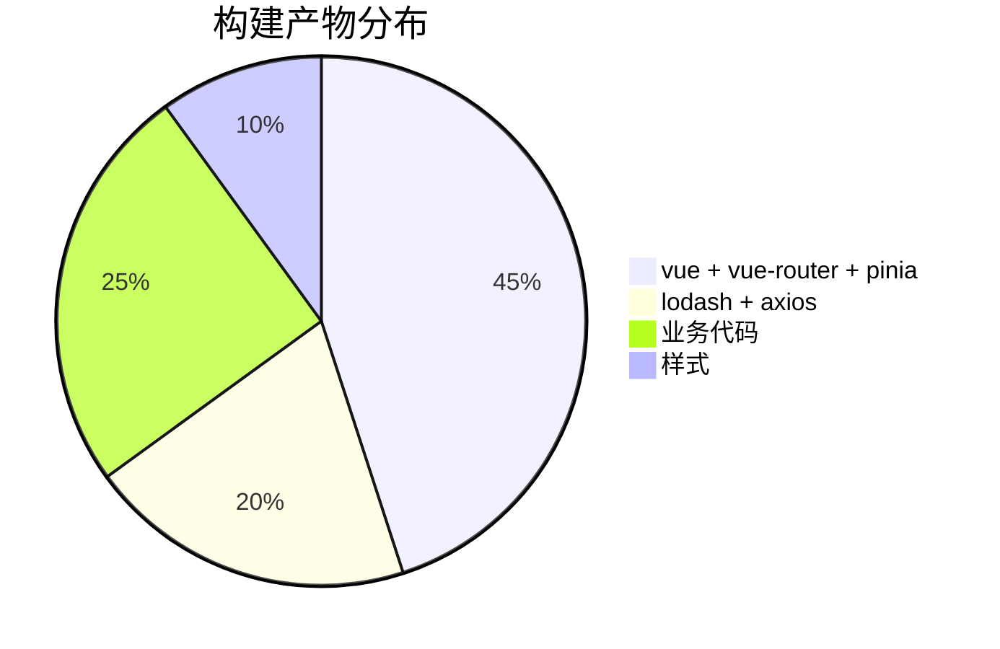

+++
title = "第7章 静态资源与构建优化"
weight = 70
date = "2026-03-27T17:13:00+08:00"
type = "docs"
description = ""
isCJKLanguage = true
draft = false
+++

# Chapter-07-Assets-And-Optimization

# 第7章：静态资源与构建优化

> "为什么我的网站加载那么慢？"这是前端性能优化的灵魂拷问。
>
> 造成网页加载慢的原因有很多：图片太大、JavaScript 打包太臃肿、HTTP 请求太多、没有缓存策略、没有压缩... 这一章，我们就把这些问题一一击破。
>
> Vite 在构建优化方面下了很大功夫：代码分割、懒加载、资源压缩、Tree Shaking、Web Worker 支持、WebAssembly... 学会了这些，你的网站加载速度可以快到飞起！🚀

---

## 7.1 资源处理基础

### 7.1.1 资源引用的方式

在 Vite 项目中，资源引用有两种主要方式：**import 引入**和 **url() 引入**。

**方式一：import 引入**

```javascript
// 在 JavaScript 中 import 资源
// 适合在代码中动态使用资源
import heroImage from './assets/hero.jpg'
import iconUrl from './icons/arrow.svg'
import fontFile from './fonts/MyFont.woff2'

// 使用时，Vite 会自动处理路径
const img = document.createElement('img')
img.src = heroImage
img.alt = 'Hero Image'
document.body.appendChild(img)

// 或者在 Vue 组件中
// 
```

**方式二：url() 引入**

```css
/* 在 CSS 中使用 url() */
/* Vite 会处理这些路径 */
.logo {
  background-image: url('./assets/logo.png');
}

.hero {
  background-image: url('./assets/hero.jpg');
}
```

```vue
<!-- 在 Vue 模板中直接使用相对路径 -->
<!-- Vite 会自动处理 -->
<template>
  <div class="hero" style="background-image: url('./assets/hero.jpg')">
    <!-- 或者 -->
    
  </div>
</template>
```

> 💡 **两种方式的区别**：import 引入会让 Vite 记录这个依赖，方便做依赖分析和 Tree Shaking；url() 引入主要用于 CSS 中，Vite 也会处理，但不会建立显式的依赖关系。

### 7.1.2 URL 处理与 base64 内联

Vite 会根据资源大小决定处理方式：



**默认阈值是 4KB**，你可以通过配置调整：

```javascript
// vite.config.js
export default defineConfig({
  build: {
    // 小于这个大小的资源会被内联为 base64（单位：字节）
    // 默认：4096（4KB）
    assetsInlineLimit: 4 * 1024,  // 4KB
    
    // 设为 0 禁用 base64 内联
    assetsInlineLimit: 0,
    
    // 设为更大的值
    assetsInlineLimit: 8 * 1024,  // 8KB
  }
})
```

**示例**：

```css
/* 小于 4KB 的图片会被内联为 base64 */
.logo {
  /* 这种会内联 */
  background-image: url('./assets/small-icon.png');  /* 2KB */
}

/* 大于 4KB 的图片会生成单独文件 */
.hero {
  /* 这种会生成单独文件 */
  background-image: url('./assets/large-photo.jpg');  /* 200KB */
}
```

### 7.1.3 资源目录配置

**public 目录**（见第3章 3.1.3 节）的文件会直接复制到输出目录，不经过任何处理：

```bash
public/
├── favicon.ico        # 网站图标，原封不动复制
├── robots.txt         # SEO 文件，原封不动复制
└── sdk.js            # 第三方 SDK，原封不动复制
```

**src/assets 目录**的文件会经过 Vite 处理（压缩、hash 命名等）：

```bash
src/assets/
├── images/
│   └── hero.jpg      # 会压缩、hash 命名
├── fonts/
│   └── MyFont.woff2  # 会压缩、hash 命名
└── icons/
    └── arrow.svg    # 会优化、hash 命名
```

### 7.1.4 资源命名规则

Vite 在构建时会给资源文件加上 hash，让浏览器在文件内容变化时重新加载：

```
原始文件名：src/assets/logo.png
构建后文件名：assets/logo-a1b2c3d4.png  （8位 hash）
```

**自定义命名规则**：

```javascript
// vite.config.js
export default defineConfig({
  build: {
    rollupOptions: {
      output: {
        // 资源文件名模板
        // [ext]: 文件扩展名
        // [name]: 原始文件名（不含扩展名）
        // [hash]: 文件内容 hash
        // [hash:8]: 8位 hash
        assetFileNames: 'assets/[name]-[hash:8][extname]',
        
        // chunk 文件名模板（import() 生成的）
        chunkFileNames: 'assets/[name]-[hash:8].js',
        
        // 入口文件命名模板
        entryFileNames: 'assets/[name]-[hash:8].js',
      }
    }
  }
})
```

---

## 7.2 图片资源优化

### 7.2.1 图片格式选择

不同格式的图片有不同的特点：

| 格式 | 适用场景 | 压缩方式 | 透明度 | 动画 |
|------|----------|----------|--------|------|
| **JPEG/JPG** | 照片、复杂图像 | 有损 | ❌ | ❌ |
| **PNG** | 图标、需要透明背景 | 无损 | ✅ | ❌ |
| **WebP** | 通用（现代浏览器） | 有损/无损 | ✅ | ✅（支持动画，类GIF） |
| **AVIF** | 通用（最新浏览器） | 高压缩 | ✅ | ❌ |
| **SVG** | 图标、矢量图 | 无损 | ✅ | ✅ |
| **GIF** | 简单动画 | 无损 | ✅ | ✅ |

**现代浏览器推荐**：优先使用 WebP 或 AVIF，它们的压缩率比 JPEG/PNG 高很多，而且现代浏览器都支持。

### 7.2.2 图片压缩插件

Vite 有多个插件可以帮助压缩图片：

**vite-plugin-imagemin**（最流行）：

```bash
pnpm add -D vite-plugin-imagemin
```

```javascript
// vite.config.js
import { defineConfig } from 'vite'
import vue from '@vitejs/plugin-vue'
import viteImagemin from 'vite-plugin-imagemin'

export default defineConfig({
  plugins: [
    vue(),
    viteImagemin({
      imageminOptions: {
        plugins: [
          // GIF 压缩
          ['gifsicle', { optimizationLevel: 7, interlaced: false }],
          // PNG 压缩（pngquant 压缩率高，速度慢）
          ['pngquant', { quality: [0.8, 0.9], speed: 10 }],
          // JPEG 压缩
          ['mozjpeg', { quality: 80, progressive: true }],
          // SVG 压缩
          ['svgo', {
            plugins: [
              { name: 'removeViewBox' },
              { name: 'removeDimensions' },
              { name: 'removeAttrs', params: { attrs: '(stroke|fill):none' } },
            ],
          }],
        ],
      },
    }),
  ],
})
```

**另一个选择：sharp**（Node.js 图片处理库）：

```bash
pnpm add -D vite-plugin-sharp
```

### 7.2.3 响应式图片处理

现代网页需要适配各种屏幕尺寸，响应式图片可以让我们根据屏幕大小加载不同分辨率的图片：

```html
<!-- srcset 属性：浏览器会根据屏幕密度自动选择合适的图片 -->

```

```vue
<!-- Vue 中的响应式图片 -->
<template>
  
</template>

<script setup>
import { computed } from 'vue'

const heroImage = new URL('./assets/hero-800.jpg', import.meta.url).href
const heroSrcset = [
  './assets/hero-400.jpg 400w',
  './assets/hero-800.jpg 800w',
  './assets/hero-1200.jpg 1200w',
].join(', ')

const heroSizes = [
  '(max-width: 600px) 400px',
  '(max-width: 1200px) 800px',
  '1200px',
].join(', ')
</script>
```

### 7.2.4 WebP/AVIF 格式支持

在构建时自动将图片转换为 WebP 或 AVIF：

```javascript
// vite.config.js
import { defineConfig } from 'vite'
import vue from '@vitejs/plugin-vue'

export default defineConfig({
  plugins: [
    vue(),
  ],
  // WebP/AVIF 转换需要使用 sharp 等工具配合自定义插件
  // 或使用 vite-plugin-imagemin 的 WebP 插件（需安装对应依赖）
})

// 注意：vite-plugin-imagemin 不直接支持 WebP/AVIF 转换
// 需要使用其他工具，如 sharp
```

> 💡 **推荐工具**：如果你需要自动转换图片格式，可以使用 `sharp` 配合自定义 Vite 插件，或者使用在线工具提前转换。

### 7.2.5 雪碧图处理

对于大量小图标，可以使用 SVG 雪碧图减少 HTTP 请求：

```javascript
// vite.config.js
import { defineConfig } from 'vite'
import vue from '@vitejs/plugin-vue'
import { createSvgIconsPlugin } from 'vite-plugin-svg-icons'

export default defineConfig({
  plugins: [
    vue(),
    createSvgIconsPlugin({
      iconDirs: [
        path.resolve(__dirname, 'src/assets/icons'),
      ],
      // Symbol ID 格式：icon-[目录名]-[文件名]
      symbolId: 'icon-[dir]-[name]',
    }),
  ],
})
```

**使用**：

```vue
<template>
  <!-- 使用图标 -->
  <svg aria-hidden="true">
    <use href="#icon-arrow" />
  </svg>
  
  <svg aria-hidden="true">
    <use href="#icon-close" />
  </svg>
</template>
```

### 7.2.6 渐进式图片加载

使用 `loading="lazy"` 让图片懒加载，只有进入视口时才加载：

```html
<!-- 普通加载：页面加载时就加载 -->


<!-- 懒加载：图片进入视口时才加载 -->


<!-- 渐进式加载：先显示模糊图，再加载清晰图 -->
<div class="image-wrapper">
  
  
</div>
```

```css
/* 渐进式图片样式 */
.blur {
  filter: blur(10px);
  transition: filter 0.3s;
}

.loaded {
  filter: blur(0);
}
```

---

## 7.3 代码分割与懒加载

### 7.3.1 动态导入（import()）

JavaScript 模块支持动态导入，返回一个 Promise，可以实现懒加载：

```javascript
// 静态导入：页面加载时就加载
import { add } from './utils.js'
console.log(add(1, 2))  // 3

// 动态导入：需要时才加载
async function loadModule() {
  // 这行代码执行时，才会去加载 ./utils.js
  const module = await import('./utils.js')
  console.log(module.add(1, 2))  // 3
}

// 使用场景：路由懒加载
const routes = [
  {
    path: '/',
    // 首页直接加载
    component: () => import('./views/Home.vue')
  },
  {
    path: '/about',
    // 关于页懒加载
    component: () => import('./views/About.vue')
  }
]
```

### 7.3.2 自动代码分割（manualChunks）

Vite/Rollup 会自动分析依赖关系进行代码分割，但你也可以手动控制：

```javascript
// vite.config.js
export default defineConfig({
  build: {
    rollupOptions: {
      output: {
        // 手动分包配置
        manualChunks: {
          // 把 Vue 相关的包打包到一起
          vue: ['vue', 'vue-router', 'pinia'],
          
          // 把 lodash 单独打包
          lodash: ['lodash-es'],
          
          // 把工具函数打包到一起
          utils: [
            './src/utils/format.js',
            './src/utils/validate.js',
            './src/utils/storage.js',
          ],
        }
      }
    }
  }
})
```

**分包效果**：

```
dist/
├── index.html
├── assets/
│   ├── index-a1b2c3.js      # 主 chunk（业务代码）
│   ├── index-d4e5f6.css     # 主 CSS
│   ├── vue-g7h8i9.js        # Vue 依赖（第三方）
│   ├── lodash-j1k2l3.js     # lodash（第三方）
│   └── utils-m4n5o6.js       # 工具函数
```

### 7.3.3 预加载与预获取

Vite 支持 `<link rel="preload">` 和 `<link rel="prefetch">` 来优化加载策略：

**preload**：提前加载当前页面需要的资源

**prefetch**：空闲时预取未来可能需要的资源

```vue
<!-- 通过 Vite 插件实现 preload/prefetch -->
<script setup>
import { defineAsyncComponent } from 'vue'

// 首页直接加载（可以配置 preload）
import Home from './views/Home.vue'

// 关于页懒加载（可以配置 prefetch）
const About = defineAsyncComponent(() => import('./views/About.vue'))
</script>
```

**手动添加 preload/prefetch**：

```html
<!-- 在 index.html 中手动添加 -->
<head>
  <!-- 预加载关键 CSS -->
  <link rel="preload" href="/src/styles/main.css" as="style">
  
  <!-- 预加载关键字体 -->
  <link rel="preload" href="/src/fonts/MyFont.woff2" as="font" crossorigin>
  
  <!-- 预取未来可能需要的模块 -->
  <link rel="prefetch" href="/src/views/About.js" as="script">
</head>
```

**使用 Vite 插件自动添加 preload**：

```bash
pnpm add -D vite-plugin-preload
```

```javascript
// vite.config.js
import { defineConfig } from 'vite'
import vue from '@vitejs/plugin-vue'
import preload from 'vite-plugin-preload'

export default defineConfig({
  plugins: [
    vue(),
    preload({
      // 需要预加载的路径
      includes: [
        './src/views/About.vue',
        './src/views/UserProfile.vue',
      ],
    }),
  ],
})
```

### 7.3.4 Rollup 手动分块

更细粒度的代码分割控制：

```javascript
// vite.config.js
export default defineConfig({
  build: {
    rollupOptions: {
      output: {
        // 手动分块
        manualChunks(id) {
          // 把 node_modules 中的所有包按供应商分组
          if (id.includes('node_modules')) {
            // 把大库单独打包
            if (id.includes('element-plus')) {
              return 'vendor-element'
            }
            if (id.includes('ant-design')) {
              return 'vendor-antd'
            }
            // 其他 node_modules 包打包到一起
            return 'vendor'
          }
          
          // 把 src 下的工具函数打包到一起
          if (id.includes('/utils/')) {
            return 'utils'
          }
        }
      }
    }
  }
})
```

### 7.3.5 路由级别代码分割

最常见的代码分割场景是路由级别的懒加载：

**Vue Router**：

```javascript
// router/index.js
import { createRouter, createWebHistory } from 'vue-router'

// 直接导入（不分割）
import Home from '../views/Home.vue'

// 懒加载导入（分割）
const About = () => import('../views/About.vue')
const UserProfile = () => import('../views/UserProfile.vue')

// 懒加载路由分割（Vite/Rollup 会自动生成 chunk 名）
const Settings = () => import(/* @vite-ignore */ '../views/Settings.vue')

const routes = [
  { path: '/', component: Home },
  { path: '/about', component: About },
  { path: '/profile', component: UserProfile },
  { path: '/settings', component: Settings },
]

export const router = createRouter({
  history: createWebHistory(),
  routes,
})
```

**生成的文件**：

```
assets/
├── Home-xxxx.js         # 首页（直接加载）
├── About-xxxx.js        # 关于页（懒加载）
├── UserProfile-xxxx.js  # 用户资料页（懒加载）
├── Settings-xxxx.js     # 设置页（懒加载）
```

---

## 7.4 构建优化技巧

### 7.4.1 依赖预构建优化

Vite 在首次启动时会用 esbuild 对 `node_modules` 中的依赖进行预构建。这个过程可以优化：

```javascript
// vite.config.js
export default defineConfig({
  optimizeDeps: {
    // 强制预构建某些依赖
    include: [
      // 大型库建议强制预构建
      'vue',
      'vue-router',
      'pinia',
      'lodash-es',
      'axios',
    ],
    
    // 排除预构建的依赖
    exclude: [
      // 有问题的包可以排除
      // 'some-problematic-package',
    ],
    
    // esbuild 配置
    esbuildOptions: {
      // 定义全局变量
      define: {
        global: 'globalThis',
      },
    }
  }
})
```

### 7.4.2 缓存策略配置

Vite 会把预构建结果缓存到 `node_modules/.vite` 目录：

```javascript
// vite.config.js
export default defineConfig({
  // 缓存目录配置
  cacheDir: 'node_modules/.vite',
  
  // 构建时清理缓存（不推荐）
  // build: { emptyOutDir: true }
})
```

**清除缓存**：删除 `node_modules/.vite` 目录，然后重新启动。

### 7.4.3 构建分析报告

使用 `rollup-plugin-visualizer` 或 `vite-bundle-visualizer` 分析构建产物：

```bash
pnpm add -D rollup-plugin-visualizer
```

```javascript
// vite.config.js
import { defineConfig } from 'vite'
import vue from '@vitejs/plugin-vue'
import { visualizer } from 'rollup-plugin-visualizer'

export default defineConfig({
  plugins: [
    vue(),
    visualizer({
      // 生成可视化报告
      filename: 'dist/stats.html',  // 打开这个 HTML 文件查看
      open: true,                    // 构建后自动打开
      gzipSize: true,               // 显示 gzip 后的体积
      maxFileSize: 500 * 1024,      // 超过 500KB 的文件会高亮显示
    }),
  ],
})
```

构建完成后，会生成 `dist/stats.html`，打开后可以看到：



### 7.4.4 多页面应用配置

如果你的项目有多个入口 HTML（多页面应用），需要配置 `multiPage`：

```javascript
// vite.config.js
import { defineConfig } from 'vite'

export default defineConfig({
  build: {
    // 多页面应用配置
    rollupOptions: {
      input: {
        // 主应用入口
        main: path.resolve(__dirname, 'index.html'),
        
        // 管理后台入口
        admin: path.resolve(__dirname, 'admin.html'),
        
        // Landing Page 入口
        landing: path.resolve(__dirname, 'landing.html'),
      },
      
      output: {
        // 输出配置
        entryFileNames: 'js/[name]-[hash].js',
        chunkFileNames: 'js/[name]-[hash].js',
        assetFileNames: 'assets/[name]-[hash][extname]',
      }
    }
  }
})
```

**项目结构**：

```
my-project/
├── index.html        # 主应用入口
├── admin.html        # 管理后台入口
├── landing.html      # Landing Page 入口
└── src/
    ├── main/         # 主应用代码
    ├── admin/        # 管理后台代码
    └── landing/      # Landing Page 代码
```

### 7.4.5 库模式构建

如果你的项目是构建一个 JavaScript 库而不是 Web 应用，使用库模式：

```javascript
// vite.config.js
import { defineConfig } from 'vite'
import vue from '@vitejs/plugin-vue'

export default defineConfig({
  build: {
    lib: {
      // 库的入口文件
      entry: path.resolve(__dirname, 'src/index.ts'),
      
      // 库名称（全局变量名）
      name: 'MyLibrary',
      
      // 输出文件名
      fileName: (format) => `my-library.${format}.js`,
      
      // 支持的格式
      // 'es' | 'cjs' | 'umd' | 'iife'
      formats: ['es', 'cjs', 'umd'],
    },
    
    // 库模式不需要 CSS 分割
    cssCodeSplit: false,
    
    // Rollup 配置
    rollupOptions: {
      // UMD/iife 模式下需要的全局变量
      // external: ['react', 'react-dom'],
      // globals: {
      //   react: 'React',
      //   'react-dom': 'ReactDOM',
      // },
    }
  }
})
```

**输出**：

```
dist/
├── my-library.es.js      # ES Module 格式
├── my-library.cjs.js     # CommonJS 格式
├── my-library.umd.js     # UMD 格式（浏览器和 Node.js 通用）
└── style.css             # 样式文件
```

### 7.4.6 CSS 代码分割

Vite 默认会把 CSS 分割成多个文件（每个 chunk 对应一个 CSS 文件）。如果你想合并成一个 CSS 文件：

```javascript
// vite.config.js
export default defineConfig({
  build: {
    // 关闭 CSS 代码分割，合并为一个文件
    cssCodeSplit: false,
    
    // 或者控制分割的最小值
    // cssCodeSplit: true,  // 默认
  }
})
```

### 7.4.7 动态 polyfill

使用 ` @playwright/experiments/polyfills` 或 `core-js` 做按需 polyfill：

**方式一：使用 babel/core-js**：

```bash
pnpm add -D core-js @babel/preset-env
```

```javascript
// babel.config.js
export default {
  presets: [
    ['@babel/preset-env', {
      useBuiltIns: 'usage',  // 按需 polyfill
      corejs: 3,             // core-js 版本
      targets: {
        // 目标浏览器
        chrome: '80',
        firefox: '75',
        safari: '13',
      },
    }],
  ],
}
```

**方式二：使用 Polyfill.io CDN（已废弃）**：

> ⚠️ **警告**：Polyfill.io 服务已于 2023 年停止运营，原 CDN 地址已失效！
>
> 建议改用 `core-js` + `@babel/preset-env` 的按需引入方案：
> ```bash
> pnpm add core-js
> ```

```html
<!-- ❌ 已废弃，不要使用 -->
<!-- <script src="https://polyfill.io/v3/polyfill.min.js"></script> -->
```

---

## 7.5 压缩配置

### 7.5.1 gzip 压缩

gzip 是最常用的 HTTP 压缩格式，可以显著减少传输体积：

```javascript
// vite.config.js
import { defineConfig } from 'vite'
import viteCompression from 'vite-plugin-compression'

export default defineConfig({
  plugins: [
    viteCompression({
      // 压缩算法
      algorithm: 'gzip',
      
      // 文件扩展名
      ext: '.gz',
      
      // 阈值：小于这个大小的文件不压缩（bytes）
      threshold: 1024,
      
      // 压缩级别：1-9，越大压缩率越高但越慢
      compressionOptions: {
        level: 9,
      },
      
      // 是否删除原始文件
      deleteOriginFile: false,
      
      // 并行压缩
      parallel: true,
    }),
  ],
})
```

**生成的文件**：

```
dist/
├── assets/
│   ├── index-a1b2c3.js      # 原始 JS（500KB）
│   ├── index-a1b2c3.js.gz   # gzip 压缩后（150KB）
│   ├── index-d4e5f6.css
│   ├── index-d4e5f6.css.gz
```

**服务器配置（Nginx）**：

```nginx
# 启用 gzip
gzip on;
gzip_types text/plain text/css application/json application/javascript text/xml application/xml text/javascript;
gzip_min_length 1000;
gzip_vary on;
gzip_proxied any;
gzip_comp_level 6;
```

### 7.5.2 brotli 压缩

Brotli 是比 gzip 压缩率更高的算法（大约 15-25% 提升）：

```javascript
// vite.config.js
import viteCompression from 'vite-plugin-compression'

export default defineConfig({
  plugins: [
    // 或者同时支持 gzip 和 brotli
    viteCompression({
      algorithm: 'brotliCompress',
      ext: '.br',
      compressionOptions: {
        params: {
          [require('zlib').constants.BROTLI_PARAM_QUALITY]: 11,
        },
      },
    }),
  ],
})
```

### 7.5.3 服务端压缩 vs 构建时压缩

| 方案 | 优点 | 缺点 |
|------|------|------|
| **服务端压缩（Nginx/gzip）** | 实时压缩，可以动态调整压缩级别 | 服务器 CPU 开销，压缩有延迟 |
| **构建时压缩（vite-plugin-compression）** | 服务器零开销，文件立即可用 | 构建时间长，文件体积略增 |
| **两者结合** | 最优方案，缓存预压缩文件 | 配置复杂 |

---

## 7.6 Worker 与 WebAssembly

### 7.6.1 Web Worker 支持

Web Worker 允许你在后台线程中运行 JavaScript，不阻塞主线程：

```bash
# Worker 文件放在 src/ 目录下
src/
├── workers/
│   ├── my-worker.js       # 传统 Worker
│   └── data-processor.js   # Comlink 包装的 Worker
├── main.js
```

**方式一：传统 Worker（Vite 4.2+ 支持）**：

```javascript
// src/workers/my-worker.js
// 这是 Worker 文件，可以访问 self
self.onmessage = function(e) {
  const data = e.data
  // 模拟耗时计算
  const result = data.map(x => x * 2)
  // 返回结果给主线程
  self.postMessage(result)
}
```

```javascript
// main.js —— 在主线程中使用
const worker = new Worker(
  new URL('./workers/my-worker.js', import.meta.url),
  { type: 'module' }
)

worker.onmessage = function(e) {
  console.log('Worker 返回结果：', e.data)  // [2, 4, 6, 8, 10]
}

worker.postMessage([1, 2, 3, 4, 5])
```

**方式二：使用 Comlink 简化 Worker 通信**：

```bash
pnpm add -D comlink
```

```javascript
// src/workers/data-processor.worker.js
import * as Comlink from 'comlink'

const dataProcessor = {
  async processLargeData(data) {
    // 模拟耗时计算
    return data.map(item => ({
      ...item,
      processed: true,
      score: Math.random() * 100,
    }))
  },
  
  async aggregate(data) {
    return data.reduce((acc, item) => ({
      count: acc.count + 1,
      sum: acc.sum + item.value,
    }), { count: 0, sum: 0 })
  },
}

Comlink.expose(dataProcessor)
```

```javascript
// main.js
import * as Comlink from 'comlink'
import Worker from './workers/data-processor.worker.js?worker'

const worker = new Worker()
const api = Comlink.wrap(worker)

// 使用起来像调用本地函数
const result = await api.processLargeData(largeArray)
console.log(result)
```

### 7.6.2 Worker 导入方式

Vite 支持直接在 Worker 中 import：

```javascript
// src/workers/my-worker.js
import { add } from './utils.js'
import { CONFIG } from './config.js'

self.onmessage = function(e) {
  const result = add(e.data.a, e.data.b)
  self.postMessage(result)
}
```

**Vite 会自动处理 Worker 中的依赖**，不需要额外配置。

### 7.6.3 Wasm 文件导入

Vite 内置支持 WebAssembly 文件：

```bash
# Wasm 文件放在 public 或 src/assets
public/
└── wasm/
    └── my-module.wasm
```

**使用方式一：fetch 加载**：

```javascript
// main.js
async function loadWasm() {
  const response = await fetch('/wasm/my-module.wasm')
  const buffer = await response.arrayBuffer()
  const { instance } = await WebAssembly.instantiate(buffer, {})
  return instance.exports
}

const wasm = await loadWasm()
console.log(wasm.add(1, 2))  // 3
```

**使用方式二：直接 import（Wasm 文件必须在 src/ 下）**：

```bash
src/
└── wasm/
    └── my-module.wasm
```

```javascript
// Vite 4.x+ 支持直接 import .wasm 文件
import MyModule from './wasm/my-module.wasm?init'

MyModule().then(instance => {
  console.log(instance.exports.add(1, 2))  // 3
})
```

### 7.6.4 SharedWorker 支持

SharedWorker 可以在多个标签页之间共享：

```javascript
// src/workers/shared.worker.js
const sharedData = new Map()

self.onconnect = function(e) {
  const port = e.ports[0]
  
  port.onmessage = function(e) {
    const { type, key, value } = e.data
    
    if (type === 'set') {
      sharedData.set(key, value)
      port.postMessage({ success: true })
    }
    
    if (type === 'get') {
      port.postMessage({ key, value: sharedData.get(key) })
    }
  }
  
  port.start()
}
```

```javascript
// main.js
const sharedWorker = new SharedWorker(
  new URL('./workers/shared.worker.js', import.meta.url),
  { type: 'module', name: 'my-shared-worker' }
)

sharedWorker.port.start()
sharedWorker.port.postMessage({ type: 'set', key: 'user', value: '小明' })
```

---

## 7.7 本章小结

### 🎉 本章总结

这一章我们学习了 Vite 的静态资源处理和构建优化：

1. **资源处理基础**：import vs url()、base64 内联、资源目录配置、资源命名规则

2. **图片优化**：格式选择（JPEG/WebP/AVIF/SVG）、压缩插件、响应式图片、懒加载、雪碧图

3. **代码分割**：动态导入、manualChunks、预加载/预获取、路由级别分割

4. **构建优化技巧**：依赖预构建、缓存策略、分析报告、多页面应用、库模式、CSS 分割、动态 polyfill

5. **压缩配置**：gzip、brotli、服务端压缩 vs 构建时压缩

6. **Worker 与 WebAssembly**：Web Worker、Comlink、Wasm 导入、SharedWorker

### 📝 本章练习

1. **构建分析实验**：安装 `rollup-plugin-visualizer`，运行构建，看看你的项目各部分占比

2. **路由懒加载**：把你的 Vue/React 项目改成路由懒加载，观察 Network 面板

3. **gzip 压缩**：配置 `vite-plugin-compression`，生成 .gz 文件

4. **Worker 实战**：写一个 Worker 处理大数据量计算，对比主线程和 Worker 的性能差异

5. **多页面应用**：尝试配置一个多页面应用，包含主应用和子应用

---

> 📌 **预告**：下一章我们将进入 **框架集成篇**，学习 Vite + Vue 3 实战，包括 Vue 3 组合式 API、单文件组件、Vue Router、Pinia 等。敬请期待！
