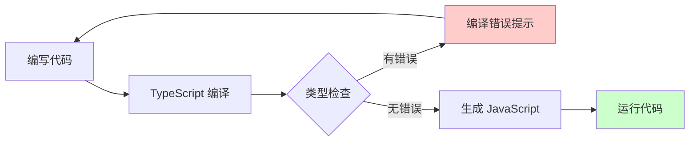

+++
title = "第10章 Vite + TypeScript"
weight = 100
date = "2026-03-27T17:13:00+08:00"
type = "docs"
description = ""
isCJKLanguage = true
draft = false
+++

# Chapter-10-Vite-TypeScript

# 第10章：Vite + TypeScript

> TypeScript——JavaScript 的超集，为 JavaScript 添加了静态类型系统。
>
> 很多人一开始觉得 TypeScript 麻烦，每次写代码都要定义类型。但当你写过几个大型项目后，就会发现：TypeScript 的"前期麻烦"能换来"后期的省心"——类型错误在编译时就发现了，而不是等到线上出 BUG。
>
> Vite 对 TypeScript 的支持是"原生级"的——内置了 TS 解析，不需要额外配置。那么，这一章我们就来把 TypeScript 彻底讲透！

---

## 10.1 TypeScript 基础

### 10.1.1 为什么使用 TypeScript

**JavaScript 的问题**：

```javascript
// JavaScript 中的类型错误，只有运行后才能发现
function add(a, b) {
  return a + b
}

console.log(add(1, 2))     // 3 ✅
console.log(add('1', '2')) // '12' ❌ 字符串拼接了！
console.log(add(1, '2'))   // '12' ❌ 隐式类型转换！
```

**TypeScript 的优势**：

```typescript
// TypeScript 在编译时就告诉你错误了
function add(a: number, b: number): number {
  return a + b
}

console.log(add(1, 2))     // 3 ✅
console.log(add('1', '2')) // ❌ 编译错误：Argument of type 'string' is not assignable to parameter of type 'number'
console.log(add(1, '2'))   // ❌ 编译错误：Argument of type 'string' is not assignable to parameter of type 'number'
```

**TypeScript 的核心优势**：

| 优势 | 说明 |
|------|------|
| **静态类型检查** | 编译时发现类型错误，减少运行时 BUG |
| **智能提示** | IDE 能提供更准确的代码补全和类型信息 |
| **代码文档** | 类型就是最好的文档，告诉开发者参数和返回值是什么 |
| **重构支持** | 重命名、修改签名时，IDE 能告诉你哪些地方需要更新 |
| **团队协作** | 代码意图更清晰，减少沟通成本 |



### 10.1.2 基本类型与接口

**基本类型**：

```typescript
// 字符串
const name: string = '小明'
const greeting: string = `你好，${name}！`  // 你好，小明！

// 数字
const age: number = 25
const pi: number = 3.14159

// 布尔值
const isStudent: boolean = true
const isAdult: boolean = age >= 18

// 数组
const numbers: number[] = [1, 2, 3, 4, 5]
const names: Array<string> = ['小明', '小红', '小李']  // 泛型语法

// 元组（固定长度和类型的数组）
const tuple: [string, number] = ['小明', 25]
console.log(tuple[0])  // 小明
console.log(tuple[1])  // 25

// 枚举
enum Status {
  Pending = 'PENDING',
  Active = 'ACTIVE',
  Completed = 'COMPLETED',
}
const currentStatus: Status = Status.Active
console.log(currentStatus)  // 'ACTIVE'（字符串枚举的值是字符串，不是 Status.Active）

// Any（尽量少用，会失去类型检查）
// any 类型可以接受任意值
const random: any = Math.random() > 0.5 ? 'hello' : 123

// Void（没有返回值）
function logMessage(message: string): void {
  console.log(message)
}

// Never（永远不会返回，通常用于抛出异常）
function throwError(message: string): never {
  throw new Error(message)
}

// Null 和 Undefined
const nullValue: null = null
const undefinedValue: undefined = undefined
```

**接口（Interface）**：

```typescript
// 定义对象的结构
interface User {
  id: number
  name: string
  email?: string  // 可选属性
  age: number
  readonly createdAt: Date  // 只读属性，创建后不能修改
}

// 使用接口
const user: User = {
  id: 1,
  name: '小明',
  age: 25,
  createdAt: new Date(),
}

// 只读属性不能被修改
// user.createdAt = new Date()  // ❌ 编译错误：Cannot assign to 'createdAt' because it is a read-only property

// 可选属性可以不提供
const user2: User = {
  id: 2,
  name: '小红',
  age: 22,
  // email 省略也可以
}

// 接口继承
interface Animal {
  name: string
  age: number
}

interface Dog extends Animal {
  breed: string
}

const myDog: Dog = {
  name: '旺财',
  age: 3,
  breed: '金毛',
}

// 函数接口
interface Callback {
  (error: Error | null, result: string): void
}

// 类实现接口
interface Flyable {
  fly(): void
}

class Bird implements Flyable {
  fly() {
    console.log('小鸟在飞')
  }
}
```

**类型别名（Type Alias）**：

```typescript
// 类型别名，给复杂类型起个短名字
type ID = string | number  // 联合类型

type Point = {
  x: number
  y: number
}

type UserID = string
type PostID = number

// 接口 vs 类型别名：
// 接口：更适合描述对象结构，可以被 extends/implements
// 类型别名：更适合描述联合类型、交叉类型、原始类型等
type Status = 'pending' | 'active' | 'completed'
type Result = SuccessResult | ErrorResult
```

### 10.1.3 泛型与类型推断

**泛型（Generics）**：

```typescript
// 泛型函数：不预先指定类型，调用时再确定
function identity<T>(arg: T): T {
  return arg
}

console.log(identity<number>(42))    // 42
console.log(identity<string>('hello')) // hello
// 类型推断
console.log(identity(true))          // true

// 泛型接口
interface Container<T> {
  value: T
  getValue(): T
  setValue(value: T): void
}

const numberContainer: Container<number> = {
  value: 42,
  getValue() { return this.value },
  setValue(value) { this.value = value },
}

// 泛型约束
interface HasLength {
  length: number
}

function logLength<T extends HasLength>(arg: T): number {
  console.log(arg.length)
  return arg.length
}

logLength('hello')      // 5
logLength([1, 2, 3])    // 3
logLength({ length: 10 })  // 10
// logLength(123)       // ❌ 编译错误：Number doesn't have length

// 多个类型参数
function pair<K, V>(key: K, value: V): [K, V] {
  return [key, value]
}

console.log(pair('name', '小明'))  // ['name', '小明']
console.log(pair(1, true))         // [1, true]

// 泛型类
class Stack<T> {
  private items: T[] = []
  
  push(item: T): void {
    this.items.push(item)
  }
  
  pop(): T | undefined {
    return this.items.pop()
  }
  
  peek(): T | undefined {
    return this.items[this.items.length - 1]
  }
  
  isEmpty(): boolean {
    return this.items.length === 0
  }
}

const numberStack = new Stack<number>()
numberStack.push(1)
numberStack.push(2)
console.log(numberStack.pop())  // 2

const stringStack = new Stack<string>()
stringStack.push('a')
stringStack.push('b')
console.log(stringStack.pop())  // b
```

**类型推断**：

```typescript
// TypeScript 会自动推断类型
const x = 3  // number
const y = 'hello'  // string
const z = [1, 2, 3]  // number[]

// 函数返回值推断
function add(a: number, b: number) {
  return a + b  // TypeScript 推断返回类型是 number
}

// 对象类型推断
const user = {
  name: '小明',
  age: 25,
}
// user 的类型自动推断为 { name: string; age: number }

// 数组 map 的类型推断
const numbers = [1, 2, 3]
const strings = numbers.map(n => n.toString())
// strings 的类型自动推断为 string[]

// 解构类型推断
const point = { x: 10, y: 20 }
const { x, y } = point
// x 和 y 的类型都是 number
```

---

## 10.2 Vite 中的 TypeScript

### 10.2.1 项目初始化与配置

创建一个 TypeScript 项目的最快方式：

```bash
# 创建 Vue + TS 项目
pnpm create vite@latest my-vue-ts -- --template vue-ts

# 创建 React + TS 项目
pnpm create vite@latest my-react-ts -- --template react-ts

# 创建 Vanilla + TS 项目
pnpm create vite@latest my-vanilla-ts -- --template vanilla-ts
```

**tsconfig.json 详解**：

```json
{
  // 编译选项
  "compilerOptions": {
    // 编译目标：生成 JavaScript 的版本
    // ES2020 是目前广泛支持的版本
    "target": "ES2020",
    
    // 使用的模块系统
    // ESNext = ES Modules（import/export）
    // CommonJS = require/module.exports
    "module": "ESNext",
    
    // 模块解析策略
    // 'bundler'：Vite/Rollup 使用的解析策略
    // 'node'：Node.js 原生的解析策略
    // 'node16'：Node.js 16+ 的解析策略
    "moduleResolution": "bundler",
    
    // 是否开启严格模式
    // 强烈建议开启！
    "strict": true,
    
    // 严格 null 检查
    // 开启后，null/undefined 不能赋值给其他类型
    "strictNullChecks": true,
    
    // 不允许隐式 any
    "noImplicitAny": true,
    
    // JSX 模式
    // 'react-jsx'：React 17+ 的新 JSX Transform
    // 'react'：经典 JSX 模式
    // 'preserve'：保留 JSX，不编译（不常用）
    "jsx": "react-jsx",
    
    // 源码目录
    "baseUrl": ".",
    
    // 路径别名（需要配合 vite.config.js 中的 alias）
    "paths": {
      "@/*": ["./src/*"]
    },
    
    // 跳过 .d.ts 类型检查（提升编译速度）
    "skipLibCheck": true,
    
    // 允许默认导入 CommonJS 模块
    "esModuleInterop": true,
    
    // 允许从模块默认导出
    "allowSyntheticDefaultImports": true,
    
    // 允许导入 JSON 模块
    // 可以 import config from './config.json'
    "resolveJsonModule": true,
    
    // 生成 .map 文件（用于调试）
    "sourceMap": true,
    
    // 输出目录
    "outDir": "./dist",
    
    // 是否生成 d.ts 声明文件
    "declaration": true,
    "declarationDir": "./dist/types",
    
    // 实验性功能
    "experimentalDecorators": true,  // 装饰器
    "emitDecoratorMetadata": true,
  },
  
  // 包含的文件
  "include": [
    "src/**/*.ts",
    "src/**/*.tsx",
    "src/**/*.vue",
    "vite.config.ts"
  ],
  
  // 排除的文件
  "exclude": [
    "node_modules",
    "dist",
    "**/*.js"
  ],
  
  // 继承其他配置文件
  "extends": "./tsconfig.node.json"
}
```

### 10.2.2 tsconfig.json 详解

**tsconfig.json 的继承机制**：

```bash
# Vite 初始化项目后，通常有两个配置文件：
# tsconfig.json（主配置，继承自 tsconfig.node.json）
# tsconfig.node.json（Node.js/Vite 工具的配置）
```

```json
// tsconfig.node.json
{
  "compilerOptions": {
    "composite": true,
    "skipLibCheck": true,
    "module": "ESNext",
    "moduleResolution": "bundler",
    "allowSyntheticDefaultImports": true,
    "strict": true
  },
  "include": ["vite.config.ts"]
}
```

```json
// tsconfig.json（继承 tsconfig.node.json）
{
  "extends": "./tsconfig.node.json",
  "compilerOptions": {
    "target": "ES2020",
    "useDefineForClassFields": true,
    "module": "ESNext",
    "lib": ["ES2020", "DOM", "DOM.Iterable"],
    "skipLibCheck": true,
    
    "moduleResolution": "bundler",
    "allowImportingTsExtensions": true,
    "resolveJsonModule": true,
    "isolatedModules": true,
    "noEmit": true,
    "jsx": "react-jsx",
    
    "strict": true,
    "noUnusedLocals": true,
    "noUnusedParameters": true,
    "noFallthroughCasesInSwitch": true
  },
  
  "include": ["src/**/*.ts", "src/**/*.tsx", "src/**/*.vue"],
  "references": [{ "path": "./tsconfig.node.json" }]
}
```

### 10.2.3 类型声明文件（.d.ts）

`.d.ts` 文件是 TypeScript 的**类型声明文件**，用于为没有类型定义的 JavaScript 库或模块提供类型信息。

**内置类型声明**：

TypeScript 自带了 JavaScript 的内置类型声明（DOM、BOM、ES6 等），这些类型在 `lib` 选项中指定。

**第三方库类型声明**：

```bash
# 大多数库的 @types/xxx 包提供了类型声明
pnpm add -D @types/lodash
pnpm add -D @types/node
pnpm add -D @types/react
```

**创建自定义类型声明**：

```typescript
// src/types/global.d.ts

// 声明全局变量
declare const API_BASE_URL: string
declare const VERSION: string

// 声明模块
declare module '*.vue' {
  import type { DefineComponent } from 'vue'
  const component: DefineComponent<{}, {}, any>
  export default component
}

// 声明图片模块
declare module '*.svg' {
  const content: string
  export default content
}

declare module '*.png' {
  const content: string
  export default content
}

declare module '*.jpg' {
  const content: string
  export default content
}

// 声明样式模块
declare module '*.module.css' {
  const classes: { readonly [key: string]: string }
  export default classes
}

// 声明 JSON 模块
declare module '*.json' {
  const value: any
  export default value
}
```

### 10.2.4 tsconfig 继承（extends）

通过 `extends` 可以复用配置：

```json
// tsconfig.base.json（基础配置）
{
  "compilerOptions": {
    "target": "ES2020",
    "module": "ESNext",
    "strict": true,
    "noImplicitAny": true,
    "strictNullChecks": true,
    "moduleResolution": "bundler",
    "jsx": "react-jsx",
    "skipLibCheck": true,
  }
}
```

```json
// tsconfig.dev.json（开发配置）
{
  "extends": "./tsconfig.base.json",
  "compilerOptions": {
    "noEmit": false,
    "declaration": true,
  },
  "include": ["src/**/*.ts", "src/**/*.tsx"],
  "exclude": ["node_modules"]
}
```

```json
// tsconfig.prod.json（生产配置）
{
  "extends": "./tsconfig.base.json",
  "compilerOptions": {
    "noEmit": true,
    "sourceMap": true,
  }
}
```

### 10.2.5 路径映射（paths）

路径映射可以在 TypeScript 中使用路径别名：

```json
// tsconfig.json
{
  "compilerOptions": {
    "baseUrl": ".",
    "paths": {
      "@/*": ["./src/*"],
      "@components/*": ["./src/components/*"],
      "@utils/*": ["./src/utils/*"],
      "@views/*": ["./src/views/*"]
    }
  }
}
```

```typescript
// src/utils/format.ts
export function formatDate(date: Date): string {
  return date.toLocaleDateString('zh-CN')
}

// src/components/Header.tsx
import { formatDate } from '@/utils/format'  // 不用写 ../../utils/format
```

---

## 10.3 类型安全开发

### 10.3.1 组件 Props 类型定义

**Vue 组件 Props**：

```vue
<script setup lang="ts">
// 方式一：运行时声明 + TypeScript 约束
defineProps<{
  title: string
  count?: number
  items?: string[]
}>()

// 方式二：带默认值的 props
interface Props {
  title: string
  count: number
  theme?: 'light' | 'dark'
}

const props = withDefaults(defineProps<Props>(), {
  count: 0,
  theme: 'light',
})

// 方式三：使用泛型（Vue 3.3+）
const props = defineProps<{
  user: {
    id: number
    name: string
    email?: string
  }
}>()
</script>
```

**React 组件 Props**：

```tsx
// src/components/Button.tsx
import type { ReactNode, ButtonHTMLAttributes } from 'react'

interface ButtonProps extends ButtonHTMLAttributes<HTMLButtonElement> {
  variant?: 'primary' | 'secondary' | 'danger'
  size?: 'sm' | 'md' | 'lg'
  children: ReactNode
  isLoading?: boolean
  onClick?: () => void
}

export function Button({
  variant = 'primary',
  size = 'md',
  children,
  isLoading = false,
  disabled,
  className = '',
  ...rest
}: ButtonProps) {
  const baseClass = 'btn'
  const variantClass = `btn-${variant}`
  const sizeClass = `btn-${size}`
  
  return (
    <button
      className={`${baseClass} ${variantClass} ${sizeClass} ${className}`}
      disabled={disabled || isLoading}
      {...rest}
    >
      {isLoading ? '加载中...' : children}
    </button>
  )
}
```

### 10.3.2 API 响应类型定义

```typescript
// src/types/api.d.ts

// 通用 API 响应结构
interface ApiResponse<T = any> {
  code: number
  message: string
  data: T
}

// 分页响应
interface PaginatedResponse<T = any> {
  list: T[]
  total: number
  page: number
  pageSize: number
}

// 用户相关类型
interface User {
  id: number
  name: string
  email: string
  avatar?: string
  createdAt: string
}

interface UserListResponse extends PaginatedResponse<User> {}

// 文章相关类型
interface Article {
  id: number
  title: string
  content: string
  author: User
  tags: string[]
  publishedAt: string
  updatedAt: string
}

interface ArticleDetailResponse extends ApiResponse<Article> {}

// API 函数
async function fetchUserList(params: {
  page: number
  pageSize: number
}): Promise<UserListResponse> {
  const response = await fetch(`/api/users?page=${params.page}&pageSize=${params.pageSize}`)
  return response.json()
}

async function fetchArticleDetail(id: number): Promise<ArticleDetailResponse> {
  const response = await fetch(`/api/articles/${id}`)
  return response.json()
}
```

### 10.3.3 全局类型声明

```typescript
// src/types/global.d.ts

// 扩展 Window 接口
interface Window {
  ga?: (command: string, ...args: any[]) => void
  gtag?: (command: string, ...args: any[]) => void
  __INITIAL_STATE__?: any
}

// 扩展 ImportMeta 接口（Vite）
interface ImportMeta {
  readonly env: ImportMetaEnv
}

interface ImportMetaEnv {
  readonly VITE_APP_TITLE: string
  readonly VITE_API_BASE_URL: string
  readonly VITE_ENABLE_DEBUG: string
  readonly MODE: string
  readonly DEV: boolean
  readonly PROD: boolean
  readonly SSR: boolean
}

// Vue 类型扩展
declare module '@vue/runtime-core' {
  interface ComponentCustomProperties {
    $filters: {
      formatDate: (date: Date | string) => string
      formatCurrency: (amount: number) => string
    }
  }
}
```

### 10.3.4 环境变量类型

```typescript
// src/types/env.d.ts

/// <reference types="vite/client" />

interface ImportMetaEnv {
  readonly VITE_APP_TITLE: string
  readonly VITE_API_BASE_URL: string
  readonly VITE_UPLOAD_URL: string
  readonly VITE_WS_URL: string
  readonly VITE_ENABLE_ANALYTICS: string
}

interface ImportMeta {
  readonly env: ImportMetaEnv
}
```

```bash
# .env.development
VITE_APP_TITLE=开发环境
VITE_API_BASE_URL=http://localhost:3000/api
VITE_ENABLE_ANALYTICS=false

# .env.production
VITE_APP_TITLE=生产应用
VITE_API_BASE_URL=https://api.example.com
VITE_ENABLE_ANALYTICS=true
```

```typescript
// 使用环境变量
console.log(import.meta.env.VITE_APP_TITLE)
console.log(import.meta.env.VITE_API_BASE_URL)
console.log(import.meta.env.DEV)  // true（开发模式）
console.log(import.meta.env.PROD)  // false（生产模式）
```

### 10.3.5 模块声明

```typescript
// src/types/modules.d.ts

// 声明图片资源
declare module '*.svg' {
  import type { DefineComponent } from 'vue'
  const component: DefineComponent<{}, {}, any>
  export default component
}

declare module '*.png' {
  const value: string
  export default value
}

declare module '*.jpg' {
  const value: string
  export default value
}

declare module '*.gif' {
  const value: string
  export default value
}

// 声明 CSS Modules
declare module '*.module.css' {
  const classes: { readonly [key: string]: string }
  export default classes
}

declare module '*.module.scss' {
  const classes: { readonly [key: string]: string }
  export default classes
}

// 声明 JSON 文件
declare module '*.json' {
  const value: Record<string, any>
  export default value
}

// 声明全局样式
declare module '*.css'
declare module '*.scss'
declare module '*.sass'
declare module '*.less'
```

---

## 10.4 高级类型技巧

### 10.4.1 工具类型使用

TypeScript 内置了很多实用的**工具类型**：

```typescript
// Partial<T>：把 T 的所有属性变成可选
interface User {
  id: number
  name: string
  email: string
}

type PartialUser = Partial<User>
// 等价于：
// {
//   id?: number
//   name?: string
//   email?: string
// }

// Required<T>：把 T 的所有属性变成必选
type RequiredUser = Required<User>
// {
//   id: number
//   name: string
//   email: string
// }

// Pick<T, K>：从 T 中选取 K 属性
type UserPreview = Pick<User, 'id' | 'name'>
// {
//   id: number
//   name: string
// }

// Omit<T, K>：从 T 中移除 K 属性
type UserWithoutEmail = Omit<User, 'email'>
// {
//   id: number
//   name: string
// }

// Exclude<T, U>：从 T 中排除可以赋值给 U 的类型
type Status = 'pending' | 'active' | 'deleted'
type ActiveStatus = Exclude<Status, 'deleted'>
// 'pending' | 'active'

// Extract<T, U>：从 T 中提取可以赋值给 U 的类型
type Status2 = 'pending' | 'active' | 'deleted' | 'draft'
type ImportantStatus = Extract<Status2, 'pending' | 'active'>
// 'pending' | 'active'

// NonNullable<T>：从 T 中排除 null 和 undefined
type NonNullUser = NonNullable<User | null | undefined>
// User

// ReturnType<T>：获取函数返回值类型
function createUser() {
  return { id: 1, name: '小明' }
}
type CreatedUser = ReturnType<typeof createUser>
// { id: number; name: string }

// Parameters<T>：获取函数参数类型
function updateUser(id: number, name: string, email?: string) { }
type UpdateUserParams = Parameters<typeof updateUser>
// [id: number, name: string, email?: string]

// InstanceType<T>：获取类的实例类型
class UserClass {
  id: number
  name: string
}
type UserInstance = InstanceType<typeof UserClass>
// UserClass
```

### 10.4.2 条件类型与映射类型

**条件类型**：

```typescript
// 条件类型：根据条件选择类型
type IsString<T> = T extends string ? 'yes' : 'no'

type A = IsString<string>   // 'yes'
type B = IsString<number>   // 'no'
type C = IsString<'hello'> // 'yes'

// 提取数组元素的类型
type ElementType<T> = T extends (infer U)[] ? U : never

type D = ElementType<string[]>  // string
type E = ElementType<number[]>  // number
type F = ElementType<User[]>   // User

// 提取函数参数的类型
type FirstArg<T> = T extends (first: infer U, ...rest: any[]) => any ? U : never

function greet(name: string, age: number) { }
type G = FirstArg<typeof greet>  // string

// 联合类型分发
type ToArray<T> = T extends any ? T[] : never

type H = ToArray<string | number>  // string[] | number[]
// 相当于：ToArray<string> | ToArray<number>
// = string[] | number[]
```

**映射类型**：

```typescript
// 映射类型：基于已有类型创建新类型
type Readonly<T> = {
  readonly [P in keyof T]: T[P]
}

type Mutable<T> = {
  -readonly [P in keyof T]: T[P]
}

type Optional<T> = {
  [P in keyof T]?: T[P]
}

type Required<T> = {
  [P in keyof T]-?: T[P]
}

// 示例
interface User {
  id: number
  name: string
  email: string
}

type ReadonlyUser = Readonly<User>
// {
//   readonly id: number
//   readonly name: string
//   readonly email: string
// }

type PartialUser = Partial<User>
// {
//   id?: number
//   name?: string
//   email?: string
// }

type RequiredUser = Required<PartialUser>
// {
//   id: number
//   name: string
//   email: string
// }

// 实战：创建表单类型
type FormField<T> = {
  value: T
  onChange: (value: T) => void
  error?: string
  label: string
}

type UserForm = {
  name: FormField<string>
  age: FormField<number>
  email: FormField<string>
}
```

### 10.4.3 类型体操实践

**类型安全的 EventEmitter**：

```typescript
type EventMap = {
  click: { x: number; y: number }
  keydown: { key: string }
  scroll: { scrollY: number }
}

class TypedEventEmitter<Events extends Record<string, any>> {
  private listeners: Partial<{
    [K in keyof Events]: Array<(data: Events[K]) => void>
  }> = {}
  
  on<K extends keyof Events>(event: K, listener: (data: Events[K]) => void): void {
    if (!this.listeners[event]) {
      this.listeners[event] = []
    }
    this.listeners[event]!.push(listener)
  }
  
  emit<K extends keyof Events>(event: K, data: Events[K]): void {
    const listeners = this.listeners[event]
    if (listeners) {
      listeners.forEach(listener => listener(data))
    }
  }
  
  off<K extends keyof Events>(event: K, listener: (data: Events[K]) => void): void {
    const listeners = this.listeners[event]
    if (listeners) {
      const index = listeners.indexOf(listener)
      if (index > -1) {
        listeners.splice(index, 1)
      }
    }
  }
}

// 使用
const emitter = new TypedEventEmitter<EventMap>()

emitter.on('click', (data) => {
  console.log(`点击位置：${data.x}, ${data.y}`)
})

emitter.emit('click', { x: 100, y: 200 })

// 类型检查
emitter.emit('click', { x: '100', y: 200 })  // ❌ 类型错误
```

### 10.4.4 类型守卫与断言

**类型守卫（Type Guards）**：

```typescript
// typeof 类型守卫
function processInput(value: string | number) {
  if (typeof value === 'string') {
    // TypeScript 知道 value 是 string
    return value.toUpperCase()
  }
  // TypeScript 知道 value 是 number
  return value * 2
}

// instanceof 类型守卫
class Dog {
  bark() { console.log('汪汪！') }
}

class Cat {
  meow() { console.log('喵喵！') }
}

function makeSound(animal: Dog | Cat) {
  if (animal instanceof Dog) {
    animal.bark()
  } else {
    animal.meow()
  }
}

// 自定义类型守卫
interface Fish {
  swim(): void
}

interface Bird {
  fly(): void
}

function isFish(animal: Fish | Bird): animal is Fish {
  return (animal as Fish).swim !== undefined
}

function move(animal: Fish | Bird) {
  if (isFish(animal)) {
    animal.swim()
  } else {
    animal.fly()
  }
}

// in 操作符类型守卫
interface Button {
  type: 'button'
  onClick: () => void
}

interface Link {
  type: 'link'
  href: string
}

function handleElement(el: Button | Link) {
  if (el.type === 'button') {
    el.onClick()
  } else {
    console.log(el.href)
  }
}
```

**类型断言**：

```typescript
// 类型断言：告诉 TypeScript "相信我，这个类型是对的"
const someValue: any = 'hello'
const strLength: number = (someValue as string).length
// 或者：const strLength: number = (<string>someValue).length

// 非空断言：告诉 TypeScript "这个值不是 null/undefined"
const element = document.getElementById('app')!
element.innerHTML = 'Hello'

// 确定赋值断言
let username: string
initialize()
console.log(username!)  // 告诉 TypeScript username 会被赋值

function initialize() {
  username = '小明'
}

// as const：把对象变成只读元组
const config = {
  mode: 'development',
  port: 3000,
} as const
// config.mode = 'production'  // ❌ 不能修改
```

### 10.4.5 infer 与分布式类型

**infer 关键字**：

```typescript
// infer：在条件类型中"提取"某个类型

// 提取数组元素的类型
type ArrayElement<T> = T extends Array<infer U> ? U : never

type A = ArrayElement<string[]>  // string
type B = ArrayElement<number[]>  // number

// 提取函数返回值的类型
type ReturnType<T> = T extends (...args: any[]) => infer R ? R : never

function getUser() {
  return { id: 1, name: '小明' }
}

type UserReturn = ReturnType<typeof getUser>
// { id: number; name: string }

// 提取 Promise resolve 的类型
type Awaited<T> = T extends Promise<infer U> ? U : T

type C = Awaited<Promise<string>>  // string
type D = Awaited<number>           // number

// 提取构造函数参数的类型
type ConstructorParams<T> = T extends new (...args: infer P) => any ? P : never

class User {
  constructor(public name: string, public age: number) { }
}

type UserParams = ConstructorParams<typeof User>  // [name: string, age: number]

// 提取元组类型的第一个元素
type First<T> = T extends [infer F, ...any[]] ? F : never

type E = First<[string, number, boolean]>  // string
type F = First<[boolean]>                  // boolean
```

**分布式条件类型**：

```typescript
// 条件类型默认会"分发"到联合类型
type ToString<T> = T extends string ? `str_${T}` : `other_${T}`

type Result = ToString<string | number>
// 相当于：
// ToString<string> | ToString<number>
// = 'str_string' | 'other_number'

// 如果不想分发，用方括号包裹
type ToStringFixed<T> = [T] extends [string] ? `str_${T}` : `other_${T}`

type Result2 = ToStringFixed<string | number>
// = 'other_string | other_number'（没有分发）
```

---

## 10.5 本章小结

### 🎉 本章总结

这一章我们完成了 Vite + TypeScript 的全面学习：

1. **TypeScript 基础**：为什么使用 TypeScript、基本类型（string/number/boolean/array/tuple/enum）、接口（Interface）、泛型（Generics）、类型推断

2. **Vite 中的 TypeScript**：tsconfig.json 详解、tsconfig 继承、.d.ts 类型声明文件、路径映射（paths）、环境变量类型

3. **类型安全开发**：组件 Props 类型定义、API 响应类型、全局类型声明、环境变量类型、模块声明

4. **高级类型技巧**：工具类型（Partial/Pick/Omit/Required/ReturnType 等）、条件类型、映射类型、类型守卫（Type Guards）、类型断言、infer 关键字、分布式条件类型

### 📝 本章练习

1. **类型改造**：把一个 JavaScript 函数改成 TypeScript 函数，添加类型注解

2. **接口设计**：为一个电商系统设计 User、Product、Order 等类型

3. **泛型实战**：实现一个通用的 `useLocalStorage` Hook，带类型安全

4. **类型工具**：使用 Partial/Pick/Omit 实现类型转换

5. **类型体操**：实现一个类型安全的 `deepMerge` 函数

---

## 🎊 教程完结撒花！

恭喜你！🎉🎉🎉 你已经完成了 **Vite 核心教程** 的全部 10 个章节！

### 学到了什么？

| 章节 | 内容 | 字节数 |
|------|------|--------|
| 第1章 | 认识 Vite | 15,406 |
| 第2章 | 环境准备与安装 | 20,107 |
| 第3章 | Vite 基础使用 | 27,496 |
| 第4章 | vite.config.js 详解 | 26,223 |
| 第5章 | 插件系统 | 28,015 |
| 第6章 | CSS 处理 | 24,149 |
| 第7章 | 静态资源与构建优化 | 21,835 |
| 第8章 | Vite + Vue 实战 | 26,142 |
| 第9章 | Vite + React 实战 | 24,754 |
| 第10章 | Vite + TypeScript | ~25,000（估算） |

**总计**：约 **239,000+ 字节** 的硬核干货！

### 接下来做什么？

1. **实践**：动手做一个真实项目，把学到的知识用起来
2. **深入**：根据项目需要，深入研究某个特定领域
3. **探索**：去 [Vite 官方文档](https://vitejs.dev/) 和 [awesome-vite](https://github.com/vitejs/awesome-vite) 探索更多插件和工具
4. **贡献**：如果你发现了 bug 或有新想法，可以给 Vite 提 PR！

### 感谢学习！

感谢你花时间学习这个教程。希望 Vite 能成为你前端开发中的得力助手，让你的开发体验变得又快又爽！

如果有任何问题，欢迎随时交流！🚀
