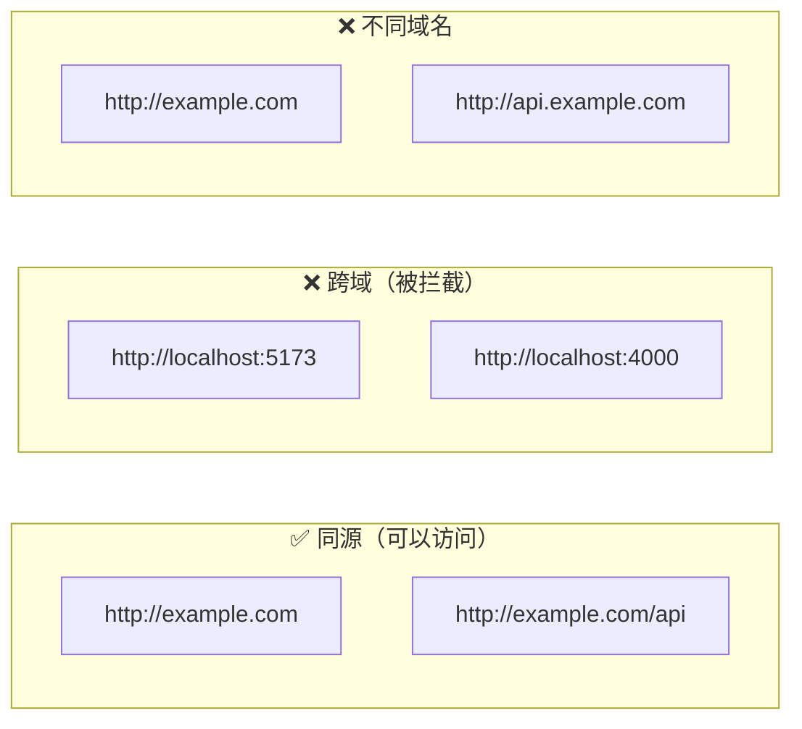
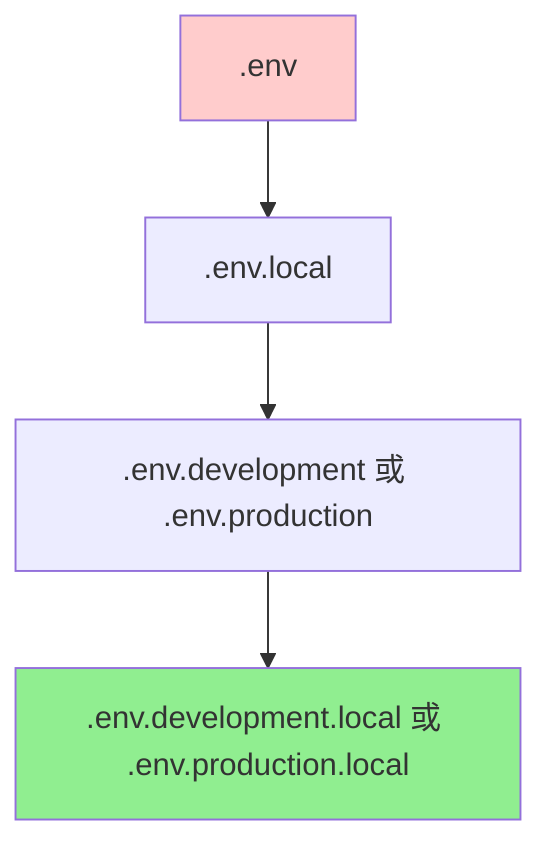

+++
title = "第11章 开发服务器进阶"
weight = 110
date = "2026-03-27T17:13:00+08:00"
type = "docs"
description = ""
isCJKLanguage = true
draft = false
+++

# Chapter-11-Development-Server-Advanced

# 第11章：开发服务器进阶

> 恭喜你已经掌握了 Vite 的基础用法，能跑起来、能热更新、能把项目跑起来不报错——这已经很棒了！但如果你的目标是"专业级"前端开发者，那这一章就是你的必经之路。
>
> 这一章我们要聊的话题，每一個都是"真刀真枪"的实战技能：代理怎么配才能解决跨域？Mock 数据怎么写才能不求人？HTTPS 本地怎么开？自定义中间件怎么写？环境变量怎么用才优雅？
>
> 准备好了吗？让我们开始这场"开发服务器升级之旅"！🚀

---

## 11.1 代理配置详解

### 11.1.1 开发环境跨域问题

"跨域"是前端开发者永远绕不开的话题。当你满怀热情地写完前端代码，兴冲冲地一跑——然后浏览器给你泼了一盆冷水：

```
Access to fetch at 'http://localhost:4000/api/users' from origin 
'http://localhost:5173' has been blocked by CORS policy: 
No 'Access-Control-Allow-Origin' header is present on the requested resource.
```

翻译成人话就是：**"哼，你的代码想去4000端口拿数据，但我是5173端口，浏览器不让我去！"** 😤

**为什么会有跨域？**

这要怪浏览器的"同源策略"（Same-Origin Policy）。想象一下，如果你登录了银行网站，然后打开了另一个恶意网站——那个恶意网站如果能通过 JavaScript 访问银行网站的数据，你的钱可能就不保了。所以浏览器规定：**只有同源（协议+域名+端口都相同）的页面，才能互相访问数据。**



**解决跨域的常见方案**：

| 方案 | 优点 | 缺点 | 推荐指数 |
|------|------|------|----------|
| CORS（后端配置） | 最标准 | 需要后端配合 | ⭐⭐⭐⭐⭐ |
| JSONP | 老浏览器也支持 | 只支持 GET | ⭐ |
| 代理（Proxy） | 简单，不需要改后端 | 只能开发环境用 | ⭐⭐⭐⭐⭐ |
| postMessage | 窗口间通信 | 较复杂 | ⭐⭐ |
| Nginx 反向代理 | 生产环境也可用 | 需要配置 Nginx | ⭐⭐⭐⭐ |

**开发环境最推荐的方案就是——配置代理！** Vite 的代理功能可以把前端的请求"拐个弯"发送到后端服务器，浏览器看到的还是同源请求，自然就不会跨域了。

### 11.1.2 代理配置语法

Vite 的代理配置在 `vite.config.js` 的 `server.proxy` 选项中。让我们来细细拆解它的配置语法。

**基础配置**：

```javascript
// vite.config.js
import { defineConfig } from 'vite'

export default defineConfig({
  server: {
    proxy: {
      // key 是要匹配的请求路径
      // value 是目标服务器地址
      '/api': 'http://localhost:4000',
    }
  }
})
```

**配置详解**：

```javascript
// vite.config.js
export default defineConfig({
  server: {
    proxy: {
      // 基本配置
      '/api': {
        target: 'http://localhost:4000',  // 目标服务器地址（必填）
        changeOrigin: true,                // 是否修改请求头中的 Origin（必填）
        secure: false,                     // 是否验证 SSL 证书（默认 true）
      },
      
      // 更多选项
      '/api2': {
        target: 'https://api.example.com',
        changeOrigin: true,
        secure: true,                     // 如果是 HTTPS，需要设为 true
        rewrite: (path) => path.replace(/^\/api2/, ''),  // 路径重写
        bypass: (req, res, proxyOptions) => {
          // 自定义绕过逻辑
          // return false 则不代理，直接返回响应
          if (req.headers['x-custom-bypass']) {
            res.setHeader('Content-Type', 'application/json')
            res.end(JSON.stringify({ bypassed: true, message: '自定义响应' }))
            return false
          }
        },
      },
      
      // 简写方式（如果不需要额外配置）
      '/auth': 'http://localhost:4000',  // 简写
    }
  }
})
```

**各个配置项详解**：

```javascript
// target：目标服务器地址
// 可以是 http 或 https
target: 'http://localhost:4000'

// changeOrigin：是否修改请求头中的 Origin
// 设为 true 时，Vite 会把请求头中的 Origin 从 localhost:5173 改成 target 的域名
// 这样后端服务器看到的请求就是"来自 localhost:4000 的请求"，而不是"来自 localhost:5173 的跨域请求"
changeOrigin: true

// secure：是否验证 SSL 证书
// 如果目标服务器是 HTTPS 且证书有效，设为 true
// 如果是自签名证书（本地开发常见），设为 false
secure: false

// rewrite：路径重写函数
// 可以在发送请求前修改路径
rewrite: (path) => path.replace(/^\/api/, '')
// 例如：/api/users → /users

// bypass：自定义绕过逻辑
// 返回 false 则不代理请求
// 返回字符串则用这个字符串作为响应
// 返回空则继续正常代理
bypass: (req, res, proxyOptions) => {
  if (req.headers['x-dev-bypass']) {
    // 返回自定义响应
    res.end(JSON.stringify({ bypassed: true }))
    return false
  }
}

// configure：自定义代理行为（高级用法）
configure: (proxy, options) => {
  // 可以监听代理事件
  proxy.on('proxyReq', (proxyReq, req, res) => {
    console.log(`[Proxy] ${req.method} ${req.url} → ${proxyOptions.target}${proxyReq.path}`)
  })
}
```

**实战示例：API 代理配置**：

```javascript
// vite.config.js
export default defineConfig({
  server: {
    port: 5173,
    proxy: {
      // API 请求代理到后端服务器
      '/api': {
        target: 'http://localhost:3000',
        changeOrigin: true,
        // 重写路径：/api/users → /users
        rewrite: (path) => path.replace(/^\/api/, ''),
      },
      
      // 上传接口代理到文件服务器
      '/upload': {
        target: 'http://localhost:8080',
        changeOrigin: true,
      },
      
      // 代理到外部 API（需要设置 secure: false 如果是 http）
      '/external': {
        target: 'https://api.some-service.com',
        changeOrigin: true,
        secure: true,  // 外部 API 通常是 HTTPS
        rewrite: (path) => path.replace(/^\/external/, '/v1'),
      },
    }
  }
})
```

### 11.1.3 WebSocket 代理

现代 Web 应用不只有 HTTP 请求，还有 WebSocket 长连接。Vite 也支持 WebSocket 代理。

**WebSocket 是什么？**

普通的 HTTP 请求是"一问一答"模式：客户端问，服务器答，连接就断了。WebSocket 则是"长连接"模式：建立连接后，双方可以随时互相发消息，常用于聊天、实时通知、在线协作等场景。

**WebSocket 代理配置**：

```javascript
// vite.config.js
export default defineConfig({
  server: {
    proxy: {
      // HTTP 请求代理
      '/api': {
        target: 'http://localhost:4000',
        changeOrigin: true,
      },
      
      // WebSocket 代理
      '/ws': {
        // WebSocket 使用 ws:// 或 wss:// 协议
        target: 'ws://localhost:4000',
        ws: true,  // 启用 WebSocket 代理（关键！）
      },
      
      // 更简洁的写法（Vite 会自动识别 ws:// 和 wss://）
      '/socket': {
        target: 'http://localhost:4000',
        ws: true,
      },
    }
  }
})
```

**完整示例（HTTP + WebSocket）**：

```javascript
// vite.config.js
export default defineConfig({
  server: {
    port: 5173,
    proxy: {
      // REST API
      '/api': {
        target: 'http://localhost:3000',
        changeOrigin: true,
        rewrite: (path) => path.replace(/^\/api/, ''),
      },
      
      // GraphQL API
      '/graphql': {
        target: 'http://localhost:4000',
        changeOrigin: true,
      },
      
      // WebSocket 连接
      '/ws': {
        target: 'ws://localhost:3000',
        ws: true,
      },
      
      // Secure WebSocket
      '/wss': {
        target: 'wss://localhost:3000',
        ws: true,
      },
    }
  }
})
```

**前端使用 WebSocket**：

```javascript
// 建立 WebSocket 连接
const ws = new WebSocket('ws://localhost:5173/ws')

ws.onopen = () => {
  console.log('WebSocket 连接成功！')
  ws.send(JSON.stringify({ type: 'hello', message: '你好服务器！' }))
}

ws.onmessage = (event) => {
  console.log('收到消息：', event.data)
  const data = JSON.parse(event.data)
  
  switch (data.type) {
    case 'notification':
      console.log('📢 通知：', data.message)
      break
    case 'update':
      console.log('🔄 数据更新：', data.payload)
      break
  }
}

ws.onerror = (error) => {
  console.error('WebSocket 错误：', error)
}

ws.onclose = () => {
  console.log('WebSocket 连接关闭')
}
```

### 11.1.4 多代理规则配置

在实际项目中，你可能需要配置多个代理规则，分别代理到不同的后端服务。

**多代理场景**：

```javascript
// vite.config.js
export default defineConfig({
  server: {
    port: 5173,
    proxy: {
      // 主 API 服务（Java/Spring Boot）
      '/api': {
        target: 'http://localhost:8080',
        changeOrigin: true,
        rewrite: (path) => path.replace(/^\/api/, '/rest/v1'),
      },
      
      // 用户认证服务（Node.js/Express）
      '/auth': {
        target: 'http://localhost:3000',
        changeOrigin: true,
      },
      
      // 文件上传服务（Python/FastAPI）
      '/upload': {
        target: 'http://localhost:5000',
        changeOrigin: true,
      },
      
      // 消息推送服务（Go）
      '/ws': {
        target: 'ws://localhost:9000',
        ws: true,
      },
      
      // 第三方外部 API
      '/weather': {
        target: 'https://api.weather.com',
        changeOrigin: true,
        secure: true,
        rewrite: (path) => path.replace(/^\/weather/, '/v3'),
      },
      
      // 静态资源代理到 CDN
      '/static': {
        target: 'https://cdn.example.com',
        changeOrigin: true,
        rewrite: (path) => path.replace(/^\/static/, ''),
      },
    }
  }
})
```

**代理优先级**：代理规则按照**配置顺序**匹配，先匹配的先生效。所以更具体的路径应该放在前面：

```javascript
// ❌ 错误写法：/api/users 会先匹配到 /api
proxy: {
  '/api': { target: 'http://localhost:3000' },      // 会匹配所有 /api 开头的请求
  '/api/users': { target: 'http://localhost:4000' }, // 永远不会匹配到
}

// ✅ 正确写法：更具体的路径放前面
proxy: {
  '/api/users': { target: 'http://localhost:4000' }, // 先匹配这个
  '/api': { target: 'http://localhost:3000' },       // 再匹配这个
}
```

**使用正则匹配**：

```javascript
// vite.config.js
// Vite 支持字符串前缀匹配，也支持正则匹配
export default defineConfig({
  server: {
    proxy: {
      // 使用正则匹配
      // 匹配 /api/v1/users, /api/v2/users 等
      '^/api/v\\d+/users': {
        target: 'http://localhost:4000',
        changeOrigin: true,
        rewrite: (path) => path.replace(/^\/api\/v\d+/, '/users'),
      },
      
      // 匹配所有 /cdn 开头的请求
      '/cdn/.*': {
        target: 'https://my-cdn.example.com',
        changeOrigin: true,
        rewrite: (path) => path.replace(/^\/cdn/, ''),
      },
    }
  }
})
```

### 11.1.5 代理日志调试

调试代理配置时，能够看到请求日志会非常有帮助。Vite 支持开启代理日志：

```javascript
// vite.config.js
export default defineConfig({
  server: {
    proxy: {
      '/api': {
        target: 'http://localhost:4000',
        changeOrigin: true,
        configure: (proxy, options) => {
          // 代理错误事件
          proxy.on('error', (err, req, res) => {
            console.error('🚨 [Proxy Error]', err.message)
            console.log('   请求：', req.method, req.url)
          })
          
          // 请求事件
          proxy.on('proxyReq', (proxyReq, req, res) => {
            console.log('📤 [Proxy Req]', req.method, req.url, '→', options.target + proxyReq.path)
          })
          
          // 响应事件
          proxy.on('proxyRes', (proxyRes, req, res) => {
            console.log('📥 [Proxy Res]', proxyRes.statusCode, req.url)
          })
        },
      },
    }
  }
})
```

**更优雅的日志方案：使用 `onProxyReq`**：

```javascript
// vite.config.js
import { defineConfig } from 'vite'

// 简单的日志函数
function logProxy(type, color, req, extra = '') {
  const time = new Date().toLocaleTimeString('zh-CN')
  const method = req.method.padEnd(6)
  const url = req.url
  console.log(`[\x1b[${color}m${type}\x1b[0m] ${time} ${method} ${url} ${extra}`)
}

export default defineConfig({
  server: {
    proxy: {
      '/api': {
        target: 'http://localhost:4000',
        changeOrigin: true,
        configure: (proxy) => {
          proxy.on('proxyReq', (proxyReq, req) => {
            logProxy('>>>', '36', req, `→ ${proxyReq.path}`)
          })
          
          proxy.on('proxyRes', (proxyRes, req) => {
            logProxy('<<<', '32', req, `← ${proxyRes.statusCode}`)
          })
          
          proxy.on('error', (err, req) => {
            logProxy('ERR', '31', req, err.message)
          })
        },
      },
    },
  },
})
```

**终端日志输出示例**：

```
[>>>] 14:32:15 GET    /api/users → /users
[<<<] 14:32:15 GET    /api/users ← 200
[>>>] 14:32:16 POST   /api/login → /login
[<<<] 14:32:16 POST   /api/login ← 401
[ERR] 14:32:17 GET    /api/users ← connect ECONNREFUSED
```

### 11.1.6 代理超时配置

有时候后端服务响应很慢，或者网络不稳定，代理请求可能会"卡住"。这时候需要配置超时：

```javascript
// vite.config.js
export default defineConfig({
  server: {
    proxy: {
      '/api': {
        target: 'http://localhost:4000',
        changeOrigin: true,
        // 超时配置（单位：毫秒）
        timeout: 30000,  // 30 秒超时
        
        // 也可以分别配置 connect、proxyReq、proxyRes 超时
        proxyTimeout: 30000,
      },
      
      // 配置多个代理
      '/slow-api': {
        target: 'http://localhost:5000',
        changeOrigin: true,
        timeout: 60000,  // 慢接口给 60 秒
      },
    }
  }
})
```

**请求超时前端处理**：

```javascript
// 前端代码中使用 AbortController 处理超时
const controller = new AbortController()
const timeoutId = setTimeout(() => controller.abort(), 10000)  // 10 秒超时

try {
  const response = await fetch('/api/users', {
    signal: controller.signal,
  })
  const data = await response.json()
  console.log(data)
} catch (error) {
  if (error.name === 'AbortError') {
    console.log('⏱️ 请求超时！')
  } else {
    console.error('请求失败：', error)
  }
} finally {
  clearTimeout(timeoutId)
}
```

---

## 11.2 Mock 数据服务

### 11.2.1 vite-plugin-mock 使用

前后端分离开发中，前端往往需要后端 API 还没准备好时就开发现功能。这时候 Mock 数据就成了"救命稻草"。

**Mock 数据是什么？**

Mock 就是"模拟数据"。在没有真实后端的情况下，我们自己写一些"假"的 API 接口，返回"假"的数据，让前端开发能够顺利进行。

**安装 vite-plugin-mock**：

```bash
pnpm add -D vite-plugin-mock
```

**基本配置**：

```javascript
// vite.config.js
import { defineConfig } from 'vite'
import vue from '@vitejs/plugin-vue'
import { viteMockServe } from 'vite-plugin-mock'

export default defineConfig({
  plugins: [
    vue(),
    viteMockServe({
      // mock 文件目录
      mockPath: 'mock',
      
      // 是否启用
      enable: true,
      
      // 是否注入代码（推荐开启）
      injectCode: `
        import { setupMockServer } from './mock/index.js'
        setupMockServer()
      `,
    }),
  ],
})
```

**创建 mock 文件**：

```javascript
// mock/index.js
import { defineMock } from 'vite-plugin-mock'

export default defineMock({
  // 返回数据
  'GET /api/users': [
    { id: 1, name: '小明', age: 25 },
    { id: 2, name: '小红', age: 23 },
    { id: 3, name: '小刚', age: 27 },
  ],
  
  // 返回函数
  'POST /api/login': (config) => {
    const { username, password } = JSON.parse(config.body)
    
    if (username === 'admin' && password === '123456') {
      return {
        code: 0,
        message: '登录成功',
        data: {
          token: 'mock-jwt-token-123456',
          user: { id: 1, name: '管理员', role: 'admin' },
        },
      }
    }
    
    return {
      code: 401,
      message: '用户名或密码错误',
      data: null,
    }
  },
  
  // 动态路由参数
  'GET /api/users/:id': (config) => {
    const id = config.params.id
    return {
      code: 0,
      data: {
        id: Number(id),
        name: `用户${id}`,
        age: 20 + Number(id),
        email: `user${id}@example.com`,
      },
    }
  },
})
```

### 11.2.2 Mock 数据编写

Mock 数据的编写方式有多种，可以根据项目需求选择。

**JSON 数据格式**：

```javascript
// mock/users.js
import { defineMock } from 'vite-plugin-mock'

export default defineMock({
  // 返回固定 JSON 数据
  'GET /api/list': {
    code: 0,
    data: [
      { id: 1, title: '文章1', views: 100 },
      { id: 2, title: '文章2', views: 200 },
      { id: 3, title: '文章3', views: 150 },
    ],
  },
  
  // 带分页的列表
  'GET /api/articles': (config) => {
    const { page = 1, pageSize = 10 } = config.query
    
    const articles = Array.from({ length: 100 }).map((_, i) => ({
      id: i + 1,
      title: `文章标题 ${i + 1}`,
      author: `作者${(i % 10) + 1}`,
      createTime: new Date(Date.now() - i * 86400000).toISOString(),
      views: Math.floor(Math.random() * 10000),
    }))
    
    const start = (Number(page) - 1) * Number(pageSize)
    const end = start + Number(pageSize)
    
    return {
      code: 0,
      data: {
        list: articles.slice(start, end),
        total: 100,
        page: Number(page),
        pageSize: Number(pageSize),
      },
    }
  },
})
```

**函数式 Mock**：

```javascript
// mock/advanced.js
import { defineMock } from 'vite-plugin-mock'

export default defineMock([
  // 搜索接口
  {
    url: '/api/search',
    method: 'get',
    response: (config) => {
      const { q, type = 'all' } = config.query
      return {
        code: 0,
        data: {
          query: q,
          type,
          results: [
            { type: 'article', id: 1, title: `关于 ${q} 的文章` },
            { type: 'user', id: 2, name: `用户 ${q}` },
          ],
        },
      }
    },
  },
  
  // 文件上传接口
  {
    url: '/api/upload',
    method: 'post',
    response: () => {
      return {
        code: 0,
        message: '上传成功',
        data: {
          url: 'https://picsum.photos/400/300',
          filename: 'uploaded-image.jpg',
          size: Math.floor(Math.random() * 1000000),
        },
      }
    },
  },
  
  // 删除接口
  {
    url: '/api/delete/:id',
    method: 'delete',
    response: (config) => {
      return {
        code: 0,
        message: `删除成功，ID: ${config.params.id}`,
        data: null,
      }
    },
  },
  
  // 批量操作
  {
    url: '/api/batch',
    method: 'post',
    response: (config) => {
      const { ids, action } = JSON.parse(config.body)
      return {
        code: 0,
        message: `${action === 'delete' ? '删除' : action}成功`,
        data: {
          success: ids.length,
          failed: 0,
        },
      }
    },
  },
])
```

### 11.2.3 本地 JSON Server

如果你的项目 API 结构比较简单，可以用 `json-server` 来快速搭建一个完整的 REST API。

**安装**：

```bash
pnpm add -D json-server
```

**创建 JSON 数据文件**：

```json
// db.json
{
  "users": [
    { "id": 1, "name": "小明", "email": "xiaoming@example.com", "age": 25 },
    { "id": 2, "name": "小红", "email": "xiaohong@example.com", "age": 23 },
    { "id": 3, "name": "小刚", "email": "xiaogang@example.com", "age": 27 }
  ],
  "posts": [
    { "id": 1, "title": "Vite 入门", "authorId": 1, "views": 100 },
    { "id": 2, "title": "Vue 3 实战", "authorId": 2, "views": 200 },
    { "id": 3, "title": "React 进阶", "authorId": 1, "views": 150 }
  ],
  "comments": [
    { "id": 1, "postId": 1, "content": "写得很好！", "authorId": 2 },
    { "id": 2, "postId": 1, "content": "感谢分享", "authorId": 3 }
  ]
}
```

**配置 package.json**：

```json
{
  "scripts": {
    "mock": "json-server --watch db.json --port 3001 --routes routes.json",
    "mock:static": "json-server db.json"
  }
}
```

**自定义路由**：

```json
// routes.json
{
  "/api/*": "/$1",
  "/users/:id/posts": "/posts?authorId=:id",
  "/posts/:id/comments": "/comments?postId=:id",
  "/posts/popular": "/posts?_sort=views&_order=desc"
}
```

**使用**：

```bash
# 启动 mock 服务器
pnpm mock
```

```
  Resources
  http://localhost:3001/users
  http://localhost:3001/posts
  http://localhost:3001/comments

  Home
  http://localhost:3001
```

### 11.2.4 MSW（Mock Service Worker）

MSW（Mock Service Worker）是一个更专业的 Mock 工具，它使用 Service Worker 拦截网络请求，可以在浏览器和 Node.js 中使用。

**MSW 的优势**：

- 真正拦截网络请求，代码中不需要写 if-else 判断
- 支持浏览器和 Node.js
- 可以 Mock WebSocket
- 接近真实开发环境

**安装 MSW**：

```bash
pnpm add -D msw
```

**初始化 MSW**：

```bash
npx msw init public --save
```

**创建 Mock 处理器**：

```javascript
// src/mocks/handlers.js
import { http, HttpResponse } from 'msw'

export const handlers = [
  // GET 请求
  http.get('/api/users', () => {
    return HttpResponse.json([
      { id: 1, name: '小明', age: 25 },
      { id: 2, name: '小红', age: 23 },
    ])
  }),
  
  // 带参数的 GET 请求
  http.get('/api/users/:id', ({ params }) => {
    const { id } = params
    return HttpResponse.json({
      id: Number(id),
      name: `用户${id}`,
      age: 20 + Number(id),
    })
  }),
  
  // POST 请求
  http.post('/api/login', async ({ request }) => {
    const body = await request.json()
    const { username, password } = body
    
    if (username === 'admin' && password === '123456') {
      return HttpResponse.json({
        code: 0,
        message: '登录成功',
        data: { token: 'mock-token-123' },
      })
    }
    
    return HttpResponse.json({
      code: 401,
      message: '用户名或密码错误',
    }, { status: 401 })
  }),
  
  // 模拟延迟
  http.get('/api/slow', async () => {
    await new Promise(resolve => setTimeout(resolve, 2000))  // 2秒延迟
    return HttpResponse.json({ message: '慢接口返回' })
  }),
  
  // 模拟错误
  http.get('/api/error', () => {
    return HttpResponse.json(
      { code: 500, message: '服务器内部错误' },
      { status: 500 }
    )
  }),
]
```

**创建 Browser Worker**：

```javascript
// src/mocks/browser.js
import { setupWorker } from 'msw/browser'
import { handlers } from './handlers'

export const worker = setupWorker(...handlers)
```

**在入口文件中启用**：

```javascript
// src/main.js（Vue）
import { createApp } from 'vue'
import App from './App.vue'

async function enableMocking() {
  // 如果不是开发环境，跳过 Mock
  if (import.meta.env.DEV) {
    const { worker } = await import('./mocks/browser')
    return worker.start({
      onUnhandledRequest: 'bypass',  // 未处理的请求直接通过
    })
  }
}

enableMocking().then(() => {
  createApp(App).mount('#app')
})
```

### 11.2.5 Mock 配置与路由

无论使用哪种 Mock 工具，良好的配置和路由组织都很重要。

**目录组织**：

```
mock/
├── index.js           # 汇总所有 mock
├── user.js            # 用户相关 API
├── article.js         # 文章相关 API
├── comment.js         # 评论相关 API
└── _utils.js         # 工具函数
```

**Mock 汇总文件**：

```javascript
// mock/index.js
import { defineMock } from 'vite-plugin-mock'
import userMocks from './user'
import articleMocks from './article'
import commentMocks from './comment'

// 合并所有 mock
export default defineMock([
  ...userMocks,
  ...articleMocks,
  ...commentMocks,
])
```

**统一的响应格式**：

```javascript
// mock/_utils.js

// 成功响应
function success(data, message = '操作成功') {
  return {
    code: 0,
    message,
    data,
  }
}

// 失败响应
function error(message = '操作失败', code = 1) {
  return {
    code,
    message,
    data: null,
  }
}

// 分页响应
function paginated(list, total, page, pageSize) {
  return {
    code: 0,
    data: {
      list,
      total,
      page,
      pageSize,
      totalPages: Math.ceil(total / pageSize),
    },
  }
}

export { success, error, paginated }
```

**使用工具函数**：

```javascript
// mock/user.js
import { defineMock } from 'vite-plugin-mock'
import { success, error, paginated } from './_utils'

export default defineMock([
  {
    url: '/api/users',
    method: 'get',
    response: ({ query }) => {
      const { page = 1, pageSize = 10 } = query
      
      const users = Array.from({ length: 50 }).map((_, i) => ({
        id: i + 1,
        name: `用户${i + 1}`,
        email: `user${i + 1}@example.com`,
        age: 18 + Math.floor(Math.random() * 40),
        status: Math.random() > 0.2 ? 'active' : 'inactive',
      }))
      
      const start = (Number(page) - 1) * Number(pageSize)
      const list = users.slice(start, start + Number(pageSize))
      
      return success(paginated(list, 50, Number(page), Number(pageSize)))
    },
  },
  
  {
    url: '/api/users/:id',
    method: 'get',
    response: ({ params }) => {
      return success({
        id: Number(params.id),
        name: `用户${params.id}`,
        email: `user${params.id}@example.com`,
        age: 20 + Number(params.id),
      })
    },
  },
  
  {
    url: '/api/users/:id',
    method: 'put',
    response: ({ params, body }) => {
      return success({
        ...JSON.parse(body),
        id: Number(params.id),
      }, '更新成功')
    },
  },
  
  {
    url: '/api/users/:id',
    method: 'delete',
    response: ({ params }) => {
      return success(null, '删除成功')
    },
  },
])
```

### 11.2.6 Mock 延迟模拟

真实网络环境是有延迟的，Mock 数据也可以模拟延迟，让开发体验更接近真实。

**固定延迟**：

```javascript
// vite-plugin-mock 方式
import { defineMock } from 'vite-plugin-mock'

export default defineMock({
  'GET /api/users': (config) => {
    // 模拟 1 秒延迟
    return new Promise((resolve) => {
      setTimeout(() => {
        resolve({
          code: 0,
          data: [
            { id: 1, name: '小明' },
            { id: 2, name: '小红' },
          ],
        })
      }, 1000)
    })
  },
})
```

**随机延迟**：

```javascript
// 模拟真实的网络延迟（500ms ~ 2000ms）
function mockDelay(min = 500, max = 2000) {
  const delay = Math.floor(Math.random() * (max - min + 1)) + min
  return new Promise((resolve) => setTimeout(resolve, delay))
}

export default defineMock({
  'GET /api/users': async () => {
    await mockDelay()
    return {
      code: 0,
      data: [{ id: 1, name: '小明' }],
    }
  },
  
  'GET /api/search': async () => {
    await mockDelay(1000, 3000)  // 搜索接口延迟 1-3 秒
    return {
      code: 0,
      data: [],
    }
  },
})
```

**MSW 延迟配置**：

```javascript
// MSW 延迟配置
http.get('/api/users', async () => {
  // 模拟网络延迟
  await new Promise(resolve => setTimeout(resolve, 1000))
  return HttpResponse.json([
    { id: 1, name: '小明' },
  ])
})
```

**根据环境决定是否延迟**：

```javascript
// mock/_config.js
export const mockConfig = {
  // 开发环境启用延迟，模拟真实网络
  enableDelay: import.meta.env.DEV,
  defaultDelay: 300,
  maxDelay: 3000,
}

// 条件延迟
function conditionalDelay() {
  if (!mockConfig.enableDelay) return Promise.resolve()
  
  const delay = Math.random() * mockConfig.maxDelay
  return new Promise(resolve => setTimeout(resolve, delay))
}
```

---

## 11.3 HTTPS 开发环境

### 11.3.1 本地证书生成

有时候开发环境需要 HTTPS，比如：
- 测试某些浏览器 API（如地理定位、Notifications）
- 测试 PWA（Service Worker 需要 HTTPS）
- 第三方 SDK 要求 HTTPS

生成自签名证书是本地开发最常用的方式。

**使用 OpenSSL 生成证书**：

```bash
# 1. 创建证书目录
mkdir -p certs

# 2. 生成私钥（Key）
openssl genrsa -out certs/localhost-key.pem 2048

# 3. 生成证书签名请求（CSR）
openssl req -new -key certs/localhost-key.pem -out certs/localhost.csr

# 4. 生成自签名证书（CRT）
openssl x509 -req -in certs/localhost.csr -signkey certs/localhost-key.pem -out certs/localhost.pem -days 365

# 5. 合并证书（可选，有些工具需要 PFX 格式）
openssl pkcs12 -export -in certs/localhost.pem -inkey certs/localhost-key.pem -out certs/localhost.pfx
```

**一键生成脚本**（保存为 `generate-cert.sh`）：

```bash
#!/bin/bash
# 生成自签名 HTTPS 证书

CERT_DIR="certs"
DOMAIN="localhost"

mkdir -p $CERT_DIR

# 生成私钥和证书
openssl req -x509 -newkey rsa:4096 -sha256 -nodes \
  -keyout "$CERT_DIR/$DOMAIN-key.pem" \
  -out "$CERT_DIR/$DOMAIN.pem" \
  -days 365 \
  -subj "/C=CN/ST=Beijing/L=Beijing/O=Development/CN=$DOMAIN"

echo "✅ 证书生成成功！"
echo "   证书文件：$CERT_DIR/$DOMAIN.pem"
echo "   私钥文件：$CERT_DIR/$DOMAIN-key.pem"
```

### 11.3.2 @vitejs/plugin-basic-ssl

Vite 官方提供了一个简单的 HTTPS 插件，可以自动生成自签名证书。

**安装**：

```bash
pnpm add -D @vitejs/plugin-basic-ssl
```

**配置**：

```javascript
// vite.config.js
import { defineConfig } from 'vite'
import vue from '@vitejs/plugin-vue'
import basicSsl from '@vitejs/plugin-basic-ssl'

export default defineConfig({
  plugins: [
    vue(),
    basicSsl(),  // 启用自动 HTTPS
  ],
  server: {
    https: true,  // 还需要设置 https: true
  },
})
```

**使用效果**：

```
  VITE v5.4.0  ready in 320 ms

  ➜  Local:   https://localhost:5173/
  ➜  Network: https://192.168.1.100:5173/
```

> ⚠️ **浏览器警告**：第一次访问时，浏览器会显示"您的连接不是私密连接"警告。点击"高级" → "继续前往 localhost（不安全）"即可。

### 11.3.3 自定义证书配置

如果使用自己的证书，需要在 Vite 配置中指定证书路径：

```javascript
// vite.config.js
import { defineConfig } from 'vite'
import vue from '@vitejs/plugin-vue'
import path from 'path'

export default defineConfig({
  plugins: [vue()],
  server: {
    https: {
      // 证书文件
      cert: path.resolve(__dirname, 'certs/localhost.pem'),
      // 私钥文件
      key: path.resolve(__dirname, 'certs/localhost-key.pem'),
      // PFX 格式（可选）
      // pfx: path.resolve(__dirname, 'certs/localhost.pfx'),
      // PFX 密码（如果有）
      // passphrase: 'your-password',
    },
    port: 5173,
  },
})
```

**多域名证书配置**：

```javascript
// vite.config.js
import { defineConfig } from 'vite'
import vue from '@vitejs/plugin-vue'
import fs from 'fs'
import path from 'path'

export default defineConfig({
  plugins: [vue()],
  server: {
    https: {
      // 方式一：单域名证书
      cert: fs.readFileSync(path.resolve(__dirname, 'certs/localhost.pem')),
      key: fs.readFileSync(path.resolve(__dirname, 'certs/localhost-key.pem')),
      
      // 方式二：支持多域名（需要 OpenSSL 支持）
      // 使用 SAN（Subject Alternative Name）证书
      cert: fs.readFileSync(path.resolve(__dirname, 'certs/multi-domain.pem')),
      key: fs.readFileSync(path.resolve(__dirname, 'certs/multi-domain-key.pem')),
    },
  },
})
```

### 11.3.4 mkcert 工具使用

`mkcert` 是一个更简单、更专业的本地 HTTPS 证书生成工具，由 Filippo Valsorda 开发。

**安装 mkcert**：

```bash
# Windows（需要先安装 Chocolatey）
choco install mkcert

# macOS
brew install mkcert

# Linux（需要先安装 certutil）
sudo apt install libnss3-tools
brew install mkcert
```

**生成证书**：

```bash
# 安装本地 CA（证书颁发机构）
mkcert -install

# 生成 localhost 证书
mkcert localhost

# 生成多个域名证书
mkcert localhost 127.0.0.1 ::1

# 生成带通配符的证书
mkcert "*.localhost"
```

**生成的文件**：

```
localhost-key.pem    # 私钥
localhost.pem        # 证书
```

**Vite 配置**：

```javascript
// vite.config.js
import { defineConfig } from 'vite'
import vue from '@vitejs/plugin-vue'
import path from 'path'

export default defineConfig({
  plugins: [vue()],
  server: {
    https: {
      key: path.resolve(__dirname, 'localhost-key.pem'),
      cert: path.resolve(__dirname, 'localhost.pem'),
    },
    port: 5173,
  },
})
```

**mkcert vs 自签名证书**：

| 特性 | mkcert | OpenSSL 自签名 |
|------|--------|---------------|
| 根 CA 安装 | 自动安装到系统信任存储 | 需要手动信任 |
| 浏览器警告 | 首次信任后不再警告 | 每次都警告 |
| 多域名支持 | 支持 | 需要手动配置 |
| 泛域名支持 | 支持 | 需要手动配置 |
| 跨设备 | 困难 | 可以复制证书 |

---

## 11.4 自定义中间件

### 11.4.1 configureServer 钩子

Vite 的 `configureServer` 钩子是开发服务器最强大的扩展点。它允许你在 Vite 开发服务器中添加自定义中间件。

**什么是中间件？**

中间件是一种"拦截器"模式——请求先经过中间件处理，再到达目的地（或者被中间件直接处理）。


**configureServer 基本用法**：

```javascript
// vite.config.js
import { defineConfig } from 'vite'
import vue from '@vitejs/plugin-vue'

export default defineConfig({
  plugins: [
    vue(),
  ],
  server: {
    port: 5173,
  },
})

// 在插件中使用 configureServer
// （完整示例见 11.4.2 节）
```

### 11.4.2 编写自定义中间件

创建一个自定义中间件插件：

```javascript
// vite.config.js
import { defineConfig } from 'vite'
import vue from '@vitejs/plugin-vue'

// 自定义中间件函数
function myCustomMiddleware() {
  return {
    name: 'my-custom-middleware',
    
    // configureServer 钩子
    configureServer(server) {
      // server 是 ViteDevServer 实例
      // server.middlewares 是 Express 风格的中间件栈
      
      // 添加请求日志中间件
      server.middlewares.use((req, res, next) => {
        const start = Date.now()
        
        // 请求结束时的日志
        res.on('finish', () => {
          const duration = Date.now() - start
          const color = res.statusCode >= 400 ? '31' : '32'  // 红色错误，绿色成功
          console.log(`[\x1b[${color}m${res.statusCode}\x1b[0m] ${req.method} ${req.url} - ${duration}ms`)
        })
        
        next()
      })
      
      // 添加认证检查中间件
      server.middlewares.use('/api/protected', (req, res, next) => {
        const token = req.headers.authorization
        
        if (!token) {
          res.statusCode = 401
          res.end(JSON.stringify({ error: '未授权，请先登录' }))
          return
        }
        
        if (!verifyToken(token)) {
          res.statusCode = 403
          res.end(JSON.stringify({ error: 'Token 无效' }))
          return
        }
        
        next()
      })
      
      // 添加自定义 API 路由
      server.middlewares.use('/api/stats', (req, res) => {
        res.setHeader('Content-Type', 'application/json')
        res.end(JSON.stringify({
          uptime: process.uptime(),
          memory: process.memoryUsage(),
          requests: requestCounter,
        }))
      })
    },
  }
}

export default defineConfig({
  plugins: [
    vue(),
    myCustomMiddleware(),
  ],
})
```

**请求计数器**：

```javascript
// 带状态的中间件
function requestCounterMiddleware() {
  let requestCount = 0
  
  return {
    name: 'request-counter',
    configureServer(server) {
      server.middlewares.use((req, res, next) => {
        requestCount++
        req.requestId = requestCount
        next()
      })
    },
  }
}
```

### 11.4.3 中间件应用场景

**场景一：请求日志**：

```javascript
// 请求日志中间件
function requestLogger() {
  return {
    name: 'request-logger',
    configureServer(server) {
      server.middlewares.use((req, res, next) => {
        const { method, url } = req
        const start = Date.now()
        
        res.on('finish', () => {
          const duration = Date.now() - start
          const status = res.statusCode
          const timestamp = new Date().toISOString()
          
          console.log(
            `[${timestamp}] ${method.padEnd(7)} ${status} ${duration.toString().padStart(4)}ms ${url}`
          )
        })
        
        next()
      })
    },
  }
}
```

**场景二：认证中间件**：

```javascript
// JWT 认证中间件
function authMiddleware() {
  const validTokens = new Set(['token-123', 'token-456'])
  
  return {
    name: 'auth-middleware',
    configureServer(server) {
      server.middlewares.use('/api/', (req, res, next) => {
        // 公开接口不需要认证
        if (req.url.startsWith('/api/public')) {
          return next()
        }
        
        const auth = req.headers.authorization
        
        if (!auth || !auth.startsWith('Bearer ')) {
          res.statusCode = 401
          res.setHeader('Content-Type', 'application/json')
          res.end(JSON.stringify({ error: '缺少认证令牌' }))
          return
        }
        
        const token = auth.slice(7)  // 去掉 "Bearer " 前缀
        
        if (!validTokens.has(token)) {
          res.statusCode = 403
          res.setHeader('Content-Type', 'application/json')
          res.end(JSON.stringify({ error: '无效的令牌' }))
          return
        }
        
        // 把用户信息挂载到请求对象上
        req.user = { id: 1, name: 'Admin' }
        next()
      })
    },
  }
}
```

**场景三：限流中间件**：

```javascript
// 简单限流中间件
function rateLimitMiddleware() {
  const requestMap = new Map()
  const WINDOW_MS = 60 * 1000  // 1 分钟窗口
  const MAX_REQUESTS = 100     // 最多 100 个请求
  
  return {
    name: 'rate-limit',
    configureServer(server) {
      server.middlewares.use((req, res, next) => {
        const now = Date.now()
        const ip = req.socket.remoteAddress || 'unknown'
        
        // 获取或初始化该 IP 的请求记录
        if (!requestMap.has(ip)) {
          requestMap.set(ip, { count: 0, resetTime: now + WINDOW_MS })
        }
        
        const record = requestMap.get(ip)
        
        // 检查是否需要重置计数器
        if (now > record.resetTime) {
          record.count = 0
          record.resetTime = now + WINDOW_MS
        }
        
        // 检查是否超限
        if (record.count >= MAX_REQUESTS) {
          res.statusCode = 429
          res.setHeader('Content-Type', 'application/json')
          res.setHeader('Retry-After', Math.ceil((record.resetTime - now) / 1000))
          res.end(JSON.stringify({ error: '请求过于频繁，请稍后再试' }))
          return
        }
        
        record.count++
        next()
      })
    },
  }
}
```

**场景四：CORS 中间件**：

```javascript
// 自定义 CORS 中间件
function corsMiddleware() {
  const allowedOrigins = [
    'http://localhost:5173',
    'http://localhost:3000',
    'https://my-app.vercel.app',
  ]
  
  return {
    name: 'cors-middleware',
    configureServer(server) {
      server.middlewares.use((req, res, next) => {
        const origin = req.headers.origin
        
        // 检查 origin 是否在允许列表中
        if (allowedOrigins.includes(origin)) {
          res.setHeader('Access-Control-Allow-Origin', origin)
        }
        
        res.setHeader('Access-Control-Allow-Methods', 'GET, POST, PUT, DELETE, OPTIONS')
        res.setHeader('Access-Control-Allow-Headers', 'Content-Type, Authorization')
        res.setHeader('Access-Control-Allow-Credentials', 'true')
        
        // 处理预检请求
        if (req.method === 'OPTIONS') {
          res.statusCode = 204
          res.end()
          return
        }
        
        next()
      })
    },
  }
}
```

### 11.4.4 preAndPostHooks（前后置钩子）

除了 `configureServer`，Vite 还提供了其他钩子用于扩展功能。

**server 钩子概览**：

| 钩子 | 说明 |
|------|------|
| `configureServer` | 配置开发服务器 |
| `configurePreviewServer` | 配置预览服务器 |
| `transformIndexHtml` | 转换 index.html |
| `handleHotUpdate` | 处理热更新 |

**transformIndexHtml 钩子**：

```javascript
// 转换 index.html，注入脚本或样式
function injectScriptPlugin() {
  return {
    name: 'inject-script',
    transformIndexHtml(html) {
      return html.replace(
        '</body>',
        `
        <script>
          // 注入环境信息
          window.__ENV__ = {
            version: '${process.env.npm_package_version}',
            buildTime: new Date().toISOString(),
          }
        </script>
        </body>
        `
      )
    },
  }
}
```

**handleHotUpdate 钩子**：

```javascript
// 热更新钩子
function hotUpdateLoggerPlugin() {
  return {
    name: 'hot-update-logger',
    handleHotUpdate({ server, file, modules }) {
      console.log(`🔄 热更新：${file}`)
      
      // 如果是 CSS 文件，不刷新页面
      if (file.endsWith('.css')) {
        console.log('   CSS 更新，注入更新...')
        return  // 继续默认的 HMR 处理
      }
      
      // 如果是 Vue 文件，记录组件名
      if (file.endsWith('.vue')) {
        console.log('   Vue 组件更新')
      }
      
      // 如果需要，可以返回自定义的 modules 数组
      // return []  // 返回空数组会跳过 HMR
    },
  }
}
```

---

## 11.5 环境变量深入

### 11.5.1 .env 文件详解

Vite 使用 `.env` 文件来管理不同环境的配置变量。这些文件会被自动加载到 `import.meta.env` 对象中。

**创建 .env 文件**：

```bash
# .env（所有环境都会加载）
VITE_APP_TITLE=我的应用
VITE_API_BASE_URL=http://localhost:3000

# .env.development（开发环境，会覆盖 .env）
VITE_APP_TITLE=我的应用（开发）
VITE_DEBUG=true

# .env.production（生产环境）
VITE_APP_TITLE=我的应用
VITE_DEBUG=false

# .env.local（不会被 git 提交）
VITE_LOCAL_ONLY=value
```

**环境变量命名规则**：

```bash
# ✅ 正确：VITE_ 前缀
VITE_API_BASE_URL=https://api.example.com
VITE_APP_VERSION=1.0.0
VITE_UPLOAD_MAX_SIZE=10485760

# ❌ 错误：没有 VITE_ 前缀，不会被加载
API_BASE_URL=https://api.example.com
APP_TITLE=我的应用

# ⚠️ 特殊情况：NODE_ 开头的会被 Node.js 保留
NODE_ENV=development  # 这是 Node.js 的，不是 Vite 的
```

### 11.5.2 环境变量加载优先级

Vite 按以下顺序加载 `.env` 文件，后加载的会覆盖先加载的：

```
.env                      # 基础配置，所有环境加载
.env.local                # 本地覆盖，所有环境加载，不会被 git 提交
.env.[mode]               # 模式特定配置
.env.[mode].local         # 模式特定本地配置，不会被 git 提交
```

**加载优先级（从低到高）**：



**实际例子**：

```bash
# .env
VITE_TITLE=基础标题
VITE_API=http://localhost:3000
VITE_DEBUG=false

# .env.development
VITE_TITLE=开发标题
VITE_DEBUG=true

# .env.local（不会被 git 提交）
VITE_API=http://localhost:4000
```

在开发环境下，最终加载的结果：

```javascript
console.log(import.meta.env.VITE_TITLE)   // "开发标题"（被 .env.development 覆盖）
console.log(import.meta.env.VITE_API)    // "http://localhost:4000"（被 .env.local 覆盖）
console.log(import.meta.env.VITE_DEBUG)  // true（被 .env.development 覆盖）
```

### 11.5.3 模式（Mode）与环境

Vite 的 `mode` 选项决定加载哪个环境文件。

**默认模式**：

| 命令 | 默认模式 |
|------|----------|
| `pnpm dev` | `development` |
| `pnpm build` | `production` |
| `pnpm preview` | `production` |
| `pnpm test` | `test` |

**自定义模式**：

```bash
# 使用自定义模式 staging
pnpm build --mode staging

# .env.staging 会被加载
# 如果 .env.staging 不存在，会回退到 .env
```

**指定模式加载特定环境文件**：

```bash
# 使用 .env.staging 文件
pnpm build --mode staging

# .env.staging 和 .env.staging.local 会被加载
```

### 11.5.4 import.meta.env 使用

`import.meta.env` 是 Vite 在运行时会替换为实际值的内置对象。

**内置环境变量**：

| 变量 | 说明 |
|------|------|
| `import.meta.env.MODE` | 当前模式（'development' \| 'production'） |
| `import.meta.env.DEV` | 是否开发模式（boolean） |
| `import.meta.env.PROD` | 是否生产模式（boolean） |
| `import.meta.env.SSR` | 是否 SSR 模式（boolean） |
| `import.meta.env.BASE_URL` | 部署时的公共基础路径（默认'/'） |
| `import.meta.env.RESOLVED_BASE_URL` | 经过解析后的 base URL（内部使用） |

**自定义环境变量**：

```bash
# .env.development
VITE_API_BASE_URL=http://localhost:3000
VITE_WS_URL=ws://localhost:3000
VITE_MAP_KEY=your-map-api-key
```

**在代码中使用**：

```javascript
// 在 Vue/React 组件中
console.log(import.meta.env.VITE_API_BASE_URL)  // http://localhost:3000

// 根据环境选择 API 地址
const apiBase = import.meta.env.VITE_API_BASE_URL

// 判断是否开发环境
if (import.meta.env.DEV) {
  console.log('🛠️ 开发模式')
}

// 在模板字符串中使用
const config = {
  apiUrl: `${import.meta.env.VITE_API_BASE_URL}/api/v1`,
  wsUrl: import.meta.env.VITE_WS_URL,
}

// 构建时会被替换（重要！）
// 在构建时，Vite 会把 import.meta.env.VITE_* 替换为实际值
// 所以这行代码在生产构建后：
//   console.log('http://localhost:3000')
// 而不是：
//   console.log(import.meta.env.VITE_API_BASE_URL)
```

### 11.5.5 环境变量的类型提示

TypeScript 项目中，可以为环境变量添加类型提示。

**创建类型声明文件**：

```typescript
// src/types/env.d.ts
/// <reference types="vite/client" />

interface ImportMetaEnv {
  readonly VITE_APP_TITLE: string
  readonly VITE_API_BASE_URL: string
  readonly VITE_WS_URL: string
  readonly VITE_MAP_KEY: string
  readonly VITE_UPLOAD_MAX_SIZE: string
}

interface ImportMeta {
  readonly env: ImportMetaEnv
}
```

**创建环境变量配置文件**：

```typescript
// src/config/env.ts
// 集中管理环境变量，提供类型安全

interface EnvConfig {
  app: {
    title: string
    version: string
  }
  api: {
    baseUrl: string
    timeout: number
  }
  ws: {
    url: string
  }
  features: {
    enableAnalytics: boolean
    enableDebug: boolean
  }
}

function loadEnvConfig(): EnvConfig {
  return {
    app: {
      title: import.meta.env.VITE_APP_TITLE || '默认标题',
      version: import.meta.env.VITE_APP_VERSION || '1.0.0',
    },
    api: {
      baseUrl: import.meta.env.VITE_API_BASE_URL || '/api',
      timeout: Number(import.meta.env.VITE_API_TIMEOUT) || 30000,
    },
    ws: {
      url: import.meta.env.VITE_WS_URL || 'ws://localhost:3000',
    },
    features: {
      enableAnalytics: import.meta.env.VITE_ENABLE_ANALYTICS === 'true',
      enableDebug: import.meta.env.VITE_DEBUG === 'true',
    },
  }
}

export const envConfig = loadEnvConfig()
```

**使用配置**：

```typescript
// 在组件中使用
import { envConfig } from '@/config/env'

console.log(envConfig.app.title)  // 有类型提示
console.log(envConfig.api.baseUrl)  // 有类型提示
```

---

## 11.6 本章小结

### 🎉 本章总结

这一章我们深入探索了 Vite 开发服务器的进阶技能：

1. **代理配置详解**：跨域问题的原因、代理配置语法（target/changeOrigin/rewrite）、WebSocket 代理、多代理规则、日志调试、超时配置

2. **Mock 数据服务**：vite-plugin-mock 使用、Mock 数据编写（JSON/函数式）、JSON Server、MSW（Service Worker Mock）、路由组织、延迟模拟

3. **HTTPS 开发环境**：本地证书生成（OpenSSL）、@vitejs/plugin-basic-ssl、自定义证书配置、mkcert 工具使用

4. **自定义中间件**：configureServer 钩子、请求日志中间件、认证中间件、限流中间件、CORS 中间件、transformIndexHtml/handleHotUpdate 钩子

5. **环境变量深入**：.env 文件详解、加载优先级、模式与环境、import.meta.env 使用、类型提示

### 📝 本章练习

1. **代理实战**：配置一个代理，把 `/api` 请求代理到 `http://localhost:3000`，并开启日志调试

2. **Mock 数据**：使用 vite-plugin-mock 创建一个完整的用户 CRUD Mock API

3. **HTTPS 环境**：使用 mkcert 配置本地 HTTPS 环境

4. **自定义中间件**：编写一个简单的请求日志中间件

5. **环境变量**：配置开发/生产/预发布环境，体会加载优先级

---

> 📌 **预告**：下一章我们将进入 **生产构建优化**，学习 Rollup 配置、代码压缩、Tree Shaking、产物分析、兼容性处理、CDN 发布等内容。敬请期待！
