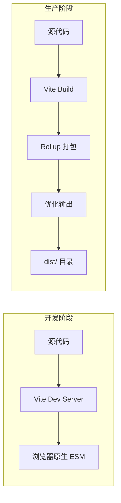
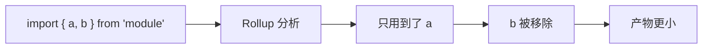
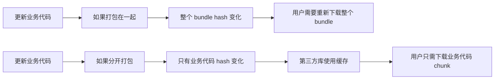

+++
title = "第12章 生产构建优化"
weight = 120
date = "2026-03-27T17:13:00+08:00"
type = "docs"
description = ""
isCJKLanguage = true
draft = false
+++

# Chapter-12-Production-Build-Optimization

# 第12章：生产构建优化

> 开发时飞快，那叫一个爽。但代码最终是要部署上线的，上线之后能不能"飞起来"，就全靠生产构建优化了。
>
> 这一章我们要聊的话题直接决定了你的网站"快不快"：Rollup 怎么配置？代码怎么压缩？Tree Shaking 怎么做？产物怎么分析？兼容怎么处理？CDN 怎么接？
>
> 学完这章，你的网站加载速度能快到让用户"wow"一声！🚀

---

## 12.1 构建配置深入

### 12.1.1 Rollup 选项配置

Vite 在生产构建时使用的是 **Rollup** 作为打包器。Rollup 是一个专注于 ES Module 的打包工具，擅长 Tree Shaking 和代码分割。

**Rollup 是什么？**

Rollup 和 Webpack 一样，都是"打包工具"。但 Rollup 有几个显著特点：
- **Tree Shaking 能力更强**：Rollup 基于 ES Module，静态分析更精准
- **输出格式更干净**：没有 Webpack 那样的运行时代码
- **更适合库**：如果你在构建一个 npm 包，Rollup 是首选

**Rollup 在 Vite 中的位置**：



**在 vite.config.js 中配置 Rollup**：

```javascript
// vite.config.js
import { defineConfig } from 'vite'
import vue from '@vitejs/plugin-vue'

export default defineConfig({
  build: {
    // Rollup 选项
    rollupOptions: {
      // 输入配置
      input: {
        main: path.resolve(__dirname, 'index.html'),
        // 多页面应用
        // admin: path.resolve(__dirname, 'admin.html'),
        // landing: path.resolve(__dirname, 'landing.html'),
      },
      
      // 输出配置
      output: {
        // 输出目录
        dir: 'dist',
        
        // 入口文件名
        entryFileNames: 'js/[name]-[hash].js',
        
        // chunk 文件名
        chunkFileNames: 'js/[name]-[hash].js',
        
        // 静态资源文件名
        assetFileNames: 'assets/[name]-[hash][extname]',
        
        // 手动分包
        manualChunks: {
          // vue 相关库打包到一起
          vue: ['vue', 'vue-router', 'pinia'],
        },
        
        // 是否生成 sourcemap
        // 'inline' | 'hidden' | false
        sourcemap: false,
      },
      
      // 是否将动态导入的模块内联到主 bundle
      // true: 所有动态导入的模块都内联到一个文件中
      // false（默认）: 每个动态导入模块单独生成一个 chunk
      inlineDynamicImports: false,
      
      // 外部依赖（不打包）
      external: [],
      
      // 插件
      plugins: [],
    },
  },
})
```

### 12.1.2 输出格式选择

Rollup 支持多种输出格式，适用于不同的使用场景。

**Rollup 输出格式详解**：

| 格式 | 说明 | 适用场景 |
|------|------|----------|
| `es` | ES Module（`import/export`） | 现代浏览器，支持 ESM 的应用 |
| `cjs` | CommonJS（`require/module.exports`） | Node.js 环境，老项目 |
| `umd` | Universal Module Definition | 同时支持浏览器和 Node.js |
| `iife` | Immediately Invoked Function Expression | 浏览器直接引入（`<script>` 标签） |
| `system` | SystemJS | 旧版模块系统（基本不用了） |

**在 Vite 库模式中指定格式**：

```javascript
// vite.config.js
export default defineConfig({
  build: {
    lib: {
      entry: path.resolve(__dirname, 'src/index.ts'),
      name: 'MyLibrary',
      formats: ['es', 'cjs', 'umd'],
      fileName: (format) => `my-library.${format}.js`,
    },
  },
})
```

**各格式输出示例**：

```javascript
// ES Module 输出（es）
// 适合现代浏览器
export { createApp, createRouter } from 'vue'

// CommonJS 输出（cjs）
// 适合 Node.js
exports.createApp = createApp
exports.createRouter = createRouter

// UMD 输出（umd）
// 同时支持浏览器和 Node.js
(function(root, factory) {
  if (typeof module === 'object' && module.exports) {
    module.exports = factory()
  } else {
    root.MyLibrary = factory()
  }
}(this, function() {
  return { createApp, createRouter }
}))

// IIFE 输出（iife）
// 浏览器直接用
var MyLibrary = (function() {
  'use strict'
  return { createApp, createRouter }
})()
```

### 12.1.3 库模式构建

如果你在构建一个 JavaScript 库（而不是 Web 应用），Vite 的库模式非常有用。

**库模式配置**：

```javascript
// vite.config.js
import { defineConfig } from 'vite'
import vue from '@vitejs/plugin-vue'
import path from 'path'

export default defineConfig({
  build: {
    lib: {
      // 库的入口文件
      entry: path.resolve(__dirname, 'src/index.ts'),
      
      // 库名称（全局变量名，UMD/IIFE 模式使用）
      name: 'MyVueComponents',
      
      // 输出文件名格式
      // 会生成：my-vue-components.es.js, my-vue-components.cjs.js, my-vue-components.umd.js
      fileName: (format) => `my-vue-components.${format}.js`,
      
      // 支持的输出格式
      formats: ['es', 'cjs', 'umd'],
    },
    
    // 库模式下关闭 CSS 分割
    cssCodeSplit: false,
    
    // Rollup 选项
    rollupOptions: {
      // UMD 模式下需要的全局变量
      // external: ['react', 'react-dom'],
      // globals: {
      //   react: 'React',
      //   'react-dom': 'ReactDOM',
      // },
      
      // 输出配置
      output: {
        // 对于 UMD 构建，需要提供全局变量名
        // globals: {
        //   vue: 'Vue',
        // },
      },
    },
  },
})
```

**库的入口文件示例**：

```typescript
// src/index.ts

// 导出所有组件
export { default as Button } from './components/Button.vue'
export { default as Input } from './components/Input.vue'
export { default as Modal } from './components/Modal.vue'

// 导出工具函数
export { formatDate } from './utils/date'
export { debounce, throttle } from './utils/function'

// 导出类型
export type { ButtonProps } from './components/Button.vue'
export type { InputProps } from './components/Input.vue'
```

### 12.1.4 外部化依赖

有时候我们不希望把某些依赖打包进产物中，比如：
- 库依赖了 React，希望使用者已经安装了 React
- 体积很大的库，通过 CDN 引入
- peerDependencies 中的包

**external 配置**：

```javascript
// vite.config.js
export default defineConfig({
  build: {
    rollupOptions: {
      // 外部依赖，这些包不会被打包
      external: [
        'react',                    // npm 包名
        'react-dom',
        'lodash',
        /node_modules\/vue/,      // 正则匹配
      ],
      
      // 配置外部化的包的全局变量名
      output: {
        globals: {
          react: 'React',
          'react-dom': 'ReactDOM',
        },
      },
    },
  },
})
```

**HTML 中引入 CDN**：

```html
<!-- index.html -->
<!DOCTYPE html>
<html lang="zh-CN">
<head>
  <!-- 通过 CDN 引入外部依赖 -->
  <script src="https://unpkg.com/react@18/umd/react.production.min.js"></script>
  <script src="https://unpkg.com/react-dom@18/umd/react-dom.production.min.js"></script>
</head>
<body>
  <div id="root"></div>
  <script type="module" src="/src/main.jsx"></script>
</body>
</html>
```

### 12.1.5 输出命名规范

Vite 允许自定义输出文件的命名规则，利用 hash 来实现缓存控制。

**命名模板变量**：

| 变量 | 说明 | 示例 |
|------|------|------|
| `[name]` | 入口/模块名称 | `main`, `index` |
| `[hash]` | 内容 hash（整个构建） | `a1b2c3d4` |
| `[hash:N]` | hash 前 N 位 | `[hash:8]` = `a1b2c3d4` |
| `[ext]` | 文件扩展名（带点） | `.js` |
| `[extname]` | 扩展名（不带点） | `js` |

**配置示例**：

```javascript
// vite.config.js
export default defineConfig({
  build: {
    rollupOptions: {
      output: {
        // 入口文件名：main-a1b2c3d4.js
        entryFileNames: 'js/[name]-[hash:8].js',
        
        // chunk 文件名：chunk-vendor-a1b2c3d4.js
        chunkFileNames: 'js/[name]-[hash:8].js',
        
        // 静态资源：assets/logo-a1b2c3d4.png
        assetFileNames: (assetInfo) => {
          const info = assetInfo.name.split('.')
          const ext = info[info.length - 1]
          
          if (/\.(png|jpe?g|svg|gif|webp)$/.test(assetInfo.name)) {
            return `images/[name]-[hash:8].[ext]`
          }
          
          if (/\.(woff2?|eot|ttf|otf)$/.test(assetInfo.name)) {
            return `fonts/[name]-[hash:8].[ext]`
          }
          
          return `assets/[name]-[hash:8].[ext]`
        },
      },
    },
  },
})
```

### 12.1.6 构建入口配置

Vite 支持多种构建入口配置，适用于不同的项目结构。

**单入口配置**：

```javascript
// 默认入口是 index.html
// 不需要额外配置

export default defineConfig({
  build: {
    // 可以指定根目录
    root: '.',
    
    rollupOptions: {
      input: path.resolve(__dirname, 'index.html'),
    },
  },
})
```

**多页面应用（MPA）配置**：

```javascript
// vite.config.js
import { defineConfig } from 'vite'
import vue from '@vitejs/plugin-vue'
import path from 'path'

export default defineConfig({
  plugins: [vue()],
  build: {
    rollupOptions: {
      input: {
        // 主应用
        main: path.resolve(__dirname, 'index.html'),
        
        // 管理后台
        admin: path.resolve(__dirname, 'admin.html'),
        
        // Landing Page
        landing: path.resolve(__dirname, 'landing.html'),
        
        // 帮助中心
        help: path.resolve(__dirname, 'help.html'),
      },
    },
  },
})
```

**项目结构**：

```
my-project/
├── index.html        # 主应用
├── admin.html        # 管理后台
├── landing.html      # Landing Page
├── help.html         # 帮助中心
└── src/
    ├── main/         # 主应用源码
    ├── admin/        # 管理后台源码
    ├── landing/      # Landing Page 源码
    └── help/         # 帮助中心源码
```

**动态入口**：

```javascript
// vite.config.js
import { defineConfig } from 'vite'
import vue from '@vitejs/plugin-vue'
import path from 'path'
import fs from 'fs'

// 自动扫描所有 html 文件作为入口
function getHtmlEntries() {
  const entries = {}
  const htmlFiles = fs.readdirSync(__dirname)
    .filter(file => file.endsWith('.html'))
    .filter(file => file !== '404.html')  // 排除 404
  
  htmlFiles.forEach(file => {
    const name = file.replace('.html', '')
    entries[name] = path.resolve(__dirname, file)
  })
  
  return entries
}

export default defineConfig({
  build: {
    rollupOptions: {
      input: getHtmlEntries(),
    },
  },
})
```

---

## 12.2 性能优化策略

### 12.2.1 代码压缩与混淆

代码压缩是减小产物体积的最直接手段。Vite 默认使用 esbuild 进行压缩，比传统 terser 快 20-40 倍。

**esbuild 压缩（默认）**：

```javascript
// vite.config.js
export default defineConfig({
  build: {
    // 默认：'esbuild'
    // 压缩速度快，但压缩率不是最优
    minify: 'esbuild',
    
    // 关闭压缩（调试用）
    // minify: false,
  },
})
```

**terser 压缩**（更小但更慢）：

```bash
pnpm add -D terser
```

```javascript
// vite.config.js
export default defineConfig({
  build: {
    // 使用 terser 压缩（更慢但更小）
    minify: 'terser',
    
    terserOptions: {
      compress: {
        // 删除所有 console.log
        drop_console: true,
        // 删除所有 debugger
        drop_debugger: true,
        // 移除所有 console.*
        pure_funcs: ['console.log', 'console.info', 'console.debug'],
        // 启用所有压缩优化
        passes: 2,
        // 移除未使用的代码
        dead_code: true,
        // 压缩变量名
        variables: true,
        // 合并短代码
        join_vars: true,
      },
      mangle: {
        // 混淆变量名
        // 生产环境常用，上线后极难逆向
        safari10: true,  // 兼容 Safari 10
      },
      format: {
        // 移除注释
        comments: false,
      },
    },
  },
})
```

**terser 配置详解**：

```javascript
terserOptions: {
  compress: {
    // 删除所有 console（注意会影响 console.error 等）
    drop_console: false,  // 建议用 pure_funcs
    
    // 只删除指定的 console 方法
    pure_funcs: [
      'console.log',
      'console.info',
      'console.debug',
      'console.trace',
      'console.time',
      'console.timeEnd',
    ],
    
    // 删除 debugger 语句
    drop_debugger: true,
    
    // 移除未使用的代码
    dead_code: true,
    
    // 内联常量（将只使用一次的常量直接内联到使用处）
    collapse_vars: true,
    
    // 压缩属性访问
    computed_props: true,
    
    // 优化条件表达式
    conditionals: true,
    
    // 优化布尔表达式
    booleans: true,
    
    // 优化循环
    loops: true,
    
    // 优化 if 语句
    if_return: true,
    
    // 合并相同的代码
    merge_vars: true,
  },
  mangle: {
    // 属性名不混淆（否则 Vue/React 可能出问题）
    properties: false,
    
    // Safari 10 兼容
    safari10: true,
    
    // 保留的变量名（不混淆）
    reserved: ['Vue', 'React'],
  },
}
```

### 12.2.2 Tree Shaking 优化

Tree Shaking 是一种"死代码消除"技术——把你没用的代码从最终产物中删除。Vite 使用 Rollup 进行 Tree Shaking，效果非常好。

**Tree Shaking 的原理**：

Tree Shaking 基于 ES Module 的静态分析。ES Module 的 `import` 和 `export` 是在编译时确定的，不像 CommonJS 那样可以在运行时动态决定。所以打包工具可以分析出哪些导出被使用了，哪些没有。



**Tree Shaking 的条件**：

1. 使用 ES Module 语法（`import`/`export`）
2. 打包工具支持 Tree Shaking（Vite/Rollup 原生支持）
3. 模块是"纯净的"（没有副作用）

**优化代码结构**：

```javascript
// ❌ 不利于 Tree Shaking
// module.js
export const foo = {
  // 这个对象在定义时就执行了，有副作用
  doSomething: () => console.log('side effect!')
}

// main.js
import { foo } from './module'
// 虽然只用到了 foo，但 doSomething 可能被认为有副作用而不被删除

// ✅ 有利于 Tree Shaking
// 把大对象拆分成多个小的 export
export function usedFunction() { /* ... */ }
export function anotherUsed() { /* ... */ }
// 未使用的 function 会被 Tree Shaking 删除
```

**sideEffects 声明**：

在 `package.json` 中声明 `sideEffects` 可以帮助 Tree Shaking：

```json
{
  "name": "my-library",
  "sideEffects": false,
  "exports": {
    ".": {
      "import": "./dist/index.mjs",
      "require": "./dist/index.cjs"
    }
  }
}
```

```json
{
  "name": "my-library",
  "sideEffects": [
    "*.css",
    "./styles/main.css"
  ]
}
```

### 12.2.3 资源内联策略

小资源可以内联为 base64，减少 HTTP 请求。

**base64 内联阈值**：

```javascript
// vite.config.js
export default defineConfig({
  build: {
    // 小于 4KB 的资源内联为 base64
    // 默认：4096（4KB）
    assetsInlineLimit: 4 * 1024,
    
    // 禁用 base64 内联
    // assetsInlineLimit: 0,
  },
})
```

**内联 vs 外部文件对比**：

| 资源大小 | 内联 | 外部文件 |
|----------|------|----------|
| < 4KB | ✅ base64 内联到 CSS/JS | ❌ 多一次请求 |
| > 4KB | ❌ 增加 CSS/JS 体积 | ✅ 单独文件，可缓存 |

**手动内联（URL 方式）**：

```javascript
// 使用 ?inline 查询参数强制内联
// 在 CSS 中
.logo {
  /* 会被内联为 base64 */
  background: url('/src/assets/logo.svg');
}
```

### 12.2.4 分包策略优化

合理的分包策略可以优化缓存命中率和加载性能。

**manualChunks 配置**：

```javascript
// vite.config.js
export default defineConfig({
  build: {
    rollupOptions: {
      output: {
        manualChunks: {
          // Vue 生态打包到一起
          'vue-vendor': ['vue', 'vue-router', 'pinia'],
          
          // React 生态打包到一起（如果用 React）
          // 'react-vendor': ['react', 'react-dom', 'react-router-dom'],
          
          // 工具库打包到一起
          'utils': [
            'lodash-es',
            'axios',
            'dayjs',
          ],
          
          // 图标库单独打包
          'icons': ['@iconify/vue', '@iconify/vue-icons'],
        },
      },
    },
  },
})
```

**智能分包策略**：

```javascript
// vite.config.js
export default defineConfig({
  build: {
    rollupOptions: {
      output: {
        manualChunks(id) {
          // node_modules 中的包
          if (id.includes('node_modules')) {
            // Vue 相关
            if (id.includes('vue') || id.includes('@vue')) {
              return 'vue-vendor'
            }
            
            // 大型 UI 库
            if (id.includes('element-plus') || id.includes('ant-design-vue')) {
              return 'ui-vendor'
            }
            
            // 其他 node_modules 包
            return 'vendor'
          }
          
          // src 中的工具函数
          if (id.includes('/utils/') || id.includes('/composables/')) {
            return 'shared'
          }
        },
      },
    },
  },
})
```

**分包后的产物结构**：

```
dist/
├── index.html
├── assets/
│   ├── index-a1b2c3d4.js           # 主 chunk（业务代码）
│   ├── vue-vendor-e5f6g7h8.js       # Vue 依赖（长期缓存）
│   ├── ui-vendor-i9j0k1l2.js        # UI 库依赖
│   ├── vendor-m3n4o5p6.js           # 其他第三方库
│   ├── shared-q7r8s9t0.js           # 共享代码
│   └── index-u1v2w3x4.css           # 主 CSS
```

### 12.2.5 动态导入与路由懒加载

动态导入（`import()`）可以把代码分割成多个 chunk，按需加载。

**路由懒加载**：

```javascript
// Vue Router 示例
const routes = [
  // 直接导入（不分割，整个应用一起加载）
  // import Home from './views/Home.vue'
  
  // 懒加载（分割，每个页面单独一个 chunk）
  {
    path: '/',
    name: 'Home',
    component: () => import('./views/Home.vue'),
  },
  {
    path: '/about',
    name: 'About',
    // 带注释的 chunk 名
    component: () => import(/* webpackChunkName: "about" */ './views/About.vue'),
  },
  {
    path: '/user/:id',
    name: 'UserProfile',
    component: () => import('./views/UserProfile.vue'),
  },
]
```

**组件懒加载**：

```vue
<script setup>
import { defineAsyncComponent } from 'vue'

// 静态导入（不分割）
import HeavyChart from './components/HeavyChart.vue'

// 懒加载（分割）
const LazyModal = defineAsyncComponent(() => import('./components/Modal.vue'))
const LazyEditor = defineAsyncComponent(() => import('./components/RichEditor.vue'))
</script>

<template>
  <div>
    <!-- 需要时再加载 -->
    <LazyModal v-if="showModal" />
    <LazyEditor v-if="showEditor" />
  </div>
</template>
```

**预加载与预获取**：

```vue
<script setup>
import { defineAsyncComponent } from 'vue'

// 预加载（利用浏览器的预加载提示，配合 defineAsyncComponent 使用）
const PreloadedComponent = defineAsyncComponent(() => import('./views/HeavyPage.vue'))

// 或者使用时才加载
const LazyComponent = defineAsyncComponent(() => import('./views/LazyPage.vue'))
</script>
```

### 12.2.6 第三方库分离

把第三方库和业务代码分开打包，可以提高缓存命中率。

**问题分析**：



**分离策略**：

```javascript
// vite.config.js
export default defineConfig({
  build: {
    rollupOptions: {
      output: {
        manualChunks: (id) => {
          // 第三方库分离
          if (id.includes('node_modules')) {
            // 超大库单独分包（更新频率低）
            if (id.includes('echarts') || id.includes('three')) {
              return 'vendor-heavy'
            }
            
            // 大型 UI 库
            if (id.includes('element-plus') || id.includes('ant-design')) {
              return 'vendor-ui'
            }
            
            // 中型库
            if (id.includes('vue') || id.includes('react')) {
              return 'vendor-framework'
            }
            
            // 小型工具库
            return 'vendor-utils'
          }
        },
      },
    },
  },
})
```

### 12.2.7 按需加载

只加载你实际用到的代码，避免引入整个大库。

**按需引入**：

```javascript
// ❌ 引入整个 lodash（体积 ~70KB）
import _ from 'lodash'
console.log(_.debounce)

// ✅ 只引入需要的函数（体积 ~2KB）
import debounce from 'lodash/debounce'
console.log(debounce)

// ✅ 使用 lodash-es（天然支持 Tree Shaking）
import { debounce, throttle } from 'lodash-es'
```

**UI 库按需引入**：

```javascript
// Element Plus 按需引入
// ❌ 引入整个 Element Plus（体积 ~300KB）
import ElementPlus from 'element-plus'
import 'element-plus/dist/index.css'

// ✅ 按需引入（只引入用到的组件）
import { 
  ElButton, 
  ElInput, 
  ElForm, 
  ElDialog 
} from 'element-plus'

// 自动导入插件
// vite.config.js
import AutoImport from 'unplugin-auto-import/vite'
import Components from 'unplugin-vue-components/vite'
import { ElementPlusResolver } from 'unplugin-vue-components/resolvers'

export default defineConfig({
  plugins: [
    AutoImport({
      resolvers: [ElementPlusResolver()],
    }),
    Components({
      resolvers: [ElementPlusResolver()],
    }),
  ],
})
```

---

## 12.3 产物分析

### 12.3.1 rollup-plugin-visualizer 可视化

分析构建产物是优化的第一步。

**安装**：

```bash
pnpm add -D rollup-plugin-visualizer
```

**配置**：

```javascript
// vite.config.js
import { defineConfig } from 'vite'
import vue from '@vitejs/plugin-vue'
import { visualizer } from 'rollup-plugin-visualizer'

export default defineConfig({
  plugins: [
    vue(),
    visualizer({
      // 生成报告文件的路径
      filename: 'dist/stats.html',
      
      // 构建后自动打开
      open: true,
      
      // 显示 gzip 后的体积
      gzipSize: true,
      
      // 超过这个大小的文件会高亮
      maxFileSize: 500 * 1024,
      
      // 块大小显示格式
      // 'parsed': 解析后的大小
      // 'gzip': gzip 后的大小（需要 gzipSize: true）
      // 'stat': 原始文件大小
      displayBlock: true,
      
      // 排除某些包的分析
      exclude: ['node_modules/**', 'test/**'],
      
      // 使用内联可视化（不生成文件）
      // generateDataFile: false,
      // open: false,
    }),
  ],
})
```

**生成的 stats.html**：

打开生成的 `dist/stats.html` 文件，你会看到一个交互式饼图/树状图，清晰展示每个包的体积占比。

### 12.3.2 vite-bundle-visualizer 使用

另一个可视化工具，功能类似：

```bash
pnpm add -D vite-bundle-visualizer
```

```javascript
// vite.config.js
import { defineConfig } from 'vite'
import vue from '@vitejs/plugin-vue'
import { viteBundleVisualizer } from 'vite-bundle-visualizer'

export default defineConfig({
  plugins: [
    vue(),
    viteBundleVisualizer({
      // 分析模式
      // 'treemap' | 'sunburst' | 'network'
      analyzerMode: 'treemap',
      
      // 生成文件
      generateBundleFile: true,
      
      // 打开分析页面
      openOnGeneratedFile: true,
      
      // gzip 大小
      gzipSize: true,
    }),
  ],
})
```

### 12.3.3 包体积分析与优化

**常见大包问题及解决方案**：

| 大包 | 原始大小 | 优化方案 | 优化后 |
|------|----------|----------|--------|
| lodash | ~70KB | 使用 lodash-es + 按需引入 | ~2KB |
| moment.js | ~300KB | 替换为 dayjs | ~2KB |
| echarts | ~1MB | 按需引入组件 | ~200KB |
| chart.js | ~500KB | 使用轻量替代 | ~50KB |

**分析输出示例**：

```
dist/assets/index-a1b2c3d4.js    120.5 KB (gzip: 41.2 KB)
├── vue-vendor-e5f6g7h8.js        45.2 KB (gzip: 15.8 KB)
│   ├── vue@3.4.0                 22.1 KB
│   ├── vue-router@4.2.0           14.3 KB
│   └── pinia@2.1.0                8.8 KB
├── ui-vendor-i9j0k1l2.js         89.3 KB (gzip: 28.4 KB)
│   ├── element-plus@2.4.0        82.1 KB
│   └── @element-plus/icons       7.2 KB
└── index-a1b2c3d4.js              35.8 KB (gzip: 12.1 KB)
    └── 业务代码                    35.8 KB
```

### 12.3.4 性能指标收集

构建时收集性能指标：

```javascript
// vite.config.js
import { defineConfig } from 'vite'
import vue from '@vitejs/plugin-vue'

export default defineConfig({
  plugins: [
    vue(),
    {
      name: 'build-performance-report',
      closeBundle() {
        // 这个钩子在构建结束时调用
        // 可以在这里输出性能报告
        console.log('✅ 构建完成！')
        console.log('📊 建议使用 rollup-plugin-visualizer 查看产物分析')
      },
    },
  ],
})
```

### 12.3.5 Lighthouse 性能测试

Lighthouse 是 Chrome 内置的性能测试工具，可以测试网站的各种性能指标。

**使用方式**：

1. 在 Chrome 中打开你的网站（可以是本地 `pnpm preview`）
2. 打开 DevTools（F12）
3. 切换到 Lighthouse 标签
4. 点击 "Analyze page load"

**Lighthouse 性能指标**：

| 指标 | 说明 | 目标 |
|------|------|------|
| First Contentful Paint (FCP) | 首次内容绘制 | < 1.8s |
| Largest Contentful Paint (LCP) | 最大内容绘制 | < 2.5s |
| Time to Interactive (TTI) | 可交互时间 | < 3.8s |
| Cumulative Layout Shift (CLS) | 累积布局偏移 | < 0.1 |
| Speed Index | 速度指数 | < 3.4s |
| Total Blocking Time (TBT) | 总阻塞时间 | < 200ms |

### 12.3.6 Webpack Bundle Analyzer 对比

如果你之前用 Webpack，可能对 Bundle Analyzer 很熟悉。Vite 的产物分析工具和它功能类似，但不需要额外安装 Webpack。

**对比**：

| 工具 | 支持的构建工具 | 特点 |
|------|---------------|------|
| Webpack Bundle Analyzer | Webpack | 只支持 Webpack |
| rollup-plugin-visualizer | Vite/Rollup | 原生支持 Vite |
| vite-bundle-visualizer | Vite | 简洁易用 |

---

## 12.4 兼容性处理

### 12.4.1 浏览器兼容性配置

Vite 的 `build.target` 配置决定构建产物的兼容性。

**target 配置**：

```javascript
// vite.config.js
export default defineConfig({
  build: {
    // 目标浏览器
    // 'esnext': 假设浏览器支持最新 ES 特性
    // 或者指定具体的浏览器列表
    target: 'esnext',
    
    // 兼容更多浏览器
    // target: ['es2015', 'chrome49', 'firefox52', 'safari11'],
    
    // CSS 目标
    cssTarget: 'webkit5',  // Safari 14+
  },
})
```

**target 的影响**：

| target | 转译程度 | 产物大小 | 浏览器支持 |
|--------|----------|----------|-----------|
| `esnext` | 最小 | 最小 | 现代浏览器 |
| `es2015` | 中等 | 中等 | 主流浏览器 2015+ |
| `es5` | 最大 | 最大 | 包括 IE11 |

### 12.4.2 @vitejs/plugin-legacy 使用

如果需要支持老旧浏览器（如 IE11），可以使用 legacy 插件。

**安装**：

```bash
pnpm add -D @vitejs/plugin-legacy
```

**配置**：

```javascript
// vite.config.js
import { defineConfig } from 'vite'
import vue from '@vitejs/plugin-vue'
import legacy from '@vitejs/plugin-legacy'

export default defineConfig({
  plugins: [
    vue(),
    legacy({
      // 目标浏览器
      targets: ['defaults', 'not IE 11'],
      
      // 是否生成 polyfill
      polyfills: true,
      
      // HTML 模板处理
      renderLegacyChunks: true,
    }),
  ],
})
```

**生成的文件**：

```
dist/
├── assets/
│   ├── index-a1b2c3d4.js      # 现代浏览器（原生 ESM）
│   ├── index-a1b2c3d4legacy.js  # 老旧浏览器（需要 polyfill）
│   └── index-a1b2c3d4legacy.css # 老旧浏览器 CSS
└── index.html                   # 自动注入对应的 script 标签
```

**生成的 HTML**：

```html
<!-- 现代浏览器 -->
<script type="module" src="/assets/index-a1b2c3d4.js"></script>

<!-- 老旧浏览器 -->
<script nomodule src="/assets/index-a1b2c3d4legacy.js"></script>
```

### 12.4.3 Polyfill 处理

Polyfill 是"填充代码"，用于在老旧浏览器中实现新特性。

**Polyfill 方案对比**：

| 方案 | 说明 | 体积 | 推荐指数 |
|------|------|------|----------|
| babel + core-js | 按需 polyfill | 中等 | ⭐⭐⭐⭐ |
| Polyfill.io | CDN 按需加载 | 按需 | ⭐⭐⭐⭐ |
| esbuild-builtin | Vite 内置 | 较大 | ⭐⭐ |

**使用 babel + core-js**：

```bash
pnpm add -D @babel/core @babel/preset-env core-js
```

```javascript
// babel.config.js
export default {
  presets: [
    ['@babel/preset-env', {
      // 按需 polyfill
      useBuiltIns: 'usage',
      corejs: 3,
      
      // 目标浏览器
      targets: {
        chrome: '80',
        firefox: '75',
        safari: '13',
      },
    }],
  ],
}
```

```javascript
// vite.config.js
export default defineConfig({
  esbuild: {
    // 关闭 Vite 内置的 JSX 处理
    // 让 babel 处理
  },
  plugins: [
    vue(),
  ],
  build: {
    target: 'esnext',
  },
})
```

**使用 Polyfill.io CDN**：

```html
<!-- index.html -->
<script src="https://polyfill.io/v3/polyfill.min.js"></script>
```

### 12.4.4 browserslist 配置

`browserslist` 是一个跨工具的配置，用于指定目标浏览器范围。

**在 package.json 中配置**：

```json
{
  "browserslist": [
    "> 1%",              // 市场占有率 > 1% 的浏览器
    "last 2 versions",   // 每个浏览器的最新两个版本
    "not dead",          // 仍然维护的浏览器
    "not IE 11"          // 排除 IE 11
  ]
}
```

**单独配置文件**（`.browserslistrc`）：

```
# 注释
> 1% in CN
last 2 versions
not dead
not IE 11
```

**常见 browserslist 配置**：

```json
{
  "browserslist": [
    // 现代开发（推荐，不需要 IE11）
    "> 1%",
    "last 2 versions",
    "not dead",
    
    // 需要支持 IE11
    // "> 1%",
    // "last 2 versions",
    // "IE 11",
    
    // 极度保守（支持更老的浏览器）
    // "> 0.5%",
    // "last 2 versions",
    // "not dead",
  ]
}
```

---

## 12.5 CDN 与资源发布

### 12.5.1 公共 CDN 配置

使用 CDN 可以加速静态资源的加载，减轻服务器压力。

**常用 CDN**：

| CDN | 地址 | 特点 |
|-----|------|------|
| jsDelivr | `https://cdn.jsdelivr.net/` | 全球 CDN，支持 npm 包 |
| unpkg | `https://unpkg.com/` | 直接指向 npm |
| cdnjs | `https://cdnjs.cloudflare.com/` | 老牌 CDN |
| 阿里云 OSS | `https://your-bucket.oss-cn-hangzhou.aliyuncs.com/` | 国内速度快，需要配置 OSS bucket |

**配置 base URL**：

```javascript
// vite.config.js
export default defineConfig({
  // 部署到 CDN
  base: 'https://cdn.example.com/my-app/',
  
  build: {
    outDir: 'dist',
  },
})
```

**npm 包 CDN 引入**：

```html
<!-- index.html -->
<!-- 通过 CDN 引入常用库 -->
<script src="https://cdn.jsdelivr.net/npm/vue@3.4.0/dist/vue.global.prod.js"></script>

<!-- 通过 esm.sh 引入 ESM 格式 -->
<script type="module">
  import { createApp } from 'https://esm.sh/vue@3.4.0'
</script>
```

### 12.5.2 资源上传 CDN

构建后自动上传到 CDN：

```bash
pnpm add -D vite-plugin-cdn-upload
```

```javascript
// vite.config.js
import { defineConfig } from 'vite'
import vue from '@vitejs/plugin-vue'
import cdnUpload from 'vite-plugin-cdn-upload'

export default defineConfig({
  plugins: [
    vue(),
    cdnUpload({
      // CDN 上传配置
      provider: 'aliyun',  // 'aliyun' | 'qiniu' | 'tcloud'
      region: 'oss-cn-hangzhou',
      bucket: 'my-static-assets',
      accessKeyId: process.env.CDN_AK,
      accessKeySecret: process.env.CDN_SK,
      
      // 上传后替换资源 URL
      replaceWith: (url) => `https://my-cdn.example.com/${url}`,
    }),
  ],
})
```

### 12.5.3 域名配置

**public 路径配置**：

```javascript
// vite.config.js
export default defineConfig({
  // 部署到子目录
  base: '/my-app/',
  
  // 或者使用相对路径
  // base: './',
  
  build: {
    // 资源发布到 CDN
    assetsDir: 'static',
    
    // Vite 使用顶层 base 配置来设置 CDN 地址
    // 可以通过环境变量动态设置
    // base: process.env.CDN_URL || '/',
  },
})
```

---

## 12.6 本章小结

### 🎉 本章总结

这一章我们深入学习了 Vite 生产构建的优化技能：

1. **构建配置深入**：Rollup 选项详解、输出格式选择（ES/CJS/UMD/IIFE）、库模式构建、外部依赖配置、输出命名规范、多入口配置

2. **性能优化策略**：代码压缩（esbuild/terser）、Tree Shaking 原理与优化、资源内联策略、分包策略（manualChunks）、动态导入与懒加载、第三方库分离、按需加载（lodash-es、UI 库）

3. **产物分析**：rollup-plugin-visualizer、vite-bundle-visualizer、包体积分析与优化、Lighthouse 性能测试

4. **兼容性处理**：浏览器兼容性配置、@vitejs/plugin-legacy、Polyfill 处理（babel/core-js、Polyfill.io）、browserslist 配置

5. **CDN 与资源发布**：公共 CDN 配置（jsDelivr/unpkg）、资源上传 CDN、域名配置

### 📝 本章练习

1. **构建产物分析**：使用 rollup-plugin-visualizer 分析你的项目，看看哪些包最大

2. **分包策略实验**：配置 manualChunks，把 Vue 和业务代码分开

3. **terser 压缩**：配置 terser 压缩，删除所有 console.log

4. **Lighthouse 测试**：运行 Lighthouse，看看你的网站性能得分

5. **browserslist 配置**：配置 browserslist，体验不同的兼容性设置

---

> 📌 **预告**：下一章我们将进入 **测试与调试**，学习 Vitest 单元测试、Playwright E2E 测试、调试技巧、CI 环境测试等内容。敬请期待！
