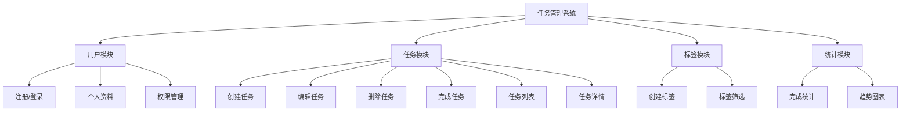

+++
title = "第14章 完整项目实战"
weight = 140
date = "2026-03-27T17:13:00+08:00"
type = "docs"
description = ""
isCJKLanguage = true
draft = false
+++

# Chapter-14-Project-Practice

# 第14章：完整项目实战

> 纸上得来终觉浅，绝知此事要躬行。
>
> 前面 13 章我们学了 Vite 的各种知识点，但"知道"和"会用"之间还隔着一道鸿沟——实战。这一章，我们要跨过这道鸿沟。
>
> 我们将从零开始，搭建一个完整的前端项目：从需求分析到技术选型，从目录结构到代码规范，从功能开发到测试，从移动端适配到国际化，从性能优化到 CI/CD 部署。
>
> 准备好了吗？让我们开始这场"真刀真枪"的实战！💪

---

## 14.1 项目需求分析

### 14.1.1 功能需求梳理

在动手写代码之前，我们先来梳理一下需求。假设我们要做一个"任务管理系统"。

**用户角色**：
- **普通用户**：创建任务、管理自己的任务
- **管理员**：管理所有用户和任务

**功能模块**：



**页面结构**：
- 首页（Dashboard）
- 登录/注册
- 任务列表
- 任务详情
- 创建/编辑任务
- 个人中心
- 管理后台（管理员）

### 14.1.2 技术选型决策

**前端框架选择**：

| 框架 | 优点 | 缺点 | 适用场景 |
|------|------|------|----------|
| **Vue 3** | 上手快，文档好，Vue DevTools | 团队需要熟悉 Vue | 快速迭代，中小型项目 |
| **React 18** | 生态大，灵活性高 | 上手稍难 | 大型项目，复杂交互 |

**我们选择 Vue 3 + TypeScript**，因为：
- Vue 3 的 Composition API 和 TypeScript 结合非常好
- Vite 对 Vue 3 的支持是官方级别的
- 学习曲线相对平缓

**技术栈清单**：

| 类别 | 技术选型 | 理由 |
|------|----------|------|
| 框架 | Vue 3 + TypeScript | 类型安全，开发体验好 |
| 构建工具 | Vite 5 | 极速 HMR，社区活跃 |
| 路由 | Vue Router 4 | Vue 官方路由 |
| 状态管理 | Pinia | Vue 官方推荐，比 Vuex 简洁 |
| UI 组件库 | Element Plus | Vue 3 生态成熟 |
| HTTP 客户端 | Axios | 功能完善，拦截器强大 |
| 图表库 | ECharts | 功能强大，社区活跃 |
| 国际化 | Vue I18n | Vue 官方国际化方案 |
| CSS 预处理器 | SCSS | 成熟，生态好 |
| 单元测试 | Vitest | Vite 原生，Vue 官方推荐 |
| E2E 测试 | Playwright | 微软出品，跨浏览器支持好 |
| CI/CD | GitHub Actions | 免费，集成方便 |

### 14.1.3 项目结构设计

**目录结构**：

```
my-task-app/
├── public/                    # 静态资源
│   ├── favicon.ico
│   └── robots.txt
│
├── src/
│   ├── api/                   # API 接口
│   │   ├── index.ts         # API 统一导出
│   │   ├── user.ts          # 用户相关 API
│   │   ├── task.ts          # 任务相关 API
│   │   └── types.ts         # API 类型定义
│   │
│   ├── assets/               # 资源文件
│   │   ├── images/          # 图片
│   │   ├── styles/          # 全局样式
│   │   │   ├── variables.scss
│   │   │   ├── mixins.scss
│   │   │   └── index.scss
│   │   └── fonts/           # 字体
│   │
│   ├── components/          # 公共组件
│   │   ├── ui/             # 基础 UI 组件
│   │   │   ├── Button.vue
│   │   │   ├── Input.vue
│   │   │   └── Modal.vue
│   │   ├── layout/         # 布局组件
│   │   │   ├── AppHeader.vue
│   │   │   ├── AppSidebar.vue
│   │   │   └── AppFooter.vue
│   │   └── common/         # 通用业务组件
│   │       ├── TaskCard.vue
│   │       └── UserAvatar.vue
│   │
│   ├── composables/         # 组合式函数
│   │   ├── useAuth.ts
│   │   ├── useTasks.ts
│   │   └── usePagination.ts
│   │
│   ├── layouts/             # 页面布局
│   │   ├── DefaultLayout.vue
│   │   ├── AuthLayout.vue
│   │   └── AdminLayout.vue
│   │
│   ├── locales/             # 国际化
│   │   ├── zh-CN.ts
│   │   └── en.ts
│   │
│   ├── router/             # 路由配置
│   │   ├── index.ts
│   │   └── guards.ts      # 路由守卫
│   │
│   ├── stores/             # Pinia 状态
│   │   ├── user.ts
│   │   ├── task.ts
│   │   └── app.ts
│   │
│   ├── types/              # TypeScript 类型
│   │   ├── user.ts
│   │   ├── task.ts
│   │   └── api.ts
│   │
│   ├── utils/              # 工具函数
│   │   ├── format.ts
│   │   ├── validate.ts
│   │   └── storage.ts
│   │
│   ├── views/              # 页面组件
│   │   ├── home/
│   │   │   └── HomeView.vue
│   │   ├── auth/
│   │   │   ├── LoginView.vue
│   │   │   └── RegisterView.vue
│   │   ├── tasks/
│   │   │   ├── TaskListView.vue
│   │   │   ├── TaskDetailView.vue
│   │   │   └── TaskCreateView.vue
│   │   ├── user/
│   │   │   └── ProfileView.vue
│   │   └── admin/
│   │       └── AdminView.vue
│   │
│   ├── App.vue             # 根组件
│   ├── main.ts             # 入口文件
│   └── env.d.ts            # 环境变量类型
│
├── tests/                   # 测试文件
│   ├── unit/              # 单元测试
│   │   ├── utils/
│   │   └── composables/
│   └── e2e/               # E2E 测试
│       └── specs/
│
├── mock/                   # Mock 数据
│   ├── index.ts
│   ├── user.ts
│   └── task.ts
│
├── .env.development        # 开发环境变量
├── .env.production         # 生产环境变量
├── .eslintrc.cjs           # ESLint 配置
├── .prettierrc            # Prettier 配置
├── .editorconfig           # 编辑器配置
├── index.html              # 入口 HTML
├── vite.config.ts          # Vite 配置
├── tsconfig.json           # TypeScript 配置
├── package.json
└── README.md
```

---

## 14.2 项目搭建

### 14.2.1 初始化项目

**创建项目**：

```bash
# 使用 create-vue 创建项目
pnpm create vue@latest my-task-app -- --typescript

# 进入项目目录
cd my-task-app

# 安装依赖
pnpm install

# 安装额外依赖
pnpm add vue-router pinia axios element-plus echarts vue-i18n
pnpm add -D sass @vue/test-utils vitest @vitest/coverage-v8
```

**安装依赖详解**：

```bash
# Vue 生态
pnpm add vue-router@4 pinia

# HTTP 请求
pnpm add axios

# UI 组件库
pnpm add element-plus @element-plus/icons-vue

# 图表
pnpm add echarts

# 国际化
pnpm add vue-i18n@9

# CSS 预处理器
pnpm add -D sass

# 测试
pnpm add -D vitest @vue/test-utils @testing-library/vue
pnpm add -D @vitest/coverage-v8

# 类型
pnpm add -D @types/node
```

### 14.2.2 目录结构规划

**创建目录结构**：

```bash
mkdir -p src/{api,assets/{images,styles,fonts},components/{ui,layout,common},composables,layouts,locales,router,stores,types,utils,views/{home,auth,tasks,user,admin}}
mkdir -p tests/{unit,e2e}
mkdir -p mock
```

### 14.2.3 基础配置完成

**ESLint 配置**：

```javascript
// .eslintrc.cjs
module.exports = {
  root: true,
  env: {
    browser: true,
    es2021: true,
    'vue/setup-compiler-macros': true,
    node: true,
  },
  extends: [
    'plugin:vue/vue3-essential',
    'eslint:recommended',
    '@vue/typescript/recommended',
  ],
  parserOptions: {
    ecmaVersion: 'latest',
  },
  rules: {
    'vue/multi-word-component-names': 'off',
    '@typescript-eslint/no-explicit-any': 'warn',
    '@typescript-eslint/no-unused-vars': ['warn', { argsIgnorePattern: '^_' }],
  },
}
```

**Prettier 配置**：

```json
// .prettierrc
{
  "semi": false,
  "singleQuote": true,
  "tabWidth": 2,
  "trailingComma": "all",
  "printWidth": 100,
  "bracketSpacing": true,
  "arrowParens": "always",
  "endOfLine": "lf"
}
```

**EditorConfig**：

```ini
// .editorconfig
root = true

[*]
charset = utf-8
indent_style = space
indent_size = 2
end_of_line = lf
insert_final_newline = true
trim_trailing_whitespace = true

[*.md]
trim_trailing_whitespace = false
```

**Git Hooks（使用 Husky）**：

```bash
pnpm add -D husky lint-staged

# 初始化 husky
npx husky init

# 添加 pre-commit hook
echo 'pnpm lint-staged' > .husky/pre-commit
```

**package.json 添加 lint-staged**：

```json
{
  "lint-staged": {
    "*.{ts,tsx,vue}": [
      "eslint --fix",
      "prettier --write"
    ],
    "*.{css,scss}": [
      "prettier --write"
    ]
  }
}
```

---

## 14.3 功能开发

### 14.3.1 路由与页面结构

**路由配置**：

```typescript
// src/router/index.ts
import { createRouter, createWebHistory, RouteRecordRaw } from 'vue-router'
import { useUserStore } from '@/stores/user'

const routes: RouteRecordRaw[] = [
  {
    path: '/',
    name: 'home',
    component: () => import('@/views/home/HomeView.vue'),
    meta: { title: '首页', requiresAuth: false },
  },
  {
    path: '/login',
    name: 'login',
    component: () => import('@/views/auth/LoginView.vue'),
    meta: { title: '登录', guest: true },
  },
  {
    path: '/register',
    name: 'register',
    component: () => import('@/views/auth/RegisterView.vue'),
    meta: { title: '注册', guest: true },
  },
  {
    path: '/tasks',
    name: 'tasks',
    component: () => import('@/views/tasks/TaskListView.vue'),
    meta: { title: '任务列表', requiresAuth: true },
  },
  {
    path: '/tasks/:id',
    name: 'task-detail',
    component: () => import('@/views/tasks/TaskDetailView.vue'),
    meta: { title: '任务详情', requiresAuth: true },
  },
  {
    path: '/tasks/create',
    name: 'task-create',
    component: () => import('@/views/tasks/TaskCreateView.vue'),
    meta: { title: '创建任务', requiresAuth: true },
  },
  {
    path: '/profile',
    name: 'profile',
    component: () => import('@/views/user/ProfileView.vue'),
    meta: { title: '个人中心', requiresAuth: true },
  },
  {
    path: '/admin',
    name: 'admin',
    component: () => import('@/views/admin/AdminView.vue'),
    meta: { title: '管理后台', requiresAuth: true, requiresAdmin: true },
  },
  {
    path: '/:pathMatch(.*)*',
    name: 'not-found',
    component: () => import('@/views/NotFoundView.vue'),
    meta: { title: '页面不存在' },
  },
]

const router = createRouter({
  history: createWebHistory(import.meta.env.BASE_URL),
  routes,
})

// 路由守卫
router.beforeEach((to, from, next) => {
  const userStore = useUserStore()
  const isAuthenticated = userStore.isLoggedIn
  
  // 设置页面标题
  document.title = `${to.meta.title || '任务管理'} - 我的任务管理`
  
  // 需要登录
  if (to.meta.requiresAuth && !isAuthenticated) {
    next({ name: 'login', query: { redirect: to.fullPath } })
    return
  }
  
  // 已登录用户访问 guest 页面（登录/注册）
  if (to.meta.guest && isAuthenticated) {
    next({ name: 'home' })
    return
  }
  
  // 需要管理员权限
  if (to.meta.requiresAdmin && !userStore.isAdmin) {
    next({ name: 'home' })
    return
  }
  
  next()
})

export default router
```

### 14.3.2 状态管理实现

**用户状态**：

```typescript
// src/stores/user.ts
import { defineStore } from 'pinia'
import { ref, computed } from 'vue'
import type { User } from '@/types/user'
import { getUserInfo, login as apiLogin, logout as apiLogout } from '@/api/user'

export const useUserStore = defineStore('user', () => {
  // ===== 状态 =====
  const token = ref<string | null>(localStorage.getItem('token'))
  const userInfo = ref<User | null>(null)
  
  // ===== 计算属性 =====
  const isLoggedIn = computed(() => !!token.value)
  const isAdmin = computed(() => userInfo.value?.role === 'admin')
  const displayName = computed(() => userInfo.value?.name || userInfo.value?.email || '用户')
  
  // ===== 方法 =====
  async function fetchUserInfo() {
    if (!token.value) return
    
    try {
      const data = await getUserInfo()
      userInfo.value = data
    } catch (error) {
      console.error('获取用户信息失败：', error)
      logout()
    }
  }
  
  async function login(email: string, password: string) {
    const data = await apiLogin({ email, password })
    token.value = data.token
    userInfo.value = data.user
    localStorage.setItem('token', data.token)
    return data
  }
  
  function logout() {
    apiLogout()
    token.value = null
    userInfo.value = null
    localStorage.removeItem('token')
  }
  
  // 初始化时获取用户信息
  if (token.value) {
    fetchUserInfo()
  }
  
  return {
    token,
    userInfo,
    isLoggedIn,
    isAdmin,
    displayName,
    fetchUserInfo,
    login,
    logout,
  }
})
```

**任务状态**：

```typescript
// src/stores/task.ts
import { defineStore } from 'pinia'
import { ref, computed } from 'vue'
import type { Task, TaskListParams } from '@/types/task'
import { fetchTasks, createTask, updateTask, deleteTask } from '@/api/task'

export const useTaskStore = defineStore('task', () => {
  // ===== 状态 =====
  const tasks = ref<Task[]>([])
  const currentTask = ref<Task | null>(null)
  const loading = ref(false)
  const total = ref(0)
  const queryParams = ref<TaskListParams>({
    page: 1,
    pageSize: 10,
    status: undefined,
    tagId: undefined,
  })
  
  // ===== 计算属性 =====
  const pendingTasks = computed(() => tasks.value.filter(t => t.status === 'pending'))
  const completedTasks = computed(() => tasks.value.filter(t => t.status === 'completed'))
  const taskStats = computed(() => ({
    total: tasks.value.length,
    pending: pendingTasks.value.length,
    completed: completedTasks.value.length,
    completionRate: tasks.value.length 
      ? Math.round((completedTasks.value.length / tasks.value.length) * 100) 
      : 0,
  }))
  
  // ===== 方法 =====
  async function loadTasks(params?: Partial<TaskListParams>) {
    loading.value = true
    try {
      if (params) {
        queryParams.value = { ...queryParams.value, ...params }
      }
      
      const result = await fetchTasks(queryParams.value)
      tasks.value = result.list
      total.value = result.total
    } finally {
      loading.value = false
    }
  }
  
  async function create(data: Partial<Task>) {
    const task = await createTask(data)
    tasks.value.unshift(task)
    total.value++
    return task
  }
  
  async function update(id: number, data: Partial<Task>) {
    const updated = await updateTask(id, data)
    const index = tasks.value.findIndex(t => t.id === id)
    if (index !== -1) {
      tasks.value[index] = updated
    }
    if (currentTask.value?.id === id) {
      currentTask.value = updated
    }
    return updated
  }
  
  async function remove(id: number) {
    await deleteTask(id)
    tasks.value = tasks.value.filter(t => t.id !== id)
    total.value--
  }
  
  async function toggleComplete(id: number) {
    const task = tasks.value.find(t => t.id === id)
    if (task) {
      const newStatus = task.status === 'completed' ? 'pending' : 'completed'
      await update(id, { status: newStatus })
    }
  }
  
  function setCurrentTask(task: Task | null) {
    currentTask.value = task
  }
  
  return {
    tasks,
    currentTask,
    loading,
    total,
    queryParams,
    pendingTasks,
    completedTasks,
    taskStats,
    loadTasks,
    create,
    update,
    remove,
    toggleComplete,
    setCurrentTask,
  }
})
```

### 14.3.3 API 接口封装

**Axios 实例配置**：

```typescript
// src/utils/http.ts
import axios, { AxiosError, AxiosInstance, InternalAxiosRequestConfig, AxiosResponse } from 'axios'
import { ElMessage } from 'element-plus'
import { useUserStore } from '@/stores/user'
import router from '@/router'

// 创建 axios 实例
const http: AxiosInstance = axios.create({
  baseURL: import.meta.env.VITE_API_BASE_URL,
  timeout: 30000,
  headers: {
    'Content-Type': 'application/json',
  },
})

// 请求拦截器
http.interceptors.request.use(
  (config: InternalAxiosRequestConfig) => {
    const userStore = useUserStore()
    
    // 添加 Token
    if (userStore.token) {
      config.headers.Authorization = `Bearer ${userStore.token}`
    }
    
    return config
  },
  (error) => {
    return Promise.reject(error)
  }
)

// 响应拦截器
http.interceptors.response.use(
  (response: AxiosResponse) => {
    const { data } = response
    
    // 统一处理业务错误
    if (data.code !== 0 && data.code !== 200) {
      ElMessage.error(data.message || '请求失败')
      return Promise.reject(new Error(data.message))
    }
    
    return data
  },
  (error: AxiosError) => {
    const { response } = error
    
    if (response) {
      switch (response.status) {
        case 401:
          // 未登录，跳转到登录页
          ElMessage.error('登录已过期，请重新登录')
          const userStore = useUserStore()
          await userStore.logout()
          router.push({ name: 'login' })
          break
        case 403:
          ElMessage.error('没有权限')
          break
        case 404:
          ElMessage.error('资源不存在')
          break
        case 500:
          ElMessage.error('服务器错误')
          break
        default:
          ElMessage.error('网络错误')
      }
    } else if (error.request) {
      ElMessage.error('网络连接失败')
    } else {
      ElMessage.error('请求配置错误')
    }
    
    return Promise.reject(error)
  }
)

export default http
```

**API 接口定义**：

```typescript
// src/api/task.ts
import http from '@/utils/http'
import type { Task, TaskListParams, TaskListResponse } from '@/types/task'

// 获取任务列表
export function fetchTasks(params: TaskListParams): Promise<TaskListResponse> {
  return http.get('/tasks', { params })
}

// 获取任务详情
export function getTaskById(id: number): Promise<Task> {
  return http.get(`/tasks/${id}`)
}

// 创建任务
export function createTask(data: Partial<Task>): Promise<Task> {
  return http.post('/tasks', data)
}

// 更新任务
export function updateTask(id: number, data: Partial<Task>): Promise<Task> {
  return http.put(`/tasks/${id}`, data)
}

// 删除任务
export function deleteTask(id: number): Promise<void> {
  return http.delete(`/tasks/${id}`)
}

// 完成任务/取消完成
export function toggleTaskStatus(id: number): Promise<Task> {
  return http.patch(`/tasks/${id}/toggle`)
}
```

### 14.3.4 组件库搭建

**基础 Button 组件**：

```vue
<!-- src/components/ui/Button.vue -->
<template>
  <button
    :class="[
      'my-button',
      `my-button--${type}`,
      `my-button--${size}`,
      { 'my-button--disabled': disabled || loading },
      { 'my-button--loading': loading },
    ]"
    :disabled="disabled || loading"
    :type="nativeType"
    @click="handleClick"
  >
    <span v-if="loading" class="my-button__loader"></span>
    <slot />
  </button>
</template>

<script setup lang="ts">
interface Props {
  type?: 'primary' | 'secondary' | 'danger' | 'text'
  size?: 'small' | 'medium' | 'large'
  disabled?: boolean
  loading?: boolean
  nativeType?: 'button' | 'submit' | 'reset'
}

const props = withDefaults(defineProps<Props>(), {
  type: 'primary',
  size: 'medium',
  disabled: false,
  loading: false,
  nativeType: 'button',
})

const emit = defineEmits<{
  click: [event: MouseEvent]
}>()

function handleClick(event: MouseEvent) {
  if (props.disabled || props.loading) return
  emit('click', event)
}
</script>

<style scoped lang="scss">
.my-button {
  display: inline-flex;
  align-items: center;
  justify-content: center;
  border: none;
  border-radius: 4px;
  cursor: pointer;
  transition: all 0.2s;
  
  &--primary {
    background-color: #409eff;
    color: white;
    &:hover { background-color: #66b1ff; }
  }
  
  &--secondary {
    background-color: #e8e8e8;
    color: #333;
    &:hover { background-color: #d8d8d8; }
  }
  
  &--danger {
    background-color: #f56c6c;
    color: white;
    &:hover { background-color: #f78989; }
  }
  
  &--text {
    background: transparent;
    color: #409eff;
    &:hover { text-decoration: underline; }
  }
  
  &--small { padding: 6px 12px; font-size: 12px; }
  &--medium { padding: 8px 16px; font-size: 14px; }
  &--large { padding: 12px 24px; font-size: 16px; }
  
  &--disabled,
  &--loading {
    opacity: 0.6;
    cursor: not-allowed;
  }
  
  &__loader {
    width: 14px;
    height: 14px;
    margin-right: 6px;
    border: 2px solid currentColor;
    border-right-color: transparent;
    border-radius: 50%;
    animation: spin 0.8s linear infinite;
  }
}

@keyframes spin {
  to { transform: rotate(360deg); }
}
</style>
```

### 14.3.5 表单与验证

**使用 Element Plus 的表单验证**：

```vue
<!-- src/views/auth/LoginView.vue -->
<template>
  <div class="login-page">
    <el-card class="login-card">
      <template #header>
        <h2>登录</h2>
      </template>
      
      <el-form
        ref="formRef"
        :model="form"
        :rules="rules"
        label-position="top"
      >
        <el-form-item label="邮箱" prop="email">
          <el-input
            v-model="form.email"
            type="email"
            placeholder="请输入邮箱"
            prefix-icon="Message"
          />
        </el-form-item>
        
        <el-form-item label="密码" prop="password">
          <el-input
            v-model="form.password"
            type="password"
            placeholder="请输入密码"
            prefix-icon="Lock"
            show-password
          />
        </el-form-item>
        
        <el-form-item>
          <el-checkbox v-model="form.remember">
            记住我
          </el-checkbox>
          <el-link type="primary" :underline="false" style="margin-left: auto;">
            忘记密码？
          </el-link>
        </el-form-item>
        
        <el-form-item>
          <Button
            type="primary"
            :loading="loading"
            style="width: 100%;"
            @click="handleSubmit"
          >
            登录
          </Button>
        </el-form-item>
      </el-form>
      
      <div class="login-footer">
        还没有账号？
        <el-link type="primary" :underline="false" :to="{ name: 'register' }">
          立即注册
        </el-link>
      </div>
    </el-card>
  </div>
</template>

<script setup lang="ts">
import { ref, reactive } from 'vue'
import { useRouter, useRoute } from 'vue-router'
import { ElMessage } from 'element-plus'
import type { FormInstance, FormRules } from 'element-plus'
import { useUserStore } from '@/stores/user'
import Button from '@/components/ui/Button.vue'

const router = useRouter()
const route = useRoute()
const userStore = useUserStore()

const formRef = ref<FormInstance>()
const loading = ref(false)

const form = reactive({
  email: '',
  password: '',
  remember: false,
})

// 验证规则
const rules: FormRules = {
  email: [
    { required: true, message: '请输入邮箱', trigger: 'blur' },
    { type: 'email', message: '请输入正确的邮箱格式', trigger: 'blur' },
  ],
  password: [
    { required: true, message: '请输入密码', trigger: 'blur' },
    { min: 6, max: 20, message: '密码长度在 6-20 个字符', trigger: 'blur' },
  ],
}

async function handleSubmit() {
  if (!formRef.value) return
  
  try {
    await formRef.value.validate()
    loading.value = true
    
    await userStore.login(form.email, form.password)
    ElMessage.success('登录成功')
    
    const redirect = (route.query.redirect as string) || '/'
    router.push(redirect)
  } catch (error) {
    console.error('登录失败：', error)
  } finally {
    loading.value = false
  }
}
</script>

<style scoped lang="scss">
.login-page {
  display: flex;
  align-items: center;
  justify-content: center;
  min-height: 100vh;
  background: linear-gradient(135deg, #667eea 0%, #764ba2 100%);
}

.login-card {
  width: 400px;
  
  h2 {
    margin: 0;
    text-align: center;
    color: #333;
  }
}

.login-footer {
  text-align: center;
  color: #666;
}
</style>
```

### 14.3.6 权限管理

**权限指令**：

```typescript
// src/directives/auth.ts
import type { Directive } from 'vue'
import { useUserStore } from '@/stores/user'

export const vPermission: Directive = {
  mounted(el, binding) {
    const userStore = useUserStore()
    const requiredRole = binding.value
    
    if (requiredRole && !userStore.hasRole(requiredRole)) {
      el.parentNode?.removeChild(el)
    }
  },
}

// src/directives/index.ts
export { vPermission }
```

**权限判断工具**：

```typescript
// src/utils/auth.ts
import { useUserStore } from '@/stores/user'

type Role = 'admin' | 'user' | 'guest'

export function hasPermission(requiredRole: Role): boolean {
  const userStore = useUserStore()
  
  if (requiredRole === 'guest') {
    return !userStore.isLoggedIn
  }
  
  if (requiredRole === 'admin') {
    return userStore.isAdmin
  }
  
  return userStore.isLoggedIn
}

export function hasAnyRole(roles: Role[]): boolean {
  return roles.some(role => hasPermission(role))
}
```

---

## 14.4 移动端适配

### 14.4.1 视口配置

```html
<!-- index.html -->
<head>
  <meta name="viewport" content="width=device-width, initial-scale=1.0, maximum-scale=1.0, user-scalable=no">
  <meta name="format-detection" content="telephone=no">
  <meta name="apple-mobile-web-app-capable" content="yes">
  <meta name="apple-mobile-web-app-status-bar-style" content="default">
</head>
```

### 14.4.2 rem 适配方案

```scss
// src/assets/styles/variables.scss

// 设计稿宽度
$design-width: 375;

// 根字体大小
$root-font-size: 16;

// rem 转换函数
@function rem($px) {
  // SCSS 可以直接进行数学运算，不需要 calc()
  @return $px / $design-width * 100vw;
}

// 使用方式
.container {
  width: rem(375);
  padding: rem(16);
}

.title {
  font-size: rem(18);
}
```

### 14.4.3 vw/vh 适配方案

```scss
// 使用 vw 单位
$design-width: 375;

@function vw($px) {
  // SCSS 可以直接进行数学运算，不需要 calc()
  @return $px / $design-width * 100vw;
}

// 或者使用 PostCSS 插件自动转换
// postcss-px-to-viewport-opt-in
```

### 14.4.4 移动端调试

```typescript
// vite.config.ts
export default defineConfig({
  server: {
    // 移动端调试
    host: true,  // 允许局域网访问
  },
})
```

---

## 14.5 国际化

### 14.5.1 多语言配置

```typescript
// src/locales/zh-CN.ts
export default {
  common: {
    confirm: '确认',
    cancel: '取消',
    save: '保存',
    delete: '删除',
    edit: '编辑',
    search: '搜索',
    loading: '加载中...',
  },
  nav: {
    home: '首页',
    tasks: '任务',
    profile: '个人中心',
    admin: '管理后台',
  },
  task: {
    title: '任务标题',
    description: '任务描述',
    status: '状态',
    priority: '优先级',
    tags: '标签',
    createdAt: '创建时间',
    dueDate: '截止日期',
    pending: '待处理',
    completed: '已完成',
    createTask: '创建任务',
    editTask: '编辑任务',
  },
}
```

```typescript
// src/locales/en.ts
export default {
  common: {
    confirm: 'Confirm',
    cancel: 'Cancel',
    save: 'Save',
    delete: 'Delete',
    edit: 'Edit',
    search: 'Search',
    loading: 'Loading...',
  },
  nav: {
    home: 'Home',
    tasks: 'Tasks',
    profile: 'Profile',
    admin: 'Admin',
  },
  task: {
    title: 'Title',
    description: 'Description',
    status: 'Status',
    priority: 'Priority',
    tags: 'Tags',
    createdAt: 'Created At',
    dueDate: 'Due Date',
    pending: 'Pending',
    completed: 'Completed',
    createTask: 'Create Task',
    editTask: 'Edit Task',
  },
}
```

**i18n 配置**：

```typescript
// src/locales/index.ts
import { createI18n } from 'vue-i18n'
import zhCN from './zh-CN'
import en from './en'

const i18n = createI18n({
  legacy: false,
  locale: localStorage.getItem('locale') || 'zh-CN',
  fallbackLocale: 'zh-CN',
  messages: {
    'zh-CN': zhCN,
    en,
  },
})

export default i18n
```

### 14.5.2 语言切换功能

```vue
<!-- src/components/layout/AppHeader.vue -->
<template>
  <header class="app-header">
    <div class="header-left">
      <!-- Logo -->
    </div>
    
    <div class="header-right">
      <!-- 语言切换 -->
      <el-dropdown @command="handleLanguageChange">
        <span class="language-selector">
          <i class="el-icon-globe"></i>
          {{ currentLanguage }}
        </span>
        <template #dropdown>
          <el-dropdown-menu>
            <el-dropdown-item command="zh-CN">中文</el-dropdown-item>
            <el-dropdown-item command="en">English</el-dropdown-item>
          </el-dropdown-menu>
        </template>
      </el-dropdown>
    </div>
  </header>
</template>

<script setup lang="ts">
import { computed } from 'vue'
import { useI18n } from 'vue-i18n'

const { locale } = useI18n()

const languageMap: Record<string, string> = {
  'zh-CN': '中文',
  en: 'English',
}

const currentLanguage = computed(() => languageMap[locale.value] || '中文')

function handleLanguageChange(lang: string) {
  locale.value = lang
  localStorage.setItem('locale', lang)
}
</script>
```

---

## 14.6 性能优化

### 14.6.1 代码分割

```typescript
// src/router/index.ts
// 使用动态导入实现代码分割
const routes = [
  {
    path: '/',
    component: () => import(/* @vite-ignore */ '@/views/home/HomeView.vue'),
  },
  {
    path: '/tasks',
    component: () => import(/* @vite-ignore */ '@/views/tasks/TaskListView.vue'),
  },
]
```

### 14.6.2 图片优化

```vue
<!-- 使用图片懒加载 -->
<template>
  
</template>

<script setup lang="ts">
const imageSrc = 'https://picsum.photos/800/600'
</script>
```

### 14.6.3 缓存策略

```typescript
// vite.config.ts
export default defineConfig({
  build: {
    rollupOptions: {
      output: {
        // 带 hash 的文件名，利于缓存
        entryFileNames: 'js/[name]-[hash:8].js',
        chunkFileNames: 'js/[name]-[hash:8].js',
        assetFileNames: 'assets/[name]-[hash:8][extname]',
      },
    },
  },
})
```

---

## 14.7 优化与部署

### 14.7.1 构建配置优化

```typescript
// vite.config.ts
import { defineConfig } from 'vite'
import vue from '@vitejs/plugin-vue'
import { visualizer } from 'rollup-plugin-visualizer'

export default defineConfig({
  plugins: [
    vue(),
    // 构建产物分析插件
    visualizer({
      open: true,  // 构建完成后自动打开分析页面
    }),
  ],
  build: {
    target: 'es2015',
    cssCodeSplit: true,
    sourcemap: false,
    minify: 'terser',
    chunkSizeWarningLimit: 500,
    rollupOptions: {
      output: {
        manualChunks: {
          'vue-vendor': ['vue', 'vue-router', 'pinia'],
          'element-plus': ['element-plus'],
          'echarts': ['echarts'],
        },
      },
    },
  },
})
```

### 14.7.2 CI/CD 配置

**.github/workflows/deploy.yml**：

```yaml
name: Build and Deploy

on:
  push:
    branches: [main]
  pull_request:
    branches: [main]

jobs:
  build-and-deploy:
    runs-on: ubuntu-latest
    
    steps:
      - uses: actions/checkout@v4
      
      - name: Setup pnpm
        uses: pnpm/action-setup@v2
        with:
          version: 9
      
      - name: Setup Node
        uses: actions/setup-node@v4
        with:
          node-version: 20
          cache: 'pnpm'
      
      - name: Install dependencies
        run: pnpm install --frozen-lockfile
      
      - name: Run lint
        run: pnpm lint
      
      - name: Run type check
        run: pnpm type-check
      
      - name: Run unit tests
        run: pnpm test:run --coverage
      
      - name: Build
        run: pnpm build
        env:
          VITE_API_BASE_URL: ${{ secrets.VITE_API_BASE_URL }}
      
      - name: Upload artifacts
        uses: actions/upload-artifact@v4
        with:
          name: dist
          path: dist
      
      - name: Deploy to Vercel
        if: github.ref == 'refs/heads/main'
        uses: amondnet/vercel-action@v25
        with:
          vercel-token: ${{ secrets.VERCEL_TOKEN }}
          vercel-org-id: ${{ secrets.VERCEL_ORG_ID }}
          vercel-project-id: ${{ secrets.VERCEL_PROJECT_ID }}
          vercel-args: '--prod'
          working-directory: ./
```

### 14.7.3 部署上线

**部署到 Vercel**：

```bash
# 安装 Vercel CLI
pnpm add -g vercel

# 登录
vercel login

# 部署（预览）
vercel

# 生产部署
vercel --prod
```

**部署到 Netlify**：

```bash
# 安装 Netlify CLI
pnpm add -g netlify-cli

# 部署
netlify deploy --dir=dist --prod
```

### 14.7.4 Docker 部署

**Dockerfile**：

```dockerfile
# 构建阶段
FROM node:20-alpine AS builder

WORKDIR /app

COPY package.json pnpm-lock.yaml ./
RUN corepack enable && pnpm install --frozen-lockfile

COPY . .
RUN pnpm build

# 运行阶段
FROM nginx:alpine

COPY --from=builder /app/dist /usr/share/nginx/html
COPY nginx.conf /etc/nginx/nginx.conf

EXPOSE 80

CMD ["nginx", "-g", "daemon off;"]
```

**nginx.conf**：

```nginx
worker_processes auto;
error_log /var/log/nginx/error.log warn;
pid /var/run/nginx.pid;

events {
  worker_connections 1024;
}

http {
  include /etc/nginx/mime.types;
  default_type application/octet-stream;

  log_format main '$remote_addr - $remote_user [$time_local] "$request" '
                  '$status $body_bytes_sent "$http_referer" '
                  '"$http_user_agent" "$http_x_forwarded_for"';

  access_log /var/log/nginx/access.log main;

  sendfile on;
  tcp_nopush on;
  tcp_nodelay on;
  keepalive_timeout 65;
  gzip on;
  gzip_types text/plain text/css application/json application/javascript;

  server {
    listen 80;
    server_name localhost;
    root /usr/share/nginx/html;
    index index.html;

    location / {
      try_files $uri $uri/ /index.html;
    }

    location /api {
      proxy_pass http://backend:3000;
      proxy_set_header Host $host;
      proxy_set_header X-Real-IP $remote_addr;
    }
  }
}
```

---

## 14.8 项目总结

### 14.8.1 问题与解决方案

| 问题 | 解决方案 |
|------|----------|
| 跨域问题 | Vite 代理配置 |
| 移动端适配 | rem + viewport |
| 代码分割 | 动态导入 |
| 类型安全 | TypeScript |
| 测试覆盖 | Vitest + Playwright |
| CI/CD | GitHub Actions |
| 部署 | Docker + Nginx |

### 14.8.2 最佳实践总结

1. **项目结构**：清晰的分层，合理的目录组织
2. **TypeScript**：严格的类型检查，减少运行时错误
3. **代码规范**：ESLint + Prettier + Husky
4. **组件设计**：高内聚，低耦合，可复用
5. **状态管理**：Pinia 集中管理，清晰的数据流
6. **API 封装**：Axios 统一配置，统一的错误处理
7. **测试**：单元测试 + E2E 测试
8. **性能优化**：代码分割，懒加载，缓存策略
9. **CI/CD**：自动化构建、测试、部署

---

## 14.9 本章小结

### 🎉 本章总结

这一章我们从零开始搭建了一个完整的前端项目，涵盖了：

1. **需求分析**：功能模块划分、技术选型决策、项目结构设计

2. **项目搭建**：初始化项目、目录结构规划、ESLint/Prettier/Husky 配置

3. **功能开发**：路由配置、Pinia 状态管理、Axios API 封装、组件库搭建、表单验证、权限管理

4. **移动端适配**：视口配置、rem 适配、vw/vh 适配、移动端调试

5. **国际化**：多语言配置、语言切换功能

6. **性能优化**：代码分割、图片优化、缓存策略

7. **部署上线**：构建优化、GitHub Actions CI/CD、Vercel/Netlify 部署、Docker 部署

### 📝 本章练习

1. **完整项目**：按照本章的流程，搭建一个自己的项目

2. **添加功能**：为项目添加更多功能（评论、通知、分享等）

3. **完善测试**：为项目编写单元测试和 E2E 测试

4. **部署上线**：将项目部署到 Vercel 或 Netlify

5. **性能优化**：分析产物，优化分包策略，提升 Lighthouse 分数

---

> 📌 **预告**：下一章我们将进入 **Vite 核心原理**，学习开发服务器原理、热更新（HMR）原理、依赖预构建、生产构建原理等。敬请期待！
