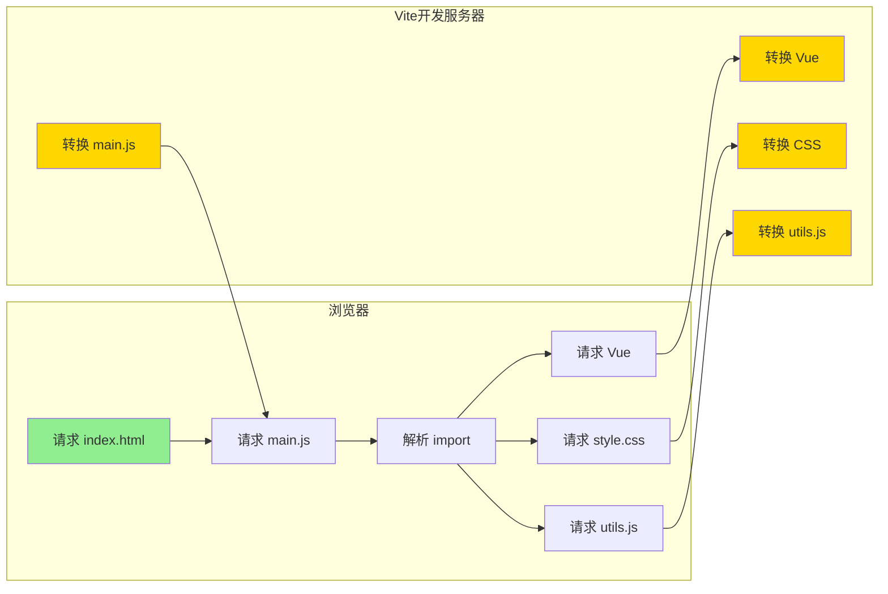
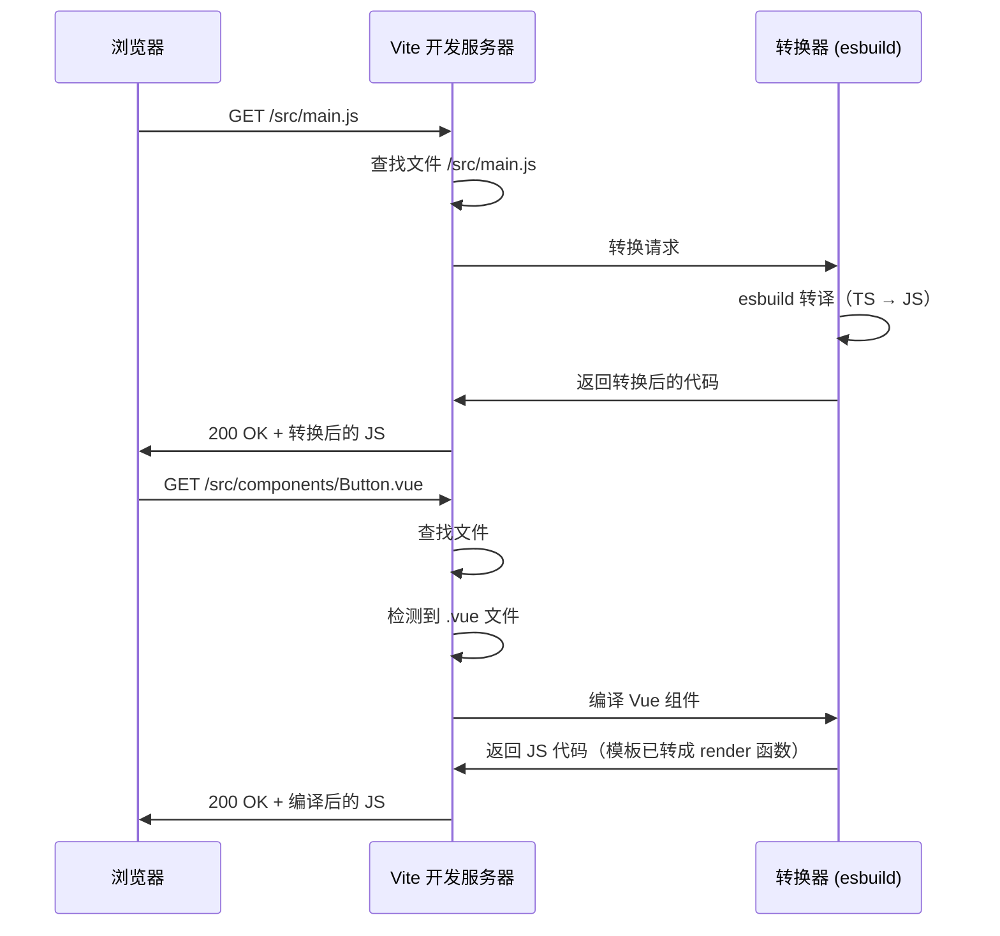
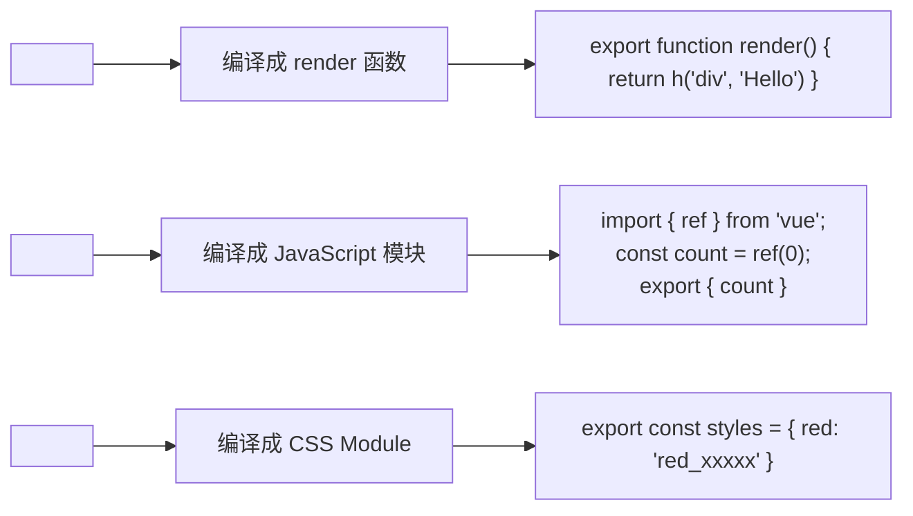
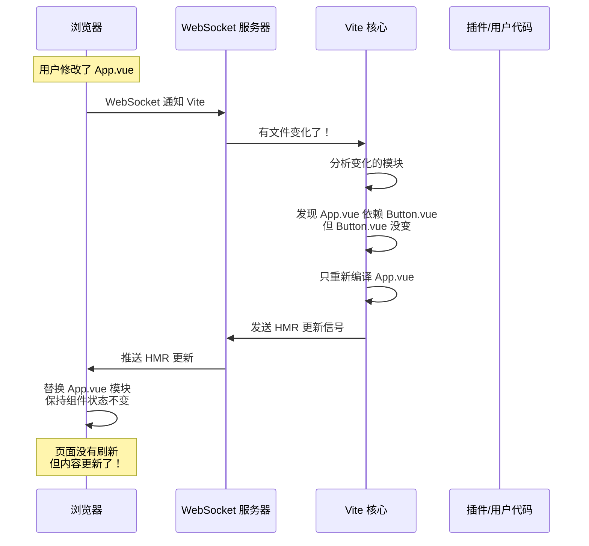
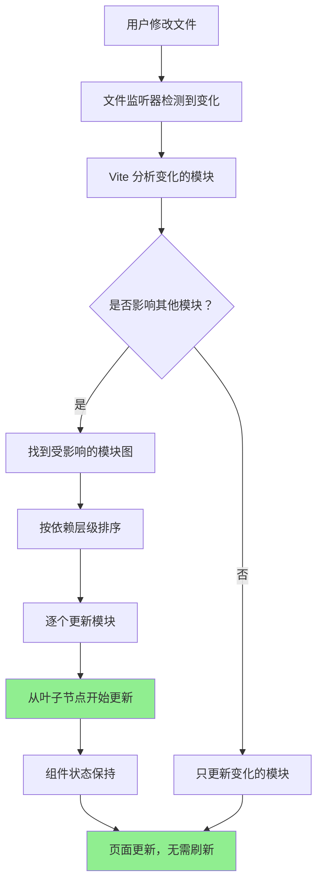
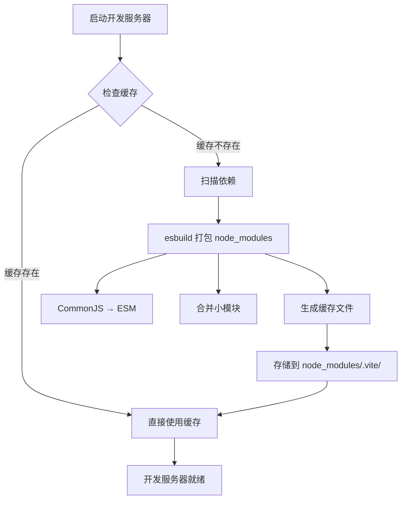
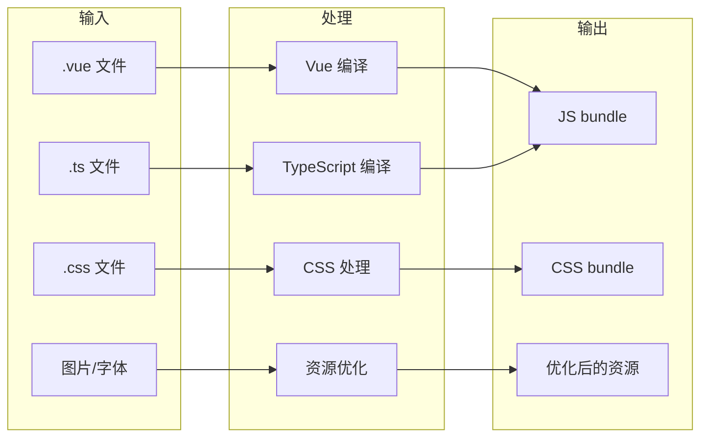

+++
title = "第15章 Vite 核心原理"
weight = 150
date = "2026-03-27T17:13:00+08:00"
type = "docs"
description = ""
isCJKLanguage = true
draft = false
+++

# Chapter-15-Vite-Core-Principles

# 第15章：Vite 核心原理

> 你已经会用 Vite 了——创建项目、配置插件、写代码、构建部署，一条龙服务。但你有没有想过：Vite 背后到底是怎么工作的？
>
> 为什么开发时启动这么快？为什么 HMR 能做到毫秒级更新？为什么生产构建用的是 Rollup 而不是 Vite 自己？
>
> 这一章，我们就来揭开 Vite 的"神秘面纱"，深入理解它的核心原理。学完这章，你对 Vite 的理解会从"会用"升级到"懂它"。
>
> 准备好了吗？让我们一起探索 Vite 的"内心世界"！🔍

---

## 15.1 开发服务器原理

### 15.1.1 基于原生 ESM 的开发服务器

Vite 开发服务器的核心是**基于浏览器原生 ES Modules**的按需编译。让我来详细解释这个过程。

**传统构建工具（Webpack）的工作方式**：

```
开发人员：打开项目
     ↓
Webpack 开始工作：
  - 读取入口文件
  - 分析所有 import 语句
  - 递归处理所有模块
  - 构建完整的依赖图
  - 打包成一个/多个 bundle
     ↓
打包完成，浏览器加载 bundle
     ↓
终于可以看到页面了...（30秒~3分钟已过去）
```

**Vite 的工作方式**：

```
开发人员：打开项目
     ↓
esbuild 预构建依赖（只处理 node_modules）
     ↓
预构建完成（< 1秒）
     ↓
启动开发服务器
     ↓
浏览器请求 index.html
     ↓
浏览器请求 main.js（通过 <script type="module">）
     ↓
Vite 实时转换 main.js → 发送给浏览器
     ↓
浏览器解析 main.js，发现 import Vue
     ↓
Vite 收到 Vue 的请求 → 实时转换 → 发送
     ↓
浏览器收到 Vue → 继续解析，发现 import './style.css'
     ↓
Vite 收到 CSS 请求 → 实时转换 → 发送
     ↓
页面渲染完成！
     ↓
用户已经开始改代码了...（总耗时 < 2秒）
```



**为什么 Vite 这么快？**

关键在于 Vite **从来不打包整个项目**。它只是充当一个"翻译官"的角色：
- 浏览器要什么模块，Vite 就翻译什么模块
- 浏览器不要的模块，Vite 看都不看

这就好比一个自助餐厅：
- **Webpack 模式**：厨师把整个厨房的菜都做完，然后端给你（不管你吃不吃）
- **Vite 模式**：你点什么菜，厨师就做什么菜（按需烹饪）

### 15.1.2 请求拦截与处理

当浏览器发送请求时，Vite 开发服务器会拦截这些请求并进行特殊处理。

**Vite 开发服务器的请求类型**：

| 请求类型 | 处理方式 | 示例 |
|----------|----------|------|
| `/src/xxx` | 按需转换源代码 | `/src/main.js` → 转译后的 JS |
| `/node_modules/xxx` | 返回预构建产物 | `/node_modules/vue/dist/vue.esm-bundler.js` |
| `/@modules/xxx` | 同上（别名） | `/@modules/vue` |
| `/public/xxx` | 直接返回文件 | `/public/favicon.ico` |
| `/index.html` | 注入脚本标签 | 插入 `<script type="module" src="/src/main.js">` |

**Vite 处理请求的流程**：



**请求拦截的核心代码逻辑**（概念层面）：

```javascript
// Vite 开发服务器的请求处理流程（简化版）
server.middlewares.use(async (req, res, next) => {
  const url = req.url
  
  // 1. 处理入口 HTML
  if (url === '/' || url === '/index.html') {
    res.end(await transformIndexHtml(url))
    return
  }
  
  // 2. 处理源代码（按需转换）
  if (url.startsWith('/src/')) {
    const filePath = resolve(url)
    const result = await transform(filePath)
    res.setHeader('Content-Type', getContentType(filePath))
    res.end(result)
    return
  }
  
  // 3. 处理 node_modules（返回预构建产物）
  if (url.startsWith('/@modules/') || url.startsWith('/node_modules/')) {
    const modulePath = resolveModule(url)
    res.setHeader('Content-Type', 'application/javascript')
    res.end(preBundledModules[modulePath])
    return
  }
  
  // 4. 处理 public 文件（直接返回）
  if (url.startsWith('/public/')) {
    res.sendFile(publicDir + url)
    return
  }
  
  // 5. 其他请求继续
  next()
})
```

### 15.1.3 模块依赖图构建

Vite 在开发时并不会构建完整的模块依赖图，而是在浏览器请求时**按需解析**。

**Webpack 的依赖图**（一次性构建）：

```
Webpack 启动时：
  分析 src/index.js
    → import Vue from 'vue'
    → import App from './App.vue'
    → import './styles.css'
    → import './router/index.js'
      → import Home from './views/Home.vue'
      → import About from './views/About.vue'
        → import UserList from './components/UserList.vue'
          → import UserCard from './components/UserCard.vue'
            → ...（继续递归）
```

**Vite 的按需解析**（按需构建）：

```
用户访问首页时：
  请求 /src/main.js
    → 分析 main.js 的 import
    → 发现 import App from './App.vue'
    → 请求 /src/App.vue
      → 分析 App.vue 的 import
      → 发现 import Home from './views/Home.vue'
      → 请求 /src/views/Home.vue
        → 只解析到这里（首页不需要 About）

用户访问关于页时：
  请求 /src/views/About.vue
    → 分析 About.vue 的 import
    → 发现 import UserList from './components/UserList.vue'
    → 请求 /src/views/components/UserList.vue
```

### 15.1.4 单文件组件编译

Vue 的单文件组件（`.vue` 文件）需要被编译成 JavaScript 代码。Vite 使用 `@vue/compiler-sfc` 来处理这个过程。

**Vue SFC 编译过程**：



**Vue SFC 编译示例**：

```vue
<!-- 原始 SFC -->
<template>
  <div class="container">
    <h1>{{ title }}</h1>
    <button @click="handleClick">点击</button>
  </div>
</template>

<script setup>
import { ref } from 'vue'

const title = ref('Hello Vite')
function handleClick() {
  console.log(' clicked!')
}
</script>

<style scoped>
.container {
  padding: 20px;
}
h1 {
  color: #42b983;
}
</style>
```

```javascript
// 编译后的 JavaScript 模块
import { ref, createElementVNode as h, openBlock, createElementBlock } from 'vue'

// template 部分编译成 render 函数
const __sfc__ = {
  setup(__props, { expose }) {
    const title = ref('Hello Vite')
    function handleClick() {
      console.log(' clicked!')
    }
    
    // template 编译成 render 函数
    const __render__ = () => {
      return (
        openBlock(),
        createElementBlock('div', { class: 'container' }, [
          createElementVNode('h1', null, toDisplayString(title.value), 1),
          createElementVNode('button', { onClick: handleClick }, '点击', 8, ['onClick'])
        ])
      )
    }
    
    expose({ title, handleClick })
    return { title, handleClick, render: __render__ }
  }
}
```

### 15.1.5 import map 的作用

`importmap` 是一个让浏览器能够理解裸模块名称（如 `import Vue from 'vue'`）的 HTML 特性。

**importmap 是什么？**

```html
<!-- 不使用 importmap -->
<!-- 浏览器不认识裸模块名 'vue' -->
<script type="module">
  import Vue from 'vue'  // ❌ 浏览器会报错
</script>

<!-- 使用 importmap -->
<!-- 告诉浏览器：'vue' 这个名字指向 /node_modules/vue/dist/vue.esm-bundler.js -->
<script type="importmap">
{
  "imports": {
    "vue": "/node_modules/vue/dist/vue.esm-bundler.js"
  }
}
</script>

<script type="module">
  import Vue from 'vue'  // ✅ 浏览器知道去哪找
</script>
```

**Vite 中的 importmap**：

Vite 会在 `index.html` 中自动注入 `importmap`，让浏览器能够正确解析 `node_modules` 中的模块。

```html
<!-- Vite 生成的 index.html（简化） -->
<!DOCTYPE html>
<html>
<head>
  <!-- importmap 帮助浏览器理解模块名 -->
  <script type="importmap">
  {
    "imports": {
      "vue": "/node_modules/vue/dist/vue.esm-bundler.js",
      "vue-router": "/node_modules/vue-router/dist/vue-router.esm-bundler.js",
      "/src/main.js": "/src/main.js"
    }
  }
  </script>
</head>
<body>
  <div id="app"></div>
  <script type="module" src="/src/main.js"></script>
</body>
</html>
```

---

## 15.2 热更新（HMR）原理

### 15.2.1 WebSocket 通信机制

HMR（Hot Module Replacement，热模块替换）允许在**不刷新页面的情况下**更新模块。

**HMR 的通信机制**：



**WebSocket 连接建立**：

当 Vite 开发服务器启动时，它会在客户端注入一段代码，建立 WebSocket 连接：

```javascript
// Vite 客户端代码（简化）
const socket = new WebSocket('ws://localhost:5173', {
  protocolVersion: 'v2',  // Vite HMR 协议
})

socket.onmessage = (event) => {
  const data = JSON.parse(event.data)
  
  switch (data.type) {
    case 'connected':
      console.log('[HMR] 已连接到开发服务器')
      break
      
    case 'vue-reload':
      // Vue 组件需要完全重新加载
      // （比如 template 部分改变了）
      location.reload()
      break
      
    case 'vue-rerender':
      // Vue 组件需要重新渲染
      // （比如 script 部分改变了）
      handleVueRerender(data.path)
      break
      
    case 'style-update':
      // CSS 更新
      updateStyle(data.path, data.content)
      break
      
    case 'js-update':
      // JS 模块更新
      import(data.path + '?t=' + Date.now())
        .then(m => accept('./' + data.path))
      break
  }
}
```

### 15.2.2 模块更新流程

**完整的 HMR 更新流程**：



**模块更新顺序**：

假设修改了 `App.vue`，它的依赖关系是：

```
App.vue
  ├── imports: Button.vue
  │         └── imports: Icon.vue
  ├── imports: Header.vue
  │         └── imports: Logo.vue
  └── imports: Footer.vue
```

更新顺序是（从底层开始）：

1. `Icon.vue`（叶子节点，没有依赖）
2. `Button.vue`（依赖 Icon.vue）
3. `Logo.vue`（叶子节点）
4. `Header.vue`（依赖 Logo.vue）
5. `Footer.vue`（叶子节点）
6. `App.vue`（最后更新）

### 15.2.3 边界处理与降级

**HMR 边界情况处理**：

| 情况 | HMR 行为 |
|------|----------|
| 只改了 CSS | ✅ 直接更新 CSS，组件状态保持 |
| 只改了 `<script>` 部分 | ✅ 重新执行脚本，组件状态保持 |
| 改了 `<template>` 结构 | ⚠️ 可能需要完全重新加载 |
| 改了 `<script>` 的导出 | ⚠️ 需要重新加载组件 |
| 改了路由配置 | ⚠️ 页面需要刷新 |
| 改了 main.js | ⚠️ 整个应用重新加载 |

**HMR 降级策略**：

当 HMR 更新失败时，Vite 会自动降级为**页面刷新**：

```javascript
// HMR 错误处理
if (import.meta.hot) {
  import.meta.hot.on('vite:beforeFullReload', () => {
    console.warn('[HMR] 更新失败，即将刷新页面...')
  })
  
  import.meta.hot.on('vite:beforeHotAccept', () => {
    // 热更新前的回调
  })
  
  import.meta.hot.on('vite:error', (error) => {
    console.error('[HMR] 热更新错误：', error)
    // 可能触发页面刷新
  })
}
```

### 15.2.4 自定义 HMR 事件

你可以在自己的代码中触发自定义的 HMR 事件：

```javascript
// myModule.js
import { accept } from 'vite/hmr'

export function doSomething() {
  console.log('doing something...')
}

// 自定义 HMR 处理
if (import.meta.hot) {
  import.meta.hot.accept()
}

// 或者在模块更新时做些事情
if (import.meta.hot) {
  import.meta.hot.on('vite:beforeUpdate', (data) => {
    console.log('即将更新：', data.path)
  })
  
  import.meta.hot.on('vite:afterUpdate', (data) => {
    console.log('更新完成：', data.path)
  })
}
```

### 15.2.5 HMR API（import.meta.hot）

**import.meta.hot 的完整 API**：

| API | 说明 | 示例 |
|-----|------|------|
| `hot.accept()` | 接受自身更新 | `import.meta.hot.accept(acceptCallback)` |
| `hot.accept(deps, callback)` | 接受依赖模块更新 | `import.meta.hot.accept(['./utils.js'], cb)` |
| `hot.dispose(callback)` | 清理更新前的资源 | `import.meta.hot.dispose(data => {...})` |
| `hot.data` | 跨更新保持数据 | `import.meta.hot.data.count = count` |
| `hot.on(event, callback)` | 监听 HMR 事件 | `import.meta.hot.on('vite:beforeUpdate', cb)` |
| `hot.send(event, data)` | 向服务器发消息 | `import.meta.hot.send('my-event', data)` |
| `hot.invalidate()` | 触发页面刷新 | `import.meta.hot.invalidate()` |
| `hot.on('vite:beforeFullReload', cb)` | 完全重载前回调 | - |
| `hot.on('vite:beforeHotAccept', cb)` | 热接受前回调 | - |
| `hot.on('vite:error', cb)` | HMR 错误回调 | - |

**完整示例**：

```javascript
// 一个支持 HMR 的模块
const state = import.meta.hot?.data?.state || { count: 0 }

export function increment() {
  state.count++
  return state.count
}

export function getCount() {
  return state.count
}

// HMR 处理
if (import.meta.hot) {
  // 保存状态（跨更新保持）
  import.meta.hot.dispose((data) => {
    data.state = state
  })
  
  // 恢复状态
  if (import.meta.hot.data?.state) {
    Object.assign(state, import.meta.hot.data.state)
  }
  
  // 监听错误
  import.meta.hot.on('vite:error', (err) => {
    console.error('HMR 错误：', err)
  })
}
```

---

## 15.3 依赖预构建

### 15.3.1 为什么需要预构建

依赖预构建是 Vite 开发体验快的关键之一。让我来解释为什么需要它。

**问题一：CommonJS 模块兼容**

很多 npm 包还在使用 CommonJS 格式（`module.exports`），但浏览器只支持 ES Modules。Vite 需要把这些 CommonJS 模块转换成 ES Modules。

```javascript
// 一个 CommonJS 模块（node_modules 中很常见）
module.exports = {
  add: function(a, b) { return a + b },
  name: 'lodash'
}

// 转换后（浏览器能理解）
export const add = function(a, b) { return a + b }
export const name = 'lodash'
```

**问题二：减少 HTTP 请求**

像 `lodash` 这样的库导出了几百个函数。如果浏览器一个一个请求，会产生成百上千个 HTTP 请求，性能反而更差。

```
不使用预构建：
  请求 /lodash.js
    → lodash 内部有 500 个 import
    → 浏览器需要发 500 个请求获取每个依赖！
    
使用预构建：
  请求 /lodash.js
    → 预构建后变成 1 个文件
    → 浏览器只需要 1 个请求！
```

### 15.3.2 esbuild 预构建过程

Vite 使用 **esbuild** 进行依赖预构建。esbuild 是用 Go 语言写的，速度极快。

**预构建流程**：



**预构建的缓存机制**：

Vite 会把预构建结果缓存到 `node_modules/.vite/deps/` 目录：

```
node_modules/.vite/
├── deps/
│   ├── _metadata.json              # 缓存元数据
│   ├── vue.js                      # 预构建后的 vue
│   ├── vue.js.map                 # sourcemap
│   ├── vue-router.js
│   ├── lodash.js                  # 合并打包后的 lodash
│   └── axios.js
└── .viteTimestamp                 # 时间戳
```

**缓存失效条件**：

缓存会在以下情况下失效：
- `package.json` 改变
- `pnpm-lock.yaml` 改变
- `vite.config.js` 改变
- `node_modules/.vite/deps/` 被删除

### 15.3.3 预构建缓存策略

**缓存命中条件**：

Vite 通过检查以下文件来判断是否可以使用缓存：
- `package.json`
- `pnpm-lock.yaml`
- `vite.config.*`
- `vite.env.*`

**手动触发预构建**：

```bash
# 清除缓存并重新预构建
pnpm dev --force

# 或者删除缓存目录
rm -rf node_modules/.vite
```

### 15.3.4 手动触发预构建

**通过 optimizeDeps 配置**：

```javascript
// vite.config.js
export default defineConfig({
  optimizeDeps: {
    // 强制预构建这些依赖
    include: [
      'vue',
      'vue-router',
      'pinia',
      'lodash-es',
      'axios',
      // 大型库建议强制预构建
      'echarts',
      'element-plus',
    ],
    
    // 排除预构建的依赖
    exclude: [
      // 如果某个包预构建后有问题，可以排除
      // 'some-package',
    ],
  }
})
```

### 15.3.5 预构建失败处理

**常见预构建失败及解决方案**：

| 问题 | 原因 | 解决方案 |
|------|------|----------|
| CJS/ESM 混用报错 | 包导出格式混乱 | 在 `optimizeDeps.include` 中显式包含 |
| Node.js 原生模块报错 | 浏览器不支持 | 在 `ssr.noExternal` 中处理 |
| 大型库构建超时 | esbuild 处理过慢 | 使用 `esbuildOptions.maxWorkers` |
| 循环依赖 | 包内部循环依赖 | 使用 `esbuildOptions.ignoreDependencies` |

**调试预构建**：

```javascript
// vite.config.js
export default defineConfig({
  optimizeDeps: {
    // 输出预构建日志
    logLevel: 'debug',
    
    // esbuild 选项
    esbuildOptions: {
      // 忽略某些警告
      logOverride: { 'this-is-undefined-in-esm': 'silent' },
    },
  },
})
```

### 15.3.6 预构建目录结构

**预构建产物的结构**：

```bash
node_modules/.vite/deps/
├── _metadata.json              # 元数据
│   # 内容示例：
│   # {
│   #   "hash": "a1b2c3d4",
│   #   "browserHash": "e5f6g7h8",
│   #   "optimized": {
│   #     "vue": { "file": "vue.js", "fileHash": "..." },
│   #     "lodash-es": { "file": "lodash-es.js", "fileHash": "..." }
│   #   }
│   # }
│
├── vue.js                     # 预构建后的 vue
├── vue.js.map                # sourcemap
├── vue-router.js
├── vue-router.js.map
├── pinia.js
├── pinia.js.map
├── lodash-es.js              # lodash 被合并成一个文件
├── lodash-es.js.map
├── axios.js
└── axios.js.map
```

---

## 15.4 生产构建原理

### 15.4.1 Rollup 打包流程

与开发时使用 esbuild 不同，Vite 的生产构建使用 **Rollup**。

**为什么生产用 Rollup 而不是 esbuild？**

| 特性 | esbuild | Rollup |
|------|---------|--------|
| 速度 | 极快 | 较快 |
| Tree Shaking | 基本 | 优秀 |
| 代码分割 | 有限 | 优秀 |
| 产物格式 | JS/CSS | 多格式 |
| 插件生态 | 一般 | 丰富 |

**Rollup 的打包流程**：


### 15.4.2 代码转换与优化

**Rollup 的 Tree Shaking**：

Rollup 通过静态分析 ES Module 的 import/export 语句，识别出哪些代码是"死代码"（没有被使用），然后删除它们。

```javascript
// math.js
export function add(a, b) { return a + b }
export function subtract(a, b) { return a - b }  // ← 如果没被用到，会被删除
export function multiply(a, b) { return a * b }
export function divide(a, b) { return a / b }   // ← 如果没被用到，会被删除
```

```javascript
// main.js
import { add, multiply } from './math.js'

console.log(add(1, 2))      // 输出 3
console.log(multiply(3, 4)) // 输出 12
```

```javascript
// 构建后的代码（Tree Shaking 后）
// subtract 和 divide 被删除了！
function add(a, b) { return a + b }
function multiply(a, b) { return a * b }

console.log(add(1, 2))      // 3
console.log(multiply(3, 4)) // 12
```

### 15.4.3 资源处理流程

**Vite 生产构建的资源处理**：



### 15.4.4 产物格式化输出

**Vite 产物结构**：

```
dist/
├── index.html                      # 入口 HTML（已注入正确的资源引用）
├── assets/
│   ├── index-a1b2c3d4.js          # 主 bundle（带 hash）
│   ├── index-e5f6g7h8.css         # 主 CSS
│   ├── vue-i9j0k1l2.js           # Vue 依赖（第三方）
│   ├── chunk-m3n4o5p6.js          # 其他共享代码
│   ├── logo-q7r8s9t0.svg          # 优化后的 SVG
│   └── fonts-r1s2t3u4.woff2      # 处理后的字体
└── favicon.ico                     # public 文件直接复制
```

---

## 15.5 本章小结

### 🎉 本章总结

这一章我们深入探索了 Vite 的核心原理：

1. **开发服务器原理**：基于原生 ESM 的按需编译、请求拦截与处理流程、模块依赖图构建、单文件组件编译过程、importmap 的作用

2. **热更新（HMR）原理**：WebSocket 通信机制、模块更新流程、边界处理与降级、自定义 HMR 事件、`import.meta.hot` API

3. **依赖预构建**：CommonJS → ESM 转换、减少 HTTP 请求、esbuild 预构建过程、缓存策略、手动触发预构建、失败处理与调试

4. **生产构建原理**：Rollup vs esbuild、Tree Shaking 原理、资源处理流程、产物格式化输出

### 📝 本章练习

1. **阅读源码**：去 GitHub 阅读 Vite 的核心源码，理解开发服务器的实现

2. **HMR 调试**：开启 HMR 日志，观察文件修改时的 HMR 更新顺序

3. **预构建实验**：查看 `node_modules/.vite/deps/` 目录，理解预构建的产物结构

4. **自定义 HMR**：编写一个支持自定义 HMR 的模块

5. **原理图绘制**：用 mermaid 绘制 Vite 开发时和构建时的完整流程图

---

> 📌 **预告**：下一章我们将深入 **esbuild 与 Rollup**，详细对比两者的特性和在 Vite 中的协作方式。敬请期待！
