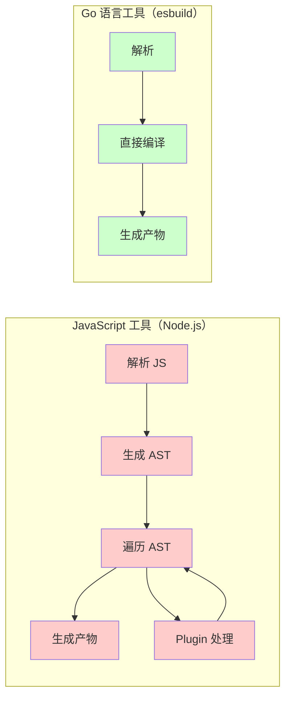
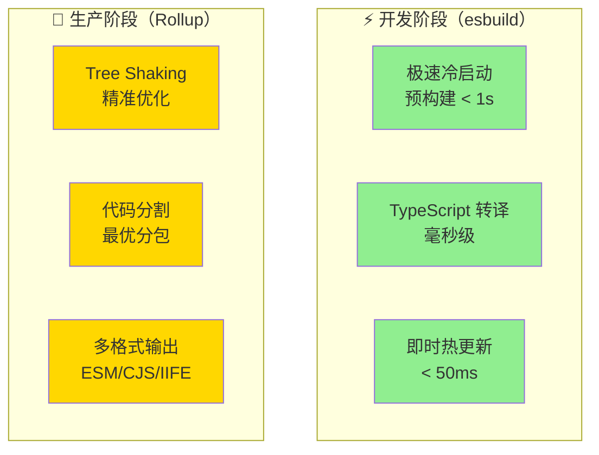

+++
title = "第16章 esbuild 与 Rollup"
weight = 160
date = "2026-03-27T17:13:00+08:00"
type = "docs"
description = ""
isCJKLanguage = true
draft = false
+++

# Chapter-16-esbuild-And-Rollup

# 第16章：esbuild 与 Rollup

> Vite 的极速体验，背后有两个功臣：**esbuild** 和 **Rollup**。
>
> esbuild 负责"快"——开发时的依赖预构建、TypeScript 转译、JSX 转译，它都能在毫秒级完成。
>
> Rollup 负责"优"——生产构建时的 Tree Shaking、代码分割、产物优化，它都是业界标杆。
>
> 这一章，我们就来好好聊聊这两个工具：它们是什么？怎么工作的？在 Vite 中是怎么分工合作的？

---

## 16.1 esbuild 详解

### 16.1.1 esbuild 是什么

**esbuild** 是由 Go 语言编写的高速 JavaScript 打包/压缩工具，由 Figma 的 CTO Evan Wallace 于 2020 年创建。

**esbuild 的核心特点**：

| 特性 | 说明 |
|------|------|
| **Go 语言编写** | 编译成机器码，执行效率极高 |
| **多线程并行** | 充分利用多核 CPU |
| **不传递 AST** | 直接在解析后执行所有操作，不通过插件 API 传递 AST，节省内存 |
| **极快的速度** | 比 Webpack 快 10~100 倍 |

**速度对比**（官方 benchmark）：

| 工具 | 速度 | 相对 esbuild |
|------|------|-------------|
| esbuild | 0.37s | 1x（基准） |
| parcel | 5.39s | 14x |
| rollup | 16.97s | 46x |
| webpack | 22.97s | 62x |

> 💡 **为什么 esbuild这么快？**
> 传统打包工具（Webpack、Rollup）使用 JavaScript 编写，解析代码后会生成 AST（抽象语法树），然后在不同插件之间传递 AST，最后才生成产物。这个过程涉及大量的内存分配和对象操作。
>
> esbuild 使用 Go 语言直接编译为机器码（native code），跳过 AST 传递这一步，所以极快。

### 16.1.2 Go 语言的高性能优势

**Go vs JavaScript 性能对比**：



### 16.1.3 esbuild 的 Transform API

esbuild 提供了简单的 API 来进行代码转换。

**基本用法**：

```javascript
// 安装 esbuild
// pnpm add -D esbuild

import * as esbuild from 'esbuild'

// 转换 TypeScript → JavaScript
const result = await esbuild.transform(`
  const add = (a: number, b: number): number => a + b
  console.log(add(1, 2))
`, {
  loader: 'ts',
  format: 'esm',
})

console.log(result.code)
// 输出：
// const add = (a, b) => a + b;
// console.log(add(1, 2));
```

**完整 Build API**：

```javascript
// 打包多个文件
await esbuild.build({
  entryPoints: ['src/main.ts', 'src/utils.ts'],
  bundle: true,
  outdir: 'dist',
  format: 'esm',
  loader: {
    '.ts': 'ts',
    '.tsx': 'tsx',
  },
  minify: true,
  sourcemap: true,
  define: {
    '__VERSION__': '"1.0.0"',
  },
})
```

### 16.1.4 esbuild 的 Build API

**构建产物**：

```javascript
const result = await esbuild.build({
  entryPoints: ['src/index.ts'],
  bundle: true,
  outfile: 'dist/bundle.js',
  minify: false,
  sourcemap: true,
  target: ['es2020'],
  platform: 'browser',  // 'browser' | 'node' | 'neutral'
  format: 'esm',         // 'esm' | 'cjs' | 'iife'
})

console.log(result.outputFiles)  // 输出文件信息
```

### 16.1.5 esbuild 的限制

esbuild 虽然快，但也有一些限制：

| 限制 | 说明 |
|------|------|
| **不支持自定义 AST 遍历** | 插件无法深度定制 AST 操作 |
| **Tree Shaking 能力有限** | 不如 Rollup 精细 |
| **不支持自定义模块解析** | 不如 Rollup 灵活 |
| **CSS Modules 支持有限** | 需要额外配置 |

**Vite 选择 esbuild 的原因**：
- 开发时速度优先，esbuild 完全够用
- 生产时用 Rollup 做优化
- 两者互补，各司其职

---

## 16.2 Rollup 详解

### 16.2.1 Rollup 的设计理念

**Rollup** 是专为 JavaScript 库设计的打包工具，诞生于 2015 年。它的设计理念是：

> "专注于 ES Module，让代码体积最小化"

**Rollup 的核心特点**：

| 特性 | 说明 |
|------|------|
| **原生 ES Module** | 基于 ESM 设计，Tree Shaking 能力极强 |
| **专注于库** | 适合打包 npm 包、库 |
| **多格式输出** | ESM、CommonJS、UMD、IIFE |
| **插件系统** | 基于插件的架构，非常灵活 |

### 16.2.2 Tree Shaking 原理（静态分析）

Rollup 的 Tree Shaking 基于 ES Module 的**静态结构**。

**ES Module 的静态特性**：

```javascript
// ES Module 的 import/export 是编译时确定的
// 这意味着 Rollup 可以在不执行代码的情况下分析依赖

// main.js
import { add } from './math.js'
console.log(add(1, 2))

// math.js
export function add(a, b) { return a + b }
export function subtract(a, b) { return a - b }  // ← Rollup 分析出没被用到，删除
```

**Rollup 的 Tree Shaking 流程**：


**为什么 Rollup 的 Tree Shaking 比 Webpack 强？**

| 方面 | Rollup | Webpack |
|------|--------|---------|
| 模块系统 | 原生 ESM | CommonJS + ESM 混用 |
| 分析时机 | 编译时静态分析 | 需要运行时信息 |
| 副作用处理 | 较精确 | 需要手动配置 |
| 标记清除 | 精确 | 可能遗漏 |

### 16.2.3 插件系统详解

Rollup 的插件系统非常强大，是 Vite 插件系统的基础。

**插件的基本结构**：

```javascript
// 一个简单的 Rollup 插件
function myPlugin(options = {}) {
  return {
    name: 'my-plugin',  // 插件名称（必须唯一）
    
    // 解析模块 ID（import 语句时调用）
    resolveId(source, importer) {
      // 处理自定义路径
      if (source.startsWith('my:')) {
        return source.slice(3)  // 返回解析后的路径
      }
      return null  // 返回 null 表示不处理，使用默认解析
    },
    
    // 加载模块（返回模块内容）
    load(id) {
      if (id === 'virtual:module') {
        return `export const message = 'Hello from virtual module!'`
      }
      return null  // 返回 null 表示不处理
    },
    
    // 转换代码
    transform(code, id) {
      if (id.endsWith('.custom')) {
        // 转换 .custom 文件为 JavaScript
        return {
          code: transformCustomToJS(code),
          map: generateSourceMap(),
        }
      }
      return null  // 返回 null 表示不处理
    },
    
    // 生成 bundle 之前
    buildStart() {
      // 可以在这里初始化一些东西
    },
    
    // 生成 bundle 之后
    generateBundle(options, bundle) {
      // 可以在这里修改输出文件
      // 比如添加额外的文件
    },
  }
}
```

### 16.2.4 代码分割实现

Rollup 的代码分割非常强大，支持多种分割策略。

**自动代码分割**：

```javascript
// Rollup 会自动识别 dynamic import 进行分割
// main.js
import { add } from './math.js'
import('./utils.js').then(utils => {
  console.log(utils.format())
})
```

**手动分包配置**：

```javascript
// vite.config.js
export default defineConfig({
  build: {
    rollupOptions: {
      output: {
        manualChunks: {
          // 把 vue 生态打包到一起
          'vue-vendor': ['vue', 'vue-router', 'pinia'],
          // 把大库单独打包
          'lodash': ['lodash-es'],
        },
      },
    },
  },
})
```

### 16.2.5 输出格式解析

**Rollup 支持的输出格式**：

| 格式 | 适用场景 | 代码示例 |
|------|----------|----------|
| `es` | 现代浏览器，支持 ESM | `import { add } from './math.js'` |
| `cjs` | Node.js 环境 | `const { add } = require('./math.js')` |
| `umd` | 浏览器 + Node.js | `IIFE` 包装，支持 AMD/CommonJS |
| `iife` | 浏览器直接用 | `<script>var bundle = (function() {...})()</script>` |
| `system` | SystemJS 加载器 | `System.register('module', ...)` |

**输出格式代码对比**：

```javascript
// ES Module (es)
import { add } from './math.js'

// CommonJS (cjs)
const { add } = require('./math.js')
module.exports = { add }

// UMD (umd)
(function(root, factory) {
  if (typeof module === 'object' && module.exports) {
    module.exports = factory()
  } else {
    root.MyLib = factory()
  }
}(this, function() {
  return { add: function(a, b) { return a + b } }
}))

// IIFE (iife)
var MyLib = (function() {
  'use strict'
  return { add: function(a, b) { return a + b } }
})()
```

---

## 16.3 Vite 中的协作

### 16.3.1 开发时使用 esbuild

**Vite 开发阶段的 esbuild 使用场景**：

| 场景 | 具体任务 |
|------|----------|
| 依赖预构建 | CommonJS → ESM 转换、合并小模块 |
| TypeScript 编译 | TS → JS 转换 |
| JSX 编译 | JSX → JS 转换 |
| CSS 编译 | CSS Modules 支持 |

```javascript
// Vite 开发时的 esbuild 配置
export default defineConfig({
  esbuild: {
    // JSX 配置
    jsxFactory: 'h',
    jsxFragment: 'Fragment',
    
    // TypeScript 配置
    target: 'esnext',
    
    // 日志级别
    logLevel: 'info',
    
    // 定义全局变量
    define: {
      __DEBUG__: 'false',
    },
  },
  
  optimizeDeps: {
    // esbuild 预构建选项
    include: ['vue', 'vue-router'],
    esbuildOptions: {
      target: 'esnext',
    },
  },
})
```

### 16.3.2 生产时使用 Rollup

**Vite 生产阶段的 Rollup 使用场景**：

| 场景 | 具体任务 |
|------|----------|
| Tree Shaking | 移除未使用的代码 |
| 代码分割 | 自动分包、手动分包 |
| 产物优化 | 压缩、混淆 |
| 多格式输出 | ESM、IIFE、Library 模式 |

```javascript
// Vite 生产时的 Rollup 配置
export default defineConfig({
  build: {
    target: 'esnext',
    minify: 'terser',  // 使用 terser 压缩
    
    rollupOptions: {
      input: {
        main: path.resolve(__dirname, 'index.html'),
      },
      output: {
        entryFileNames: 'js/[name]-[hash].js',
        chunkFileNames: 'js/[name]-[hash].js',
        assetFileNames: 'assets/[name]-[hash][extname]',
        
        manualChunks: {
          'vue-vendor': ['vue', 'vue-router'],
        },
      },
    },
  },
})
```

### 16.3.3 两者的优势互补

**Vite 的"双引擎"架构**：



**为什么 Vite 选择 esbuild + Rollup？**

| 方面 | esbuild | Rollup |
|------|---------|--------|
| 开发时速度 | ⭐⭐⭐⭐⭐ | ⭐⭐ |
| Tree Shaking | ⭐⭐⭐ | ⭐⭐⭐⭐⭐ |
| 代码分割 | ⭐⭐ | ⭐⭐⭐⭐⭐ |
| 插件生态 | ⭐⭐ | ⭐⭐⭐⭐⭐ |
| 产物优化 | ⭐⭐⭐ | ⭐⭐⭐⭐⭐ |

Vite 的策略是：
- **开发时**：牺牲部分优化能力，换取极致速度（esbuild）
- **生产时**：牺牲一点速度，换取最优产物质量（Rollup）

### 16.3.4 Vite 6 的新变化

> ⚠️ **注意**：以下内容基于 Vite 6 的公开 roadmap 整理，具体配置项请以 Vite 官方 release notes 为准。

**Vite 6 对 esbuild 和 Rollup 的可能改进**：

```javascript
// Vite 6 的配置选项（请以官方文档为准）
export default defineConfig({
  // 更好的预构建缓存
  optimizeDeps: {
    // 预构建时的 build info（具体 API 待确认）
    buildInfo: true,
  },
  
  // Rollup 升级带来的改进
  build: {
    // 更精确的 Tree Shaking（具体配置待确认）
    treeShaking: true,
    
    // 更好的代码分割
    modulePreload: {
      polyfill: false,  // 减少 polyfill 体积
    },
  },
})
```

---

## 16.4 本章小结

### 🎉 本章总结

这一章我们深入学习了 esbuild 和 Rollup：

1. **esbuild 详解**：esbuild 是什么（Go 语言编写，极速）、为什么快（无 AST 传递、多线程）、Transform API、Build API、esbuild 的限制

2. **Rollup 详解**：Rollup 的设计理念（专注于 ESM）、Tree Shaking 原理（静态分析）、插件系统详解、代码分割实现、输出格式解析（ES/CJS/UMD/IIFE）

3. **Vite 中的协作**：开发时用 esbuild（预构建、TS 编译）、生产时用 Rollup（Tree Shaking、代码分割）、两者优势互补（速度 vs 质量）、Vite 6 的新变化

### 📝 本章练习

1. **esbuild 体验**：用 esbuild 的 CLI 转换一个 TypeScript 文件，感受它的速度

2. **Rollup 打包**：用 Rollup 打包一个简单的 npm 库，输出多种格式

3. **对比实验**：对比 esbuild 和 Rollup 打包同一个项目的速度

4. **阅读源码**：阅读 esbuild 的 benchmark 代码，理解它的优化策略

5. **Tree Shaking 实验**：创建一个项目，使用 lodash-es 和 lodash，对比打包后的体积差异

---

> 📌 **预告**：下一章我们将学习 **编写自定义插件**，从零开始创建一个 Vite 插件。敬请期待！
