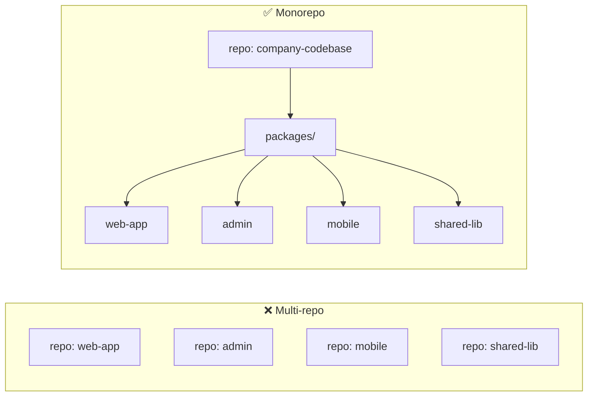
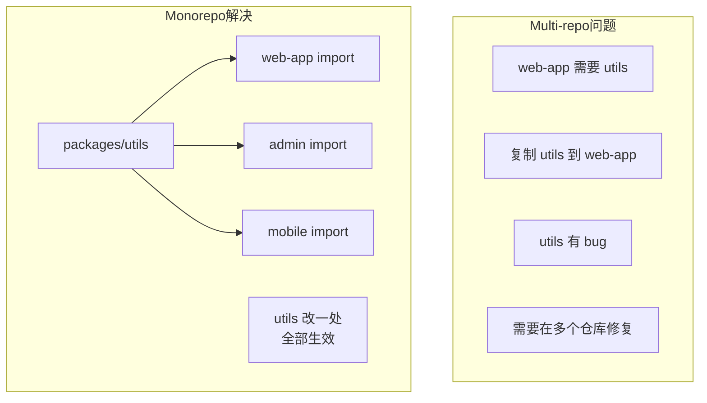
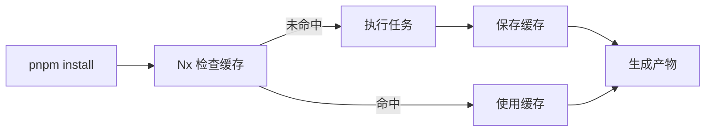
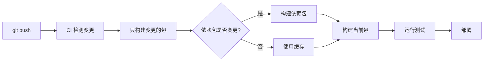

+++
title = "第18章 Monorepo 与大型项目"
weight = 180
date = "2026-03-27T17:13:00+08:00"
type = "docs"
description = ""
isCJKLanguage = true
draft = false
+++

# Chapter-18-Monorepo-And-Large-Projects

# 第18章：Monorepo 与大型项目

> 想象一下这个场景：你在维护 5 个前端项目，每个项目都有相似的配置、相似的工具函数、相似的组件。然后某天，你发现一个工具函数有 bug，需要在 5 个项目中都改一遍...
>
> **Monorepo** 就是来解决这个问题的。它让你把所有项目放在一个代码仓库里，共享代码、共享配置、统一管理。
>
> 这一章，我们就来聊聊 Monorepo 的概念，以及在 Vite 项目中如何使用 pnpm workspace、Turborepo、Nx 等工具来管理大型项目。

---

## 18.1 Monorepo 概念

### 18.1.1 什么是 Monorepo

**Monorepo**（Monolithic Repository）是一种代码仓库管理方式——把多个项目（包）放在一个 Git 仓库中管理。

**对比：Monorepo vs Multi-repo**：

| 方面 | Multi-repo（多仓库） | Monorepo（单仓库） |
|------|---------------------|-------------------|
| 仓库数量 | 每个项目一个仓库 | 多个项目一个仓库 |
| 代码共享 | 复制粘贴 或 npm 包 | 直接 import |
| 版本管理 | 每个项目独立版本 | 统一版本 |
| 配置复用 | 各自配置 | 共享配置 |
| 跨项目修改 | 需要发布 npm 包 | 原子提交 |
| CI/CD | 每个项目独立 | 需要特殊配置 |



### 18.1.2 Monorepo 的优势

**代码共享与复用**：



**统一开发体验**：
- 统一的代码规范（ESLint、Prettier）
- 统一的工具链（TypeScript、Vite）
- 统一的 CI/CD 流程
- 统一的依赖版本

### 18.1.3 Monorepo 的挑战

| 挑战 | 解决方案 |
|------|----------|
| 仓库体积大 | Git shallow clone、LFS |
| 构建时间长 | Turborepo/Nx 增量构建 |
| 权限管理 | 按目录分配权限 |
| 学习曲线 | 新人需要了解整个结构 |

### 18.1.4 工具选择

| 工具 | 特点 | 适用场景 |
|------|------|----------|
| **pnpm workspace** | 简单，内置在 pnpm 中 | 中小型 Monorepo |
| **Turborepo** | 增量构建、远程缓存 | 大型项目 |
| **Nx** | 功能强大、计算缓存 | 超大型项目 |
| **Lerna** | ⚠️ 已停止维护 | 仅作参考 |

---

## 18.2 pnpm Workspace

### 18.2.1 workspace 配置

**创建 pnpm workspace**：

```bash
# 在项目根目录创建 pnpm-workspace.yaml
mkdir my-monorepo
cd my-monorepo
pnpm init
```

```yaml
# pnpm-workspace.yaml
packages:
  # 所有 packages 目录下的项目
  - 'packages/*'
  # 也可以指定多个目录
  - 'apps/*'
  - 'libs/*'
```

### 18.2.2 依赖管理

**项目结构**：

```
my-monorepo/
├── pnpm-workspace.yaml    # workspace 配置
├── pnpm-lock.yaml        # 统一 lock 文件
├── .npmrc                 # pnpm 配置
│
├── apps/
│   ├── web/               # 主应用
│   │   ├── package.json
│   │   └── src/
│   └── admin/             # 管理后台
│       ├── package.json
│       └── src/
│
└── packages/
    ├── utils/            # 工具库
    │   ├── package.json
    │   └── src/
    ├── components/         # 组件库
    │   ├── package.json
    │   └── src/
    └── shared/            # 共享类型
        ├── package.json
        └── src/
```

**package.json 配置**：

```json
// apps/web/package.json
{
  "name": "@my-org/web",
  "version": "1.0.0",
  "private": true,
  "scripts": {
    "dev": "vite",
    "build": "vite build"
  },
  "dependencies": {
    "@my-org/utils": "workspace:*",
    "@my-org/components": "workspace:*",
    "@my-org/shared": "workspace:*",
    "vue": "^3.4.0"
  }
}
```

### 18.2.3 脚本共享

**在根目录配置 scripts**：

```json
// 根目录 package.json
{
  "name": "my-monorepo",
  "private": true,
  "scripts": {
    "dev": "pnpm -r --parallel dev",
    "build": "pnpm -r build",
    "test": "pnpm -r test",
    "lint": "pnpm -r lint",
    "clean": "pnpm -r clean"
  },
  "devDependencies": {
    "eslint": "^8.57.0",
    "prettier": "^3.2.0"
  }
}
```

### 18.2.4 跨包引用

**在包之间引用**：

```typescript
// packages/utils/src/index.ts
export function formatDate(date: Date): string {
  return date.toLocaleDateString('zh-CN')
}

// apps/web/src/main.ts
// 直接引用，不需要 npm install
import { formatDate } from '@my-org/utils'

console.log(formatDate(new Date()))  // 2024/3/27
```

**发布时自动替换 workspace 依赖**：

```json
// packages/utils/package.json
{
  "name": "@my-org/utils",
  "version": "1.0.0",
  "main": "./dist/index.js",
  "publishConfig": {
    "access": "public",
    "registry": "https://npm.pkg.github.com"
  }
}
```

---

## 18.3 Turborepo 集成

### 18.3.1 Turborepo 简介

**Turborepo** 是 Vercel 出品的构建系统，专门解决 Monorepo 的构建问题。

**核心特性**：
- **增量构建**：只构建变更的内容
- **远程缓存**：在 CI 中共享构建结果
- **并行执行**：充分利用多核 CPU
- **任务编排**：定义任务依赖关系

### 18.3.2 Pipeline 配置

**turbo.json**：

```json
{
  "$schema": "https://turbo.build/schema.json",
  "globalDependencies": [
    ".env"
  ],
  "pipeline": {
    "build": {
      "dependsOn": ["^build"],
      "outputs": ["dist/**", ".next/**"]
    },
    "dev": {
      "cache": false,
      "persistent": true
    },
    "lint": {
      "outputs": []
    },
    "test": {
      "outputs": ["coverage/**"],
      "dependsOn": ["build"]
    },
    "clean": {
      "cache": false
    }
  }
}
```

**字段说明**：

| 字段 | 说明 |
|------|------|
| `dependsOn` | 任务依赖 |
| `^build` | 依赖所有上游包的 build 任务 |
| `outputs` | 产物目录（用于缓存） |
| `cache` | 是否缓存结果 |

### 18.3.3 远程缓存

**配置远程缓存（Vercel）**：

```bash
# 登录 Vercel
vercel login

# 链接项目
cd my-monorepo
npx turbo link
```

**.github/workflows/ci.yml**：

```yaml
name: CI

on:
  push:
    branches: [main]

jobs:
  build:
    runs-on: ubuntu-latest
    steps:
      - uses: actions/checkout@v4
        
      - uses: pnpm/action-setup@v2
        with:
          version: 9
          
      - uses: actions/setup-node@v4
        with:
          node-version: 20
          cache: 'pnpm'
          
      - name: Install dependencies
        run: pnpm install --frozen-lockfile
        
      - name: Build
        run: pnpm build
        
      - name: Run tests
        run: pnpm test
        
      - name: Turbo Remote Cache
        uses: vercel/turborepo-cache-action@v1
        with:
          token: ${{ secrets.VERCEL_TOKEN }}
```

### 18.3.4 本地缓存

**本地缓存配置**：

```bash
# .gitignore
.turbo/
```

---

## 18.4 Nx 集成

### 18.4.1 Nx 简介

**Nx** 是一个功能强大的 Monorepo 工具，提供了计算缓存、依赖分析、代码生成等功能。

**特点**：
- 计算缓存（本地 + 远程）
- 强大的依赖图
- 代码生成器
- IDE 集成

### 18.4.2 计算缓存

**Nx 缓存机制**：



### 18.4.3 依赖分析

```bash
# 查看项目依赖图
npx nx graph

# 分析某个包的影响范围
npx nx affected:dep-graph
```

### 18.4.4 插件生态

| 插件 | 说明 |
|------|------|
| @nx/vite | Vite 支持 |
| @nx/js | JavaScript/TypeScript |
| @nx/react | React |
| @nx/vue | Vue |
| @nx/node | Node.js |

---

## 18.5 大型项目最佳实践

### 18.5.1 项目结构设计

**推荐的 Monorepo 结构**：

```
my-org/
├── .github/
│   └── workflows/
│       └── ci.yml
│
├── .vscode/
│   ├── extensions.json
│   └── settings.json
│
├── packages/
│   ├── ui/               # 共享 UI 组件库
│   │   ├── package.json
│   │   ├── src/
│   │   ├── Button.vue
│   │   └── index.ts
│   │   └── tsconfig.json
│   │
│   ├── utils/            # 工具函数库
│   │   ├── package.json
│   │   └── src/
│   │       ├── format.ts
│   │       ├── storage.ts
│   │       └── index.ts
│   │   └── tsconfig.json
│   │
│   └── types/            # 共享类型定义
│       ├── package.json
│       └── src/
│           ├── user.ts
│           └── index.ts
│
├── apps/
│   ├── web/              # 主应用
│   │   ├── package.json
│   │   ├── vite.config.ts
│   │   └── src/
│   │
│   ├── admin/            # 管理后台
│   │   ├── package.json
│   │   ├── vite.config.ts
│   │   └── src/
│   │
│   └── docs/             # 文档站
│       ├── package.json
│       ├── vite.config.ts
│       └── src/
│
├── tooling/
│   ├── eslint/           # ESLint 配置
│   ├── prettier/          # Prettier 配置
│   └── tsconfig/         # TypeScript 基础配置
│
├── pnpm-workspace.yaml
├── turbo.json
├── package.json
└── README.md
```

### 18.5.2 共享配置管理

**共享 ESLint 配置**：

```json
// tooling/eslint/package.json
{
  "name": "@my-org/eslint-config",
  "version": "1.0.0",
  "main": "index.js",
  "dependencies": {
    "eslint": "^8.57.0",
    "@typescript-eslint/eslint-plugin": "^7.0.0",
    "@typescript-eslint/parser": "^7.0.0",
    "vue-eslint-parser": "^9.4.0"
  }
}
```

```javascript
// tooling/eslint/index.js
module.exports = {
  extends: [
    'eslint:recommended',
    'plugin:@typescript-eslint/recommended',
    'plugin:vue/vue3-recommended',
  ],
  parser: '@typescript-eslint/parser',
  parserOptions: {
    ecmaVersion: 2022,
    sourceType: 'module',
  },
  plugins: ['@typescript-eslint', 'vue'],
  rules: {
    // 自定义规则
  },
}
```

**应用中使用**：

```json
// apps/web/package.json
{
  "eslintConfig": {
    "extends": ["@my-org/eslint-config"]
  }
}
```

### 18.5.3 构建优化策略

**使用 Turborepo 优化**：

```json
// turbo.json
{
  "pipeline": {
    "build": {
      "dependsOn": ["^build"],
      "outputs": ["dist/**"]
    },
    "test": {
      "dependsOn": ["build"],
      "outputs": ["coverage/**"]
    },
    "lint": {
      "outputs": []
    }
  }
}
```

**增量构建流程**：



### 18.5.4 代码质量保障

**统一的代码规范**：

```json
// tooling/prettier/package.json
{
  "name": "@my-org/prettier-config",
  "version": "1.0.0",
  "main": "index.json"
}
```

```json
// tooling/prettier/index.json
{
  "semi": false,
  "singleQuote": true,
  "tabWidth": 2,
  "trailingComma": "all"
}
```

**Husky + lint-staged**：

```bash
pnpm add -D husky lint-staged
npx husky install

# 添加 pre-commit hook
npx husky add .husky/pre-commit "npx lint-staged"
```

```json
// package.json
{
  "lint-staged": {
    "*.{ts,tsx,vue}": [
      "eslint --fix",
      "prettier --write"
    ],
    "*.{json,css,scss}": [
      "prettier --write"
    ]
  }
}
```

---

## 18.6 本章小结

### 🎉 本章总结

这一章我们学习了 Monorepo 与大型项目管理：

1. **Monorepo 概念**：什么是 Monorepo、与 Multi-repo 对比、优势（代码共享、统一配置）、挑战（体积、构建时间）、工具选择

2. **pnpm Workspace**：workspace 配置、依赖管理、脚本共享、跨包引用

3. **Turborepo 集成**：Turborepo 简介、Pipeline 配置（turbo.json）、远程缓存、本地缓存

4. **Nx 集成**：Nx 简介、计算缓存、依赖分析、插件生态

5. **大型项目最佳实践**：项目结构设计（packages/apps/tooling）、共享配置管理（ESLint/Prettier）、构建优化策略（Turborepo 增量构建）、代码质量保障（Husky/lint-staged）

### 📝 本章练习

1. **创建 Monorepo**：使用 pnpm workspace 创建一个简单的 Monorepo 项目

2. **添加 Turborepo**：为你的 Monorepo 添加 Turborepo 配置

3. **共享配置**：创建一个共享的 ESLint 和 Prettier 配置

4. **CI 配置**：配置 GitHub Actions CI/CD

5. **依赖分析**：使用 Nx 或 Turborepo 分析项目依赖图

---

> 📌 **预告**：下一章我们将学习 **SSR 与 SSG**，包括 Nuxt 3、Next.js、Astro、混合渲染等内容。敬请期待！
