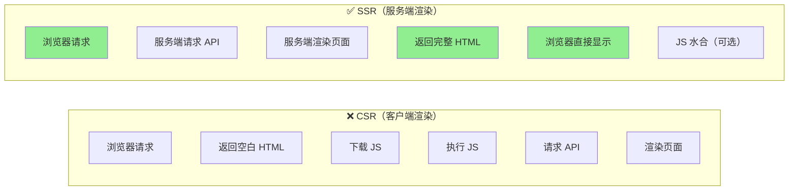
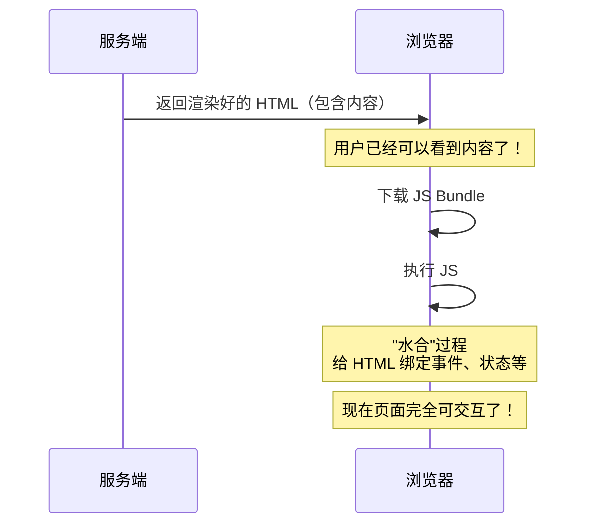
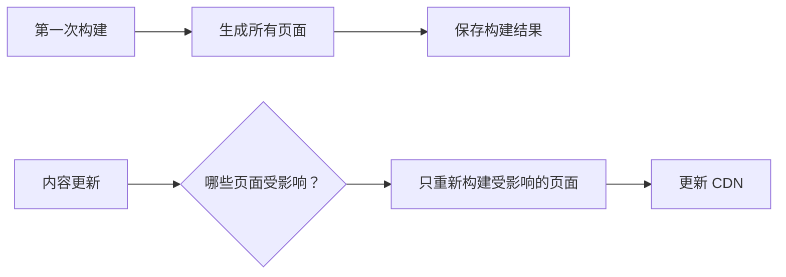
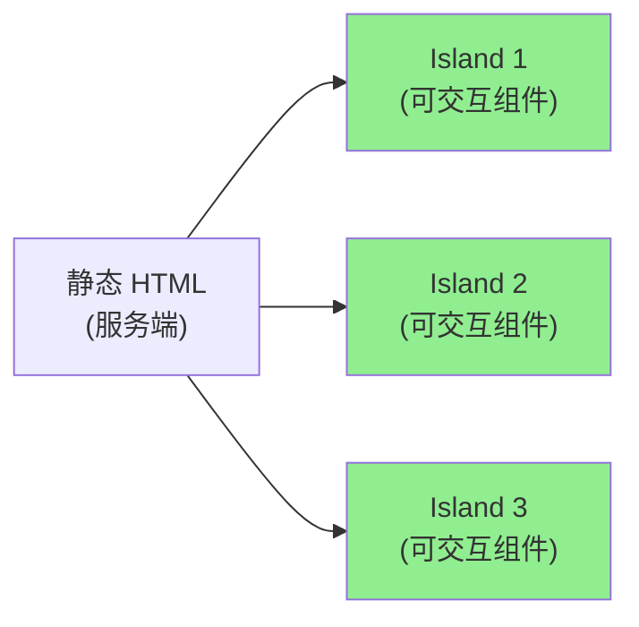

+++
title = "第19章 SSR 与 SSG"
weight = 190
date = "2026-03-27T17:13:00+08:00"
type = "docs"
description = ""
isCJKLanguage = true
draft = false
+++

# Chapter-19-SSR-And-SSG

# 第19章：SSR 与 SSG

> 传统的 Vue/React 应用都是"客户端渲染"（CSR）——浏览器下载一个空的 HTML，然后 JavaScript 去请求数据、渲染页面。
>
> 这带来了两个问题：**SEO 不友好**（搜索引擎看到的是空页面）和**首屏加载慢**（需要等 JS 下载完才能看到内容）。
>
> **SSR**（Server-Side Rendering，服务端渲染）和 **SSG**（Static Site Generation，静态站点生成）就是来解决这两个问题的。
>
> 这一章，我们就来聊聊 SSR、SSG、以及它们的各种变形。

---

## 19.1 服务端渲染（SSR）

### 19.1.1 SSR 的概念与优势

**CSR vs SSR 对比**：



**SSR 的优势**：

| 方面 | CSR | SSR |
|------|-----|-----|
| **首屏速度** | 慢（需等 JS） | 快（服务端直接返回 HTML） |
| **SEO** | 差 | 好 |
| **服务器负载** | 低 | 较高 |
| **交互性** | 立即可用 | 需要水合（Hydration） |
| **适用场景** | 后台系统、登录页 | 内容网站、电商、博客 |

### 19.1.2 SSR 的挑战

**水合（Hydration）**：



**常见挑战**：

| 挑战 | 说明 | 解决方案 |
|------|------|----------|
| **水合不匹配** | 服务端和客户端渲染结果不一致 | 使用稳定的 DOM 结构 |
| **状态序列化** | 把服务端状态传给客户端 | `window.__INITIAL_STATE__` |
| **API 请求** | 不能用浏览器的 API | `ServerRef`、cookie 处理 |
| **第三方库** | 有些库不支持 SSR | 使用 `ssr: false` |

### 19.1.3 Vite 的 SSR API

**Vite SSR 基础配置**：

```typescript
// vite.config.ts
import { defineConfig } from 'vite'

export default defineConfig({
  ssr: {
    // SSR 入口文件
    noExternal: ['vue', 'vue-router', 'pinia'],
    external: ['mysql', 'redis'],
  },
})
```

**SSR 入口文件**：

```typescript
// src/ssr-entry.ts
import { createApp } from 'vue'
import { createRouter, createMemoryHistory } from 'vue-router'
import App from './App.vue'

const router = createRouter({
  history: createMemoryHistory(),
  routes: [],
})

const app = createApp(App)
app.use(router)

export { app, router }
```

### 19.1.4 Vue3 SSR 实现

**手动实现 Vue SSR**：

```typescript
// server.ts
import { createServer } from 'http'
import { readFileSync } from 'fs'
import { resolve, join } from 'path'
import { renderToString } from 'vue/server-renderer'
import { createApp } from './src/ssr-entry'

const server = createServer(async (req, res) => {
  const { app, router } = createApp()
  
  // 设置 URL
  router.push(req.url)
  
  // 等待路由就绪
  await router.isReady()
  
  // 渲染
  const html = await renderToString(app)
  
  // 返回完整 HTML
  const template = readFileSync(join(__dirname, 'index.html'), 'utf-8')
  const finalHtml = template.replace('<!--app-->', html)
  
  res.setHeader('Content-Type', 'text/html')
  res.end(finalHtml)
})

server.listen(3000, () => {
  console.log('SSR 服务器运行在 http://localhost:3000')
})
```

### 19.1.5 React SSR 实现

**React SSR 示例**：

```typescript
// server.tsx
import { createServer } from 'http'
import { readFileSync } from 'fs'
import { join } from 'path'
import React from 'react'
import { renderToString } from 'react-dom/server'
import { StaticRouter } from 'react-router-dom/server'
import App from './App'

const server = createServer((req, res) => {
  const context = {}
  
  const html = renderToString(
    <StaticRouter location={req.url} context={context}>
      <App />
    </StaticRouter>
  )
  
  const template = readFileSync(join(__dirname, 'index.html'), 'utf-8')
  const finalHtml = template.replace('<!--app-->', html)
  
  res.setHeader('Content-Type', 'text/html')
  res.end(finalHtml)
})

server.listen(3000)
```

---

## 19.2 静态站点生成（SSG）

### 19.2.1 SSG 的工作原理

**SSG vs SSR**：

| 方面 | SSG | SSR |
|------|-----|-----|
| **渲染时机** | 构建时（一次性） | 每次请求时 |
| **页面内容** | 静态 HTML | 动态生成 |
| **部署** | CDN（静态文件） | 服务器 |
| **适合** | 内容不变或变化少的网站 | 内容经常变化的网站 |

### 19.2.2 预渲染配置

**Vite 的 SSG**：

```typescript
// vite.config.ts
import { defineConfig } from 'vite'
import vue from '@vitejs/plugin-vue'

export default defineConfig({
  plugins: [
    vue(),
    {
      name: 'vite-plugin-ssg',
      renderPage: async (url, content) => {
        // 生成静态 HTML
        const template = await readFile('index.html', 'utf-8')
        return template.replace('<!--app-->', content)
      },
    },
  ],
})
```

### 19.2.3 增量构建

**增量构建策略**：



---

## 19.3 混合渲染

### 19.3.1 流式 SSR

**流式渲染（Streaming SSR）**：

```typescript
// 流式 SSR
import { renderToPipeableStream } from 'react-dom/server'

app.use((req, res) => {
  const stream = renderToPipeableStream(<App />, {
    url: req.url,
    onShellReady() {
      res.setHeader('Content-Type', 'text/html')
      stream.pipe(res)
    },
    onAllReady() {
      // 所有内容都准备好了
    },
  })
})
```

### 19.3.2 选择性水合

**Suspense + Selective Hydration**：

```tsx
// React 18
function App() {
  return (
    <div>
      {/* 水合优先级高 */}
      <Header />
      
      {/* 水合优先级低，可以延迟 */}
      <Suspense fallback={<Loading />}>
        <Comments />
      </Suspense>
      
      {/* 水合优先级低 */}
      <Suspense fallback={<Loading />}>
        <RelatedPosts />
      </Suspense>
    </div>
  )
}
```

### 19.3.3 Islands 架构

**Islands 架构**（Astro 采用）：



---

## 19.4 元框架集成

### 19.4.1 Nuxt 3（Vue SSR/SSG）

**Nuxt 3** 是 Vue 官方推荐的 SSR/SSG 框架，基于 Vite 构建。

```bash
# 创建 Nuxt 项目
npx nuxi@latest init my-nuxt-app
cd my-nuxt-app
pnpm install
pnpm dev
```

**Nuxt 3 核心概念**：

| 概念 | 说明 |
|------|------|
| `pages/` | 页面目录，自动生成路由 |
| `components/` | 自动导入组件 |
| `composables/` | 自动导入组合式函数 |
| `server/` | 服务端 API |
| `layouts/` | 布局组件 |
| `middleware/` | 中间件 |

### 19.4.2 Next.js（React SSR/SSG）

**Next.js** 是 React 官方推荐的 SSR/SSG 框架（使用 SWC 编译）。

```bash
# 创建 Next.js 项目（App Router）
npx create-next-app@latest my-app --typescript --app --src-dir --import-alias "@/*" --use-pnpm
cd my-app
pnpm dev
```

**渲染模式**：

| 模式 | 说明 | 示例 |
|------|------|------|
| SSG | 构建时生成 | 博客文章 |
| SSR | 每次请求生成 | 用户主页 |
| ISR | 增量静态再生 | 电商产品页 |
| CSR | 客户端渲染 | 管理后台 |

```tsx
// Next.js App Router
// app/page.tsx - SSG（默认）
export default function Home() {
  return <h1>首页</h1>
}

// app/posts/[id]/page.tsx - 动态路由
export async function generateStaticParams() {
  const posts = await fetchPosts()
  return posts.map(post => ({ id: post.id }))
}
```

### 19.4.3 Astro（多框架 SSG）

**Astro** 是一个专注于内容网站的 SSG 框架，支持 Vue、React、Svelte 等多个框架。

```bash
# 创建 Astro 项目
npm create astro@latest
```

**Astro 特点**：
- **零 JS 默认**：默认不发送 JavaScript
- **多框架支持**：可以在一个项目混用 Vue、React、Svelte
- **Islands 架构**：只对需要的组件发送 JS

```astro
---
// src/pages/index.astro
import Layout from '../layouts/Layout.astro'
import Counter from '../components/Counter.vue'

// 这部分会作为静态 HTML
const title = '我的博客'
---

<Layout title={title}>
  <!-- 静态 HTML -->
  <h1>{title}</h1>
  
  <!-- Vue 组件（Island）-->
  <!-- 只有这个组件会发送 JS -->
  <Counter client:visible />
</Layout>
```

### 19.4.4 SvelteKit（Svelte 全栈框架）

**SvelteKit** 是 Svelte 的官方全栈框架，支持 SSR、SSG、API routes。

```bash
# 创建 SvelteKit 项目
npm create svelte@latest my-app
```

### 19.4.5 Remix（React 全栈框架）

**Remix** 是 React 的全栈框架，专注于用户体验和 Web 标准。

```bash
# 创建 Remix 项目
npx create-remix@latest
```

### 19.4.6 其他框架

**Fresh（Deno + Preact）**：

```tsx
// routes/index.tsx
import { PageProps } from '$fresh/server.ts'

export default function Page({ url }: PageProps) {
  return (
    <html>
      <head>
        <title>Fresh App</title>
      </head>
      <body>
        <p>URL: {url.pathname}</p>
      </body>
    </html>
  )
}
```

---

## 19.5 本章小结

### 🎉 本章总结

这一章我们学习了 SSR 与 SSG 的相关内容：

1. **SSR 基础**：CSR vs SSR 对比、SSR 优势（SEO、首屏速度）、SSR 挑战（水合、状态序列化）、Vite SSR API、Vue3 SSR 实现、React SSR 实现

2. **SSG 基础**：SSG vs SSR、预渲染配置、增量构建

3. **混合渲染**：流式 SSR、选择性水合、Islands 架构

4. **元框架集成**：Nuxt 3（Vue SSR/SSG）、Next.js（React SSR/SSG）、Astro（多框架 SSG）、SvelteKit、Remix、Fresh

### 📝 本章练习

1. **Vue SSR 体验**：使用 Vite 搭建一个简单的 Vue SSR 应用

2. **Next.js 实践**：创建一个 Next.js 应用，体验 App Router

3. **Astro 探索**：创建一个 Astro 博客

4. **对比实验**：对比 CSR vs SSR 的首屏加载速度和 SEO

5. **Islands 架构**：使用 Astro 构建一个混合使用 Vue 和 React 的网站

---

> 📌 **预告**：最后一章我们将学习 **前沿探索与展望**，包括 Rspack、边缘计算、AI 辅助开发、Turbopack 等前沿话题。敬请期待！
