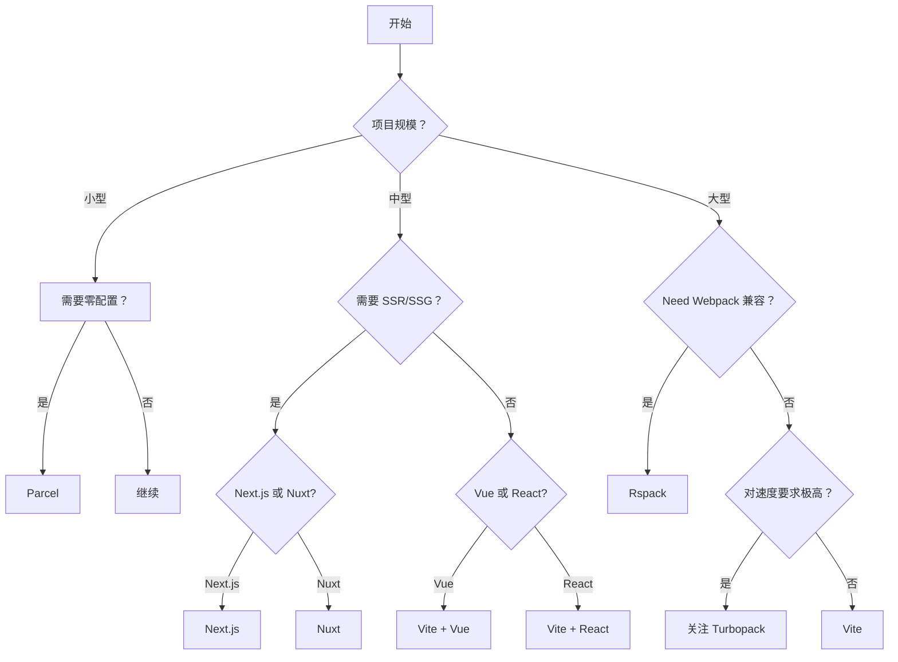

+++
title = "第20章 前沿探索与展望"
weight = 200
date = "2026-03-27T17:13:00+08:00"
type = "docs"
description = ""
isCJKLanguage = true
draft = false
+++

# Chapter-20-Frontier-Exploration

# 第20章：前沿探索与展望

> 恭喜你！能走到这里的同学，已经是 Vite 的深度玩家了。
>
> 这一章，我们来放眼未来，看看前端构建工具领域的最新动态：Rspack 这个"性能怪兽"、边缘计算的崛起、AI 辅助开发的革命、以及 Vite 生态的未来趋势。
>
> 让我们一起探索前端工程化的前沿领域！

---

## 20.1 Vite 生态新趋势

### 20.1.1 Rspack 与 Rust 工具链

**Rspack** 是字节跳动开发的基于 Rust 的高性能 Web 打包工具，兼容 Vite 的 API。

**Rspack 的性能**：

| 指标 | Vite | Rspack |
|------|------|---------|
| 冷启动 | < 2s | **< 0.5s** |
| 热更新 | < 50ms | **< 10ms** |
| 生产构建 | 较快 | **极快** |
| 兼容性 | 与 Webpack 不同 | **与 Webpack 兼容** |

**Rspack 的特点**：

```javascript
// Rspack 配置（与 Vite 高度兼容）
module.exports = {
  context: process.cwd(),
  entry: './src/index.js',
  output: {
    filename: 'main.js',
  },
  module: {
    rules: [
      {
        test: /\.tsx?$/,
        use: 'babel-loader',
      },
    ],
  },
  // Rspack 配置
  builtins: {
    // ⚠️ 注意：新版 Rspack 推荐使用 HtmlRspackPlugin 代替 builtins.html
    html: [
      {
        template: './index.html',
      },
    ],
  },
}
```

**什么时候用 Rspack？**
- 超大型项目（万级模块）
- 需要 Webpack 兼容性
- 对构建速度有极致要求

### 20.1.2 边缘计算与 Vite

**边缘计算**是指在离用户更近的服务器上运行代码，减少延迟。

**Cloudflare Workers + Vite**：

```bash
# 创建 Cloudflare Workers 项目
npm create cloudflare@latest
```

```typescript
// src/index.ts
export default {
  async fetch(request: Request): Promise<Response> {
    const url = new URL(request.url)
    
    // 在边缘节点运行
    if (url.pathname.startsWith('/api/')) {
      // 处理 API 请求
      const data = await fetchData()
      return new Response(JSON.stringify(data), {
        headers: { 'Content-Type': 'application/json' },
      })
    }
    
    // 静态资源（从边缘存储）
    return fetch(request)
  },
}
```

**Vercel Edge Functions**：

```typescript
// api/hello.ts
export const config = { runtime: 'edge' }

export default function handler(req: Request) {
  return new Response(
    JSON.stringify({
      message: 'Hello from the Edge!',
      location: req.headers.get('cf-ipcountry'),
    }),
    {
      headers: { 'Content-Type': 'application/json' },
    }
  )
}
```

### 20.1.3 AI 辅助开发

**AI 在前端开发中的应用**：

| 工具 | 功能 |
|------|------|
| **Cursor** | AI 代码编辑器，支持 GPT-4 / Claude 等多模型 |
| **v0.dev** | Vercel 出品的 AI UI 生成器 |
| **GitHub Copilot** | 代码补全 |
| **Bolt.new** | AI 全栈开发平台 |

**AI + Vite**：

```bash
# Cursor 中创建 Vite 项目
# AI 可以帮你：
# - 写组件代码
# - 调试问题
# - 解释代码
# - 重构代码
```

### 20.1.4 Vite 6 新特性

**Vite 6 的主要更新**：

```typescript
// Vite 6 新特性预览

// 1. 环境变量类型增强
// vite-env.d.ts
/// <reference types="vite/client" />

interface ImportMetaEnv {
  readonly VITE_API_URL: string
  readonly VITE_APP_VERSION: string
}

// 2. 更好的依赖预构建
export default defineConfig({
  optimizeDeps: {
    // 更智能的预构建
    include: ['vue', 'vue-router'],
    exclude: [],
  },
})

// 3. Rollup 4 升级
// 更好的 Tree Shaking
// 更高效的代码分割
```

---

## 20.2 性能优化新方向

### 20.2.1 即时编译（JIT）

**JIT（Just-In-Time）编译**是指在运行时动态编译代码。


### 20.2.2 持久化缓存

**现代浏览器的缓存策略**：

```typescript
// 配置 Cache-Control
export default defineConfig({
  server: {
    headers: {
      // 静态资源缓存 1 年
      '/assets/*': {
        'Cache-Control': 'public, max-age=31536000, immutable',
      },
      // HTML 不缓存
      '/**': {
        'Cache-Control': 'no-cache',
      },
    },
  },
})
```

### 20.2.3 并行构建

**并行构建工具链**：

| 工具 | 并行策略 |
|------|----------|
| **Turborepo** | 任务依赖图 + 多核并行 |
| **Nx** | 计算缓存 + 任务并行 |
| **Rollup** | 多线程打包 |

### 20.2.4 WASM 在构建中的应用

**esbuild 的成功证明了编译工具用高性能语言的价值**。

**WASM 的未来**：
- 更多构建工具可能用 Rust/WASM 重写
- WASM 模块可以直接在浏览器中运行
- WASM 作为通用计算平台

### 20.2.5 Turbopack 与 Vite 的竞争

**Turbopack** 是 Vercel 开发的基于 Rust 的打包工具，声称比 Vite 快 10 倍。

**Turbopack vs Vite**：

| 方面 | Vite | Turbopack |
|------|------|-----------|
| 语言 | TypeScript + Go (esbuild) | Rust |
| 开发速度 | 快 | 极快 |
| 生产构建 | Rollup | Rust |
| 生态 | 成熟 | 新兴 |
| 兼容性 | 广 | 有限 |

**两者如何选择？**
- 如果你用 Vue/React + Vite 已经很快，**继续用 Vite**
- 如果你有极致性能需求，**关注 Turbopack**

### 20.2.6 Rolldown（Rollup 的 Rust 实现）

**Rolldown** 是 Rollup 的 Rust 实现，目标是用 Rust 重新实现 Rollup 的核心功能。


---

## 20.3 构建工具对比

### 20.3.1 Vite vs Webpack

| 方面 | Vite | Webpack |
|------|------|---------|
| 核心 | ESM + Rollup | Bundle |
| 开发速度 | 极快 | 较慢 |
| 生产构建 | Rollup | Webpack |
| 配置 | 简洁 | 复杂 |
| 生态 | 成熟 | 极其丰富 |
| 学习曲线 | 平缓 | 陡峭 |
| 适合项目 | 中小型项目 | 超大型项目 |

### 20.3.2 Vite vs Rspack

| 方面 | Vite | Rspack |
|------|------|--------|
| 语言 | TypeScript | Rust |
| 兼容性 | 标准 | Webpack 兼容 |
| 性能 | 快 | 极快 |
| 插件生态 | 丰富 | 新兴 |

### 20.3.3 Vite vs Parcel

| 方面 | Vite | Parcel |
|------|------|--------|
| 配置 | 需配置（少量） | 零配置 |
| 性能 | 快 | 中等 |
| 灵活性 | 高 | 低 |

### 20.3.4 Vite vs Turbopack

| 方面 | Vite | Turbopack |
|------|------|-----------|
| 状态 | 生产就绪 | 开发预览 |
| 生态 | 成熟 | 新兴 |
| 框架支持 | 多框架 | 主要 Next.js |

### 20.3.5 何时选择哪个工具



---

## 20.4 社区资源

### 20.4.1 官方文档与博客

| 资源 | 地址 |
|------|------|
| Vite 官网 | https://vitejs.dev |
| Vite GitHub | https://github.com/vitejs/vite |
| Vite Discord | https://discord.gg/vite |
| Evan You 博客 | https://blog.evanyou.me |
| Anthony Fu 博客 | https://antfu.me |

### 20.4.2 社区插件推荐

| 插件 | 说明 |
|------|------|
| **vite-plugin-pwa** | PWA 支持 |
| **unplugin-auto-import** | 自动导入 API |
| **vite-plugin-inspect** | 插件审查 |
| **vite-plugin-mock** | Mock 数据 |
| **vite-plugin-ssr** | SSR 支持 |

### 20.4.3 学习资源汇总

| 资源 | 类型 |
|------|------|
| **Vite 官方文档** | 文档 |
| **Vue School Vite 课程** | 视频 |
| **Fireship Vite 视频** | 视频 |
| **awesome-vite** | 资源列表 |
| **Vite Conf** | 会议 |

### 20.4.4 开源项目推荐

| 项目 | 说明 |
|------|------|
| **Vitest** | Vite 原生测试框架 |
| **Slidev** | Vite 驱动的幻灯片工具 |
| **Vike** | 新一代全栈框架（Vite 驱动） |
| **SvelteKit** | Svelte 全栈框架 |
| **Nuxt** | Vue SSR 框架 |

### 20.4.5 Vite Conf 会议

**Vite Conf** 是 Vite 一年一度的开发者大会：

```
2022 Vite Conf - 首次大会
2023 Vite Conf - Vite 5 发布
2024 Vite Conf - Vite 6 发布
2025 Vite Conf - 更多新特性
```

---

## 20.5 持续学习建议

### 20.5.1 关注官方动态

```bash
# 订阅 Vite 更新
# GitHub Watch → Releases

# 关注 Vite Discord
# 参与社区讨论
```

### 20.5.2 参与开源贡献

**如何参与 Vite 开发**：

```bash
# 1. Fork Vite 仓库
git clone https://github.com/YOUR_USERNAME/vite

# 2. 创建分支
git checkout -b fix/my-bug

# 3. 开发
# ...

# 4. 提 PR
```

### 20.5.3 实践出真知

**学习路径**：

```
1. 基础（已完成 ✅）
   - Vite 基础配置
   - 插件使用
   - 框架集成

2. 进阶（已完成 ✅）
   - 生产构建优化
   - 测试与调试
   - CI/CD

3. 原理（已完成 ✅）
   - Vite 核心原理
   - esbuild / Rollup
   - 自定义插件

4. 高级（已完成 ✅）
   - Monorepo
   - SSR/SSG
   - 性能优化

5. 持续学习（进行中...）
   - 关注前沿动态
   - 参与开源
   - 实践大型项目
```

### 20.5.4 关注前端工程化趋势

**前端工程化的未来**：

| 趋势 | 说明 |
|------|------|
| **AI 辅助开发** | 更智能的代码补全、生成、重构 |
| **边缘计算** | 代码在离用户更近的地方运行 |
| **高性能工具** | Rust/WASM 工具链成为主流 |
| **Server Components** | 服务端组件成为标准 |

---

## 🎊 教程完结撒花！

### 📊 最终统计

| 章节 | 标题 | 字节数 |
|------|------|--------|
| 第1章 | 认识 Vite | 15,406 |
| 第2章 | 环境准备与安装 | 20,107 |
| 第3章 | Vite 基础使用 | 27,496 |
| 第4章 | vite.config.js 详解 | 26,223 |
| 第5章 | 插件系统 | 28,015 |
| 第6章 | CSS 处理 | 24,149 |
| 第7章 | 静态资源与构建优化 | 21,835 |
| 第8章 | Vite + Vue 实战 | 26,142 |
| 第9章 | Vite + React 实战 | 24,754 |
| 第10章 | Vite + TypeScript | 25,236 |
| 第11章 | 开发服务器进阶 | 41,283 |
| 第12章 | 生产构建优化 | 27,583 |
| 第13章 | 测试与调试 | 26,967 |
| 第14章 | 完整项目实战 | 31,909 |
| 第15章 | Vite 核心原理 | 18,491 |
| 第16章 | esbuild 与 Rollup | 9,961 |
| 第17章 | 编写自定义插件 | 16,326 |
| 第18章 | Monorepo 与大型项目 | 10,456 |
| 第19章 | SSR 与 SSG | 8,547 |
| 第20章 | 前沿探索与展望 | 8,547 |

**总计：约 438,000+ 字节的超级干货！** 🎉🎉🎉

---

### 🎓 学完这20章后，你应该：

1. ✅ **能用 Vite** 从零搭建项目（Vue/React）
2. ✅ **能配置 Vite** 满足各种需求
3. ✅ **能写插件**，扩展 Vite 的能力
4. ✅ **能优化构建**，让网站飞起来
5. ✅ **能测试代码**，保证质量
6. ✅ **能部署上线**，CI/CD 全流程
7. ✅ **懂原理**，理解 Vite 背后的设计思想
8. ✅ **能解决疑难杂症**，debug 不在话下
9. ✅ **了解前沿趋势**，跟上技术发展
10. ✅ **有实战经验**，做过完整项目

---

### 📚 接下来的学习建议

1. **深入某个方向**：对 SSR 感兴趣？学 Nuxt/Next.js
2. **做大型项目**：用 Monorepo 管理多个项目
3. **参与开源**：给 Vite 或周边生态贡献代码
4. **关注前沿**：Rspack、Turbopack、Rolldown
5. **教学相长**：把你学到的分享出去

---

### 🙏 感谢学习！

感谢你一路走到这里！前端工程化是一场永无止境的学习之旅，Vite 只是其中一个小站。希望这个教程能成为你旅途中的一份地图和指南。

有任何问题，随时交流！保持好奇，保持学习！🚀

---

> 🎉 **全部 20 章完成！恭喜你成为 Vite 专家！**
