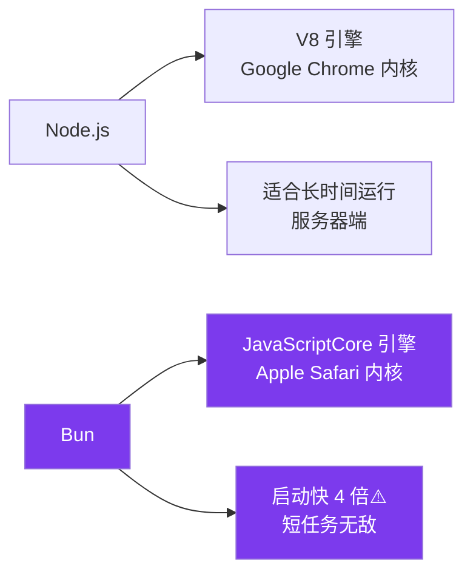
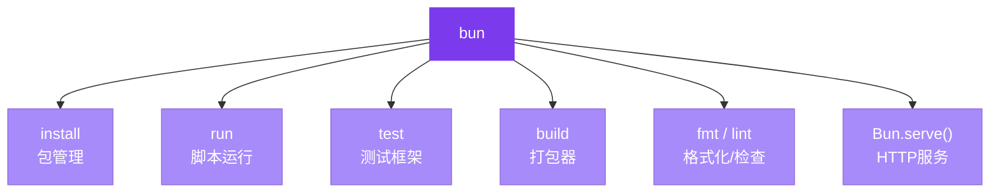

+++
title = "第一章 Bun 是什么"
weight = 10
date = "2026-03-29T14:36:00+08:00"
type = "docs"
description = ""
isCJKLanguage = true
draft = false
+++

# 第一章　Bun 是什么

## 1.1 Bun 的定义与定位

**Bun** 是一个**一站式 JavaScript / TypeScript / JSX 工具包**。它用一个叫 `bun` 的单一、无依赖的二进制文件，把运行时、打包器、包管理器、测试框架、Lint工具、Shell工具全部集成在一起。

Bun 这个名字和 JavaScript 的"豆子（bean）"谐音，设计哲学是：**轻量、快速、随取随用**。

Bun 的"渐进式采用"意味着：你不需要一次性把所有项目迁移到 Bun，可以从一个小脚本、一条命令开始，慢慢感受 Bun 的速度提升。

### 适合谁用？
- 前端开发者（厌倦了 npm install 等待三生三世还在转圈圈）
- 后端开发者（想要快速、轻量的 Node.js 替代品，不想跟 v8 引擎解释人生）
- 全栈工程师（想用同一套工具干完所有事，不想在 npm/yarn/pnpm 之间反复横跳）
- 运维 / DevOps（想要轻量运行时塞进 Docker 镜像，能少等一秒是一秒）
- 普通脚本用户（只是写点小脚本，不想折腾环境配置，配环境的时间比写代码还长）

---

## 1.2 Bun 与 Node.js 的关系

Node.js 用的是 **V8 引擎**（Google Chrome 内核），Bun 用的是 **JavaScriptCore 引擎**（Apple Safari 内核）。两者都是 JavaScript 引擎，只是"发动机"不同。

Bun 的目标是 **100% 兼容 Node.js**，意味着你不需要改一行代码，直接把 `node` 换成 `bun`，你的 Node.js 项目大概率就能跑起来。当然，"大概率"是因为 Node.js 的生态太庞大了，Bun 团队正在努力追赶，目前兼容性是**持续进行中、尚未完全完成**的工作。

> ⚠️ **注意**："100% 兼容"是 Bun 的**目标**，而非当前已完成的状态。Bun 官方明确表示 *"This is an ongoing effort that is not complete."*（这是一项尚未完成的工作）。实际使用中，极少数 Node.js 特有场景仍可能需要适配。

### Bun 凭什么敢说自己兼容 Node.js？

Bun 团队写了一堆测试用例，专门验证 Node.js 的核心 API 能不能在 Bun 上正常运行。你可以理解为：Bun 团队在背后默默帮你做了"翻译工作"，把 Node.js 的 API"翻译"成了 Bun 的语言，但两者的"接口"是一样的。

### JavaScriptCore vs V8 有何不同？

- **JavaScriptCore（JSC）**：Apple Safari 用的引擎，对 JavaScript 语言本身的执行速度做了大量优化，启动速度快是它的招牌
- **V8**：Google Chrome / Node.js 用的引擎，JIT 编译（边跑边编译）优化做得非常深入，长时间运行的性能更好

所以 Bun 的优势在于：**启动快、运行短任务快**；Node.js 的优势在于：**长时间运行的服务器端任务优化更好**。



---

## 1.3 Bun 与 npm / pnpm / yarn 的关系

npm、pnpm、yarn 都是 Node.js 的包管理器，它们的共同特点是：**慢**。

Bun 的 `bun install` **直接替代 npm / pnpm / yarn**，用法几乎一样：
```bash
bun install          # 等价于 npm install
bun add react        # 等价于 npm install react
bun remove react     # 等价于 npm uninstall react
```

Bun 官方称 `bun install` 比 yarn **快 30 倍**（以 Remix 应用的缓存安装为基准）。

> ⚠️ **注意**：上述 30 倍数据来自 Remix 应用**缓存安装**场景的基准测试，不同项目（包数量、网络条件、是否有缓存）实际差距可能不同。实测也差不多——第一次装包你可能没感觉，但当你 `rm -rf node_modules` 之后重装，差距会让你怀疑人生。

### 为什么 Bun 这么快？

- **裸文件操作**：不用层层解压，直接复制
- **并发下载**：同时下载多个包，不排队
- **全局缓存**：同一个包全局只存一份，不同项目共享
- **免解压**：某些场景下跳过解压步骤

简单说：npm 像是你点外卖要等厨师做完再送，Bun 像是你直接去快餐店自取——中间环节全砍了。

---

## 1.4 Bun 与 webpack / Vite / esbuild 的关系

webpack、vite、esbuild 都是"打包器"——它们负责把你的 TypeScript、JSX、图片、CSS 全部"打包"成浏览器能认识的文件。

Bun 也有内置打包器（`bun build`），但它的定位是**适合轻量打包场景**。如果你的项目复杂度一般，Bun 的打包速度会让你惊呼"这是什么神仙"；但如果你是超大型项目（几千个模块的那种），复杂场景下可能仍需要 Vite 或 Webpack 的精细控制。

> ⚠️ **注意**：`bun build` 目前**缺少 HMR（热模块替换）**和代码分割等重要功能，生产级大型项目建议评估后再使用。

简单区分：
- **Bun**：小到中型项目，打包快，配置少
- **Vite / Webpack**：超大型项目，插件生态极其丰富
- **esbuild**：超快的打包速度，但功能比 Bun 少

```bash
# Bun 打包（注意：--outdir 后面是空格，不是等号）
bun build ./src/index.tsx --outdir ./dist --target browser
```

---

## 1.5 Bun 与 Jest / Vitest 的关系

Jest 和 Vitest 都是测试框架。Bun 有内置的测试框架（`bun test`），**兼容 Jest API**，意味着你把 Jest 换成 Bun 测试，几乎不用改代码。

> ⚠️ **注意**：Bun 官方明确表示 *"Bun aims for compatibility with Jest, but not everything is implemented."*（Bun 目标是兼容 Jest，但并非所有功能都已实现）。少数高级特性（如某些 `jest.mock` 用法）可能仍需调整。

```typescript
import { test, expect, describe } from "bun:test";

describe("加法运算", () => {
  test("1 + 1 = 2", () => {
    expect(1 + 1).toBe(2);
  });
});
```

Bun 官方称 `bun test` 比 Jest **快 10-30 倍**（实际感受：Jest 还在预热，Bun 已经跑完交卷了）。原因是 Bun 的运行时启动快，而且测试框架直接集成在运行时里，没有额外的进程开销。

### bun test vs Jest

| | bun test | Jest |
|---|---|---|
| 速度 | 10-30x | 基准 |
| TypeScript | 原生支持 | 需额外配置 |
| API | Jest 兼容（⚠️非全部） | 标准 |
| Mock | 内置 | 内置 |

---

## 1.6 Bun 的核心优势：速度

Bun 的速度优势体现在三个维度：

### 进程启动速度

> ⚠️ 以下数据来自 Bun 官方基准测试，实际表现因场景而异。

Bun 的启动速度比 Node.js **快约 4 倍**（Bun 官方基准测试），这得益于 JavaScriptCore 引擎在启动阶段的大量优化。

### HTTP 服务吞吐量

在相同硬件条件下，Bun 的 HTTP 吞吐量大约是 Node.js 的 **2-3 倍**（Bun 官方基准测试），这得益于 Bun 的 HTTP 服务器直接绑定了系统底层网络接口，省去了 Node.js 的层层抽象。

> ⚠️ 2-3 倍数据来自官方基准测试，实际表现因场景（请求类型、并发量、硬件等）而异。

### 包安装速度

```bash
# 官方数据（Remix 缓存安装场景）
bun install  vs  yarn  快 30 倍
```

> ⚠️ 30 倍数据基于 Remix 应用**缓存安装**场景的基准测试。不同项目（包数量、网络条件、是否首次安装）实际差距可能差异较大。

这不是吹牛——Bun 用了裸文件操作、并发下载等技术，把中间环节压缩到最少。

---

## 1.7 Bun 的核心优势：生态兼容

Bun 并不是从零发明一套新生态，而是**尽量复用现有的 Node.js 生态**。

Bun 原生实现了 Node.js 的核心模块，比如：
- `fs`（文件系统操作）
- `path`（路径处理）
- `crypto`（加密）
- `stream`（流）
- `buffer`（缓冲区）
- `process`（进程信息）

这些模块在 Node.js 里怎么用，在 Bun 里几乎一模一样。不需要额外安装，不需要 polyfill，拿过来直接用。

同时 Bun 也原生实现了 Web 标准 API，比如 `fetch`、`Response`、`Request`、`Headers`——这意味着你在浏览器里怎么写 HTTP 请求，在 Bun 里几乎一样的代码。

此外 Bun 还内置了大量实用 API，让开发更方便：

- `bun:sqlite` — 高性能 SQLite 数据库（同步查询为主，也支持异步）
  > ⚠️ 声称"比 better-sqlite3 快 3-6 倍"的数据来自特定基准测试，实际提升因查询类型而异。
- `bun:ffi` — 调用 C 类库（Zig、Rust、C/C++ 等）
- `bun:uuid` — 生成 UUID
- WebSocket 服务器 — 通过 `Bun.serve()` 的 `websocket` 配置实现，含发布/订阅功能
- 内置 S3（v1.2+）、Redis（v1.3+）、YAML、CSS 颜色转换等 API

> ⚠️ **Node.js 兼容性说明**：Bun 目标是实现 Node.js 核心模块的兼容，但这是一项**持续进行、尚未完全完成**的工作。部分模块（如 `os`、`util`、`net`、`http`、`dgram`、`zlib` 等）已有支持，但仍有少数模块和边界情况在完善中。使用前建议查阅 [Bun 官方兼容性文档](https://bun.sh/docs/runtime/nodejs-apis)。

**关于原生 addon**：如果 `bun install` 安装的包包含 `.node` 原生模块文件，而 Bun 不支持该模块时，安装会失败或降级使用 npm。详见 1.9 节。

---

## 1.8 Bun 的核心优势：一体化

这是 Bun 最厉害的地方——**一个工具，全部搞定**（想象一下：你不需要在 npm、yarn、pnpm 之间纠结，也不需要在 jest、vitest 之间反复横跳，更不需要配 webpack 配到怀疑人生）：

- `bun install` → 包管理器（替代 npm/yarn/pnpm）
- `bun run` → 脚本运行器（替代 node/npx）
- `bun test` → 测试框架（替代 jest/vitest）
- `bun build` → 打包器（适合中小型项目⚠️，超大型项目建议评估后再使用）
- `bun fmt` → 代码格式化（替代 prettier）
- `bun lint` → 代码检查（替代 eslint）
- `Bun.serve()` → HTTP 服务器（替代 express/fastify 的部分场景）

你不需要装一堆工具，一个 `bun` 全搞定。

> 💡 **Bun.serve()** 是 Bun 内置的 HTTP 服务器 API，不是 CLI 子命令。使用时从 `bun` 导入 `serve`（或直接用 `Bun.serve()`），然后执行 `bun ./server.ts` 即可运行。



---

## 1.9 现阶段局限性：不支持原生 Node.js addons

这是 Bun 和 Node.js 之间**最核心的差异**。

Node.js 的生态里有大量用 C/C++ 编写的原生模块（`.node` 文件），这些模块需要编译后才能使用。比如某些图像处理库、数据库驱动的高性能绑定等。

**Bun 不支持 `.node` 文件**。

这意味着如果你项目里用到了某个只有 `.node` 版本的包，Bun 目前跑不了。解决方案有：
1. 找这个包的纯 JavaScript / WebAssembly 版本
2. 用 `bun:ffi` 调用 C 类库（*但注意：`bun:ffi` 目前是实验性功能，不建议在生产环境使用*）
3. 用 Node-API 编写原生模块
4. 继续用 Node.js

好消息是：这类包越来越少，而且 Bun 团队正在推进对 NAPI（Node.js Addon 接口）的支持，未来会越来越好。

---

## 1.10 现阶段局限性：Windows 支持

Bun 对 Windows 的支持在 **v1.1+** 版本已经相对稳定，但需要注意：

- **最低要求**：Windows 10 版本 1809 或更高
- **仍有兼容性问题**：部分边缘场景可能遇到问题

如果你在 Windows 上用 Bun，遇到奇怪的报错，可以先查一下 Bun 的 GitHub Issues，看看有没有类似情况。

```powershell
# Windows 安装 Bun
irm bun.sh/install.ps1 | iex
```

---

## 1.11 常见误解澄清：Bun 不是 Node.js fork

很多人以为 Bun 是 Node.js 的分支/改版，这是**最大的误解**。

Bun 是**从零开始重写**的全新项目：
- Node.js：C++ 编写，V8 引擎
- Bun：Zig + JavaScriptCore，从零实现

类比一下：
- Node.js 像是一辆**改装过的卡车**（经过多年迭代，功能多但也负重累累）
- Bun 像是一辆**全新设计的跑车**（轻量化、速度快，但某些功能还在补全中）

两者目标相似（都是 JavaScript 运行时），但底层完全不同。Bun 不是 Node.js 的替代品，而是**另一个选择**。

---

## 本章小结

本章介绍了 Bun 的定位、核心优势和当前局限。Bun 是一个**一站式 JavaScript 工具包**，以单一二进制文件形式发布，支持**渐进式采用**——你可以从一条命令开始，慢慢迁移更多场景。

Bun 的三大核心优势：**速度**（启动显著更快、HTTP 吞吐更高、包安装速度优势明显）、**生态兼容**（原生实现 Node.js API）、**一体化**（一个工具搞定所有）。同时也要注意它的局限：不支持 `.node` 原生模块、Windows 兼容性仍在完善中。

Bun 不是 Node.js 的 fork，而是基于 JavaScriptCore + Zig 从零重写的全新运行时，目标是在保持兼容的同时，提供更快的开发体验。
