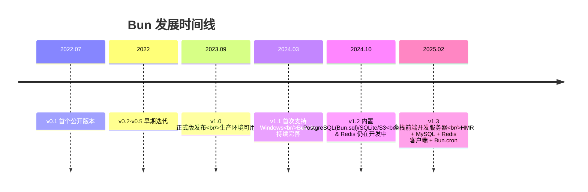

+++
title = "第二章 历史与演进"
weight = 20
date = "2026-03-29T14:36:00+08:00"
type = "docs"
description = ""
isCJKLanguage = true
draft = false
+++

# 第二章　历史与演进

## 2.1 Bun 的诞生背景

2022 年，一个叫 **Jarred Sumner** 的哥们实在受不了 Node.js 的慢速度，决定自己动手写一个更快的 JavaScript 运行时。他创立了 **Oven 公司**（中文社区戏称"烤箱公司"——JavaScript 运行时，烤箱烤面包很快，名字还挺贴切），全职维护 Bun。

Jarred Sumner 是个狠人，他在 GitHub 上发布 Bun 后，迅速积累了大量粉丝。Bun 在发布后短短几周内就收获了上万个 GitHub Stars，成为了当年最火爆的开源项目之一。

Bun 的诞生背景很简单：**Node.js 太慢了，现有的打包工具也太慢了，Jarred 决定自己造一个"JavaScript 工具链终极版"**。

---

## 2.2 Bun 的设计目标

Bun 有几个非常明确的设计目标：

1. **速度压倒一切**：JavaScript 工具链的每一个环节都要快
2. **TypeScript 开箱即用**：不需要额外配置，不需要 ts-node，不需要 tsx
3. **100% 兼容 Node.js**：不需要改代码，直接替换 node
4. **一体化**：一个工具替代 n 个工具（包管理 + 运行时 + 打包 + 测试）

这些目标听起来简单，但实现起来非常难。Bun 团队用了全新的技术栈（JavaScriptCore + Zig）来实现这些目标。

---

## 2.3 v0.1 发布（2022 年 7 月）

2022 年 7 月，Bun 发布了首个公开版本 v0.1。当时的 Bun 还非常不完善，但它的速度优势已经开始显现——很多人第一次用 `bun install` 的时候都震惊了："这也太快了吧？？？"

v0.1 的功能已经相当全面：
- 包管理器（`bun install`）
- JavaScript / TypeScript / JSX 转译器
- 运行时（设计为 Node.js 的替代品）
- 测试运行器
- 打包工具（bundler）

但它的速度已经让整个 JavaScript 社区为之侧目。

---

## 2.4 v0.2 - v0.5（早期迭代）

Bun 在 v0.2 到 v0.5 期间进行了密集的迭代，主要工作是把 Node.js 的核心 API 一个一个"翻译"成 Bun 的实现。

这阶段的核心任务是**扩大兼容性**——让更多 npm 包能在 Bun 上直接跑起来，不需要任何修改。

---

## 2.5 v0.6 - v0.8（Node.js 兼容性大幅提升）

v0.6 到 v0.8 期间，Bun 的 Node.js 兼容性有了质的飞跃。大量的 npm 热门包开始能在 Bun 上正常运行，包括一些比较"挑环境"的包。

---

## 2.6 v1.0 正式版发布（2023 年 9 月）

2023 年 9 月，Bun 正式发布 v1.0，这意味着：
- **生产环境可用**：不再是"体验版"，可以在真实项目中使用
- **API 稳定**：不再有破坏性变更
- **企业级支持**：公司可以放心地把 Bun 用在生产环境了

v1.0 是 Bun 发展史上的重要里程碑，从此 Bun 正式从"尝鲜项目"变成了"正经工具"。

---

## 2.7 v1.1 - v1.x（持续优化，生态扩展）

v1.1 之后，Bun 进入快速迭代期：

- **v1.1**：Windows 支持从零到有，首次正式支持 Windows 平台！之前 Bun 基本只能在 macOS 和 Linux 上跑，Windows 用户只能"望 Bun 兴叹"。v1.1 让 Windows 用户终于也能享受 Bun 的速度了
- **v1.2.x**：引入了一系列重量级内置功能——内置 PostgreSQL 客户端（`Bun.sql`，SQLite 早在 v0.x 就已内置）、S3 对象存储（Bun.s3）、routes API。`Bun.cron` 和 `bun generate` 实际上在 v1.3 才引入（v1.2 blog 未提及）。MySQL 和 Redis 客户端当时仍在开发中——官方博客明确写道 *"MySQL coming soon"*。至此 Bun 的"一体化"拼图大幅扩展
- **v1.3.x**：带来了全方位前端开发支持——内置全栈开发服务器（支持热模块替换 HMR 和浏览器控制台日志）、**内置 MySQL 客户端**（终于来了！与已有的 Postgres/SQLite 协同）、**内置 Redis 客户端**（终于来了！）、更好的路由/Cookies/WebSocket 体验，以及大量 Node.js API 兼容性改进。**注意**：截至本书编写时，Bun 最新稳定版已至 v1.4.x 系列，建议读者以官网实际版本为准

---

## 2.8 里程碑：Bun 加入 Anthropic（2024 年）

2024 年，Bun 官方宣布**加入 Anthropic**（就是做 Claude 的那个公司）。这是 Bun 发展史上的重大里程碑，意味着 Bun 背后有了更强大的资源和团队支持。

Anthropic 为什么会看上 Bun？原因很简单：**Anthropic 的工程师自己也受不了 Node.js 的慢速度，他们想让 Claude 的周边工具也用上 Bun**。加上 Claude Code 本身就是用 Bun 打包成单文件可执行程序分发给数百万用户的——Claude Code 依赖 Bun，Bun 坏了 Claude Code 就坏了，Anthropic 自然有直接的动力把 Bun 维护好。

---

## 2.9 核心架构选型：JavaScriptCore 引擎

Bun 选择 JavaScriptCore（简称 **JSC**）而不是 V8 作为 JavaScript 引擎，这是一个非常有趣的决定。

**为什么选 JSC？**
- **启动快**：JSC 在启动阶段做了大量优化，对于短任务场景非常友好
- **Apple 多年打磨**：JSC 是 Safari 浏览器的引擎，经过了大量真实场景的验证
- **Apple 的性能团队**：Apple 有专门的团队在优化 JSC，Bun 可以直接享受这些优化成果

**V8 呢？**
- V8 的 JIT（即时编译）优化非常深入，长时间运行的任务 V8 更有优势
- 但 JIT 也有代价：编译需要时间，冷启动会慢一些

所以 Bun 的速度优势主要体现在**短任务、频繁启动**的场景。长时间运行的服务器端，Node.js 仍然是强有力的竞争者。

---

## 2.10 核心架构选型：Zig 语言重写底层

Zig 是一门新兴的系统编程语言，作者是 Andrew Kelley。Bun 用 Zig 重写了整个底层（JavaScript 引擎除外），包括内存管理、文件系统 I/O、网络 socket 等核心模块。

**为什么选 Zig？**
- **内存管理精细**：Zig 让你手动控制内存分配，没有 GC（垃圾回收器）的不可预测停顿
- **高性能**：Zig 的性能接近 C，但比 C 更安全
- **简单**：语法比 Rust 简单，上手更快
- **与 C 无缝互调**：方便复用现有的 C 生态库

Bun 的内存管理是自己写的，不依赖现有的运行时，这意味着 Bun 团队可以**精确控制**每个操作的内存分配和释放。这也是 Bun 速度快的秘诀之一。

---

## 2.11 社区生态发展

Bun 的社区发展非常迅速：
- GitHub Stars 已超过 7 万（保守数字，实际可能更高）
- 大量框架开始官方支持 Bun（Hono、Elysia、Next.js、Tailwind CSS 等）
- npm 上越来越多的包开始测试 Bun 兼容性
- Discord 和 GitHub Discussions 活跃度极高
- 一些知名公司已开始生产环境使用 Bun（X/Midjourney/Tailwind 等）

---

## 2.12 未来路线图展望

Bun 的终极目标是：**统一 JavaScript 工具链**。

也就是说，未来你可能只需要一个工具：
- 替代 Node.js ✅
- 替代 Jest / Vitest ✅（Bun 内置测试运行器，兼容 Jest API）
- 替代 webpack / Vite ✅（Bun 内置 bundler）
- 替代 TypeScript 编译器 tsc ✅（Bun 内置转译器，TypeScript 开箱即用）
- 替代 yarn / npm ✅（Bun 内置包管理器，速度领先）
- 替代部分 PostCSS 场景 ✅（Bun 内置 CSS 转译与打包，对常见 PostCSS 插件功能有一定覆盖，但 PostCSS 生态中的部分高级插件仍需传统方案）

这个目标很远大，Bun 正在一步步靠近。虽然现在还不是所有场景都能替代，但按照 Bun 的迭代速度，这个未来可能比你想的更近。

---

## 本章小结

本章梳理了 Bun 的发展历史。Bun 由 Jarred Sumner 于 2022 年创立，Oven 公司维护，基于 JavaScriptCore + Zig 从零重写，目标是统一 JavaScript 工具链。

关键版本节点：v0.1（2022.07 首发）→ v1.0（2023.09 生产可用）→ v1.1（2024.03 Windows 支持）→ v1.2（2024.10 内置 PostgreSQL(Bun.sql)/SQLite/S3，MySQL/Redis 仍在开发）→ v1.3（2025.02 全栈前端开发+HMR+MySQL+Redis 客户端+Bun.cron）。2024 年 Bun 宣布加入 Anthropic，获得了更强大的资源支持。

Bun 的技术选型：JavaScriptCore 引擎（启动快） + Zig 语言（底层全栈自研），这两个选择共同构成了 Bun"极速"的底层基础。
