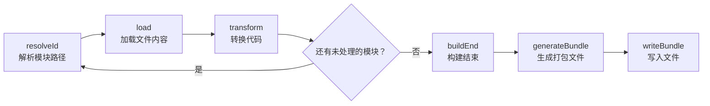

+++
title = "第5章 怎么使用"
weight = 50
date = "2026-03-28T11:38:00+08:00"
type = "docs"
description = ""
isCJKLanguage = true
draft = false
+++
# 第 5 章　怎么用

---

## 5.1 环境准备

### 5.1.1 安装 Node.js（推荐 LTS 版本）

Rollup 是一个 Node.js 的 npm 包，所以第一步当然是要安装 Node.js。

> **Node.js 是什么？**
> Node.js 是一个让 JavaScript 可以在服务器端（也就是你的电脑，而不是浏览器）运行的环境。打个比方：如果 JavaScript 是"英语"，那么 Node.js 就是"同声传译设备"，让你能在中国用英语和英国人交流。安装 Rollup 之前，必须先安装 Node.js。

建议安装 **LTS（Long Term Support，长期支持版）** 版本，这个版本稳定、可靠、bug 少。当前 LTS 版本可以在 [nodejs.org](https://nodejs.org) 下载，一路点"下一步"即可。

安装完成后，在终端中验证：

```bash
node --version
# v22.14.0  （或者你安装的具体版本号）

npm --version
# 10.9.0    （或者你安装的具体版本号）
```

### 5.1.2 包管理器选择（npm / yarn / pnpm）

Node.js 自带 npm，不需要额外安装。但你也可以选择更现代的包管理器：

- **npm**：Node.js 官方包管理器，普及率最高
- **yarn**：Facebook 出品，速度比 npm 快，有离线缓存
- **pnpm**：速度最快硬盘占用最低，近几年人气飙升

对于 Rollup，三者都可以用。这里以 npm 为例，yarn/pnpm 用户把 `npm install` 替换成 `yarn add` 或 `pnpm add` 即可。

### 5.1.3 安装 Rollup：`npm install rollup -D`

> **`-D` 参数是什么意思？**
> `-D` 是 `--save-dev` 的简写，它的意思是把 Rollup 作为"开发时依赖"安装，而不是"运行时依赖"。打个比方：Rollup 就像厨房里的厨师，它只在"做饭的时候"（构建项目时）需要，而不需要跟你的菜一起"端上桌"（部署到用户那里）。

```bash
# 在你的项目目录下执行
npm install rollup -D

# 安装完成后，你的 package.json 会多出这行
# "devDependencies": { "rollup": "^4.x.x" }
```

如果你的项目还没有初始化，先执行 `npm init -y` 初始化一个 `package.json`：

```bash
npm init -y
# 在当前目录生成一个 package.json（初始内容是默认的）
```

---

## 5.2 命令行直接使用

Rollup 支持直接通过命令行使用，不需要配置文件也可以完成简单的打包任务。

### 5.2.1 单文件打包：`rollup src/main.js --output dist/bundle.js --format es`

假设你有一个这样的入口文件 `src/main.js`：

```javascript
// src/main.js
import { add } from './math.js';

console.log('结果是:', add(2, 3)); // 打印: 结果是: 5
```

```javascript
// src/math.js
export function add(a, b) {
  return a + b;
}
```

执行打包命令：

```bash
# 把 src/main.js 打包成 dist/bundle.js，输出格式为 ES Module
npx rollup src/main.js --output dist/bundle.js --format es

# 或者用简写（Rollup 支持短参数名）
npx rollup src/main.js -o dist/bundle.js -f es
```

> **`npx` 是什么？**
> `npx` 是 npm 自带的工具，可以在不全局安装的情况下直接运行本地 `node_modules` 里的命令。就像你不需要把厨师（rollup）安装到你家厨房的墙上（全局安装），你只需要在当前厨房（当前项目）里找厨师就行了。

打包完成后，你会在 `dist/bundle.js` 里看到 Rollup 打包后的产物：

```javascript
// dist/bundle.js（简化后的产物）
function add(a, b) {
  return a + b;
}

console.log('结果是:', add(2, 3));
// 注意：因为 add 函数没有在模块外部被使用，Rollup 不会生成 export 语句
```

### 5.2.2 常用 CLI 参数（--format / --output / --watch / --external / --sourcemap）

Rollup 命令行支持很多参数，以下是最常用的几个：

| 参数 | 简写 | 作用 | 示例 |
|------|------|------|------|
| `--output` | `-o` | 指定输出文件路径 | `-o dist/bundle.js` |
| `--format` | `-f` | 指定输出格式 | `-f es` |
| `--watch` | `-w` | 开启监听模式 | `-w` |
| `--external` | `-e` | 指定外部依赖（不打包） | `-e lodash -e react` 或 `-e lodash,react` |
| `--sourcemap` | `-m` | 生成 Source Map | `-m` |
| `--config` | `-c` | 指定配置文件路径 | `-c rollup.config.js` |
| `--help` | `-h` | 显示帮助信息 | `-h` |

### 5.2.3 全局安装 vs 本地安装（npx rollup）

有两种使用 Rollup 的方式：

**本地安装（推荐）**：

```bash
npm install rollup -D
npx rollup --version
# rollup v4.x.x
```

**全局安装**（不推荐，版本管理麻烦）：

```bash
npm install -g rollup
rollup --version
# rollup v4.x.x
```

推荐使用本地安装 + `npx` 的方式，这样每个项目可以使用不同版本的 Rollup，互不干扰。

---

## 5.3 配置文件方式（推荐）

### 5.3.1 创建 rollup.config.js

配置文件方式更适合复杂项目。把所有配置写在一个文件里，执行命令时只需要一条 `rollup --config`。

在项目根目录创建 `rollup.config.js`：

```javascript
// rollup.config.js
// 使用 ES Module 语法（因为 package.json 中没有设置 type: "module"，
// Node.js 默认将 .js 文件当作 CommonJS 处理，所以 .js 配置文件会被当作 CJS。
// 要让 .js 配置文件使用 ES Module，有两种办法：
// 1. 在 package.json 中设置 type: "module"
// 2. 直接把配置文件改名为 .mjs（强制 ESM）或 .cjs（强制 CJS），一劳永逸）

export default {
  input: 'src/main.js',      // 入口文件
  output: {
    file: 'dist/bundle.js',  // 输出文件
    format: 'es'              // 输出格式
  }
};
```

### 5.3.2 最小配置示例

一个最简配置只需要三行：

```javascript
// rollup.config.js
export default {
  input: 'src/main.js',
  output: {
    file: 'dist/bundle.js',  // 单一输出文件（对应单入口）
    format: 'cjs'             // CommonJS 格式
  }
};
```

> 💡 **`file` vs `dir` 的区别**：当使用代码分割（多个入口或动态 import）时，不能用 `file`，需要改用 `dir`。`file` 是给单文件打包用的，`dir` 则告诉 Rollup 把分割后的 chunk 统一输出到哪个目录。

### 5.3.3 使用 `--config` 参数加载配置

```bash
# 默认加载 rollup.config.js
npx rollup --config

# 加载指定的配置文件（比如有 dev.config.js 和 prod.config.js）
npx rollup --config rollup.prod.config.js
```

### 5.3.4 配置文件格式（.js / .mjs / .cjs）及适用场景

Rollup 支持三种格式的配置文件：

- **`.js`**：最常见，但 Node.js 默认将 `.js` 当作 CommonJS 处理。因此 `.js` 配置文件如果想用 ES Module 语法，需要项目 `package.json` 中设置了 `type: "module"`，或者干脆用 `.mjs`/`.cjs` 更省心
- **`.mjs`**：强制使用 ES Module，不管 `package.json` 里怎么设置
- **`.cjs`**：使用 CommonJS 语法（`require`/`module.exports`），适合旧项目

```javascript
// rollup.config.mjs（强制 ES Module）
import resolve from '@rollup/plugin-node-resolve';

export default { ... };
```

```javascript
// rollup.config.cjs（强制 CommonJS）
const resolve = require('@rollup/plugin-node-resolve');

module.exports = { ... };
```

---

## 5.4 编写第一个打包项目

### 5.4.1 创建入口文件（ES Module 语法）

创建项目目录结构：

```bash
mkdir my-rollup-project && cd my-rollup-project
npm init -y
npm install rollup -D
mkdir src
```

创建入口文件 `src/main.js`：

```javascript
// src/main.js
import { sayHello } from './greeting.js';
import { PI, circleArea } from './math.js';

sayHello('小明');
console.log('圆的面积:', circleArea(5).toFixed(2)); // 78.54
```

`src/greeting.js`（工具函数文件）：

```javascript
// src/greeting.js
export function sayHello(name) {
  console.log(`你好，${name}！欢迎使用 Rollup！`);
}
```

`src/math.js`（数学工具文件）：

```javascript
// src/math.js
export const PI = 3.14159;

export function circleArea(r) {
  return PI * r * r;
}
```

### 5.4.2 安装所需插件

上面的配置用到了几个插件，先一口气装好：

```bash
npm install -D @rollup/plugin-node-resolve @rollup/plugin-commonjs @rollup/plugin-babel @rollup/plugin-terser @babel/core @babel/preset-env
# 注意：@rollup/plugin-babel 依赖 @babel/core，@babel/preset-env 是最常用的 Babel 预设
```

> 🎉 **一行命令全搞定**！别被这么多插件吓到，它们是 Rollup 生态的"复仇者联盟"——各司其职，缺一不可。`resolve` 负责找到 node_modules 里的模块，`commonjs` 把 CommonJS 转成 ESM，`babel` 转译 JSX/TS/新语法，`terser` 最后压缩代码。下一节会详细讲解它们。

### 5.4.3 编写 rollup.config.js

创建 `rollup.config.js`：

```javascript
// rollup.config.js
import { babel } from '@rollup/plugin-babel';
import resolve from '@rollup/plugin-node-resolve';
import commonjs from '@rollup/plugin-commonjs';
import terser from '@rollup/plugin-terser';

export default {
  input: 'src/main.js',    // 入口文件
  output: {
    file: 'dist/bundle.js', // 输出文件
    format: 'iife',         // 浏览器直接用 <script> 引入
    name: 'MyApp',          // 全局变量名（IIFE 格式必须）
    sourcemap: true         // 生成 Source Map
  },
  plugins: [
    resolve(),              // 解析 node_modules
    commonjs(),             // 把 CJS 模块转成 ESM
    babel({
      babelHelpers: 'bundled',
      exclude: 'node_modules/**',
      presets: [['@babel/preset-env', { targets: 'defaults' }]]  // ⚠️ presets 是必需的！没有它 Babel 什么都不会转译
    }),
    terser()               // 代码压缩（生产/开发均可，Vite 等工具会自动区分）
  ]
};
```

### 5.4.4 执行打包并检查产物

```bash
npx rollup --config

# 输出类似：
# created dist/bundle.js in 1.2s
```

### 5.4.5 在 HTML 中引入并验证运行

创建 `index.html`：

```html
<!DOCTYPE html>
<html lang="zh">
<head>
  <meta charset="UTF-8">
  <title>Rollup 打包示例</title>
</head>
<body>
  <script src="dist/bundle.js"></script>
</body>
</html>
```

用浏览器打开 `index.html`，打开控制台，你会看到输出：

```
你好，小明！欢迎使用 Rollup！
圆的面积: 78.54
```

恭喜你，第一个 Rollup 项目打包成功！

---

## 5.5 JavaScript API 程序化使用

Rollup 不仅可以通过命令行使用，还提供了完整的 JavaScript API，让你在 Node.js 脚本中调用打包功能。

### 5.5.1 `rollup()` 函数：传入配置，返回包含 `.generate()` 和 `.write()` 的 promise

这是 Rollup 的核心 API——`rollup()` 函数接收配置对象，返回一个 Promise，这个 Promise resolve 之后会得到一个包含 `.generate()` 和 `.write()` 两个方法的对象：

```javascript
// build.js
import { rollup } from 'rollup';

async function build() {
  // 调用 rollup()，传入配置
  const bundle = await rollup({
    input: 'src/main.js',
    plugins: [
      // ... 你的插件
    ]
  });

  console.log('打包完成！');
  // bundle 上有两个方法：generate() 和 write()
  console.log('可用方法:', Object.keys(bundle));
}

build();
```

### 5.5.2 `.generate()` vs `.write()` 的区别（返回对象 vs 写入文件）

- **`.generate()`**：只是"生成"打包结果，返回一个描述产物信息的对象，不会写文件。适合你想先看看打包结果再做决定的情况。
- **`.write()`**：执行真正的文件写入，把打包产物写入到配置的 `output.file` 路径。写入成功后会返回同样的描述对象。

```javascript
async function build() {
  const bundle = await rollup({ input: 'src/main.js' });

  // 方式一：generate（只生成，不写文件）
  const { output } = await bundle.generate({
    format: 'es'
  });
  console.log('生成了', output.length, '个 chunk');
  // output[0] 包含 { fileName, code, map, ... }

  // 方式二：write（写入文件）
  const result = await bundle.write({
    format: 'es',
    file: 'dist/bundle.js'
  });
  console.log('文件已写入:', result.output[0].fileName);
  // 输出：文件已写入: dist/bundle.js

  // 关闭 bundle，释放内存
  await bundle.close();
}
```

### 5.5.3 返回结果结构（output 数组：含 chunk 名、code、map 等信息）

`generate()` 或 `write()` 返回的 `output` 数组，每个元素代表一个"产物文件"（chunk）：

```javascript
const { output } = await bundle.generate({ format: 'es' });

output.forEach((chunk) => {
  console.log('文件名:', chunk.fileName);
  console.log('类型:', chunk.type);  // 'chunk'（代码块）或 'asset'（资源文件如 CSS）
  if (chunk.type === 'chunk') {
    console.log('代码长度:', chunk.code.length, '字符');
    console.log('Source Map 存在:', !!chunk.map);
    console.log('此 chunk 内部包含的模块数:', Object.keys(chunk.modules).length);
    // 还可以访问 chunk.exports（导出的符号）、chunk.imports（导入的外部模块）等
  }
});
```

### 5.5.4 `watch()` 函数：监听模式，返回 Watcher 实例

`watch()` 函数会返回一个"监听器"，当源文件发生变化时自动重新打包：

```javascript
// watch-build.js
import { watch } from 'rollup';

const watcher = watch({
  input: 'src/main.js',
  output: {
    file: 'dist/bundle.js',
    format: 'es'
  }
});

watcher.on('event', (event) => {
  if (event.code === 'START') {
    console.log('开始打包...');
  }
  if (event.code === 'END') {
    console.log('打包完成！');
  }
  if (event.code === 'ERROR') {
    console.error('打包出错:', event.error);
  }
});

// 停止监听
// watcher.close();
```

运行 `node watch-build.js`，然后修改任意源文件，控制台会自动显示打包结果。

### 5.5.5 自定义构建脚本示例

结合上面的知识，你可以写一个完整的自定义构建脚本：

```javascript
// scripts/build.js
import { rollup } from 'rollup';
import resolve from '@rollup/plugin-node-resolve';
import commonjs from '@rollup/plugin-commonjs';
import terser from '@rollup/plugin-terser';

async function build(isProduction = true) {
  console.log('开始构建...');

  try {
    const bundle = await rollup({
      input: 'src/main.js',
      plugins: [
        resolve(),
        commonjs(),
        isProduction && terser()  // 生产环境才压缩
      ].filter(Boolean)
    });

    const outputOptions = {
      file: 'dist/bundle.js',
      format: 'es',
      sourcemap: !isProduction
    };

    await bundle.write(outputOptions);
    console.log('构建成功！');

    await bundle.close();
  } catch (err) {
    console.error('构建失败:', err);
    process.exit(1);
  }
}

// 从命令行参数判断是否是生产环境
const isProd = process.argv.includes('--prod');
build(isProd);
```

运行：

```bash
node scripts/build.js           # 开发模式（不压缩，有 Source Map）
node scripts/build.js --prod    # 生产模式（压缩，无 Source Map）
```

---

## 5.6 插件的使用方法

### 5.6.1 安装插件：`npm install @rollup/plugin-node-resolve`

Rollup 插件本质上是一个 npm 包，需要单独安装。以下是几个最常用的插件：

```bash
npm install -D @rollup/plugin-node-resolve  # 解析 node_modules
npm install -D @rollup/plugin-commonjs      # CJS → ESM
npm install -D @rollup/plugin-terser         # 代码压缩
npm install -D @rollup/plugin-babel          # Babel 转译
npm install -D @rollup/plugin-typescript     # TypeScript 支持
```

### 5.6.2 在 plugins 数组中注册

安装完插件之后，需要在 `rollup.config.js` 中的 `plugins` 数组里注册：

```javascript
// rollup.config.js
import resolve from '@rollup/plugin-node-resolve';
import commonjs from '@rollup/plugin-commonjs';
import terser from '@rollup/plugin-terser';

export default {
  input: 'src/main.js',
  output: { file: 'dist/bundle.js', format: 'es' },
  plugins: [
    // 把插件实例放进数组里
    resolve(),     // 第 1 个执行的插件
    commonjs(),    // 第 2 个执行的插件
    terser()       // 第 3 个执行的插件
  ]
};
```

### 5.6.3 插件执行顺序（resolve → load → transform 链式执行）

Rollup 插件的执行顺序遵循一个严格的流水线：



> 📌 **小贴士**：图中的 `resolveId → load → transform` 循环可不是只走一次——每个被解析出来的模块都要走一遍这个流程，直到所有模块都被处理完为止。如果你写的插件行为诡异，首先怀疑的就是执行顺序有没有搞反！

每个插件都可以在这条流水线的各个环节"插一手"。

### 5.6.4 常用插件组合：resolve + commonjs + terser + babel

这是打包一个现代 JavaScript 项目（使用 JSX/TS）的标准插件组合：

```javascript
// rollup.config.js
import resolve from '@rollup/plugin-node-resolve';
import commonjs from '@rollup/plugin-commonjs';
import babel from '@rollup/plugin-babel';
import terser from '@rollup/plugin-terser';

export default {
  input: 'src/index.js',
  treeshake: {
    moduleSideEffects: false,
    propertyReadSideEffects: false
  },
  output: {
    dir: 'dist',
    format: 'es',
    sourcemap: true
  },
  plugins: [
    // 1. 先解析 node_modules
    resolve({
      extensions: ['.js', '.jsx', '.ts', '.tsx'],
      browser: true
    }),
    // 2. 再把 CommonJS 转成 ESM
    commonjs(),
    // 3. 然后用 Babel 转译（JSX / TS / 新语法）
    babel({
      babelHelpers: 'bundled',
      extensions: ['.js', '.jsx', '.ts', '.tsx'],
      exclude: 'node_modules/**',
      presets: [['@babel/preset-env', { targets: 'defaults' }]]  // ⚠️ 必填！否则 Babel 什么都不会做
    }),
    // 4. 最后压缩
    terser()
  ]
};
```

> 💡 **Tree-Shaking 配置小贴士**：上面的 `treeshake` 配置项（`moduleSideEffects: false`、`propertyReadSideEffects: false`）可以更激进地删除无用代码。但要注意：如果你的代码有副作用（比如直接调用 `console.log` 以外的全局对象修改），关闭得太激进可能会误删有用的代码。保守一点的话只用默认的 Tree-Shaking 就够了。

---

## 5.7 Watch 模式

### 5.7.1 CLI：`rollup src/main.js --watch`

最简单的 watch 模式，用命令行加一个 `--watch`（或 `-w`）参数即可：

```bash
npx rollup src/main.js --output dist/bundle.js --format es --watch

# 输出：
# rollup v4.x.x watching...  ← 这行表示监听已启动
# → created dist/bundle.js
# (waiting for changes...)
```

当你修改 `src/main.js` 或它 import 的任何文件时，Rollup 会自动重新打包。

### 5.7.2 配置文件：`watch: { clearScreen: false, include: 'src/**' }`

在配置文件中也可以配置 watch 模式：

```javascript
// rollup.config.js
export default {
  input: 'src/main.js',
  output: {
    file: 'dist/bundle.js',
    format: 'es'
  },
  watch: {
    clearScreen: false,   // 不清屏，方便看历史输出
    include: 'src/**',    // 只监听 src 目录下的文件
    exclude: 'node_modules/**'  // 忽略 node_modules
  }
};
```

然后执行：

```bash
npx rollup --config --watch
```

### 5.7.3 Watch 的局限：大型项目构建慢，不适合开发服务器

再次强调：Rollup 的 watch 模式适合**小型的库或工具项目**，不适合大型 Web 应用。

原因：
1. 每次文件变化会触发**增量构建**（只重打包受影响的部分），但这是 Rollup 层面的增量——对于大型项目来说，累积的模块数量依然会让每次构建耗时好几秒，体验不如专门的开发服务器
2. 没有 HMR（热模块替换），代码变了页面会整个刷新，你辛辛苦苦填的表单数据可能就没了
3. 大型项目构建一次可能需要几十秒，体验很差

对于大型项目，请直接使用 Vite 或者 Webpack 的开发服务器。

---

## 5.8 配合 Vite 使用

### 5.8.1 在 vite.config.js 中配置 rollupOptions（input / output / plugins）

Vite 的底层打包引擎就是 Rollup，你可以通过 `vite.config.js` 的 `rollupOptions` 来自定义 Rollup 的配置：

```javascript
// vite.config.js
import { defineConfig } from 'vite';
import vue from '@vitejs/plugin-vue';

export default defineConfig({
  plugins: [vue()],
  build: {
    rollupOptions: {
      // 多入口配置
      input: {
        main: './index.html',
        admin: './admin.html'
      },
      // 输出配置
      output: {
        // 分割 vendor
        manualChunks: (id) => {
          if (id.includes('node_modules')) {
            if (id.includes('react')) return 'react-vendor';
            if (id.includes('lodash')) return 'lodash-vendor';
          }
        }
      }
    },
    outDir: 'dist',
    minify: 'esbuild'
  }
});
```

### 5.8.2 rollupOptions.output 的路径（与顶层 output 等价）

在 `vite.config.js` 中，`build.outDir` 对应 Rollup 的 `output.dir`（输出目录），`build.sourcemap` 对应 Rollup 的 `output.sourcemap`。`rollupOptions` 则是 Vite 透传给 Rollup 的高级选项，其中 `rollupOptions.input` 对应 Rollup 的 `input`，`rollupOptions.output` 对应 Rollup 的 `output`。通常我们把输入相关的放 `rollupOptions`（input, plugins），把输出相关的放 `build`（outDir, sourcemap, minify）。

```javascript
export default defineConfig({
  build: {
    outDir: 'dist',             // Vite 的输出目录，对应 Rollup 的 output.dir
    sourcemap: false,           // 是否生成 Source Map，对应 Rollup 的 output.sourcemap
    rollupOptions: {
      input: 'src/main.js',     // 输入
      output: {                 // 输出（format、manualChunks 等）
        format: 'es',
        manualChunks: { vendor: ['react', 'react-dom'] }
      }
    }
  }
});
```

### 5.8.3 执行 `vite build` 调用 Rollup

```bash
# 执行 Vite 的生产构建（底层跑 Rollup）
npx vite build

# 输出类似：
# vite v5.x.x building for production...
# ✓ 42 modules transformed.
# dist/index.html                   0.46 kB
# dist/assets/index-[hash].js       142.35 kB │ gzip: 46.12 kB
# ✓ built in 1.23s
```

---

## 5.9 CSS 处理

### 5.9.1 Rollup 不原生支持 CSS，需要插件

这是新手最常踩的坑之一：Rollup 本身**只处理 JavaScript 文件**，不处理 CSS。如果你在 JavaScript 中 `import './style.css'`，Rollup 会直接报错——除非你装一个处理 CSS 的插件。

### 5.9.2 @rollup/plugin-postcss：CSS 提取 + PostCSS 生态集成

Rollup v4 起提供了官方 CSS 插件 `@rollup/plugin-postcss`，它能帮你：

- 从 JavaScript 中提取 CSS 到独立文件
- 支持 PostCSS 生态（autoprefixer、CSSNext 等）
- 支持 Sass/Less/Stylus 预处理

```bash
npm install -D @rollup/plugin-postcss
```

```javascript
// rollup.config.js
import postcss from '@rollup/plugin-postcss';

export default {
  input: 'src/main.js',
  output: { file: 'dist/bundle.js', format: 'es' },
  plugins: [
    postcss({
      extract: true,              // 提取成独立 .css 文件
      minimize: true,             // 压缩 CSS
      sourceMap: true             // 生成 Source Map
    })
  ]
};
```

### 5.9.3 配合 sass / less / stylus 预处理器

如果你的项目使用 SCSS 或 Less，还需要额外安装对应的预处理器和 PostCSS 插件：

```bash
npm install -D sass less
npm install -D postcss-scss postcss-less
```

```javascript
// rollup.config.js
import postcss from '@rollup/plugin-postcss';
import resolve from '@rollup/plugin-node-resolve';

export default {
  input: 'src/main.js',
  plugins: [
    resolve(),
    postcss({
      extract: 'styles.css',    // 输出的 CSS 文件名
      minimize: true,
      // extensions 关联的预处理文件（.scss/.less）会自动识别
      extensions: ['.css', '.scss', '.less'],
      plugins: [
        // 如果装了 postcss-scss，还可以在这里加入针对 SCSS 的 PostCSS 插件
      ]
    })
  ]
};
```

> 💡 **小提示**：其实更简单的方式是先把 `.scss`/`.less` 文件用对应的编译器（如 `sass`/`less`）预编译成 `.css`，再交给 PostCSS 处理。复杂度低，稳定性高。

---

## 5.10 构建日志解读

### 5.10.1 输出行含义：created bundle、chunk names

Rollup 打包成功后会输出类似这样的日志：

```
src/main.js → dist/bundle.js...
created bundle in 847ms
```

- `src/main.js → dist/bundle.js`：入口文件和输出文件路径
- `created bundle in 847ms`：打包完成，耗时 847 毫秒

使用代码分割时，日志会显示每个 chunk 的信息：

```
src/main.js → dist/main.js, dist/vendor~react.js...
created main.js in 1.2s (5.4 kB)
created vendor~react.js in 1.3s (42.1 kB)
```

### 5.10.2 体积对比：before/after size（Tree-Shaking + Terser 压缩效果）

开启 `terser` 压缩后，Rollup 会显示压缩前后的体积对比：

```
dist/bundle.js  142.35 kB  →  gzip: 46.12 kB
```

如果你想分析 Tree-Shaking 的效果，可以使用 `rollup-plugin-visualizer` 等插件生成可视化的打包报告，直观看到哪些代码被打掉了。Tree-Shaking 效果是**静默的**——Rollup 不会单独告诉你"我删了多少行"，只会体现在最终产物体积里。真正的大佬都是看体积说话的！

### 5.10.3 warnings 与 errors 的识别与处理

Rollup 的日志有三种级别：

- **green（无输出）**：一切正常
- **yellow/warning**：有警告，Rollup 尝试处理了但可能不完全正确，需要关注
- **red/error**：打包失败，需要修复

常见的警告：

```
(!) Unresolved dependencies
https://rollupjs.org/troubleshooting/#unresolved-imports
lodash →dist/bundle.js
```

这个警告的意思是 Rollup 发现你导入了 `lodash` 但没有找到它的实际代码（可能需要配置 `external` 或者安装 `@rollup/plugin-node-resolve`）。

---

## 5.11 发布 npm 包

### 5.11.1 配置多格式输出（ES + CJS + UMD）

发布 npm 包通常需要同时输出多种格式，让不同环境的用户都能用：

```javascript
// rollup.config.js
import resolve from '@rollup/plugin-node-resolve';
import commonjs from '@rollup/plugin-commonjs';
import terser from '@rollup/plugin-terser';

const plugins = [
  resolve(),
  commonjs(),
  terser()  // 生产环境压缩
];

// 使用数组同时输出多种格式
export default [
  // 格式 1：ES Module（现代浏览器）
  {
    input: 'src/index.js',
    output: { file: 'dist/index.esm.js', format: 'es' },
    plugins
  },
  // 格式 2：CommonJS（Node.js）
  {
    input: 'src/index.js',
    output: { file: 'dist/index.cjs.js', format: 'cjs' },
    plugins
  },
  // 格式 3：UMD（浏览器 + Node）
  {
    input: 'src/index.js',
    output: {
      file: 'dist/index.umd.js',
      format: 'umd',
      name: 'MyLibrary',  // UMD 必须指定全局变量名
      globals: { react: 'React' }  // external 的全局变量映射
    },
    plugins,
    external: ['react']  // UMD 中 react 是外部依赖，不打包
  }
];
```

### 5.11.2 设置 package.json（main / module / exports / types）

```json
{
  "name": "my-awesome-library",
  "version": "1.0.0",
  "description": "一个超棒的 Rollup 打包示例库",
  "main": "dist/index.cjs.js",           // Node.js 默认入口
  "module": "dist/index.esm.js",         // ES Module 入口
  "exports": {
    ".": {
      "import": "dist/index.esm.js",   // import 语法用这个
      "require": "dist/index.cjs.js",  // require 语法用这个
      "types": "dist/index.d.ts"       // TypeScript 类型声明
    }
  },
  "files": [
    "dist"
  ],
  "sideEffects": false,
  "scripts": {
    "build": "rollup --config",
    "build:watch": "rollup --config --watch"
  }
}
```

### 5.11.3 发布到 npm

```bash
# 1. 登录 npm（如果没有账号，先去 npmjs.com 注册）
npm login

# 2. 确保 package.json 中的 name 是唯一的（npm 不允许名字冲突）
# 3. 执行打包
npm run build

# 4. 发布（加上 --access public 如果是首次发布 scoped package）
npm publish

# 发布成功！
# + my-awesome-library@1.0.0
```

---

## 本章小结

这一章我们完整走了一遍 Rollup 的使用方法：

1. **环境准备**：安装 Node.js，选择包管理器（npm/yarn/pnpm），本地安装 Rollup。

2. **命令行直接使用**：简单打包任务不需要配置文件，一条命令搞定。

3. **配置文件方式**：用 `rollup.config.js` 管理所有配置，支持 .js / .mjs / .cjs 三种格式。

4. **第一个打包项目**：从零创建入口文件、编写配置、执行打包、验证运行。

5. **JavaScript API**：`rollup()` / `.generate()` / `.write()` / `watch()`，满足程序化打包需求。

6. **插件系统**：插件注册、顺序原理、常用插件组合（resolve + commonjs + terser + babel）。

7. **Watch 模式**：适合小型项目，大型项目建议用 Vite。

8. **配合 Vite 使用**：`rollupOptions` 是连接 Vite 和 Rollup 的桥梁。

9. **CSS 处理**：Rollup 不原生支持 CSS，v4+ 可用官方 `@rollup/plugin-postcss`，也支持 sass/less 预处理。

10. **构建日志解读**：学会从输出日志中判断打包是否正常。

11. **发布 npm 包**：多格式输出 + 正确的 package.json 配置 + 发布流程。