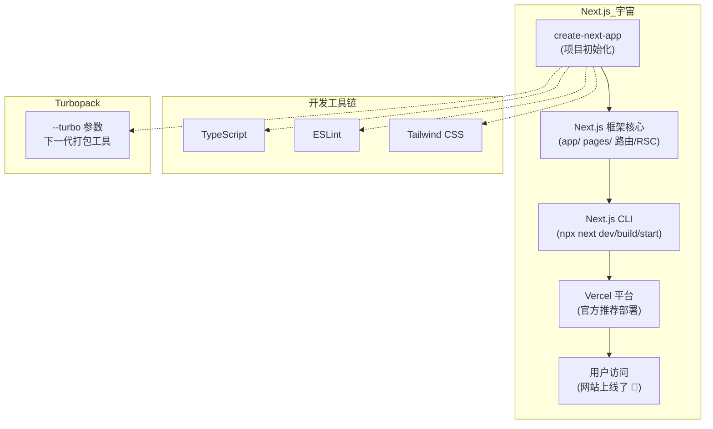

+++
title = "第1章  Create Next App 是什么"
weight = 10
date = "2026-03-27T21:12:00+08:00"
type = "docs"
description = ""
isCJKLanguage = true
draft = false
+++

# 第一章 · Create Next App 是什么

> 欢迎来到第一章！这一章我们要搞清楚一个根本问题：Create Next App 到底是何方神圣？它凭什么值得你花时间学习？别急，且听我慢慢道来，保证让你笑着看完，还不忘记重点。

---

## 1.1 官方脚手架工具的定义

### 一个让人又爱又恨的场景

想象一下这个画面：某个月黑风高的夜晚，你心血来潮决定："我要学 Next.js！"然后你打开了官方文档，准备大干一场。结果文档第一行就给了你一个命令：

```bash
npx create-next-app@latest my-blog
```

你愣了一下："等等，这是什么？就一行命令？不需要先 `npm init`？不需要手动装 React？不需要配 TypeScript？不需要建文件夹？"

答案是：**不需要！** 因为你手里有 `create-next-app`。

### 什么是 Create Next App

`create-next-app` 是 Next.js 官方出品的**脚手架工具**，英文叫 Scaffolding Tool。什么叫脚手架？你可以理解成盖房子时的**临时支撑架**——它不是房子本身，但没有它你得一块砖一块砖自己摞，累死不说，还容易歪。

脚手架工具干的事情很简单：**在你开始写代码之前，帮你把项目架子搭好**。

### npx 是什么

你可能会好奇，为什么命令是 `npx create-next-app@latest`，而不是先安装再运行？

这就不得不提 `npx` 这个好东西了。`npx` 是 npm 自带的**执行器**（Executor），它的超能力是：**不用全局安装，直接运行指定包**。就像你去海底捞，服务员（npx）帮你把菜（create-next-app）直接端到桌上，你不用自己跑去后厨（全局安装）拿。

```bash
# npx 的工作原理：我们只需要告诉 npx 要执行哪个包
npx create-next-app@latest

# npx 会自动：
# 1. 去 npm 仓库下载 create-next-app 最新版本
# 2. 临时执行它
# 3. 跑完就删，不污染你的全局环境
```

> 小提示：`@latest` 代表最新稳定版，如果你想用特定版本，可以改成 `@14` 之类的，比如 `npx create-next-app@14`。

### 它是一个 CLI 工具

`create-next-app` 是一个 **CLI 工具**，全称是 Command Line Interface——命令行界面工具。这意味着：

- 它没有图形界面（没有按钮、输入框、复选框给你点）
- 它靠**终端命令**驱动，你输入什么它就干什么
- 它运行在你的 Terminal（终端）里，跟你打字聊天

所以下次看到黑乎乎的终端窗口，别怕，它只是在等你下命令而已。

---

## 1.2 create-next-app 与 Next.js 的关系

### 官方亲儿子，根正苗红

`create-next-app` 不是第三方工具，不是某个社区大佬自己写的。它是 **Next.js 官方（Vercel 团队）亲儿子**，源码就在 Next.js 的大仓库里：

```
github.com/vercel/next.js/tree/main/packages/create-next-app
```

也就是说，每次 Next.js 发布新版本，`create-next-app` 也会跟着一起更新，它们是一对**捆绑销售**的好搭档。

### 版本对应关系——表亲堂兄弟表

你可能见过这样的困惑："我装了 Next.js 14，那我该用什么版本的 create-next-app？"

好问题！答案是：**版本号几乎完全一致**。

| Next.js 版本 | create-next-app 版本 | 说明 |
|---|---|---|
| 15.x | 15.x | 最新版，手拉手一起走 |
| 14.x | 14.x | 稳定搭档 |
| 13.x | 13.x | 早期版本 |
| 12.x | 12.x | 老前辈了 |

> **小知识**：严格来说，`create-next-app` 的版本号有时候会比 Next.js 多一个小版本号，但大体上你看到 Next.js 是几，create-next-app 也差不了多少。所以当你运行 `npx create-next-app@latest` 时，拿到的版本就是你机器上最新的 Next.js 配套版本。

### 一句话总结关系

如果说 **Next.js 是一辆车**，那 **create-next-app 就是提车套餐**——帮你把钥匙、保险、上牌、加满油全都搞定，你只需要说"我要开车了"。


---

## 1.3 它帮我们自动完成了哪些事

### 手动搭 vs 一键搭——工作量对比

先问你一个问题：假设你要手动创建一个 Next.js + TypeScript + Tailwind CSS 项目，你需要做哪些事情？

数一数：

- 新建文件夹
- 运行 `npm init -y` 初始化 package.json
- 手动安装：`npm install next react react-dom`
- 手动安装 TypeScript 相关：`npm install -D typescript @types/react @types/node`
- 手动安装 Tailwind CSS 相关：`npm install -D tailwindcss postcss autoprefixer`
- 初始化 Tailwind：`npx tailwindcss init -p`
- 创建并配置 `tsconfig.json`
- 创建并配置 `next.config.js`
- 创建并配置 `tailwind.config.js`
- 创建并配置 `postcss.config.js`
- 创建 `app/` 目录（或 `pages/`）
- 创建 `app/layout.tsx`
- 创建 `app/page.tsx`
- 创建 `app/globals.css`
- 配置路径别名
- 配置 ESLint
- 写 `.gitignore`

**这大概是 20 步起跳。**

而 `create-next-app` 呢？

**1 步。**

```bash
npx create-next-app@latest my-blog --typescript --tailwind
```

喝茶等着，结束。

### 具体做了啥——庖丁解牛

来，让我们掀开 `create-next-app` 的盖子，看看它背后到底干了什么见不得人的事（其实是好事）：

**① 目录创建**
```bash
# 自动在当前目录下创建 my-blog 文件夹（或者你指定的目录名）
mkdir my-blog
```

**② 依赖安装**

自动安装以下依赖（举例，实际情况取决于你选的配置）：

```json
{
  "dependencies": {
    "next": "^15.0.0",
    "react": "^19.0.0",
    "react-dom": "^19.0.0"
  },
  "devDependencies": {
    "typescript": "^5.0.0",
    "@types/node": "^20.0.0",
    "@types/react": "^19.0.0",
    "tailwindcss": "^4.0.0",
    "eslint": "^8.0.0",
    "eslint-config-next": "^15.0.0"
  }
}
```

**③ 配置文件生成**

自动生成并填入合理默认值的配置文件：

| 文件 | 作用 |
|---|---|
| `next.config.ts` | Next.js 框架配置 |
| `tsconfig.json` | TypeScript 配置 + 路径别名 |
| `tailwind.config.ts` | Tailwind CSS 配置 |
| `postcss.config.mjs` | PostCSS 配置 |
| `.eslintrc.json` | ESLint 配置 |
| `.gitignore` | Git 忽略文件 |

**④ 文件骨架生成**

最激动人心的部分来了！它会生成这样的目录结构：

```
my-blog/
├── app/                    # App Router 目录
│   ├── globals.css         # 全局样式（Tailwind 指令已写好）
│   ├── layout.tsx          # 根布局（HTML 结构已搭好）
│   └── page.tsx            # 首页（Hello World 已写好）
├── public/                 # 静态资源目录
│   └── file.svg
├── .eslintrc.json         # ESLint 配置
├── .gitignore              # Git 忽略配置
├── next.config.ts          # Next.js 配置
├── package.json            # 项目配置
├── postcss.config.mjs      # PostCSS 配置
├── tailwind.config.ts      # Tailwind 配置
└── tsconfig.json           # TypeScript 配置
```

> 提示：如果你选了 `--src-dir`，所有 `app/` 相关的内容都会跑到 `src/app/` 下，结构会略有不同。

**⑤ 环境变量文件**

还会贴心地给你一个 `.env.local.example`，告诉你应该怎么写环境变量（但不会把真正的环境变量文件提交到 Git，防止泄露）。

---

## 1.4 create-next-app vs 手动创建 Next.js 项目的区别与优劣

### 先说结论

| 对比维度 | create-next-app | 手动创建 |
|---|---|---|
| 速度 | 🚀 30 秒搞定 | 🐢 15-30 分钟（看你熟练度） |
| 出错概率 | 🛡️ 低（官方验证过的模板） | 🔴 高（容易漏配置或配错） |
| 学习成本 | 低（适合初学者快速上手） | 高（能学到很多配置细节） |
| 灵活性 | ⭐⭐ 一般（基于模板） | ⭐⭐⭐⭐⭐ 完全掌控 |
| 适合场景 | 新项目、快速原型、学习 | 深度定制、有特殊需求 |

### 手动创建的价值——你值得拥有

等等，别急着把手动创建扔进垃圾桶。

手动创建虽然慢，但它有一个 `create-next-app` 永远给不了你的东西：**你亲手配置每一个文件的经历**。

当你手动配 `tsconfig.json` 的时候，你会知道 `paths` 是干什么的、`strict` 模式是什么意思、`jsx` 为什么要那样配置。`create-next-app` 帮你配好了，但这些知识就悄悄溜走了。

> 建议：新手先用 `create-next-app` 跑起来有成就感，**学有余力**的时候，再手动从头搭一遍——你会发现"哦！原来 `create-next-app` 给我生成了这些啊！"那种顿悟的感觉，比刷 100 道题还爽。

### create-next-app 的局限——它不是万能的

`create-next-app` 再强大，也有它做不到的事：

- ❌ **不能升级已有项目**：如果你有一个 Next.js 13 的项目，想升级到 15，create-next-app 帮不了你，需要用 `@next/codemod` 迁移工具
- ❌ **不能添加新功能到已有项目**：它只能创建全新的项目，不能往已有项目里追加功能
- ❌ **不能定制生成代码的内部逻辑**：你没法告诉它"帮我把 `app/page.tsx` 里的内容换成我的自定义模板"

---

## 1.5 create-next-app 的定位——初始化工具，而非部署或构建工具

### 画个圈圈说清楚

`create-next-app` 的定位非常好记：**只负责出生，不负责成长，更不负责搬出去住**。


### 它不是部署工具！

重要的事情说一遍：

> 🚨 **create-next-app 不负责部署！**
> 有些人误以为"我用 create-next-app 创建了项目，就算部署好了"，这是完全错误的。创建项目只是在你本地电脑上建了个文件夹，**互联网上的用户根本访问不到**。

部署你需要：
- 把代码上传到服务器（或用 Vercel 这样的平台）
- 运行 `npm run build` 构建生产版本
- 用 `npm start` 或者用 PM2 / Docker 启动服务
- 配域名、SSL 证书等

这些 `create-next-app` 统统不管，它只负责让你**本地跑起来**。

### 它也不是构建工具！

构建（把 TypeScript 代码编译成 JavaScript、把 Sass 编译成 CSS、压缩图片等）是由 **Next.js 自己的构建系统** 干的，不是 `create-next-app`。

`create-next-app` 创建完项目后，`next build` 命令才是负责构建的那个家伙。

---

## 1.6 它在 Next.js 生态中的位置

### 生态全景图

Next.js 不只是一个框架，它背后有一整个**宇宙**（好吧，生态）。`create-next-app` 就在这个宇宙里占据了一个独特的位置：



### 各个工具的分工——各司其职

| 工具 | 它是谁 | 它干什么 |
|---|---|---|
| **create-next-app** | 项目初始化工具 | 从零创建一个 Next.js 项目 |
| **Next.js** | 核心框架 | 提供路由、SSR、SSG、API 等能力 |
| **Next.js CLI**（`npx next`） | 运行时命令 | 启动开发服务器、构建项目、启动生产服务 |
| **Turbopack** | 打包工具 | 替代 Webpack 的新一代打包器（Next.js 14+ 可用 `--turbo` 开启） |
| **Vercel** | 部署平台 | Next.js 官方亲爹，零配置部署 |
| **@next/codemod** | 代码迁移工具 | 大版本升级时自动迁移代码 |

### 一图总结

```
create-next-app   →   Next.js 框架   →   Next.js CLI   →   Vercel 部署
  （搭架子）           （盖房子）           （装修）          （开门迎客）
```

---

## 本章小结

这一章我们搞清楚了一个根本问题：**Create Next App 是什么**。

- 它是 Next.js 官方出品的**脚手架工具**，通过 `npx create-next-app` 一行命令，帮你在 30 秒内从零创建一个完整的 Next.js 项目
- 它和 Next.js **版本号几乎一致**，同属于 Vercel 维护的大仓库
- 它自动完成：目录创建、npm 依赖安装、配置文件生成、页面骨架生成、环境变量文件初始化这 5 件事
- 它**不是部署工具**，也不负责构建，它只管"出生"那一刹那
- 它在 Next.js 生态中处于**最上游**的位置，是一切的开端

下一章我们将深入了解：`create-next-app` 到底能帮你省哪些事，它解决了什么问题，以及为什么你应该用它而不是手动搭。
