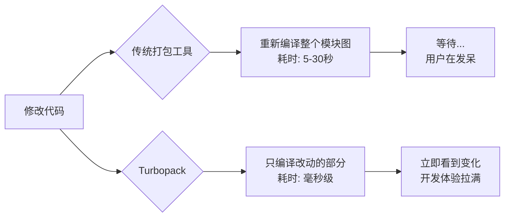

+++
title = "第3章  Create Next App怎么用"
weight = 30
date = "2026-03-27T21:12:00+08:00"
type = "docs"
description = ""
isCJKLanguage = true
draft = false
+++

# 第三章 · 怎么用

> 想象一下，你站在一家全自动拉面店门口，门口的大叔（其实是台会说话的点餐机）对你说："欢迎光临！请问您要点什么？"你看了看菜单，发现除了"招牌豚骨拉面"之外什么都不认识，于是陷入了哲学三问：我是谁？我从哪来？我到底该按哪个按钮？
>
> 别慌，本章就是你的"拉面店点餐指南"，手把手教你用 `create-next-app` 点出一碗完美的 Next.js 拉面——哦不对，是项目。

---

## 3.1 基本命令

`create-next-app` 是 Vercel 官方出品的 Next.js 项目脚手架工具，说白了就是一个"帮你自动生成一堆乱七八糟（但很有用）的项目文件"的懒人神器。你不需要手动创建 `package.json`、不需要配置 TypeScript、不需要安装 ESLint——一条命令，统统搞定。

它的基本调用形式长这样：

```bash
npx create-next-app [项目名称] [命令行参数]
```

`npx` 是个狠角色，它允许你直接运行 npm 上托管的包，而不需要全局安装。你可以理解为"临时召唤出来用一下，用完就消失"的工具人。

下面我们逐一介绍四种最常用的启动方式。

### 3.1.1 在当前目录下交互式创建（无参数）

最纯粹、最原始、最"我也不知道我要什么"的启动方式——直接运行命令，不带任何参数：

```bash
npx create-next-app
```

执行这行命令后，`create-next-app` 会像个耐心的服务员一样，依次问你一系列问题：

1. **项目叫什么名字？**（你需要在命令行里输入项目名称）
2. **要不要用 TypeScript？**（默认 YES，按回车即可，除非你是 JavaScript 的忠实信徒）
3. **要不要用 ESLint？**（默认 YES，按回车）
4. **要不要用 Tailwind CSS？**（默认 YES，按回车）
5. **要不要用 `src/` 目录？**（默认 YES，按回车）
6. **要不要用 App Router？**（默认 YES，按回车）
7. **要不要自定义路径别名？**（默认 `@/*`，直接按回车）
8. **用什么包管理器？**（npm / yarn / pnpm / bun，选一个你顺手的）

每一步你都可以选择默认值（直接按回车）或输入自己的偏好。这种方式的精髓在于：**你不需要记住任何参数，只需要回答问题**。

> 适合人群：初学者、懒得记参数的同学、以及那些"我就是随便看看"的旁观的群众。

### 3.1.2 在指定目录下创建（传入目录名参数，跳过项目名询问）

如果你已经想好了项目叫什么名字，那可以直接把名字作为参数传进去，这样就能跳过"项目名称"这个询问环节——毕竟早一秒种下项目，早一秒收获快乐：

```bash
npx create-next-app my-awesome-project
```

运行这行命令后，`create-next-app` 会自动在当前目录下创建一个名为 `my-awesome-project` 的文件夹，并在其中初始化项目。同时，**项目名称的询问会被跳过**，直接进入 TypeScript 选项的询问。

也就是说，交互流程变成了这样：

1. ~~项目叫什么名字？~~（跳过，因为已经在命令里指定了 `my-awesome-project`）
2. **要不要用 TypeScript？**
3. **要不要用 ESLint？**
4. **要不要用 Tailwind CSS？**
5. **要不要用 `src/` 目录？**
6. **要不要用 App Router？**
7. **要不要自定义路径别名？**
8. **用什么包管理器？**

> 适合人群：已经想好项目名的实用主义者，以及那些"问那么多问题烦不烦"的急性子选手。

### 3.1.3 全默认选项创建（`--yes`）

有时候你就是一个没有感情的机器，只想快点拿到一个"标准 Next.js 项目"，然后开始写代码，不想回答任何问题。这时候 `--yes`（或 `-y`）参数就是你的最爱：

```bash
npx create-next-app my-default-project --yes
```

这行命令会：**使用所有默认选项创建一个项目，并且不询问任何问题**。所谓默认选项，就是：

- ✅ 使用 TypeScript
- ✅ 使用 ESLint
- ✅ 使用 Tailwind CSS
- ✅ 使用 `src/` 目录
- ✅ 使用 App Router
- ✅ 路径别名为 `@/*`
- ✅ 使用 npm 作为包管理器

这相当于你去拉面店说："老板，给我来一份招牌豚骨拉面，不要任何自定义配料！"然后 30 秒后你就端着一碗热气腾腾的标准拉面坐下了。

> 适合人群：赶时间的程序员、想快速搭建 demo 的同学、以及患有"选择困难症"的群体。

### 3.1.4 指定 Next.js 版本创建

有时候你不想用最新的 Next.js（毕竟新版本可能带来新 bug，你只是想稳稳地写代码），或者你需要在某个特定版本上开发（公司项目用的是某个旧版本，不想升级）。这时候可以用 `--version` 或直接通过 npm 的方式指定版本：

```bash
# 指定具体版本号（以 Next.js 14.2.0 为例）
npx create-next-app@14.2.0 my-old-school-project

# 指定一个版本范围（比如最新的 14.x 版本）
npx create-next-app@14 my-old-school-project

# 指定 latest（最新正式版）
npx create-next-app@latest my-cutting-edge-project

# 指定 canary（最新实验版，小心驶得万年船）
npx create-next-app@canary my-adventurous-project
```

这里的 `@14.2.0`、`@14`、`@latest`、`@canary` 都是 **npm 的版本标签（version tag）**。简单说一下它们的区别：

| 标签 | 含义 | 适用场景 |
|------|------|----------|
| `@14.2.0` | 精确版本号 | 需要稳定复现某个特定版本时使用 |
| `@14` | 主版本号（会匹配最新的 14.x.y） | 想要 14 系的最新稳定版 |
| `@latest` | 最新正式发布版 | 追求新特性，不惧风险 |
| `@canary` | 最新的实验版 | 想要最新最炫的功能，愿意当小白鼠 |

> 适合人群：对版本有执念的强迫症患者、需要维护老项目的怀旧派、以及喜欢尝鲜的冒险家。

---

## 3.2 交互式选项说明

当你运行 `npx create-next-app`（不带参数或带项目名）时，会触发一个交互式问答流程。本节将逐个拆解每个问题，让你不仅知道"该选哪个"，更知道"为什么选这个"。

### 3.2.1 项目名称

```
? What is your project named? …
```

这是第一个问题，也是最简单的一个——你的项目总得有个名字吧？

项目名称会直接影响：

- **文件夹名称**：创建出来的文件夹就叫这个名字
- **`package.json` 中的 `name` 字段**：决定 npm 仓库里你的包叫什么（如果以后要发布 npm 包的话）
- **浏览器标签页的标题**（在 `app/layout.tsx` 中会引用）

起名字是个技术活，这里有几个建议：

- **用短横线分隔小写单词**：`my-awesome-app`、`blog-platform`、`todo-list`
- **避免使用空格和特殊字符**：不然命令行和 npm 会疯掉的
- **不要用中文**：虽然技术上可以，但包管理器世界还是英文的天下

> 好的项目名是成功的一半。比如 `nextjs-blog` 就比 `我的第一个博客项目` 专业一万倍。

### 3.2.2 是否使用 TypeScript

```
? Would you like to use TypeScript? … No / Yes
```

**TypeScript** 是 JavaScript 的超集，它在 JavaScript 的基础上添加了**静态类型系统**。你可以理解为：JavaScript 是个"做完作业才发现写错了"的学渣，TypeScript 是个"写之前就告诉你哪里会出错"的严格老师。

使用 TypeScript 的好处：

- **编译期错误检查**：很多 bug 在写代码的时候就能被发现，而不是等到用户点击按钮后控制台一片红
- **智能提示更准确**：IDE（如 VS Code）能更好地理解你的代码，按 tab 键就能补全一整行
- **代码即文档**：类型定义本身就是最好的注释，新人接手项目不用满世界找文档

```
TypeScript 代码示例：
// 定义一个带有类型的函数参数
function greet(name: string, age: number): string {
  return `Hello, ${name}! You are ${age} years old.`;
}

greet("Alice", 30);      // ✅ 正确：name 是 string，age 是 number
greet(123, "twenty");    // ❌ 错误：类型不匹配，TypeScript 会在编译时报错
```

如果你选择使用 TypeScript，`create-next-app` 会自动：

- 安装 TypeScript 相关依赖（`typescript`、`@types/react`、`@types/node` 等）
- 生成 `tsconfig.json` 配置文件
- 将所有 `.js` 文件改为 `.tsx`（或 `.ts`）
- 配置好 VS Code 的类型提示

如果你选择 **不用** TypeScript，你将得到一个纯 JavaScript 项目。

> 建议：**能用 TypeScript 就用 TypeScript**，这是一个"今天多花 10 分钟配置，以后少花 2 小时 debug"的买卖。除非你是：
> - 刚刚学习 JavaScript 的纯新手
> - 临时需要一个超简单的 demo
> - 项目只需要 50 行代码就能搞定

### 3.2.3 是否使用 ESLint

```
? Would you like to use ESLint? … No / Yes
```

**ESLint** 是一个代码质量检查工具，它可以**自动发现你代码中的问题**，比如：

- 声明了变量但没使用
- 函数参数有多余的
- 缩进不统一（有人用空格，有人用 Tab）
- 可能有 bug 的写法（比如 `==` 而不是 `===`）

你可以把 ESLint 理解为你的"代码班主任"，它会时刻盯着你的代码，发现你偷懒、犯错、或者写出"虽然能跑但很烂"的代码时，就会跳出来批评你。

ESLint 不仅仅是为了代码美观，更重要的是**提前发现潜在的 bug**。比如：

```javascript
// 这行代码在 JavaScript 中是合法的（会自动类型转换）
if (name == "Alice") { ... }

// 但这行更好（严格比较，不会出错）
if (name === "Alice") { ... }

// ESLint 会警告你使用 == 而不是 ===，因为 == 可能会导致意想不到的结果
```

在 Next.js 项目中，ESLint 还会特别检查一些 Next.js 特有的规则，比如：

- 图片组件必须提供 `alt` 属性（无障碍访问）
- 不能在客户端组件里直接使用服务端 API（Server Actions 等）
- 避免使用已经废弃的 API

如果你选择使用 ESLint，`create-next-app` 会自动安装 `eslint` 和 `eslint-config-next`（Vercel 官方提供的 Next.js 最佳实践规则集）。

> 建议：**保持 ESLint 开启**，关闭它就像是不穿护具去打架——不是不行，但是很蠢。

### 3.2.4 是否使用 Tailwind CSS

```
? Would you like to use Tailwind CSS? … No / Yes
```

**Tailwind CSS** 是一个"原子化"CSS 框架。传统的 CSS 写法是"在 CSS 文件里写一堆类名，然后在 HTML 里引用"；而 Tailwind 的思路是**直接在 HTML（JSX）标签上写样式**。

对比一下你就明白了：

```
传统 CSS 写法：

/* styles.css */
.button {
  background-color: blue;
  color: white;
  padding: 10px 20px;
  border-radius: 5px;
  font-size: 16px;
}

/* JSX */
<button className="button">点我</button>

Tailwind CSS 写法：

<button className="bg-blue-500 text-white px-4 py-2 rounded font-medium">
  点我
</button>
```

Tailwind 的核心优势：

1. **不用切换文件**：写样式的时候不用在 JSX 和 CSS 之间来回跳
2. **不用想类名**：不用再绞尽脑汁想 `primary-button-red` 这种类名了
3. **响应式设计超简单**：`md:bg-blue-500` 表示"在中等及以上屏幕上蓝色"
4. **Tree-shaking 友好**：没用到的样式会自动被移除，不会增加包体积

Tailwind 的类名虽然看起来像乱码，但用久了之后你会发现——这简直是 CSS 界的"五笔输入法"，入门门槛高，但熟练之后打字飞快。

```html
<!-- Tailwind 示例：一整个带响应式的卡片组件 -->
<div className="max-w-md mx-auto bg-white rounded-xl shadow-md overflow-hidden md:max-w-2xl">
  <div className="md:flex">
    <div className="md:shrink-0">
      
    </div>
    <div className="p-8">
      <div className="uppercase tracking-wide text-sm text-indigo-500 font-semibold">
        案例
      </div>
      <h2 className="block mt-1 text-lg leading-tight font-medium text-black">
        令人惊叹的Tailwind
      </h2>
      <p className="mt-2 text-slate-500">
        Tailwind 让写样式变得像搭积木一样简单！
      </p>
    </div>
  </div>
</div>
```

> 建议：
> - 如果你**需要快速开发 UI**，选 Tailwind，它能让你少写很多 CSS
> - 如果你**不喜欢在 HTML 里写样式**，或者项目主要是**后端管理后台**（传统后台管理系统更适合用 Ant Design 这样的组件库），可以考虑不用 Tailwind
> - 如果你是**CSS 大师**，有自己的 CSS 哲学，用原生 CSS 也完全没问题

### 3.2.5 是否使用 `src/` 目录

```
? Would you like to use `src/` directory? … No / Yes
```

这个问题问的是：要不要把你的源代码放在一个叫 `src/` 的文件夹里？

**`src/` 目录**（Source Directory）是常见的一种项目组织方式，它把所有"源代码"放在一个统一的 `src` 文件夹下，与配置文件、根目录文件区分开来。

**使用 `src/` 目录时的项目结构：**

```
my-project/
├── src/
│   ├── app/           # Next.js App Router 的页面和布局
│   ├── components/    # React 组件
│   ├── lib/          # 工具函数、辅助模块
│   └── ...
├── public/           # 静态资源（图片、字体等）
├── package.json
├── next.config.js
└── ...
```

**不使用 `src/` 目录时的项目结构：**

```
my-project/
├── app/              # Next.js App Router 的页面和布局
├── components/       # React 组件
├── lib/             # 工具函数、辅助模块
├── public/          # 静态资源
├── package.json
├── next.config.js
└── ...
```

两种方式在**功能上没有区别**，只是组织代码的位置不同。

> 建议：**选择使用 `src/` 目录**。原因如下：
> - 代码更加**整洁有序**，一眼就能看出哪些是源码、哪些是配置
> - 很多社区推荐的 Next.js 项目结构都是基于 `src/` 的，方便以后"抄作业"
> - 避免根目录过于拥挤——想象一下根目录有 20 个文件夹和文件的恐怖场景

### 3.2.6 是否使用 App Router

```
? Would you like to use App Router? … No / Yes
```

**App Router** 是 Next.js 13 引入的全新文件系统路由系统，是 **Pages Router** 的继承者（虽然 Pages Router 还没被废弃，但 App Router 才是未来）。

简单来说，App Router 是一种"约定式路由"——你只需要在 `app/` 目录下创建文件，Next.js 会自动把这些文件映射为路由：

| 文件路径 | 映射的 URL |
|----------|-----------|
| `app/page.tsx` | `/`（首页） |
| `app/about/page.tsx` | `/about`（关于页面） |
| `app/blog/[slug]/page.tsx` | `/blog/任意文章slug`（动态路由） |
| `app/dashboard/settings/page.tsx` | `/dashboard/settings`（嵌套路由） |

App Router 的核心优势：

1. **React Server Components (RSC)**：默认情况下，App Router 的组件是**服务端组件**，可以直接在组件里写数据库查询、文件读取等操作，而不需要额外的 API Route
2. **更直观的嵌套布局**：通过 `layout.tsx` 文件可以轻松创建嵌套布局
3. **数据获取更简单**：使用 `async/await` 直接在组件里获取数据
4. **更细粒度的加载状态控制**：每个路由都可以有自己的 `loading.tsx`

```tsx
// App Router 示例：在服务端组件中直接查询数据库
// app/users/page.tsx

// 这是一个 React Server Component（默认行为）
async function UsersPage() {
  // 直接在组件里写数据库查询，不需要 API Route！
  const users = await db.query('SELECT * FROM users');

  return (
    <main>
      <h1>用户列表</h1>
      <ul>
        {users.map(user => (
          <li key={user.id}>{user.name}</li>
        ))}
      </ul>
    </main>
  );
}

export default UsersPage;
```

Pages Router 是上一代的路由系统（Next.js 12 及之前的主流方式），它使用 `pages/` 目录来组织路由，通过 `getServerSideProps`、`getStaticProps` 等函数来获取数据。

> 建议：**使用 App Router**。原因很简单——它是 Next.js 官方推荐的未来方向，拥有更好的性能、更直观的数据获取方式、以及更强大的特性。除非你需要维护一个老旧的 Pages Router 项目，否则没有理由不选 App Router。

### 3.2.7 自定义路径别名（`@/*`）

```
? Would you like to customize the default import alias? … No / Yes
```

**路径别名（Import Alias）**是一种"让导入路径更短更优雅"的技术。

想象一下，你有一个这样的项目结构：

```
src/
├── app/
│   └── page.tsx          # 首页
├── components/
│   ├── Button.tsx        # 按钮组件
│   └── Card.tsx          # 卡片组件
└── lib/
    └── utils.ts          # 工具函数
```

在 `page.tsx` 中，如果你想导入 `Button` 组件，按照相对路径的方式，你需要这样写：

```tsx
// 相对路径导入（不使用别名）
import Button from '../../../components/Button';
import Card from '../../../components/Card';
import { formatDate } from '../../../lib/utils';
```

问题来了：如果你把 `page.tsx` 移到 `app/blog/` 目录下，那些 `../../../` 就得全部改成 `../../../../`——文件越嵌套，改起来越崩溃。

而路径别名就是来解决这个问题的。默认的 `@/*` 别名表示"项目根目录（也就是 `src/` 目录的父级，或者 `src/` 目录本身，如果你用了 `src/` 目录的话）"：

```tsx
// 使用路径别名导入（从 @/ 开始）
import Button from '@/components/Button';
import Card from '@/components/Card';
import { formatDate } from '@/lib/utils';
```

无论你的文件在 `app/` 的哪个嵌套层级，**`@/` 永远指向 `src/` 的根目录**（或项目根目录，取决于你是否使用 `src/` 目录）。这样你就不用再"数点了"（`../` 有几个来着？）。

别名是**完全可自定义的**。`@/*` 只是默认值，你也可以改成 `~/*` 或者任意你喜欢的符号：

```tsx
// 使用 @ 开头（Next.js 默认推荐）
import Button from '@/components/Button';

// 使用 ~ 开头（有些团队喜欢用这个）
import Button from '~/components/Button';

// 甚至可以不用前缀（但这可能会和 node_modules 的包混淆）
import Button from 'components/Button';
```

> 建议：保持默认的 `@/*` 就好。这是一个被广泛接受的社区惯例，其他开发者看到 `@/` 就知道这是项目内部的模块导入。改来改去只会造成混乱，除非你有特别的理由（比如公司内部规定使用特定别名）。

---

## 3.3 命令行参数详解

交互式问答虽然友好，但在**自动化脚本**、**CI/CD 流水线**、或者**你懒得按回车**的场景下就不够用了。这时候命令行参数就派上用场了——你可以一条命令把所有选项都指定好，不用回答任何一个问题。

`create-next-app` 的命令行参数分为两类：**启用类**（如 `--typescript`）和**禁用类**（如 `--no-typescript`）。两者的效果完全相反，禁用类就是在启用类前面加了 `--no-` 前缀。

### 3.3.1 `--typescript` / `--no-typescript`

**作用**：是否使用 TypeScript。

```bash
# 使用 TypeScript（显式指定）
npx create-next-app my-project --typescript

# 不使用 TypeScript（明确禁止）
npx create-next-app my-project --no-typescript
```

如果你不传这个参数，交互式创建时会**默认选择 YES**（即使用 TypeScript）。

### 3.3.2 `--eslint` / `--no-eslint`

**作用**：是否使用 ESLint。

```bash
# 使用 ESLint
npx create-next-app my-project --eslint

# 不使用 ESLint
npx create-next-app my-project --no-eslint
```

如果你不传这个参数，交互式创建时会**默认选择 YES**。

### 3.3.3 `--tailwind` / `--no-tailwind`

**作用**：是否使用 Tailwind CSS。

```bash
# 使用 Tailwind CSS
npx create-next-app my-project --tailwind

# 不使用 Tailwind CSS
npx create-next-app my-project --no-tailwind
```

如果你不传这个参数，交互式创建时会**默认选择 YES**。

### 3.3.4 `--src-dir` / `--no-src-dir`

**作用**：是否使用 `src/` 目录来组织源代码。

```bash
# 使用 src/ 目录
npx create-next-app my-project --src-dir

# 不使用 src/ 目录（直接放在项目根目录）
npx create-next-app my-project --no-src-dir
```

如果你不传这个参数，交互式创建时会**默认选择 YES**（即使用 `src/` 目录）。

### 3.3.5 `--app` / `--no-app`

**作用**：是否使用 App Router（而不是 Pages Router）。

```bash
# 使用 App Router
npx create-next-app my-project --app

# 不使用 App Router（使用旧的 Pages Router）
npx create-next-app my-project --no-app
```

如果你不传这个参数，交互式创建时会**默认选择 YES**（即使用 App Router）。

### 3.3.6 `--import-alias`

**作用**：自定义路径别名前缀。默认是 `@/*`。

```bash
# 使用默认别名 @/*
npx create-next-app my-project --import-alias "@/*"

# 自定义为 ~/（以 ~ 开头）
npx create-next-app my-project --import-alias "~/"

# 自定义为任意你喜欢的别名
npx create-next-app my-project --import-alias "@components/*"
```

别名必须是**以 `@`、`~` 或其他非特殊字符开头**的字符串，并且**必须以 `/*` 结尾**（表示这是一个目录别名）。常见选项：

| 别名 | 含义 |
|------|------|
| `@/*` | 推荐默认值，`@/` 指向 `src/` 或项目根目录 |
| `~/*` | 备选方案，有些团队偏好用 `~` |
| `@components/*` | 显式指向 components 目录（但这不太灵活，不推荐） |

### 3.3.7 `--use-npm` / `--use-yarn` / `--use-pnpm` / `--use-bun`

**作用**：指定使用哪个包管理器来安装项目依赖。

```bash
# 使用 npm（Node.js 内置，最广泛使用）
npx create-next-app my-project --use-npm

# 使用 yarn（Facebook 出品，速度快，有锁文件）
npx create-next-app my-project --use-yarn

# 使用 pnpm（速度快，磁盘占用少，使用软链接）
npx create-next-app my-project --use-pnpm

# 使用 bun（新生代选手，极速，有人说是"JavaScript 界的兰博基尼"）
npx create-next-app my-project --use-bun
```

这四个参数是**互斥**的——你只能选择其中一个。

简单介绍一下各包管理器的特点：

| 包管理器 | 特点 | 适合人群 |
|----------|------|----------|
| **npm** | Node.js 内置，无需安装，生态最大 | 所有人，尤其是初学者 |
| **yarn** | 速度快，有离线缓存，输出信息友好 | 喜欢 yarn 工作流的团队 |
| **pnpm** | 磁盘利用率极高（使用硬链接/软链接），速度快 | 磁盘空间紧张或追求性能的开发者 |
| **bun** | 用 Zig 写的，极速，支持 TypeScript 内置 | 极客玩家和追求最新技术的先行者 |

如果你不传这个参数，交互式创建时会**让你手动选择一个**。

> 一个小技巧：如果你同时安装了多个包管理器，macOS/Linux 下可以用 `corepack enable` 来快速启用 yarn 或 pnpm，而不需要单独安装它们。

### 3.3.8 `--turbo`（Next.js 14）/ `--turbopack`（Next.js 15+）

**作用**：启用 Turbopack——Vercel 开发的下一代打包工具，被认为是 Webpack 的"性能猛兽升级版"。

```bash
# Next.js 14：使用 --turbo
npx create-next-app@14 my-project --turbo

# Next.js 15+：使用 --turbopack
npx create-next-app@latest my-project --turbopack
```

**Turbopack** 是 Vercel 用 Rust 重写的打包工具，它的目标是：

- **启动速度提升 10 倍**：冷启动几乎是即时的
- **热更新速度快 10 倍**：修改代码后，浏览器几乎是"瞬间"刷新
- **更智能的增量编译**：只重新编译改变的部分，而不是整个项目



> 注意：Turbopack 在 Next.js 15 中作为**稳定版**推荐使用，而在 Next.js 14 中还是实验性功能。如果你使用的是 Next.js 15 及以上，`--turbopack` 会是默认的开发服务器选项（`next dev` 默认使用 Turbopack）。如果你还在用 Next.js 14，就需要使用 `--turbo` 来启用它。

### 3.3.9 `--yes` / `-y`

**作用**：跳过所有交互式问题，使用**所有默认选项**。

```bash
# 完整写法
npx create-next-app my-project --yes

# 简短写法（-y 是 --yes 的简写）
npx create-next-app my-project -y
```

这等价于：

- `--typescript`
- `--eslint`
- `--tailwind`
- `--src-dir`
- `--app`
- `--import-alias "@/*"`
- `--use-npm`（如果没有指定其他包管理器的话）

> 如果你想用 `--yes` 但同时又想覆盖其中某几个选项？没问题！`--yes` 和具体参数可以**叠加使用**——`--yes` 先设定所有默认值，然后你传的参数会覆盖对应的选项。比如：
> ```bash
> npx create-next-app my-project --yes --use-yarn --no-tailwind
> ```
> 这表示"除了**不用** Tailwind、**用** yarn 之外，其他全部默认"。

---

## 3.4 完整命令示例

光说不练假把式，光练不说傻把式。下面我们来几个**真实的、可直接复制运行**的命令示例，保证你看完就能上手。

### 3.4.1 最小化配置创建

如果你只是想**最快速度**拿到一个能跑的项目骨架（可能是为了测试某个想法、或者需要一个空项目来练手），最小化配置就是你的菜：

```bash
# 不使用 TypeScript、不使用 ESLint、不使用 Tailwind、不使用 src/ 目录
# 不使用 App Router（使用 Pages Router）
# 直接使用 npm
npx create-next-app my-minimal-app \
  --no-typescript \
  --no-eslint \
  --no-tailwind \
  --no-src-dir \
  --no-app
```

运行后你会得到一个**超干净的项目结构**：

```
my-minimal-app/
├── pages/
│   ├── _app.tsx
│   ├── _document.tsx
│   └── index.tsx
├── public/
│   ├── favicon.ico
│   └── vercel.svg
├── styles/
│   └── Home.module.css
├── package.json
├── next.config.js
└── README.md
```

所有文件都是**原生 JavaScript + CSS**，没有任何类型检查，没有代码风格检查，没有现代 CSS 框架——**纯净到像蒸馏水**。

> 这种配置适合的场景：
> - 你正在学习 JavaScript，不想被 TypeScript 的类型系统"干扰"
> - 你需要一个极简的 demo 来验证某个想法
> - 你对 Next.js 完全陌生，想先看看"最少东西"是什么样的

### 3.4.2 全功能配置创建

这是"豪华套餐"——**所有现代工具全上**：

```bash
# 使用所有推荐工具：TypeScript + ESLint + Tailwind + src/ 目录 + App Router
# 使用 npm 作为包管理器
# 指定路径别名为 @/*
npx create-next-app my-fullstack-app \
  --typescript \
  --eslint \
  --tailwind \
  --src-dir \
  --app \
  --import-alias "@/*" \
  --use-npm
```

这是目前 **Next.js 官方推荐的标准配置**，也是大多数商业项目会采用的方案。如果你不知道该选什么，用这个就对了。

运行后你会得到一个**功能齐全的项目结构**：

```
my-fullstack-app/
├── src/
│   ├── app/
│   │   ├── favicon.ico
│   │   ├── globals.css       # Tailwind 的全局样式文件
│   │   ├── layout.tsx        # 根布局文件
│   │   └── page.tsx          # 首页
│   ├── components/           # （空的，但目录已创建）
│   └── lib/                  # （空的，但目录已创建）
├── public/
├── .eslintrc.json            # ESLint 配置
├── .gitignore
├── next-env.d.ts             # Next.js 的 TypeScript 类型声明文件
├── next.config.mjs          # Next.js 配置文件
├── package-lock.json         # npm 锁文件（精确记录每个依赖的版本）
├── package.json
├── postcss.config.mjs        # PostCSS 配置（Tailwind 需要）
├── README.md
├── tailwind.config.ts        # Tailwind 配置文件
└── tsconfig.json             # TypeScript 配置文件
```

### 3.4.3 指定版本 + 指定选项组合

有时候你需要**特定版本 + 特定选项**的组合，比如你要维护一个使用 Next.js 14 的老项目，或者你想尝鲜最新版本但只启用部分功能：

```bash
# 场景 1：使用 Next.js 14.2.0，TypeScript + ESLint，不使用 Tailwind，使用 src/ 目录和 App Router
npx create-next-app@14.2.0 my-next14-app \
  --typescript \
  --eslint \
  --no-tailwind \
  --src-dir \
  --app \
  --use-yarn

# 场景 2：使用 Next.js 14（最新版 14.x），TypeScript + Tailwind，使用 App Router，使用 bun
npx create-next-app@14 my-bun-project \
  --typescript \
  --tailwind \
  --app \
  --use-bun

# 场景 3：使用最新版 Next.js 15，只用 TypeScript + App Router，其他全关
npx create-next-app@latest my-latest-minimal \
  --typescript \
  --no-eslint \
  --no-tailwind \
  --no-src-dir \
  --app \
  --use-pnpm

# 场景 4：使用 canary 实验版，开启 Turbopack（Next.js 15+），TypeScript + Tailwind 全开
npx create-next-app@canary my-experimental \
  --typescript \
  --eslint \
  --tailwind \
  --src-dir \
  --app \
  --turbopack \
  --use-npm
```

下表帮你快速查找"我应该用哪个版本参数"：

| 版本需求 | 命令写法 | 说明 |
|----------|----------|------|
| 某个具体版本（如 14.2.0） | `npx create-next-app@14.2.0` | 精确锁定版本 |
| 最新稳定版 14.x | `npx create-next-app@14` | 14 系最新稳定版 |
| 最新正式版（推荐） | `npx create-next-app@latest` | 永远是最新的正式版 |
| 最新实验版 | `npx create-next-app@canary` | 可能不稳定，功能最新 |

---

## 3.5 创建后启动流程

恭喜你！历经九九八十一难（其实是几条命令），你的 Next.js 项目终于创建好了。但别急着去泡咖啡——项目只是"原材料"，还需要经过"烹饪"才能端上桌。本节将带你完成**从原材料到热腾腾的成品**的全过程。

### 3.5.1 进入项目目录

创建项目后，你的命令行当前目录可能还在"原地"，你需要先**切换到项目目录**：

```bash
# 如果你上一步用的是 --yes 全默认创建，项目名假设是 my-fullstack-app
cd my-fullstack-app

# 如果你上一步创建的是 my-minimal-app
cd my-minimal-app

# 如果你用的是自定义的项目名
cd 你自定义的项目名
```

`cd` 是 "change directory" 的缩写，就是"换个文件夹待着"的意思。

> 小技巧：在 Windows 上，如果你用的是 PowerShell 或 CMD，可以用 `dir` 查看当前目录下有哪些文件夹；在 macOS/Linux 上，用 `ls` 查看。找到你的项目文件夹名后再 `cd` 进去。

### 3.5.2 安装依赖（`npm install`）

进入项目目录后，你需要**安装项目依赖**。

为什么需要这一步？因为 `create-next-app` 只帮你创建了项目文件，但没有帮你下载"第三方库"（比如 React、Next.js 本身、TypeScript 编译器等）。这些库被称为"依赖（dependencies）"，它们躺在 `package.json` 里，需要通过 `npm install` 命令来下载安装：

```bash
npm install
```

运行这行命令后，npm 会：

1. 读取 `package.json` 文件
2. 查看里面列出的所有依赖
3. 去 npm 仓库下载这些依赖包
4. 把它们放到项目根目录的 `node_modules/` 文件夹里

安装过程可能需要 **30 秒到 5 分钟**不等，取决于你的网络速度和电脑性能。第一次安装会比较慢，后续再次安装时会快很多（因为 npm 会缓存之前下载过的包）。

安装完成后，你会在项目根目录看到一个新生成的 **`package-lock.json`** 或 **`yarn.lock`** 文件。这个文件记录了每个依赖的**精确版本号**，目的是保证"无论谁在什么时候安装，得到的依赖版本都是一致的"。记得把这个文件也提交到 Git 仓库里！

```bash
# 安装成功的标志是：命令行出现类似这样的输出：
# added 312 packages in 5s
# (312 个包被添加到项目中)
```

> 如果你用的是 `yarn`、`pnpm` 或 `bun`，对应的安装命令分别是：
> - `yarn install`
> - `pnpm install`
> - `bun install`

### 3.5.3 启动开发服务器（`npm run dev`）

依赖安装好了，现在终于可以**启动开发服务器**了！

```bash
npm run dev
```

运行这行命令后，你会看到类似这样的输出：

```
  ▲ Next.js 15.x.x
  - Local:        http://localhost:3000
  - Ready

  ✓ Compiled successfully
```

恭喜你！**开发服务器已经启动成功！** `localhost:3000` 就是你的项目在本地运行的地址。

> 你可能会好奇："`npm run dev` 这个 `dev` 从哪来的？"答案在 `package.json` 里：
> ```json
> {
>   "scripts": {
>     "dev": "next dev",
>     "build": "next build",
>     "start": "next start",
>     "lint": "next lint"
>   }
> }
> ```
> `npm run dev` 就是执行 `"next dev"` 这条命令，启动 Next.js 的开发服务器。

### 3.5.4 访问 localhost:3000 验证

最后一步——验证你的项目是否真的能跑！

打开你的浏览器（Chrome、Firefox、Edge、Safari 随便你），在地址栏输入：

```
http://localhost:3000
```

按下回车，如果一切顺利，你会看到一个 **Next.js 的默认欢迎页面**，上面有一个大大的 Next.js Logo 和一些引导文字，比如 "Get started by editing app/page.tsx"。

这个页面意味着：

- ✅ 你的项目创建成功了
- ✅ 依赖安装成功了
- ✅ 开发服务器运行正常
- ✅ 浏览器能正常访问

> 如果你看到的不是欢迎页面，而是一个"404 Not Found"或者空白页面，别慌——这可能是因为你创建的是"最小化配置"（没有使用 `src/` 目录或 App Router），页面文件位置和标准结构不一样。仔细看看命令行的输出，Next.js 通常会告诉你"页面文件在哪里"。

🎉 **好了，现在你可以开始写代码了！** 快去 `app/page.tsx`（或 `pages/index.tsx`）里大展身手吧！

---

## 本章小结

本章我们学习了 `create-next-app` 的使用方法，主要内容包括：

### 核心命令

| 命令 | 用途 |
|------|------|
| `npx create-next-app` | 交互式创建项目（回答问题） |
| `npx create-next-app 项目名` | 跳过项目名询问的交互式创建 |
| `npx create-next-app 项目名 --yes` | 全默认选项静默创建 |

### 关键选项一览

| 选项 | 作用 | 默认值 |
|------|------|--------|
| `--typescript` / `--no-typescript` | 是否使用 TypeScript | ✅ 默认开启 |
| `--eslint` / `--no-eslint` | 是否使用 ESLint | ✅ 默认开启 |
| `--tailwind` / `--no-tailwind` | 是否使用 Tailwind CSS | ✅ 默认开启 |
| `--src-dir` / `--no-src-dir` | 是否使用 src/ 目录 | ✅ 默认开启 |
| `--app` / `--no-app` | 是否使用 App Router | ✅ 默认开启 |
| `--import-alias` | 路径别名前缀 | `@/*` |
| `--use-npm/yarn/pnpm/bun` | 指定包管理器 | 交互式选择 |
| `--turbopack` | 启用 Turbopack 打包 | Next.js 15+ |
| `--yes` / `-y` | 使用所有默认选项 | — |

### 创建后的启动流程

```bash
cd 项目名          # 1. 进入项目目录
npm install        # 2. 安装依赖
npm run dev        # 3. 启动开发服务器
# 然后打开 http://localhost:3000 查看效果
```

### 最佳实践建议

1. **新手推荐**：直接 `--yes` 全默认创建，然后边学边改
2. **TypeScript**：不要犹豫，用它！早用早享受
3. **Tailwind CSS**：UI 项目强烈推荐，后台管理可选
4. **src/ 目录**：保持开启，让项目结构更清晰
5. **App Router**：保持开启，它是 Next.js 的未来
6. **路径别名**：保持默认 `@/*`，不要改
7. **版本选择**：大多数情况下用 `@latest` 即可

> 记住：`create-next-app` 只是起点，真正的精彩在后面——接下来你要学的是如何在这个骨架上构建你的应用。开工吧，程序员！🚀
