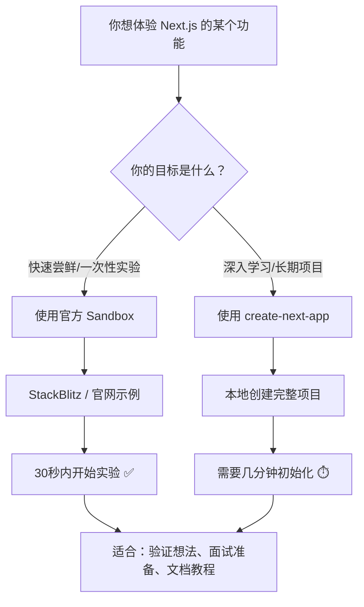

+++
title = "第4章  Create Next App用在哪"
weight = 40
date = "2026-03-27T21:12:00+08:00"
type = "docs"
description = ""
isCJKLanguage = true
draft = false
+++

想象一下，你站在一片荒芜的代码沙漠中，眼前什么都没有，只有一个光秃秃的文件夹图标孤零零地躺在那里，旁边还有一个闪烁的光标，仿佛在嘲笑你："来吧，从零开始构建一个世界吧！" 这时候，`create-next-app` 就是你的创世神器，它能凭空变出一个完整的 Next.js 项目结构，让你不用手忙脚乱地敲 `mkdir`、`touch`、`npm init` 一通乱操作。本章我们就来聊聊，这把"瑞士军刀"到底适合在哪些场景下挥舞，又应该在哪些情况下乖乖收进刀鞘。

## 4.1 适合使用的场景

`create-next-app` 并非万能钥匙，但它绝对是打开新世界大门的首选钥匙。下面这些场景，就是它大显神通的时刻。

### 4.1.1 新项目从零开始

**适用指数：** ⭐⭐⭐⭐⭐（满分五颗星，不给六颗是因为要谦虚）

当你拿到一个全新的需求文档，产品经理拍着胸脯说"这个功能很简单，就是一个普通的 Web 应用"的时候，你心里清楚：万丈高楼平地起，最难的就是第一步——搭建项目骨架。这时候如果你选择手动创建 Next.js 项目，那画面大概是这样的：你打开终端，输入一行命令，然后开始漫长的"这个文件夹叫什么来着？""这个配置文件要放在哪里？""TypeScript 配置要不要开？""ESLint 规则怎么配？"的纠结之旅。

手动创建 Next.js 项目需要了解的关键配置文件包括：`package.json`（项目的元数据管理器，记录着你项目叫什么名字、依赖哪些包、有哪些脚本命令）、`tsconfig.json`（TypeScript 的配置文件，告诉编译器"我是认真的，我要强类型检查"）、`next.config.js`（Next.js 的专属配置文件，控制着编译、输出、实验性功能等方方面面）、`.eslintrc.json`（代码风格警察的配置文件，确保团队里那个喜欢用分号和不喜欢用分号的人能和平共处）、`.prettierrc`（代码格式化配置文件，让你的代码永远整整齐齐，像刚被理发师剪过一样）。而 `create-next-app` 就像一个贴心的管家，一次性把这些文件全都给你准备好，还附赠一份"最佳实践套餐"，让你从第一天起就走上了正道。

手动创建项目的另一个痛苦在于版本兼容性问题。Next.js 目前已经发展到 App Router 时代，如果你手动创建项目，可能会因为漏掉了某些关键配置，导致项目结构和最新的最佳实践脱节。想象一下，你辛辛苦苦搭了一个项目，结果发现自带的文件夹结构是 `pages/` 目录而不是 `app/` 目录，面试官问你："你们项目用的是 Pages Router 还是 App Router？"你支支吾吾说不清楚，那场面多尴尬。而 `create-next-app` 默认生成的就是最新的 App Router 结构，让你一开始就站在时代的浪尖上。

从零开始的项目还有一个隐藏的痛点：依赖安装。手动创建项目时，你可能会漏装一些看起来不起眼但关键时刻会报错的依赖。比如你没有安装 `sharp`（一个用于优化图片的依赖），然后在生产环境发现所有图片加载慢得像蜗牛赛跑；或者你没有安装 `styled-jsx`（Next.js 内置的 CSS-in-JS 方案），结果样式不生效还以为是自己代码写错了。`create-next-app` 会帮你把核心依赖一次性装好，虽然不是所有依赖，但至少那些"百分之九十九的项目都会用到"的依赖，一个都不会少。

> 场景举例：假设你加入了一家创业公司，老板说"我们要做一个抖音！"（别问我为什么创业公司都要做抖音），你需要从零开始搭建整个前端项目。这时候 `create-next-app` 就是你的第一选择，它能在你喝完一杯咖啡的时间里，把项目骨架搭好，让你直接进入业务代码的编写，而不是在配置文件里迷失自我。

### 4.1.2 快速原型与概念验证

**适用指数：** ⭐⭐⭐⭐⭐（原型阶段争分夺秒，一秒都嫌多）

在这个"天下武功，唯快不破"的时代，原型开发讲究的是一个"快"字。产品经理今天提了一个需求，明天就想要一个可以点击的原型来给投资人演示；或者你突然有了一个绝妙的点子，想要赶紧做出来看看效果，不想被繁琐的项目配置消磨了灵感。这时候 `create-next-app` 就是你的加速器，它能在你念完"嘛哩嘛哩哄"的咒语之后（大约三十秒），给你一个完整的、可运行的、带有热更新的开发服务器。

快速原型开发的精髓在于"先跑起来，再优化"。你不需要一上来就设计完美的架构，不需要考虑微服务拆分，不需要纠结要不要上 Kubernetes，只需要一个能展示核心功能的页面。用 `create-next-app` 创建的项目，默认就带了开发服务器（`npm run dev`）、生产构建（`npm run build`）、以及一个看起来还算专业的 `app/` 目录结构。这意味着你可以立即开始写页面代码，而不用先花两个小时配置构建工具（Next.js 底层早已换装了 Turbopack 作为默认编译器，性能比Webpack快得多，但人家已经帮你配好了呀）。

对于概念验证（Proof of Concept，简称 POC）来说，`create-next-app` 的另一个优势是它默认集成了 TypeScript 支持。TypeScript 是 JavaScript 的超集，它添加了静态类型检查功能，能在编译阶段就发现那些"这个参数应该是字符串，但你传了一个数字"之类的低级错误。虽然有人说"原型阶段不需要类型检查"，但相信我，等你原型做大了要重构的时候，你会哭着感谢 TypeScript 的。想象一下，你做了一个包含两百个页面的"原型"，然后产品经理说"这个字段名字要改一下"，如果你用的是 TypeScript，只需要全局搜索替换；如果你用的是纯 JavaScript，那恭喜你，你将开启一段"到底哪些地方用了这个字段"的冒险之旅。

另外，`create-next-app` 创建的项目自带 Tailwind CSS 配置。Tailwind CSS 是一个"实用优先"的 CSS 框架，它的特点是不需要你写单独的 CSS 文件，直接在 HTML 标签上写类名就能设置样式。虽然有人吐槽 Tailwind 的类名太长、看起来像乱码，但它的开发体验确实很棒——你不需要来回切换文件，不需要想"这个样式应该放在哪个 CSS 类里"，改起来特别快。对于原型阶段来说，这种"所见即所得"的开发方式简直不要太爽。

> 场景举例：假设你参加了一个黑客松（Hackathon），需要在 48 小时内从零开始构建一个"可以识别你家猫是不是在偷吃猫粮"的 Web 应用。你需要在极短的时间内把核心功能做出来，根本没有时间慢慢配置项目。`create-next-app` 能让你在两分钟内完成项目初始化，然后你就可以把全部精力放在"如何用 TensorFlow.js 识别猫"这个真正有趣的问题上了。没有 `create-next-app`？那你可能还在终端里敲 `npm init` 呢，别人都已经开始训练模型了。

### 4.1.3 学习 Next.js 框架

**适用指数：** ⭐⭐⭐⭐⭐（学习曲线陡峭？不存在的，有梯子还怕什么）

作为一个刚踏入 Next.js 世界的初学者，你可能会感到一丝迷茫。Next.js 的官方文档内容详尽，但正因为太详尽了，对于完全没接触过的人来说，反而不知道从哪看起。`create-next-app` 的价值在这里就体现出来了：它给你提供了一个"最小但完整"的示例项目，让你可以"先跑起来，再研究原理"。

当你用 `create-next-app` 创建项目后，你会得到一个现成的 `app/` 目录结构，里面有 `page.tsx`（首页）、`layout.tsx`（布局组件）、`globals.css`（全局样式）等文件。官方默认的示例是一个"计数器"应用和一个"简单博客"雏形，这些示例虽然简单，但涵盖了 Next.js 的核心概念：客户端组件与服务端组件的区别（通过 `"use client"` 指令来区分）、路由系统（基于文件系统的路由）、布局与页面的嵌套关系、以及数据获取的基本方式。你可以通过修改这些示例文件来"做实验"，比如把计数器改成计算器、把博客雏形改成 Todo 应用，在这个过程中逐步理解 Next.js 的工作原理。

学习 Next.js 的一个难点在于理解"服务端组件"和"客户端组件"的概念。在传统的 React 开发中，所有组件都是客户端组件（浏览器端执行），但 Next.js 引入了服务端组件的概念，允许组件在服务器端渲染。服务端组件的好处是"首屏加载快、SEO 友好、可以直接访问数据库"，但代价是"不能使用 useState、useEffect 等客户端 hooks"。理解这个区别对于初学者来说是个挑战，而 `create-next-app` 给你生成的示例代码里，已经帮你标出了哪些是客户端组件（文件顶部有 `"use client"`）、哪些是服务端组件（没有 `"use client"` 指令）。你可以试着把 `"use client"` 去掉，看看哪些功能坏了、哪些功能还能正常工作，通过"破坏性实验"来深刻理解这个概念。

另一个 `create-next-app` 对初学者友好的地方是它默认集成了 ESLint 和 TypeScript。ESLint 是一个代码质量检查工具，它会在你写代码的时候帮你"找茬"——比如你定义了一个变量但没使用、或者你试图比较两个类型不同的值。TypeScript 则会在编译时报错，告诉你"你传的参数类型不对"。对于初学者来说，这些工具能帮助你养成良好的编码习惯，避免很多"为什么我的代码不工作"的困惑。想象一下，如果没有类型检查，你可能会花一个小时才发现"原来是这里传了个字符串而不是数字"，有了 TypeScript，这种错误在你写代码的时候就直接标红了，根本不需要等到运行时才发现。

```typescript
// 这是一个简单的服务端组件示例
// 服务端组件可以直接访问数据库、文件系统等服务器资源
// 不需要使用 "use client" 指令，默认就是服务端组件
async function getPosts() {
  // 模拟从数据库获取文章列表
  // 在实际项目中，这里通常是真实的数据库查询
  const posts = [
    { id: 1, title: '学习 Next.js 第一天', author: '小明' },
    { id: 2, title: '我终于理解了服务端组件', author: '小红' },
    { id: 3, title: 'create-next-app 太香了', author: '小刚' },
  ];
  return posts;
}

// Next.js 的 Page 组件必须是 async 函数（异步组件）
// 因为它允许你在这里进行数据获取
export default async function HomePage() {
  // 在服务端组件中直接调用异步函数获取数据
  // 数据在服务器端获取完毕后，再渲染成 HTML 发送给浏览器
  const posts = await getPosts();

  return (
    <main>
      <h1>我的博客</h1>
      {/* 渲染文章列表 */}
      <ul>
        {posts.map((post) => (
          <li key={post.id}>
            {post.title} - 作者：{post.author}
          </li>
        ))}
      </ul>
    </main>
  );
}
```

```typescript
// 这是一个客户端组件示例
// "use client" 指令告诉 Next.js：这个组件需要在浏览器端执行
"use client";

import { useState } from "react";

// useState 是 React 提供的一个 Hook，用于在函数组件中添加状态管理
// useState 返回一个数组：[当前状态值, 更新状态的函数]
// 初始值作为参数传入，这里是 0，表示计数器初始值为 0

export default function Counter() {
  // count 是当前计数的值，setCount 是更新计数值的函数
  const [count, setCount] = useState(0);

  return (
    <div>
      <p>当前计数：{count}</p>
      {/* 点击按钮时调用 setCount，传入新值 */}
      <button onClick={() => setCount(count + 1)}>+1</button>
      {/* 点击按钮时调用 setCount，传入回调函数（函数式更新） */}
      <button onClick={() => setCount((prev) => prev - 1)}>-1</button>
    </div>
  );
}
```

> 学习建议：当你刚接触 Next.js 时，不要试图一次性理解所有概念。建议先通读一遍官方文档的"入门"部分，然后用 `create-next-app` 创建一个项目，花一两天时间边做小项目边学习。每当遇到不懂的概念，就去查文档，然后回到你的项目中实验。这样学习，比单纯看文档快十倍不止。

### 4.1.4 团队新项目初始化（统一结构）

**适用指数：** ⭐⭐⭐⭐⭐（没有规矩，不成方圆；规矩太多，程序员发狂）

当一个团队要开始一个新项目时，最大的挑战之一就是"如何让所有人保持一致"。想象一下：如果每个人用自己的方式初始化项目，张三的项目用的是 Pages Router，李四用的是 App Router，王五更猛，手动搭了一个 Vue 项目（别笑，真有人这么干过），那后续的代码审查、维护、交接都将是一场噩梦。`create-next-app` 的价值在这里就体现出来了：它能确保团队里所有人都从同一个起点出发，用同一套文件夹结构、同一种命名规范、同一个配置文件模板。

团队协作中另一个重要的问题是"依赖版本一致性"。如果你手动创建项目，你可能会装 `next@14.0.1`，而隔壁工位的同事装的是 `next@14.2.0`，虽然看起来都是 14.x 版本，但某些 API 可能已经变了。轻则导致本地开发好好的，一上线就出问题；重则两个人写的代码根本没法合并。`create-next-app` 在创建项目时，会生成一个锁定的 `package-lock.json` 文件（或者如果你用 pnpm，就是 `pnpm-lock.yaml`），这个文件记录了每个依赖的精确版本号。只要团队里所有人都用这个锁文件来安装依赖，就能确保大家的依赖版本完全一致。"为什么我本地能跑，你本地不能跑"这种经典问题，在很大程度上就能避免了。

对于大型团队来说，项目初始化还需要考虑"如何快速上手新成员"。一个新同事入职，第一天就被要求在本地跑起项目来，如果你的项目是用 `create-next-app` 初始化的，那新同事只需要三步：`git clone` 你的代码仓库、运行 `npm install`（或 `pnpm install`）、运行 `npm run dev`。整个过程行云流水，新同事会对你心生敬意，觉得你是个"很会搭项目"的高手。如果你的项目是手动搭建的，光是搞清楚"为什么 `.env` 文件不存在"可能就要折腾半天，新同事可能会以为你是故意为难人家。

团队统一结构的另一个好处是"代码审查更轻松"。当所有人都在同一个框架下工作，代码审查者（Code Reviewer）就能更快地理解代码结构，不用在不同风格的项目之间来回切换。审查者知道 `app/` 目录下放的是页面、`components/` 目录下放的是组件、`lib/` 或 `utils/` 目录下放的是工具函数，这种约定俗成的规范（Convention over Configuration，简称 CoC）能大大降低沟通成本。想象一下，如果没有这种约定，每次代码审查都要先问"这个文件应该放哪里来着"，那效率得多低啊。

```bash
# 团队统一使用 create-next-app 初始化项目的标准流程

# 第一步：使用 create-next-app 创建项目
# --typescript 表示使用 TypeScript（强烈建议开启）
# --tailwind 表示使用 Tailwind CSS（UI 开发神器）
# --eslint 表示启用 ESLint（代码质量守门员）
# --app 表示使用 App Router（当前最新推荐）
# --src-dir 表示将源码放在 src/ 目录下（推荐，更清晰）
# --import-alias 表示导入路径的别名（默认是 @/*，表示 @/ 可以指向 src/ 或 app/ 目录）
npx create-next-app@latest my-team-project --typescript --tailwind --eslint --app --src-dir --import-alias "@/*"

# 第二步：进入项目目录
cd my-team-project

# 第三步：安装依赖（使用锁文件确保版本一致）
npm install

# 第四步：启动开发服务器，验证项目能正常运行
npm run dev
```

> 团队实践建议：建议在团队内部维护一份"项目初始化 SOP（标准操作流程）"，规定好使用哪些 `create-next-app` 选项、额外需要安装哪些依赖、项目结构调整等事项。这样每次开始新项目时，只需要按照 SOP 执行即可，既高效又不会出错。SOP 的示例可以参考下方：

```json
{
  "projectInitSOP": {
    "framework": "Next.js (App Router)",
    "language": "TypeScript",
    "styling": "Tailwind CSS",
    "linting": "ESLint",
    "srcDirectory": true,
    "importAlias": "@/*",
    "requiredDependencies": [
      "zustand",      // 状态管理库，轻量级，比 Redux 好上手
      "axios",        // HTTP 请求库，用于调用后端 API
      "react-hook-form", // 表单处理库，比原生表单好用一百倍
      "zod"           // 数据校验库，常用于表单验证和 API 响应校验
    ],
    "recommendedExtensions": [
      "ESLint",
      "Prettier",
      "Tailwind CSS IntelliSense",
      "Next.js Official"
    ]
  }
}
```

### 4.1.5 独立开发者快速搭建全栈应用

**适用指数：** ⭐⭐⭐⭐（全栈开发路路通，create-next-app 是你的左膀右臂）

独立开发者最宝贵的是什么？时间。你可能既是产品经理、又是前端开发、还是后端开发、顺便兼职运维和 UI 设计（虽然 UI 设计可能是你的女朋友或者 Figma 的默认值）。在这种情况下，你需要的是"用最少的步骤完成最多的事情"，而 `create-next-app` 能让你在最短的时间内把项目跑起来，把精力集中在真正创造价值的地方——业务逻辑。

Next.js 的 App Router 天生就适合全栈开发，因为你可以把 API 路由（用于处理后端请求）和页面组件放在同一个项目里。这就好比你买了一套"两室一厅"——前端是客厅，后端是卧室，虽然都在一个房子里，但各有各的功能。用传统的开发方式，你需要分别搭建前端项目和后端项目，然后用 Nginx 或者其他反向代理工具把它们串起来。这个过程光是配置文件可能就要写半天。而用 `create-next-app` 创建的 Next.js 项目，自带 API 路由功能（通过 `app/api/` 目录实现），你只需要在 `app/api/` 目录下创建一个文件，就能定义一个 API 端点。

API 路由是 Next.js 提供的一种简单方式来创建后端 API。在 Next.js 中，如果你在 `app/api/` 目录下创建一个文件夹，比如 `app/api/users/`，然后在里面创建一个 `route.ts` 文件，这个文件会自动暴露一个 `/api/users` 的接口。客户端（比如你的前端代码）可以通过这个接口和后端进行数据交换。

```typescript
// app/api/users/route.ts
// 这个文件会自动暴露 GET /api/users 和 POST /api/users 两个接口
// Next.js 会根据 HTTP 方法自动调用对应的处理函数

import { NextResponse } from "next/server";

// GET 处理器：当客户端发送 GET 请求到 /api/users 时调用
// 通常用于获取数据列表
export async function GET() {
  // 模拟从数据库获取用户列表
  const users = [
    { id: 1, name: "张三", email: "zhangsan@example.com" },
    { id: 2, name: "李四", email: "lisi@example.com" },
    { id: 3, name: "王五", email: "wangwu@example.com" },
  ];

  // NextResponse 是 Next.js 提供的响应类
  // json() 方法会返回一个 JSON 格式的响应，并自动设置 Content-Type 为 application/json
  return NextResponse.json(users);
}

// POST 处理器：当客户端发送 POST 请求到 /api/users 时调用
// 通常用于创建新数据
export async function POST(request: Request) {
  // request 是请求对象，包含客户端发送的数据
  // await request.json() 用于解析请求体中的 JSON 数据
  const body = await request.json();

  // 简单的参数校验
  if (!body.name || !body.email) {
    // 如果缺少必填参数，返回 400 错误
    return NextResponse.json(
      { error: "姓名和邮箱是必填项" },
      { status: 400 } // HTTP 状态码 400 表示"客户端请求有误"
    );
  }

  // 在实际项目中，这里应该是数据库插入操作
  const newUser = {
    id: Date.now(), // 用时间戳生成一个简单的 ID，实际项目用 UUID
    name: body.name,
    email: body.email,
  };

  // 返回 201 状态码（表示"已创建"）和新创建的用户信息
  return NextResponse.json(newUser, { status: 201 });
}
```

独立开发者用 `create-next-app` 还有另一个好处：部署简单。Next.js 项目可以一键部署到 Vercel（Next.js 的亲爸爸）上，只需要把代码往 GitHub 一推，然后点击一下"部署"按钮，你的网站就上线了。Vercel 会自动帮你处理 HTTPS 证书、CDN 加速、边缘计算等复杂的事情，你完全不用操心服务器运维。对于独立开发者来说，这种"零运维"的体验简直是太棒了——你只需要写代码，其他的事情平台都帮你包了。

如果你不想用 Vercel，Next.js 也支持部署到其他平台，比如 Docker 容器、Nginx 服务器、AWS Lambda（通过 Next.js 的 API 路由）等等。这种灵活性对于独立开发者来说很重要，因为有时候客户可能有自己的服务器要求，不能随意选择云平台。

```bash
# 独立开发者的一天：从项目初始化到部署上线

# 早上 9 点：用 create-next-app 初始化项目
npx create-next-app@latest my-saas --typescript --tailwind --eslint --app --src-dir --import-alias "@/*"

# 早上 9 点 05 分：进入项目，喝一口咖啡，开始写代码
cd my-saas

# 早上 9 点 10 分：安装一些常用的全栈依赖
# zustand：轻量级状态管理，简单易用，比 Redux 少写一半代码
# axios：HTTP 请求库，前后端通信必备
# bcryptjs：密码加密库，安全第一，加密不能少
# jsonwebtoken：JWT 令牌库，用于用户认证
npm install zustand axios bcryptjs jsonwebtoken

# 安装类型定义（TypeScript 用）
npm install -D @types/bcryptjs @types/jsonwebtoken

# 早上 9 点 30 分：开始写业务代码...

# 下午 5 点：代码写完了，准备部署
# 如果用 Vercel，只需要一行命令
# vercel 命令会引导你完成部署配置，包括选择项目名称、是否覆盖现有部署等
npx vercel

# 或者如果你想直接部署到生产环境
# --yes 参数会跳过所有确认步骤，直接部署
npx vercel --yes

# 下午 5 点 05 分：网站已经上线，你下班去约会了 🎉
```

> 独立开发者生存指南：用 Next.js 做全栈开发时，建议把"数据库访问层"封装成一个独立的模块（比如 `lib/db.ts`），而不是直接在 API 路由里写 SQL 语句。这样做的好处是：如果你以后想换数据库（比如从 PostgreSQL 换成 MySQL），只需要修改这一个文件，其他地方不用动。另外，记得在数据库连接时做好错误处理，万一数据库挂了，你的网站至少不会直接崩溃成一堆乱码，而是能显示一个友好的错误页面。

## 4.2 不需要使用的场景

`create-next-app` 虽好，但它毕竟只是一个项目初始化工具，不是万能的瑞士军刀。在某些场景下，使用它反而会帮倒忙，让简单的事情变得复杂。以下这些场景，请各位看官对号入座，如果你符合其中之一，请默默收起 `create-next-app`，另寻他路。

### 4.2.1 已有 Next.js 项目中新增页面或组件

**避坑指数：** ⭐⭐⭐⭐⭐（都说了不用，就别头铁了）

想象一下这个场景：你的团队已经有一个运行了两年的 Next.js 项目，项目结构经过无数次迭代，已经变得"面目全非"——文件夹结构是定制的、样式方案是自己魔改的、甚至路由规则都是自己写的（虽然 Next.js 官方不推荐这么做）。这时候你接手了一个新需求："在现有的用户管理模块里新增一个'批量导入用户'的页面"。你的第一反应是什么？是跑 `create-next-app` 然后把新项目的东西拷贝过来吗？大错特错！

在已有项目中新增页面或组件，正确的做法是"入乡随俗"——看看项目里现有的页面是怎么写的、组件是怎么组织的、样式是怎么处理的，然后照着做。如果你不顾项目的既有规范，硬塞进来一套新的"标准结构"，轻则被同事在 Code Review 的时候吐槽"这风格不对啊兄弟"，重则导致整个项目结构混乱，后来的人根本看不懂代码。

已有项目的另一个问题是依赖版本不一致。假设你的老项目用的是 Next.js 13.2，而你现在跑 `create-next-app` 创建的是最新版本（可能是 14.x 甚至 15.x），两个版本的配置格式、API 行为可能有很大差异。如果你把新项目的配置拷贝过来，可能会导致整个项目跑不起来。"为什么我本地能跑，线上不能跑"这种经典问题，十有八九就是这么来的。

正确的做法是：先 `git clone` 下来现有项目，仔细阅读 `README.md`（如果有的话），然后按照项目的既有规范去编写新的页面或组件。如果你不知道规范是什么，就去问团队里最资深的那个人，而不是自己发明一套新规范。记住：在团队项目中，"一致性"比"好不好看"更重要。

```bash
# 场景：错误示范——在已有项目中用 create-next-app 创建新项目然后合并

# 假设你已经在 ~/projects/old-nextjs-project 有一个老项目
cd ~/projects/old-nextjs-project

# 你想要新增一个页面，于是跑了个 create-next-app
# 注意：绝对不要在已有项目目录内运行 create-next-app！
npx create-next-app@latest new-feature

# 如果你不小心这么做了，恭喜你，你创造了一个"套娃项目"
# 现在你的目录结构会变成：
# old-nextjs-project/
#   new-feature/
#     app/
#     components/
#     ...（又一个完整的 Next.js 项目）
# 现在你需要手动把 new-feature 里的文件一个个拷贝到根目录
# 然后解决各种路径引用冲突、依赖冲突、配置文件冲突...
# 相信我，这个过程会让你怀疑人生

# 正确做法：在现有项目中手动创建文件
# 比如你的新页面叫"批量导入用户"，你应该这样做：

# 1. 先看看现有页面的目录结构
ls app/users/

# 2. 创建一个新的页面文件
touch app/users/batch-import/page.tsx

# 3. 照着现有页面的写法，开始写代码
# 不要复制 create-next-app 生成的 page.tsx，那是全新的项目，不是你的项目
```

> 血的教训：有一次，我在一个有三年历史的老项目里，不小心在 `components/` 目录下新建了一个用 `create-next-app` 模板创建的组件。结果那个组件用了 Tailwind CSS，而整个项目用的是自己魔改的 CSS Modules。由于 Tailwind CSS 的样式隔离不够彻底（新版本已经好很多了），导致页面上出现了莫名其妙的样式冲突——按钮变成了奇怪的蓝色、表单对齐全乱了、连标题的字体都变了。那天下午，我花了整整三个小时排查这个问题，最后发现是 Tailwind 的全局样式污染了其他组件的样式。从那以后，我再也不敢在老项目里混用不同的样式方案了。

### 4.2.2 只想体验 Next.js 某个具体功能（使用官方 Sandbox）

**避坑指数：** ⭐⭐⭐⭐（杀鸡焉用牛刀，尝鲜何必装机）

有时候，你只是想"尝尝鲜"——比如你在刷 Twitter 的时候看到有人说"Next.js 14 的服务器组件渲染速度提升了 50%"，你想亲自试试看是不是真的；或者你在官方文档里看到了一个很酷的例子，想跑一下看看效果；又或者你在面试前想临时抱佛脚，快速过一遍 Next.js 的核心概念。这些场景下，你的目标不是创建一个长期维护的项目，而只是"看一眼"、"跑一下"、"试试看"。在这种情况下，用 `create-next-app` 创建完整项目就有点"杀鸡用牛刀"了——你需要等几分钟创建项目、安装依赖、打开编辑器、然后才能开始实验，整个过程可能比你实际体验功能的时间还长。

官方 Sandbox（官方沙盒环境）是更合适的选择。Vercel（Next.js 的背后公司）提供了一个在线开发环境，叫做 StackBlitz 或者直接在 Vercel 官网的示例页面，你可以直接在浏览器里编辑和运行 Next.js 代码，完全不需要在本地安装任何东西。如果你只是想体验"服务端组件"是怎么工作的，或者想看看"App Router 的布局嵌套"是怎么回事，官方 Sandbox 能让你在三十秒内就开始实验，而 `create-next-app` 可能需要五分钟才能让你把项目跑起来。

官方 Sandbox 的另一个好处是"环境一致"。你在 Sandbox 里写的代码，运行效果和你预期的一模一样，因为它是官方提供的标准环境。而如果你用 `create-next-app` 创建项目，可能会因为你的本地环境配置问题（比如 Node.js 版本不对、npm 版本太老、某些系统依赖缺失）导致"官方文档说这个能工作，为什么我这里不行"的困惑。用 Sandbox 就不会有这个问题，因为它是云端环境，配置是标准化的。

什么时候用 Sandbox 呢？比如你在阅读官方文档的"快速入门"教程时，文档里会有很多可以点击运行的代码示例，你可以直接点击"在 StackBlitz 中打开"按钮，即刻看到效果。比如你在面试前想快速复习"如何使用 `generateMetadata` 生成动态 Meta 标签"，你不需要创建一个完整项目，只需要打开一个在线示例，改一改代码，看看输出是什么，然后关闭浏览器，整个过程不超过五分钟。



> 尝鲜指南：以下情况请选择官方 Sandbox，而不是 `create-next-app`：想验证某个官方文档示例是否如描述的那样工作；面试前临时抱佛脚，想快速过一遍某个功能的用法；在咖啡馆里突然想试试某个点子，但手边只有 iPad（Sandbox 在 iPad 上也能用）；只是想给别人演示某个功能，不需要保存代码。

### 4.2.3 升级已有项目（create-next-app 不负责升级）

**避坑指数：** ⭐⭐⭐⭐⭐（create-next-app 只管出生，不管成长）

这是一个非常重要但经常被误解的点：`create-next-app` 的职责是"创建新项目"，而不是"升级已有项目"。这句话看起来是废话，但很多人真的搞不清楚这个界限。想象一下这个场景：你的项目用的是 Next.js 12，现在官方已经发布 Next.js 14 了，你听说新版本有很多性能优化和酷炫新功能，于是你想升级。你跑去找 `create-next-app`："来，帮我把项目升级到最新版！"然后 `create-next-app` 会礼貌地拒绝你，因为它只负责创建新项目，不负责升级。

升级已有项目是一个复杂的过程，涉及多个步骤：更新 `package.json` 中的 Next.js 版本号、修改配置文件以适应新版本的 API 变化、更新依赖包的版本、测试现有功能是否正常、以及处理可能出现的 breaking changes（破坏性变更，指的是新版本不兼容旧版本 API 的变更）。这些步骤需要你手动去操作，或者借助一些专门的升级工具，而不是 `create-next-app`。

Next.js 官方提供了一个升级指南，专门帮助开发者把项目从旧版本升级到新版本。这个指南会告诉你每个版本的变更内容、哪些 API 被废弃了（Deprecated）、哪些新的 API 可以替代、以及升级的最佳实践。比如从 Pages Router 升级到 App Router，就是一个需要仔细规划的大工程，涉及到路由重写、组件重写、数据获取方式变更等一系列工作，根本不是 `create-next-app` 能帮你完成的。

```bash
# 升级已有 Next.js 项目的正确流程

# 第一步：阅读官方升级指南
# https://nextjs.org/docs/upgrading

# 第二步：在现有项目上创建一个新分支，用于升级实验
# 永远不要在主分支上直接升级！
git checkout -b upgrade-to-nextjs-14

# 第三步：更新 package.json 中的 Next.js 版本
# 编辑 package.json，手动把 "next" 的版本号改成你要升级到的版本
# 比如从 "next": "13.4.0" 改成 "next": "14.0.0"

# 第四步：删除 node_modules 和 lock 文件（这很重要！）
# 因为某些依赖可能有针对不同 Next.js 版本的缓存
rm -rf node_modules package-lock.json

# 第五步：重新安装依赖
npm install

# 第六步：运行升级检查命令（如果官方提供了的话）
npx @next/codemod@latest upgrade # 这是一个官方提供的代码转换工具，可以自动帮你迁移一些废弃的 API

# 第七步：启动开发服务器，看看有没有报错
npm run dev

# 第八步：测试核心功能是否正常
# ...

# 第九步：如果一切正常，合并到主分支
git checkout main
git merge upgrade-to-nextjs-14
```

升级项目时，还有一个常见的坑是"依赖兼容性"。当你升级 Next.js 版本后，一些依赖包可能也需要升级，因为它们可能依赖了旧版本的 Next.js API。比如你用的某个 UI 组件库，可能是针对 Next.js 13 开发的，在 Next.js 14 上可能有兼容性问题。这种情况下，你需要去组件库的 GitHub 仓库看看有没有支持新版本的更新，或者考虑换一个组件库。这整个过程都需要你手动去调研和测试，而不是 `create-next-app` 能帮你搞定的。

> 升级警告：永远不要指望 `create-next-app` 能帮你升级项目。它只会创建一个全新的项目，不会动你现有项目的一根毫毛。如果你真的想"用 `create-next-app` 的模板来升级"，唯一的办法是：创建一个新的空项目，然后把你老项目的代码一个一个拷贝过去。但这个过程风险极高——你可能会漏掉某些自定义配置、某些魔改的代码、某些特殊的依赖，结果新项目看起来跑起来了，但运行时问题一堆。所以，还是老老实实用官方的升级指南，一步一步来吧。

---

## 本章小结

哎呀，终于写完了！感觉比写论文还累！不过没关系，本章的内容绝对值回票价。让我来总结一下今天学到的知识点：

- **`create-next-app` 是项目初始化的神器**，它能在几秒钟内给你一个完整的、可运行的 Next.js 项目，省去你配置 TypeScript、ESLint、Tailwind CSS 的时间，让你专注于写业务代码而不是写配置文件。

- **适合使用 `create-next-app` 的场景包括**：新项目从零开始（你需要快速搭建项目骨架）、快速原型与概念验证（你需要争分夺秒地验证想法）、学习 Next.js 框架（你需要边做项目边学习，而不是光看文档）、团队新项目初始化（你需要统一结构、保持一致）、以及独立开发者快速搭建全栈应用（你需要前后端一起搞定）。

- **不需要使用 `create-next-app` 的场景包括**：在已有项目中新增页面或组件（你应该遵循项目的既有规范）、只想体验某个具体功能（用官方 Sandbox 更快捷）、以及升级已有项目（`create-next-app` 不负责升级，你需要用官方升级指南）。

- **`create-next-app` 能帮你生成的项目结构包括**：`package.json`、`tsconfig.json`、`next.config.js`、`.eslintrc.json`、以及 `app/` 目录下的各种文件。它默认使用 App Router、TypeScript、以及 Tailwind CSS。

- **服务端组件和客户端组件的区别**：服务端组件在服务器端执行，可以直接访问数据库等后端资源，但不能使用 `useState`、`useEffect` 等客户端 hooks；客户端组件在浏览器端执行，通过 `"use client"` 指令来标识，可以完全使用 React 的客户端功能。

- **API 路由是 Next.js 全栈能力的关键**：通过在 `app/api/` 目录下创建文件，你可以轻松定义后端 API 端点，实现前后端数据交互。

- **升级已有项目不是 `create-next-app` 的职责**：如果你想把项目从 Next.js 13 升级到 14，你需要阅读官方升级指南，手动更新依赖，并测试兼容性。

最后，送大家一句话：`create-next-app` 是你进入 Next.js 世界的敲门砖，但进了门之后怎么走，还是要靠你自己。多写代码、多踩坑、多总结，你迟早会成为 Next.js 大神的！下一章我们将聊聊 `create-next-app` 的高级配置选项，敬请期待！

