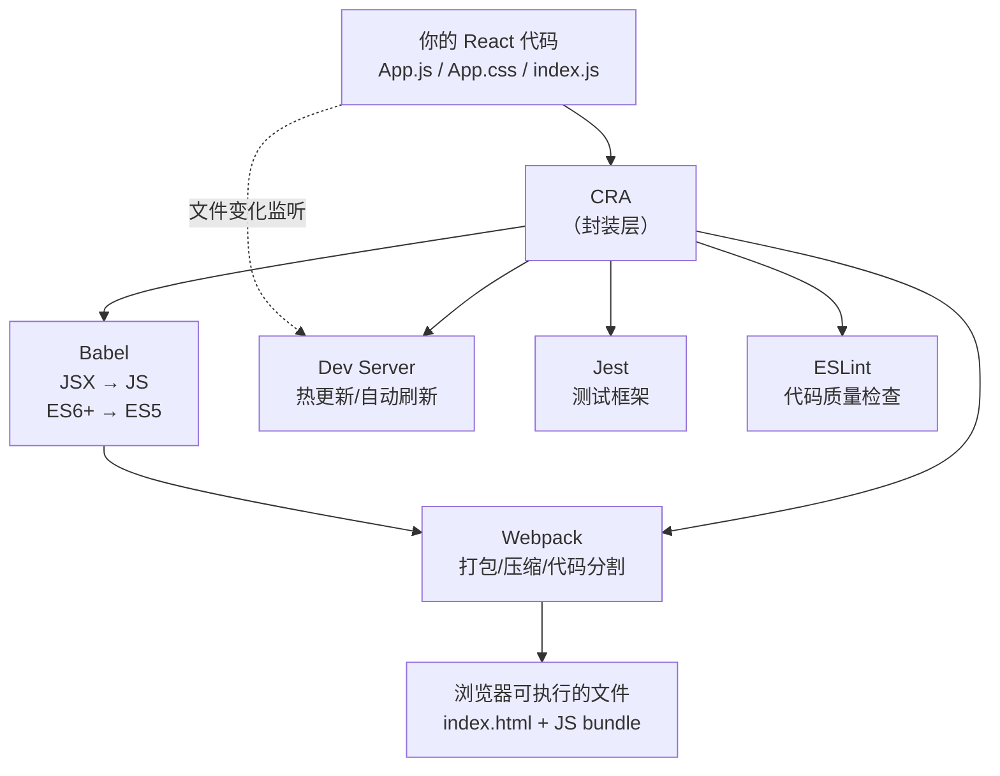
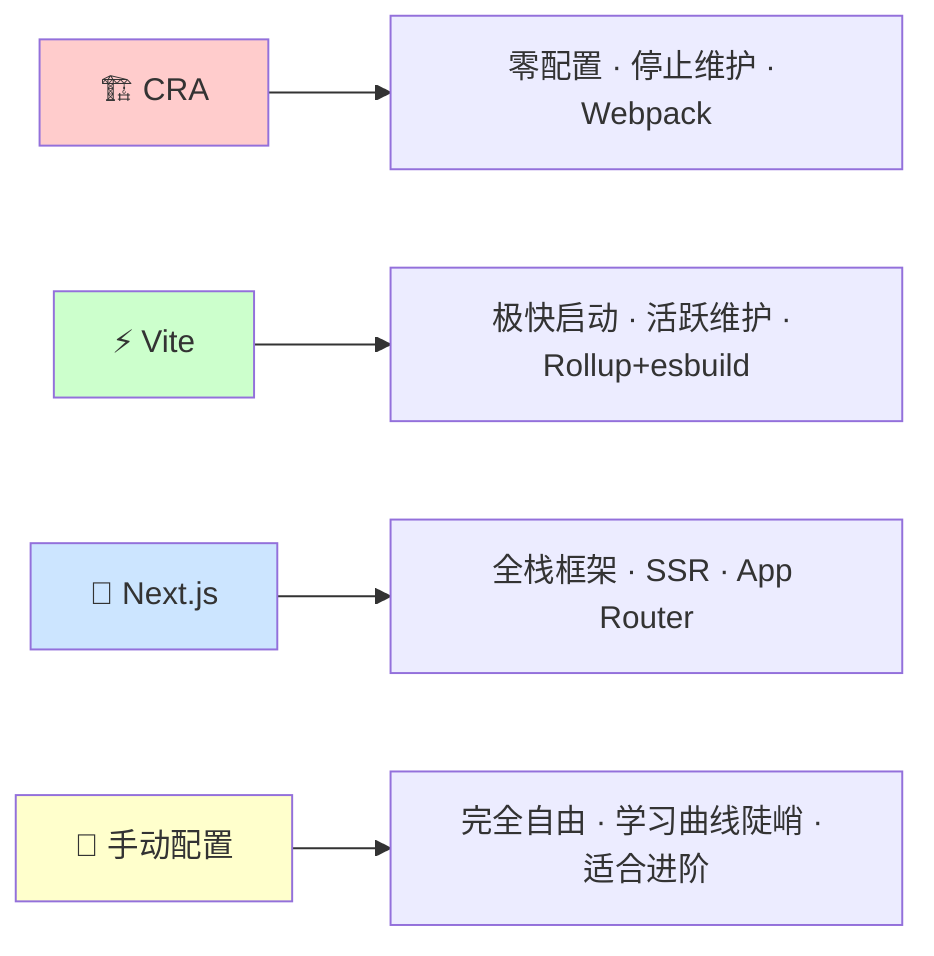

+++
title = "第1章 Create React App 是什么"
weight = 10
date = "2026-03-27T21:04:00+08:00"
type = "docs"
description = ""
isCJKLanguage = true
draft = false
+++

# 第 1 章　Create React App 是什么？

## 1.1 背景与诞生原因

### 🏛️ 一段不得不说的历史

话说很久很久以前——准确地说，是 2013 年——Facebook（现在叫 Meta，但很多人还是习惯叫它 Facebook）开源了一个叫做 **React** 的前端框架。

当时，前端开发者们的心情是复杂的。一方面，React 的组件化思想和虚拟 DOM（Virtual DOM，Virtual Document Object Model，即用 JavaScript 对象来模拟真实 DOM 树的一种方式，React 用它来实现高效的页面更新）让人眼前一亮；另一方面，写 React 代码一时爽，配置火葬场——你需要自己搞定 **Webpack**（一个打包工具，把你的代码、图片、CSS 等资源「打包」成浏览器能认识的文件）、**Babel**（一个转译器，把你写的新潮语法（ES6+/ES2024+、JSX、TypeScript、Flow 等）转换成所有浏览器都能运行的兼容版本，比如把 `const` 转成 `var`，把 JSX 转成普通的 JavaScript 函数调用）、**Dev Server**（开发服务器，让你修改代码后浏览器自动刷新看到效果）等等一大串工具。

每一个工具都有自己独特的配置文件格式，每一种格式都有自己独特的坑。Webpack 有 `webpack.config.js`，Babel 有 `.babelrc`，ESLint 有 `.eslintrc`……配置完这些，一个周末过去了，你的 React 项目还没写一行代码，心情如下：

```
周一：装个 React 试试
周二：配置 Webpack
周三：配置 Babel，顺便查了一堆文档
周四：Webpack 报错了，修了一下午
周五：算了，不学了
```

Facebook 的工程师们自己也受不了了。2016 年，他们一拍桌子：「既然是我们自己出的框架，我们来给大家写一个零配置的脚手架吧！」于是 **Create React App**（以下简称 CRA）横空出世。

> **🤔 等等，「脚手架」是什么？**
>
> 脚手架（Scaffolding）这个词最早来自建筑业——盖楼之前先搭的临时架子，方便工人上下左右施工。在软件开发里，「脚手架工具」指的是：**帮你把项目骨架先搭好，让你直接开始写业务代码的工具**。CRA 就是这样一种工具，它帮你配置好了 Webpack、Babel、Dev Server 等，你只需要 `npx create-react-app my-app`，然后 `cd my-app && npm start`，就能看到效果了。

### 📊 CRA 的版本演变

| 版本 | 发布时间 | 大事记 |
|------|----------|--------|
| CRA v1 | 2016 年 | 婴儿期，一切从零开始 |
| CRA v2 | 2018 年 | 支持 Webpack 4、Sass、React.memo |
| CRA v3 | 2019 年 | 支持 TypeScript、Browserslist、React 16.8+ Hooks |
| CRA v4 | 2020 年 | 支持 Webpack 5、Crash Reports |
| CRA v5 | 2021 年 | 支持 React 18、Node 14+ |
| **停止维护** | **2026 年** | **官方宣布废弃，推荐迁移到 Vite** |

可以看到，CRA 经历过自己的黄金时代，但 2026 年官方宣布停止维护，这不是一个秘密。后面章节会详细说这个，现在先记住这个结论就好。

---

## 1.2 CRA 的本质：封装了 Webpack + Babel + Dev Server 的零配置脚手架

### 🎁 什么是「零配置」？

「零配置」是 CRA 最响亮的口号，但很多人第一次听到这个词的时候，心里会冒出一个巨大的问号：**零配置？那我岂不是什么都控制不了？**

别急，让我来翻译一下 CRA 的「零配置」到底是什么意思。

CRA 并不是说「你的项目不需要任何配置」，而是说「**开箱即用的默认配置已经足够好了，你不需要从零写 Webpack 和 Babel 的配置**」。就像你买了一个乐高玩具，盒子里有详细的拼装说明书，你知道每个零件该插在哪。CRA 就是那个说明书，而 Webpack、Babel、Dev Server 就是那些零件。

来看一张图，直观理解 CRA 在整个前端工程化体系中的位置：



怎么样，是不是清晰多了？CRA 就站在你的代码和这些底层工具之间，把复杂的配置藏起来，只给你一个简单干净的界面。

### 🔧 Webpack 是什么？

**Webpack** 是一个模块打包器（Module Bundler）。你可以把它想象成一个超级能干的工厂流水线：

- **原料**：`App.js`、`Button.js`、`style.css`、图片、字体……一切都是原料
- **流水线**：Webpack 把这些原料分类、压缩、优化、合并
- **成品**：`bundle.js`——一个或几个精简的、浏览器能直接运行的文件

没有 Webpack，你的浏览器不知道该怎么把分散的 `.js` 文件串联起来。有了 Webpack，它帮你搞定一切。

> **📦 bundle 是什么？**
>
> bundle（包）是 Webpack 打包后的产物。举个例子，你写了 10 个 `.js` 文件，Web浏览器想加载它们需要发 10 次网络请求，这很慢。Webpack 把它们「粘」在一起，变成 1 个或 2-3 个文件，网络请求少了很多，速度自然就快了。这个「粘在一起」的动作就叫 bundling，产物就是 bundle。

### 🔄 Babel 是什么？

**Babel** 是一个 JavaScript 编译器（嗯，它的名字来源于巴别塔，传说中人类联合起来想建一座通往天堂的高塔，上帝一怒之下让人类说不同语言，彼此无法沟通，高塔就烂尾了——Babel 团队用这个名字，寓意「让不同语言/版本之间能够沟通」）。

它做的事情很直接：把你写的**新潮 JavaScript**（比如 JSX 语法、ES2024 的 `?.` 可选链、`async/await` 等）转换成**所有浏览器都能认的老 JavaScript**。

看一个简单的例子：

你写的代码：
```javascript
// 这是一个箭头函数，ES6 语法
const greet = (name) => `Hello, ${name}!`;
```

Babel 转换后就变成了：
```javascript
// 转换成了所有浏览器都能理解的 ES5 语法
var greet = function(name) {
  return "Hello, " + name + "!";
};
```

> **JSX 是什么？**
>
> JSX 是一种看起来像 HTML 的 JavaScript 语法扩展，是 React 的招牌写法。比如 `const element = <h1>Hello, world!</h1>;`，这行代码看起来像 HTML，但它其实是 JavaScript。JSX 不是合法的 JavaScript，需要 Babel 转译成 `React.createElement()` 函数调用才能在浏览器中运行：
>
> ```javascript
> const element = <h1>Hello, world!</h1>; // → React.createElement('h1', null, 'Hello, world!')
> ```

### 🖥️ Dev Server 是什么？

**Dev Server**（开发服务器）是一个本地的小型 HTTP 服务器，专门为开发过程服务。它的核心功能是：

- 监听你的代码变化，自动重新打包，然后**自动刷新浏览器**，让你立刻看到效果
- 提供热模块替换（Hot Module Replacement，简称 HMR），做到页面局部更新而不整体刷新，体验更丝滑
- 模拟真实的服务器环境，方便调试

没有 Dev Server，你改一行代码，就要手动刷新一次浏览器——改 100 行，就是 100 次刷新。有了 Dev Server，一切都是自动的。

---

## 1.3 CRA 与其他构建工具的对比（Vite / Next.js / 手动配置）

### 🏆 没有最好，只有最合适

买鞋子的故事我们都懂：篮球运动员不穿高跟鞋，短跑运动员不穿登山靴。同样，前端构建工具没有绝对的好坏，只有「此时此刻谁更合适」。

先看一张总览图：



### CRA vs. Vite：前者已老，后者正当红

| 对比项 | CRA | Vite |
|--------|-----|------|
| **底层技术** | Webpack（打包式） | Rollup + esbuild（原生 ESM） |
| **启动速度** | 慢（要先把所有文件打包一遍） | 极快（按需编译，用到哪个编译哪个） |
| **热更新（HMR）** | 较慢 | 极快，几乎无延迟 |
| **生产构建速度** | 较慢 | 快 |
| **维护状态** | ❌ 已废弃（2026） | ✅ 活跃 |
| **社区生态** | 逐渐萎缩 | 如日中天 |
| **学习曲线** | 低 | 低 |
| **适合场景** | 学习概念 / 维护老项目 | **新项目首选** |

**Vite** 为什么这么快？打个比方：

> CRA 就像你要去餐厅吃饭，CRA 先让厨房把**所有菜**都做好、装盘，然后服务员才端上来给你——你等得花儿都谢了。
>
> Vite 则像点餐制，你点什么，厨房做**什么**，第一道菜上来得很快。Vite 利用了浏览器原生支持的 **ES Modules**（ESM）技术，不需要先把所有代码打包好，而是让浏览器按需请求模块，按需编译。

**结论**：如果你现在要开始一个新 React 项目，**强烈建议用 Vite** 而不是 CRA。但 CRA 的学习价值依然存在，因为它的概念（目录结构、命令、环境变量等）在 Vite 中是相通的。

### CRA vs. Next.js：两个不同的赛道

| 对比项 | CRA | Next.js |
|--------|-----|---------|
| **定位** | 纯前端脚手架 | 全栈框架 |
| **服务端渲染（SSR）** | ❌ 不支持 | ✅ 原生支持 |
| **SEO 优化** | ❌ 差（单页应用不利于搜索引擎） | ✅ 优秀（服务端直出 HTML） |
| **路由系统** | 需额外装 React Router | 内置文件系统路由 |
| **API Routes** | ❌ 没有 | ✅ 可以写后端接口 |
| **学习曲线** | 低 | 中等 |
| **适用场景** | 管理后台、内部工具、学习 React | 面向用户的网站、博客、电商、内容平台 |

> **📄 SSR（Server-Side Rendering，服务端渲染）是什么？**
>
> 普通的前端渲染（CSR，Client-Side Rendering）是：浏览器先下载一个空的 HTML，然后下载 JavaScript，JavaScript 执行后才生成页面内容。这个过程搜索引擎的爬虫可能抓不到内容（因为它拿到的是空 HTML），不利于 SEO。
>
> SSR 则是：服务器先把页面内容渲染好，再发送给浏览器。浏览器拿到的是有内容的完整 HTML，搜索引擎爬虫能顺利抓取，对 SEO 非常友好。

### CRA vs. 手动配置：省心 vs. 完美控制

自己配置 Webpack + Babel，就像是自己组装电脑：

- **优点**：每个零件都可以自己选，配置可以完全定制，性能可以压榨到极致
- **缺点**：需要深入了解每个零件（Webpack  loader、Plugin、Babel Preset……），配置过程繁琐，容易踩坑

CRA 就像买品牌机，配置好了，但你想换显卡（换个 Webpack Plugin）就麻烦（需要 eject）。

**结论**：学习阶段用 CRA，真正需要完全控制时再手动配置。在此之前，了解 CRA 的工作原理会给你打下坚实的基础。

---

## 1.4 CRA 的核心功能一览

### 🎯 CRA 到底帮你干了哪些事？

简单来说，CRA 是一个「打包好了的工具箱」，里面有这些神器：

#### 1️⃣ 一键创建项目

```bash
npx create-react-app my-app
```

等几分钟（取决于网速），一个完整的 React 项目就出现在你面前了。这就是 CRA 最核心的价值——**让你 0 门槛进入 React 世界**。

#### 2️⃣ 开发服务器（npm start）

```bash
cd my-app
npm start
# → 监听 http://localhost:3000
```

启动后访问 `http://localhost:3000`，代码改了浏览器自动刷新，跨域问题也不用担心（因为 Dev Server 自带代理功能，帮你把 API 请求转发到目标服务器，从而绕开浏览器跨域限制）。

#### 3️⃣ 热模块替换（HMR）


传统的「自动刷新」是整个页面重新加载，如果你在表单里输入了一半的内容，啪一下刷新没了。HMR 则只更新变化的模块，页面状态尽量保留，体验好很多。

#### 4️⃣ 生产构建（npm run build）

```bash
npm run build
```

把代码压缩（Minification）、优化（Tree Shaking，删除没用的代码）、分割（Code Splitting，按需加载），输出到 `build/` 目录。这个目录里的文件可以直接扔到任何静态服务器上。

#### 5️⃣ Jest 测试框架

```bash
npm test
```

内置了 **Jest**——Facebook 自家的测试框架，写测试用例变得非常简单。React 社区主流的测试工具有两个：Jest + React Testing Library，CRA 把它们打包在一起了。

> **🧪 Tree Shaking 是什么？**
>
> 打个比方：你买了一个超大的零食礼包，但里面只有一半是你喜欢吃的。Tree Shaking 的作用就是把你不吃的那些零食挑出来扔掉，只留下你需要的。在代码层面，Webpack 通过静态分析（import/export 语句），找出哪些代码从来没被用到，就不把它打进最终的 bundle 里，从而减少文件体积。

#### 6️⃣ ESLint 代码检查

每次 `npm start` 的时候，CRA 都会用 **ESLint** 扫描你的代码，找出问题代码并给出警告或错误提示。比如你写了 `const a = 1; a = 2;`（给 const 变量重新赋值），ESLint 会立刻报错：你想谋杀 const 吗？

#### 7️⃣ 环境变量支持

```bash
# .env.development 文件
REACT_APP_API_URL=http://localhost:8080
REACT_APP_VERSION=1.0.0
```

一行配置，换个文件就切换环境，不用改代码。

#### 8️⃣ Sass/SCSS 原生支持

```bash
npm install sass
```

装一个 `sass` 包，立刻可以用 `.scss` 语法写样式了，不用改任何配置——CRA 已经在内部帮你配好了 sass-loader。

#### 9️⃣ TypeScript 支持

```bash
npx create-react-app my-app --template typescript
```

直接创建带 TypeScript 的项目，所有类型检查开箱即用。

---

### 📋 CRA 核心功能总览表

| 功能 | 对应命令 | 说明 |
|------|----------|------|
| 创建项目 | `npx create-react-app` | 一键生成完整项目结构 |
| 开发服务器 | `npm start` | 本地预览，热更新 |
| 生产构建 | `npm run build` | 优化打包，输出到 `build/` |
| 运行测试 | `npm test` | Jest + React Testing Library |
| 代码检查 | `npm start` 时自动运行 | ESLint 实时扫描 |
| 暴露配置 | `npm run eject` | **不可逆**，将所有 Webpack/Babel 配置解压到项目目录，完全可控但失去后续升级能力 |

---

## 本章小结

本章我们揭开了 Create React App 的神秘面纱：

- **诞生原因**：Facebook 为了解决「配置比写代码还难」的问题，让开发者专注于 React 本身
- **本质**：一个封装了 Webpack（打包）、Babel（转译）、Dev Server（热更新）、Jest（测试）、ESLint（代码检查）等工具的**零配置脚手架**
- **对比**：CRA 适合学习，但 Vite 是未来；Next.js 走的是另一个全栈赛道；手动配置适合进阶开发者
- **核心功能**：一键创建项目、热更新、生产构建、测试框架、代码检查、环境变量、Sass/SCSS、TypeScript，一个都不少

下一章我们将深入 CRA 的具体用途，看看它到底能在哪些场景下大显身手！

