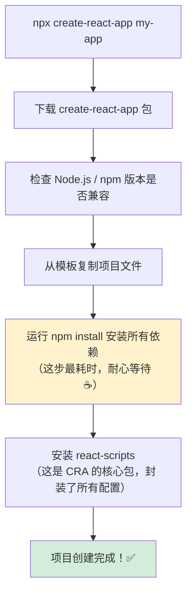
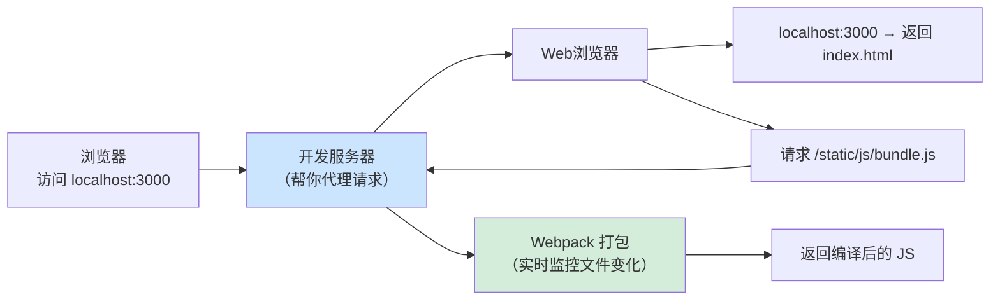
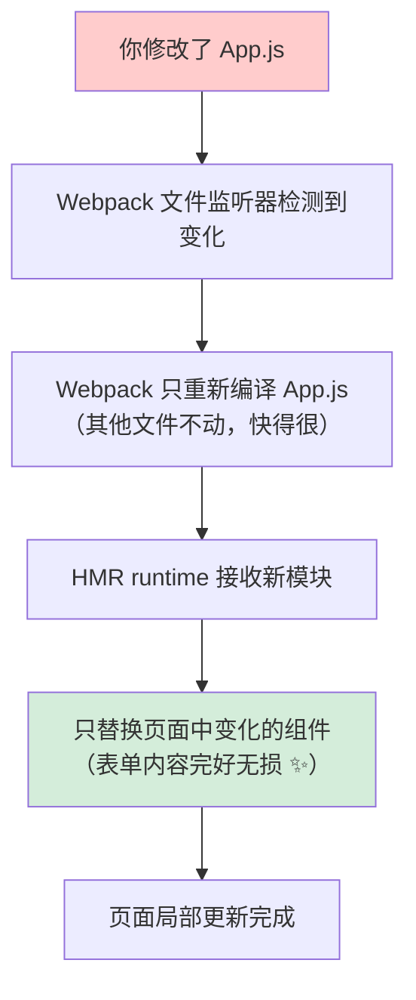
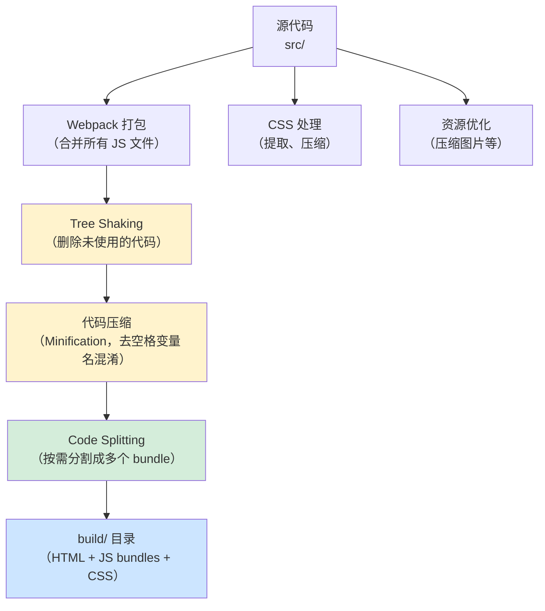
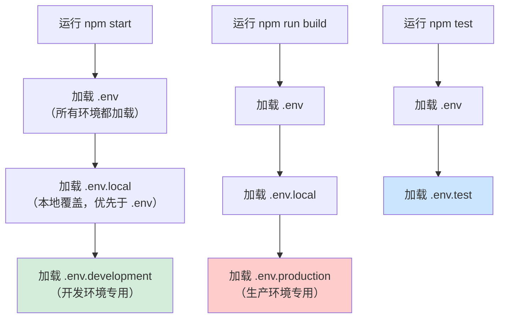

+++
title = "第2章 Create React App 有什么用"
weight = 20
date = "2026-03-27T21:04:00+08:00"
type = "docs"
description = ""
isCJKLanguage = true
draft = false
+++

# 第 2 章　Create React App 有什么用？

## 2.1 快速初始化 React 项目

### 🚀 你还在一条一条手动装依赖吗？

先来算一笔时间账。

没有 CRA 的时候，创建一个 React 项目是这样婶儿的：

```
第一步：mkdir my-react-app
第二步：npm init -y
第三步：npm install react react-dom
第四步：npm install --save-dev webpack webpack-cli webpack-dev-server babel-loader
第五步：npm install --save-dev @babel/core @babel/preset-env @babel/preset-react
第六步：npm install --save-dev css-loader style-loader html-webpack-plugin
第七步：创建 webpack.config.js
第八步：创建 .babelrc
第九步：创建 public/index.html
第十步：创建 src/index.js
第十一步：创建 src/App.js
第十二步：配置 package.json scripts
第十三步：npm start —— 哦豁，报错了
第十四步：修报错
第十五步：npm start —— 又有报错
……（循环往复）
```

等你把以上流程走完，你的咖啡已经凉透了，午饭时间到了，下午茶时间也到了，然后你发现——还没开始写一行真正有价值的 React 代码。

**CRA 登场：**

```bash
npx create-react-app my-app
cd my-app
npm start
```

**然后？然后你的浏览器自动打开了 `http://localhost:3000`，React 默认页面已经在那儿等着你了。**

这就是 CRA 最核心的价值——**把 100 步的准备工作压缩成 3 步，让你直接进入写代码的快乐时光**。

### 🎬 create-react-app 内部到底干了什么？

很多人好奇，`npx create-react-app my-app` 这一条命令背后到底发生了什么？让我来揭开它的神秘面纱：



整个过程最耗时的就是 `npm install` 这一步，因为 CRA 默认依赖非常多（粗略数一下，大概有几百个包）。这不是 CRA 的问题，这是 React 生态本身的复杂度决定的——就像你想做一盘番茄炒蛋，需要先买一个厨房、灶台、锅、铲子、油烟机……这些基础设施哪样都不能少。

> **⏰ 优化安装速度的技巧**
>
> 如果 npm install 慢得像蜗牛，可以尝试以下方法：
> ```bash
> # 方法1：使用淘宝镜像
> npm config set registry https://registry.npmmirror.com
> npx create-react-app my-app
>
> # 方法2：使用 yarn（有时候比 npm 快）
> npx create-react-app my-app --use-yarn
>
> # 方法3：使用 pnpm（安装 pnpm 后，用 pnpm 装依赖）
> npx create-react-app my-app
> cd my-app
> npm install -g pnpm
> pnpm install
> ```

### 📦 create-react-app 和 react-scripts 是什么关系？

很多人搞不清楚这两个东西的关系。简单说：

- **create-react-app**：一个一次性工具，只在你创建项目的时候用一次，用完就可以丢掉了（就像婚礼策划公司，婚礼办完了就不需要它了）
- **react-scripts**：真正的幕后大佬，它是你项目的「终身管家」，负责每次 `npm start`、`npm run build` 的实际执行工作

创建完项目之后，你的 `package.json` 里只有 `react-scripts`，没有 `create-react-app`——因为后者已经完成历史使命，光荣退休了。

```json
{
  "dependencies": {
    "react": "^18.2.0",
    "react-dom": "^18.2.0",
    "react-scripts": "5.0.1"  // ← 这个才是真正的核心
  }
}
```

---

## 2.2 内置开发服务器与热模块替换

### 🌡️ 开发服务器：你的代码和浏览器之间的桥梁

当你运行 `npm start`，CRA 会在本地启动一个开发服务器（Development Server）。这个服务器做了什么？用一张图来解释：



开发服务器实际上做了两件事：

1. **静态文件服务**：把你的 `public/` 和 `src/` 文件提供给浏览器访问
2. **转译服务**：用 Babel 把 JSX 和 ES6+ 代码转成浏览器能看懂的 JavaScript

### 🔥 热模块替换（Hot Module Replacement）：页面不刷新的秘密

热模块替换，英文全称 Hot Module Replacement，简称 **HMR**。这是 Webpack 提供的一个超级实用的功能，CRA 原生支持。

先说说什么是「不热」的替换：

> **没有 HMR 时**：你改了一个按钮的颜色，Webpack 重新打包，整个页面刷新，你正在填写的表单内容全部清空了。——这叫「全页面刷新」，体验很差。
>
> **有 HMR 时**：你改了一个按钮的颜色，Webpack 只重新打包那个变化的文件，浏览器只更新按钮那一小块区域，表单内容纹丝不动。——这叫「局部热更新」，体验飞起。

HMR 的工作原理，用大白话说是这样的：



HMR 是 CRA 内置的功能，不需要你额外做任何配置，开箱即用。它利用 Webpack 的 HMR 运行时机制工作——Webpack HMR runtime 通过 `module.hot` API 与模块系统交互，实现模块的替换与更新，而 CSS 文件的变化则由 `style-loader` 或 `MiniCssExtractPlugin` 捕获并通过更新 `<style>` 标签实现。无论改 JS 还是改 CSS，页面都不会刷新。

---

## 2.3 生产构建与代码优化（压缩、Tree Shaking、代码分割）

### 🏭 npm run build：把源代码变成生产级产品

当你准备把网站发布到线上时，`npm run build` 就是你的将军。这个命令会把「源代码」变成「生产级产品」——就像原材料送进工厂流水线，出来的是精美包装的成品。

来看看 `npm run build` 做了哪些事：



### 🗜️ 压缩（Minification）：给你的代码「减肥」

源代码是给人看的，有缩进、有注释、有有意义的变量名，比如：

```javascript
// 这是源代码
const calculateTotal = (price, quantity) => {
  // 计算总价
  const total = price * quantity;
  return total;
};

const orderTotal = calculateTotal(99.9, 3);
console.log("订单总价是:", orderTotal);  // 输出：订单总价是: 299.7
```

压缩之后，变成：

```javascript
// 这是压缩后的代码（丑得亲妈都不认识，但是文件体积小了 70%）
var c = (e, t) => e * t;
var o = c(99.9, 3);
console.log(o);  // 输出：299.7
```

变量名被缩短，注释和空格被删除，所有多余的字符都被清理掉。Webpack 在生产构建时会自动做这件事，用的是 **Terser** 压缩工具。

### 🌳 Tree Shaking：把没用的代码「摇掉」

Tree Shaking 直译过来是「摇树」，这个比喻很形象——摇晃一棵树，没用的枯叶就会掉下来。

在代码世界里，Tree Shaking 是 Webpack 通过静态分析 `import` 和 `export` 语句，找出那些**被 `import` 了但在代码中从未被使用过的导出**，然后在打包时把它们剔除。

举个例子：

```javascript
// math.js
export const add = (a, b) => a + b;
export const subtract = (a, b) => a - b;
export const multiply = (a, b) => a * b;  // ← 你没用到这货
```

```javascript
// 只引入了 add
import { add } from './math';

const result = add(1, 2);
console.log(result);  // 输出：3
```

Tree Shaking 会发现 `subtract` 和 `multiply` 从来没被用过，于是把它们从最终的 bundle 里剔除。**你的 bundle 体积又小了一圈！**

> **⚠️ Tree Shaking 的前提条件**
>
> Tree Shaking 能工作的前提是你的代码使用了 ES Module 语法（`import`/`export`），而不是 CommonJS 语法（`require`/`module.exports`）。CRA 默认使用 ES Module，所以不用担心——你只需要记得用 `import` 就对了。

### 📦 代码分割（Code Splitting）：把大文件拆成小文件

你有没有遇到过这种情况：网站打开后，浏览器下载了一个 5MB 的 JS 文件，加载了整整 10 秒——用户已经关闭页面了。

代码分割就是为了解决这个问题。**不要把所有的代码都塞进一个文件，而是按需加载。**

比如你的应用有「首页」和「用户后台」两个页面，用户打开首页时，只需要加载首页相关的代码，用户后台的代码等用户点进去了再加载。

CRA 默认支持两种代码分割方式：

```javascript
// 方式1：React.lazy + Suspense（最推荐的方式）
// 只有当用户访问这个组件时，才会加载这个 JS 文件
const UserDashboard = React.lazy(() => import('./UserDashboard'));

function App() {
  return (
    <Suspense fallback={<div>加载中...</div>}>
      <UserDashboard />
    </Suspense>
  );
}

// 方式2：React.lazy + import() 动态导入
// import() 是 ES2020 的动态导入语法，返回一个 Promise
const Profile = React.lazy(() => import('./Profile'));
```

---

## 2.4 内置 Jest 测试框架

### 🧪 为什么 React 项目需要测试？

写测试和不写测试，区别在哪里？

> **不写测试**：代码改了一个地方，不知道哪里会不会崩，凭经验和运气，有时候在生产环境才发现 bug，那时候可能已经有 10 万用户在使用你的应用了……
>
> **写测试**：改完代码，运行测试，5 秒后告诉你「3 个测试失败了」，哪里有问题一目了然，心里有底。

测试就是你的**代码保镖**，永远在背后默默守护你。

### 🎯 Jest 是什么？

**Jest** 是 Facebook（又是 Facebook）出品的 JavaScript 测试框架，和 React 是同一个爸爸。Jest 有以下几个特点：

- **零配置**（对，又是零配置！）：CRA 里已经配好了，你只需要写测试代码就行
- **运行速度快**：Jest 有智能的测试运行策略，没变的文件不重复跑
- **内置断言库**：不需要额外安装断言库，Jest 自带 `expect` API
- **快照测试（Snapshot Testing）**：专门对付 UI 组件的测试

### 📝 一个简单的测试长什么样？

CRA 已经在 `src/App.test.js` 里给你写了一个示例：

```javascript
// src/App.test.js
import { render } from '@testing-library/react';
import App from './App';

// describe 把测试用例分组
describe('App 组件测试', () => {
  // it 或 test 是同一个东西，都是定义一个测试用例
  it('renders without crashing', () => {
    // render() 把组件渲染成虚拟 DOM
    // getByText 查找文本内容
    const { getByText } = render(<App />);
    const linkElement = getByText(/learn react/i);
    
    // expect 断言：期望这个元素在文档中
    expect(linkElement).toBeInTheDocument();
    // 输出：✓ renders without crashing
  });
});
```

运行测试：

```bash
npm test
# 输出：
#  PASS  src/App.test.js
#  ✓ renders without crashing (52ms)
```

> **🔍 @testing-library/react 是什么？**
>
> `@testing-library/react` 是一个测试工具库，它的核心思想是：**测试应该像真实用户一样使用你的应用**，而不是去测组件的内部实现（比如某个 state 等于多少）。它的查询 API 如 `getByText`、`getByRole`、`getByLabelText` 都是模拟用户行为设计的，非常贴近真实使用场景。

### 🏃 Jest 的运行策略

```mermaid
flowchart TD
    A["npm test"] --> B["Jest 发现所有 .test.js 文件"]
    B --> C{"文件有没有变化？"}
    C -->|"第一次运行"| D["运行所有测试"]
    C -->|"非第一次运行"| E["只运行变化文件的测试"]
    E --> F["watch mode 监听变化"]
    F --> G{"文件变化了？"}
    G -->|"是"--> E
    G -->|"退出 watch mode"| H["测试结束"]
    D --> H
```

当你运行 `npm test` 时，Jest 默认会进入 **watch mode**——它会一直盯着文件系统的变化。如果你在另一个终端改了代码，Jest 会自动重新运行受影响的测试。输入 `q` 可以退出 watch mode。

---

## 2.5 内置 ESLint 代码检查

### 🔍 ESLint 是什么？

**ESLint** 是一个 JavaScript 代码质量检查工具。它的工作是：**在你写代码的时候，就告诉你哪里有问题，而不是等到运行时才发现。**

打个比方：

- **ESLint = 你的代码交警**：闯红灯（写错语法）、逆行（写出错逻辑）、非法改装（违反规范）都会被当场拦下
- **没有 ESLint = 无证驾驶**：问题只有到了线上（交通事故现场）才会被发现

### 🎨 CRA 中的 ESLint 规则

CRA 预置了一套开箱即用的 ESLint 配置，基于 `eslint-config-react-app`，覆盖了以下规则：

```javascript
// 常见的 ESLint 规则示例（你的 .eslintrc.js 里不用配置，CRA 已经内置了）

// 1. 禁止使用 var，必须用 const 或 let
// const x = 1;  ✓
// var y = 2;    ✗ ESLint: Unexpected var, use let or const.

// 2. 禁止使用未使用的变量
// const unused = 'hello';  ✗ ESLint: 'unused' is defined but never used.

// 3. 禁止在 render 中调用 setState（会导致无限循环）
// render() { this.setState({}); }  ✗ ESLint: Do not set state in render.

// 4. 强制使用 prop-types 或 TypeScript 定义组件 props 类型
// function Button({ label }) {  ✗ ESLint: 'label' is missing in props validation
//   return <button>{label}</button>;
// }

// 5. 推荐使用箭头函数
// const fn = function() {};  ✗ ESLint: Prefer arrow function.
// const fn = () => {};        ✓
```

这些规则在你每次 `npm start` 时自动运行，发现问题会在终端显示黄色或红色的报错，还会告诉你具体的文件名和行号。

### 💡 ESLint 在 VS Code 中的实时提示

除了终端里的报错，你还可以在 VS Code 里安装 ESLint 插件，让编辑器**实时显示红色波浪线**——就像 Word 的拼写检查一样，你还没运行代码，问题就已经标出来了。

安装方法：在 VS Code 扩展商店搜索「ESLint」，点击安装即可。

---

## 2.6 支持 Sass/SCSS、TypeScript 等扩展

### 🎨 Sass/SCSS：让 CSS 变得更聪明

**Sass**（Syntactically Awesome Style Sheets，语法超棒的样式表）是一种 CSS 预处理器。它让 CSS 支持了变量、嵌套、混合器（Mixin）、继承等编程语言才有的特性，写起样式来效率翻倍。

CRA 原生支持 Sass，不需要你配置任何东西，只需要：

```bash
npm install sass
# 安装完成后，直接在 src/ 中创建 .scss 文件
```

然后在组件中引用：

```scss
// src/styles/button.scss

// 变量：颜色统一管理
$primary-color: #61dafb;
$border-radius: 8px;

// 嵌套：再也不用重复写选择器
.button {
  background-color: $primary-color;
  border-radius: $border-radius;
  padding: 10px 20px;
  
  // 嵌套的选择器
  &:hover {
    background-color: darken($primary-color, 10%); // hover 时颜色加深 10%
  }
  
  &--primary {
    background-color: $primary-color;
  }
  
  &--danger {
    background-color: #ff4444;
  }
}

// 混合器：可复用的样式块
@mixin flex-center {
  display: flex;
  justify-content: center;
  align-items: center;
}

.container {
  @include flex-center;  // 一行代码复用 flex 居中样式
}
```

```javascript
// 组件中引用 SCSS 文件，和引用普通 CSS 文件一样简单
import './styles/button.scss';

function Button() {
  return <button className="button button--primary">点我</button>;
}
```

> **SCSS vs. Sass 是什么关系？**
>
> Sass 最初有两种语法：
> - **Sass**（缩进语法）：不用大括号，用缩进来表示层级
> - **SCSS**（Sassy CSS）：和普通 CSS 一样用大括号，兼容纯 CSS 语法
>
> 现在 SCSS 几乎是 Sass 的代名词了，所以 CRA 文档里写的是 Sass/SCSS，你知道是同一个东西就好了。

### 🔷 TypeScript：给你的 JavaScript 加上「类型安全护盾」

**TypeScript** 是 JavaScript 的超集——你可以理解为 JavaScript 加上了「类型注解」和「编译检查」功能。用 TypeScript 写的代码，最终会编译成纯 JavaScript 再运行。

TypeScript 能做什么？举个例子：

```typescript
// JavaScript（会出问题）
function add(a, b) {
  return a + b;
}

add(1, 'hello');  // 返回 "1hello" —— 数字和字符串相加，JavaScript 不会报错
```

```typescript
// TypeScript（编译阶段就报错）
function add(a: number, b: number): number {
  return a + b;
}

add(1, 'hello');  // 编译错误：Argument of type 'string' is not assignable to parameter of type 'number'.
                   // TS 编译器：你在逗我？数字和字符串能相加吗？
```

创建 TypeScript 版本的 CRA 项目：

```bash
npx create-react-app my-app --template typescript
```

CRA 会自动帮你配置好 `tsconfig.json`（TypeScript 配置文件）和所有的类型支持，不需要你手动配置任何东西。

---

## 2.7 环境变量管理

### 🌿 环境变量：让你的代码「见风使舵」

**环境变量**（Environment Variable）是一种在不同运行环境下，让代码自动读取不同配置值的机制。

举个例子：你的应用在开发环境和生产环境下，API 地址是不同的：

```
开发环境 API：http://localhost:8080/api
生产环境 API：https://api.example.com/api
```

没有环境变量的话，你要么每次上线前手动改代码里的 API 地址（累死），要么写一堆 if/else 判断（丑死）。

有了环境变量，一条配置搞定：

```bash
# .env.development
REACT_APP_API_URL=http://localhost:8080/api

# .env.production
REACT_APP_API_URL=https://api.example.com/api
```

```javascript
// 代码中读取（不需要改）
const apiUrl = process.env.REACT_APP_API_URL;
console.log(apiUrl); // 开发环境输出：http://localhost:8080/api（生产环境输出：https://api.example.com/api）
```

### 📁 CRA 环境变量文件类型

CRA 支持多种 `.env` 文件，Webpack 会根据当前环境自动加载对应的文件：



加载优先级（后面的覆盖前面的）：

```
.env
  ↓
.env.local
  ↓
.env.[mode]  （development / production / test）
```

> **⚠️ 命名规范：必须以 REACT_APP_ 开头**
>
> 这是 CRA 的强制规则。只有以 `REACT_APP_` 开头的环境变量才会被注入到 `process.env` 中。以下是错误示范：
> ```bash
> MY_VAR=123        # 错误！不会被注入
> API_URL=...       # 错误！不会被注入
> REACT_APP_KEY=xxx # 正确 ✅
> REACT_APP_API_KEY=xxx # 正确 ✅
> ```

---

## 本章小结

本章我们详细探索了 CRA 的各项强大功能：

- **快速初始化**：一条命令取代几十步手动配置，直接进入写代码状态
- **开发服务器**：本地 HTTP 服务器 + Babel 转译，让浏览器认识你的代码
- **热模块替换（HMR）**：改代码不刷新页面，表单不丢，体验丝滑
- **生产构建**：压缩（Minification）+ Tree Shaking + 代码分割，把 bundle 体积压到最小，把性能拉到最高
- **Jest 测试**：零配置测试框架，内置快照测试，测试覆盖率一目了然
- **ESLint**：代码交警，实时检查语法和规范，把问题扼杀在摇篮里
- **Sass/SCSS + TypeScript**：开箱即用的扩展支持，想用就用，不额外配置
- **环境变量**：一套代码多环境运行，`REACT_APP_` 前缀是命名的金科玉律

CRA 把前端工程化中几乎所有让人头疼的配置都替你搞定了。这，就是「让开发者专注于写代码」这句话的真正含义。

下一章，我们将真正开始动手，学习怎么用 CRA 创建和运行项目——这才是你期待已久的实操环节！

