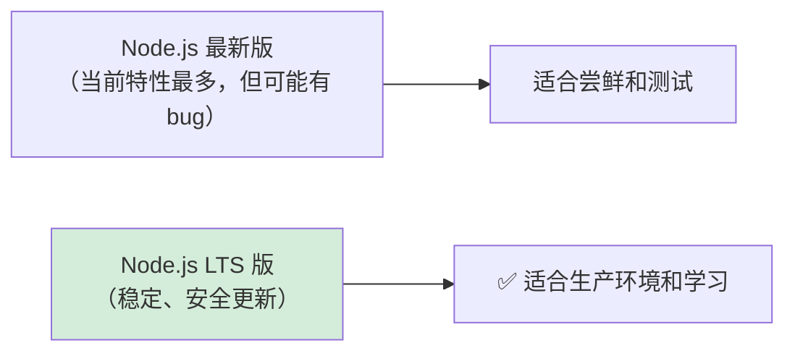
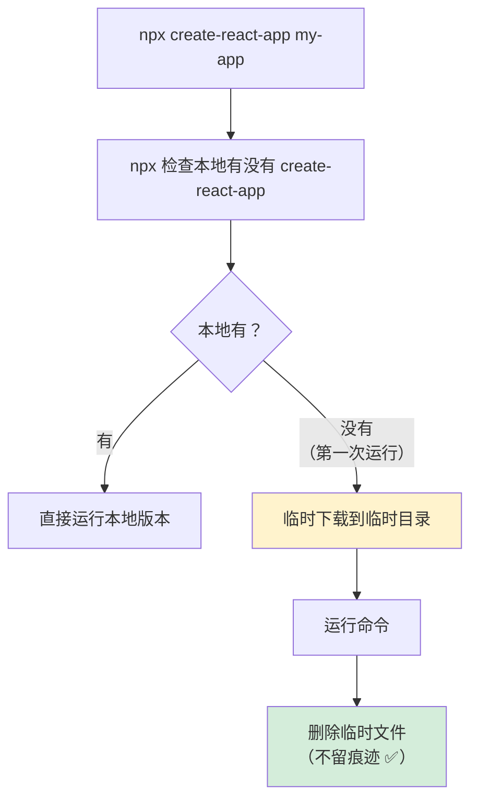
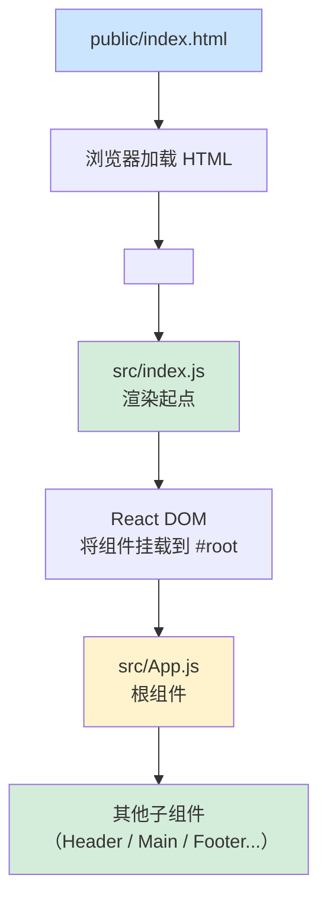
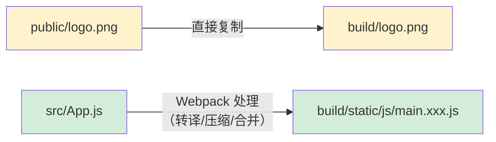
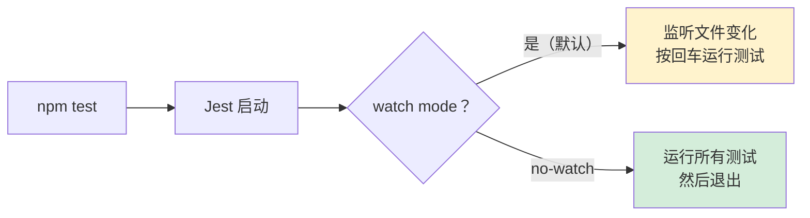
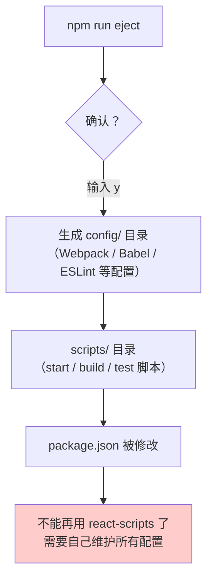

+++
title = "第3章 Create React App 怎么用"
weight = 30
date = "2026-03-27T21:04:00+08:00"
type = "docs"
description = ""
isCJKLanguage = true
draft = false
+++

# 第 3 章　Create React App 怎么用？

## 3.1 环境准备

### 🛠️ 在开始之前：你需要准备好这些工具

想象一下，你要学做饭，你不能对着一堆原材料发呆，你需要灶台、锅、铲子。在 CRA 的世界里，**Node.js 就是你的灶台，npm 就是你的锅**。

没有这两样东西，你什么都做不了。所以让我们先把基础设施搞定。

### 3.1.1 安装 Node.js（LTS 版本）

#### 什么是 Node.js？

**Node.js** 是什么？简单说，就是**让 JavaScript 脱离浏览器运行的运行环境**。

正常情况下，JavaScript 只能在浏览器里跑（比如 Chrome 浏览器里）。Node.js 做了一个很厉害的事情：把 Chrome 浏览器的 JavaScript 引擎（叫 V8）挖出来，做成了一个独立的环境，让 JavaScript 可以在服务器上、你的电脑本地跑起来。

有了 Node.js，你就可以：

- 在命令行里运行 JavaScript（就像运行 Python 或 Ruby 一样）
- 使用 npm / yarn / pnpm 来安装和管理各种包
- 运行 Webpack、Babel 等前端构建工具

#### 什么是 LTS 版本？

**LTS** 是 Long Term Support（长期支持版）的缩写。Node.js 有两个版本线：



**强烈建议安装 LTS 版本**，因为它经过了更充分的测试，更稳定。奇数版本（如 19、21）是非 LTS 版，偶数版本（如 18、20、22）是 LTS 版。

#### 怎么安装？

去官网下载安装包，一键安装：

```
https://nodejs.org/
```

打开网页，你会看到两个大按钮：

- **LTS 版本（推荐）**：稳定、安全、靠谱，选这个
- **Current 版本**：最新最潮，可能有未知 bug，勇士请便

点击 LTS 版本的安装包，下载 → 运行 → 一路 Next → 完成。

安装完成后，验证一下：

```bash
node --version  // 输出：v20.x.x（或其他 LTS 版本号）
npm --version   // 输出：10.x.x（或其他版本号）
```

如果两个命令都输出了版本号，恭喜你，安装成功！🎉

> **🔧 nvm：管理多个 Node.js 版本的神器**
>
> 如果你以后需要在不同项目中使用不同版本的 Node.js（比如项目 A 需要 Node 16，项目 B 需要 Node 20），推荐安装 **nvm**（Node Version Manager）。
>
> 不过对于初学者来说，先安装一个 LTS 版本就够了，不需要立刻折腾 nvm。等你以后有需求了再装也不迟。
>
> 安装 nvm 的方法（Windows 用户使用 nvm-windows，Mac/Linux 用户使用 nvm）：
> ```bash
> # Windows: 下载安装包 https://github.com/coreybutler/nvm-windows/releases
> # Mac/Linux:
> curl -o- https://raw.githubusercontent.com/nvm-sh/nvm/v0.39.0/install.sh | bash
> ```

### 3.1.2 npm / npx / yarn / pnpm 的选择

#### npm：Node.js 自带的包管理器

**npm**（Node Package Manager）是 Node.js 自带的包管理器，安装 Node.js 的时候它就自动跟着装好了。

它的作用很简单：**帮你安装、管理、卸载各种 JavaScript 包**。就像手机的应用商店，帮你下载和更新各种 App。

```bash
# npm 安装包的语法
npm install <package-name>          # 安装到 dependencies（生产依赖）
npm install <package-name> --save-dev  # 安装到 devDependencies（开发依赖）
npm install <package-name> -g      # 全局安装（命令行工具用这个）
```

#### npx：npm 的好搭档，专门运行一次性命令

**npx** 是 npm 5.2.0 开始自带的一个工具，它是专门用来**运行一次性命令**的。

CRA 创建项目的命令就是 `npx create-react-app`：

```bash
npx create-react-app my-app
# 等价于：先临时下载 create-react-app，再用它执行创建命令
```

npx 的工作流程是这样的：



**npx 的好处**：不需要全局安装，用完就走，不污染你的全局包环境。

#### yarn：Facebook 出品的另一个包管理器

**yarn** 是 Facebook（又是它）在 2016 年推出的包管理器，最初是为了解决 npm 的一些速度和安全问题。

```bash
# 安装 yarn（如果你想用它的话）
npm install -g yarn

# 用 yarn 创建 CRA 项目
npx create-react-app my-app --use-yarn
```

```bash
# yarn vs npm 常用命令对比
npm install          # npm 安装
yarn                 # yarn 安装（更短，更优雅）

npm install lodash   # npm 安装到 dependencies
yarn add lodash      # yarn 安装到 dependencies

npm install --save-dev jest   # npm 开发依赖
yarn add --dev jest           # yarn 开发依赖

npm uninstall lodash          # npm 卸载
yarn remove lodash            # yarn 卸载
```

yarn 的优点：安装速度快、有 lockfile（锁定版本号，防止不同机器版本不一致）、界面更友好。

#### pnpm：最快的新秀

**pnpm** 是近年来崛起的新星，它的核心特点是：**速度快、磁盘占用少**。

为什么快？因为 pnpm 使用了硬链接（Hard Link）和符号链接（Symlink）的黑科技，不会重复下载相同的包。

```bash
# 安装 pnpm
npm install -g pnpm

# 用 pnpm 创建 CRA 项目
npx create-react-app my-app --use-pnpm
```

```bash
# pnpm 常用命令
pnpm install           # 安装
pnpm add lodash       # 添加到 dependencies
pnpm add -D jest      # 添加到 devDependencies
pnpm remove lodash    # 卸载
```

#### 该选哪个？

| 工具 | 推荐指数 | 适用场景 |
|------|----------|----------|
| npm | ⭐⭐⭐⭐ | 默认选择，Node.js 自带，够用 |
| yarn | ⭐⭐⭐⭐ | npm 慢的时候可以用，社区生态也很广 |
| pnpm | ⭐⭐⭐⭐⭐ | 大型项目、monorepo，pnpm 是未来趋势 |

**初学者建议**：先用 npm，这是最标准的。学到一定程度后可以试试 yarn 或 pnpm，感受不同工具的差异。

---

## 3.2 创建第一个项目

### 🎉 好了，环境准备好了，现在开始创建你的第一个 React 项目！

### 3.2.1 标准命令

打开你的终端（Windows 用户用 PowerShell 或 CMD，Mac 用户用 Terminal），输入：

```bash
npx create-react-app my-app
```

注意：`my-app` 是项目名称，可以改成你喜欢的名字，但**必须是小写字母、数字、下划线和连字符（-）的组合**，不能有空格，不能有大写字母，不能以数字开头。

```bash
# ✅ 正确的项目名
npx create-react-app my-first-app
npx create-react-app todo-list
npx create-react-app react-blog-2024

# ❌ 错误的项目名（会报错）
npx create-react-app My App      # 有空格！
npx create-react-app MyApp       # 有大写字母！
npx create-react-app react.blog  # 有点号！
```

创建过程大概需要 3-10 分钟（取决于你的网速），你会看到类似这样的输出：

```
Creating a new React app in /Users/yourname/my-app.

Installing packages. This might take a couple of minutes.

✅  Created react-app in 8 seconds!
```

### 3.2.2 TypeScript 版本命令

如果你想直接创建带 TypeScript 的项目（推荐有一定基础后使用）：

```bash
npx create-react-app my-app --template typescript  // Creating a new React app in /Users/yourname/my-app...
# success Saved lockfile.
# success Installed dependencies.
# Done in 15.00s.
```

> 💡 **提示**：`--template typescript` 会自动配置好 `tsconfig.json`，你可以在 `.tsx` 文件里写 TypeScript 了！

TypeScript 版本的项目和普通版本的结构几乎一样，唯一的区别是多了一个 `tsconfig.json` 配置文件。

### 3.2.3 项目命名规范

项目命名是很多新手容易踩坑的地方，这里总结一下规范：

```bash
# 1. 小写字母 + 数字组合
npx create-react-app myapp
npx create-react-app app123

# 2. 可以使用连字符（-）
npx create-react-app my-first-app

# 3. 可以使用下划线（_）
npx create-react-app my_first_app

# 4. ❌ 不能以数字开头
npx create-react-app 1myapp  # 报错！

# 5. ❌ 不能有点号（.）
npx create-react-app react.blog  # 报错！
```

---

## 3.3 目录结构详解

### 📁 打开项目，看看里面有什么

创建完项目后，用你喜欢的编辑器（强烈推荐 **VS Code**）打开项目目录：

```bash
cd my-app
code .
# 如果你用的是 Windows，默认可能没有 code 命令，
# 可以手动用 VS Code 打开文件夹，或者安装 VS Code 后重启终端
```

你会看到这样的目录结构：

```
my-app/
├── public/                  ← 🌐 静态资源文件夹（不会被 Webpack 处理）
│   ├── favicon.ico          ← 浏览器标签页的小图标
│   ├── index.html           ← 入口 HTML 文件
│   ├── logo192.png          ← React 官方 Logo（小尺寸）
│   ├── logo512.png          ← React 官方 Logo（大尺寸）
│   ├── manifest.json        ← PWA（渐进式 Web 应用）配置文件
│   └── robots.txt           ← 搜索引擎爬虫规则文件
│
├── src/                     ← 🎯 源代码文件夹（React 组件写在这里）
│   ├── App.css              ← App 组件的样式文件
│   ├── App.js               ← App 根组件
│   ├── App.test.js          ← App 组件的测试文件
│   ├── index.css            ← 全局样式文件
│   ├── index.js             ← React 应用的入口文件（⬅️ 这个是起点！）
│   ├── logo.svg             ← React Logo（SVG 矢量图）
│   ├── reportWebVitals.js   ← 性能监控代码
│   └── setupTests.js        ← 测试初始化文件
│
├── node_modules/            ← 📦 所有安装的 npm 包（不要手动修改！）
├── .gitignore              ← Git 忽略文件配置
├── package.json             ← 📋 项目配置文件（核心！）
├── README.md                ← 项目说明文件
└── package-lock.json        ← 🔒 依赖版本锁定文件（不要手动修改！）
```

用一张图来总结 CRA 项目的架构：



### 3.3.1 `public/` 文件夹：静态资源

`public/` 文件夹里的文件有一个共同特点：**原封不动地复制到最终构建产物中，不会被 Webpack 处理**。

什么意思？



**适合放在 `public/` 的文件**：

- 不需要被 Webpack 打包的静态资源
- 比如：`favicon.ico`（网站图标）、第三方库（如果不想用 npm 安装的话）、`manifest.json`（PWA 配置）

**适合放在 `src/` 的文件**：

- 所有需要被 Webpack 处理的文件：JavaScript、CSS、图片（会被处理成 base64 或打包）

### 3.3.2 `src/` 文件夹：源代码

`src/` 是你的主战场，所有 React 组件都写在这里。来看看核心文件的职责：

#### `src/index.js` —— React 应用的入口文件

这是浏览器加载你应用时**第一个执行的 JavaScript 文件**，所有的一切都从这里开始：

```javascript
// src/index.js
import React from 'react';
// ReactDOM 是 React 用于操作 DOM 的模块
import ReactDOM from 'react-dom/client';
import './index.css';          // 引入全局样式
import App from './App';        // 引入根组件 App
import reportWebVitals from './reportWebVitals';

// 获取 HTML 中的 <div id="root"></div>
const root = ReactDOM.createRoot(document.getElementById('root'));

// 渲染 App 组件到 root 元素上
root.render(
  <React.StrictMode>
    <App />
  </React.StrictMode>
);

// 如果你想测量应用性能（可选）
reportWebVitals(console.log);
```

> **📌 React.StrictMode 是什么？**
>
> `React.StrictMode` 是一个用于**开发阶段的辅助组件**，它会自动检查你的组件是否有潜在问题（比如使用了废弃的 API、不安全的写法等），并在浏览器控制台中给出警告。
>
> 它只会在开发模式下工作，生产构建时会被自动移除，不会影响性能。开启它没有坏处，建议始终保留。

#### `src/App.js` —— 根组件

这是你的**根组件**，相当于一棵组件树的树根，其他所有组件都是它的「枝叶」：

```jsx
// src/App.js
import React from 'react';
import logo from './logo.svg';   // 导入图片（Webpack 会处理）
import './App.css';             // 导入样式

function App() {
  return (
    <div className="App">
      <header className="App-header">
        {/* img 标签的 src 用的是导入的 logo 变量 */}
        
        <p>
          Edit <code>src/App.js</code> and save to reload.
        </p>
        <a
          className="App-link"
          href="https://reactjs.org"
          target="_blank"
          rel="noopener noreferrer"
        >
          Learn React
        </a>
      </header>
    </div>
  );
}

export default App;  // 导出 App 组件，让其他文件可以 import 它
```

### 3.3.3 `package.json`：项目配置

`package.json` 是整个项目的**配置文件中心**，相当于项目的「身份证」：

```json
{
  "name": "my-app",                          # 项目名称
  "version": "0.1.0",                        # 项目版本号
  
  "private": true,                           # true 表示这是私有项目，不能 npm publish
  
  "dependencies": {                          # 生产依赖（项目运行时需要的包）
    "react": "^18.2.0",                     # React 核心库
    "react-dom": "^18.2.0",                  # React DOM 操作库
    "react-scripts": "5.0.1"                # CRA 核心脚手架包（封装了 Webpack/Babel 等）
  },
  
  "devDependencies": {                      # 开发依赖（仅开发时需要）
    "@testing-library/jest-dom": "^5.16.5",  # Jest DOM 匹配工具
    "@testing-library/react": "^13.4.0",     # React Testing Library
    "@testing-library/user-event": "^13.5.0" # 模拟用户事件的测试工具
  },
  
  "scripts": {                               # 可执行的脚本命令（核心！）
    "start": "react-scripts start",          # 开发服务器
    "build": "react-scripts build",          # 生产构建
    "test": "react-scripts test",            # 运行测试
    "eject": "react-scripts eject"           # 暴露配置（不可逆！）
  },
  
  "eslintConfig": {                          # ESLint 配置（CRA 内置的，不需要改）
    "extends": [
      "react-app"
    ]
  },
  
  "browserslist": {                          # 目标浏览器配置（影响 Babel 转换策略）
    "production": [
      ">0.2%",                               # 市场份额 > 0.2% 的浏览器
      "not dead",                            # 官方不再维护的浏览器
      "not op_mini all"                      # 排除 Opera Mini
    ],
    "development": [
      "last 1 chrome version",                # 开发只用最新版 Chrome
      "last 1 firefox version",
      "last 1 safari version"
    ]
  }
}
```

> **📌 package.json 注释说明**：上面的 JSON 代码中的 `#` 注释仅为方便理解而添加的说明，**标准 JSON 格式本身不支持任何注释**。实际的 `package.json` 文件中不能写 `#` 开头的注释，上面的写法仅用于文档演示。

> **🔐 private: true 是什么意思？**
>
> `"private": true` 是一个安全设置，它告诉 npm「这个包不能被发布到 npm 官方仓库」。防止你误操作把公司内部项目 `npm publish` 出去，造成安全事故。

### 3.3.4 其他配置文件

除了 `package.json`，CRA 项目还有几个隐藏（以点号开头）的配置文件：

```
my-app/
├── .gitignore              ← 告诉 Git 哪些文件不提交（比如 node_modules/）
├── .env                    ← 环境变量文件
├── .eslintrc.js           ← ESLint 规则配置（CRA 默认没有，eject 后会出现）
└── .babelrc               ← Babel 配置（CRA 默认没有，eject 后会出现）
```

---

## 3.4 核心命令

### 🎮 CRA 的四个核心命令：start / build / test / eject

### 3.4.1 `npm start`：开发服务器

```bash
npm start
# 或
npm run start
# 等价于：react-scripts start
```

这是你日常开发中使用最频繁的命令。它的行为：

```mermaid
flowchart TD
    A["npm start"] --> B["react-scripts start"]
    B --> C["启动开发服务器<br/>http://localhost:3000"]
    C --> D["Webpack 监听文件变化"]
    D --> E{"文件变了？"}
    E -->|"是"--> F["重新打包变化的文件"]
    F --> G["浏览器自动更新"]
    G --> D
    E -->|"否"--> D
    
    style A fill:#d4edda
    style C fill:#cce5ff
```

- **自动打开浏览器**：`http://localhost:3000` 会自动在你的默认浏览器中打开
- **热更新**：代码变化，浏览器自动更新（不丢状态）
- **实时报错**：代码写错了，浏览器页面会显示错误信息，终端里也会打印详细错误
- **只用于开发**：这个命令构建出来的产物没有压缩、没有优化，**绝对不能用于生产环境**

> **🔌 端口被占用了怎么办？**
>
> 如果 `Port 3000 is already in use`，说明 3000 端口被其他程序占用了。有两种解决方案：
>
> **方案一**：结束占用端口的进程
> ```bash
> # Windows
> netstat -ano | findstr :3000
> # 找到 PID，然后
> taskkill /PID <PID> /F
>
> # Mac/Linux
> lsof -i :3000
> kill -9 <PID>
> ```
>
> **方案二**：让 CRA 使用另一个端口
> ```bash
> # Windows PowerShell
> set PORT=3001 && npm start
>
> # Mac/Linux
> PORT=3001 npm start
> ```

### 3.4.2 `npm run build`：生产构建

```bash
npm run build
# 等价于：react-scripts build
```

这个命令是**准备上线时使用**的，它会：

1. 使用生产级别的 Babel 配置（不包含开发调试信息）
2. 使用 Webpack 的生产模式（压缩、优化、Tree Shaking）
3. 生成的文件输出到 `build/` 目录

```bash
# 构建完成后，你会看到类似这样的输出：
# Creating an optimized production build...
# Compiled successfully!
#
# File sizes after gzip:
#   36.5 KB  build/static/js/main.xxx.js   (-2.3 KB from 38.8 KB)
#   1.1 KB   build/static/css/main.xxx.css
#   291 B    build/index.html
#
# The project was built assuming it is hosted at the server root.
# You can control this with the homepage field in package.json.
```

> **⚠️ npm run build 不是 npm start！**
>
> 很多初学者会搞混这两个命令。简单记：
> - `npm start` = 开发用，浏览器预览
> - `npm run build` = 上线用，生成本地文件
>
> 把 `npm start` 当成生产服务器用，等着被老板骂吧（访问慢、没有压缩优化、没有安全headers……）。

### 3.4.3 `npm test`：运行测试

```bash
npm test
# 等价于：react-scripts test
```



运行测试有两种模式：

```bash
npm test                    # watch mode（默认），会一直运行，监听文件变化
CI=true npm test            # 非 watch mode，运行一次就退出（CI/CD 流水线用）
```

**Jest watch mode 交互命令**：

```
Watch Usage
 › Press f to run only failed tests.          # 只运行上次失败的测试
 › Press o to only run tests related to        # 只运行变更文件的测试
   changed files.                              （和 Git 配合用）
 › Press q to quit.                            # 退出 watch mode
 › Press p to filter by a test filename        # 按文件名过滤测试
   regex pattern.
 › Press t to filter by a test name            # 按测试名过滤
   regex pattern.
 › Press Enter to trigger a test run.          # 手动触发一次测试
```

### 3.4.4 `npm run eject`：暴露配置

```bash
npm run eject
# 等价于：react-scripts eject
```

这是 CRA 中**最需要谨慎对待的命令**，没有之一。

eject 的作用是：把你之前「看不到」的 Webpack 配置、Babel 配置、ESLint 配置等全部**暴露出来**，生成独立的配置文件供你修改。



**eject 前**（零配置，被 react-scripts 封装）：
```
my-app/
├── node_modules/react-scripts/  ← 你看不到里面是什么
└── src/
```

**eject 后**（所有配置暴露）：
```
my-app/
├── config/
│   ├── webpack.config.js        ← 你可以改 Webpack 配置了
│   ├── webpackDevServer.config.js
│   ├── babel.config.js          ← 你可以改 Babel 配置了
│   └── env.js                   ← 环境变量处理
├── scripts/
│   ├── start.js                 ← npm start 的实际逻辑
│   ├── build.js                 ← npm run build 的实际逻辑
│   └── test.js                 ← npm test 的实际逻辑
└── src/
```

> **⚠️⚠️⚠️ eject 是单向操作，不可逆！**
>
> 这个操作一旦执行，就**回不去了**！你无法 `uneject`（没有这个命令）。
>
> 建议：
> - 纯学习阶段，不要 eject
> - 真的需要修改配置时，先查 CRA 官方文档看有没有不 eject 的覆盖方案
> - 如果实在要 eject，**先把项目备份一份**
> - **维护老的 CRA 项目，可以考虑迁移到 Vite** 而不是 eject

---

## 3.5 快速上手示例

### 🏃 十分钟带你走完 CRA 开发的完整流程

好了，理论讲完了，该动手了！让我们一起走一遍完整的开发流程。

#### 第一步：创建项目

```bash
npx create-react-app hello-world
cd hello-world
```

#### 第二步：启动开发服务器

```bash
npm start
# 自动打开浏览器 http://localhost:3000
# 你应该能看到 CRA 的默认欢迎页面（React Logo + "Learn React" 链接）
```

#### 第三步：修改 App.js，写点自己的代码

打开 `src/App.js`，把内容改成：

```jsx
// src/App.js
import React from 'react';
import './App.css';

function App() {
  // 定义一个待办事项数组（模拟数据）
  const todos = [
    { id: 1, text: '学会 CRA 的基本用法 ✨', done: true },
    { id: 2, text: '理解组件和 Props 的关系 📦', done: false },
    { id: 3, text: '写出第一个自己的 React 组件 🚀', done: false },
  ];

  return (
    <div className="App">
      <h1>📝 我的待办清单</h1>
      
      <ul>
        {todos.map((todo) => (
          <li
            key={todo.id}
            style={{
              // 如果完成了，加删除线
              textDecoration: todo.done ? 'line-through' : 'none',
              color: todo.done ? '#888' : '#333',  // 完成的项变灰色
            }}
          >
            {todo.text}
          </li>
        ))}
      </ul>
    </div>
  );
}

export default App;
```

保存文件，浏览器**自动刷新**，你应该立刻看到更新后的页面了。

输出效果（浏览器中显示）：
```
📝 我的待办清单

• 学会 CRA 的基本用法 ✨        ← 灰色删除线（已完成）
• 理解组件和 Props 的关系 📦   ← 正常显示（未完成）
• 写出第一个自己的 React 组件 🚀 ← 正常显示（未完成）
```

#### 第四步：给页面加点样式

打开 `src/App.css`，替换内容：

```css
/* src/App.css */
.App {
  /* 水平居中 */
  text-align: center;
  /* 最大宽度，防止一行文字太长 */
  max-width: 500px;
  /* 居中 */
  margin: 50px auto;
  /* 左边距恢复默认 */
  padding: 0 20px;
  font-family: -apple-system, BlinkMacSystemFont, 'Segoe UI', Roboto, sans-serif;
}

h1 {
  color: #61dafb;  /* React 蓝 */
}

ul {
  /* 去掉列表默认的小圆点 */
  list-style: none;
  padding: 0;
}

li {
  padding: 12px 0;
  border-bottom: 1px solid #eee;
  text-align: left;
  /* 文字变化时的过渡动画 */
  transition: all 0.3s ease;
}
```

保存，浏览器自动更新，你看到了一版带样式的待办清单！

输出效果（带样式的页面）：
```
┌─────────────────────────────────────┐
│          📝 我的待办清单              │
│                                     │
│   学会 CRA 的基本用法 ✨    ~~删除~~ │
│   理解组件和 Props 的关系 📦         │
│   写出第一个自己的 React 组件 🚀     │
│                                     │
│   （页面居中，React 蓝色标题）        │
└─────────────────────────────────────┘
```

#### 第五步：构建生产版本

```bash
npm run build
```

等待一会儿（比 `npm start` 慢，因为它在做压缩优化），构建完成后你会看到 `build/` 目录生成。这个目录里的文件，就是可以直接部署到服务器的「产品」。

恭喜你！🎉 你已经完成了第一个 CRA 项目的完整开发流程：**创建 → 开发 → 调试样式 → 构建上线**。

---

## 本章小结

本章我们完成了 CRA 的「从零到一」：

- **环境准备**：Node.js（LTS 版本）是灶台，npm/npx/yarn/pnpm 是不同的烹饪工具，按需选择
- **创建项目**：`npx create-react-app my-app`，一条命令搞定一切，注意项目命名只能用小写字母、数字和连字符
- **目录结构**：`public/` 是静态资源（不变），`src/` 是源代码（被 Webpack 处理），`package.json` 是项目配置核心
- **四个核心命令**：
  - `npm start`：开发预览（热更新）
  - `npm run build`：生产构建（压缩优化）
  - `npm test`：测试运行
  - `npm run eject`：暴露配置（**单向操作，三思后行**）
- **快速上手示例**：从创建项目到构建生产版本，十分钟走完全流程

到这里，你已经掌握了 CRA 的所有基本用法！下一章，我们来聊聊 CRA 的适用场景——什么时候用它最合适，什么时候应该选择其他工具。

