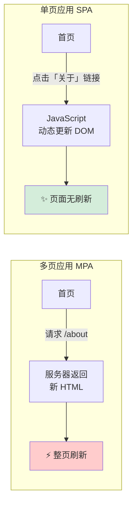
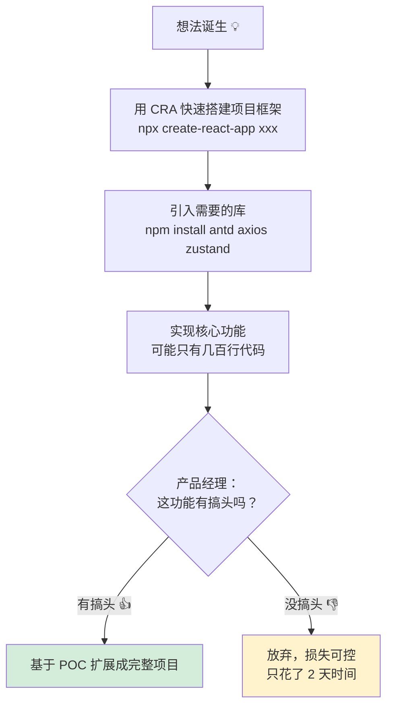
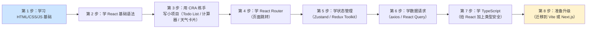
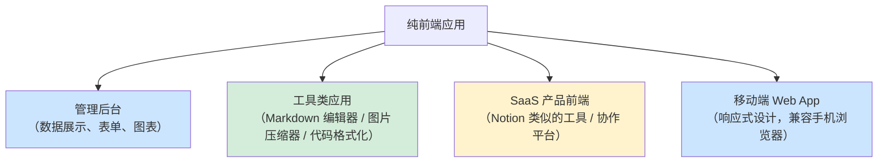
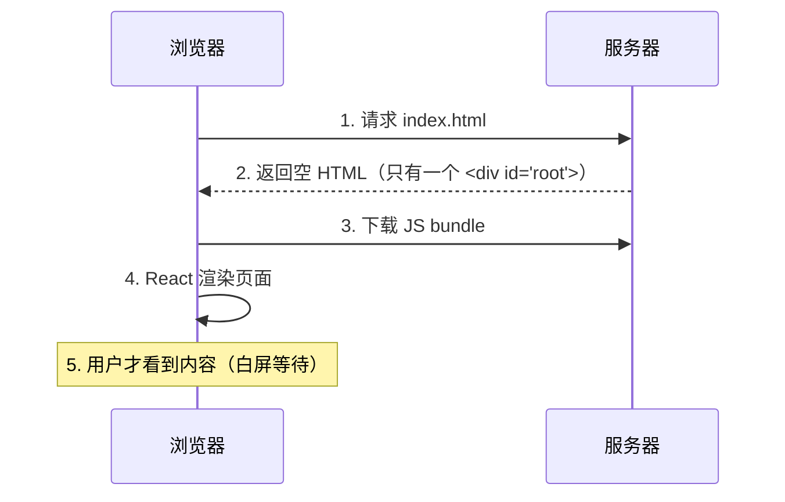
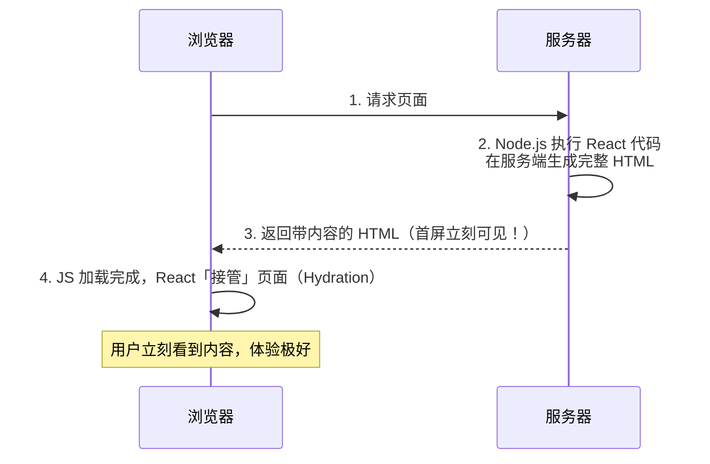
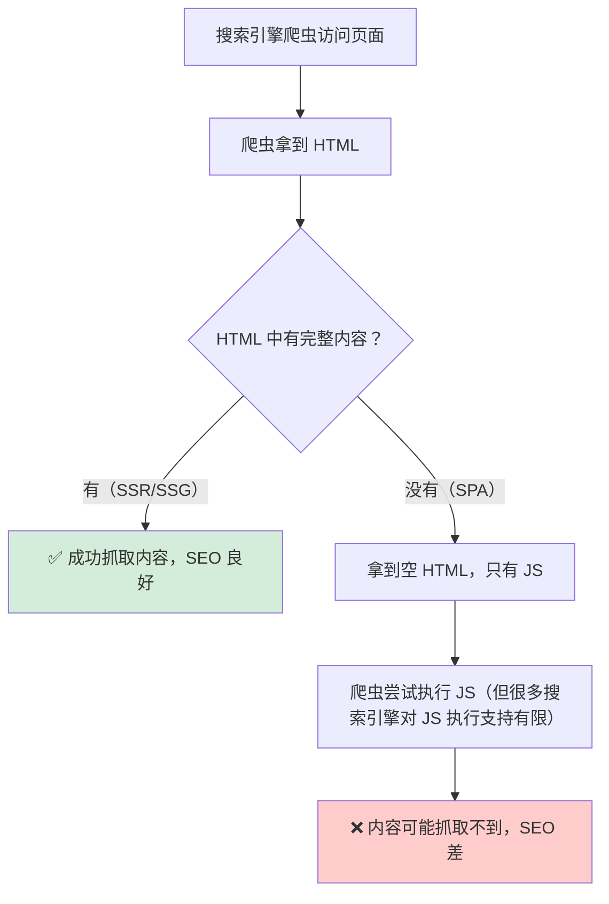
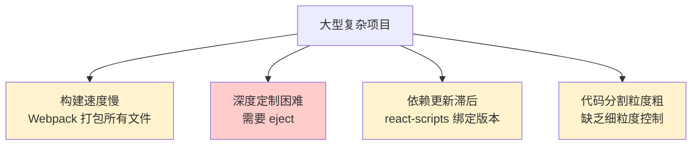
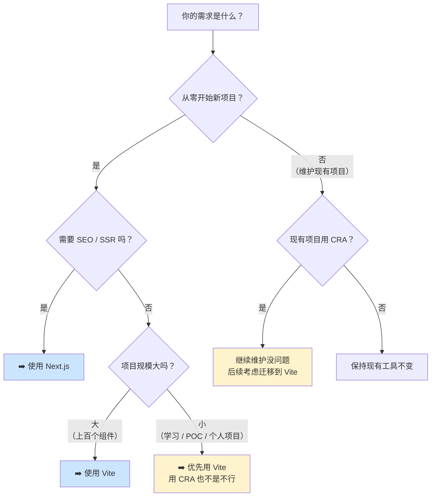

+++
title = "第4章 Create React App 用在哪"
weight = 40
date = "2026-03-27T21:04:00+08:00"
type = "docs"
description = ""
isCJKLanguage = true
draft = false
+++

# 第 4 章　Create React App 用在哪？

## 4.1 适用场景

### 🎯 CRA 的舒适区在哪里？

在讨论 CRA 的适用场景之前，先来理解一个核心概念：**单页应用（Single Page Application，简称 SPA）**。

#### 什么是单页应用？

传统的多页应用（MPA）是这样工作的：你点击一个链接，浏览器向服务器请求一个新页面，服务器返回新的 HTML，浏览器刷新整个页面，你看到新内容。来回往复，页页刷新。

单页应用则是：**第一次加载时把整个「应用外壳」下载下来，之后用户点击链接，页面不刷新，只是通过 JavaScript 动态更新页面内容**。



**CRA 只能用来构建单页应用**。理解了这个前提，我们来看它的适用场景。

### 4.1.1 快速原型与 POC

#### 什么是 POC？

**POC** 是 Proof of Concept（概念验证）的缩写，就是**用最快的方式把一个想法变成可以运行的代码**，用来验证这个想法是否可行。

比如产品经理说：「我们能不能做一个功能，让用户上传图片后自动给图片加滤镜？」——你不应该花两周时间做一个完美的解决方案，而是花两天做个 POC，给产品经理演示一下，看看方向对不对。

**CRA 在 POC 场景的优势**：



如果用纯手工配置（自己搭 Webpack + Babel），光是配置环境可能就要花掉 2 天，还没开始写业务代码呢。

**CRA 适合 POC 的原因总结**：

| 原因 | 说明 |
|------|------|
| 零配置 | 装好 Node.js，一条命令出项目 |
| 速度快 | `npx create-react-app` 完成后立刻开始写业务代码 |
| 生态丰富 | CRA 兼容所有 React 生态库，antd / Material-UI / axios 等随便用 |
| 心理负担小 | 不是正式项目，不需要考虑架构完美，先跑通再说 |

### 4.1.2 学习 React 语法

#### 为什么 CRA 是学习 React 的最佳起点？

这是 CRA **最经典、最核心的使用场景**，也是 Facebook 当年设计 CRA 的初心。

学习 React 的过程中，你需要关注的是：

- React 组件怎么写
- State 和 Props 是什么
- Hooks 怎么用
- 事件处理怎么做
- 条件渲染、列表渲染……

而不是：

- Webpack 的 `mode` 选项该设什么值
- Babel 的 `@babel/preset-env` 里 `useBuiltIns` 该怎么配
- Webpack 的 `module.rules` 里 `test` 正则写错了一个字符导致报错……

**CRA 帮你把那些「无关学习的噪音」全部屏蔽掉了**。

学习路径建议：



### 4.1.3 个人项目与小团队项目

对于个人项目和小团队项目，CRA 依然有一席之地——前提是你清楚它的边界在哪里。

#### 个人项目：自己说了算

如果你想做一个个人项目（比如个人博客、工具站、作品集网站），CRA 可以快速帮你把项目跑起来。

**CRA 适合个人项目的原因**：

1. **项目规模适中**：个人项目的代码量通常在几千到几万行，用 CRA 完全撑得住
2. **不需要深度定制 Webpack**：个人项目很少需要自定义 Webpack 配置
3. **快速验证想法**：先把想法跑起来，后面再考虑优化
4. **免费部署**：可以用 Vercel / Netlify / GitHub Pages 免费托管

> **💡 静态网站生成器的替代方案**
>
> 如果你的个人项目主要是内容展示型（博客、作品集、文档站），其实还有比 CRA 更轻量的选择：Vite + React 或者 Next.js（静态导出模式）。但如果你想深入学习 React，CRA 依然是很好的起点。

#### 小团队项目：协作与规范

小团队（2-5 人）使用 CRA 的优势：

- **统一的工具链**：所有人的开发环境完全一致（因为 CRA 统一了配置），不会出现「在我电脑上能跑，在你电脑上报错」的情况
- **低门槛**：新成员入职，不需要花时间学习复杂的构建配置，看两眼 `src/` 目录就可以开始写代码
- **测试友好**：内置 Jest，新功能有保障

**注意事项**：

- 如果团队超过 5 人，或者项目变得复杂，建议评估 Vite
- CRA 的依赖升级滞后（因为依赖锁定），大团队可能有安全更新的需求

### 4.1.4 纯前端单页应用

#### 什么是「纯前端」？

「纯前端」的意思是：**这个应用不依赖后端动态生成 HTML，所有页面内容都是前端 JavaScript 渲染出来的**。

纯前端应用的典型例子：



**CRA 最擅长的就是这类应用**。它的架构本身就是为 SPA（单页应用）设计的，非常适合数据驱动的管理后台和工具类应用。

---

## 4.2 不适用场景

### 4.2.1 需要 SSR 的项目

#### 什么是 SSR？

前面章节提到过 **SSR（Server-Side Rendering，服务端渲染）**，这里再深入解释一下。

在 SPA（单页应用）中，浏览器的行为是这样的：



**白屏等待**的问题是致命的——用户点开你的页面，看到的是空白，要等几秒甚至十几秒才能看到内容，很容易就关掉了。这对于面向普通用户的网站来说是致命的（用户体验差，SEO 差）。

SSR 的工作方式是这样的：



**CRA 不支持 SSR**。如果你需要服务端渲染，CRA 的替代品 **Next.js** 是更好的选择：

| 对比项 | CRA | Next.js |
|--------|-----|---------|
| SSR | ❌ 不支持 | ✅ 支持 |
| SSG（静态生成） | ❌ 不支持 | ✅ 支持 |
| ISR（增量静态再生成） | ❌ 不支持 | ✅ 支持 |
| API Routes | ❌ 没有 | ✅ 可以写后端接口 |

### 4.2.2 需要 SEO 优化的项目

#### 为什么 SPA 对 SEO 不友好？

搜索引擎的爬虫（Spider/Crawler）是一种自动访问网页的程序，它们的工作是抓取网页内容，建立索引，供用户搜索。

SPA 的问题是：



**典型需要 SEO 的项目**：

- 企业官网
- 博客 / 资讯站
- 电商产品详情页
- 论坛 / 社区

这些项目**不应该用 CRA**，因为它们的流量很大程度上依赖搜索引擎。应该用支持 SSR/SSG 的框架，比如 Next.js（推荐）或者 Gatsby。

> **💡 一个例外**
>
> 如果你的项目**不需要** SEO（比如内部工具、管理后台、登录后才可见的应用），那 CRA 的 SEO「缺陷」就不是问题，尽情使用！

### 4.2.3 大型复杂项目

#### CRA 在大型项目中的局限性

当项目规模增长到一定程度时，CRA 会开始显现出一些局限性：



**具体问题**：

1. **构建速度**：项目代码量大了之后（几百个组件），Webpack 的打包速度会明显变慢，开发体验下降
2. **eject 的代价**：想深度优化性能？想自定义 Webpack 配置？只能 eject，但 eject 后 CRA 的所有优势就消失了
3. **依赖锁死**：react-scripts 的版本更新依赖于 CRA 官方维护进度，有时你无法及时用到新版本的 Webpack 或 Babel

**大型项目的推荐选择**：

| 项目规模 | 推荐工具 |
|----------|----------|
| 小型（几十个组件） | CRA 或 Vite 都可以 |
| 中型（上百个组件） | Vite |
| 大型（几百个组件，微前端架构） | Vite + monorepo（如 Turborepo） |
| 超大型（需要 SSR） | Next.js |

### 4.2.4 CRA 已停止维护，需评估替代方案

#### CRA 已经停止维护

**2026 年，Create React App 官方宣布停止维护**。

这意味着：

```
❌ 不再有新功能
❌ 不再有安全更新
❌ `Webpack` / `Babel` / `Jest` 版本停滞
❌ 新的 React 特性可能无法及时支持
```

这不意味着你现在立刻要把所有 CRA 项目都重写——**正在运行的生产项目不需要动**。但如果你是从零开始做新项目，**强烈不建议再用 CRA**。

#### 停止维护的具体影响

| 影响 | 说明 |
|------|------|
| 安全性 | 如果未来发现 `Webpack`/`Babel` 的安全漏洞，CRA 不会更新 |
| 浏览器兼容性 | 新的 CSS/JS 特性可能无法及时支持 |
| React 新版本 | 新的 React 特性可能需要新的 `Babel` 插件，但 CRA 不会更新 |
| 就业竞争力 | 现在招聘市场上 Vite 已经占据主流，CRA 经验价值下降 |

---

## 4.3 当前状态与选择建议

### 🤔 说了这么多，到底该不该用 CRA？

来一个最终决策指南：



### 具体的建议

#### 情况一：零基础学习 React

**建议**：先用 CRA，学概念够了。

CRA 的最大价值在于教学——它让你专注 React 语法本身，不被构建工具的分心。等你学完 React 基础（组件、Props、State、Hooks、Router），再迁移到 Vite 也很简单（语法完全兼容，只是构建工具不同）。

#### 情况二：做个人项目 / POC / 快速验证想法

**建议**：直接用 Vite，不用 CRA。

Vite 更快、更现代、还在活跃维护。`npm create vite@latest` 也是一条命令创建项目，和 CRA 一样简单，但构建速度快 10 倍。

```bash
# Vite 创建 React 项目
npm create vite@latest my-app -- --template react
```

#### 情况三：管理后台 / 内部工具

**建议**：Vite + React，或直接上 Next.js。

这类应用对 SEO 没有要求，对 SSR 没有要求，但需要好的开发体验和类型安全。建议用 Vite + TypeScript + Ant Design（一个很流行的 React UI 组件库）。

#### 情况四：维护现有的 CRA 项目

**建议**：不要急着迁移，先继续用。

迁移是有成本的，如果现有 CRA 项目运行良好，不需要投入时间迁移。但同时，**不要再在 CRA 基础上开发新功能了**，可以考虑逐步把新功能用 Vite 写，然后通过微前端的方式接入老项目。

---

## 本章小结

本章我们深入探讨了 CRA 的适用边界：

- **适合场景**：
  - POC 快速原型验证（零配置，快速出成果）
  - 学习 React 语法（屏蔽构建工具噪音，专注核心概念）
  - 个人项目与小团队项目（规模适中，快速开发）
  - 纯前端单页应用（管理后台、工具类应用）
- **不适用场景**：
  - 需要 SEO 优化的面向用户网站（→ Next.js）
  - 需要 SSR 的应用（→ Next.js）
  - 大型复杂项目，深度定制 Webpack（→ Vite）
  - **新项目不要用 CRA 了（已停止维护）**
- **选择建议**：
  - 学习阶段：CRA 可以用，学完立刻转向 Vite
  - 生产项目：Vite 或 Next.js 是正确选择
  - 维护现有 CRA 项目：继续用，但不要再增加 CRA 的技术债

工具是为人服务的，不是来绑架你的。选择什么工具，取决于你要解决什么问题。

