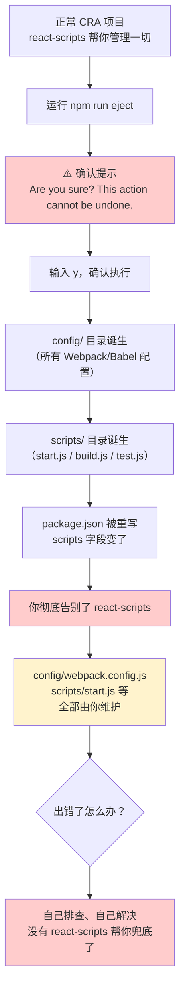
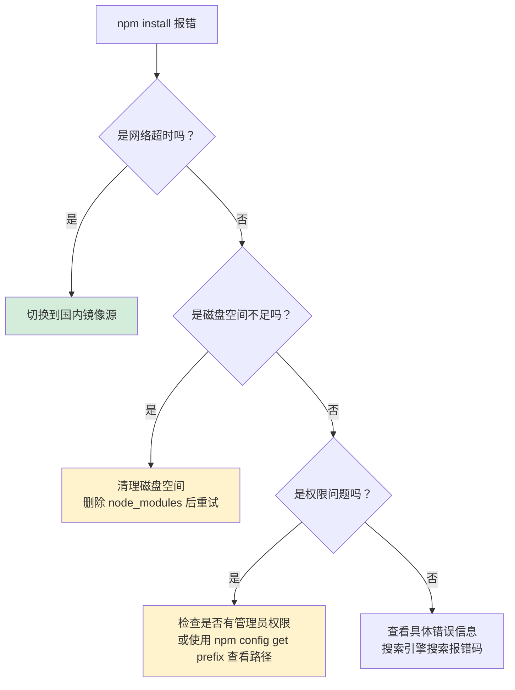
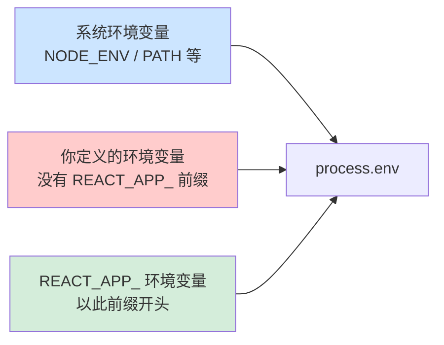
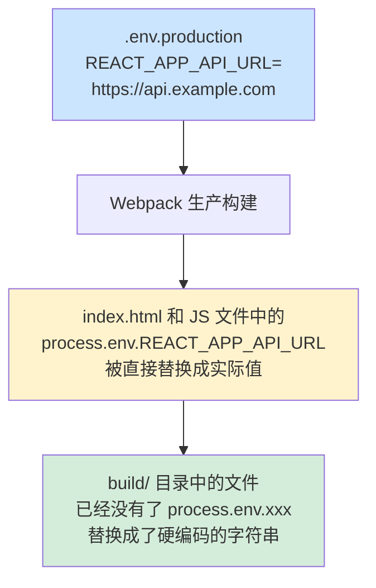
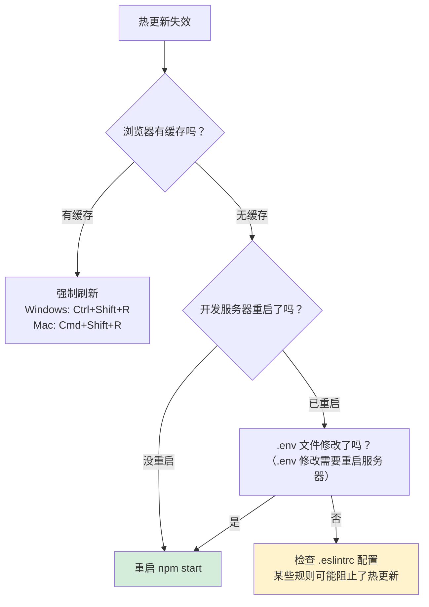

+++
title = "第5章 使用 Create React App 需要注意什么"
weight = 50
date = "2026-03-27T21:04:00+08:00"
type = "docs"
description = ""
isCJKLanguage = true
draft = false
+++

# 第 5 章　使用 Create React App 需要注意什么？

## 5.1 eject 操作不可逆，务必三思

### ⚠️ 这是 CRA 中最重要的一条注意事项

`npm run eject` 是 Create React App 提供的「退出机制」，一旦执行，**没有回头路**。

让我们用一张图来形象地说明这个过程：



### eject 之后会发生什么？

#### 目录结构的变化

**eject 前**：

```
my-app/
├── src/
├── public/
├── package.json
└── node_modules/
    └── react-scripts/     ← 黑盒子，你看不见里面是什么
```

**eject 后**：

```
my-app/
├── config/
│   ├── jest/
│   │   └── cssTransform.js
│   │   └── fileTransform.js
│   ├── env.js
│   ├── modules.js
│   ├── paths.js
│   ├── webpack.config.js          ← Webpack 配置，可以随便改了
│   ├── webpack.config.ts
│   └── webpackDevServer.config.js
├── scripts/
│   ├── start.js                   ← npm start 的实际逻辑
│   ├── build.js                   ← npm run build 的实际逻辑
│   └── test.js                   ← npm test 的实际逻辑
├── src/
├── public/
└── package.json                   ← react-scripts 从 dependencies 中消失了
```

#### package.json 的变化

```json
/* eject 前 */
{
  "dependencies": {
    "react": "^18.2.0",
    "react-dom": "^18.2.0",
    "react-scripts": "5.0.1"  /* ← react-scripts 在这里 */
  },
  "scripts": {
    "start": "react-scripts start",     /* ← 一行搞定 */
    "build": "react-scripts build",
    "test": "react-scripts test",
    "eject": "react-scripts eject"
  }
}
```

```json
/* eject 后 */
{
  "dependencies": {
    "react": "^18.2.0",
    "react-dom": "^18.2.0",
    /* react-scripts 消失了！ */
    /* 取而代之的是一大串独立的依赖： */
    "@babel/core": "^7.16.0",
    "@svgr/webpack": "^5.5.0",
    "babel-jest": "^27.4.2",
    "babel-loader": "^8.2.3",
    "css-loader": "^6.5.1",
    "css-minimizer-webpack-plugin": "^3.2.0",
    "dotenv": "^10.0.0",
    "eslint-webpack-plugin": "^3.1.1",
    "file-loader": "^6.2.0",
    "html-webpack-plugin": "^5.5.0",
    "jest": "^27.4.3",
    "mini-css-extract-plugin": "^2.5.3",
    "postcss": "^8.4.4",
    "postcss-flexbugs-fixes": "^5.0.2",
    "postcss-loader": "^6.2.1",
    "postcss-normalize": "^10.0.1",
    "postcss-preset-env": "^7.0.1",
    "prompts": "^2.4.2",
    "resolve-url-loader": "^4.0.0",
    "sass-loader": "^12.3.0",
    "semver": "^7.3.5",
    "style-loader": "^3.3.1",
    "terser-webpack-plugin": "^5.2.5",
    "url-loader": "^4.1.1",
    "webpack": "^5.64.4",
    "webpack-dev-server": "^4.6.0",
    "workbox-webpack-plugin": "^6.4.1"
    /* 等等……几十个独立的包 */
  },
  "scripts": {
    "start": "node scripts/start.js",    /* ← 现在是独立的 node 脚本 */
    "build": "node scripts/build.js",
    "test": "node scripts/test.js"
    /* eject 脚本已被移除，无法再次执行 eject */
  }
}
```

### 什么时候可以 eject？

**可以 eject 的情况**：

- 你是一个 Webpack 配置专家，知道自己在干什么
- 你需要深度定制 Webpack 性能优化策略（比如微前端架构）
- 你需要自定义 Babel 插件或 preset

**不应该 eject 的情况**：

- 只是想加一个 loader 或 plugin——CRA 提供了覆盖机制（后面配置章节会讲），不需要 eject
- 觉得好奇想看看里面是什么——不要为了好奇付出不可逆的代价
- 项目出问题了，想通过 eject 来「debug」——这是最糟糕的选择

> **💡 在 eject 之前，先试试这些不 eject 的方案**：
>
> 1. 想加一个 Sass 支持？→ `npm install sass`，不需要 eject
> 2. 想自定义环境变量？→ 创建 `.env` 文件，不需要 eject
> 3. 想自定义 Webpack 配置？→ 查 CRA 官方文档的 Overriding 部分，不需要 eject
> 4. 想加一个新的 npm 包？→ `npm install xxx`，不需要 eject
>
> 大部分情况下，eject 都是「杀鸡用牛刀」的选择。

---

## 5.2 网络与依赖问题

### 🌐 网络问题：每个 CRA 使用者的必经之痛

### 5.2.1 依赖下载失败的处理

如果你在国内使用 npm，很可能会遇到这样的报错：

```
npm ERR! code ETIMEDOUT
npm ERR! errno ETIMEDOUT
npm ERR! request to https://registry.npmjs.org/create-react-app failed, reason: connect ETIMEDOUT
```

这是因为 npm 默认使用的官方源（`https://registry.npmjs.org/`）服务器在国外，国内访问速度慢或者直接超时。

#### 诊断与解决



### 5.2.2 npm 镜像源配置

国内常用的 npm 镜像源：

| 镜像 | 地址 | 速度 |
|------|------|------|
| 淘宝镜像 | `https://registry.npmmirror.com` | 快 |
| 腾讯云镜像 | `https://mirrors.cloud.tencent.com/npm/` | 快 |
| 华为云镜像 | `https://repo.huaweicloud.com/repository/npm/` | 快 |
| npm 官方源 | `https://registry.npmjs.org/` | 慢（国外） |

**配置淘宝镜像（一劳永逸）**：


```bash
# 设置全局镜像源
npm config set registry https://registry.npmmirror.com

# 验证是否设置成功
npm config get registry
# 输出：https://registry.npmmirror.com ✅

# 以后所有 npm install 都会从淘宝镜像下载
```

或者，你也可以在项目的根目录创建 `.npmrc` 文件：

```
# .npmrc 文件
registry=https://registry.npmmirror.com
```

> **⚠️ 注意**：使用镜像源有时候会有同步延迟，最新的包可能还没同步过来。如果遇到这种情况，可以临时切换回官方源：


> ```bash
> npm config set registry https://registry.npmjs.org/
> ```

### 5.2.3 Node.js 与 npm 版本要求

CRA 对 Node.js 和 npm 版本有要求，如果版本太低，可能导致安装失败或运行出错。

#### Node.js 版本要求

| CRA 版本 | 最低 Node.js 版本 |
|----------|-------------------|
| CRA v5 | Node.js ≥ 14 |
| CRA v4 | Node.js ≥ 10 |
| CRA v3 | Node.js ≥ 8 |

#### npm 版本要求

| npm 版本 | 说明 |
|----------|------|
| npm ≥ 5.2 | 自带 npx，可以直接用 `npx create-react-app` |
| npm ≥ 6.x | CRA 推荐版本 |
| npm ≥ 7.x | 大多数情况下兼容，但部分 CRA 版本可能有问题 |

**检查当前版本**：

```bash
node --version
# 输出：v20.11.0

npm --version
# 输出：10.2.4
```

**如果版本过低，升级 npm**：

```bash
npm install -g npm@latest  # 输出：升级到最新 npm 版本
# 或者
npm install -g npm@6       # 降级到 npm 6（如果遇到兼容性问题）
```

**如果版本过低，升级 Node.js**：

- Windows：去 [nodejs.org](https://nodejs.org) 下载最新 LTS 安装包重新安装
- Mac/Linux：使用 nvm 升级（最推荐）
  ```bash
  nvm install 20        # 安装 Node 20 LTS
  nvm use 20           # 使用 Node 20
  nvm alias default 20 # 设置 Node 20 为默认版本
  ```

---

## 5.3 环境变量规范

### 🔒 CRA 环境变量的金科玉律

### 5.3.1 必须以 REACT_APP_ 前缀开头

这是 CRA 环境变量规则中**最重要的一条**，没有之一。

```bash
# ✅ 正确：变量名以 REACT_APP_ 开头
REACT_APP_API_URL=https://api.example.com
REACT_APP_VERSION=1.0.0
REACT_APP_TITLE=我的博客

# ❌ 错误：没有前缀，代码中读取不到
API_URL=https://api.example.com       # process.env.API_URL === undefined
DB_PASSWORD=secret123                 # process.env.DB_PASSWORD === undefined
TOKEN=abc123                          # process.env.TOKEN === undefined
```

为什么 CRA 要强制这个前缀？因为：



这个设计是为了**防止你的应用意外读取到系统的敏感环境变量**，造成安全隐患。`REACT_APP_` 前缀就像一个命名空间，把「你的变量」和「系统的变量」隔离开来。

### 5.3.2 构建时与运行时的区别

CRA 的环境变量有一个非常关键的特点：**在生产构建时是静态替换的，但开发模式下是 webpack-dev-server 动态注入的**。

```javascript
// 假设 .env.development 中有：
// REACT_APP_API_URL=http://localhost:8080

// 代码中：
const apiUrl = process.env.REACT_APP_API_URL;
console.log(apiUrl);  // 输出：http://localhost:8080
```

当你运行 `npm run build` 时：




也就是说，**生产构建后的代码中，环境变量已经被替换成了硬编码的字符串**，这不是 JavaScript 运行时的变量，而是「字面量」。开发模式下（`npm start`）则不同，webpack-dev-server 会实时读取 `.env.development` 并动态注入，刷新页面即可读到最新值。

```javascript
// 开发环境热更新时的代码（被 webpack-dev-server 动态替换）
console.log(process.env.REACT_APP_API_URL);  // 浏览器控制台输出：http://localhost:8080

// 生产环境打包后的代码（已被静态替换成硬编码字符串）
console.log("https://api.example.com");  // 浏览器控制台输出：https://api.example.com
```

> **⚠️ 安全警告：永远不要把敏感信息放在 REACT_APP_ 环境变量中**
>
> 因为环境变量会被直接替换进 JS bundle 里，任何人都可以在浏览器中看到这些值：
>
> ```javascript
> // .env.production
> REACT_APP_API_KEY=sk-1234567890abcdef   // ⚠️ 这是密钥！
>
> // 打包后，任何人打开控制台都能看到：
> const apiKey = "sk-1234567890abcdef";   // 🔓 暴露了！
> ```
>
> 正确做法：敏感信息放在后端，前端只存放非敏感的公共配置。

---

## 5.4 构建与部署

### 🚀 代码写完了，怎么上线？

### 5.4.1 开发服务器不能用于生产

这是一个很多人会犯的错误——把 `npm start` 跑的开发服务器当成生产服务器用。

| 对比项 | `npm start`（开发服务器） | `npm run build`（生产构建） |
|--------|--------------------------|---------------------------|
| 用途 | 本地开发调试 | 部署到线上 |
| 代码 | 未压缩、未优化 | 压缩、混淆、Tree Shaking |
| 热更新 | ✅ 支持 | ❌ 不支持 |
| 性能 | 差（文件未优化） | 优秀（体积小、加载快） |
| 安全 | ❌ 没有安全 headers | 可通过服务器配置安全 headers |
| 多用户 | ❌ 只能自己访问 | ✅ 可供所有用户访问 |

**开发服务器只应该在你的电脑上运行**，绝对不要把它暴露到公网上。公网访问应该用 `npm run build` 生成的静态文件，配合 nginx、Apache 或静态托管服务来部署。

### 5.4.2 构建产物的特点

`npm run build` 完成后，会在项目根目录生成一个 `build/` 文件夹，里面包含了所有部署需要的文件。

```
build/
├── index.html                    ← 入口 HTML
├── static/
│   ├── css/
│   │   └── main.xxx.css        ← 压缩后的 CSS
│   ├── js/
│   │   ├── main.xxx.js         ← 主 bundle（压缩混淆）
│   │   ├── main.xxx.js.map    ← Source Map（调试用）
│   │   └── runtime-xxx.js     ← Webpack runtime
│   └── media/                  ← 图片、视频等媒体文件
├── manifest.json                ← PWA 配置文件
└── robots.txt                  ← 搜索引擎配置
```

> **📍 Source Map 是什么？**
>
> Source Map（`.js.map` 文件）是调试用的文件，它记录了「压缩后的代码」和「原始代码」的对应关系。开启浏览器开发者工具的 Source Map 功能后，即使代码被压缩混淆了，你依然能看到原始的 `App.js` 文件和行号，方便调试。
>
> **生产环境**：通常建议在生产构建时禁用 Source Map（设置 `GENERATE_SOURCEMAP=false`），避免压缩后的源代码被用户直接看到。如需生产环境调试，可通过私有方式（如内部日志系统）获取 Source Map，不必将它们随静态资源一同部署。

### 5.4.3 部署到子目录时的 homepage 配置

如果你的应用不是部署在域名根路径（`/`），而是部署在子目录下（比如 `https://example.com/my-app/`），**必须配置 `homepage` 字段**，否则会出现资源 404 的问题。

```json
// package.json
{
  "homepage": "https://example.com/my-app/"
}
```

配置 `homepage` 后，Webpack 在构建时会自动把所有的资源路径改成相对于 `homepage` 的路径：

```mermaid
flowchart TD
    A["没有配置 homepage"] --> B["资源路径是绝对路径<br/><link href=\"/static/js/main.js\">"]
    B --> C["部署到子目录<br/>❌ 浏览器请求 /static/js/main.js<br/>（根路径，找不到文件，404）"]
    
    D["配置 homepage 后"] --> E["资源路径变成相对路径<br/><script src=\"./static/js/main.js\">"]
    E --> F["部署到子目录<br/>✅ 浏览器请求 ./static/js/main.js<br/>（相对于当前路径，正确！）"]
    
    style B fill:#ffcccc
    style E fill:#d4edda
```

---

## 5.5 常见错误与警告

### 🔧 报错不要怕，一个一个来解决

### 5.5.1 端口被占用

**报错信息**：

```
Error: listen EADDRINUSE :::3000
# 或者
Port 3000 is already in use
```

**原因**：3000 端口已经被其他程序占用了。

**解决方案**：

```bash
# Windows：查找占用端口的进程
netstat -ano | findstr :3000
# 输出类似：TCP    0.0.0.0:3000    0.0.0.0:0    LISTENING    12345
# 12345 是进程 PID

# 结束这个进程
taskkill /PID 12345 /F
```

```bash
# Mac/Linux：查找占用端口的进程
lsof -i :3000
# 输出类似：COMMAND   PID   USER   FD   TYPE   DEVICE   SIZE/OFF   NODE   NAME
# node      12345 yourname   21u   IPv4   12345      0t0        TCP    *:3000 (LISTEN)

# 结束这个进程
kill -9 12345
```

或者，直接换个端口：

```bash
# Windows
set PORT=3001 && npm start

# Mac/Linux
PORT=3001 npm start

# 或者用 package.json 的 scripts
PORT=3001 npm start
```

### 5.5.2 热更新失效

有时候改了代码，浏览器没有自动更新，页面还是显示旧内容。

**常见原因与解决方法**：



### 5.5.3 文件监听数超限

**报错信息（Linux/Mac）**：

```
Error: ENOSPC: System limit for file watchers has been reached.
```

**原因**：Linux/Mac 系统对「同时监听文件变化的数量」有限制，CRA 项目文件太多，超过了系统限制。

**解决方法**：

```bash
# 临时解决：增加监听数上限
echo fs.inotify.max_user_watches=524288 | sudo tee /etc/sysctl.d/99-user.conf
sudo sysctl --system

# 或者
echo 524288 | sudo tee /proc/sys/fs/inotify/max_user_watches
```

```bash
# Windows (WSL)
# 在 .wslconfig 文件中配置
# 文件位置：用户目录下的 .wslconfig
echo "[wsl2]
kernel=67108864" >> ~/.wslconfig
# 然后重启 WSL
wsl --shutdown
```

---

## 本章小结

本章总结了使用 CRA 时需要注意的关键事项：

- **`npm run eject` 不可逆**：在执行前务必三思。绝大多数情况下都有不需要 eject 的替代方案，只有当你真的需要完全自定义 Webpack/Babel 配置时，才考虑 eject
- **网络与依赖问题**：国内用户务必配置 npm 镜像源（推荐 `registry.npmmirror.com`），Node.js 版本不低于 14，npm 版本不低于 5.2
- **环境变量规范**：必须以 `REACT_APP_` 为前缀，生产构建时会静态替换，不要把敏感信息放进去
- **构建与部署**：`npm start` 不能用于生产，部署到子目录必须配置 `homepage` 字段
- **常见错误**：端口占用、热更新失效、文件监听数超限，都有对应的解决方案

记住：CRA 的设计哲学是「零配置」，遇到问题先想「有没有不需要改配置的解决方案」，再考虑 eject 或者换工具。

