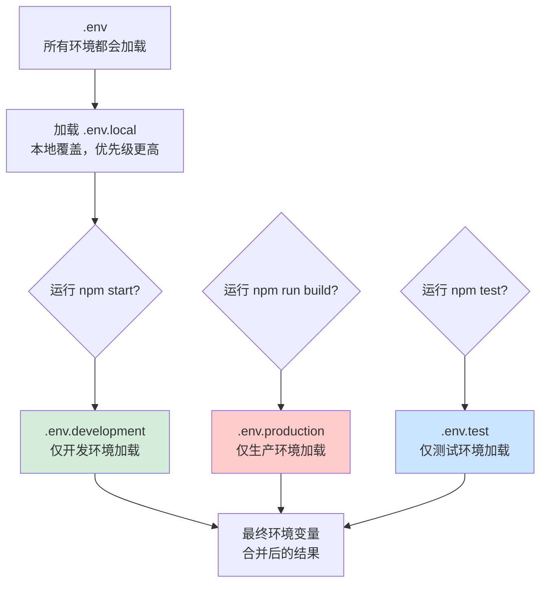
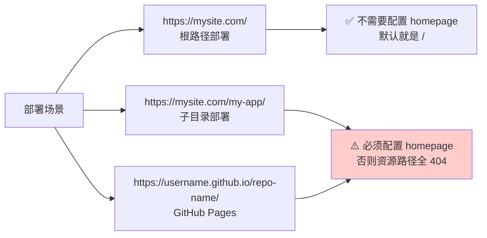
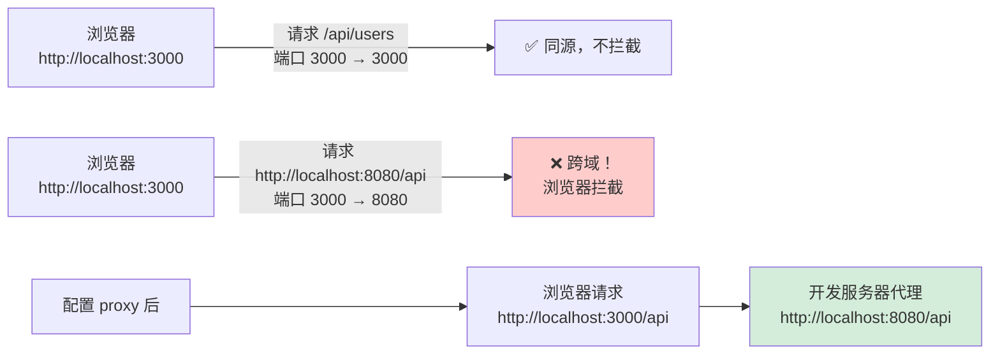
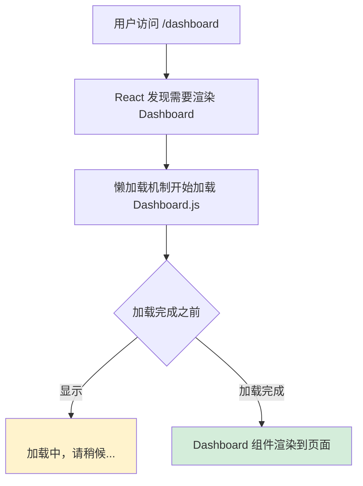
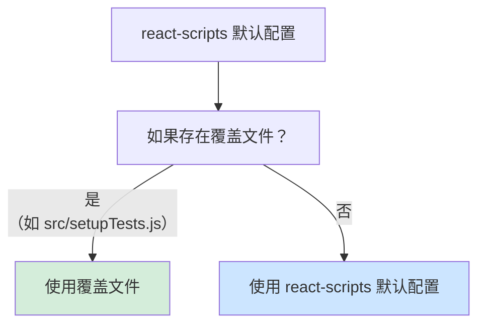
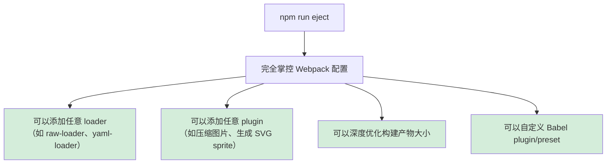

+++
title = "第6章 Create React App 相关配置"
weight = 60
date = "2026-03-27T21:04:00+08:00"
type = "docs"
description = ""
isCJKLanguage = true
draft = false
+++

# 第 6 章　Create React App 相关配置

## 6.1 环境变量配置

### 🌿 环境变量：让同一套代码适应不同运行环境

环境变量是 CRA 中最常用、最实用的配置机制之一。简单来说，它让你可以在**不修改代码的情况下**，根据不同环境（开发/生产/测试）加载不同的配置值。

### 6.1.1 .env 文件类型（development / production / test）

CRA 支持多种环境变量文件，系统会根据当前运行的命令自动选择加载哪个文件：



**文件优先级（后面的覆盖前面的）**：

```
.env              ← 最基础，所有环境都加载
  ↓
.env.local        ← 本地覆盖（不会被 Git 提交）
  ↓
.env.[mode]       ← 按环境类型（development / production / test）
  ↓
.env.[mode].local ← 本地按环境（优先级最高）
```

### 6.1.2 变量命名规则

CRA 对环境变量名有严格的规定：

```bash
# ✅ 正确：必须以 REACT_APP_ 开头
REACT_APP_API_URL=https://api.example.com
REACT_APP_TITLE=我的博客
REACT_APP_VERSION=1.0.0
REACT_APP_ENABLE_DEBUG=true

# ❌ 错误：没有前缀，读取不到
API_URL=https://api.example.com
SECRET_KEY=abc123

# ✅ 正确：数字可以（除了开头）
REACT_APP_PORTFOLIO_2024=true

# ✅ 正确：下划线可以
REACT_APP_DB_HOST_NAME=localhost
```

> **💡 以 .env 开头的文件是 Git 默认忽略的**
>
> `.env.local` 和 `.env.[mode].local` 不会被 Git 追踪（因为 CRA 的 `.gitignore` 里已经配置了）。这是有意为之的——因为这些文件通常包含本地配置和敏感信息。
>
> `.env` 和 `.env.[mode]` 会被 Git 提交，所以这些文件里**不要放敏感信息**。

### 6.1.3 代码中读取方式

```javascript
// 在 React 组件中读取环境变量
const apiUrl = process.env.REACT_APP_API_URL;
const appTitle = process.env.REACT_APP_TITLE;
const version = process.env.REACT_APP_VERSION;

console.log(apiUrl);   // 输出：https://api.example.com
console.log(appTitle); // 输出：我的博客
console.log(version);  // 输出：1.0.0
```

一个完整的示例：

```bash
# .env.development
REACT_APP_API_URL=http://localhost:8080
REACT_APP_ENV=development
REACT_APP_DEBUG=true
REACT_APP_TITLE=我的博客（开发版）

# .env.production
REACT_APP_API_URL=https://api.example.com
REACT_APP_ENV=production
REACT_APP_DEBUG=false
REACT_APP_TITLE=我的博客
```

```javascript
// src/config.js
// 创建一个配置对象，方便在项目各处使用
const config = {
  apiUrl: process.env.REACT_APP_API_URL,
  env: process.env.REACT_APP_ENV,
  isDebug: process.env.REACT_APP_DEBUG === 'true',
  title: process.env.REACT_APP_TITLE,
};

export default config;
```

```javascript
// src/App.js
import React from 'react';
import config from './config';
import './App.css';

function App() {
  return (
    <div className="App">
      {/* 根据环境变量渲染不同内容 */}
      <h1>{config.title}</h1>
      <p>当前环境：{config.env}</p>
      <p>API 地址：{config.apiUrl}</p>
      {config.isDebug && (
        <div style={{ color: 'red' }}>
          ⚠️ 当前是调试模式
        </div>
      )}
    </div>
  );
}

export default App;
```

---

## 6.2 Browserslist 配置

### 🌍 Browserslist：告诉 Babel 和 Autoprefixer「我需要支持哪些浏览器」

**Browserslist** 是一个通用的浏览器范围配置工具，CRA 使用它来告诉 Babel「你需要把代码转换成什么程度的兼容性」，以及告诉 CSS 预处理器「你需要加哪些浏览器前缀」。

### 6.2.1 生产环境浏览器范围

在 `package.json` 中配置：

```json
{
  "browserslist": {
    "production": [
      ">0.2%",        // 市场占有率大于 0.2% 的浏览器
      "not dead",     // 排除官方已停止支持的浏览器（不再更新的浏览器）
      "not op_mini all"  // 排除 Opera Mini（一种无法使用 CSS 高级特性的移动浏览器）
    ]
  }
}
```

**常见的配置选项**：

```json
"production": [
  ">0.2%",           // 市场占有率 > 0.2%
  ">= 1%",           // 市场占有率 >= 1%
  "last 2 versions",  // 每个浏览器的最近两个版本
  "last 3 Chrome versions",  // Chrome 最近三个版本
  "not IE 11",        // 排除 IE 11
  "not dead"          // 排除已停止维护的浏览器
]
```

**常见的浏览器名称**：

```
chrome, edge, firefox, safari, opera, ie, samsung,
ios_saf (iOS Safari), android (Android Browser)
```

### 6.2.2 开发环境浏览器范围

```json
{
  "browserslist": {
    "development": [
      "last 1 chrome version",      // 开发只用最新版 Chrome
      "last 1 firefox version",    // Firefox 最新版
      "last 1 safari version"      // Safari 最新版
    ]
  }
}
```

> **💡 Browserslist 如何影响构建？**
>
> Browserslist 会被多个工具使用：
>
> - **Babel**：根据配置决定要把 ES6+ 语法转换成哪个版本的 JavaScript
> - **Autoprefixer**：根据配置决定要给 CSS 加哪些浏览器前缀（如 `-webkit-`、`-moz-`）
> - **postcss-preset-env**：根据配置决定 CSS 新特性要转换成什么程度
>
> 简单说：Browserslist 定义了「目标浏览器」，所有转换工具都根据这个目标来决定转换策略。

### Browserslist 的查询语法

Browserslist 支持非常灵活的查询语法：

| 查询语法 | 含义 |
|----------|------|
| `> 0.2%` | 市场占有率大于 0.2% |
| `>=1%` | 市场占有率大于等于 1% |
| `<5%` | 市场占有率小于 5% |
| `last 2 versions` | 每个浏览器的最近两个版本 |
| `last 3 Chrome versions` | Chrome 最近三个版本 |
| `not dead` | 不是已停止维护的浏览器 |
| `not IE 11` | 排除 IE 11 |
| `supports es6-module` | 支持 ES6 Module 的浏览器 |

```json
{
  "browserslist": [
    "> 1%",           // 市场 > 1%
    "last 2 versions", // 最近两个版本
    "not dead"         // 排除已停止维护的
  ]
}
```

---

## 6.3 homepage 部署路径配置

### 📍 homepage：让你的应用知道「自己住在哪里」

当你的应用不是部署在域名的根路径（`/`），而是部署在某个子目录下时，`homepage` 配置就是必须的。

#### 什么时候需要配置？



#### 如何配置

在 `package.json` 中添加 `homepage` 字段：

```json
{
  "name": "my-app",
  "version": "1.0.0",
  "homepage": "https://example.com/my-app/",
  "dependencies": {
    "react": "^18.2.0",
    "react-dom": "^18.2.0",
    "react-scripts": "5.0.1"
  }
}
```

**不同部署场景的配置示例**：

```json
/* 部署到 GitHub Pages（用户名.github.io 仓库下的项目） */
"homepage": "https://username.github.io/my-app/"

/* 部署到子目录 */
"homepage": "https://example.com/dashboard/"

/* 部署到根路径 */
"homepage": "https://example.com/"
```

---

## 6.4 代理配置（proxy）

### 🔀 代理：解决开发环境跨域问题的神器

### 6.4.1 解决开发环境跨域问题

**跨域（Cross-Origin Resource Sharing，简称 CORS）** 是浏览器的一个安全机制：一个网页的 JavaScript 只能请求「同源」的接口。

- 前端地址：`http://localhost:3000`
- API 地址：`http://localhost:8080`

虽然都是 localhost，但端口不同，浏览器认为这是不同的「源」，会阻止前端直接请求后端接口。这就是跨域问题。



#### 最简单的代理配置（package.json）

```json
{
  "name": "my-app",
  "version": "1.0.0",
  "proxy": "http://localhost:8080",
  "dependencies": {}
}
```

配置后，前端请求会自动代理到 `http://localhost:8080`：

```javascript
// 组件中
const response = await fetch('/api/users');
// 实际发送的请求是：http://localhost:8080/api/users
// ✅ 不存在跨域问题
```

#### 带路径映射的代理配置（http-proxy-middleware）

如果你的 API 不在根路径下，需要更细粒度的代理配置：

```bash
npm install http-proxy-middleware
```

```javascript
// src/setupProxy.js
// 注意：这个文件名必须是 setupProxy.js，不能改！
const { createProxyMiddleware } = require('http-proxy-middleware');

module.exports = function(app) {
  // 将 /api 前缀的请求代理到 localhost:8080
  app.use(
    '/api',
    createProxyMiddleware({
      target: 'http://localhost:8080',  // 目标服务器
      changeOrigin: true,               // 修改请求头中的 Origin 为目标服务器
      pathRewrite: {                    // 重写路径（可选）
        '^/api': '',                   // 把 /api 替换为空字符串
      },
    })
  );

  // 将 /auth 前缀的请求代理到另一个服务
  app.use(
    '/auth',
    createProxyMiddleware({
      target: 'http://localhost:3001',
      changeOrigin: true,
    })
  );
};
```

```javascript
// src/api.js
// 请求 /api/users → http://localhost:8080/users
// 请求 /auth/login → http://localhost:3001/login

export const fetchUsers = () => fetch('/api/users').then(r => r.json());
export const login = (data) => fetch('/auth/login', {
  method: 'POST',
  headers: { 'Content-Type': 'application/json' },
  body: JSON.stringify(data),
}).then(r => r.json());
```

> **📌 注意 setupProxy.js 的位置**
>
> 这个文件必须放在 `src/` 目录下，而不是项目根目录！文件名必须是 `setupProxy.js`，CRA 的 Webpack 配置会在 `src/` 目录中查找这个文件。

### 6.4.2 代理配置的局限性

代理配置**只在开发环境（`npm start`）下有效**。生产环境（`npm run build`）中，你需要：

1. 使用 nginx / Apache 做反向代理
2. 或者让后端配置 CORS（允许跨域访问）
3. 或者使用 API 网关统一处理

```json
/* package.json 中的 proxy 字段的局限性 */
{
  "proxy": "http://localhost:8080"
  /* ❌ 只支持将所有请求代理到同一个目标 */
  /* ❌ 不支持根据路径代理到不同服务器 */
  /* ❌ 不支持 HTTPS */
  /* 如果需要这些功能 → 使用 http-proxy-middleware */
}
```

---

## 6.5 HTTPS 开发服务器

### 🔒 在本地开发环境中启用 HTTPS

有时候后端 API 要求 HTTPS，或者你需要调试一些只能在安全上下文中运行的浏览器特性（如 Service Worker、Geolocation 等）。这时候需要让开发服务器支持 HTTPS。

**Mac/Linux**：

```bash
# 方式1：临时设置环境变量
HTTPS=true npm start

# 方式2：永久设置（在 .env.development 文件中）
echo "HTTPS=true" >> .env.development
npm start
```

**Windows（PowerShell）**：

```powershell
# 方式1：命令行设置
$env:HTTPS="true"; npm start

# 方式2：一行命令（PowerShell 7+ 支持 && 链式调用）
$env:HTTPS="true" && npm start
```

**Windows（CMD）**：

```cmd
set HTTPS=true && npm start
```

启用 HTTPS 后，你的本地开发地址会变成：

```
https://localhost:3000
```

浏览器会显示「您的连接不是私密连接」警告，这是因为 CRA 使用的是自签名证书（自己给自己签发的证书，不是受信任的证书颁发机构颁发的）。点击「高级」→「继续前往」即可：

> **⚠️ 自签名证书警告是正常的**
>
> 这个警告只会在本地开发环境中出现，因为本地没有正式的 SSL 证书。生产环境必须使用正式的受信任 SSL 证书（Let's Encrypt 免费证书或付费证书）。

---

## 6.6 代码分割与动态导入

### 📦 把大文件拆成小文件，按需加载

### 6.6.1 React.lazy 与 Suspense

**React.lazy** 让你可以懒加载组件——只有在真正需要渲染这个组件时，才会去加载它的代码。

```javascript
// 普通导入（同步，加载 App 的时候就一起加载了）
import UserDashboard from './UserDashboard';
```

```javascript
// 懒加载（异步，只有渲染时才加载）
const UserDashboard = React.lazy(() => import('./UserDashboard'));
```

**为什么需要懒加载？**

想象你的应用有一个「用户后台」页面，代码量很大，有图表、有富文本编辑器、有很多第三方库。但如果用户只是访问首页，根本不需要加载这些代码。懒加载就能解决这个问题：

```javascript
// src/App.js
import React, { Suspense, lazy } from 'react';
import { BrowserRouter, Routes, Route, Link } from 'react-router-dom';

// 懒加载各个页面组件
// 只有访问 /dashboard 时，才会加载这个 JS 文件
const Home = lazy(() => import('./pages/Home'));
const Dashboard = lazy(() => import('./pages/Dashboard'));
const Profile = lazy(() => import('./pages/Profile'));
const NotFound = lazy(() => import('./pages/NotFound'));

function App() {
  return (
    <BrowserRouter>
      {/* 导航 */}
      <nav>
        <Link to="/">首页</Link> | <Link to="/dashboard">后台</Link>
      </nav>

      {/* Suspense 组件：加载中时显示 fallback */}
      <Suspense fallback={<div>加载中，请稍候...</div>}>
        <Routes>
          <Route path="/" element={<Home />} />
          <Route path="/dashboard" element={<Dashboard />} />
          <Route path="/profile" element={<Profile />} />
          <Route path="*" element={<NotFound />} />
        </Routes>
      </Suspense>
    </BrowserRouter>
  );
}

export default App;
```

```javascript
// 懒加载的控制台输出
console.log(Dashboard);  // 输出：{$$typeof: Symbol(react.lazy), _ctor: {...}, _status: 1, _result: undefined}
```

**Suspense 的作用**：



### 6.6.2 按路由拆分

路由拆分是最常见的代码分割方式。每个路由对应一个页面，每个页面是一个独立的 bundle：

```javascript
// 路由配置
const routes = [
  {
    path: '/',
    component: lazy(() => import('./pages/Home')),
  },
  {
    path: '/about',
    component: lazy(() => import('./pages/About')),
  },
  {
    path: '/users',
    component: lazy(() => import('./pages/Users')),
  },
  {
    path: '/settings',
    component: lazy(() => import('./pages/Settings')),
  },
];
```

```javascript
// 所有页面的加载优先级
// Home → About → Users → Settings
// 用户访问 / 时，只加载 Home 的代码
// 用户访问 /about 时，才加载 About 的代码
// 访问其他页面，不影响当前已加载的页面
```

**拆分前 vs. 拆分后的 bundle 对比**：

```
# 拆分前（所有页面打包成一个巨大的 main.js）
main.xxx.js  →  2.5 MB  ❌ 首次加载要下载 2.5MB

# 拆分后（每个页面独立）
main.xxx.js       →    150 KB   ✅ 首页快速加载
dashboard.xxx.js  →    800 KB   → 按需加载
about.xxx.js      →    200 KB   → 按需加载
settings.xxx.js   →    600 KB   → 按需加载
```

---

## 6.7 自定义 Webpack / Babel 配置

### 🔧 在不 eject 的情况下定制构建过程

### 6.7.1 通过 react-scripts 覆盖

CRA 提供了在不 eject 的情况下覆盖默认配置的方式，核心原理是：**在 `node_modules/react-scripts/config/` 目录中，有一些配置文件支持通过同名的本地文件覆盖**。



#### 常用覆盖文件

| 覆盖文件 | 作用 |
|----------|------|
| `src/setupTests.js` | 自定义 Jest 测试初始化配置 |
| `src/setupProxy.js` | 自定义代理配置（http-proxy-middleware） |
| `.env` / `.env.development` 等 | 自定义环境变量 |

#### 自定义 Jest 配置（setupTests.js）

```javascript
// src/setupTests.js
// 这个文件在每次运行测试之前自动执行
import '@testing-library/jest-dom';
// 上面这行引入了额外的 jest-dom 匹配器
// 比如 toBeInTheDocument() 这个匹配器就来自这里
```

#### 自定义 Webpack 配置方案

**方案一：react-app-rewired（无需 eject）**

`react-app-rewired` 是一个让你在不 eject 的情况下覆盖 CRA 默认 Webpack 配置的 npm 包。它的工作原理是：修改 `package.json` 中的 `scripts`，让你在 CRA 调用 Webpack 之前有机会修改配置。

```bash
npm install react-app-rewired customize-cra
```

```javascript
// config-overrides.js（放在项目根目录）
const { override, addDecoratorsLegacy } = require('customize-cra');

module.exports = override(
  addDecoratorsLegacy()  // 启用装饰器支持
);
```

```json
// package.json
{
  "scripts": {
    "start": "react-app-rewired start",
    "build": "react-app-rewired build",
    "test": "react-app-rewired test",
    "eject": "react-app-rewired eject"
  }
}
```

**方案二：直接覆盖特定文件**

CRA 还支持通过特定的本地文件直接覆盖部分配置，无需任何第三方包：

| 覆盖文件 | 作用 |
|----------|------|
| `src/setupTests.js` | 自定义 Jest 测试初始化配置 |
| `src/setupProxy.js` | 自定义代理配置（http-proxy-middleware） |
| `.env` / `.env.development` 等 | 自定义环境变量 |
| CSS 文件加 `.module.css` 后缀 | 启用 CSS Modules |

### 6.7.2 eject 暴露配置的利弊

#### eject 的优势



#### eject 的劣势

```
❌ 不可逆，没有 uneject
❌ CRA 版本升级时，你需要手动同步更新
❌ 自己维护几十个依赖包的版本兼容性
❌ webpack.config.js 可能几百行，维护成本高
❌ CRA 停止维护后，eject 的项目成为孤儿
```

> **💡 更好的选择：使用 Vite**
>
> 如果你发现 CRA 的配置不够用了，最佳选择不是 eject，而是**迁移到 Vite**。Vite 提供了和 CRA 一样简单的 API，同时支持原生扩展：
> ```javascript
> // vite.config.js
> import { defineConfig } from 'vite';
> import react from '@vitejs/plugin-react';
>
> export default defineConfig({
>   plugins: [react()],
>   // 这里可以自由添加任何 Webpack loader 对应的 Vite 配置
> });
> ```

---

## 6.8 TypeScript 模板配置

### 🔷 在 CRA 项目中使用 TypeScript

### 创建 TypeScript 项目

```bash
# 一条命令创建带 TypeScript 的 CRA 项目
npx create-react-app my-app --template typescript
```

项目结构与普通 CRA 项目几乎一致，唯一的区别是多了一个 `tsconfig.json` 文件。

### tsconfig.json 核心配置

```json
{
  /* 继承 CRA 的默认 TypeScript 配置 */
  "extends": "./tsconfig.paths.json",
  
  "compilerOptions": {
    "target": "ES2015",              /* 编译到 ES2015（会被 Browserslist 进一步处理） */
    "lib": ["dom", "dom.iterable", "esnext"],  /* 全局类型声明 */
    "allowJs": true,                 /* 允许混合使用 .js 和 .tsx 文件 */
    "skipLibCheck": true,            /* 跳过第三方库的类型检查（加速编译） */
    "esModuleInterop": true,         /* 允许使用 import 导入 CommonJS 模块 */
    "allowSyntheticDefaultImports": true,  /* 允许 default import from non-default exports */
    "strict": true,                  /* 开启严格模式（类型检查更严格） */
    "forceConsistentCasingInFileNames": true,  /* 文件名大小写必须一致 */
    "noFallthroughCasesInSwitch": true,  /* switch 必须处理所有 case */
    "module": "esnext",              /* 模块系统 */
    "moduleResolution": "node",     /* 模块解析策略 */
    "resolveJsonModule": true,       /* 允许 import .json 文件 */
    "isolatedModules": true,        /* 每个文件必须可以独立编译 */
    "noEmit": true,                  /* 不生成编译输出文件（由 CRA 的 Webpack 处理） */
    "jsx": "react-jsx"               /* JSX 处理方式 */
  },
  
  "include": ["src"],               /* 需要编译的目录 */
  "exclude": ["node_modules", "build"]  /* 排除的目录 */
}
```

### 在组件中使用 TypeScript

```tsx
// src/components/Button.tsx
import React from 'react';

// 定义 Props 的类型
interface ButtonProps {
  label: string;              // 必填，字符串
  onClick?: () => void;      // 可选，一个函数，返回 void
  variant?: 'primary' | 'secondary' | 'danger';  // 联合类型
  disabled?: boolean;
}

// TypeScript 让组件的接口清晰可见
function Button({ label, onClick, variant = 'primary', disabled = false }: ButtonProps) {
  const className = `btn btn-${variant}`;
  
  return (
    <button className={className} onClick={onClick} disabled={disabled}>
      {label}
    </button>
  );
}

export default Button;
```

```tsx
// src/App.tsx
import React from 'react';
import Button from './components/Button';

function App() {
  // TypeScript 会自动检查参数类型
  return (
    <div>
      <Button
        label="提交"
        variant="primary"
        onClick={() => console.log('点击了提交')}
      />
      <Button
        label="删除"
        variant="danger"
        disabled={false}
      />
      <Button
        label="不支持的参数"
        variant="unknown"  // ❌ TypeScript 报错：'unknown' is not assignable to type 'primary' | 'secondary' | 'danger'
      />
    </div>
  );
}

export default App;
```

---

## 6.9 Sass/SCSS 配置

### 🎨 让 CRA 支持 Sass，只需要一行命令

### 安装 Sass

```bash
# 安装 sass 包
npm install sass
# 安装完成后，CRA 自动识别 .scss / .sass 文件，不需要任何额外配置！
```

### 在组件中使用 SCSS

```scss
// src/styles/variables.scss

// 颜色变量
$primary-color: #61dafb;
$secondary-color: #282c34;
$text-color: #333;

// 字体
$font-stack: -apple-system, BlinkMacSystemFont, 'Segoe UI', Roboto, sans-serif;

// 响应式断点
$mobile: 768px;
$tablet: 1024px;

// 混合器（Mixin）：可复用的样式块
@mixin flex-center {
  display: flex;
  justify-content: center;
  align-items: center;
}

@mixin mobile {
  @media (max-width: $mobile) {
    @content;  // @content 让 @mixin 可以接收 CSS 块
  }
}
```

```scss
// src/styles/card.scss

@import './variables.scss';

.card {
  background: white;
  border-radius: 12px;
  padding: 20px;
  box-shadow: 0 2px 8px rgba(0, 0, 0, 0.1);
  
  // 嵌套选择器
  &__title {
    font-size: 18px;
    font-weight: bold;
    color: $text-color;
    margin-bottom: 12px;
    
    // 伪类嵌套
    &:hover {
      color: $primary-color;
    }
  }
  
  &__content {
    font-size: 14px;
    line-height: 1.6;
    color: lighten($text-color, 20%);  // Sass 内置函数，把颜色变亮 20%
  }
  
  // 响应式
  @include mobile {
    padding: 12px;
    
    &__title {
      font-size: 16px;
    }
  }
}
```

```tsx
// src/components/Card.tsx
import React from 'react';
import '../styles/card.scss';

interface CardProps {
  title: string;
  content: string;
}

function Card({ title, content }: CardProps) {
  return (
    <div className="card">
      <h3 className="card__title">{title}</h3>
      <p className="card__content">{content}</p>
    </div>
  );
}

export default Card;
```

> **💡 SCSS vs. CSS Modules**
>
> SCSS 和 CSS Modules 不是互斥的，可以结合使用：
> ```scss
> // src/components/Header.module.scss
> .header {
>   &__logo {
>     height: 40px;
>   }
> }
> ```
> ```tsx
> import styles from './Header.module.scss';
> // styles = { header: 'Header_header__xxx', logo: 'Header_logo__xxx' }
> <div className={styles.header}>
>   
> </div>
> ```

---

## 本章小结

本章详细介绍了 CRA 的各项相关配置：

- **环境变量（.env）**：支持多层级覆盖，必须以 `REACT_APP_` 开头，构建时静态替换
- **Browserslist**：统一配置目标浏览器范围，影响 Babel 和 Autoprefixer 的转换策略
- **homepage**：部署到子目录时必须配置，否则资源路径 404
- **代理（proxy）**：解决开发环境跨域问题，`package.json` 的 proxy 字段适合简单场景，`src/setupProxy.js` 支持路径级别的复杂代理
- **HTTPS 开发服务器**：通过 `HTTPS=true` 环境变量启用
- **代码分割**：通过 `React.lazy` + `Suspense` 实现按需加载，配合路由拆分效果最佳
- **自定义 Webpack**：不 eject 的情况下通过 `src/setupProxy.js`、`src/setupTests.js` 等覆盖特定配置；深度定制需要 eject（但更推荐迁移到 Vite）
- **TypeScript 模板**：`--template typescript` 一键创建，`tsconfig.json` 配置类型检查规则
- **Sass/SCSS**：`npm install sass` 后直接使用，不需要任何额外配置

掌握了这些配置，你已经能够应对 CRA 项目中的绝大多数场景了。

