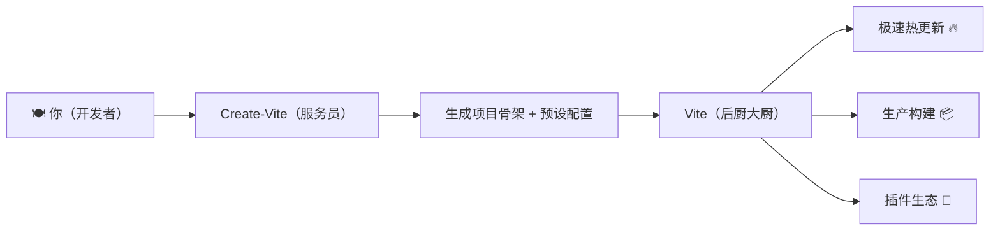
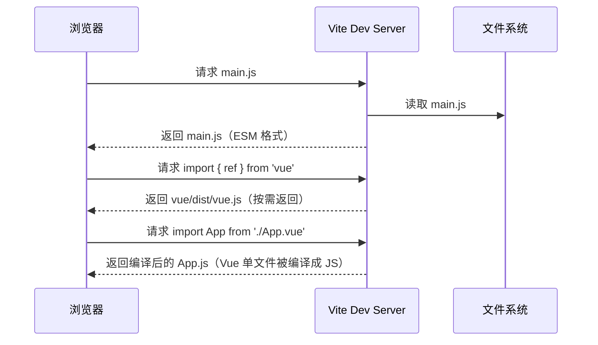
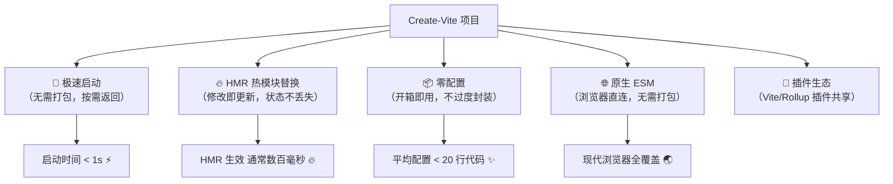

+++
title = "第1章 Create-Vite 是什么"
weight = 10
date = 2026-03-27T21:01:00+08:00
type = "docs"
description = ""
isCJKLanguage = true
draft = false
+++

# 第一章：Create-Vite 是什么

## 1.1 Create-Vite 与 Vite 的关系

想象一下，你走进了一家全自动机器人餐厅。

**Vite** 就是那个后厨里挥汗如雨的大厨——它负责真正把饭做出来（构建你的项目），切菜、炒菜、摆盘，一条龙服务。没有它，你的前端代码就只能是一堆原始食材（`.js`、`.vue`、`.css` 文件），永远上不了餐桌。

**Create-Vite** 呢？它是那个站在门口、带你去座位的服务员。它不做饭，但它能根据你的口味——"我要一份 Vue 加番茄味（TypeScript）"——在 3 秒之内帮你把点餐系统打开，把桌子椅子摆好，甚至把厨房的锅碗瓢盆都给你备齐了。

用一句正经的话说就是：

> **Vite** 是一套前端构建工具链（bundler / dev server），而 **Create-Vite** 是 Vite 官方出品的一个"项目脚手架生成器"（CLI Scaffolding Tool）。Create-Vite 的唯一使命，就是帮你快速生成一个已经配置好 Vite 的项目骨架。

用一张图来表达它们俩的关系，那是再清楚不过了：



用更技术一点的比喻：

- **Vite** 类似于 Webpack、Parcel、Rollup，属于"构建工具"（Bundler）这一层。它做的事情是：**把你的源代码 + 依赖，打包/编译成浏览器能直接运行的静态文件**。
- **Create-Vite** 类似于 Vue CLI 的 `vue create`、Create-React-App 的 `npx create-react-app`，属于"脚手架"（Scaffolding）这一层。它做的事情是：**问你几个问题（选框架、选语言），然后给你吐出一个配置完毕的文件夹**。

打个更接地气的比方：

> Vite 是"装修队"，Create-Vite 是"装修队的客服热线"。你打电话说"我要装修"，客服给你派单、量房、出方案；装修队才真正进场砸墙铺砖。

**所以，它们的关系非常清楚：**

```
Create-Vite 依赖 Vite，但 Vite 不依赖 Create-Vite。

你可以直接手动创建一个 vite.config.js，然后手写 index.html，这完全OK。
但有了 Create-Vite，你不需要记那些繁琐的初始化步骤，一行命令搞定。
```

### 版本号上的关联

Create-Vite 的版本号跟 Vite 主版本保持同步。比如你安装了 `create-vite@5.x.x`，那它生成出来的项目，用的就是 `vite@5.x.x`——版本号完全一致，不存在"小版本号略有差异"这种尴尬情况。

这很合理对吧？总不能让服务员给你推荐"今天的招牌菜是明天才研发出来的新菜"吧。

---

## 1.2 Create-Vite 的本质（项目脚手架 / 模板生成器）

先来聊一个灵魂拷问：**什么是"脚手架"？**

如果你盖过房子，或者看过建筑工人施工，你一定见过那种层层叠叠的**钢管脚手架**——它们不是房子的一部分，但工人踩着它才能砌墙、刷漆。房子盖好之后，脚手架是要拆掉的。

软件开发里的"脚手架"（Scaffolding）也是这个意思：

> **脚手架 = 项目初始化阶段的一套标准模板 + 配置工具**，帮你把"地基"和"架子"搭好，你只需要往里面填业务代码就行了。

没有脚手架的时代，程序员新建一个项目是这样的：

```
1. 手动创建一个文件夹
2. 手动创建一个 package.json
3. 手动 npm install vite
4. 手动创建 vite.config.js
5. 手动创建 index.html
6. 手动创建 src/main.js
7. 手动配置各种路径别名
8. 手动安装 eslint、prettier...
9. ...然后发现漏了一步，从头再来
```

有了 Create-Vite 之后，变成了这样：

```bash
npm create vite@latest
# 选框架 → 选语言 → 回车
cd my-project
npm install
npm run dev
```

**3 步，齐活！** （连打字快点的人都能在 5 秒内搞定）

Create-Vite 本质上就是一个**命令问答机器人** + **预设模板库**。它的内部逻辑简单到令人发指：

```
输入：你想要什么？（框架 + 语言）
↓
处理：在模板库里找到对应的模板
↓
输出：一个配置完善的文件夹
```

### 它生成的"模板"里都有啥？

以最常见的 Vue + TypeScript 模板为例，Create-Vite 会给你生成这样一整套东西：

```
my-vue-project/
├── index.html          # 入口 HTML，浏览器访问的第一个文件
├── package.json        # 项目的"身份证"，写了依赖、脚本、版本
├── vite.config.ts      # Vite 的配置文件（这个我们后面重点讲）
├── tsconfig.json       # TypeScript 的配置文件
├── src/
│   ├── main.ts         # 应用的入口 JS/TS 文件
│   ├── App.vue         # 根组件（Vue 特有的组件文件格式）
│   ├── assets/         # 静态资源文件夹（图片、字体等）
│   └── style.css       # 全局样式文件
└── public/             # 公共静态资源（不会被 Vite 处理，原样复制）
```

所有这些，如果让你自己配，没个把小时搞不定（还得是熟悉 Vite 的前提下）。Create-Vite 用了大概 **5 秒**全部搞定。

### Create-Vite 支持哪些模板？

这是它的重头戏——Create-Vite 支持的框架种类，多到可以开一个"前端框架世博会"：

| 框架 | 命令后缀 | 适用场景 |
|------|---------|---------|
| **Vue** | `--template vue` | 响应式 UI 开发，最受欢迎 |
| **Vue + TS** | `--template vue-ts` | 大型 Vue 项目，类型安全 |
| **React** | `--template react` | Facebook 出品，生态庞大 |
| **React + TS** | `--template react-ts` | 大型 React 项目首选 |
| **React + SWC** | `--template react-swc` | 用 SWC 替代 Babel，速度更快 |
| **Svelte** | `--template svelte` | 编译时框架，轻量飞快 |
| **Svelte + TS** | `--template svelte-ts` | Svelte + 类型安全 |
| **Preact** | `--template preact` | 轻量级 React 替代，3KB |
| **Solid** | `--template solid` | 响应式，类 React 语法 |
| **Lit** | `--template lit` | Web Components 开发 |
| **Vanilla** | `--template vanilla` | 纯原生 JS，不用框架 |
| **Vanilla + TS** | `--template vanilla-ts` | 纯 JS + TypeScript |

不管你用什么框架，Create-Vite 都给你准备好了对应的"套餐"。选就是了。

### 模板是怎么实现的？

好奇的同学可能会问：Create-Vite 怎么知道这么多模板？

答案是：**模板本质上是 GitHub 仓库里的代码文件夹**。当你执行 `npm create vite@latest -- --template vue` 时，Create-Vite 做的其实就是：

```bash
# 大致等价于下面这行命令（理解原理就好）
npx degit github:vitejs/vite/packages/create-vite/template-vue my-project
```

`degit` 是一个下载 GitHub 仓库（或子文件夹）的工具。Vite 官方把所有模板都维护在 [vite/packages/create-vite/template-*](https://github.com/vitejs/vite/tree/main/packages/create-vite) 目录下。

所以你也可以这样理解 Create-Vite：

> Create-Vite = 一个更聪明的 `degit` + 交互式问答 + 环境检查 + 依赖安装的一站式工具。

---

## 1.3 Create-Vite 的诞生背景（对比 Webpack / CRA / Vue CLI）

### 前端工具的"进化史"——让我们从远古时代讲起

在正式介绍 Create-Vite 之前，我们有必要了解一下它的"家族史"——前端构建工具这几年的腥风血雨。

### 1.3.1 刀耕火种：什么构建工具都不用

2010 年左右，前端开发是这样的：

```html
<!DOCTYPE html>
<html>
<head>
    <link rel="stylesheet" href="style.css">
</head>
<body>
    <div class="button">点我</div>
    <script src="jquery.min.js"></script>
    <script src="app.js"></script>
</body>
</html>
```

没有模块系统，没有打包，没有压缩。所有 JS 文件全靠**约定顺序**来加载——`jquery.min.js` 必须写在 `app.js` 前面，否则报错。

问题很快出现了：项目大了之后，文件越来越多，依赖关系越来越乱，维护成本爆炸。

### 1.3.2 模块化萌芽：RequireJS / SeaJS

2011 年，AMD（Asynchronous Module Definition）和 CMD（Common Module Definition）标准出现了，对应的工具是 RequireJS 和 SeaJS。

这时候的代码终于可以这样写了：

```javascript
// 定义一个模块
define(['jquery'], function($) {
    return {
        init: function() {
            $('.button').click(function() {
                alert('Hello!');
            });
        }
    };
});
```

**但问题依然存在**：这些模块化方案都是**运行时加载**的，性能很差，而且配置繁琐得要命。

### 1.3.3 Grunt 时代：任务自动化

2012 年，**Grunt** 出现了。它本身不是一个打包工具，而是一个"任务 runner"。你可以配置它来压缩文件、合并 CSS、编译 LESS 等。

但 Grunt 的配置方式极其反人类——一个中等项目的 Gruntfile.js 可能要写几百行配置对象。江湖人称："写 Grunt 配置的难度，不亚于背一本字典。"

### 1.3.4 Webpack 时代：打包为王

2014 年，**Webpack** 横空出世，彻底改变了前端开发的格局。

Webpack 提出了两个革命性概念：

- **一切皆模块**：JS、CSS、图片、字体……所有文件都可以通过 `import` 或 `require` 引入，形成一个依赖图（Dependency Graph）。
- **代码分割（Code Splitting）**：可以把代码分成多个 chunk，按需加载。

Webpack 配置大概是这个样子（以 Vue 项目为例）：

```javascript
// vue.config.js（Vue CLI 基于 Webpack 的配置）
module.exports = {
  configureWebpack: {
    entry: './src/main.js',
    output: {
      filename: 'js/[name].[contenthash:8].js',  // 输出文件名带 hash，防缓存
      path: path.resolve(__dirname, 'dist'),     // 输出到 dist 目录
    },
    module: {
      rules: [
        {
          test: /\.vue$/,     // 匹配 .vue 文件
          loader: 'vue-loader', // Vue 官方 loader，用于编译 .vue 单文件组件
        },
        {
          test: /\.css$/,     // 匹配 CSS 文件
          use: ['style-loader', 'css-loader'],  // css-loader 解析 @import 和 url()，style-loader 把样式注入到 DOM
        },
      ],
    },
    plugins: [
      new HtmlWebpackPlugin({ template: './public/index.html' }),  // 自动生成 HTML 并注入 JS
      new VueLoaderPlugin(),   // Vue 组件编译插件
    ],
  },
};
```

**Webpack 很强大，但代价是什么？**

一个词——**慢**。当你的项目大了，每次修改代码，Webpack 要重新构建整个依赖图，这个过程叫做 **rebundle**，在大型项目中可能需要 **几十秒甚至几分钟**。

每次改一行 CSS，等 30 秒才能看到效果——这种体验，用过的人都知道有多崩溃。

### 1.3.5 Create-React-App（CRA）：封装 Webpack 的尝试

2016 年，Facebook 推出了 **Create-React-App**（CRA），目的就是让开发者**不需要配置 Webpack** 就能创建 React 项目。

```bash
npx create-react-app my-app
cd my-app
npm start
```

CRA 把 Webpack 的配置全部封装在了 `react-scripts` 这个包里。开发者不需要知道 Webpack 在背后干了什么，只需要写代码就行。

**但 CRA 的问题**：

- 一旦你需要自定义 Webpack 配置（比如加个别名、加个插件），就必须要 `eject`（弹出）配置，弹出之后你就再也享受不了 CRA 的更新了。
- Webpack 的构建速度问题依然存在，大项目依然很慢。

### 1.3.6 Vue CLI：Vue 官方的脚手架

2016 年，Vue 官方推出了 **Vue CLI**，它也是基于 Webpack 的，提供了图形界面和插件系统。

```bash
npm install -g @vue/cli       # 全局安装 Vue CLI
vue create my-vue-app          # 交互式创建项目
```

Vue CLI 比 CRA 更进一步，支持插件扩展。但它依然没有解决 Webpack 慢的核心问题。

### 1.3.7 Vite 的诞生：一切从 ESM 开始

2020 年 6 月，一个叫 **Evan You**（尤雨溪）的大神发布了 **Vite 1.0**。

Evan You 同时也是 **Vue** 的作者，所以 Vite 和 Vue 的关系天然就很近——Vite 的很多设计理念，都借鉴了 Vue 的简洁哲学。

Vite 的核心理念，用一句话概括就是：

> **开发环境：不打包，直接用原生 ESM；生产环境：用 Rollup 打包。**

这是什么意思呢？

传统 Webpack 的工作方式：

```
源代码 → [Webpack 打包成一整个 bundle] → 浏览器加载 bundle
```

Vite 的工作方式（开发环境）：

```
浏览器请求 → Vite Dev Server 按需返回模块 → 浏览器直接运行 ESM
```



这就是为什么 Vite 的启动速度是**毫秒级**——它根本不做打包，只是起了一个静态文件服务器，按需返回文件。

### 1.3.8 Create-Vite：Vite 的"官方推荐初始化工具"

2021 年 2 月，**Vite 2.0** 发布，同年 **Create-Vite** 正式登场，成为 Vite 官方推荐的初始化工具。

它的使命非常明确：**让任何人都能在 30 秒内创建一个配置完善的 Vite 项目。**

从 Webpack → CRA/Vue CLI → Vite → Create-Vite，这条进化链的背后逻辑是：

```
Webpack 功能强大，但配置复杂且冷启动慢 → CRA/Vue CLI 封装了配置，但依然没解决慢的问题
↓
想从根本上解决构建速度问题 → Vite 诞生（基于浏览器原生 ESM，开发环境不打包）
↓
Vite 虽好，但初始化项目还是要手动配置 → Create-Vite 让这一切一键搞定
```

Create-Vite 就是 Vite 生态的"**易用性解决方案**"。

---

## 1.4 核心特性概览（极速启动 / HMR / 零配置 / ESM 原生）

### 1.4.1 极速启动：告别"等半分钟"的痛苦

用过 Webpack 的人都知道，新建一个 Vue/React 项目，`npm install` 之后，`npm run dev` 那一下是最痛苦的——Webpack 要先把你所有的依赖打包一遍，这个过程叫做 **冷启动**（Cold Start）。

一个中等规模的项目，冷启动可能需要 **30 秒到 2 分钟**。这段时间里你只能盯着终端发呆，喝口水，看看窗外，发呆……

**Vite 完全不需要这个过程。**

Create-Vite 创建的项目，启动开发服务器的速度是：

```
普通项目（< 100 个模块）：< 1 秒
中型项目（< 1000 个模块）：1 ~ 3 秒
大型项目（> 1000 个模块）：依然 < 10 秒
```

为什么这么快？因为 Vite 在开发环境下**根本不做打包**。它只是起了一个静态文件服务器，你请求哪个文件，它就返哪个文件。

类比一下：

- **Webpack** 像你要吃火锅，服务员说"我去把整头牛给你牵来、现切现涮"——等得你饿晕。
- **Vite** 像自助火锅，你点什么菜，服务员给你上什么菜——随吃随点，立马上桌。

### 1.4.2 热模块替换（HMR）：丝滑的修改体验

HMR（Hot Module Replacement）是 Vite 开发体验的核心保障。

**没有 HMR 的时候**，你改一个按钮的颜色：

```
改代码 → 保存 → Webpack 重新打包（30秒） → 浏览器刷新 → 看到效果
```

**有了 HMR 之后**，你改一个按钮的颜色：

```
改代码 → 保存 → Vite 精准替换该模块（通常数百毫秒内） → 浏览器自动更新 → 看到效果
```

更重要的是：**页面状态不会丢失**。你填了一半的表单、滚到一半的页面，HMR 之后全都还在。

这就像给汽车换轮胎——**不用停车，直接换**。而不是传统方式那样必须熄火、重启（页面刷新）。

### 1.4.3 零配置：开箱即用的幸福感

用过 Vue CLI 或 CRA 的同学应该知道，虽然它们也封装了配置，但一旦你要改 Webpack 配置（比如换个 loader、加个插件），就面临"弹出（eject）还是不用"的艰难选择。

Create-Vite 生成的 `vite.config.js`，从头到尾读一遍，大概就是这个样子：

```javascript
// vite.config.js
import { defineConfig } from 'vite'  // Vite 提供的配置函数，加点类型提示
import vue from '@vitejs/plugin-vue'  // Vue 插件，编译 .vue 文件

// defineConfig 就是给配置加个"类型提示外套"，让你写配置时能有 IDE 自动补全
export default defineConfig({
  plugins: [vue()],  // 注册 Vue 插件——有了它，Vite 才能认识 .vue 文件
})
```

就这么几行，清清楚楚。

对比一下 Webpack 配置……（我就不放图了，怕吓到你）

Vite 的零配置体现在很多方面：

- **TypeScript**：开箱即用，不需要额外安装 `ts-loader` 或配置 `tsc`
- **CSS 预处理器**：Sass/Less/Stylus 只需安装对应包（如 `npm install -D sass`），Vite 会自动处理，不需要手动配置 loader
- **JSON**：直接 `import data from './data.json'`，不需要 `json-loader`
- **ESM**：原生支持 `import/export`，不需要额外转译

### 1.4.4 ESM 原生：跟上时代的脚步

**ESM**（ECMAScript Modules）是 JavaScript 的官方模块系统，从 ES6（ES2015）开始引入。它的语法你现在应该很熟悉：

```javascript
// 命名导出
export const name = 'Create-Vite'
export function greet() {
    console.log('Hello, ESM!')  // Hello, ESM!
}

// 默认导出
export default function() {
    console.log('我是默认导出')  // 我是默认导出
}
```

```javascript
// 导入
import { name, greet } from './module.js'
import App from './App.vue'
```

传统的打包工具（Webpack、Parcel）需要在**开发环境**就把所有模块打包成一个/几个文件，浏览器拿到的是打包后的代码。

Vite 选择了另一条路：**信任浏览器**。

现代浏览器（2017 年之后的版本）都支持原生 ESM。Vite 直接告诉浏览器："你自己按需加载这些模块吧，我不管了。"这样开发服务器只需要返回原始文件，节省了打包时间。

到了**生产环境**，Vite 才真正动用 **Rollup**（一个专注于库和框架打包的优化工具）来做最终的构建输出。Rollup 特别擅长处理 ESM 模块的打包_tree-shaking_，能生成更小的包体积。

```
开发环境：Vite Dev Server → 浏览器原生 ESM → 快如闪电 ⚡
生产环境：Rollup 打包器 → 高度优化的静态文件 → 体积最小化 📦
```

### 特性一览图



---

## 本章小结

本章我们从零认识了 Create-Vite 和它的"老爹"Vite：

- **Create-Vite** 是 Vite 官方出品的项目脚手架，用来快速生成配置完善的 Vite 项目；**Vite** 才是真正负责构建（打包、热更新、插件扩展）的核心工具。两者是"服务员 + 大厨"的关系，缺一不可。

- Create-Vite 本质上是一个**模板生成器**，支持 Vue、React、Svelte、Vanilla 等 12+ 种框架模板，以及 JavaScript / TypeScript 两种语言选项，一行命令就能生成完整项目骨架。

- Create-Vite 诞生于 2021 年 2 月，是前端构建工具演进史的最新成员。它站在 Webpack（功能强大但慢）、CRA/Vue CLI（封装但难定制）的肩膀上，采用了**基于浏览器原生 ESM**的全新思路，从根本上解决了冷启动慢的问题。

- Create-Vite（继承 Vite）的四大核心特性：**极速启动**（不打包，按需返回）、**HMR 热模块替换**（通常数百毫秒内更新，状态保留）、**零配置**（开箱即用，不过度封装）、**原生 ESM**（开发环境信任浏览器，生产环境 Rollup 优化打包）。

记住这四大特性，它们会贯穿我们整个 Create-Vite 学习之旅。
