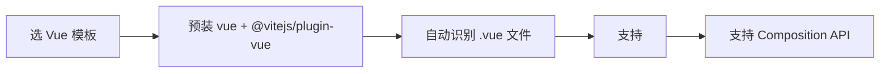
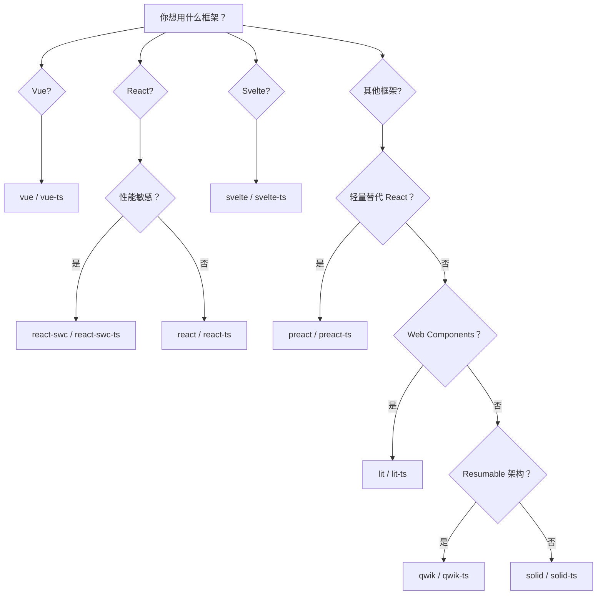
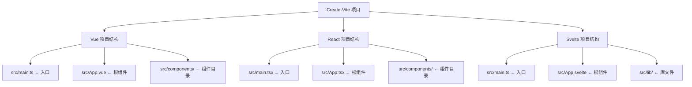
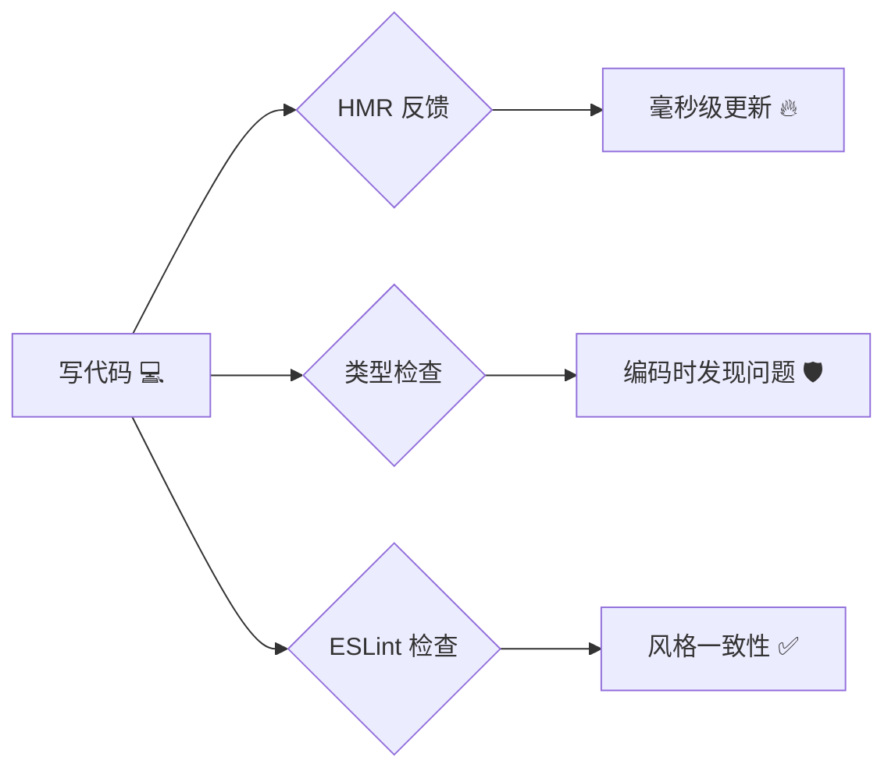

+++
title = "第2章 Create-Vite 能做什么"
weight = 20
date = 2026-03-27T21:01:00+08:00
type = "docs"
description = ""
isCJKLanguage = true
draft = false
+++

# 第二章：Create-Vite 能做什么（用途）

## 2.1 快速初始化前端项目

### 2.1.1 什么是"初始化"？为什么它值得专门做一个工具？

写代码之前，项目要先"站起来"。这个"站起来"的过程，就是**初始化**（Initialization）。

你可以把一个前端项目想象成一座毛坯房：

- **地基**：项目文件夹、Git 仓库
- **水电**：配置文件（package.json、tsconfig.json 等）
- **装修**：依赖安装、目录结构规划
- **家具**：入口文件、组件模板

如果你不借助任何工具，这套"毛坯房"得你自己一砖一瓦盖：

```bash
mkdir my-project && cd my-project
touch package.json
# 手动写 package.json 内容...
npm install vite vue @vitejs/plugin-vue
# 手动创建目录结构
mkdir src public
# 手动写 vite.config.js
# 手动写 index.html
# 手动写 src/main.js
# 手动写 src/App.vue
# 手动配置 tsconfig.json
# ...
# 两个小时过去了
```

Create-Vite 的存在，就是**把这套毛坯房变成精装交付**——你只需要说"我要三室一厅"，它就把钥匙直接交到你手里。

### 2.1.2 Create-Vite 初始化一个项目需要多久？

答案是：**30 秒以内**（不含依赖安装）。

```bash
# 这行命令，从敲下去到看到选项，平均耗时 5 秒
npm create vite@latest
```

真正耗时间的是 `npm install`（安装依赖），这一步取决于你的网速和项目大小——但这步不管是 Create-Vite 还是手动配置，都免不了。

### 2.1.3 初始化的成果：开箱即检

Create-Vite 初始化完成的项目，是可以直接运行的——不用你再做任何配置。

以 Vue 模板为例，创建完之后目录结构如下：

```
my-vue-project/
├── index.html          # 🌟 浏览器打开的第一个文件，Vite 的入口
├── package.json        # 🌟 项目的"身份证"，记录了所有依赖和脚本
├── vite.config.ts      # 🌟 Vite 配置文件（如果选 TS 版本）
├── tsconfig.json       # 🌟 TypeScript 配置文件（如果选 TS 版本）
├── src/
│   ├── main.ts         # 🌟 JS/TS 入口文件
│   ├── App.vue         # 🌟 根组件
│   ├── assets/         # 静态资源（图片、字体等，会被 Vite 处理）
│   └── style.css       # 全局样式
└── public/             # 公共静态资源（不会被处理，原样复制）
```

这就是 Create-Vite 给你的"精装房"——**拎包入住**。

---

## 2.2 提供多种框架模板（Vue / React / Svelte / Vanilla / Preact / Lit / Solid / Qwik）

### 2.2.1 为什么需要框架模板？

如果你去买电脑，品牌机会自带操作系统和预装软件；组装机就得自己装系统、装驱动。

Create-Vite 的框架模板，就是这个"品牌机"——它已经帮你把**适合这个框架的基础设施**全部装好了。

比如你选 Vue 模板，它就会预装 `@vitejs/plugin-vue` 插件；选 React 模板，它就会预装 `@vitejs/plugin-react` 插件。这些插件不是你自己加的，是模板自带的基础设施。

### 2.2.2 Vue 模板

**Vue** 是目前最受欢迎的前端框架之一，由 Evan You 创立，以"渐进式框架"著称。

```bash
npm create vite@latest -- --template vue
# 或者 Vue + TypeScript
npm create vite@latest -- --template vue-ts
```

生成的模板自带：

- `@vitejs/plugin-vue`：让 Vite 认识 `.vue` 单文件组件
- `vue` 包本身
- 基本的 `App.vue` 和 `main.js` 入口



### 2.2.3 React 模板

**React** 是 Facebook 出品的老牌框架，生态极其庞大，是目前全球使用最广泛的 UI 框架。

```bash
npm create vite@latest -- --template react
# 或者 React + TypeScript
npm create vite@latest -- --template react-ts
```

React 模板还有一个"加速版"——**SWC 模板**：

```bash
npm create vite@latest -- --template react-swc
```

什么是 SWC？它是 **Speedy Web Compiler** 的缩写，一个用 Rust 写的 JavaScript 编译器，速度比 Babel 快 **20 倍**（大部分场景下）。如果你的项目很大，编译时间能省不少。

> ⚠️ 注意：SWC 并不是 React 专属——Vue 也有 `vue-swc` 和 `vue-swc-ts` 两个 SWC 模板（原理和 React 版完全一样）。只是目前 SWC 模板在 React 生态里更常见，大家一提起 SWC 就想到 React 而已。

### 2.2.4 Svelte 模板

**Svelte** 是一个"编译器型"框架——它不在浏览器里运行框架代码，而是在**构建时就把框架代码编译成原生 JS**。

这意味着：Svelte 编译出来的代码，**没有框架运行时**，体积超小。

```bash
npm create vite@latest -- --template svelte
# 或者 Svelte + TypeScript
npm create vite@latest -- --template svelte-ts
```

### 2.2.5 Vanilla 模板（原生 JS）

有时候你不需要任何框架，只是想**快速写个静态页面**或者**做个工具类项目**。

Vanilla 模板就是你的菜——它给你纯原生 ESM 项目，什么框架都没有，干净得像一张白纸。

```bash
# 纯原生 JS
npm create vite@latest -- --template vanilla
# 原生 JS + TypeScript
npm create vite@latest -- --template vanilla-ts
```

适合场景：

- 写一个浏览器小工具
- 做一个简单的落地页
- 学习 JavaScript 本身（不用被框架概念干扰）
- 开发一个开源工具库

### 2.2.6 Preact / Solid / Lit / Qwik 模板

| 模板 | 框架特点 | 适合谁 |
|------|---------|---------|
| `preact` / `preact-ts` | React 的 3KB 轻量替代，API 与 React 高度兼容 | 性能敏感型项目 |
| `solid` / `solid-ts` | 类 React 语法但更高效，无 Virtual DOM | 喜欢 React 但追求极致性能 |
| `lit` / `lit-ts` | Google 的 Web Components 库 | Web Components 开发 |
| `qwik` / `qwik-ts` | resumable 架构，懒加载到极致 | 追求首屏性能的项目 |

### 2.2.7 模板选择决策图



---

## 2.3 支持 JavaScript 和 TypeScript

### 2.3.1 JavaScript vs TypeScript：一个永恒的选择题

关于这个话题，程序员们可以吵上三天三夜。但 Create-Vite 的态度很洒脱：**都支持，你随意。**

JavaScript（JS）是浏览器原生语言，所有浏览器都能运行。

TypeScript（TS）是 JavaScript 的**超集**——它给 JS 加了**类型系统**。简单说就是：JS 代码能跑的地方，TS 都能跑，但 TS 能发现 JS 发现不了的错误。

### 2.3.2 Create-Vite 的语言组合

Create-Vite 把语言选项和框架选项做了**正交组合**——两者独立，互不影响。

```
框架选项 × 语言选项 = Create-Vite 的模板矩阵
```

| 语言 | 特点 | 适合人群 |
|------|------|---------|
| **JavaScript（.js）** | 纯 JS，无类型约束，代码更简洁 | 初学者 / 快速原型 / 小项目 |
| **TypeScript（.ts）** | 强类型，写得更"累"但更安全 | 中大型项目 / 团队协作 |
| **JavaScript + SWC（React 专属）** | 用 SWC 替代 Babel，编译更快（部分版本可用） | React 项目，想加速 |
| **TypeScript + SWC（React 专属）** | TS + SWC，最强性能组合（部分版本可用） | 大型 React 项目 |

> 💡 敲黑板：SWC 在 Create-Vite 的某些版本中是 React 的专属"加速包"。如果你发现自己的 Create-Vite 版本里找不到 `react-swc` 模板，说明该版本已经用其他方式（比如 React Compiler）来替代 SWC 的加速效果了。

### 2.3.3 TypeScript 到底有什么好处？

这里插播一段 TypeScript 的"广告"，因为很多人学 TS 都是被"卷"进来的，不知道它到底好在哪。

**没有 TS 的 JS（JavaScript）：**

```javascript
function calculatePrice(price, discount) {
    return price + discount
}

const total = calculatePrice(100, 20)
console.log(total)  // 120
```

看起来没问题。但突然有一天，有人传了个字符串进来：

```javascript
const total = calculatePrice("100", 20)  // "100" + 20 = ???
console.log(total)  // "10020" ← 字符串拼接！JS 把数字 100 变成了字符串 "100"，然后执行了拼接操作
```

天哪——JavaScript 居然把 `"100"` 当成了字符串，和数字 `20` 一拼接，变成了 `"10020"`！这就是传说中的**类型隐式转换**陷阱——一个不小心，`+` 就从数学加法变成了字符串拼接。

**有 TS 的 JS（TypeScript）：**

```typescript
function calculatePrice(price: number, discount: number): number {
    return price + discount
}

const total = calculatePrice(100, 20)
console.log(total)  // 120
```

你敢传字符串？TS 编译器直接给你一个**红色下划线**，告诉你"类型不对"，甚至不需要运行代码，**编码时就告诉你了**。

这就是 TypeScript 的核心价值：**把运行时才暴露的 Bug，提前到编译时就发现。**

### 2.3.4 初学者该选 JS 还是 TS？

建议路线：

```
第一阶段（入门）：选 JavaScript
  ↓
第二阶段（有项目经验）：试水 TypeScript，从 .d.ts 类型声明文件开始
  ↓
第三阶段（熟练）：全面使用 TypeScript，体验真香
```

Create-Vite 的 TS 模板是**真·开箱即用**——不需要你手动配置 `tsconfig.json`，不需要安装 `ts-loader`，创建出来就能跑。

---

## 2.4 标准化项目结构

### 2.4.1 什么是"标准化项目结构"？

想象一下，你们公司有 10 个前端开发，每个人创建项目的目录结构都不一样：

```
开发A：/src /components /utils /views /router
开发B：/src /widget /helpers /page /routes
开发C：/app /modules /lib /views /navigation
```

一个月之后，代码库变成了一锅粥——找文件靠猜，改代码靠缘分。

**Create-Vite 解决的第一个问题就是：统一起跑线。**

不管谁用 Create-Vite 创建 Vue 项目，目录结构都是这样的：

```
src/
├── main.js           # 入口文件（固定命名）
├── App.vue           # 根组件（固定命名）
├── assets/           # 静态资源（Vite 会处理）
│   └── logo.png
└── public/           # 公共资源（原样复制）
    └── favicon.ico
```

这就保证了：**同一个框架模板创建的项目，大家的目录结构是一样的。**

### 2.4.2 标准结构的深层价值

1. **新成员 onboarding 更快**：新人来了，看一个项目的结构，就知道文件大概在哪。
2. **工具链适配**：ESLint、Prettier、IDE 插件都可以基于这个标准结构做配置。
3. **自动化工具友好**：静态分析工具、测试工具都可以假设一套标准的目录布局。

### 2.4.3 框架特有的标准结构

不同框架模板生成的目录结构也有细微差别，但总体思路一致：



---

## 2.5 配套开发体验（热更新 / 类型提示 / Lint）

### 2.5.1 热更新（HMR）：修改代码不用刷新页面

这是 Vite 最让人"上瘾"的特性之一。

**传统开发模式（没有 HMR）：**

```
你：修改了样式文件
浏览器：（等待重新打包……30秒）
浏览器：（页面刷新）
你：我刚才滚到哪了来着？……哦，顶部。
```

**Vite 开发模式（有 HMR）：**

```
你：修改了样式文件
Vite：热更新 < 100ms
浏览器：（样式已更新，页面没有任何闪烁，滚动位置保持）
你：继续干活
```

关键是：**页面状态不丢失**。你填了一半的表单、拖拽到一半的元素、滚动到一半的页面——全部保留。

### 2.5.2 类型提示（TypeScript）：你的代码有"副驾驶"

如果你选择了 TS 模板，你得到的不仅是类型检查，还有一个**24 小时在线的副驾驶**。

当你写代码的时候，IDE（VS Code）会实时告诉你：

- 这个函数的参数是什么类型？
- 这个对象的属性有哪些？
- 你传的类型对不对？
- 这个 API 的返回值是什么？

```typescript
// 你在写这样的代码
import { ref } from 'vue'

const count = ref(0)
count.value  // ← VS Code 会告诉你：value 是 number 类型
```

这就是 **TypeScript Language Server** 在工作——Create-Vite + VS Code 的组合，会在你敲代码的时候就把类型错误标红，省去一半的调试时间。

### 2.5.3 Lint（代码检查）：帮你揪出"代码里的害虫"

**Lint** 的本意是"棉绒"（衣服上粘的毛球），引申为代码中的"小毛病"——风格问题、潜在 Bug、未使用的变量等等。

Create-Vite 的 TS 模板里，已经预置了类型检查工具和基础的 ESLint 规则（Vue 模板用 `vue-tsc`，React 模板用 `tsc`）。

你可以在 `package.json` 的 scripts 里看到：

```json
{
  "scripts": {
    "dev": "vite",
    "build": "tsc && vite build",
    "lint": "eslint ."
  }
}
```

> 💡 Vue 模板用 `vue-tsc` 做类型检查（因为要处理 `.vue` 文件），React 模板用 `tsc`。两者都是 TypeScript 官方编译器，只是前者多了对 Vue 单文件组件的支持。

运行 lint：

```bash
npm run lint
```

如果你的代码有风格问题或者类型错误，终端会给出清晰的报错信息，告诉你**第几行有什么问题**。

### 2.5.4 开发体验三件套一览

| 特性 | 作用 | 开发者感受 |
|------|------|-----------|
| **HMR** | 修改即更新，状态保留 | 丝滑流畅 |
| **类型提示** | 编码时实时反馈类型错误 | 有"副驾驶"陪练 |
| **Lint** | 自动化检查代码质量 | 有"老司机"帮你 Code Review |



---

## 本章小结

本章我们全面了解了 Create-Vite 的"能力圈"：

- **快速初始化**：一行命令，30 秒内生成完整项目骨架，拎包入住。
- **多种框架模板**：覆盖 vanilla、Vue、React、React-SWC、Svelte、Preact、Solid、Lit、Qwik 共 **9 大框架**，每个框架都支持 JS / TS 两种语言变体，加上 React 专属的 SWC 变体，总计 **18 个模板**，无论你用什么技术栈，Create-Vite 都有对应的"精装套餐"。
- **JavaScript / TypeScript 双支持**：JS 更适合入门和快速原型，TS 适合中大型项目和团队协作。两者是正交选项，可自由组合。
- **标准化项目结构**：保证同一框架的项目结构一致，新成员上手更快，工具链更友好。
- **配套开发体验**：HMR 热更新（毫秒级、状态保留）、TypeScript 类型提示（编码时的实时反馈）、ESLint 代码检查（自动化 Code Review）——三件套齐备，开发体验直接拉满。
