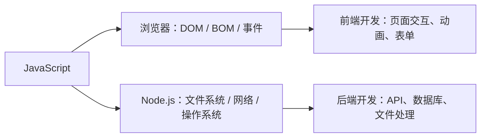
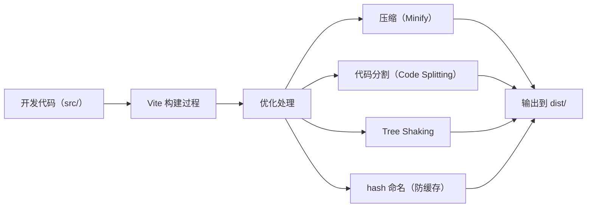
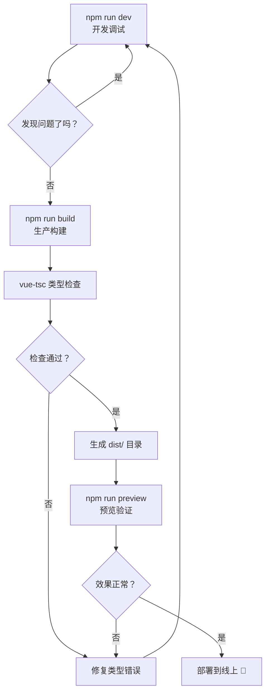

+++
title = "第3章 Create-Vite 怎么用"
weight = 30
date = 2026-03-27T21:01:00+08:00
type = "docs"
description = ""
isCJKLanguage = true
draft = false
+++

# 第三章：Create-Vite 怎么用

## 3.1 环境准备（Node.js / npm / pnpm / yarn）

### 3.1.1 在开始之前，先问自己一个问题：什么是 Node.js？

好，如果你已经知道 Node.js 是什么，可以直接跳到 3.1.2。

如果你不知道，那我们先把这个概念搞清楚。

**Node.js** 就是：让 JavaScript 能够在**浏览器以外的地方运行**的一个运行时（Runtime）。

JavaScript 最初是专门为浏览器设计的语言，只能在浏览器里跑。但 2009 年，有个叫 **Ryan Dahl** 的大神用 Chrome 的 V8 引擎（就是浏览器里跑 JS 的那个核心部件）做了个独立程序，让 JavaScript 也能在服务器上运行——这就是 Node.js。



所以：

- **浏览器里的 JS**：操作网页、响应用户点击、发送网络请求
- **Node.js 里的 JS**：读写文件、连接数据库、运行命令行工具

Create-Vite 就是一个 Node.js 程序，所以你的电脑上**必须有 Node.js**，它才能跑起来。

### 3.1.2 安装 Node.js

**方式一：去官网下载安装包（推荐小白）**

去 [https://nodejs.org](https://nodejs.org)，下载 **LTS（Long Term Support）版本**。

> LTS 版本的意思是"长期支持版"，稳定性好，更新慢，适合大多数用户。别下 Current（最新版），那个是给想追新功能的人准备的，容易出 Bug。

下载完成后，双击安装包，一路点"下一步"即可。

安装完成后，打开你的终端（Windows 下按 `Win + X`，选"终端"或"PowerShell"），输入：

```bash
node -v
# v20.18.0  ← 这就是你的 Node.js 版本号
npm -v
# 10.8.2   ← 这是 npm 的版本号
```

如果能看到版本号，说明安装成功了。

**方式二：用 nvm 管理多个 Node.js 版本（推荐进阶用户）**

有时候你需要同时用不同版本的 Node.js（比如公司老项目用的是 16.x，新项目用的是 20.x）。

这时候就需要 **nvm**（Node Version Manager）来管理多个版本。

Windows 用户下载 [nvm-windows](https://github.com/coreybutler/nvm-windows/releases)，macOS/Linux 用户用 homebrew 安装：

```bash
# macOS / Linux 安装 nvm
brew install nvm

# 安装最新版 Node.js
nvm install node

# 安装指定版本
nvm install 18

# 切换到 18 版本
nvm use 18

# 查看已安装的版本
nvm list
```

### 3.1.3 包管理器：npm / pnpm / yarn

**npm**（Node Package Manager）是 Node.js 自带的包管理器，装完 Node.js 就有。它是全球最大的 JavaScript 开源库仓库。

**pnpm** 是一个更快的替代方案，由 npm 的前员工创建，特点是安装速度更快、磁盘占用更少。

**yarn** 是 Facebook 出品的包管理器，曾经比 npm 快很多，现在差距已经缩小了。

三者的命令对照表：

| 操作 | npm | pnpm | yarn |
|------|-----|------|------|
| 安装依赖 | `npm install` | `pnpm install` | `yarn` |
| 添加依赖 | `npm install vue` | `pnpm add vue` | `yarn add vue` |
| 删除依赖 | `npm uninstall vue` | `pnpm remove vue` | `yarn remove vue` |
| 运行脚本 | `npm run dev` | `pnpm run dev` | `yarn run dev` |
| 全局安装 | `npm install -g vue` | `pnpm add -g vue` | `yarn global add vue` |

**Create-Vite 本身不挑食**，三种包管理器它都能生成对应的模板。但是！它只会帮你生成代码，安装依赖这一步需要你自己动手——Create-Vite 可没有贴心到替你选择用哪个包管理器装包哦。

> 💡 **小建议**：如果你用 pnpm，创建项目后手动运行 `pnpm install`，会生成 `pnpm-lock.yaml`；如果你用 yarn，就运行 `yarn`，会生成 `yarn.lock`。**不要混用不同的包管理器**（今天用 npm，明天用 pnpm），否则就会出现"明明别人能跑我跑不了"的诡异问题，到时候排查起来能让你怀疑人生。

### 3.1.4 验证环境准备完毕

在开始用 Create-Vite 之前，先跑一下这个命令，确认环境 OK：

```bash
node -v    # 查看 Node.js 版本（要求 >= 18）
npm -v     # 查看 npm 版本
```

只要这两个命令都能输出版本号，你就可以开始用 Create-Vite 了！

---

## 3.2 创建命令详解（npm create vite@latest）

### 3.2.1 万能创建公式

Create-Vite 的创建命令，只有一个公式：

```bash
npm create vite@latest
```

这是最完整的写法。拆解一下：

- `npm create`：使用 npm 来执行"创建"操作
- `vite@latest`：拉取最新版本的 create-vite 包（@latest 表示最新稳定版）
- 后面还可以跟 `-- --template xxx` 来指定模板

> 注意：`@latest` 是 npm 的版本标签，"最新版本"的意思。如果不写，默认也是 latest。

### 3.2.2 命令的完整执行流程

当你敲下这行命令，Node.js 会在幕后做这些事情：

```mermaid
sequenceDiagram
    participant 用户
    participant npm
    participant create-vite
    participant npm_registry
    participant 网络

    用户->>npm: npm create vite@latest
    npm->>网络: 下载 create-vite 包
    网络-->>npm: create-vite 包内容
    npm->>create-vite: 执行 create-vite
    create-vite->>用户: ? 请选择项目名称
    用户->>create-vite: my-project
    create-vite->>用户: ? 请选择框架
    用户->>create-vite: vue
    create-vite->>用户: ? 请选择语言
    用户->>create-vite: TypeScript
    create-vite->>npm_registry: 下载 @vitejs/template-vue-ts
    npm_registry-->>create-vite: 模板文件
    create-vite->>create-vite: 解压模板
    create-vite->>用户: ✅ 项目创建成功
```

### 3.2.3 命令行参数：不交互直接创建

Create-Vite 支持跳过交互，直接在命令里把所有选项都写死：

```bash
# 完整版：项目名 + 模板 + 一次性确认（--yes 或 -y）
npm create vite@latest my-project -- --template vue-ts --yes
```

参数说明：

| 参数 | 作用 | 可选值 |
|------|------|--------|
| `my-project` | 项目文件夹名 | 任意合法的文件夹名 |
| `--template` / `-t` | 指定模板 | `vue`、`react`、`vue-ts`、`react-ts`、`svelte` 等 |
| `--yes` / `-y` | 跳过所有交互，直接用默认值 | 无 |

### 3.2.4 给项目命名的学问

给项目起名字也是个技术活，有几个规则要遵守：

1. **只能包含字母、数字、连字符（-）和下划线（_）**
2. **不能以数字开头**
3. **不能是 Node.js 保留字**（如 `node_modules`、`favicon.ico`）

```bash
# 合法的项目名
npm create vite@latest my-awesome-project
npm create vite@latest todo_app
npm create vite@latest project123

# 非法的项目名（会报错）
npm create vite@latest 123project      # ❌ 不能以数字开头
npm create vite@latest my project      # ❌ 不能有空格
npm create vite@latest node_modules    # ❌ 保留字
```

### 3.2.5 create-vite vs create-vite@latest

有人会用 `npx create-vite`，有人用 `npm create vite@latest`，这两种写法有什么区别？

```bash
# 写法一：npm create（推荐，语义更清晰）
npm create vite@latest my-project

# 写法二：npx create-vite（等效，但 npx 语义上是"临时执行"）
npx create-vite my-project
```

本质上是一样的，`npm create` 底层调用的就是 `npx`。

---

## 3.3 交互式选项说明（框架选择 / 语言选择）

### 3.3.1 交互流程全解析

当你运行 `npm create vite@latest`（不传参数），Create-Vite 会一步步问你问题。

**第一步：项目名称**

```
? Project name: ›                    ← 光标停在这里，等你输入
```

你直接输入名字，然后回车。如果直接回车不输入，默认会用 `vite-project`。

**第二步：框架选择**

```
? Select a framework: ›
  ▸ vanilla
    vue
    react
    preact
    svelte
    lit
    solid
```

用**上下方向键**选择，选中后按**回车**确认。

当前选中的项前面会有一个**黑色圆点**（▸）。

**第三步：语言选择**

选完框架之后，会出现语言选择（不同框架可选的语言不同）：

```
? Select a variant: ›
  ▸ typescript
    javascript
    variant with swc
```

Vue 模板的语言选项（简洁明了，没有那些花里胡哨的复选框）：

```
? Select a variant: ›
  ▸ typescript
    javascript
```

React 模板的语言选项：

```
? Select a variant: ›
  ▸ typescript
    javascript
    [ ] Add SWC Features (Replacement for Babel)
```

### 3.3.2 不同框架的语言选项一览

| 框架 | 选项 1 | 选项 2 | 选项 3 |
|------|--------|--------|--------|
| Vanilla | TypeScript | JavaScript | - |
| Vue | TypeScript | JavaScript | - |
| React | TypeScript | JavaScript | SWC |
| Svelte | TypeScript | JavaScript | - |
| Preact | TypeScript | JavaScript | - |
| Solid | TypeScript | JavaScript | - |
| Lit | TypeScript | JavaScript | - |

### 3.3.3 SWC 是什么？要不要勾选？

React 用户专属问题。

**SWC**（Speedy Web Compiler）是一个用 **Rust** 语言写的 JavaScript/TypeScript 编译器，它的作用和 **Babel** 一样——把新版本 JS/TS 转译成旧版本 JS，让旧浏览器也能运行。

但 SWC 比 Babel 快得多：

```
Babel 编译速度：基准速度
SWC 编译速度：20x Babel 速度
```

要不要勾选？建议：

- **小型项目（< 100 个文件）**：不用勾，用 Babel 就行，差别不大。
- **大型项目（> 500 个文件）**：勾上，每次保存都能省好几秒。
- **学习阶段**：不用勾，少装一个依赖，少一个变数。

### 3.3.4 完整的交互演示（以创建 Vue + TS 项目为例）

```
$ npm create vite@latest

___                              ___                 _
/\_/\                           / __\               /\ \
/\ \ \___     __   ___   _____ \ \/\ \  ___     ___\ \ \___      __
\ \ \ / __`\ / __`\/ __`\/\ '__`\ \ \ \ \ / __`\ / __`\ \ \ __`\  / __`\
\ \ \/\ \L\ \/\ \L\ \ \L\ \ \ \L\ \ \ \_\ \ \L\ \/\ \L\ \ \ \L\ \/\ \L\ \
\ \ \ \____/\ \____/\____/\ \ ,__/ \ \____/\ \____/\ \____/\ \___,__/\____\
 \ \ \/___/  \/___/  \/___/  \ \ \/  \/___/  \/___/  \/___/  \/__,_ /\/___/
  \ \_\                          \ \_\
   \/_/                           \/_/

? Project name: › vue-ts-demo
? Select a framework: ›   vue

? Select a variant: ›   typescript

Scaffolding project in /path/to/vue-ts-demo...

Done. Now run:

  cd vue-ts-demo
  npm install
  npm run dev
```

---

## 3.4 项目目录结构解读

### 3.4.1 先整体看一眼

不管你选了什么模板，Create-Vite 生成的项目都遵循同样的**顶层结构规范**：

```
your-project/
├── index.html          # 🌟 入口 HTML，整个项目的起点
├── package.json        # 🌟 项目配置，身份证一样的文件
├── vite.config.ts      # 🌟 Vite 构建工具的配置
├── tsconfig.json       # 🌟 TypeScript 配置（TS 项目才有）
├── .gitignore          # Git 提交时忽略哪些文件
├── src/                # 🌟 源代码目录（你的代码基本都在这里）
│   ├── main.ts         # 🌟 TS 入口文件（JS 项目则是 main.js）
│   ├── App.vue         # 🌟 根组件（React 项目则是 App.tsx，以此类推）
│   ├── assets/         # 静态资源（会被 Vite 处理）
│   └── style.css       # 全局样式
└── public/             # 公共资源（不会被处理，原样复制到输出目录）
```

### 3.4.2 核心文件详解

**index.html：浏览器的入口**

这个文件和普通的 HTML 不太一样，它有一个关键标记：

```html
<!doctype html>
<html lang="zh-CN">
  <head>
    <meta charset="UTF-8" />
    <link rel="icon" type="image/svg+xml" href="/vite.svg" />
    <meta name="viewport" content="width=device-width, initial-scale=1.0" />
    <title>Create-Vite App</title>
  </head>
  <body>
    <div id="app"></div>       <!-- Vue/React 的根挂载点 -->
    <script type="module" src="/src/main.ts"></script>  <!-- 入口 TS（JS 项目则是 main.js） -->
  </body>
</html>
```

注意到 `<script type="module" src="/src/main.ts">` 这行了吗？

`type="module"` 告诉浏览器：**"这是一个 ES Module，用原生 ESM 的方式加载它。"** 这就是 Vite 能够实现"不打包直接运行"的关键。

`/src/main.js` 路径的 `/` 开头，表示**从项目根目录**开始找文件，这是 Vite 的路径约定。

**package.json：项目身份证**

```json
{
  "name": "vue-ts-demo",          // 项目名
  "private": true,                 // 私有项目，意思是"这个项目不发布到 npm"
  "version": "0.0.0",             // 版本号
  "type": "module",                // 告诉 Node.js：这个项目用 ESM 方式解析 import
  "scripts": {                     // 脚本命令
    "dev": "vite",                // 启动开发服务器
    "build": "vue-tsc && vite build",  // 生产构建
    "preview": "vite preview"      // 预览生产构建产物
  },
  "dependencies": {                 // 生产依赖（项目运行时需要的包）
    "vue": "^3.5.13"
  },
  "devDependencies": {              // 开发依赖（开发时用，上线后不需要）
    "@vitejs/plugin-vue": "^5.2.1",
    "typescript": "~5.6.2",
    "vite": "^6.0.5",
    "vue-tsc": "^2.2.0"
  }
}
```

**vite.config.ts：Vite 的配置**

```typescript
import { defineConfig } from 'vite'  // 导入 Vite 的配置工具函数
import vue from '@vitejs/plugin-vue'  // 导入 Vue 插件

// defineConfig 的作用是给配置对象加上 IDE 类型提示
export default defineConfig({
  plugins: [vue()],  // 注册 Vue 插件——这是 Vue 项目必须的一行
})
```

### 3.4.3 src 目录结构（Vue + TS 版本）

```
src/
├── main.ts         # 应用入口文件，Vue 实例的"出生地"
├── App.vue         # 根组件，所有其他组件的"老祖宗"
├── assets/
│   └── vue.svg     # Vue Logo 图片
└── style.css       # 全局样式，所有组件都共享这份样式
```

**src/main.ts 的内容（Vue + TS 模板）：**

```typescript
import { createApp } from 'vue'  // 从 vue 包里导入 createApp 函数
import App from './App.vue'      // 导入根组件
import './style.css'            // 导入全局样式

const app = createApp(App)      // 创建 Vue 应用实例
app.mount('#app')              // 把实例挂载到 index.html 的 #app 元素上
```

### 3.4.4 public 目录 vs src/assets 目录

这是很多新手容易搞混的点，一定要弄清楚：

```
public/           → 原封不动地复制到输出目录，不做任何处理
src/assets/       → 会被 Vite 处理（压缩、hash 命名等）
```

| 资源类型 | 放哪里 | 为什么 |
|---------|--------|--------|
| 不需要处理的静态文件（favicon.ico） | `public/` | Vite 直接复制，不打包 |
| 需要处理的图片、字体 | `src/assets/` | Vite 会给它们加 hash，防缓存 |
| 第三方库的静态资源 | 取决于情况 | 一般不用放 |

---

## 3.5 启动开发服务器（npm run dev）

### 3.5.1 第一步：安装依赖

在创建完项目之后，你首先要做的是安装依赖：

```bash
cd vue-ts-demo              # 进入项目目录
npm install                 # 安装 package.json 里列出的所有依赖
```

`npm install` 会根据 `package.json` 里的 `dependencies` 和 `devDependencies`，从 npm 仓库下载对应的包，存到 `node_modules` 文件夹里。

安装完成后，你会看到项目里多了一个 `node_modules` 文件夹（非常大，里面是各种依赖的代码）。

### 3.5.2 第二步：启动开发服务器

```bash
npm run dev
```

这行命令会执行 `package.json` 里 `scripts.dev` 对应的命令，也就是 `vite`。

### 3.5.3 开发服务器启动后的界面

正常情况下，你会看到类似这样的输出：

```
VITE v6.0.5  ready in 234 ms

➜  Local:   http://localhost:5173/          ← 这是本地访问地址
➜  Network: http://192.168.1.100:5173/      ← 同一局域网的其他设备也可以访问
➜  press h + enter to show help              ← 按 h 显示更多快捷键
```

然后你打开浏览器，访问 `http://localhost:5173/`，就能看到你的 Create-Vite 项目跑起来了！

### 3.5.4 实时体验 HMR（热模块替换）

现在来做个实验：

1. 用 VS Code 打开项目
2. 找到 `src/style.css`，把 `body` 的 `background-color` 改成 `hotpink`（没错，粉红色）
3. 保存文件
4. 回到浏览器看一下

页面**瞬间**变成了粉红色背景，但页面没有刷新，你之前滚动的位置、输入的内容、打开的弹窗……全部保持原样。

这就是 HMR 的魔力！

### 3.5.5 开发服务器的常用快捷键

在终端里按相应的键：

| 快捷键 | 功能 |
|--------|------|
| `h` + 回车 | 显示帮助菜单（所有快捷键） |
| `o` + 回车 | 在浏览器中打开 |
| `O` + 回车 | 在浏览器中打开（严格模式） |
| `c` + 回车 | 清屏 |
| `u` + 回车 | 显示服务端 URL |
| `q` + 回车 | 退出（关闭开发服务器） |

---

## 3.6 生产构建（npm run build）

### 3.6.1 什么是"生产构建"？

开发服务器是给你程序员看的——它有 HMR、有源码映射、有调试信息……

但当你要**把网站发布到线上**（给真实用户访问）时，这些调试信息就都是"垃圾"了——它们让文件变得很大，让加载变慢。

**生产构建**（Build）就是把所有开发时的代码，转换成**最优化的线上版本**的过程。



### 3.6.2 执行构建

```bash
npm run build
```

这行命令会执行 `package.json` 里的 `build` 脚本。

对于 Vue + TS 项目，`build` 通常是这样配置的：

```json
"build": "vue-tsc && vite build"
```

意思是：**先运行 TypeScript 类型检查（vue-tsc），检查通过后再构建（vite build）**。

### 3.6.3 构建输出

构建完成后，你会看到类似这样的输出：

```
vite v6.0.5 building for production...
✓ 45 modules transformed.
dist/index.html                   0.46 kB │ gzip:  0.30 kB
dist/assets/vendor-8a1b2c3d.js   85.32 kB │ gzip: 27.54 kB
dist/assets/index-9e8f7g6h.css    1.23 kB │ gzip:  0.67 kB
✓ built in 1.23s
```

输出的文件都在 `dist/` 目录里。这个目录里的内容，就是你要部署到服务器上的。

### 3.6.4 dist 目录里的文件说明

```
dist/
├── index.html              # 入口 HTML（已经注入了正确的 JS/CSS 路径）
├── assets/
│   ├── index-xxxxx.js      # 主包（经过压缩和混淆）
│   └── index-yyyyy.css     # 样式文件
```

注意到文件名里的 `xxxxx` 和 `yyyyy` 了吗？那是 **hash 值**，用来做**缓存控制**的。当文件内容变了，hash 才会变；没变的话，文件名不变，浏览器就会继续用缓存。

### 3.6.5 构建前的类型检查

`vue-tsc` 是 Vue 官方出的 TypeScript 类型检查工具。它会扫描你写的所有 `.ts` 和 `.vue` 文件，检查类型错误。

```bash
# 如果你只想检查类型，不想构建，可以单独运行
npx vue-tsc --noEmit
```

如果类型检查发现问题，终端会报红，告诉你**哪一行有什么类型错误**。构建会被终止。

```
src/App.vue:6:9 - error TS2322: Type 'number' is not assignable to type 'string'.
  6 | const message: string = 123
                        ~~~~~
```

---

## 3.7 预览构建产物（npm run preview）

### 3.7.1 为什么需要预览？

`npm run build` 只是把文件生成到 `dist/` 目录，但这些文件**还没有被放到任何服务器上**。

`npm run preview` 就是让你在本地**模拟一个静态文件服务器**，预览最终效果。

### 3.7.2 预览命令

```bash
npm run preview
```

运行后会看到：

```
➜  Local:   http://localhost:4173/
➜  press h + enter to show help
```

注意：**预览服务器的端口是 4173**（开发服务器是 5173），不要搞混了。

### 3.7.3 预览和开发的区别

| 对比项 | `npm run dev` | `npm run preview` |
|--------|-------------|-----------------|
| 用途 | 开发时用 | 验证构建产物 |
| 端口 | 5173 | 4173 |
| 速度 | 即时，按需编译 | 直接serve静态文件 |
| 有 HMR 吗？ | ✅ 有 | ❌ 无 |
| 代码是原始的吗？ | ✅ 是 | ❌ 否（是压缩混淆后的） |

> 💡 **最佳实践**：每次 `npm run build` 之后，都用 `npm run preview` 验证一下构建产物是否正常，再部署到线上。

### 3.7.4 完整的"开发→构建→预览"流程



---

## 本章小结

本章我们完整走了一遍 Create-Vite 的使用流程：

- **环境准备**：需要安装 Node.js（要求 >= 18，推荐 LTS 版本）和 npm/pnpm/yarn 任一包管理器。
- **创建命令**：`npm create vite@latest` 是核心命令，可配合 `--template` 和 `--yes` 实现非交互式创建。
- **交互式选项**：分三步——输入项目名 → 选择框架（上下键+回车）→ 选择语言（TypeScript / JavaScript / SWC）。
- **目录结构**：Create-Vite 生成的项目有统一规范：`index.html`（入口）、`package.json`（项目配置）、`vite.config.ts`（Vite 配置，TS 项目才有）、`src/`（源代码）、`public/`（静态资源）。
- **开发服务器**：`npm run dev` 启动，带 HMR 热更新；默认端口 5173。
- **生产构建**：`npm run build` 执行，TypeScript 类型检查（vue-tsc）通过后才真正打包，输出到 `dist/` 目录。
- **预览**：`npm run preview` 在本地模拟线上环境，端口 4173，构建后必做验证。

这套"开发→构建→预览"的流程，是每个 Create-Vite 项目的标准生命周期。
