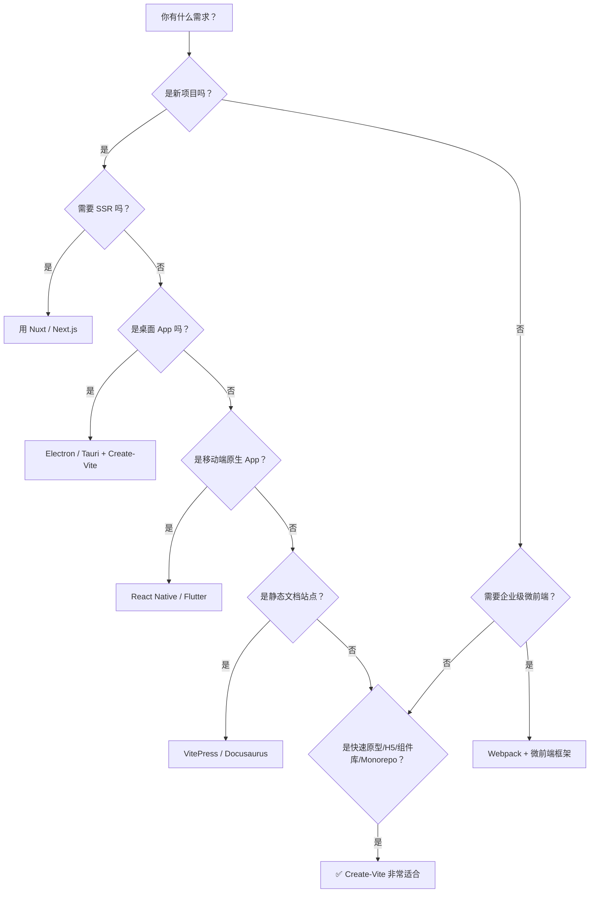

+++
title = "第4章 Create-Vite 用在哪"
weight = 40
date = 2026-03-27T21:01:00+08:00
type = "docs"
description = ""
isCJKLanguage = true
draft = false
+++

# 第四章：Create-Vite 用在哪（适用场景）

## 4.1 新项目初始化

### 4.1.1 什么时候该用 Create-Vite 初始化新项目？

这是 Create-Vite 最核心的使用场景——**当你决定开始一个新项目时，第一件事就是用它来搭架子**。

无论你是：

- 刚决定做一个新产品，想快速验证想法
- 接手了一个全新的需求，从零开始
- 想学习一个新框架（比如 React 或 Svelte），需要一个练手的项目

Create-Vite 都能让你**在 5 分钟内**把项目框架搭好，直接开始写业务代码。

### 4.1.2 从零到可运行：完整演示

假设你要做一个新的 Vue 3 + TypeScript 项目，整个过程如下：

```bash
# 1. 创建项目（30 秒，交互式填写）
npm create vite@latest
# 选择：vue-ts

# 2. 进入目录
cd vue-project

# 3. 安装依赖（约 1-2 分钟，取决于网速）
npm install

# 4. 启动开发服务器
npm run dev
# 输出：
# VITE v6.0.5 ready in 234 ms
# ➜  Local: http://localhost:5173/

# 5. 打开浏览器访问 http://localhost:5173/
# 看到 Vue 欢迎页面了吗？成功了！
```

### 4.1.3 非交互式创建（适合自动化脚本）

如果你想把 Create-Vite 集成到自己的脚本里，或者用在 CI/CD（持续集成/持续部署）流程中，可以使用各框架提供的非交互式命令：

```bash
# Vue 项目（非交互式）
npm create vue@latest my-vue-project -- --typescript --no-jsx

# React 项目（非交互式）
npx create-react-app my-react-project --template typescript

# Svelte 项目（非交互式，新版 CLI 使用 sv）
npx sv create my-svelte-project --template minimal --types ts

# 或者直接指定模板（仅部分模板支持）
npm create vite@latest my-project -- --template vue-ts
```

> 💡 **小贴士**：Create-Vite 本身不支持 `--yes` 全自动模式，但大多数框架官方 CLI（如 Vue、React、Svelte）都提供了非交互式参数。如果你在 CI 环境中无法交互，直接查看目标框架的 CLI 文档会更靠谱。

---

## 4.2 快速原型开发

### 4.2.1 什么是"原型开发"？

原型（Prototype）就是"先画个草图，看看能不能跑"。它的核心目的是**快速验证想法**，而不是"把代码写漂亮"。

原型开发的特点是：

- **快**：不追求代码质量，不做异常处理，不写注释（注释是什么？好吃吗？）
- **能用**：页面能跑，功能能演示
- **不交付**：原型不是生产代码，原型验证完是要重写的

> 有句老话说得好：**"永远不要在原型上写生产代码"**。但很多程序员偏偏不听，结果原型越改越大，最后变成了"屎山"——你以为你在修 bug，其实你在给山体钻孔。

### 4.2.2 Create-Vite 为什么适合原型开发？

因为它**足够快，足够简单，足够像真实项目**。

快体现在：项目创建 5 秒，启动不到 1 秒，修改代码 HMR < 50ms。改完代码不用等，页面就热乎乎地更新了。

简单体现在：不需要配置 Webpack，不需要装 20 个插件，不需要写配置文件。开箱即用，懒人福音。

像真实项目体现在：模板里的结构、TypeScript 配置、ESLint 配置，都是真实项目会用到的技术栈。不会让你学到"野路子"。

### 4.2.3 原型开发场景举例

**场景一：验证 UI 方案**

产品经理扔给你一个 Figma 设计稿，说"你觉得这个动效能不能实现？"

用 Create-Vite 创建一个 Vanilla（原生 JS）项目，2 分钟就能把动效跑起来，比在 Figma 里反复看帧动画要直观得多。

**场景二：验证技术方案**

后端说"我要给你一个 GraphQL API"，你想先试试水。Create-Vite + React 模板，10 分钟就能搭一个展示 GraphQL 数据的 Demo。

**场景三：给客户演示**

客户想要一个"差不多能用的 Demo"，Create-Vite + Vue + 几行代码，一个晚上就能给他做个能点能看的演示版本。

### 4.2.4 快速原型工具对比

| 工具 | 适合场景 | 优点 | 缺点 |
|------|---------|------|------|
| **Create-Vite + 框架** | 需要组件化的原型 | 技术栈真实，可复用 | 需要写代码 |
| **CodeSandbox** | 不在本地，想在线协作 | 无需安装，打开浏览器就能用 | 依赖云端，功能有限 |
| **Figma + Prototyping** | UI/UX 稿演示 | 设计工具原生支持 | 不能写逻辑 |
| **HTML + Bootstrap** | 最简单的静态页面 | 不用构建工具 | 无法做复杂交互 |

---

## 4.3 组件库 / 类库开发

### 4.3.1 用 Create-Vite 开发组件库

如果你在写一个**开源组件库**或者**内部 UI 库**，Create-Vite 也是非常合适的选择。

这类项目的特点是：

- 代码以**导出函数/组件**为主，不是页面应用
- 需要**文档站点**来展示组件效果
- 需要**打包工具**生成多种格式（ESM / CJS / UMD）
- 需要**单元测试**

### 4.3.2 组件库项目结构参考

```
my-component-lib/
├── src/
│   ├── Button/
│   │   ├── Button.vue      # 组件源码
│   │   ├── Button.test.ts  # 单元测试
│   │   └── index.ts        # 导出入口
│   └── index.ts            # 库的整体导出
├── docs/                   # 文档站点（VitePress）
├── vite.config.ts          # 构建配置
└── package.json
```

### 4.3.3 组件库的构建配置

组件库和普通应用项目最大的区别在于**构建配置**——你需要把代码打包成**多种格式**，让使用者无论用什么工具都能引入：

```typescript
// vite.config.ts（组件库版本）
import { defineConfig } from 'vite'
import vue from '@vitejs/plugin-vue'
import { resolve } from 'path'

export default defineConfig({
  plugins: [vue()],
  build: {
    // 库模式——专门为"给别人用"而优化的构建
    lib: {
      entry: resolve(__dirname, 'src/index.ts'),  // 入口文件
      name: 'MyComponentLib',                      // 全局变量名（UMD）
      formats: ['es', 'cjs', 'umd'],              // 三种输出格式
      fileName: (format) => {
        return `my-lib.${format}.js`              // 输出文件名
      }
    },
    rollupOptions: {
      // 外部依赖——组件库本身不打包 vue，因为使用者已经有了
      external: ['vue'],
      output: {
        // 为每种格式提供 IIFE（立即调用）版本
        globals: {
          vue: 'Vue'  // 告诉打包器：vue 这个全局变量名是 'Vue'
        }
      }
    }
  }
})
```

这段配置的作用是：打包出一个**不需要额外依赖**的 JS 文件，同时也输出**需要先安装 vue** 的 ESM 版本。

---

## 4.4 静态站点搭建

### 4.4.1 Create-Vite 能做静态站点吗？

**当然能！**

静态站点（Static Site）就是由 HTML、CSS、JS 组成的，不需要后端服务器、不需要数据库，部署在 CDN 上，加载速度极快的网站。

典型用途：

- 文档站点（如 Vite 官方文档、Vue 官方文档）
- 个人博客
- 产品官网
- Landing Page（产品介绍页）

### 4.4.2 静态站点框架 + Create-Vite 组合

Create-Vite 原生支持的框架里，有几个非常适合做静态站点：

| 框架 | 静态站点方案 | 说明 |
|------|------------|------|
| **Vue** | `vite-plugin-pages` + `vite-plugin-vue-layouts` | 路由+布局，适合内容型站点 |
| **Svelte** | `svelte-spa-router` | 轻量，适合快速搭建 |
| **React** | `vite-plugin-ssg` 或 Gatsby | SSG 静态站点生成 |
| **Vanilla** | 不需要框架 | 最轻量的方式 |

### 4.4.3 一个最简单的静态页面

用 Vanilla 模板，创建一个静态站点，只要几分钟：

```bash
npm create vite@latest my-site -- --template vanilla
cd my-site
npm install
```

然后在 `index.html` 里写内容：

```html
<!doctype html>
<html lang="zh-CN">
  <head>
    <meta charset="UTF-8" />
    <meta name="viewport" content="width=device-width, initial-scale=1.0" />
    <title>我的静态站点</title>
    <link rel="stylesheet" href="/src/style.css">
  </head>
  <body>
    <header>
      <h1>🌟 我的个人网站</h1>
      <nav>
        <a href="/">首页</a>
        <a href="/about.html">关于</a>
        <a href="/blog.html">博客</a>
      </nav>
    </header>

    <main>
      <h2>欢迎来到我的网站</h2>
      <p>这是一个用 Create-Vite 搭建的静态站点。</p>
    </main>

    <footer>
      <p>&copy; 2026 我的网站</p>
    </footer>

    <script type="module" src="/src/main.js"></script>
  </body>
</html>
```

### 4.4.4 部署静态站点

Create-Vite 构建出来的 `dist/` 目录，可以直接上传到任何静态托管服务：

```bash
npm run build
# 构建产物在 dist/ 目录
```

| 平台 | 部署难度 | 免费额度 |
|------|---------|---------|
| GitHub Pages | ⭐ 简单 | ✅ 免费（公开仓库） |
| Vercel | ⭐ 最简单 | ✅ 免费（有额度） |
| Netlify | ⭐ 最简单 | ✅ 免费（有额度） |
| Cloudflare Pages | ⭐ 简单 | ✅ 免费（无限） |

以 Vercel 为例，部署只需要一行命令：

```bash
# 安装 Vercel CLI
npm install -g vercel

# 在项目目录执行
vercel

# 按回车确认选项，等待部署完成
# 获得一个类似 https://my-site.vercel.app 的线上地址
```

---

## 4.5 Electron / Tauri 桌面应用

### 4.5.1 Create-Vite 能做桌面应用？

可以！Create-Vite 虽然是前端工具，但配合 **Electron** 或 **Tauri**，可以开发出原生桌面应用。

**Electron** 是 GitHub（现在是微软）出品的桌面应用框架，用 HTML/CSS/JS 来构建 Windows 和 macOS 应用。VS Code、Slack、Discord 都是用 Electron 写的。

**Tauri** 是更轻量的替代方案，用 Rust 编写核心，性能更好，体积更小（Electron 的 App 动不动就 100MB+，Tauri 只有约 10MB 左右）。

### 4.5.2 Electron + Create-Vite 的组合

用 Create-Vite 创建前端部分，然后用 Electron 来"包装"成桌面应用：

```bash
# 1. 创建前端项目
npm create vite@latest my-electron-app -- --template vue-ts
cd my-electron-app
npm install

# 2. 安装 Electron 相关依赖
npm install -D electron electron-builder concurrently

# 3. 安装 Vite 的 Electron 插件
npm install -D vite-plugin-electron
```

`vite.config.ts` 配置：

```typescript
import { defineConfig } from 'vite'
import electron from 'vite-plugin-electron'
import vue from '@vitejs/plugin-vue'
import { resolve } from 'path'

export default defineConfig({
  plugins: [
    vue(),
    // 这个插件让 Vite 能够和 Electron 协同工作
    electron([
      {
        entry: 'electron/main.ts',   // Electron 主进程入口
        vite: {
          build: {
            outDir: 'dist-electron',  // Electron 构建产物输出目录
          }
        }
      },
      {
        entry: 'electron/preload.ts',  // 预加载脚本
        onstart(options) {
          // 通知 Electron 窗口重新加载
          options.reload()
        },
        vite: {
          build: {
            outDir: 'dist-electron',
          }
        }
      }
    ])
  ],
  resolve: {
    alias: {
      '@': resolve(__dirname, 'src')  // 路径别名 @ → src
    }
  }
})
```

### 4.5.3 Tauri + Create-Vite 的组合

Tauri 比 Electron 更轻量，安装也更简单：

```bash
# 1. 创建前端项目
npm create vite@latest my-tauri-app -- --template vue-ts

# 2. 安装 Tauri CLI 并初始化
npm install -D @tauri-apps/cli
npx tauri init
# 会提示输入：App 名称、窗口标题、dist 目录、Dev 命令等
```

### 4.5.4 桌面应用场景对比

| 技术栈 | 适用场景 | 包体积 | 性能 | 上手难度 |
|--------|---------|--------|------|---------|
| **Electron + Create-Vite** | 需要复杂 UI 的桌面 App | 较大（~100MB） | 一般 | 中等 |
| **Tauri + Create-Vite** | 轻量工具类 App | 极小（~10MB） | 优秀 | 稍有门槛 |
| **NW.js** | 兼容旧方案或特殊需求 | 中等 | 一般 | 较难 |

---

## 4.6 Monorepo 项目中的 Create-Vite

### 4.6.1 Create-Vite 能在 Monorepo 里用吗？

当然能！**Monorepo**（单仓库多包管理）是现代前端工程化的重要实践，Create-Vite 可以在其中大显身手。

典型的 Monorepo 场景：

- **组件库 + 应用同时开发**：一个仓库里既有 UI 组件库，又有使用这个库的业务应用
- **多产品线共享基础包**：几个产品共用一套工具函数或组件
- **pnpm / Turborepo**：用 pnpm workspace 或 Turborepo 管理多包依赖

### 4.6.2 pnpm + Create-Vite 实战

```bash
# 1. 初始化 pnpm workspace
pnpm init

# 2. 创建子包（组件库）
mkdir packages/my-lib
cd packages/my-lib
pnpm init

# 3. 在组件库中使用 Create-Vite 开发
cd packages/my-lib
npm create vite@latest . -- --template vue-ts

# 4. 回到根目录，创建应用
cd ../..
npm create vite@latest apps/web-app -- --template vue-ts
```

`pnpm-workspace.yaml` 配置：

```yaml
packages:
  - 'packages/*'
  - 'apps/*'
```

这样组件库和应用可以在同一个仓库里高效协作，组件库改完后应用立刻能用上。

---

## 4.7 何时不适合用 Create-Vite

### 4.7.1 诚实的自我评估：Create-Vite 不是万能的

说完了 Create-Vite 能做什么，现在来聊一个严肃的话题：**什么时候不该用它？**

了解工具的局限性，比了解工具的优点更重要。

### 4.7.2 不适合的场景一：超大型企业级应用

如果你的项目满足以下条件，Create-Vite + Vite 可能不是最优解：

- **超过 500 个页面/路由**
- **几十人同时在一个代码库里开发**
- **有严格的企业安全合规要求**
- **需要和政府/金融系统对接，有特殊安全审计要求**

这种情况下，**Webpack** 反而可能更合适——因为 Webpack 有更成熟的**微前端**（Micro Frontends）方案，以及更丰富的企业级插件生态。

### 4.7.3 不适合的场景二：需要服务端渲染（SSR）

Create-Vite + Vite 主要面向**单页应用（SPA）**。如果你需要**服务端渲染**（比如 SEO 优化首屏速度），应该用对应的框架方案：

| 需求 | 工具 | 说明 |
|------|------|------|
| Vue + SSR | **Nuxt** | Vue 的 SSR 框架，自动集成 Vite |
| React + SSR | **Next.js** | React 的 SSR/SSG 框架，不用 Create-Vite |
| Svelte + SSR | **SvelteKit** | Svelte 的全栈框架 |

> 注意：Nuxt 和 Next.js 有自己的脚手架（如 `npx nuxi init`），不需要 Create-Vite。

### 4.7.4 不适合的场景三：完全不需要构建的纯文档

如果你只是要写一个**纯 Markdown 文档站点**，不需要任何前端框架，那有更轻量的方案：

- **VitePress**：Vue 官方出品的文档站点工具，基于 Vite，但比 Create-Vite 更适合文档场景
- **Docusaurus**：Facebook 出品的文档工具，基于 React
- **GitBook**：在线文档平台，不需要本地构建

这些工具**内置了 Vite**，但不通过 Create-Vite 来初始化。

### 4.7.5 不适合的场景四：移动端 App 开发

Create-Vite + 前端框架可以做**移动端 H5 页面**，但如果要做**真正的原生 App**（iOS / Android），应该用：

- **React Native**：React 的原生 App 框架
- **Flutter**：Google 的跨平台 UI 工具
- **Capacitor / Cordova**：用 Web 技术打包成原生 App

Create-Vite 不能替代这些工具。

### 4.7.6 使用场景决策图



---

## 本章小结

本章我们全面梳理了 Create-Vite 的适用场景和边界：

- **新项目初始化**：这是 Create-Vite 的主战场，任何新前端项目都可以用它来搭架子，5 分钟内从零到可运行。
- **快速原型开发**：适合验证想法、演示 Demo、技术调研。Create-Vite 的极速启动和 HMR 让原型开发效率大幅提升。
- **组件库 / 类库开发**：配合 `lib` 模式构建配置，可以打包出多种格式（ESM/CJS/UMD）供他人使用的组件库。
- **静态站点搭建**：Vanilla/Vue/React 模板都可以做静态站点，配合 Vercel/Netlify 等平台，部署非常简单。
- **Electron / Tauri 桌面应用**：Create-Vite 提供前端部分，Electron/Tauri 负责桌面包装，可以开发真正的原生桌面应用。
- **Monorepo 支持**：配合 pnpm workspace 等工具，Create-Vite 可以在 monorepo 中同时管理多个应用和共享包。
- **何时不适合**：超大型企业应用（考虑 Webpack）、需要 SSR 的场景（用 Nuxt/Next.js）、纯文档站点（用 VitePress）、原生移动端 App（用 React Native/Flutter）。

总的来说，Create-Vite 适合**大多数中小型前端项目**，是现代前端开发的一把趁手好刀。
