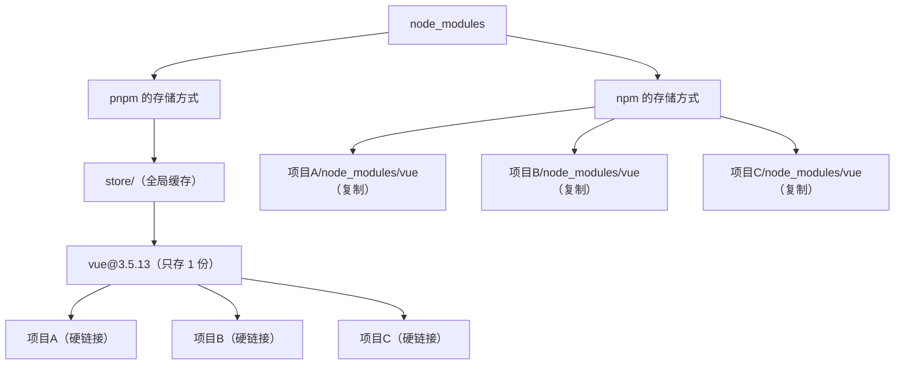

+++
title = "第5章 Create-Vite 注意事项"
weight = 50
date = 2026-03-27T21:01:00+08:00
type = "docs"
description = ""
isCJKLanguage = true
draft = false
+++

# 第五章：使用 Create-Vite 的注意事项

## 5.1 Node.js 版本要求

### 5.1.1 Create-Vite 对 Node.js 版本的"最低消费"

Create-Vite 不是所有 Node.js 版本都能用，它有一个**最低版本要求**。

截至目前，Create-Vite 5.x 要求 **Node.js >= 18.12.0**。

为什么要限制 Node.js 版本呢？因为 Create-Vite 内部用了一些较新的 JavaScript 特性——如果你的 Node.js 太老，这些特性不存在，Create-Vite 就会报一些令人摸不着头脑的错误。与其让你在报错信息里大海捞针，不如直接从源头拦住：版本不够，免谈 🚫。

### 5.1.2 如何检查自己的 Node.js 版本？

```bash
node -v
# v20.18.0  ← 如果这个数字 >= 18，说明版本够用
```

如果你的版本低于 18，需要先升级 Node.js。

### 5.1.3 升级 Node.js 的方法

**Windows 用户：**

直接去 [https://nodejs.org](https://nodejs.org) 下载最新的 LTS 版本，安装即可（会自动覆盖旧版本）。

**macOS / Linux 用户：**

用 nvm 升级（推荐）：

```bash
# 查看当前版本
nvm list

# 安装最新 LTS 版本
nvm install --lts

# 切换到最新 LTS 版本
nvm use --lts

# 设为默认版本
nvm alias default node
```

**或者用 Homebrew（macOS）：**

```bash
brew install node@20
brew link node@20 --force
```

### 5.1.4 版本号里的学问

Node.js 的版本号遵循 **Semantic Versioning（语义化版本）** 规则：

```
v20.18.0
 │ │ │
 │ │ └── Patch 版本（修复 Bug，不改功能）
 │ └──── Minor 版本（新增功能，向后兼容）
 └────── Major 版本（破坏性变更，不兼容旧版本）
```

对于 Create-Vite 来说，只要 **Major 版本 >= 18** 就行，后面的 Minor 和 Patch 不需要关心。

### 5.1.5 Node.js 版本不满足时的报错信息

如果你用的是 Node.js 16，运行 Create-Vite，会看到类似这样的错误：

```
node:events:491
    throw er; // Unhandled 'error' event
    ^
Error: The engine "node" is incompatible with this module.
Expected: ">=18.12.0"
```

解决方案很简单：**升级 Node.js 到 18.12.0 或更高版本**。

---

## 5.2 包管理器的选择与兼容

### 5.2.1 Create-Vite 支持哪些包管理器？

**Create-Vite 原生支持三种包管理器：**

- **npm**（Node.js 内置，无需安装）
- **pnpm**（更快，磁盘占用更少）
- **yarn**（Facebook/Meta 出品，生态成熟，至今仍被广泛使用）

### 5.2.2 pnpm 的特殊之处

**pnpm** 是一个"不走寻常路"的包管理器，它的核心创新是**硬盘空间节省**——堪称"程序员钱包守护者" 💰。

npm 和 yarn 会把每个包的代码复制到每个项目的 `node_modules` 里。如果你有 10 个项目都用 Vue，那 Vue 的代码在硬盘上存了 10 份，相当于买了 10 本同一本书，每本都一模一样的厚度。

pnpm 微微一笑，使出了**硬链接**（Hard Link）技术——10 个项目"共用"同一份 Vue 代码（就像图书馆的同一本书可以被多个人借阅），但每个项目都觉得自己拥有独立的副本，岁月静好，互不干扰。

```
npm/yarn:   vue 代码在磁盘上存 10 份（10 × 87MB = 870MB）——硬盘：这谁顶得住啊 😩
pnpm:       vue 代码在磁盘上存 1 份（87MB），10 个项目共享——皆大欢喜 🎉
```



### 5.2.3 不要混用包管理器！🚨

这是最容易出问题的地方——**在同一个项目里，不要今天用 npm，明天用 pnpm，后天又换成 yarn**。想象一下：你刚跟 npm 谈好了一段稳定的"依赖关系"，转头就去找 pnpm 了，pnpm 也不客气，直接把你的 `package-lock.json` 扔进垃圾桶，自己重新建档——后果？轻则依赖版本打架，重则项目原地爆炸 💥。

每个包管理器都会生成自己的锁文件（相当于依赖的"精确坐标"）：

```
npm:    package-lock.json
pnpm:   pnpm-lock.yaml
yarn:   yarn.lock
```

当你用 `npm install` 安装依赖，生成了 `package-lock.json`，然后换成 `pnpm install`，pnpm 会生成全新的 `pnpm-lock.yaml`——**但它不会帮你"翻译"之前的 package-lock.json**，而是重新解析依赖。结果就是：同一个包，npm 说用 1.2.3，pnpm 觉得 1.2.4 也没问题，"玄学"报错就此诞生。

**正确的做法：从项目创建开始，就选定一个包管理器，一路走到底。** 就像选队友，选好了就别换，目标一致，才能合作愉快 🤝。

### 5.2.4 Create-Vite 自动选择的包管理器

Create-Vite 创建项目时，会**自动检测你当前使用的包管理器**，并用它来生成项目。

```bash
# 如果你的终端里用的是 npm
npm create vite@latest  # → 生成 package-lock.json

# 如果你的终端里用的是 pnpm
pnpm create vite        # → 生成 pnpm-lock.yaml

# 如果你的终端里用的是 yarn
yarn create vite       # → 生成 yarn.lock
```

### 5.2.5 不同包管理器命令对照表

| 操作 | npm | pnpm | yarn |
|------|-----|------|------|
| 创建项目 | `npm create vite@latest` | `pnpm create vite` | `yarn create vite` |
| 安装依赖 | `npm install` | `pnpm install` | `yarn` |
| 添加依赖 | `npm install vue` | `pnpm add vue` | `yarn add vue` |
| 卸载依赖 | `npm uninstall vue` | `pnpm remove vue` | `yarn remove vue` |
| 运行脚本 | `npm run dev` | `pnpm dev` | `yarn dev` |
| 查看已安装包 | `npm list` | `pnpm list` | `yarn list` |

---

## 5.3 环境变量的命名规则（VITE_ 前缀）

### 5.3.1 什么是环境变量？

**环境变量**（Environment Variable）是一种"在代码之外存储配置"的方式。

比如你的项目要连接一个后端 API，不同环境（开发环境、测试环境，生产环境）的 API 地址是不同的。如果你把这些地址写死在代码里，每次换环境都要改代码——这显然是个糟糕的做法。

环境变量就是用来解决这个问题的 🎉。

### 5.3.2 Vite 的环境变量规则：必须以 VITE_ 开头

Vite 有一个独特的安全规则：**只有以 `VITE_` 开头的环境变量，才会被暴露给客户端代码**。

```bash
# .env.development 文件
VITE_API_URL=http://localhost:3000/api     # ✅ 会被暴露
DB_PASSWORD=my-secret-password              # ❌ 不会被暴露，永远留在服务端
```

### 5.3.3 在代码中读取环境变量

```javascript
// 访问 VITE_ 开头的环境变量（浏览器端可用）
const apiUrl = import.meta.env.VITE_API_URL
console.log(apiUrl)  // http://localhost:3000/api

// 访问非 VITE_ 开头的环境变量（Node.js 服务端才可用，浏览器拿不到）
const dbPassword = import.meta.env.DB_PASSWORD
console.log(dbPassword)  // undefined（浏览器里读不到）
```

### 5.3.4 import.meta.env 是什么？

`import.meta` 是 ES2020 引入的一个**元属性**（Meta Property），用来获取当前模块的元信息。

`import.meta.env` 是 Vite 在 `import.meta` 上添加的**环境对象**，包含了 Vite 注入的各种环境信息：

```typescript
// Vite 注入的所有环境变量类型定义
interface ImportMetaEnv {
  readonly VITE_APP_TITLE: string           // 自定义环境变量
  readonly VITE_API_URL: string            // 自定义环境变量
  readonly MODE: string                     // 当前模式：'development' | 'production' | 'test'
  readonly DEV: boolean                    // 是否开发模式
  readonly PROD: boolean                   // 是否生产模式
  readonly BASE_URL: string                // 公共基础路径
}
```

### 5.3.5 为什么要用 VITE_ 前缀？

这是 Vite 的**安全设计**。

前端代码最终是运行在用户浏览器里的，任何人能打开 DevTools 看到你的代码。所以**敏感信息绝对不能放在环境变量里暴露给前端**。

Vite 用 `VITE_` 前缀做了一个**显式的"opt-in"机制**——只有你主动以 `VITE_` 开头的变量，才是"我想让前端看到的"。

> 这就像一个保险箱：`DB_PASSWORD` 锁在服务端，永远不打开；`VITE_API_URL` 是你自己放在桌上的便签，主动公开。

---

## 5.4 浏览器兼容性（ESM 支持要求）

### 5.4.1 Create-Vite 依赖浏览器原生 ESM

这是 Create-Vite（Vite）最重要的限制之一：**它要求浏览器必须支持 ES Modules**。

如果你需要支持 IE11 或其他老旧浏览器，Create-Vite 可能不太适合你。

### 5.4.2 支持 ESM 的浏览器版本

| 浏览器 | 开始支持 ES Modules 的版本 |
|--------|--------------------------|
| Chrome | 61+（2017 年 10 月） |
| Firefox | 60+（2018 年 5 月） |
| Safari | 11+（2017 年 9 月） |
| Edge | 16+（2017 年 10 月） |
| **IE 11** | ❌ 不支持 |

### 5.4.3 如何查看浏览器的 ESM 支持？

在浏览器控制台里输入：

```javascript
console.log('ES Modules supported:', typeof import.meta !== 'undefined')
// true  ← 说明浏览器支持 ESM
```

### 5.4.4 如果必须支持 IE11 怎么办？

如果你的项目**必须支持 IE11**，有两个选择：

**选择一：放弃 Create-Vite，用 Vue CLI（基于 Webpack）** ⚠️

Vue CLI 生成的代码可以通过 Babel 转译成 IE11 兼容的代码。不过要注意，Vue CLI 已进入维护模式（不再积极更新），如果你正在开始新项目，建议优先考虑方案二。

**选择二：用 @vitejs/plugin-legacy**

Vite 官方提供了一个 `legacy` 插件，可以在构建时自动生成兼容旧浏览器的额外产物：

```bash
npm install -D @vitejs/plugin-legacy
```

```typescript
// vite.config.ts
import { defineConfig } from 'vite'
import vue from '@vitejs/plugin-vue'
import legacy from '@vitejs/plugin-legacy'

export default defineConfig({
  plugins: [
    vue(),
    legacy({
      // 为哪些目标浏览器生成兼容代码
      targets: ['defaults', 'not IE 11'],
      // 生成 polyfill
      polyfills: true,
    })
  ]
})
```

### 5.4.5 现代浏览器用户的默认情况

对于绝大多数用户来说（2020 年之后的浏览器），ESM 都是默认支持的。

这意味着：**如果你不需要支持 IE11，Create-Vite 的 ESM 特性不需要你做任何额外配置，开箱即用**。

---

## 5.5 公共资源路径（public 目录）

### 5.5.1 public 目录的作用

`public` 目录是 Create-Vite 项目中**唯一不会被 Vite 处理、直接原样复制到输出目录**的文件夹。

什么文件适合放这里？

- **`favicon.ico`**：网站图标
- **`robots.txt`**：搜索引擎爬虫规则
- **`.well-known/`**：OAuth、OpenID 等协议需要的元数据文件
- **第三方字体包**：不想被 Vite 处理的字体文件

### 5.5.2 public 目录的特点

| 特点 | 说明 |
|------|------|
| **不经过 Vite 处理** | 文件不会被压缩、不会加 hash |
| **原样复制到 dist** | `public/favicon.ico` → `dist/favicon.ico` |
| **通过绝对路径访问** | 引用路径是 `/favicon.ico`，不是 `public/favicon.ico` |
| **不适合放动态内容** | 文件名固定，不适合需要根据构建结果命名的资源 |

### 5.5.3 如何引用 public 里的文件？

```html
<!-- 在 index.html 中使用（绝对路径，/ 表示 public 目录根） -->
<link rel="icon" href="/favicon.ico" />

<!-- 在 JS/CSS 中使用 -->

```

注意：**引用路径以 `/` 开头**，表示从 public 根目录开始访问。

### 5.5.4 public vs src/assets 深度对比

这是最容易搞混的点，一张表说清楚：

| 对比项 | `public/` | `src/assets/` |
|--------|-----------|---------------|
| Vite 处理？ | ❌ 不处理，原样复制 | ✅ 处理（压缩、hash） |
| 引用路径 | `/文件名` | `import` 后使用 |
| 适合放什么 | favicon、robots.txt | 图片、字体（需要优化） |
| 会被 Tree Shaking 吗？ | ❌ 不会 | ✅ 会（未使用的资源不打包） |
| 构建后文件名 | 不变 | 会加 hash（如 `logo.8a1b2c3d.png`） |

---

## 5.6 路径别名与 TypeScript 配置

### 5.6.1 什么是路径别名？

路径别名就是**给长路径起个短名字**。

比如你的项目结构是这样的：

```
src/
├── components/
│   ├── Button/
│   │   ├── Button.vue
│   │   └── index.ts
│   └── Modal/
│       ├── Modal.vue
│       └── index.ts
└── utils/
    └── format.ts
```

在代码里引入这些文件，正常写法是：

```typescript
import Button from '../../../components/Button/Button.vue'
import format from '../../../utils/format.ts'
```

这种 `../../../` 的写法有几个问题：

1. **路径太长**：写起来痛苦
2. **层级关系脆弱**：文件移动一下，路径全要改
3. **容易出错**：数错目录层级是常有的事

用路径别名之后：

```typescript
import Button from '@/components/Button/Button.vue'
import format from '@/utils/format.ts'
```

清爽多了！

### 5.6.2 配置路径别名（vite.config.ts）

```typescript
import { defineConfig } from 'vite'
import vue from '@vitejs/plugin-vue'
import { resolve } from 'path'

export default defineConfig({
  resolve: {
    alias: {
      // '@' 指向 src 目录
      '@': resolve(__dirname, 'src'),
      // '#' 指向 types 目录
      '#': resolve(__dirname, 'types'),
    }
  }
})
```

**`resolve`** 是 Vite 用来解析文件路径的配置项。**`resolve(__dirname, 'src')`** 的意思是："当前配置文件所在目录的 `src` 子目录"。

> ⚠️ **`__dirname` 在 ESM 模块模式下不可用**。Vite 的配置文件默认以 CJS 模式运行，`__dirname` 可直接使用。但如果你的项目使用 `"type": "module"`，Vite 配置文件会改为 ESM 模式，此时需要用 `import.meta.dirname`（Node.js ≥ 20.11）或自行 polyfill。保险起见，Vite 官方推荐始终使用 `fileURLToPath` 和 `import.meta.url` 来获取路径：
>
> ```typescript
> import { fileURLToPath } from 'url'
> import { dirname, resolve } from 'path'
>
> const __filename = fileURLToPath(import.meta.url)
> const __dirname = dirname(__filename)
>
> alias: {
>   '@': resolve(__dirname, 'src')
> }
> ```

`__dirname` 是 Node.js 的一个全局变量，表示"当前文件所在的目录"（在 CJS 模式下）。

### 5.6.3 配置 TypeScript 路径映射

光配置 `vite.config.ts` 还不够，TypeScript 编译器也需要知道 `@` 和 `#` 分别代表什么。

修改 `tsconfig.json`：

```json
{
  "compilerOptions": {
    "baseUrl": ".",
    "paths": {
      "@/*": ["src/*"],
      "#/*": ["types/*"]
    }
  }
}
```

`"@/*": ["src/*"]` 的意思是：**以 `@/` 开头导入的模块，都去 `src/` 目录下找**；`"#/*": ["types/*"]` 同理，**以 `#/` 开头的模块都去 `types/` 目录下找**。

### 5.6.4 完整配置示例

**vite.config.ts：**

```typescript
import { defineConfig } from 'vite'
import vue from '@vitejs/plugin-vue'
import { resolve } from 'path'

export default defineConfig({
  resolve: {
    alias: {
      // '@' 指向 src
      '@': resolve(__dirname, 'src'),
      // '#' 指向 types
      '#': resolve(__dirname, 'types'),
    }
  }
})
```

**tsconfig.json：**

```json
{
  "compilerOptions": {
    "baseUrl": ".",
    "paths": {
      "@/*": ["src/*"],
      "#/*": ["types/*"]
    }
  }
}
```

### 5.6.5 路径别名使用示例

```typescript
// 正常导入（相对路径）
import Button from '../../../components/Button/Button.vue'

// 使用别名导入（绝对路径，从 src 根开始）
import Button from '@/components/Button/Button.vue'
import type { User } from '@/types/user'
import { formatDate } from '@/utils/format'
```

---

## 5.7 插件版本兼容性

### 5.7.1 插件与 Vite 版本的兼容关系

Vite 生态里有大量的插件，但它们**不一定兼容所有版本的 Vite**。

就像 iPhone 的 App 需要对应 iOS 版本一样，Vite 插件也需要匹配 Vite 的版本。

### 5.7.2 如何查看插件的 Vite 版本要求？

去 npm 页面或者 GitHub 仓库看 `peerDependencies`：

```json
// 以 @vitejs/plugin-vue 为例，package.json 里的版本要求
{
  "peerDependencies": {
    "vite": "^5.0.0 || ^6.0.0"  // 支持 Vite 5.x 或 6.x
  }
}
```

如果你用的 Vite 是 4.x，而某个插件要求 `vite@^5.0.0`，那它们**不兼容**。

### 5.7.3 常见插件兼容性速查

> ⚠️ 插件版本与 Vite 版本的对应关系较为复杂，以下速查表仅供参考。**安装前务必查看插件的 `peerDependencies` 要求**，或直接安装最新版本（通常会自动适配最新的 Vite）。
>
> 图例：✅ = 该版本组合经过官方验证可用

| 插件 | Vite 4 | Vite 5 | Vite 6 |
|------|--------|--------|--------|
| `@vitejs/plugin-vue` | ✅ 插件 4.x | ✅ 插件 5.x | ✅ 插件 5.x |
| `@vitejs/plugin-react` | ✅ 插件 3.x | ✅ 插件 3.x / 4.x | ✅ 插件 4.x |
| `vite-plugin-pwa` | ✅ 插件 0.5.x | ✅ 插件 0.5.x / 1.x | ✅ 插件 1.x |
| `unplugin-vue-components` | ✅ 插件 0.26.x | ✅ 插件 0.27+ | ✅ 插件 0.27+ |

### 5.7.4 版本不匹配时的表现

如果插件和 Vite 版本不匹配，通常会出现以下症状：

```
Error: [vite-plugin-xxx]: 'api.eliminate' is not a function
    at VitePlugin.transform()
```

解决方案：

```bash
# 查看当前项目的 Vite 版本
npm list vite
# vite@6.0.5

# 更新插件到兼容版本
npm install -D @vitejs/plugin-vue@latest
```

### 5.7.5 版本推荐策略

```
生产项目：使用 Vite 最新稳定版 + 各插件最新稳定版（黄金搭档 🎯）
学习项目：同上（趁早养成好习惯）
升级时：先看官方迁移指南，再动手（磨刀不误砍柴工 🔧）
```

**为什么学习项目也要用最新稳定版？** 因为踩坑也是学习的一部分 —— 用老版本遇到问题，搜到的答案可能已经过时；用最新版遇到问题，至少能保证你搜到的文档和代码是最新的，少走弯路。

Vite 的版本升级通常很平滑，除非是跨大版本升级（如 Vite 4 → Vite 5），一般不需要改太多代码。遇到问题，记住：先看官方迁移指南，它比你想象的更详细 📖。

---

## 5.8 常见报错与解决

### 5.8.1 报错：`Cannot find module 'vite'`

**原因：** `vite` 包没有安装，或者安装在了错误的位置。

**解决：**

```bash
npm install vite
# 如果是开发依赖（推荐）
npm install -D vite
```

### 5.8.2 报错：`Error: listen EADDRINUSE 5173`

**原因：** 5173 端口已经被其他程序占用了。

**解决：**

```bash
# 方法一：找到占用端口的进程并关闭它
# Windows
netstat -ano | findstr :5173
taskkill /PID <进程ID> /F

# macOS/Linux
lsof -i :5173
kill -9 <进程ID>

# 方法二：换一个端口
npm run dev -- --port 3000
```

### 5.8.3 报错：`[Vue Warn]: Invalid handler for event "click"`

**原因：** 在 Vue 3 的模板里使用了 `onclick` 而不是 `@click`。

**解决：**

```html
<!-- 错误写法（HTML 原生，浏览器会把它当普通属性） -->
<button onclick="handleClick()">点我</button>

<!-- 正确写法（Vue 事件绑定语法） -->
<button @click="handleClick">点我</button>
```

### 5.8.4 报错：`Failed to resolve import "vue"`

**原因：** Vue 包没有安装，或者 `vite.config.ts` 里没有注册 `@vitejs/plugin-vue` 插件。

**解决：**

```bash
npm install vue
npm install -D @vitejs/plugin-vue
```

然后检查 `vite.config.ts` 里是否有：

```typescript
import vue from '@vitejs/plugin-vue'
export default defineConfig({
  plugins: [vue()]
})
```

### 5.8.5 报错：`The request url doesn't resolve to any file`

**原因：** 你在代码里引用了一个不存在的路径。

**解决：**

- 检查文件路径是否正确（大小写敏感！）
- 检查 `public` 目录下的文件是否用了 `/` 前缀
- 检查 `vite.config.ts` 里的 `resolve.alias` 配置是否正确

### 5.8.6 报错：`npm ERR! Cannot read properties of null`

**原因：** `node_modules` 损坏了，或者 `package-lock.json` 和实际安装的包不一致。

**解决：**

```bash
# 删除 node_modules 和锁文件，重新安装
rm -rf node_modules package-lock.json
npm install
```

### 5.8.7 报错：`sh: vite: command not found`

**原因：** `node_modules/.bin` 没有加到 PATH 里。

**解决：**

```bash
# 使用 npx 执行（推荐）
npx vite dev

# 或者用 package.json 里的 scripts
npm run dev
```

---

## 本章小结

本章详细梳理了使用 Create-Vite 时需要注意的 8 个关键事项：

- **Node.js 版本**：要求 >= 18.12.0，升级用 nvm 或去官网下载 LTS 版本。
- **包管理器**：支持 npm/pnpm/yarn，但**不要混用**，选定一个就一直用它。
- **环境变量命名规则**：`VITE_` 前缀是 Vite 的安全机制，只有带此前缀的变量才会暴露给前端代码；敏感信息绝不以 `VITE_` 开头。
- **浏览器兼容性**：Create-Vite 依赖原生 ESM，要求浏览器支持 ES Modules（2017 年之后的现代浏览器都支持，IE11 不支持）。
- **public 目录**：不会被 Vite 处理，原样复制到 dist，适合放 favicon、robots.txt 等静态元文件。
- **路径别名**：通过 `@` 代替长长的相对路径，通过 `#` 指向 types 目录，需要同时配置 `vite.config.ts` 和 `tsconfig.json`。
- **插件版本兼容性**：插件有 Vite 版本要求（`peerDependencies`），升级 Vite 时注意检查插件是否兼容。
- **常见报错**：端口占用（EADDRINUSE）、模块找不到、路径解析失败、node_modules 损坏等，都有明确的解决思路。
