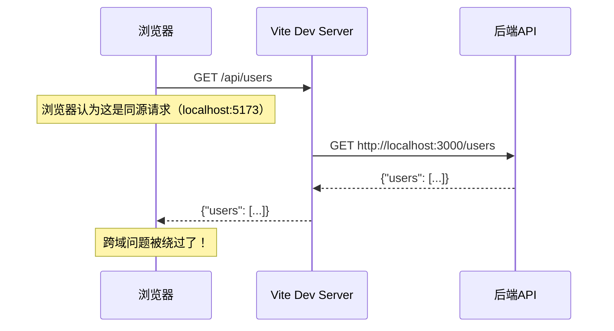
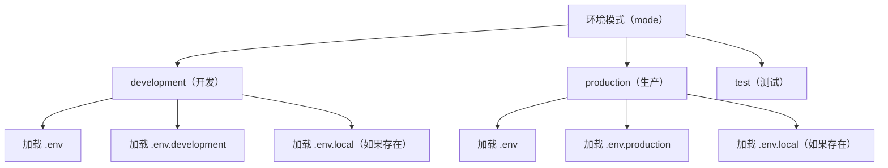

+++
title = "第6章 Create-Vite 相关配置"
weight = 60
date = 2026-03-27T21:01:00+08:00
type = "docs"
description = ""
isCJKLanguage = true
draft = false
+++

# 第六章：相关配置

## 6.1 vite.config.js/ts 配置文件

### 6.1.1 配置文件是什么？放在哪？

`vite.config.js`（或 `vite.config.ts`）是 **Vite 的"总控室"**——所有的构建行为、开发服务器设置、插件配置，都集中在这个文件里。

它放在**项目根目录**下，和 `package.json` 平级：

```
my-project/
├── vite.config.ts      # ← Vite 配置文件
├── package.json
├── tsconfig.json
└── src/
    └── main.ts
```

### 6.1.2 为什么会有 .ts 版本？

`vite.config.ts` 是 `vite.config.js` 的 **TypeScript 版本**。它们的功能完全一样，只是 `.ts` 版本能让你在写配置时有 **TypeScript 类型提示**，写起来更不容易出错。

```typescript
// vite.config.ts —— TypeScript 版本（有类型提示）
import { defineConfig } from 'vite'

export default defineConfig({
  // 写配置时，IDE 会给你自动补全和类型检查
})
```

```javascript
// vite.config.js —— JavaScript 版本（无类型提示）
import { defineConfig } from 'vite'

export default defineConfig({
  // 写配置时没有类型提示，容易写错
})
```

**推荐使用 `.ts` 版本**，尤其是选择了 TypeScript 模板的同学。

### 6.1.3 defineConfig 是什么？

`defineConfig` 是 Vite 提供的一个**工具函数**，它的作用是**给配置对象加上 TypeScript 类型提示**。

```typescript
import { defineConfig } from 'vite'

// 不用 defineConfig —— 类型提示可能不完整
export default {
  plugins: [vue()],
}

// 用 defineConfig —— IDE 给你完整的类型提示
export default defineConfig({
  plugins: [vue()],
})
```

本质上，`defineConfig` 只是给配置对象加了一层包装，让 TypeScript 能更好地推断类型。**运行时两者效果完全一样。**

### 6.1.4 基础配置结构

```typescript
// vite.config.ts
import { defineConfig } from 'vite'
import vue from '@vitejs/plugin-vue'
import { resolve } from 'path'

export default defineConfig({
  // 1. 插件配置——扩展 Vite 的能力
  plugins: [vue()],

  // 2. 路径解析——告诉 Vite 如何找文件
  resolve: {
    alias: {
      '@': resolve(__dirname, 'src'),
    }
  },

  // 3. 开发服务器配置——npm run dev 时的行为
  server: {
    port: 5173,
    proxy: {},
  },

  // 4. 构建配置——npm run build 时的行为
  build: {
    outDir: 'dist',
  }
})
```

### 6.1.5 配置文件的命名规则

| 文件名 | 说明 |
|--------|------|
| `vite.config.ts` | TypeScript 版本（推荐） |
| `vite.config.js` | JavaScript 版本 |
| `vite.config.mjs` | ESM 格式的 JS（`.mjs` = **M**odules **J**ava**S**cript） |
| `vite.config.mts` | ESM 格式的 TS（`.mts` = **M**odules **T**ype**S**cript） |
| `vite.config.cjs` | CommonJS 格式的 JS（`.cjs` = **C**ommon**J**ava**S**cript，兼容旧项目） |

> 💡 小贴士：记住 `.mjs` 和 `.mts` 的诀窍——看中间那个字母，`m` 是 **M**odules，`j` 是 **J**avaScript，`t` 是 **T**ypeScript。

> 注意：`package.json` 里有一行 `"type": "module"`，这告诉 Node.js "这个项目用 ESM 方式解析 `import/export`"。所以默认情况下，`vite.config.js` 里的 `import` 语法是可以正常工作的。

---

## 6.2 服务端配置（server）：端口 / 代理 / HTTPS

### 6.2.1 服务端配置是什么？

当你执行 `npm run dev` 时，Vite 会启动一个**开发服务器**（Dev Server）。`server` 节点就是用来配置这个服务器的。

```typescript
// vite.config.ts
export default defineConfig({
  server: {
    // 各种服务器配置...
  }
})
```

### 6.2.2 端口配置（port）

默认端口是 **5173**。如果这个端口被占用了，Vite 会自动尝试下一个可用端口。

```typescript
export default defineConfig({
  server: {
    port: 3000,  // 手动指定端口为 3000
  }
})
```

### 6.2.3 主机配置（host）

默认情况下，开发服务器只能从**本机**（localhost）访问。如果你想让**局域网内的其他设备**也能访问你的项目，需要配置 `host`：

```typescript
export default defineConfig({
  server: {
    host: true,          // 监听所有网络接口，允许局域网访问
    // 或者指定具体 IP
    // host: '192.168.1.100',
  }
})
```

这样，和你在同一个 Wi-Fi 下的手机、平板等设备，可以通过 `http://你的电脑IP:5173` 来访问你的项目。

> 💡 **实用技巧**：做移动端 H5 开发时，这个功能非常有用——你可以在手机上实时预览页面效果。

### 6.2.4 自动打开浏览器（open）

```typescript
export default defineConfig({
  server: {
    open: true,         // 启动后自动打开浏览器
    // 或者指定打开哪个 URL
    // open: '/',        // 打开首页
  }
})
```

### 6.2.5 代理配置（proxy）——解决跨域问题的神器 🦸

**什么是跨域？**

浏览器有一个安全机制，叫 **同源策略**（Same-Origin Policy）。说白了就是：一个网页的 JavaScript，只能访问"自己人"的接口，不能随便找隔壁的服务器要数据。

如果你的前端页面运行在 `http://localhost:5173`，但你要调用的 API 在 `http://api.example.com`，浏览器会跳出来说"不行不行，你俩不是一家的，不能串门！"——这就是令人头疼的**跨域问题** 😤。

**怎么解决？** 找代理（Proxy）帮忙！

Vite 的代理功能就像一个中间人：前端说"帮我拿一下 /api/users"，代理收到后悄悄去找后端服务器要数据，然后返回给前端。浏览器一看，诶，还是 localhost:5173 的请求，畅通无阻 ✅

配置起来也很简单：

```typescript
export default defineConfig({
  server: {
    proxy: {
      // '/api' 开头的请求会被代理
      '/api': {
        target: 'http://localhost:3000',  // 代理到哪个服务器
        changeOrigin: true,                // 改变 Origin 为目标服务器
        rewrite: (path) => path.replace(/^\/api/, ''),  // 去掉 /api 前缀
      },
      // 代理多个后端
      '/auth': {
        target: 'http://localhost:8080',
        changeOrigin: true,
      },
    }
  }
})
```

代理的工作原理：



### 6.2.6 HTTPS 配置

有时候后端接口用的是 HTTPS，但你的开发环境是 HTTP，浏览器会报"混合内容"错误。

```typescript
export default defineConfig({
  server: {
    https: true,  // 启用 HTTPS（需要本地证书）
    // 或者指定证书文件
    // https: {
    //   key: './certificates/localhost-key.pem',
    //   cert: './certificates/localhost.pem',
    // },
  }
})
```

### 6.2.7 完整 server 配置示例

```typescript
export default defineConfig({
  server: {
    port: 5173,           // 端口号
    host: true,           // 允许局域网访问
    open: true,           // 启动后自动打开浏览器
    proxy: {
      '/api': {
        target: 'http://localhost:8080',
        changeOrigin: true,
      }
    }
  }
})
```

### 6.2.8 预览模式（preview）

`npm run preview` 是用来**预览生产构建产物**的——也就是你在 `dist/` 目录里打包好的那些文件。它的配置方式和 `server` 几乎一模一样：

```typescript
export default defineConfig({
  server: {
    port: 5173,
  },
  // preview 和 server 共用很多配置项
  preview: {
    port: 4173,              // 预览服务器默认用 4173（和 dev 错开）
    host: true,              // 允许局域网访问
    open: true,              // 自动打开浏览器
  }
})
```

> 💡 **什么时候用？** `dev` 是开发时用的，`preview` 是给"我打包好了，想看看实际效果"用的。比如你 build 完之后，想用生产环境的配置跑一遍看看有没有问题，就用 preview。

---

## 6.3 构建配置（build）：输出目录 / 压缩 / 源码映射

### 6.3.1 构建配置是什么？

当你执行 `npm run build` 时，Vite 会用 **Rollup** 打包工具把你的源代码编译成最优化的静态文件。`build` 节点就是用来控制这个过程的。

### 6.3.2 输出目录（outDir）

构建产物默认输出到 `dist/` 目录：

```typescript
export default defineConfig({
  build: {
    outDir: 'dist',      // 输出到 dist 目录（默认就是 dist，可以不写）
    // outDir: 'build',  // 如果你想改成 build 目录
  }
})
```

### 6.3.3 资源目录（assetsDir）

构建后的静态资源（JS、CSS、图片等）默认放在 `dist/assets/` 目录下：

```typescript
export default defineConfig({
  build: {
    assetsDir: 'static',   // 资源输出到 dist/static/（默认是 'assets'）
  }
})
```

### 6.3.4 资源内联阈值（assetsInlineLimit）

有些小的资源（比如小于 4KB 的图片）可以内联成 Base64 格式，直接嵌入 HTML/CSS 里，减少 HTTP 请求数：

```typescript
export default defineConfig({
  build: {
    // 小于 4KB 的资源内联，大于 4KB 的作为独立文件
    assetsInlineLimit: 4096,   // 默认 4096 bytes = 4KB
  }
})
```

### 6.3.5 源码映射（sourcemap）

**源码映射**（Source Map）是一种文件，它记录了"压缩后的代码"对应"原始源代码"的哪个位置。可以把它想象成"代码地图"——压缩后的代码是密密麻麻的迷宫，sourcemap 就是那张标注了所有岔路方向的地图 🗺️。有了它，生产环境出了 Bug，开发者可以在浏览器里直接看到原始源代码，而不是对着乱码干瞪眼。

```typescript
export default defineConfig({
  build: {
    // sourcemap 的几种模式
    sourcemap: false,           // 不生成 sourcemap（最快，不暴露源码）
    sourcemap: true,            // 生成完整的 .map 文件（调试用）
    sourcemap: 'hidden',        // 生成 sourcemap 但不写在文件里（安全）
    sourcemap: 'inline',        // sourcemap 嵌入到输出文件中
  }
})
```

**推荐**：生产环境用 `sourcemap: false` 或 `'hidden'`。`true` 会暴露完整源码，不安全。

### 6.3.6 压缩器选择（minify）

Vite 内置了两个压缩工具：

- **esbuild**：默认，速度极快（比 terser 快 20-40 倍 ⚡）
- **terser**：更慢，但压缩率更高

```typescript
export default defineConfig({
  build: {
    minify: 'esbuild',    // 默认，用 esbuild 压缩（快速）
    // minify: 'terser',  // 用 terser 压缩（压缩率更高，但慢）
  }
})
```

### 6.3.7 关闭 console 和 debugger（terserOptions）

生产代码里不应该有 `console.log` 和 `debugger`，但很多人写代码时会随手留一些：

```typescript
export default defineConfig({
  build: {
    minify: 'terser',
    terserOptions: {
      compress: {
        drop_console: true,      // 移除所有 console.*
        drop_debugger: true,     // 移除所有 debugger
      }
    }
  }
})
```

### 6.3.8 chunk 大小限制（chunkSizeWarningLimit）

Vite 默认会警告你"某个 JS 文件太大"，默认阈值是 **500KB**：

```typescript
export default defineConfig({
  build: {
    chunkSizeWarningLimit: 1000,   // 警告阈值设为 1000KB（1MB）
  }
})
```

---

## 6.4 路径别名配置（resolve.alias）

### 6.4.1 alias 的完整配置

路径别名（别名）在第五章已经讲过，这里再补充一些高级用法：

```typescript
import { defineConfig } from 'vite'
import vue from '@vitejs/plugin-vue'
import { resolve } from 'path'

export default defineConfig({
  resolve: {
    alias: {
      // 基础别名
      '@': resolve(__dirname, 'src'),

      // 多个别名
      '@components': resolve(__dirname, 'src/components'),
      '@utils': resolve(__dirname, 'src/utils'),
      '@assets': resolve(__dirname, 'src/assets'),
      '@styles': resolve(__dirname, 'src/styles'),
    }
  }
})
```

### 6.4.2 使用方式

```typescript
import Button from '@/components/Button.vue'          // ✅ 简写
import Button from '@/components/Button/Button.vue'  // ✅ 也可以加完整文件名
import { formatDate } from '@/utils/date'           // ✅ 自动找 index.ts
import logo from '@/assets/logo.png'                // ✅ 图片别名
```

### 6.4.3 alias + tsconfig 的配合

配置了 `vite.config.ts` 的 alias 之后，别忘了同步配置 `tsconfig.json`，否则 TypeScript 编译器会报错：

```json
// tsconfig.json
{
  "compilerOptions": {
    "baseUrl": ".",
    "paths": {
      "@/*": ["src/*"],
      "@components/*": ["src/components/*"],
      "@utils/*": ["src/utils/*"]
    }
  }
}
```

---

## 6.5 CSS 相关配置（预处理器 / PostCSS / CSS Modules）

### 6.5.1 Vite 原生支持的 CSS 格式

Vite **开箱即用**地支持以下 CSS 格式：

- 普通 CSS（`.css`）
- Less（`.less`）
- Sass / SCSS（`.scss` / `.sass`）
- Stylus（`.styl`）
- CSS Modules（`.module.css`）

### 6.5.2 CSS 预处理器配置

Vite 不会自动安装预处理器，但会自动识别它们——**只要你安装了，Vite 就会自动处理**。

```bash
# 安装 Sass/SCSS
npm install -D sass

# 安装 Less
npm install -D less

# 安装 Stylus
npm install -D stylus
```

安装之后，直接在 `.vue` 文件或 `.ts` 文件里导入即可：

```typescript
// main.ts 或任何 .vue / .ts 文件中
import './styles/main.scss'   // 直接 import，Vite 自动处理
import './styles/variables.less'
```

```scss
// src/styles/main.scss
// 定义变量
$primary-color: #42b983;
$font-size: 14px;

body {
  color: $primary-color;
  font-size: $font-size;
}
```

### 6.5.3 全局 CSS 预处理器变量注入

如果你想让 Sass/Less 的变量在**所有组件**里都能直接用，不需要每个文件都手动 import：

```typescript
// vite.config.ts
export default defineConfig({
  css: {
    preprocessorOptions: {
      scss: {
        // additionalData 会在每个 SCSS 文件开头自动注入这段内容
        additionalData: `@import "@/styles/variables.scss";`
      },
      less: {
        additionalData: `@import "@/styles/variables.less";`
      }
    }
  }
})
```

这样，每个 `.scss` 文件里都可以直接用 `$primary-color`，不用手动 import。

### 6.5.4 CSS Modules

CSS Modules 是一种"让 CSS 类名只在当前组件内生效"的机制，防止样式冲突。想象一下：你在 `Button.vue` 里写了个 `.button`，隔壁 `Dialog.vue` 也写了个 `.button`，普通 CSS 的话后写的会覆盖前面的——但用了 CSS Modules，Vite 会自动给类名加上 hash 后缀，变成类似 `Button_button_1x2y3` 和 `Dialog_button_4z5w6`，各玩各的，互不干扰 🎯

```typescript
// vite.config.ts
export default defineConfig({
  css: {
    modules: {
      // 类名转换规则：原名 + hash
      localsConvention: 'camelCase',   // my-button → myButton
    }
  }
})
```

使用 CSS Modules 时，你可以在 `.vue` 文件中直接写 `<style module>`，也可以抽离到单独的 `.module.css` 文件中：

**方式一：在 `.vue` 文件里直接写**

```vue
<!-- Button.vue -->
<template>
  <button :class="$style['btn-primary']">确认</button>
</template>

<style module>
.btn-primary {
  /* Vite 会把类名编译成类似 Button_btn-primary_x7k2m 的形式 */
  background: #42b983;
  color: #fff;
  border-radius: 4px;
}
</style>
```

**方式二：抽离到单独的 `.module.css` 文件**

```css
/* src/components/Button.module.css */
/* 源文件里写的是 .btn-primary */
.btn-primary {
  background: #42b983;
  color: #fff;
  border-radius: 4px;
}
```

```typescript
// 使用时正常 import 即可
import styles from './Button.module.css'

// Vite 会自动处理，styles.btn-primary 的实际值类似 "Button_btn-primary_x7k2m"
const className = styles['btn-primary']
```

> 💡 **注意**：在 `<style module>` 里写的类名也会被 Vite 自动 hash，所以不用担心命名冲突，放心用语义化的名字吧！

### 6.5.5 PostCSS 配置

PostCSS 是 CSS 的"后处理器"，可以对 CSS 做各种转换（比如自动加浏览器前缀）。

在项目根目录创建 `postcss.config.js`：

```javascript
// postcss.config.js
module.exports = {
  plugins: {
    // 自动加 CSS 前缀（-webkit- 等）
    autoprefixer: {},
    // CSS 浏览器兼容性
    browserslist: ['> 1%', 'last 2 versions'],
  }
}
```

---

## 6.6 环境变量与 .env 文件

### 6.6.1 .env 文件的加载规则

Vite 会根据当前**环境模式**（mode）加载不同的 `.env` 文件：



**加载优先级**（后面的覆盖前面的）：

```
.env（所有模式都加载）
  ↓
.env.[mode]（当前模式加载）
  ↓
.env.local（本地覆盖，优先级最高，通常在 .gitignore 里）
```

### 6.6.2 创建环境变量文件

在项目根目录创建以下文件：

```bash
# 基础环境变量（所有模式都加载）
touch .env

# 开发环境变量（npm run dev 时加载）
touch .env.development

# 生产环境变量（npm run build 时加载）
touch .env.production
```

**.env 文件的内容示例：**

```bash
# .env.development
VITE_API_BASE_URL=http://localhost:3000/api
VITE_APP_TITLE=我的应用（开发版）
```

```bash
# .env.production
VITE_API_BASE_URL=https://api.example.com
VITE_APP_TITLE=我的应用
```

### 6.6.3 在代码中使用环境变量

```typescript
// 在任何 .ts / .vue / .js 文件里
const apiUrl = import.meta.env.VITE_API_BASE_URL
const title = import.meta.env.VITE_APP_TITLE

console.log(apiUrl)  // http://localhost:3000/api（开发环境）
console.log(title)   // 我的应用（开发版）
```

### 6.6.4 智能提示：环境变量类型定义

为了在写 `import.meta.env.VITE_XXX` 时有类型提示，可以在 `src/` 目录下创建一个 `env.d.ts` 文件：

```typescript
// src/env.d.ts
/// <reference types="vite/client" />

interface ImportMetaEnv {
  readonly VITE_API_BASE_URL: string
  readonly VITE_APP_TITLE: string
}

interface ImportMeta {
  readonly env: ImportMetaEnv
}
```

这样，IDE 就会在你敲 `import.meta.env.VITE_` 时，提示你有哪些可用的环境变量了。

### 6.6.5 .gitignore 里忽略本地覆盖文件

```bash
# .gitignore
.env.local     # 本地覆盖文件，不提交到 Git
.env.*.local   # 任何以 .local 结尾的环境文件，都不提交
```

---

## 6.7 环境模式（--mode）

Vite 默认有三个环境模式：`development`、`production`、`test`。但你也可以自己定义，比如 `staging`（预发布）、`mock`（模拟数据）等：

```bash
# 使用 staging 模式
npm run build -- --mode staging

# 使用 mock 模式
npm run dev -- --mode mock
```

指定 `--mode staging` 后，Vite 会额外加载 `.env.staging` 文件（如果存在）。

这在做"开发环境 → 测试环境 → 预发布环境 → 生产环境"多流程发布时特别有用——每个环境配一套 `.env.[mode]` 文件，互不干扰，切换自如 🎛️

---

## 6.8 插件配置（@vitejs/plugin-vue / @vitejs/plugin-react 等）

### 6.8.1 插件的基本使用

Vite 的插件系统是它的灵魂之一。**插件通过 `plugins` 数组注册**，在配置文件的 `plugins` 节点下：

```typescript
// vite.config.ts
import { defineConfig } from 'vite'
import vue from '@vitejs/plugin-vue'
import react from '@vitejs/plugin-react'
import pwa from 'vite-plugin-pwa'

export default defineConfig({
  plugins: [
    // 按顺序执行
    vue(),        // Vue 插件
    react(),      // React 插件
    // pwa(),       // PWA 插件（按需添加）
  ]
})
```

### 6.8.2 @vitejs/plugin-vue 详解

这是 Vue 项目必须的插件，作用是**让 Vite 能够识别和编译 `.vue` 单文件组件**。

```typescript
import vue from '@vitejs/plugin-vue'

export default defineConfig({
  plugins: [
    vue({
      // 传入匹配的文件，正则或函数均可
      include: [/\.vue$/],
    })
  ]
})
```

### 6.8.3 @vitejs/plugin-react 详解

React 项目的插件，支持 **Fast Refresh**（快速刷新，类似 HMR，但专门为 React 设计）：

```typescript
import react from '@vitejs/plugin-react'

export default defineConfig({
  plugins: [
    react({
      // 可选：使用 SWC 代替 Babel（SWC 基于 Rust，速度更快）
      // 需要安装 @vitejs/plugin-react-swc，然后取消下面这行的注释
      // plugins: ['@vitejs/plugin-react-swc'],
    })
  ]
})
```

> 💡 **选哪个？** 默认用 Babel 就行，如果你项目比较大、编译等待时间让你崩溃，再考虑切换到 SWC。

### 6.8.4 常用第三方插件速查

| 插件 | 安装命令 | 用途 |
|------|---------|------|
| `vite-plugin-pwa` | `npm install -D vite-plugin-pwa` | 渐进式 Web 应用 |
| `vite-plugin-svg-icons` | `npm install -D vite-plugin-svg-icons` | SVG 图标自动化 |
| `vite-plugin-compression` | `npm install -D vite-plugin-compression` | Gzip / Brotli 压缩 |
| `unplugin-vue-components` | `npm install -D unplugin-vue-components` | 自动导入组件 |
| `unplugin-auto-import` | `npm install -D unplugin-auto-import` | 自动导入 API |

### 6.8.5 插件配置示例：自动导入组件

安装了 `unplugin-vue-components` 之后，你不再需要在每个组件里手动 `import` 其他组件：

```typescript
// vite.config.ts
import Components from 'unplugin-vue-components/vite'
import { VantResolver } from 'unplugin-vue-components/resolvers'

export default defineConfig({
  plugins: [
    vue(),
    Components({
      // 自动解析 components/ 目录下的组件
      dirs: ['src/components'],
      // 集成 UI 库（以 Vant 为例）
      resolvers: [VantResolver()],
    })
  ]
})
```

这样，你在模板里直接用 `<van-button>`，不需要 `import` 了：

```vue
<!-- App.vue -->
<template>
  <van-button type="primary">提交</van-button>
  <!-- 不用 import，直接用 -->
</template>
```

---

## 6.9 package.json 脚本说明

### 6.9.1 scripts 是什么？

`package.json` 里的 `scripts` 字段定义了项目的**快捷命令**：

```json
{
  "scripts": {
    "dev": "vite",
    "build": "vue-tsc && vite build",
    "preview": "vite preview"
  }
}
```

`npm run dev` 就是执行 `vite` 这个命令。

### 6.9.2 Create-Vite 生成的默认脚本

Vue + TypeScript 模板的 `scripts`：

```json
{
  "scripts": {
    "dev": "vite",                        // 启动开发服务器
    "build": "vue-tsc && vite build",     // 先做 TS 类型检查，再构建
    "preview": "vite preview"             // 预览构建产物（点击查看成品效果！）
  }
}
```

> 注意：`lint` 命令需要手动安装和配置 ESLint，Create-Vite 默认不包含。如果你想要代码风格检查，需要自己动手丰衣足食 🛠️

React + TypeScript 模板的 `scripts`：

```json
{
  "scripts": {
    "dev": "vite",
    "build": "tsc -b && vite build",     // 用 tsc 做类型检查（与 Vue 不同）
    "preview": "vite preview"
  }
}
```

### 6.9.3 常用自定义脚本

你可以在 `scripts` 里添加自己的命令：

```json
{
  "scripts": {
    "dev": "vite",
    "build": "vue-tsc && vite build",
    "preview": "vite preview",
    "lint": "eslint . --ext .vue,.js,.jsx,.cjs,.mjs,.ts,.tsx,.cts,.mts --fix",
    "format": "prettier --write \"src/**/*.ts\" \"src/**/*.vue\"",
    "test": "vitest",
    "test:coverage": "vitest run --coverage"
  }
}
```

### 6.9.4 scripts 的环境变量

在 `scripts` 里执行命令时，会自动注入 `node_modules/.bin` 到 PATH，所以可以直接用 `vite`、`typescript`、`eslint` 这些命令。

如果需要传递环境变量给脚本：

```json
{
  "scripts": {
    "build:staging": "vite build --mode staging"
  }
}
```

这样会加载 `.env.staging` 文件（如果存在）。

### 6.9.5 使用 npx 执行脚本

有时候你想临时执行一个命令，不想走 `npm run`：

```bash
# 临时执行 vite
npx vite --version

# 临时执行 vue-tsc 类型检查
npx vue-tsc --noEmit

# 临时执行 ESLint
npx eslint src/
```

`npx` 的好处是：它会**自动使用 `node_modules` 里安装的对应版本**，不需要全局安装。

---

## 本章小结

本章深入讲解了 Create-Vite 的相关配置，堪称"Vite 调教手册" 📖：

- **vite.config.ts/js**：Vite 的总配置文件，放在项目根目录，`defineConfig` 提供 TypeScript 类型提示，支持 `.ts` / `.js` / `.mjs` / `.mts` / `.cjs` 等多种格式（还记得那个 `mjs` vs `mts` 的小贴士吗？）。
- **server 配置**：控制开发服务器行为，包括端口（默认 5173）、主机（`host` 允许局域网访问，手机也能看效果 👀）、自动打开浏览器（`open`