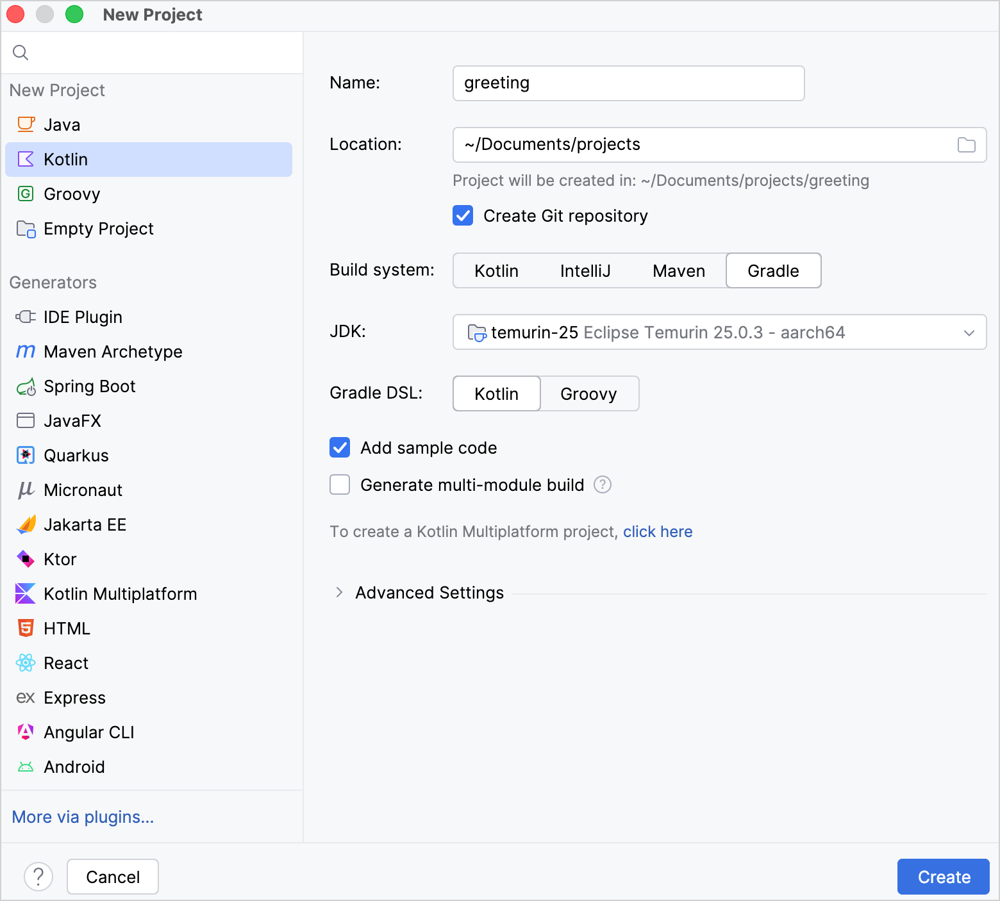
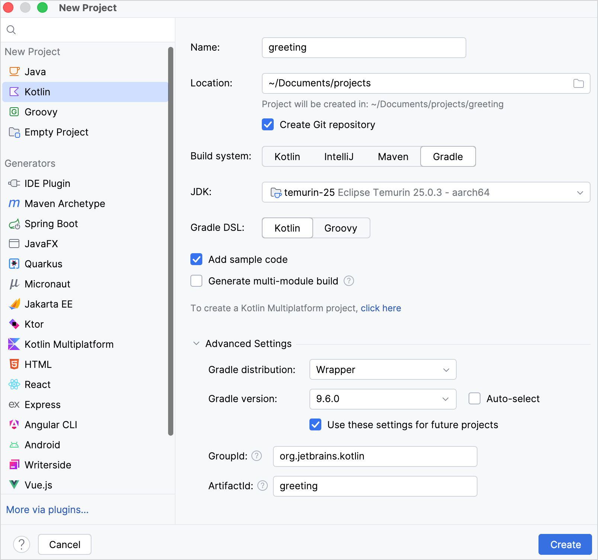
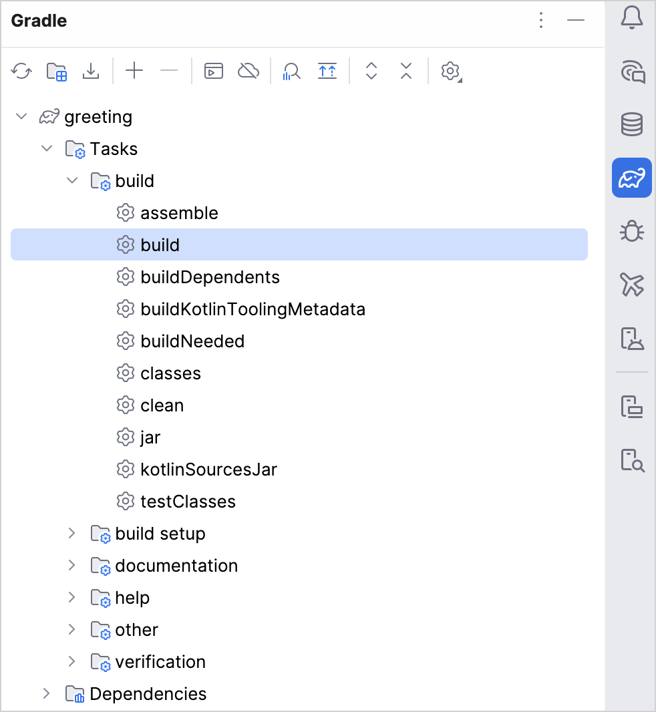
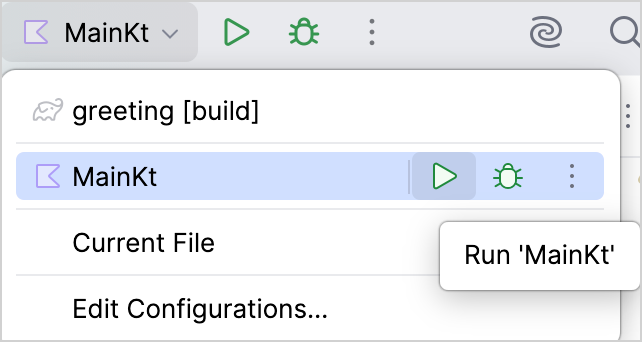
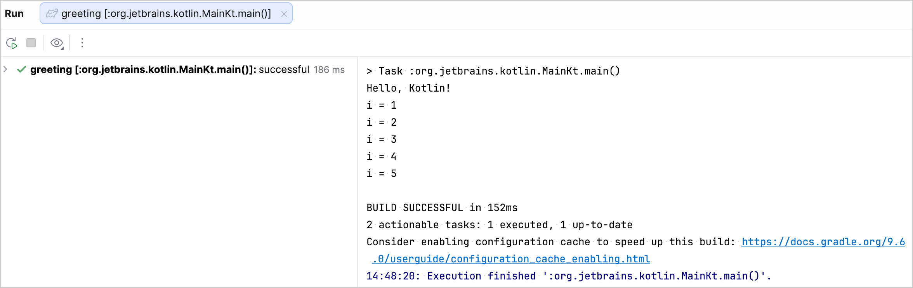

+++
title = "11.1.2 Gradle 与 Kotlin/JVM 入门"
date = 2026-09-13T08:50:47+08:00
weight = 2
type = "docs"
description = ""
isCJKLanguage = true
draft = false
+++


> 原文链接: [https://kotlinlang.org/docs/get-started-with-jvm-gradle-project.html](https://kotlinlang.org/docs/get-started-with-jvm-gradle-project.html)

# 11.1.2 Gradle 与 Kotlin/JVM 入门

本教程演示如何使用 IntelliJ IDEA 和 Gradle 创建一个 JVM 控制台应用。

首先，下载并安装最新版本的 [IntelliJ IDEA](https://www.jetbrains.com/idea/download/)。

## 创建项目 {#create-a-project}

1. 在 IntelliJ IDEA 中，选择 **File** | **New** | **Project**。
2. 在左侧面板中选择 **Kotlin**。
3. 给新项目命名，如有必要还可以修改它的位置。

> **提示：** 勾选 **Create Git repository** 复选框可以把新项目纳入版本控制。你之后再这么做也可以。



4. 选择 **Gradle** 构建系统。
5. 从 **JDK** 列表中选择你想在项目中使用的 [JDK](https://www.oracle.com/java/technologies/downloads/)。
* 如果 JDK 已安装在你的电脑上，但未在 IDE 中定义，请选择 **Add JDK** 并指定 JDK 主目录的路径。
* 如果你的电脑上没有所需的 JDK，请选择 **Download JDK**。

6. 为 Gradle DSL 选择 **Kotlin**。
7. 勾选 **Add sample code** 复选框，以创建一个包含示例 `"Hello World!"` 应用的文件。
8. 点击 **Create**。

你已经成功创建了一个使用 Gradle 的项目！

#### 为项目指定 Gradle 版本 {#specify-a-gradle-version-for-your-project}

你可以在 **Advanced Settings** 区域为项目显式指定 Gradle 版本，既可以选用 Gradle Wrapper，也可以使用本地安装的 Gradle：

* **Gradle Wrapper：**
1. 在 **Gradle distribution** 列表中选择 **Wrapper**。
2. 取消勾选 **Auto-select** 复选框。
3. 在 **Gradle version** 列表中选择你的 Gradle 版本。
* **本地安装：**
1. 在 **Gradle distribution** 列表中选择 **Local installation**。
2. 在 **Gradle location** 中指定你本地 Gradle 版本的路径。



## 了解构建脚本 {#explore-the-build-script}

打开 `build.gradle.kts` 文件。这是 Gradle Kotlin 构建脚本，其中包含与 Kotlin 相关的构件以及应用所需的其他部分：

```kotlin
plugins {
    kotlin("jvm") version "2.4.20" // 要使用的 Kotlin 版本
}

group = "org.example" // 公司名称，例如 `org.jetbrains.kotlin`
version = "1.0-SNAPSHOT" // 分配给构建构件的版本

repositories { // 依赖的来源。见 1️⃣
    mavenCentral() // Maven 中央仓库。见 2️⃣
}

dependencies { // 你想使用的所有库。见 3️⃣
    // 在仓库中找到依赖后，把它们的名称复制到这里
    testImplementation(kotlin("test")) // Kotlin 测试库
}

kotlin { // 生成的 JVM 工具链配置。见 4️⃣
    jvmToolchain(25) // 用于编译项目的 JDK。
}

tasks.test { // 测试任务配置。见 5️⃣
    useJUnitPlatform() // 用于测试的 JUnitPlatform。见 6️⃣
}
```

* 1️⃣ 进一步了解[依赖的来源](https://docs.gradle.org/current/userguide/declaring_repositories.html)。
* 2️⃣ [Maven 中央仓库](https://central.sonatype.com/)。它也可以是[Google 的 Maven 仓库](https://maven.google.com/)或你公司的私有仓库。
* 3️⃣ 进一步了解[声明依赖](https://docs.gradle.org/current/userguide/declaring_dependencies.html)。
* 4️⃣ 进一步了解 [Java 工具链支持](../11.1.3-GradleConfigureProject/#gradle-java-toolchains-support)。
* 5️⃣ 进一步了解[任务](https://docs.gradle.org/current/dsl/org.gradle.api.Task.html)。
* 6️⃣ [用于测试的 JUnitPlatform](https://docs.gradle.org/current/javadoc/org/gradle/api/tasks/testing/Test.html#useJUnitPlatform)。

Gradle 构建文件中有几处与 Kotlin 相关的构件：

1. 在 `plugins {}` 块中有 `kotlin("jvm")` 构件。该插件定义了项目要使用的 Kotlin 版本。

2. 在 `dependencies {}` 块中有 `testImplementation(kotlin("test"))`。进一步了解[设置测试库依赖](../11.1.3-GradleConfigureProject/#set-dependencies-on-test-libraries)。

## 运行应用 {#run-the-application}

1. 通过选择 **View** | **Tool Windows** | **Gradle** 打开 Gradle 窗口：



2. 在 `Tasks/build` 中执行 **build** Gradle 任务。在 **Build** 窗口中会出现 `BUILD SUCCESSFUL`。这意味着 Gradle 成功构建了应用。

3. 在 `src/main/kotlin` 中打开 `Main.kt` 文件：
* `src` 目录包含 Kotlin 源文件和资源。
* `Main.kt` 文件包含会打印 `Hello World!` 的示例代码。

4. 点击行号处的绿色 **Run** 图标运行应用，并选择 **Run 'MainKt'**。



你可以在 **Run** 工具窗口中看到结果：



恭喜！你刚刚运行了你的第一个 Kotlin 应用。

## 接下来学什么？ {#what-s-next}

进一步了解：
* [Gradle 构建文件属性](https://docs.gradle.org/current/dsl/org.gradle.api.Project.html#N14E9A)。
* [面向不同平台以及设置库依赖](../11.1.3-GradleConfigureProject/)。
* [编译器选项以及如何传入它们](../11.1.5-GradleCompilerOptions/)。
* [增量编译、缓存支持、构建报告以及 Kotlin 守护进程](../11.1.6-GradleCompilationAndCaches/)。
