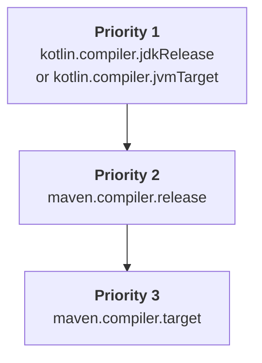

+++
title = "11.2.2 配置 Maven 项目"
date = 2026-09-13T08:50:47+08:00
weight = 2
type = "docs"
description = ""
isCJKLanguage = true
draft = false
+++


> 原文链接: [https://kotlinlang.org/docs/maven-configure-project.html](https://kotlinlang.org/docs/maven-configure-project.html)

# 11.2.2 配置 Maven 项目

当你把一个已有的 Java Maven 项目引入 Kotlin，或者创建一个新的 Kotlin Maven 项目时，你需要添加用于编译 Kotlin 源码和模块的 Kotlin Maven 插件。

目前只支持 Maven v3。

## 自动配置 {#automatic-configuration}

你可以在 Java 与 Kotlin 混合项目以及纯 Kotlin 项目中使用 `<extensions>` 选项来简化 Maven 配置。这种方式可以为你节省时间，因为无需配置 Maven 编译器插件。

要使用 `<extensions>` 应用 Kotlin Maven 插件，请按如下方式更新 `pom.xml` 构建文件：

1. 在 `<properties>` 部分定义 Kotlin 和 JVM 的目标版本：

```xml
   <properties>
       <maven.compiler.release>17</maven.compiler.release>
       <kotlin.version>2.4.20</kotlin.version>
   </properties>
```

2. 在 `<build><plugins>` 部分添加 Kotlin Maven 插件并启用 `<extensions>` 选项：

```xml
   <build>
       <plugins>

           <plugin>
               <groupId>org.jetbrains.kotlin</groupId>
               <artifactId>kotlin-maven-plugin</artifactId>
               <version>${kotlin.version}</version>
               <extensions>true</extensions>
           </plugin>

       </plugins>
   </build>
```

`<extensions>` 选项会：

* 如果 `src/main/kotlin` 和 `src/test/kotlin` 目录已经存在但未在插件配置中指定，则把它们注册为源根目录。
* 如果项目中尚未定义 [`kotlin-stdlib` 依赖](../11.2.3-MavenSetDependencies/#dependency-on-the-standard-library)，则添加它。
* 向构建中添加 `compile`、`test-compile`、`kapt` 和 `test-kapt` 执行，并把它们绑定到相应的[生命周期阶段](https://maven.apache.org/guides/introduction/introduction-to-the-lifecycle.html)。因此你无需手动设置带 `<id>` 和 `<goals>` 的 `<executions>` 部分，就能确保 `kapt`、Kotlin 的 `compile` 以及 Java 的 `compile` 执行按正确的顺序运行。
* [自动让 JVM 目标版本与项目中配置的 Java 编译器版本保持一致。](#jvm-target-version)

如果你的是 Java 与 Kotlin 混合项目，该配置会确保：

* 先编译 Kotlin 代码。
* Java 代码在 Kotlin 之后编译，并且可以引用 Kotlin 类。
* Maven 的默认行为不会覆盖插件顺序。

扩展配置会替换整个 `<executions>` 部分。如果你需要配置某个执行，请参阅[编译 Kotlin 和 Java 源码](#compile-kotlin-and-java-sources)中的示例。

> **注意：** 如果有多个构建插件覆盖了默认生命周期，并且你还启用了 `<extensions>` 选项，那么 `<build>` 部分中最后一个插件在生命周期设置上具有优先权。之前对生命周期设置的所有更改都会被忽略。

<anchor name="maven-compiler-extensions-version"/>

目前，与 `<extensions>` 一起使用的 Maven 编译器插件默认版本是 **3.10.1**。你可以单独设置不同的版本：

```xml
<build>
    <plugins>

        <plugin>
            <groupId>org.jetbrains.kotlin</groupId>
            <artifactId>kotlin-maven-plugin</artifactId>
            <version>${kotlin.version}</version>
            <extensions>true</extensions>
        </plugin>

        <plugin>
            <groupId>org.apache.maven.plugins</groupId>
            <artifactId>maven-compiler-plugin</artifactId>
            <version>3.15.0</version>
        </plugin>
    </plugins>
</build>
```

### JVM 目标版本 {#jvm-target-version}

`<extensions>` 选项会确保 Kotlin 编译器和 Maven 编译器以相同的字节码版本为目标。

Kotlin Maven 插件按以下顺序自动确定 JVM 目标版本：



#### Kotlin 编译器版本 {#kotlin-compiler-versions}

如果项目中定义了 `kotlin.compiler.jdkRelease` 或 `kotlin.compiler.jvmTarget` 属性中的任意一个，则其中设置的版本优先。

请记住，这两个 Kotlin 编译器选项的行为不同：

| Kotlin 编译器选项       | 控制输出的字节码版本 | 把 API 限制为指定的 JDK                                                                   |

| `kotlin.compiler.jvmTarget`  | 是                                     | 对代码中的 JDK API 没有限制                                                      |
| `kotlin.compiler.jdkRelease` | 是                                     | 是 − 只允许特定 API 版本（等同于 Java 的 `--release` 编译器选项） |

> **注意：** 不要同时为 `kotlin.compiler.jdkRelease` 和 `kotlin.compiler.jvmTarget` 设置不同的 JDK 选项。否则会报错。

#### Maven 编译器版本 {#maven-compiler-versions}

* 如果既没有设置 `kotlin.compiler.jdkRelease`，也没有设置 `kotlin.compiler.jvmTarget` 选项，插件会采用 `maven.compiler.release` 的版本。

`maven.compiler.release` 版本既可以定义为项目属性，也可以定义在 `maven-compiler-plugin` 配置中。
* 如果没有设置 Maven 的 release 版本，插件会采用 `maven.compiler.target` 的版本。

它既可以定义为项目属性，也可以定义在 `maven-compiler-plugin` 配置中。

请记住，Maven 编译器的 `target` 和 `release` 选项行为不同：

| Maven 编译器选项    | 设置 Kotlin 的 `jvmTarget` | 设置 Kotlin 的 `jdkRelease` | 把 API 限制为指定的 JDK                  |

| `maven.compiler.target`  | 是                       | 否                         | 否 − 构建的 JDK classpath 仍然可见 |
| `maven.compiler.release` | 是                       | 是                        | 是 − 仅限特定 API 版本       |

> **注意：** `<extensions>` 选项只检查项目级属性和全局的 `maven-compiler-plugin` 配置。它不会检查插件 `<executions>` 部分中定义的配置。

## 手动配置 {#manual-configuration}

如果未在 Kotlin Maven 插件中启用 `<extensions>`，你就需要手动配置项目，以确保源代码能够正确编译。

你可以把 Maven 项目配置为编译 [Java 与 Kotlin 源码的组合](#compile-kotlin-and-java-sources)，或[仅 Kotlin 源码](#compile-kotlin-only-sources)。

### 编译 Kotlin 和 Java 源码 {#compile-kotlin-and-java-sources}

要编译同时包含 Kotlin 和 Java 源文件的项目，请确保 Kotlin 编译器在 Java 编译器之前运行。

在 Kotlin 声明被编译成 `.class` 文件之前，Java 编译器无法看到它们。如果你的 Java 代码使用了 Kotlin 类，那么这些类必须先编译，以避免 `cannot find symbol` 错误。

Maven 根据两个主要因素确定插件执行顺序：

* `pom.xml` 文件中插件声明的顺序。
* 内置的默认执行，例如 `default-compile` 和 `default-testCompile`，它们总是先于用户自定义执行运行，无论它们在 `pom.xml` 文件中的位置如何。

要控制执行顺序：

* 把 `kotlin-maven-plugin` 声明在 `maven-compiler-plugin` 之前。
* 禁用 Java 编译器插件的默认执行。
* 添加自定义执行，以显式控制编译阶段。

> **注意：** 你可以使用 Maven 中特殊的 `none` 阶段来禁用某个默认执行。

要应用 Kotlin Maven 插件，请按如下方式更新 `pom.xml` 构建文件：

```xml
<build>
    <plugins>

        <plugin>
            <groupId>org.jetbrains.kotlin</groupId>
            <artifactId>kotlin-maven-plugin</artifactId>
            <version>${kotlin.version}</version>
            <executions>
                <execution>
                    <id>kotlin-compile</id>
                    <phase>compile</phase>
                    <goals>
                        <goal>compile</goal>
                    </goals>
                    <configuration>
                        <sourceDirs>
                            <sourceDir>${project.basedir}/src/main/kotlin</sourceDir>

                            <sourceDir>${project.basedir}/src/main/java</sourceDir>
                        </sourceDirs>
                    </configuration>
                </execution>
                <execution>
                    <id>kotlin-test-compile</id>
                    <phase>test-compile</phase>
                    <goals>
                        <goal>test-compile</goal>
                    </goals>
                    <configuration>
                        <sourceDirs>
                            <sourceDir>${project.basedir}/src/test/kotlin</sourceDir>
                            <sourceDir>${project.basedir}/src/test/java</sourceDir>
                        </sourceDirs>
                    </configuration>
                </execution>
            </executions>
        </plugin>

        <plugin>
            <groupId>org.apache.maven.plugins</groupId>
            <artifactId>maven-compiler-plugin</artifactId>
            <version>3.15.0</version>
            <executions>

                <execution>
                    <id>default-compile</id>
                    <phase>none</phase>
                </execution>
                <execution>
                    <id>default-testCompile</id>
                    <phase>none</phase>
                </execution>

                <execution>
                    <id>java-compile</id>
                    <phase>compile</phase>
                    <goals>
                        <goal>compile</goal>
                    </goals>
                </execution>
                <execution>
                    <id>java-test-compile</id>
                    <phase>test-compile</phase>
                    <goals>
                        <goal>testCompile</goal>
                    </goals>
                </execution>
            </executions>
        </plugin>
    </plugins>
</build>
```

该配置会确保：

* 先编译 Kotlin 代码。
* Java 代码在 Kotlin 之后编译，并且可以引用 Kotlin 类。
* Maven 的默认行为不会覆盖插件顺序。

关于 Maven 如何处理插件执行的更多细节，请参阅官方 Maven 文档中的[默认插件执行 ID 指南](https://maven.apache.org/guides/mini/guide-default-execution-ids.html)。

### 只编译 Kotlin 源码 {#compile-kotlin-only-sources}

要编译只包含 Kotlin 源文件的项目，请声明源根目录并配置 Kotlin Maven 插件：

1. 在 `<build>` 部分指定源目录：

```xml
    <build>
        <sourceDirectory>src/main/kotlin</sourceDirectory>
        <testSourceDirectory>src/test/kotlin</testSourceDirectory>
    </build>
```

2. 确保应用了 Kotlin Maven 插件：

```xml
    <build>
        <plugins>
            <plugin>
                <groupId>org.jetbrains.kotlin</groupId>
                <artifactId>kotlin-maven-plugin</artifactId>
                <version>${kotlin.version}</version>
                <executions>
                    <execution>
                        <id>compile</id>
                        <goals>
                            <goal>compile</goal>
                        </goals>
                    </execution>
                    <execution>
                        <id>test-compile</id>
                        <goals>
                            <goal>test-compile</goal>
                        </goals>
                    </execution>
                </executions>
            </plugin>
        </plugins>
    </build>
```

### 设置 JDK 版本 {#set-jdk-version}

Kotlin 支持 [Maven Toolchains](https://maven.apache.org/guides/mini/guide-using-toolchains.html)，它可以帮助你管理构建中的 JDK 版本。

如果你在构建中配置了 `maven-toolchains-plugin`，就可以指定用于 Kotlin 编译的 JDK 版本，而它与运行 Maven 的 JVM 版本（在 `JAVA_HOME` 路径中设置）无关。随后 Kotlin Maven 插件会自动采用所选的 JDK 工具链。

这让你可以配置一个统一的工具链，控制构建中所有插件（包括 Kotlin 编译）所使用的 JDK。例如：

```xml
<plugin>
    <groupId>org.apache.maven.plugins</groupId>
    <artifactId>maven-toolchains-plugin</artifactId>
    <version>3.2.0</version>
    <executions>
        <execution>
            <goals>
                <goal>toolchain</goal>
            </goals>
        </execution>
    </executions>
    <configuration>
        <toolchains>
            <jdk>
                <version>21</version>
            </jdk>
        </toolchains>
    </configuration>
</plugin>
```

请记住设置 JDK 版本的不同方式的优先级：

```Mermaid
graph TD
    A["<b>Priority 1</b><br/>jdkHome option of the kotlin-maven-plugin"]
    B["<b>Priority 2</b><br/>JDK version set in the <br/>maven-toolchains-plugin"]
    C["<b>Priority 3</b><br/>JAVA_HOME version"]

    A --> B
    B --> C
```

* 在 `kotlin-maven-plugin` 配置的 `jdkHome` 选项中设置的 JDK 版本始终优先于工具链版本。
* `maven-toolchains-plugin` 中的 JDK 版本会覆盖 `JAVA_HOME` 路径中设置的 JDK 版本。

你也可以使用插件特有的 `<jdkToolchain>` 选项，直接在 `kotlin-maven-plugin` 的工具链中设置 JDK 版本。与使用 `maven-toolchains-plugin` 相比，该参数只影响 Kotlin 编译，不影响构建中的其他插件。

> **注意：** 目前，把 `maven-toolchains-plugin` 配置为使用特定 JDK 版本[不会影响 `kotlin-maven-plugin` 的 `kapt` 和 `test-kapt` 目标](https://youtrack.jetbrains.com/issue/KT-79897)。请改为在 `JAVA_HOME` 路径中设置所需的版本。

## 配置 Java 模块（JPMS） {#configure-java-modules-jpms}

Kotlin Maven 插件支持 [Java 平台模块系统（JPMS）](https://dev.java/learn/modules/)，因此你可以把 Kotlin 代码与 `module-info.java` 描述符一起编译，并像其他 Java 模块一样使用生成的模块。

你不需要在构建文件中添加任何 JPMS 特有的额外选项。只需在 Maven 之前配置好 Kotlin 编译器即可。

当存在 `module-info.java` 描述符时，Kotlin 编译器会把它作为源文件，并基于其模块路径而不是 classpath 进行编译。Kotlin 编译器会读取该描述符来解析模块图，随后 Maven 编译器把它编译为 `module-info.class` 文件。

要配置 Java 模块，请在 `${project.basedir}/src/main/java` 目录中创建 `module-info.java` 文件。在模块描述符中，声明你的模块所需的所有依赖以及它导出的包。例如：

```java
module org.example.myapp {
    requires transitive kotlin.stdlib;
    requires java.net.http;

    exports org.example.myapp;
}
```

请记住：

* 你的 Java 模块只能使用你声明的内容。由于编译使用模块路径而不是 classpath，描述符中应包含你的 Kotlin 代码所使用的所有依赖：标准库、JDK 模块（`java.base` 除外）以及其他库。否则，你可能会遇到 `Unresolved reference` 错误。
* 对于模块，Kotlin 文件中的包名必须与 `module-info.java` 中的包名一致，以避免出现 `Package is empty or does not exist` 构建失败。
* 应配置 `pom.xml` 构建文件，使 [Kotlin 先于 Java 编译](#compile-kotlin-and-java-sources)。如果你使用[自动项目配置](#automatic-configuration)，`<extensions>` 选项已经确保了这一点。

## 接下来做什么？ {#what-s-next}

[在 Kotlin Maven 项目中设置依赖](../11.2.3-MavenSetDependencies/)
