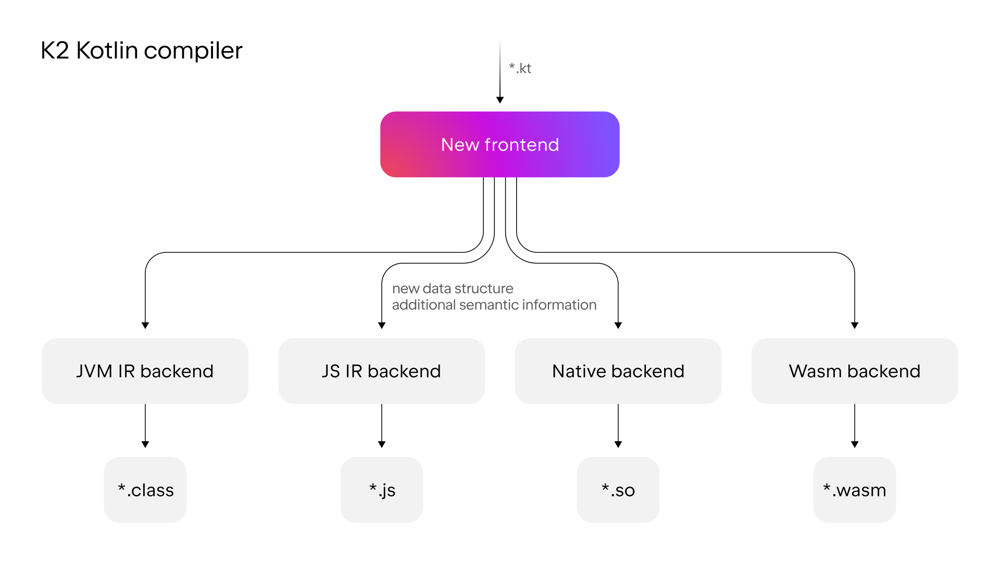

+++
title = "12.1.1 K2 编译器迁移指南"
date = 2026-09-13T08:50:47+08:00
weight = 1
type = "docs"
description = ""
isCJKLanguage = true
draft = false
+++


> 原文链接: [https://kotlinlang.org/docs/k2-compiler-migration-guide.html](https://kotlinlang.org/docs/k2-compiler-migration-guide.html)

# 12.1.1 K2 编译器迁移指南

随着 Kotlin 语言和生态的不断演进，Kotlin 编译器也在演进。第一步是引入共享逻辑的新 JVM 和 JS IR（中间表示）后端，简化了不同平台目标的代码生成。现在，演进的下一个阶段带来了名为 K2 的新前端。



随着 K2 编译器的到来，Kotlin 前端被完全重写，采用了新的、更高效的架构。新编译器带来的根本变化是使用一个包含更多语义信息的统一数据结构。该前端负责执行语义分析、调用解析和类型推断。

新的架构和更丰富的数据结构让 K2 编译器能够提供以下优势：

* **改进的调用解析和类型推断**。编译器行为更一致，也更能理解你的代码。
* **更容易为新语言特性引入语法糖**。将来在引入新特性时，你将能够使用更简洁、更易读的代码。
* **更快的编译时间**。编译时间可能[显著加快](#performance-improvements)。
* **增强的 IDE 性能**。IntelliJ IDEA 和 Android Studio 使用 K2 编译器分析你的 Kotlin 代码，提升了稳定性并带来性能改进。更多信息请参见 [IDE 中的支持](#support-in-ides)。

本指南：

* 说明新 K2 编译器的优势。
* 强调你在迁移过程中可能遇到的变更，以及如何相应调整代码。
* 描述如何回退到之前的版本。

> **注意：** 新的 K2 编译器从 2.0.0 起默认启用。有关 Kotlin 2.0.0 中的新特性以及新 K2 编译器的更多信息，请参见 [Kotlin 2.0.0 新变化](../../../kotlinevolutionandroadmap/13.6-Earlierkotlinreleases/13.6.4-Kotlin20x/13.6.4.2-Whatsnew20/)。

## 性能改进 {#performance-improvements}

为评估 K2 编译器的性能，我们对两个开源项目 [Anki-Android](https://github.com/ankidroid/Anki-Android) 和 [Exposed](https://github.com/JetBrains/Exposed) 做了性能测试。以下是我们发现的主要性能改进：

* K2 编译器带来高达 94% 的编译速度提升。例如在 Anki-Android 项目中，干净构建时间从 Kotlin 1.9.23 的 57.7 秒降到 Kotlin 2.0.0 的 29.7 秒。
* 使用 K2 编译器后，初始化阶段最快提升 488%。例如在 Anki-Android 项目中，增量构建的初始化阶段从 Kotlin 1.9.23 的 0.126 秒缩短到 Kotlin 2.0.0 的仅 0.022 秒。
* 与之前的编译器相比，Kotlin K2 编译器在分析阶段最快提升 376%。例如在 Anki-Android 项目中，增量构建的分析时间从 Kotlin 1.9.23 的 0.581 秒大幅降到 Kotlin 2.0.0 的仅 0.122 秒。

有关这些改进的更多细节，以及我们如何分析 K2 编译器性能的更多信息，请参见我们的[博客文章](https://blog.jetbrains.com/kotlin/2024/04/k2-compiler-performance-benchmarks-and-how-to-measure-them-on-your-projects/)。

## 语言特性改进 {#language-feature-improvements}

Kotlin K2 编译器改进了与[智能转换](#smart-casts)和 [Kotlin Multiplatform](#kotlin-multiplatform)相关的语言特性。

### 智能转换 {#smart-casts}

Kotlin 编译器可以在特定情况下自动把对象转换为某个类型，省去了你手动显式指定的麻烦。这称为[智能转换](../../../languageguide/5.4-Types/5.4.8-Typecasts/#smart-casts)。Kotlin K2 编译器现在在比以前更多的场景中执行智能转换。

在 Kotlin 2.0.0 中，我们在以下方面做了与智能转换相关的改进：

* [局部变量与更深的作用域](#local-variables-and-further-scopes)
* [使用逻辑 `or` 运算符的类型检查](#type-checks-with-the-logical-or-operator)
* [内联函数](#inline-functions)
* [具有函数类型的属性](#properties-with-function-types)
* [异常处理](#exception-handling)
* [自增与自减运算符](#increment-and-decrement-operators)

#### 局部变量与更深的作用域 {#local-variables-and-further-scopes}

以前，如果某个变量在 `if` 条件中被判定为不为 `null`，该变量会被智能转换。关于该变量的信息随后会在 `if` 块的作用域内继续共享。

然而，如果你把变量声明在 `if` 条件的**外部**，那么在 `if` 条件内部就没有关于该变量的信息，因此它无法被智能转换。`when` 表达式和 `while` 循环中也有同样的行为。

从 Kotlin 2.0.0 开始，如果你在 `if`、`when` 或 `while` 条件中使用变量之前先声明它，那么编译器收集到的关于该变量的任何信息都可以在相应的块中用于智能转换。

当你想把布尔条件提取到变量中时，这会很有用。这样你可以给变量起一个有意义的名字，从而提高代码可读性，并使变量能在后续代码中复用。例如：

```kotlin
class Cat {
    fun purr() {
        println("Purr purr")
    }
}

fun petAnimal(animal: Any) {
    val isCat = animal is Cat
    if (isCat) {
        // 在 Kotlin 2.0.0 中，编译器可以访问
        // 关于 isCat 的信息，因此它知道
        // animal 已被智能转换为 Cat 类型。
        // 因此可以调用 purr() 函数。
        // 在 Kotlin 1.9.20 中，编译器不知道
        // 该智能转换，因此调用 purr()
        // 函数会触发错误。
        animal.purr()
    }
}

fun main(){
    val kitty = Cat()
    petAnimal(kitty)
    // Purr purr
}
```

#### 使用逻辑 or 运算符的类型检查 {#type-checks-with-the-logical-or-operator}

在 Kotlin 2.0.0 中，如果你用 `or` 运算符（`||`）组合对对象的类型检查，会智能转换到它们最近的公共父类型。在此变更之前，总是智能转换到 `Any` 类型。

在这种情况下，你仍然必须在之后手动检查对象类型，才能访问它的任何属性或调用它的函数。例如：

```kotlin
interface Status {
    fun signal() {}
}

interface Ok : Status
interface Postponed : Status
interface Declined : Status

fun signalCheck(signalStatus: Any) {
    if (signalStatus is Postponed || signalStatus is Declined) {
        // signalStatus 被智能转换为公共父类型 Status
        signalStatus.signal()
        // 在 Kotlin 2.0.0 之前，signalStatus 被智能转换
        // 为 Any 类型，因此调用 signal() 函数会触发
        // 未解析引用错误。signal() 函数只能在
        // 另一次类型检查之后才能成功调用：

        // check(signalStatus is Status)
        // signalStatus.signal()
    }
}
```

> **注意：** 公共父类型是[联合类型](https://en.wikipedia.org/wiki/Union_type)的**近似**。Kotlin [目前不支持联合类型](https://youtrack.jetbrains.com/issue/KT-13108/Denotable-union-and-intersection-types)。

#### 内联函数 {#inline-functions}

在 Kotlin 2.0.0 中，K2 编译器以不同方式处理内联函数，使其能够结合其他编译器分析来确定智能转换是否安全。

具体来说，内联函数现在被视为具有隐式的 [`callsInPlace`](https://kotlinlang.org/api/latest/jvm/stdlib/kotlin.contracts/-contract-builder/calls-in-place.html) 契约。这意味着传给内联函数的任何 lambda 函数都会被就地调用。由于 lambda 函数是就地调用的，编译器知道 lambda 函数无法泄漏对其函数体内任何变量的引用。

编译器利用这一知识以及其他编译器分析来判断智能转换任何被捕获变量是否安全。例如：

```kotlin
interface Processor {
    fun process()
}

inline fun inlineAction(f: () -> Unit) = f()

fun nextProcessor(): Processor? = null

fun runProcessor(): Processor? {
    var processor: Processor? = null
    inlineAction {
        // 在 Kotlin 2.0.0 中，编译器知道 processor
        // 是局部变量，而 inlineAction() 是内联函数，因此
        // 对 processor 的引用不会泄漏。因此可以
        // 安全地对 processor 进行智能转换。

        // 如果 processor 不为 null，processor 会被智能转换
        if (processor != null) {
            // 编译器知道 processor 不为 null，因此不需要
            // 安全调用
            processor.process()

            // 在 Kotlin 1.9.20 中，你必须执行安全调用：
            // processor?.process()
        }

        processor = nextProcessor()
    }

    return processor
}
```

#### 具有函数类型的属性 {#properties-with-function-types}

在以前的 Kotlin 版本中，有一个缺陷导致具有函数类型的类属性不会被智能转换。我们在 Kotlin 2.0.0 和 K2 编译器中修复了这一行为。例如：

```kotlin
class Holder(val provider: (() -> Unit)?) {
    fun process() {
        // 在 Kotlin 2.0.0 中，如果 provider 不为 null，
        // 则它会被智能转换
        if (provider != null) {
            // 编译器知道 provider 不为 null
            provider()

            // 在 1.9.20 中，编译器不知道 provider 不为
            // null，因此会触发错误：
            // Reference has a nullable type '(() -> Unit)?', use explicit '?.invoke()' to make a function-like call instead
        }
    }
}
```

如果你重载了 `invoke` 运算符，这一变更同样适用。例如：

```kotlin
interface Provider {
    operator fun invoke()
}

interface Processor : () -> String

class Holder(val provider: Provider?, val processor: Processor?) {
    fun process() {
        if (provider != null) {
            provider()
            // 在 1.9.20 中，编译器会触发错误：
            // Reference has a nullable type 'Provider?', use explicit '?.invoke()' to make a function-like call instead
        }
    }
}
```

#### 异常处理 {#exception-handling}

在 Kotlin 2.0.0 中，我们改进了异常处理，使智能转换信息可以传递给 `catch` 和 `finally` 块。这一变更让你的代码更安全，因为编译器会跟踪你的对象是否具有可空类型。例如：

```kotlin
fun testString() {
    var stringInput: String? = null
    // stringInput 被智能转换为 String 类型
    stringInput = ""
    try {
        // 编译器知道 stringInput 不为 null
        println(stringInput.length)
        // 0

        // 编译器拒绝了先前对 stringInput 的智能转换信息。
        // 现在 stringInput 具有 String? 类型。
        stringInput = null

        // 触发一个异常
        if (2 > 1) throw Exception()
        stringInput = ""
    } catch (exception: Exception) {
        // 在 Kotlin 2.0.0 中，编译器知道 stringInput
        // 可能为 null，因此 stringInput 保持可空。
        println(stringInput?.length)
        // null

        // 在 Kotlin 1.9.20 中，编译器说不
        // 需要安全调用，但这是不正确的。
    }
}
fun main() {
    testString()
}
```

#### 自增与自减运算符 {#increment-and-decrement-operators}

在 Kotlin 2.0.0 之前，编译器不理解对象类型在使用自增或自减运算符后可能发生变化。由于编译期无法准确跟踪对象类型，你的代码可能导致未解析引用错误。在 Kotlin 2.0.0 中，这已被修复：

```kotlin
interface Rho {
    operator fun inc(): Sigma = TODO()
}

interface Sigma : Rho {
    fun sigma() = Unit
}

interface Tau {
    fun tau() = Unit
}

fun main(input: Rho) {
    var unknownObject: Rho = input

    // 检查 unknownObject 是否继承自 Tau 接口
    // 注意，unknownObject 有可能同时继承
    // Rho 和 Tau 接口。
    if (unknownObject is Tau) {

        // 使用接口 Rho 中重载的 inc() 运算符。
        // 在 Kotlin 2.0.0 中，unknownObject 的类型被智能转换为
        // Sigma。
        ++unknownObject

        // 在 Kotlin 2.0.0 中，编译器知道 unknownObject 具有
        // Sigma 类型，因此可以成功调用 sigma() 函数。
        unknownObject.sigma()

        // 在 Kotlin 1.9.20 中，调用 inc() 时编译器不会
        // 执行智能转换，因此编译器仍认为
        // unknownObject 具有 Tau 类型。调用 sigma() 函数
        // 会抛出编译期错误。

        // 在 Kotlin 2.0.0 中，编译器知道 unknownObject 具有
        // Sigma 类型，因此调用 tau() 函数会抛出编译期
        // 错误。
        unknownObject.tau()
        // 未解析引用 'tau'

        // 在 Kotlin 1.9.20 中，由于编译器错误地认为
        // unknownObject 具有 Tau 类型，可以调用 tau() 函数，
        // 但它会抛出 ClassCastException。
    }
}
```

### Kotlin Multiplatform {#kotlin-multiplatform}

K2 编译器在以下方面有与 Kotlin Multiplatform 相关的改进：

* [编译期间通用源与平台源的分离](#separation-of-common-and-platform-sources-during-compilation)
* [预期声明与实际声明的不同可见性级别](#different-visibility-levels-of-expected-and-actual-declarations)

#### 编译期间通用源与平台源的分离 {#separation-of-common-and-platform-sources-during-compilation}

以前，Kotlin 编译器的设计使其无法在编译期保持通用源集与平台源集的分离。因此，通用代码可以访问平台代码，从而导致各平台之间存在行为差异。此外，通用代码中的一些编译器设置和依赖会泄漏到平台代码中。

在 Kotlin 2.0.0 中，我们对新 Kotlin K2 编译器的实现重新设计了编译方案，以确保通用源集与平台源集严格分离。当你使用[预期函数与实际函数](https://kotlinlang.org/docs/multiplatform/multiplatform-expect-actual.html#expected-and-actual-functions)时，这一变更最为明显。以前，通用代码中的函数调用有可能解析到平台代码中的函数。例如：

| 通用代码 | 平台代码 |
| --- | --- |
| ```kotlin fun foo(x: Any) = println("common foo")  fun exampleFunction() {     foo(42) } ``` | ```kotlin // JVM fun foo(x: Int) = println("platform foo")  // JavaScript // There is no foo() function overload on the JavaScript platform ``` |

在这个示例中，通用代码的行为因运行平台不同而不同：

* 在 JVM 平台上，调用通用代码中的 `foo()` 函数会导致调用平台代码中的 `foo()` 函数，输出 `platform foo`。
* 在 JavaScript 平台上，调用通用代码中的 `foo()` 函数会导致调用通用代码中的 `foo()` 函数，输出 `common foo`，因为平台代码中没有这样的函数。

在 Kotlin 2.0.0 中，通用代码无法访问平台代码，因此两个平台都会成功地把 `foo()` 函数解析为通用代码中的 `foo()` 函数：`common foo`。

除了改进跨平台行为的一致性之外，我们还努力修复 IntelliJ IDEA 或 Android Studio 与编译器之间行为冲突的情况。例如，当你使用[预期类与实际类](https://kotlinlang.org/docs/multiplatform/multiplatform-expect-actual.html#expected-and-actual-classes)时，会出现以下情况：

| 通用代码 | 平台代码 |
| --- | --- |
| ```kotlin expect class Identity {     fun confirmIdentity(): String }  fun common() {     // Before 2.0.0, it triggers an IDE-only error     Identity().confirmIdentity()     // RESOLUTION_TO_CLASSIFIER : Expected class Identity has no default constructor. } ``` | ```kotlin actual class Identity {     actual fun confirmIdentity() = "expect class fun: jvm" } ``` |

在这个示例中，预期类 `Identity` 没有默认构造器，因此无法在通用代码中成功调用。以前，只有 IDE 会报告错误，但代码在 JVM 上仍能成功编译。而现在编译器会正确地报告错误：

```none
Expected class 'expect class Identity : Any' does not have default constructor
```

##### 解析行为不变的场景 {#when-resolution-behavior-doesn-t-change}

我们仍在迁移到新编译方案的过程中，因此当你调用不在同一源集中的函数时，解析行为仍然相同。你主要会在通用代码中使用多平台库的重载时注意到这一差异。

假设你有一个库，其中有两个签名不同的 `whichFun()` 函数：

```kotlin
// 示例库

// MODULE: common
fun whichFun(x: Any) = println("common function")

// MODULE: JVM
fun whichFun(x: Int) = println("platform function")
```

如果你在通用代码中调用 `whichFun()` 函数，会解析到库中参数类型最相关的那个函数：

```kotlin
// 一个为 JVM 目标使用示例库的项目

// MODULE: common
fun main(){
    whichFun(2)
    // platform function
}
```

相比之下，如果你在同一源集中声明 `whichFun()` 的重载，会解析到通用代码中的函数，因为你的代码无法访问平台特有的版本：

```kotlin
// 未使用示例库

// MODULE: common
fun whichFun(x: Any) = println("common function")

fun main(){
    whichFun(2)
    // common function
}

// MODULE: JVM
fun whichFun(x: Int) = println("platform function")
```

与多平台库类似，由于 `commonTest` 模块位于单独的源集中，它也仍然可以访问平台特有的代码。因此，对 `commonTest` 模块中函数的调用解析表现出与旧编译方案相同的行为。

将来，这些剩余情况会与新编译方案更加一致。

#### 预期声明与实际声明的不同可见性级别 {#different-visibility-levels-of-expected-and-actual-declarations}

在 Kotlin 2.0.0 之前，如果你在 Kotlin Multiplatform 项目中使用[预期声明与实际声明](https://kotlinlang.org/docs/multiplatform/multiplatform-expect-actual.html)，它们必须具有相同的[可见性级别](../../../languageguide/5.1-Basicsyntax/5.1.5-VisibilityModifiers/)。Kotlin 2.0.0 现在也支持不同的可见性级别，但**仅当**实际声明比预期声明_更_宽松时。例如：

```kotlin
expect internal class Attribute // expect internal class Attribute // 可见性为 internal
actual class Attribute // actual class Attribute          // 可见性默认为 public，
                                // 这更为宽松
```

类似地，如果你在实际声明中使用[类型别名](../../../languageguide/5.4-Types/5.4.9-TypeAliases/)，则**底层类型**的可见性应与预期声明相同或更宽松。例如：

```kotlin
expect internal class Attribute // expect internal class Attribute                 // 可见性为 internal
internal actual typealias Attribute = Expanded

class Expanded // class Expanded                                  // 可见性默认为 public，
                                                // 这更为宽松
```

## 如何启用 Kotlin K2 编译器 {#how-to-enable-the-kotlin-k2-compiler}

从 Kotlin 2.0.0 开始，Kotlin K2 编译器默认启用。

要升级 Kotlin 版本，请在你的 [Gradle](../../../buildtools/11.1-Gradle/11.1.3-GradleConfigureProject/#apply-the-plugin) 和 [Maven](../../../buildtools/11.2-Maven/11.2.2-MavenConfigureProject/) 构建脚本中把它改为 2.0.0 或更高版本。

### 在 Gradle 中使用 Kotlin 构建报告 {#use-kotlin-build-reports-with-gradle}

Kotlin [构建报告](../../../buildtools/11.1-Gradle/11.1.6-GradleCompilationAndCaches/#build-reports)提供 Kotlin 编译器任务在不同编译阶段所花时间的信息，以及所使用的编译器和 Kotlin 版本，还有编译是否是增量的。这些构建报告有助于评估你的构建性能。它们比 [Gradle 构建扫描](https://scans.gradle.com/)提供更多关于 Kotlin 编译流水线的洞察，因为它们让你可以总览所有 Gradle 任务的性能。

#### 如何启用构建报告 {#how-to-enable-build-reports}

要启用构建报告，请在 `gradle.properties` 文件中声明你想保存构建报告输出的位置：

```none
kotlin.build.report.output=file
```

输出可以使用以下值及其组合：

| 选项        | 说明                                                                                                                                                                                                                                                                                                                                                                                                                                                                                                                                                                                                                                                                          |

| `file`        | 以人类可读的格式把构建报告保存到本地文件。默认位置是 `${project_folder}/build/reports/kotlin-build/${project_name}-timestamp.txt`                                                                                                                                                                                                                                                                                                                                                                                                                                                                                                                        |
| `single_file` | 以对象格式把构建报告保存到指定的本地文件。                                                                                                                                                                                                                                                                                                                                                                                                                                                                                                                                                                                                              |
| `build_scan`  | 把构建报告保存到[构建扫描](https://scans.gradle.com/)的 `custom values` 部分。请注意，Gradle Enterprise 插件会限制自定义值的数量和长度。在大型项目中，某些值可能会丢失。                                                                                                                                                                                                                                                                                                                                                                                                                                           |
| `http`        | 通过 HTTP(S) 提交构建报告。POST 方法以 JSON 格式发送指标。你可以在 [Kotlin 仓库](https://github.com/JetBrains/kotlin/blob/master/libraries/tools/kotlin-gradle-plugin/src/common/kotlin/org/jetbrains/kotlin/gradle/report/data/GradleCompileStatisticsData.kt)中查看当前发送数据的版本。你可以在[这篇博客文章](https://blog.jetbrains.com/kotlin/2022/06/introducing-kotlin-build-reports/?_gl=1*1a7pghy*_ga*MTcxMjc1NzE5Ny4xNjY1NDAzNjkz*_ga_9J976DJZ68*MTcxNTA3NjA2NS4zNzcuMS4xNzE1MDc2MDc5LjQ2LjAuMA..&_ga=2.265800911.1124071296.1714976764-1712757197.1665403693#enable_build_reports)中找到 HTTP 端点的示例 |
| `json`        | 以 JSON 格式把构建报告保存到本地文件。在 `kotlin.build.report.json.directory` 中设置构建报告的位置。默认文件名为 `${project_name}-build-<date-time>-<index>.json`。                                                                                                                                                                                                                                                                                                                                                                                                                                                                      |

有关构建报告能做什么的更多信息，请参见[构建报告](../../../buildtools/11.1-Gradle/11.1.6-GradleCompilationAndCaches/#build-reports)。

## IDE 中的支持 {#support-in-ides}

IntelliJ IDEA 和 Android Studio 都完全支持 K2 编译器，并默认使用它来改进代码分析、代码补全和高亮显示。你无需进行任何配置。更新到最新版本即可享受这些好处。

## 在 Kotlin Playground 中试用 Kotlin K2 编译器 {#try-the-kotlin-k2-compiler-in-the-kotlin-playground}

Kotlin Playground 支持 Kotlin 2.0.0 及更高版本。[试试看！](https://pl.kotl.in/czuoQprce)

## 如何回退到之前的编译器 {#how-to-roll-back-to-the-previous-compiler}

要在 Kotlin 2.0.0–2.3.21 中使用之前的编译器，可以：

* 在 `build.gradle.kts` 文件中[把语言版本设置](../../../buildtools/11.1-Gradle/11.1.5-GradleCompilerOptions/#example-of-setting-languageversion)为 `1.9`。

或者
* 使用以下编译器选项：`-language-version 1.9`。

从 Kotlin 2.4.0 起，你无法再回退到之前的编译器。

## 变更 {#changes}

随着新前端的引入，Kotlin 编译器经历了若干变更。让我们先强调对你的代码影响最大的修改，说明发生了什么变化，并详细说明今后的最佳实践。如果你想了解更多，我们把这些变更组织成[主题领域](#per-subject-area)，方便你进一步阅读。

本节重点介绍以下修改：

* [带后备字段的 open 属性必须立即初始化](#immediate-initialization-of-open-properties-with-backing-fields)
* [弃用投影接收者上的合成 setter](#deprecated-synthetics-setter-on-a-projected-receiver)
* [禁止使用不可访问的泛型类型](#forbidden-use-of-inaccessible-generic-types)
* [同名 Kotlin 属性与 Java 字段的一致解析顺序](#consistent-resolution-order-of-kotlin-properties-and-java-fields-with-the-same-name)
* [改进 Java 基本类型数组的空安全](#improved-null-safety-for-java-primitive-arrays)
* [预期类中抽象成员的更严格规则](#stricter-rules-for-abstract-members-in-expected-classes)

### 带后备字段的 open 属性必须立即初始化 {#immediate-initialization-of-open-properties-with-backing-fields}

**有什么变化？**

在 Kotlin 2.0 中，所有带后备字段的 `open` 属性都必须立即初始化；否则你会得到编译错误。以前只有 `open var` 属性需要立即初始化，但现在这也扩展到了带后备字段的 `open val` 属性：

```kotlin
open class Base {
    open val a: Int
    open var b: Int

    init {
        // 从 Kotlin 2.0 开始报错，此前可以成功编译
        this.a = 1 // Error: open val 必须有初始化器
        // 一直是错误
        this.b = 1 // Error: open var 必须有初始化器
    }
}

class Derived : Base() {
    override val a: Int = 2
    override var b = 2
}
```

这一变更使编译器的行为更可预测。考虑一个 `open val` 属性被带自定义 setter 的 `var` 属性重写的例子。

如果使用自定义 setter，延迟初始化可能导致混淆，因为不清楚你是想初始化后备字段还是想调用 setter。过去，如果你想调用 setter，旧编译器无法保证 setter 随后会初始化后备字段。

**现在的最佳实践是什么？**

我们鼓励你始终初始化带后备字段的 open 属性，因为我们认为这种做法既更高效也更不容易出错。

不过，如果你不想立即初始化某个属性，可以：

* 把属性设为 `final`。
* 使用允许延迟初始化的私有后备属性。

更多信息请参见 [YouTrack 中的相应议题](https://youtrack.jetbrains.com/issue/KT-57555)。

### 弃用投影接收者上的合成 setter {#deprecated-synthetics-setter-on-a-projected-receiver}

**有什么变化？**

如果你使用 Java 类的合成 setter 赋值一个与该类投影类型冲突的类型，就会触发错误。

假设你有一个名为 `Container` 的 Java 类，其中包含 `getFoo()` 和 `setFoo()` 方法：

```java
public class Container<E> {
    public E getFoo() {
        return null;
    }
    public void setFoo(E foo) {}
}
```

如果你有以下 Kotlin 代码，其中 `Container` 类的实例具有投影类型，使用 `setFoo()` 方法总是会产生错误。不过，只有从 Kotlin 2.0.0 起，合成的 `foo` 属性才会触发错误：

```kotlin
fun exampleFunction(starProjected: Container<*>, inProjected: Container<in Number>, sampleString: String) {
    starProjected.setFoo(sampleString)
    // 从 Kotlin 1.0 起就是错误

    // 合成 setter `foo` 解析到 `setFoo()` 方法
    starProjected.foo = sampleString
    // 从 Kotlin 2.0.0 起是错误

    inProjected.setFoo(sampleString)
    // 从 Kotlin 1.0 起就是错误

    // 合成 setter `foo` 解析到 `setFoo()` 方法
    inProjected.foo = sampleString
    // 从 Kotlin 2.0.0 起是错误
}
```

**现在的最佳实践是什么？**

如果你发现这一变更在你的代码中引入了错误，你可能需要重新考虑类型声明的组织方式。也许你并不需要使用类型投影，或者需要移除代码中的某些赋值。

更多信息请参见 [YouTrack 中的相应议题](https://youtrack.jetbrains.com/issue/KT-54309)。

### 禁止使用不可访问的泛型类型 {#forbidden-use-of-inaccessible-generic-types}

**有什么变化？**

由于 K2 编译器采用了新架构，我们改变了处理不可访问泛型类型的方式。一般来说，你绝不应在代码中依赖不可访问的泛型类型，因为这表明项目的构建配置有误，使编译器无法访问编译所需的信息。在 Kotlin 2.0.0 中，你不能声明或调用带不可访问泛型类型的函数字面量，也不能使用带不可访问泛型类型实参的泛型类型。这一限制帮助你避免在后续代码中出现编译器错误。

例如，假设你在一个模块中声明了一个泛型类：

```kotlin
// 模块一
class Node<V>(val value: V)
```

如果你有另一个模块（模块二）并配置了对模块一的依赖，你的代码可以访问 `Node<V>` 类，并把它用作函数类型中的类型：

```kotlin
// 模块二
fun execute(func: (Node<Int>) -> Unit) {}
// 函数编译成功
```

然而，如果你的项目配置有误，例如有第三个模块（模块三）只依赖模块二，那么在编译第三个模块时，Kotlin 编译器无法访问**模块一**中的 `Node<V>` 类。现在，模块三中使用 `Node<V>` 类型的任何 lambda 或匿名函数在 Kotlin 2.0.0 中都会触发错误，从而防止后续代码中本可避免的编译器错误、崩溃和运行时异常：

```kotlin
// 模块三
fun test() {
    // 在 Kotlin 2.0.0 中触发错误，因为隐式
    // lambda 参数（it）的类型解析为 Node，而它不可访问
    execute {}

    // 在 Kotlin 2.0.0 中触发错误，因为未使用的
    // lambda 参数（_）的类型解析为 Node，而它不可访问
    execute { _ -> }

    // 在 Kotlin 2.0.0 中触发错误，因为未使用的
    // 匿名函数参数（_）的类型解析为 Node，而它不可访问
    execute(fun (_) {})
}
```

除了函数字面量在包含不可访问泛型类型的值参数时触发错误之外，当某个类型具有不可访问的泛型类型实参时也会出错。

例如，模块一中有相同的泛型类声明。在模块二中，你声明了另一个泛型类：`Container<C>`。此外，你在模块二中声明了使用 `Container<C>`、并以泛型类 `Node<V>` 作为类型实参的函数：

| 模块一 | 模块二 |
| --- | --- |
| ```kotlin // Module one class Node<V>(val value: V) ``` | ```kotlin // Module two class Container<C>(vararg val content: C)  // Functions with generic class type that // also have a generic class type argument fun produce(): Container<Node<Int>> = Container(Node(42)) fun consume(arg: Container<Node<Int>>) {} ``` |

如果你在模块三中尝试调用这些函数，在 Kotlin 2.0.0 中会触发错误，因为泛型类 `Node<V>` 从模块三无法访问：

```kotlin
// 模块三
fun test() {
    // 在 Kotlin 2.0.0 中触发错误，因为泛型类 Node<V>
    // 不可访问
    consume(produce())
}
```

在未来的版本中，我们会继续整体上弃用不可访问类型的使用。我们已经在 Kotlin 2.0.0 中迈出第一步，为一些不可访问类型（包括非泛型类型）的场景添加了警告。

例如，让我们使用与前几个示例相同的模块设置，但把泛型类 `Node<V>` 换成非泛型类 `IntNode`，所有函数都声明在模块二中：

| 模块一 | 模块二 |
| --- | --- |
| ```kotlin // Module one class IntNode(val value: Int) ``` | ```kotlin // Module two // A function that contains a lambda  // parameter with `IntNode` type fun execute(func: (IntNode) -> Unit) {}  class Container<C>(vararg val content: C)  // Functions with generic class type // that has `IntNode` as a type argument fun produce(): Container<IntNode> = Container(IntNode(42)) fun consume(arg: Container<IntNode>) {} ``` |

如果你在模块三中调用这些函数，会触发一些警告：

```kotlin
// 模块三
fun test() {
    // 在 Kotlin 2.0.0 中触发警告，因为类 IntNode
    // 不可访问。

    execute {}
    // 参数 'it' 的类 'IntNode' 不可访问。

    execute { _ -> }
    execute(fun (_) {})
    // 参数 '_' 的类 'IntNode' 不可访问。

    // 在未来的 Kotlin 版本中会触发警告，因为 IntNode
    // 不可访问。
    consume(produce())
}
```

**现在的最佳实践是什么？**

如果你遇到关于不可访问泛型类型的新警告，很可能是你的构建系统配置有问题。我们建议检查你的构建脚本和配置。

作为最后的手段，你可以为模块三配置对模块一的直接依赖。或者，你可以修改代码，让这些类型在同一模块内可访问。

更多信息请参见 [YouTrack 中的相应议题](https://youtrack.jetbrains.com/issue/KT-64474)。

### 同名 Kotlin 属性与 Java 字段的一致解析顺序 {#consistent-resolution-order-of-kotlin-properties-and-java-fields-with-the-same-name}

**有什么变化？**

在 Kotlin 2.0.0 之前，如果你处理相互继承且包含同名 Kotlin 属性和 Java 字段的 Java 与 Kotlin 类，重复名称的解析行为不一致。IntelliJ IDEA 与编译器之间也存在行为冲突。在为 Kotlin 2.0.0 设计新的解析行为时，我们力求对用户造成最小影响。

例如，假设有一个 Java 类 `Base`：

```java
public class Base {
    public String a = "a";

    public String b = "b";
}
```

假设还有一个继承自上述 `Base` 类的 Kotlin 类 `Derived`：

```kotlin
class Derived : Base() {
    val a = "aa"

    // 声明自定义 get() 函数
    val b get() = "bb"
}

fun main() {
    // 解析为 Derived.a
    println(a)
    // aa

    // 解析为 Base.b
    println(b)
    // b
}
```

在 Kotlin 2.0.0 之前，`a` 解析到 `Derived` Kotlin 类中的 Kotlin 属性，而 `b` 解析到 `Base` Java 类中的 Java 字段。

在 Kotlin 2.0.0 中，示例中的解析行为是一致的，确保 Kotlin 属性优先于同名的 Java 字段。现在 `b` 解析为：`Derived.b`。

> **注意：** 在 Kotlin 2.0.0 之前，如果你在 IntelliJ IDEA 中跳转到 `a` 的声明或用法，它会错误地跳转到 Java 字段，而本应跳转到 Kotlin 属性。从 Kotlin 2.0.0 起，IntelliJ IDEA 会正确跳转到与编译器相同的位置。

一般规则是子类优先。上一个示例展示了这一点：`Derived` 类中的 Kotlin 属性 `a` 被解析，因为 `Derived` 是 `Base` Java 类的子类。

如果继承关系反过来，即 Java 类继承 Kotlin 类，则子类中的 Java 字段优先于同名的 Kotlin 属性。

考虑这个示例：

| Kotlin | Java |
| --- | --- |
| ```kotlin open class Base {     val a = "aa" } ``` | ```java public class Derived extends Base {     public String a = "a"; } ``` |

现在在以下代码中：

```kotlin
fun main() {
    // 解析为 Derived.a
    println(a)
    // a
}
```

**现在的最佳实践是什么？**

如果这一变更影响了你的代码，请考虑你是否真的需要使用重复的名称。如果你希望 Java 或 Kotlin 类各自包含同名的字段或属性，并且彼此相互继承，请记住子类中的字段或属性会优先。

更多信息请参见 [YouTrack 中的相应议题](https://youtrack.jetbrains.com/issue/KT-55017)。

### 改进 Java 基本类型数组的空安全 {#improved-null-safety-for-java-primitive-arrays}

**有什么变化？**

从 Kotlin 2.0.0 开始，编译器会正确推断导入到 Kotlin 的 Java 基本类型数组的可空性。现在它会保留 Java 基本类型数组所用 `TYPE_USE` 注解的原生可空性，并在取值未按注解使用时发出错误。

通常，当从 Kotlin 调用带 `@Nullable` 和 `@NotNull` 注解的 Java 类型时，它们会获得相应的原生可空性：

```java
interface DataService {
    @NotNull ResultContainer<@Nullable String> fetchData();
}
```
```kotlin
val dataService: DataService = ...
dataService.fetchData() // -> ResultContainer<String?>
```

然而以前，当 Java 基本类型数组导入到 Kotlin 时，所有 `TYPE_USE` 注解都会丢失，导致平台可空性和可能不安全的代码：

```java
interface DataProvider {
    int @Nullable [] fetchData();
}
```

```kotlin
val dataService: DataProvider = ...
dataService.fetchData() // -> IntArray .. IntArray?
// 没有错误，即使根据注解 `dataService.fetchData()` 可能为 `null`
// 这可能导致 NullPointerException
dataService.fetchData()[0]
```
请注意，该问题从未影响声明本身上的可空性注解，只影响 `TYPE_USE` 注解。

**现在的最佳实践是什么？**

在 Kotlin 2.0.0 中，Java 基本类型数组的空安全现在是 Kotlin 中的标准行为，因此如果你使用它们，请检查代码中是否出现新的警告和错误：

* 任何在没有显式可空性检查的情况下使用 `@Nullable` Java 基本类型数组的代码，或者尝试把 `null` 传给期望非可空基本类型数组的 Java 方法的代码，现在都无法编译。
* 对 `@NotNull` 基本类型数组做可空性检查现在会产生 "Unnecessary safe call" 或 "Comparison with null always false" 警告。

更多信息请参见 [YouTrack 中的相应议题](https://youtrack.jetbrains.com/issue/KT-54521)。

### 预期类中抽象成员的更严格规则 {#stricter-rules-for-abstract-members-in-expected-classes}

> **警告：** 预期类与实际类处于 [Beta](../../../kotlinevolutionandroadmap/13.4-ComponentsStability/#stability-levels-explained) 阶段。它们几乎已经稳定，但将来你可能需要执行迁移步骤。我们会尽力把你需要做的进一步改动降到最少。

**有什么变化？**

由于 K2 编译器在编译期间分离了通用源与平台源，我们对预期类中的抽象成员实施了更严格的规则。

在以前的编译器中，预期的非抽象类可以在不[重写函数](../../../languageguide/5.8-Classesandinterfaces/5.8.6-Inheritance/#overriding-rules)的情况下继承抽象函数。由于编译器可以同时访问通用代码和平台代码，它能够看到该抽象函数在实际类中是否有对应的重写和定义。

既然通用源与平台源是分别编译的，被继承的函数就必须在预期类中显式重写，以便编译器知道该函数不是抽象的。否则，编译器会报告 `ABSTRACT_MEMBER_NOT_IMPLEMENTED` 错误。

例如，假设你在通用源集中声明了一个名为 `FileSystem` 的抽象类，其中有一个抽象函数 `listFiles()`。你在平台源集中作为实际声明的一部分定义了 `listFiles()` 函数。

在你的通用代码中，如果有一个名为 `PlatformFileSystem` 的预期非抽象类继承自 `FileSystem` 类，那么 `PlatformFileSystem` 类会继承抽象函数 `listFiles()`。然而在 Kotlin 中，非抽象类不能有抽象函数。要让 `listFiles()` 函数变为非抽象，你必须不带 `abstract` 关键字地把它声明为重写：

| 通用代码 | 平台代码 |
| --- | --- |
| ```kotlin abstract class FileSystem {     abstract fun listFiles() } expect open class PlatformFileSystem() : FileSystem {     // In Kotlin 2.0.0, an explicit override is needed     expect override fun listFiles()     // Before Kotlin 2.0.0, an override wasn't needed } ``` | ```kotlin actual open class PlatformFileSystem : FileSystem {     actual override fun listFiles() {} } ``` |

**现在的最佳实践是什么？**

如果你在预期非抽象类中继承了抽象函数，请添加非抽象的重写。

更多信息请参见 [YouTrack](https://youtrack.jetbrains.com/issue/KT-59739/K2-MPP-reports-ABSTRACTMEMBERNOTIMPLEMENTED-for-inheritor-in-common-code-when-the-implementation-is-located-in-the-actual) 中的相应议题。

### 按主题领域 {#per-subject-area}

这些主题领域列出了不太可能影响你代码的变更，并提供了相关 YouTrack 议题的链接以便进一步阅读。问题 ID 旁带星号（*）的变更在本节开头有解释。

#### 类型推断 {#type-inference}

| 问题 ID                                                  | 标题                                                                                                      |

| [KT-64189](https://youtrack.jetbrains.com/issue/KT-64189) | Incorrect type in compiled function signature of property reference if the type is Normal explicitly       |
| [KT-47986](https://youtrack.jetbrains.com/issue/KT-47986) | Forbid implicit inferring a type variable into an upper bound in the builder inference context             |
| [KT-59275](https://youtrack.jetbrains.com/issue/KT-59275) | K2: Require explicit type arguments for generic annotation calls in array literals                         |
| [KT-53752](https://youtrack.jetbrains.com/issue/KT-53752) | Missed subtyping check for an intersection type                                                            |
| [KT-59138](https://youtrack.jetbrains.com/issue/KT-59138) | Change Java type parameter based types default representation in Kotlin                                    |
| [KT-57178](https://youtrack.jetbrains.com/issue/KT-57178) | Change inferred type of prefix increment to return type of getter instead of return type of inc() operator |
| [KT-57609](https://youtrack.jetbrains.com/issue/KT-57609) | K2: Stop relying on the presence of @UnsafeVariance using for contravariant parameters                     |
| [KT-57620](https://youtrack.jetbrains.com/issue/KT-57620) | K2: Forbid resolution to subsumed members for raw types                                                    |
| [KT-64641](https://youtrack.jetbrains.com/issue/KT-64641) | K2: Properly inferred type of callable reference to a callable with extension-function parameter           |
| [KT-57011](https://youtrack.jetbrains.com/issue/KT-57011) | Make real type of a destructuring variable consistent with explicit type when specified                    |
| [KT-38895](https://youtrack.jetbrains.com/issue/KT-38895) | K2: Fix inconsistent behavior with integer literals overflow                                               |
| [KT-54862](https://youtrack.jetbrains.com/issue/KT-54862) | Anonymous type can be exposed from anonymous function from type argument                                   |
| [KT-22379](https://youtrack.jetbrains.com/issue/KT-22379) | Condition of while-loop with break can produce unsound smartcast                                           |
| [KT-62507](https://youtrack.jetbrains.com/issue/KT-62507) | K2: Prohibit smart cast in common code for expect/actual top-level property                                |
| [KT-65750](https://youtrack.jetbrains.com/issue/KT-65750) | Increment and plus operators that change return type must affect smart casts                               |
| [KT-65349](https://youtrack.jetbrains.com/issue/KT-65349) | [LC] K2: specifying variable types explicitly breaks bound smart casts in some cases that worked in K1     |

#### 泛型 {#generics}

| 问题 ID                                                   | 标题                                                                                                                                                 |

| [KT-54309](https://youtrack.jetbrains.com/issue/KT-54309)* | [弃用投影接收者上合成 setter 的使用](#deprecated-synthetics-setter-on-a-projected-receiver)                                  |
| [KT-57600](https://youtrack.jetbrains.com/issue/KT-57600)  | Forbid overriding of Java method with raw-typed parameter with generic typed parameter                                                                |
| [KT-54663](https://youtrack.jetbrains.com/issue/KT-54663)  | Forbid passing possibly nullable type parameter to \`in\` projected DNN parameter                                                                     |
| [KT-54066](https://youtrack.jetbrains.com/issue/KT-54066)  | Deprecate upper bound violation in typealias constructors                                                                                             |
| [KT-49404](https://youtrack.jetbrains.com/issue/KT-49404)  | Fix type unsoundness for contravariant captured type based on Java class                                                                              |
| [KT-61718](https://youtrack.jetbrains.com/issue/KT-61718)  | Forbid unsound code with self upper bounds and captured types                                                                                         |
| [KT-61749](https://youtrack.jetbrains.com/issue/KT-61749)  | Forbid unsound bound violation in generic inner class of generic outer class                                                                          |
| [KT-62923](https://youtrack.jetbrains.com/issue/KT-62923)  | K2: Introduce PROJECTION_IN_IMMEDIATE_ARGUMENT_TO_SUPERTYPE for projections of outer super types of inner class                                       |
| [KT-63243](https://youtrack.jetbrains.com/issue/KT-63243)  | Report MANY_IMPL_MEMBER_NOT_IMPLEMENTED when inheriting from collection of primitives with an extra specialized implementation from another supertype |
| [KT-60305](https://youtrack.jetbrains.com/issue/KT-60305)  | K2: Prohibit constructor call and inheritance on type alias that has variance modifiers in expanded type                                              |
| [KT-64965](https://youtrack.jetbrains.com/issue/KT-64965)  | Fix type hole caused by improper handling of captured types with self-upper bounds                                                                    |
| [KT-64966](https://youtrack.jetbrains.com/issue/KT-64966)  | Forbid generic delegating constructor calls with wrong type for generic parameter                                                                     |
| [KT-65712](https://youtrack.jetbrains.com/issue/KT-65712)  | Report missing upper bound violation when upper bound is captured type                                                                                |

#### 解析 {#resolution}

| 问题 ID                                                   | 标题                                                                                                                                                                                        |

| [KT-55017](https://youtrack.jetbrains.com/issue/KT-55017)* | [在重载解析中优先选择派生类的 Kotlin 属性而非基类的 Java 字段](#consistent-resolution-order-of-kotlin-properties-and-java-fields-with-the-same-name) |
| [KT-58260](https://youtrack.jetbrains.com/issue/KT-58260)  | Make invoke convention works consistently with expected desugaring                                                                                                                           |
| [KT-62866](https://youtrack.jetbrains.com/issue/KT-62866)  | K2: Change qualifier resolution behavior when companion object is preferred against static scope                                                                                             |
| [KT-57750](https://youtrack.jetbrains.com/issue/KT-57750)  | Report ambiguity error when resolving types and having the same-named classes star imported                                                                                                  |
| [KT-63558](https://youtrack.jetbrains.com/issue/KT-63558)  | K2: migrate resolution around COMPATIBILITY_WARNING                                                                                                                                          |
| [KT-51194](https://youtrack.jetbrains.com/issue/KT-51194)  | False negative CONFLICTING_INHERITED_MEMBERS when dependency class contained in two different versions of the same dependency                                                                |
| [KT-37592](https://youtrack.jetbrains.com/issue/KT-37592)  | Property invoke of a functional type with receiver is preferred over extension function invoke                                                                                               |
| [KT-51666](https://youtrack.jetbrains.com/issue/KT-51666)  | Qualified this: introduce/prioritize this qualified with type case                                                                                                                           |
| [KT-54166](https://youtrack.jetbrains.com/issue/KT-54166)  | Confirm unspecified behavior in case of FQ name conflicts in classpath                                                                                                                       |
| [KT-64431](https://youtrack.jetbrains.com/issue/KT-64431)  | K2: forbid using typealiases as qualifier in imports                                                                                                                                         |
| [KT-56520](https://youtrack.jetbrains.com/issue/KT-56520)  | K1/K2: incorrect work of resolve tower for type references with ambiguity at lower level                                                                                                     |

#### 可见性 {#visibility}

| 问题 ID                                                    | 标题                                                                                                                          |

| [KT-64474](https://youtrack.jetbrains.com/issue/KT-64474/)* | [把不可访问类型的使用声明为未指定行为](#forbidden-use-of-inaccessible-generic-types)                   |
| [KT-55179](https://youtrack.jetbrains.com/issue/KT-55179)   | False negative PRIVATE_CLASS_MEMBER_FROM_INLINE on calling private class companion object member from internal inline function |
| [KT-58042](https://youtrack.jetbrains.com/issue/KT-58042)   | Make synthetic property invisible if equivalent getter is invisible even when overridden declaration is visible                |
| [KT-64255](https://youtrack.jetbrains.com/issue/KT-64255)   | Forbid accessing internal setter from a derived class in another module                                                        |
| [KT-33917](https://youtrack.jetbrains.com/issue/KT-33917)   | Prohibit to expose anonymous types from private inline functions                                                               |
| [KT-54997](https://youtrack.jetbrains.com/issue/KT-54997)   | Forbid implicit non-public-API accesses from public-API inline function                                                        |
| [KT-56310](https://youtrack.jetbrains.com/issue/KT-56310)   | Smart casts should not affect visibility of protected members                                                                  |
| [KT-65494](https://youtrack.jetbrains.com/issue/KT-65494)   | Forbid access to overlooked private operator functions from public inline function                                             |
| [KT-65004](https://youtrack.jetbrains.com/issue/KT-65004)   | K1: Setter of var, which overrides protected val, is generates as public                                                       |
| [KT-64972](https://youtrack.jetbrains.com/issue/KT-64972)   | Forbid overriding by private members in link-time for Kotlin/Native                                                            |

#### 注解 {#annotations}

| 问题 ID                                                  | 标题                                                                                                  |

| [KT-58723](https://youtrack.jetbrains.com/issue/KT-58723) | Forbid annotating statements with an annotation if it has no EXPRESSION target                         |
| [KT-49930](https://youtrack.jetbrains.com/issue/KT-49930) | Ignore parentheses expression during \`REPEATED_ANNOTATION\` checking                                  |
| [KT-57422](https://youtrack.jetbrains.com/issue/KT-57422) | K2: Prohibit use-site 'get' targeted annotations on property getters                                   |
| [KT-46483](https://youtrack.jetbrains.com/issue/KT-46483) | Prohibit annotation on type parameter in where clause                                                  |
| [KT-64299](https://youtrack.jetbrains.com/issue/KT-64299) | Companion scope is ignored for resolution of annotations on companion object                           |
| [KT-64654](https://youtrack.jetbrains.com/issue/KT-64654) | K2: Introduced ambiguity between user and compiler-required annotations                                |
| [KT-64527](https://youtrack.jetbrains.com/issue/KT-64527) | Annotations on enum values shouldn't be copied to enum value classes                                   |
| [KT-63389](https://youtrack.jetbrains.com/issue/KT-63389) | K2: \`WRONG_ANNOTATION_TARGET\` is reported on incompatible annotations of a type wrapped into \`()?\` |
| [KT-63388](https://youtrack.jetbrains.com/issue/KT-63388) | K2: \`WRONG_ANNOTATION_TARGET\` is reported on catch parameter type's annotations                      |

#### 空安全 {#null-safety}

| 问题 ID                                                   | 标题                                                                                                                   |

| [KT-54521](https://youtrack.jetbrains.com/issue/KT-54521)* | [弃用在 Java 中标注为 Nullable 的数组类型的不安全用法](#improved-null-safety-for-java-primitive-arrays) |
| [KT-41034](https://youtrack.jetbrains.com/issue/KT-41034)  | K2: Change evaluation semantics for combination of safe calls and convention operators                                  |
| [KT-50850](https://youtrack.jetbrains.com/issue/KT-50850)  | Order of supertypes defines nullability parameters of inherited functions                                               |
| [KT-53982](https://youtrack.jetbrains.com/issue/KT-53982)  | Keep nullability when approximating local types in public signatures                                                    |
| [KT-62998](https://youtrack.jetbrains.com/issue/KT-62998)  | Forbid assignment of a nullable to a not-null Java field as a selector of unsafe assignment                             |
| [KT-63209](https://youtrack.jetbrains.com/issue/KT-63209)  | Report missing errors for error-level nullable arguments of warning-level Java types                                    |

#### Java 互操作 {#java-interoperability}

| 问题 ID                                                  | 标题                                                                                                      |

| [KT-53061](https://youtrack.jetbrains.com/issue/KT-53061) | Forbid Java and Kotlin classes with the same FQ name in sources                                            |
| [KT-49882](https://youtrack.jetbrains.com/issue/KT-49882) | Classes inherited from Java collections have inconsistent behavior depending on order of supertypes        |
| [KT-66324](https://youtrack.jetbrains.com/issue/KT-66324) | K2: unspecified behavior in case of Java class inheritance from a Kotlin private class                     |
| [KT-66220](https://youtrack.jetbrains.com/issue/KT-66220) | Passing java vararg method to inline function leads to array of arrays in runtime instead of just an array |
| [KT-66204](https://youtrack.jetbrains.com/issue/KT-66204) | Allow to override internal members in K-J-K hierarchy                                                      |

#### 属性 {#properties}

| 问题 ID                                                   | 标题                                                                                                                                         |

| [KT-57555](https://youtrack.jetbrains.com/issue/KT-57555)* | [[LC] 禁止延迟初始化带后备字段的 open 属性](#immediate-initialization-of-open-properties-with-backing-fields) |
| [KT-58589](https://youtrack.jetbrains.com/issue/KT-58589)  | Deprecate missed MUST_BE_INITIALIZED when no primary constructor is presented or when class is local                                          |
| [KT-64295](https://youtrack.jetbrains.com/issue/KT-64295)  | Forbid recursive resolve in case of potential invoke calls on properties                                                                      |
| [KT-57290](https://youtrack.jetbrains.com/issue/KT-57290)  | Deprecate smart cast on base class property from invisible derived class if base class is from another module                                 |
| [KT-62661](https://youtrack.jetbrains.com/issue/KT-62661)  | K2: Missed OPT_IN_USAGE_ERROR for data class properties                                                                                       |

#### 控制流 {#control-flow}

| 问题 ID                                                  | 标题                                                                                      |

| [KT-56408](https://youtrack.jetbrains.com/issue/KT-56408) | Inconsistent rules of CFA in class initialization block between K1 and K2                  |
| [KT-57871](https://youtrack.jetbrains.com/issue/KT-57871) | K1/K2 inconsistency on if-conditional without else-branch in parenthesis                   |
| [KT-42995](https://youtrack.jetbrains.com/issue/KT-42995) | False negative "VAL_REASSIGNMENT" in try/catch block with initialization in scope function |
| [KT-65724](https://youtrack.jetbrains.com/issue/KT-65724) | Propagate data flow information from try block to catch and finally blocks                 |

#### Enum 类 {#enum-classes}

| 问题 ID                                                  | 标题                                                                                        |

| [KT-57608](https://youtrack.jetbrains.com/issue/KT-57608) | Prohibit access to the companion object of enum class during initialization of enum entry    |
| [KT-34372](https://youtrack.jetbrains.com/issue/KT-34372) | Report missed error for virtual inline method in enum classes                                |
| [KT-52802](https://youtrack.jetbrains.com/issue/KT-52802) | Report ambiguity resolving between property/field and enum entry                             |
| [KT-47310](https://youtrack.jetbrains.com/issue/KT-47310) | Change qualifier resolution behavior when companion property is preferred against enum entry |

#### 函数式（SAM）接口 {#functional-sam-interfaces}

| 问题 ID                                                  | 标题                                                                                                           |

| [KT-52628](https://youtrack.jetbrains.com/issue/KT-52628) | Deprecate SAM constructor usages which require OptIn without annotation                                         |
| [KT-57014](https://youtrack.jetbrains.com/issue/KT-57014) | Prohibit returning values with incorrect nullability from lambda for SAM constructor of JDK function interfaces |
| [KT-64342](https://youtrack.jetbrains.com/issue/KT-64342) | SAM conversion of parameter types of callable references leads to CCE                                           |

#### 伴生对象 {#companion-object}

| 问题 ID                                                  | 标题                                                                    |

| [KT-54316](https://youtrack.jetbrains.com/issue/KT-54316) | Out-of-call reference to companion object's member has invalid signature |
| [KT-47313](https://youtrack.jetbrains.com/issue/KT-47313) | Change (V)::foo reference resolution when V has a companion              |

#### 其他 {#miscellaneous}

| 问题 ID                                                   | 标题                                                                                                                                      |

| [KT-59739](https://youtrack.jetbrains.com/issue/KT-59739)* | K2/MPP reports [ABSTRACT_MEMBER_NOT_IMPLEMENTED] for inheritor in common code when the implementation is located in the actual counterpart |
| [KT-49015](https://youtrack.jetbrains.com/issue/KT-49015)  | Qualified this: change behavior in case of potential label conflicts                                                                       |
| [KT-56545](https://youtrack.jetbrains.com/issue/KT-56545)  | Fix incorrect functions mangling in JVM backend in case of accidental clashing overload in a Java subclass                                 |
| [KT-62019](https://youtrack.jetbrains.com/issue/KT-62019)  | [LC issue] Prohibit suspend-marked anonymous function declarations in statement positions                                                  |
| [KT-55111](https://youtrack.jetbrains.com/issue/KT-55111)  | OptIn: forbid constructor calls with default arguments (parameters with default values) under marker                                       |
| [KT-61182](https://youtrack.jetbrains.com/issue/KT-61182)  | Unit conversion is accidentally allowed to be used for expressions on variables + invoke resolution                                        |
| [KT-55199](https://youtrack.jetbrains.com/issue/KT-55199)  | Forbid promoting callable references with adaptations to KFunction                                                                         |
| [KT-65776](https://youtrack.jetbrains.com/issue/KT-65776)  | [LC] K2 breaks \`false && ...\` and \`false &VerticalLine;&VerticalLine; ...\`                                                             |
| [KT-65682](https://youtrack.jetbrains.com/issue/KT-65682)  | [LC] Deprecate \`header\`/\`impl\` keywords                                                                                                |
| [KT-45375](https://youtrack.jetbrains.com/issue/KT-45375)  | Generate all Kotlin lambdas via invokedynamic + LambdaMetafactory by default                                                               |

## 与 Kotlin 版本的兼容性 {#compatibility-with-kotlin-releases}

以下 Kotlin 版本支持新的 K2 编译器：

| Kotlin 版本        | 稳定级别 |

| 2.0.0–2.4.20 | 稳定          |
| 1.9.20–1.9.25         | Beta            |
| 1.9.0–1.9.10          | JVM 为 Beta     |
| 1.7.0–1.8.22          | Alpha           |

## 与 Kotlin 库的兼容性 {#compatibility-with-kotlin-libraries}

如果你使用 Kotlin/JVM，K2 编译器可以与用任何 Kotlin 版本编译的库一起工作。

如果你使用 Kotlin Multiplatform，K2 编译器保证可以与用 Kotlin 1.9.20 及更高版本编译的库一起工作。

## 编译器插件支持 {#compiler-plugins-support}

目前，Kotlin K2 编译器支持以下 Kotlin 编译器插件：

* [`all-open`](../../12.2-Kotlincompilerplugins/12.2.2-AllOpenPlugin/)
* [AtomicFU](https://github.com/Kotlin/kotlinx-atomicfu)
* [`jvm-abi-gen`](https://github.com/JetBrains/kotlin/tree/master/plugins/jvm-abi-gen)
* [`js-plain-objects`](https://github.com/JetBrains/kotlin/tree/master/plugins/js-plain-objects)
* [kapt](../../../kotlinevolutionandroadmap/13.6-Earlierkotlinreleases/13.6.5-Kotlin19x/13.6.5.1-Whatsnew1920/#preview-kapt-compiler-plugin-with-k2)
* [Lombok](../../12.2-Kotlincompilerplugins/12.2.4-Lombok/)
* [`no-arg`](../../12.2-Kotlincompilerplugins/12.2.5-NoArgPlugin/)
* [Parcelize](https://plugins.gradle.org/plugin/org.jetbrains.kotlin.plugin.parcelize)
* [Power-assert](../../12.2-Kotlincompilerplugins/12.2.6-PowerAssert/)
* [带接收者的 SAM](../../12.2-Kotlincompilerplugins/12.2.7-SamWithReceiverPlugin/)
* [序列化](../../../libraryguides/9.3-Serializationkotlinxserialization/9.3.1-Serialization/)

此外，Kotlin K2 编译器还支持：

* [Jetpack Compose](https://developer.android.com/jetpack/compose) 1.5.0 编译器插件及更高版本。
* 自 [KSP2](https://android-developers.googleblog.com/2023/12/ksp2-preview-kotlin-k2-standalone.html) 起的 [Kotlin 符号处理（KSP）](../../12.4-Kotlinsymbolprocessingapi/12.4.1-KspOverview/)。

> **提示：** 如果你使用任何额外的编译器插件，请查看它们的文档，确认它们是否与 K2 兼容。

### 升级你的自定义编译器插件 {#upgrade-your-custom-compiler-plugins}

> **警告：** 自定义编译器插件使用插件 API，它是[实验性](../../../kotlinevolutionandroadmap/13.4-ComponentsStability/#stability-levels-explained)的。因此该 API 随时可能变化，我们无法保证向后兼容性。

升级过程有两条路径，取决于你拥有的是哪种自定义插件。

#### 仅后端编译器插件 {#backend-only-compiler-plugins}

如果你的插件只实现 `IrGenerationExtension` 扩展点，那么过程与任何其他新编译器版本相同。检查你使用的 API 是否有变更，并在必要时进行修改。

#### 后端与前端编译器插件 {#backend-and-frontend-compiler-plugins}

如果你的插件使用与前端相关的扩展点，你需要使用新的 K2 编译器 API 重写该插件。关于新 API 的介绍，请参见 [FIR 插件 API](https://kotlinlang.org/docs/https://github.com/JetBrains/kotlin/blob/master/docs/fir/fir-plugins.html)。

> **注意：** 如果你对升级自定义编译器插件有疑问，请加入我们的 [#compiler](https://kotlinlang.slack.com/archives/C7L3JB43G) Slack 频道，我们会尽力帮助你。

## 分享你对新 K2 编译器的反馈 {#share-your-feedback-on-the-new-k2-compiler}

我们欢迎你的任何反馈！

* 在[我们的问题跟踪器](https://youtrack.jetbrains.com/newIssue?project=KT&summary=K2+release+migration+issue&description=Describe+the+problem+you+encountered+here.&c=tag+k2-release-migration)中报告你在迁移到新 K2 编译器时遇到的任何问题。
* [启用 Send usage statistics 选项](https://www.jetbrains.com/help/idea/settings-usage-statistics.html)，允许 JetBrains 收集有关 K2 使用情况的匿名数据。
