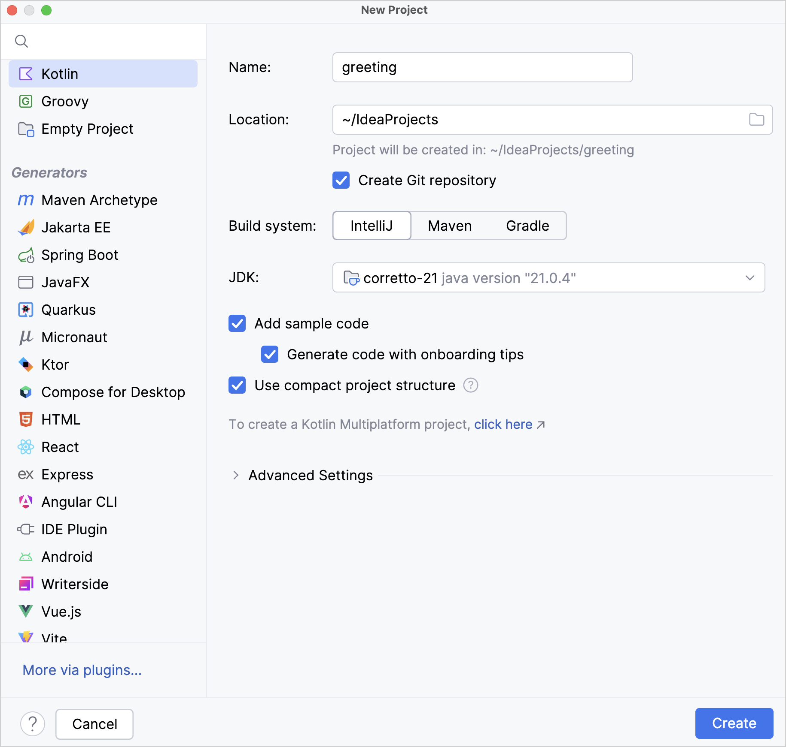
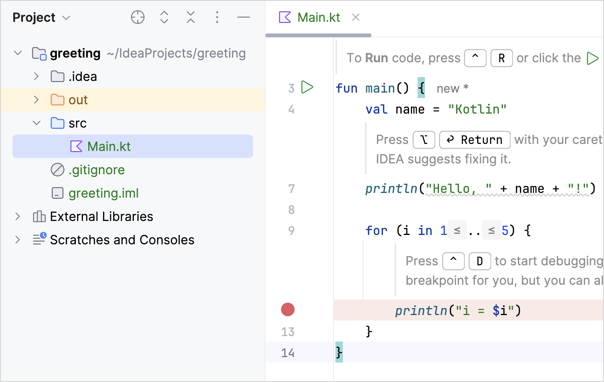
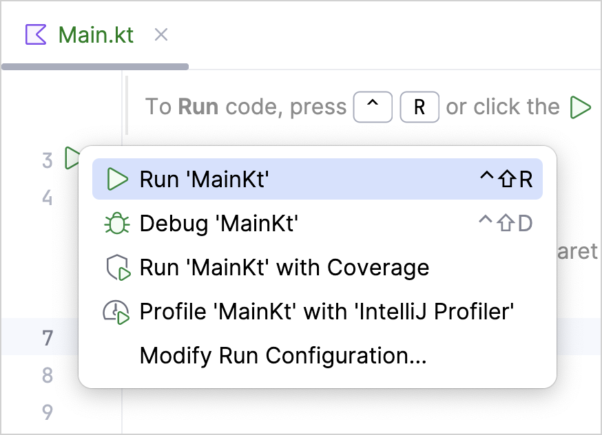
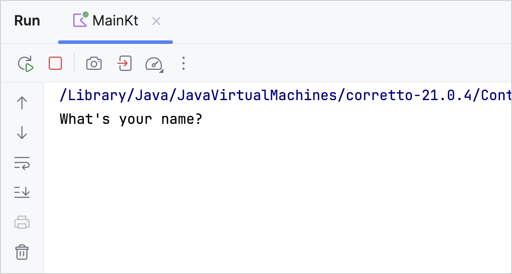
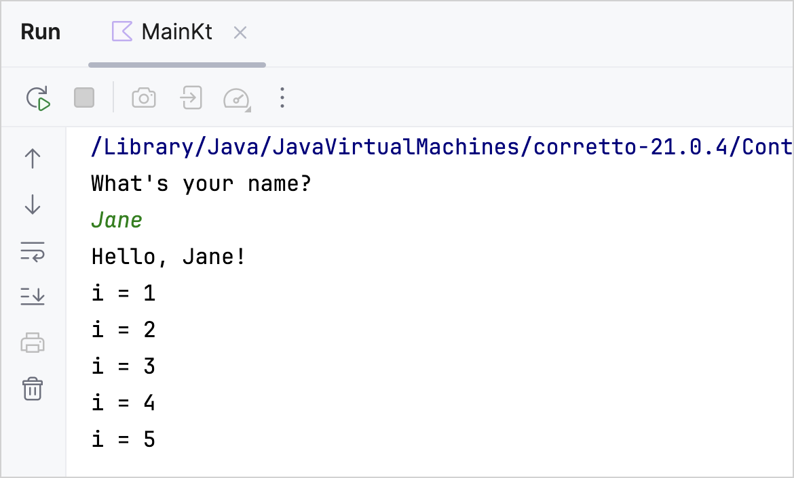

+++
title = "12.1.3 创建控制台应用 —— 教程"
date = 2026-09-13T08:50:47+08:00
weight = 3
type = "docs"
description = ""
isCJKLanguage = true
draft = false
+++


> 原文链接: [https://kotlinlang.org/docs/jvm-get-started.html](https://kotlinlang.org/docs/jvm-get-started.html)

# 12.1.3 创建控制台应用 —— 教程

在 IntelliJ IDEA 中创建一个 Kotlin 控制台应用，并用 Kotlin 编译器运行它。

本教程演示如何使用 IntelliJ IDEA 创建一个控制台应用。

首先，下载并安装最新版本的 [IntelliJ IDEA](https://www.jetbrains.com/idea/download/)。

## 创建项目 {#create-a-project}

1. 在 IntelliJ IDEA 中，选择 **File** | **New** | **Project**。
2. 在左侧列表中选择 **Kotlin**。
3. 给新项目命名，如有必要还可以修改它的位置。

> **提示：** 勾选 **Create Git repository** 复选框可以把新项目纳入版本控制。你之后再这么做也可以。



4. 选择 **IntelliJ** 构建系统。它是一个原生构建器，不需要下载额外的构件。

如果你想创建一个需要进一步配置的更复杂项目，请选择 Maven 或 Gradle。对于 Gradle，请为构建脚本选择语言：Kotlin 或 Groovy。
5. 从 **JDK** 列表中选择你想在项目中使用的 [JDK](https://www.oracle.com/java/technologies/downloads/)。
* 如果 JDK 已安装在你的电脑上，但未在 IDE 中定义，请选择 **Add JDK** 并指定 JDK 主目录的路径。
* 如果你的电脑上没有所需的 JDK，请选择 **Download JDK**。

6. 启用 **Add sample code** 选项，以创建一个包含示例 `"Hello World!"` 应用的文件。

> **提示：** 你还可以启用 **Generate code with onboarding tips** 选项，为示例代码添加一些有用的额外注释。

7. 点击 **Create**。

> **注意：** 如果你选择了 Gradle 构建系统，项目中会有一个构建脚本文件：`build.gradle(.kts)`。它包含 `kotlin("jvm")` 插件以及控制台应用所需的依赖。请确保使用该插件的最新版本：  ```kotlin plugins { kotlin("jvm") version "2.4.20" application } ```   ```groovy plugins { id 'org.jetbrains.kotlin.jvm' version '2.4.20' id 'application' } ```

## 创建应用 {#create-an-application}

1. 打开 `src/main/kotlin` 中的 `Main.kt` 文件。`src` 目录包含 Kotlin 源文件和资源。`Main.kt` 文件包含示例代码，它会打印 `Hello, Kotlin!` 以及若干行循环迭代器的值。



2. 修改代码，让它询问你的名字并问候你：

* 创建一个输入提示，并把 [`readln()`](https://kotlinlang.org/api/latest/jvm/stdlib/kotlin.io/readln.html) 函数返回的值赋给 `name` 变量。
* 我们改用字符串模板而不是拼接：直接在文本输出中变量名前加上美元符号 `$`，就像这样——`$name`。

```kotlin
   fun main() {
       println("What's your name?")
       val name = readln()
       println("Hello, $name!")

       // ...
   }
```

## 运行应用 {#run-the-application}

现在应用已经可以运行了。最简单的方式是点击行号处的绿色 **Run** 图标，然后选择 **Run 'MainKt'**。



你可以在 **Run** 工具窗口中看到结果。



输入你的名字，接受来自应用的问候吧！



恭喜！你刚刚运行了你的第一个 Kotlin 应用。

## 接下来学什么？ {#what-s-next}

创建好这个应用之后，你就可以开始更深入地学习 Kotlin 语法了：

* 参加 [Kotlin 之旅](../../../takekotlintour/3.1-KotlinTourWelcome/)
* 为 IDEA 安装 [JetBrains Academy 插件](https://plugins.jetbrains.com/plugin/10081-jetbrains-academy)，并完成 [Kotlin Koans 课程](https://plugins.jetbrains.com/plugin/10081-jetbrains-academy/docs/learner-start-guide.html?section=Kotlin%20Koans)中的练习
