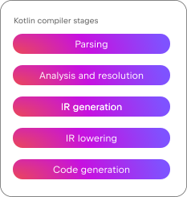
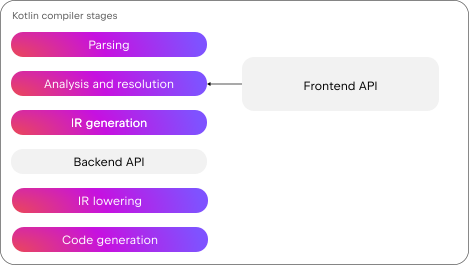

+++
title = "12.2.8 自定义编译器插件"
date = 2026-09-13T08:50:47+08:00
weight = 8
type = "docs"
description = ""
isCJKLanguage = true
draft = false
+++

> 原文链接: [https://kotlinlang.org/docs/custom-compiler-plugins.html](https://kotlinlang.org/docs/custom-compiler-plugins.html)

# 12.2.8 自定义编译器插件

> **警告：** Kotlin 编译器插件 API 不稳定，并且每个版本都会引入破坏性变更。

在创建自己的自定义编译器插件之前，请先查看[可用编译器插件列表](../12.2.1-CompilerPluginsOverview/)，看看是否已有适合你用例的插件。

你还可以确认是否能用 [Kotlin Symbol Processing (KSP) API](https://kotlinlang.org/docs/ksp-overview.html) 或 [Android lint](https://developer.android.com/studio/write/lint) 这类外部 linter 达到目的。

如果你*仍然*找不到需要的功能，可以创建自定义编译器插件。请注意，Kotlin 编译器插件 API 是**不稳定的**。你需要投入大量持续的维护工作，因为每个新的编译器版本都会引入破坏性变更。

### Kotlin 编译器与编译器插件 {#the-kotlin-compiler-and-compiler-plugins}

Kotlin 编译器会：

- 解析源代码并把它转换为结构化的语法树。
- 通过确定代码的含义、解析名称、检查类型并执行可见性规则来分析和解析代码。
- 生成中间表示（IR），这是一种充当源代码与机器码之间桥梁的数据结构。
- 逐步把 IR 降低（lowering）为更简单的形式。
- 把降低后的 IR 转换为目标特定的输出，例如 JVM 字节码、JavaScript 或原生机器码。

插件可以通过前端 API 影响编译器的初始阶段，改变编译器解析代码的方式。例如，插件可以添加注解，或引入没有函数体的新方法，或修改可见性修饰符。这些变更在 IDE 中可见。

插件也可以通过后端 API 影响后续阶段，修改声明的行为。这些变更体现在编译完成后生成的二进制文件中。

在实践中，编译器插件会影响到从分析与解析到代码生成的各个阶段，覆盖前端和后端。例如，前端部分生成声明，后端部分为这些声明添加函数体。

[Kotlin 序列化插件](https://github.com/Kotlin/kotlinx.serialization)就是一个很好的例子。该插件的前端部分添加伴生对象和序列化函数，以及用于防止名称冲突的检查。后端部分则通过 `KSerializer` 对象实现所需的序列化行为。

### Kotlin 编译器插件模板 {#kotlin-compiler-plugin-template}

要开始编写自定义编译器插件，你可以使用 [Kotlin 编译器插件模板](https://github.com/Kotlin/compiler-plugin-template)。然后注册来自前端和后端插件 API 的扩展点。

> **注意：** 目前，你只能使用 [Gradle](../../../buildtools/11.1-Gradle/11.1.1-Gradle/) 开发自定义编译器插件。

### 前端插件 API {#frontend-plugin-api}

前端插件 API 也称为前端中间表示（FIR），它有以下专门用于自定义解析的扩展点：

| 扩展名                                                                                                                                                                               | 说明                                                                              |

| [`FirAdditionalCheckersExtension`](https://github.com/JetBrains/kotlin/blob/master/compiler/fir/checkers/src/org/jetbrains/kotlin/fir/analysis/extensions/FirAdditionalCheckersExtension.kt) | 添加自定义编译器检查器。                                                           |
| [`FirDeclarationGenerationExtension`](https://github.com/JetBrains/kotlin/blob/master/compiler/fir/providers/src/org/jetbrains/kotlin/fir/extensions/FirDeclarationGenerationExtension.kt)   | 生成新的声明。                                                              |
| [`FirExtensionSessionComponent`](https://github.com/JetBrains/kotlin/blob/master/compiler/fir/tree/src/org/jetbrains/kotlin/fir/extensions/FirExtensionSessionComponent.kt)                  | 在 `FirSession` 中注册自定义组件，供插件其他部分使用。 |
| [`FirFunctionTypeKindExtension`](https://github.com/JetBrains/kotlin/blob/master/compiler/fir/tree/src/org/jetbrains/kotlin/fir/extensions/FirFunctionTypeKindExtension.kt)                  | 定义新的函数类型族。                                                |
| [`FirMetadataSerializerPlugin`](https://github.com/JetBrains/kotlin/blob/master/compiler/fir/fir-serialization/src/org/jetbrains/kotlin/fir/serialization/FirMetadataSerializerPlugin.kt)    | 读写声明元数据中的信息。                                    |
| [`FirStatusTransformerExtension`](https://github.com/JetBrains/kotlin/blob/master/compiler/fir/resolve/src/org/jetbrains/kotlin/fir/extensions/FirStatusTransformerExtension.kt)             | 修改声明的状态属性，例如可见性或模态。                   |
| [`FirSupertypeGenerationExtension`](https://github.com/JetBrains/kotlin/blob/master/compiler/fir/resolve/src/org/jetbrains/kotlin/fir/extensions/FirSupertypeGenerationExtension.kt)         | 为已有类添加新的超类型。                                                |
| [`FirTypeAttributeExtension`]( https://github.com/JetBrains/kotlin/blob/master/compiler/fir/tree/src/org/jetbrains/kotlin/fir/extensions/FirTypeAttributeExtension.kt)                       | 根据类型注解为某些类型添加特殊属性。                |

#### IDE 集成 {#ide-integration}

解析变更会影响 IDE 的行为，例如代码高亮和提示，因此让你的插件与 IDE 兼容非常重要。每个版本的 IntelliJ IDEA 和 Android Studio 都包含一个开发版的 Kotlin 编译器。这个版本是 IDE 专用的，与已发布的 Kotlin 编译器不二进制兼容。因此，当你升级 IDE 时，也需要更新编译器插件以保持可用。这也是社区插件默认不会被加载的原因。

为确保你的自定义编译器插件在不同 IDE 版本上都能工作，请针对每个 IDE 版本进行测试，并修复发现的问题。

如果有 Kotlin 编译器插件的开发工具包（devkit），支持多个 IDE 版本可能会更容易。如果你对这个特性感兴趣，请在我们的[问题跟踪器](https://youtrack.jetbrains.com/issue/KT-82617)中提供反馈。

### 后端插件 API {#backend-plugin-api}

> **警告：** 后端插件开发很难做到正确而不影响 IDE 或调试器性能，因此请谨慎、保守地进行改动。

后端插件 API 也称为 IR，只有一个扩展点：[`IrGenerationExtension`](https://github.com/JetBrains/kotlin/blob/master/compiler/ir/backend.common/src/org/jetbrains/kotlin/backend/common/extensions/IrGenerationExtension.kt)。使用这个扩展点并重写 `generate()` 函数，为前端已生成的声明添加函数体，或修改已有的声明函数体。

通过这个扩展点所做的更改**不会**被编译器检查。你必须确保你的更改不会破坏编译器在该阶段的预期。例如，你可能无意中引入无效类型、错误的函数引用，或超出正确作用域的引用。

#### 探索后端插件代码 {#explore-backend-plugin-code}

你可以研究 Kotlin 序列化插件的代码，看看后端插件编译代码在实践中是什么样子。例如，[`SerializableCompanionIrGenerator.kt`](https://github.com/JetBrains/kotlin/blob/master/plugins/kotlinx-serialization/kotlinx-serialization.backend/src/org/jetbrains/kotlinx/serialization/compiler/backend/ir/SerializerIrGenerator.kt) 会为关键的序列化成员补上缺失的函数体。其中一个例子是 [`generateChildSerializersGetter()`](https://github.com/JetBrains/kotlin/blob/9cfa558902abc13d245c825717026af63ef82dd2/plugins/kotlinx-serialization/kotlinx-serialization.backend/src/org/jetbrains/kotlinx/serialization/compiler/backend/ir/SerializerIrGenerator.kt#L242) 函数，它收集一组 `KSerializer` 表达式并以数组形式返回。

#### 检查后端插件代码中的问题 {#check-your-backend-plugin-code-for-problems}

你可以用三种方式检查后端插件代码中的问题：

1. **校验 IR**

构建 IR 树并启用 `Xverify-ir` 编译器选项。该选项会影响编译速度，因此只在测试期间使用。

2. **转储并比较 IR 输出**

使用 `-Xphases-to-dump-before=ExternalPackageParentPatcherLowering` 编译器选项在 IR 降低编译阶段之后创建转储文件。对于 JVM 后端，使用 `-Xdump-directory=<your-file-directory>` 编译器选项配置转储目录。手动编写期望的代码，生成另一个转储文件，然后比较两者以查看是否存在差异。

3. **调试编译器代码**

在 `convertToIr.kt` 文件中，于 `convertToIrAndActualize()` 函数中设置断点，并以调试模式运行编译器，从而在编译期间获取更详细的信息。

### 测试你的插件 {#test-your-plugin}

实现插件之后，请对它进行充分测试。[Kotlin 编译器插件模板](https://github.com/Kotlin/compiler-plugin-template)已经配置好使用 [Kotlin 编译器测试框架](https://kotlinlang.org/docs/https://github.com/JetBrains/kotlin/blob/master/compiler/test-infrastructure/ReadMe.html)。你可以在以下目录中添加测试：

* `compiler-plugin/testData`
* `compiler-plugin/testData/box` 用于代码生成测试
* `compiler-plugin/testData/diagnostics` 用于诊断测试

测试运行时，框架会：

1. 解析测试源文件。例如 [`anotherBoxTest.kt`](https://github.com/Kotlin/compiler-plugin-template/blob/master/compiler-plugin/testData/box/anotherBoxTest.kt)
2. 为每个文件构建 FIR 和 IR。
3. 把它们写成文本转储文件。例如 [`anotherBoxTest.fir.txt`](https://github.com/Kotlin/compiler-plugin-template/blob/master/compiler-plugin/testData/box/anotherBoxTest.fir.txt) 和 [`anotherBoxTest.fir.ir.txt`](https://github.com/Kotlin/compiler-plugin-template/blob/master/compiler-plugin/testData/box/anotherBoxTest.fir.ir.txt)。
4. 如果此前已创建过这些文件，则把它们与此前的文件进行比较。

你可以用这些文件检查生成的差异中是否有非预期的改动。如果没有问题，新的转储文件就成为你最新的*黄金*文件：一个经过批准且可信的基准，你可以用它来比较将来的改动。

### 获取帮助 {#get-help}

如果你在开发自定义编译器插件时遇到问题，请在 [Kotlin Slack](https://surveys.jetbrains.com/s3/kotlin-slack-sign-up) 的 [#compiler](https://slack-chats.kotlinlang.org/c/compiler) 频道中求助。我们无法保证给出解决方案，但会尽力提供帮助。
