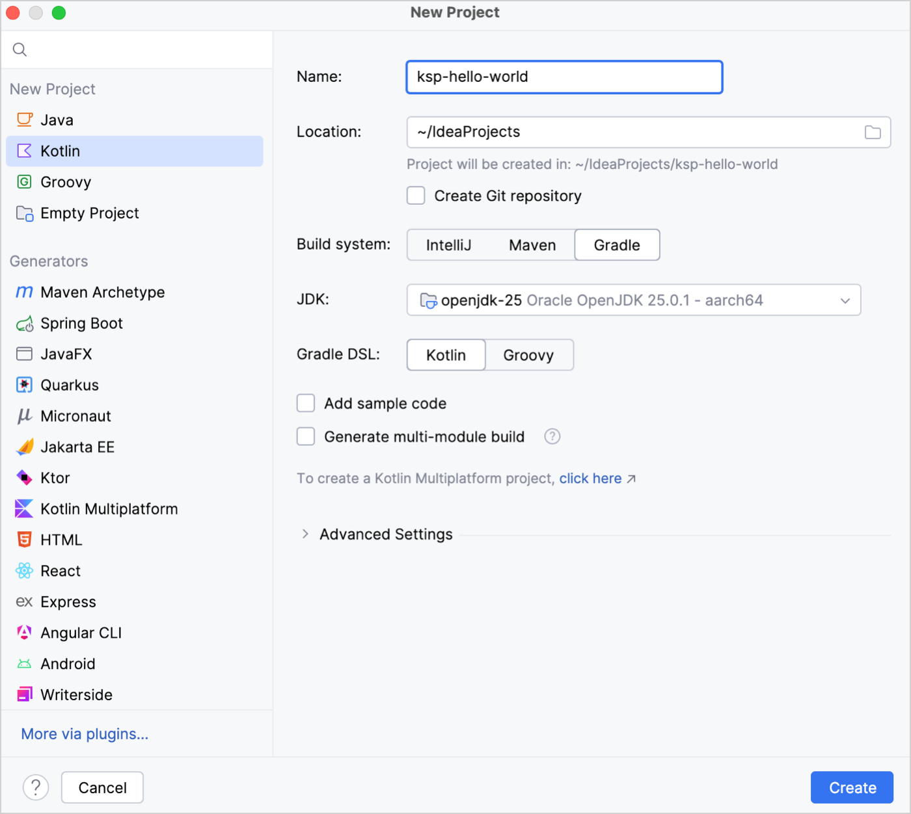
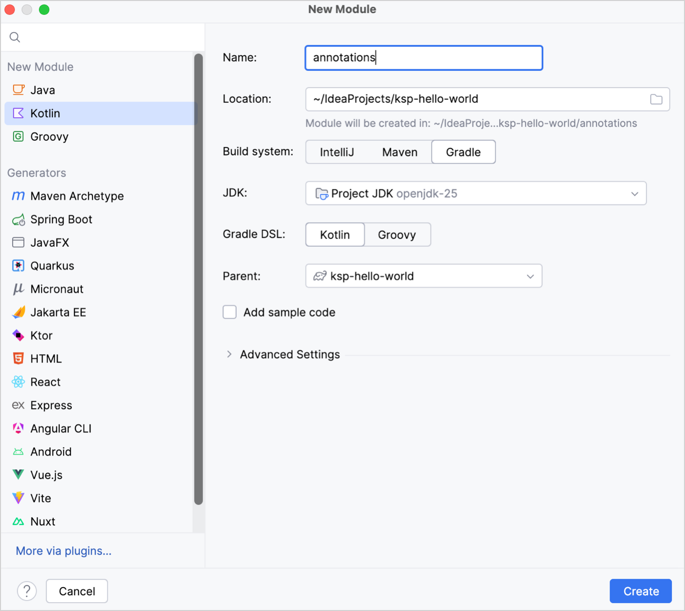

+++
title = "12.4.2 KSP 快速入门"
date = 2026-09-13T08:50:47+08:00
weight = 2
type = "docs"
description = ""
isCJKLanguage = true
draft = false
+++


> 原文链接: [https://kotlinlang.org/docs/ksp-quickstart.html](https://kotlinlang.org/docs/ksp-quickstart.html)

# 12.4.2 KSP 快速入门

[//]: # (description: 把基于 Kotlin Symbol Processing（KSP）的注解处理器添加到你的项目，或使用 KSP API 创建你自己的处理器。)

在本指南中，你将学到：

* 如何把基于 KSP 的注解处理器添加到项目中。
* 如何使用 KSP API 创建你自己的注解处理器。
* 在哪里找到处理器生成的代码。

## 在项目中接入基于 KSP 的处理器 {#add-a-ksp-based-processor-to-your-project}

要在项目中使用外部处理器，请在你的 `build.gradle(.kts)` 文件的 [`plugins {}` 块](https://docs.gradle.org/current/userguide/plugins.html#sec:plugins_block)中添加 KSP。如果该处理器只在某个特定模块中需要，请把它添加到该模块的 `build.gradle(.kts)` 文件中：

**Kotlin**

```kotlin
// build.gradle.kts

plugins {
    kotlin("jvm") version "2.4.20"
    id("com.google.devtools.ksp") version "2.3.10"
}
```

**Groovy**

```groovy
// build.gradle

plugins {
    id 'org.jetbrains.kotlin.jvm' version '2.4.20'
    id 'com.google.devtools.ksp' version '2.3.10'
}
```

> **提示：** 要查找 KSP 的最新版本，请查看 GitHub 上的 [Releases](https://github.com/google/ksp/releases)。

在顶层的 `dependencies {}` 块中，添加你想使用的处理器。本示例使用 [Moshi](https://github.com/square/moshi?tab=readme-ov-file#codegen)，但其他处理器的做法相同：

**Kotlin**

```kotlin
// build.gradle.kts

dependencies {
    ksp("com.squareup.moshi:moshi-kotlin-codegen:1.15.2")
}
```

**Groovy**

```groovy
// build.gradle

dependencies {
    ksp 'com.squareup.moshi:moshi-kotlin-codegen:1.15.2'
}
```

`ksp(...)` 配置只把处理器应用于应用源码。要处理测试源码，请使用 `kspTest(...)` 配置添加处理器。

> **注意：** `ksp(...)` 配置仅在单平台项目中可用。要了解如何为各个 Kotlin Multiplatform 目标和编译配置处理器，请参阅[多平台项目中的 KSP](../12.4.9-KspMultiplatform/)。

## 创建你自己的处理器 {#create-your-own-processor}

按照以下步骤操作，你将创建一个简单的注解处理器，它会生成一个 `helloWorld()` 函数。虽然它在实践中没什么用，但展示了创建自定义处理器和注解的基础知识。

### 把 KSP 添加到项目 {#add-ksp-to-the-project}

创建一个新的 Kotlin 项目并添加 KSP 插件：

1. 在 IntelliJ IDEA 中，选择 **File** | **New** | **Project**。
2. 在左侧列表中选择 **Kotlin**。
3. 选择 **Gradle** 作为构建系统并点击 **Create**。



4. 把 KSP 插件添加到 `build.gradle(.kts)` 文件：

**Kotlin**

```kotlin
    // build.gradle.kts

    plugins {
        kotlin("jvm") version "2.4.20"
        id("com.google.devtools.ksp") version "2.3.10" apply false
    }
```

**Groovy**

```groovy
    // build.gradle

    plugins {
        id 'org.jetbrains.kotlin.jvm' version '2.4.20'
        id 'com.google.devtools.ksp' version '2.3.10' apply false
    }
```

### 创建注解 {#create-an-annotation}

在项目根目录创建一个新模块，并声明一个注解：

1. 选择 **File** | **New** | **Module**。
2. 在左侧列表中选择 **Kotlin**。
3. 填写以下字段并点击 **create**：

* **Name**：annotations
* **Build system**：Gradle



4. 在该模块中创建一个 `HelloWorldAnnotation.kt` 文件，并声明一个名为 `HelloWorldAnnotation` 的注解：

```kotlin
    // annotations/src/main/kotlin/com/example/annotations/HelloWorldAnnotation.kt

    package com.example.annotations

    annotation class HelloWorldAnnotation
```

### 创建并注册处理器 {#create-and-register-a-processor}

1. 在项目根目录再创建一个名为 **processor** 的模块。
2. 在该模块的 `build.gradle(.kts)` 文件中，把 KSP API 和你声明的注解添加为依赖：

**Kotlin**

```kotlin
    // processor/build.gradle.kts

    plugins {
        kotlin("jvm")
    }

    dependencies {
        implementation(project(":annotations"))
        implementation("com.google.devtools.ksp:symbol-processing-api:2.3.6")
    }
```

**Groovy**

```groovy
    // processor/build.gradle

    plugins {
        id 'org.jetbrains.kotlin.jvm'
    }

    dependencies {
        implementation project ':annotations'
        implementation 'com.google.devtools.ksp:symbol-processing-api:2.3.6'
    }
```

3. 在 processor 模块中创建一个新的 `HelloWorldProcessor.kt` 文件并添加以下代码：

```kotlin
    // processor/src/main/kotlin/HelloWorldProcessor.kt

    class HelloWorldProcessor(val codeGenerator: CodeGenerator) : SymbolProcessor {
        // 1️⃣ process() 函数
        override fun process(resolver: Resolver): List<KSAnnotated> {
            resolver
                .getSymbolsWithAnnotation("com.example.annotations.HelloWorldAnnotation")
                .filter { it.validate() }
                .filterIsInstance<KSFunctionDeclaration>()
                .forEach { it.accept(HelloWorldVisitor(), Unit) }

           return emptyList()
        }

       // 2️⃣ 访问者
       inner class HelloWorldVisitor : KSVisitorVoid() {
           override fun visitFunctionDeclaration(function: KSFunctionDeclaration, data: Unit) {
               createNewFileFrom(function).use { file ->
                   file.write(
                       """
                           fun helloWorld(): Unit {
                               println("Hello world from function generated by KSP")
                           }
                       """.trimIndent()
                   )
               }
           }
       }

       // 3️⃣ createNewFileFrom() 函数
       private fun createNewFileFrom(function: KSFunctionDeclaration): OutputStream {
           return codeGenerator.createNewFile(
              dependencies = createDependencyOn(function),
              packageName = "",
              fileName = "GeneratedHelloWorld"
           )
       }

       // 3️⃣ createDependencyOn() 函数
       private fun createDependencyOn(function: KSFunctionDeclaration): Dependencies {
           return Dependencies(aggregating = false, function.containingFile!!)
       }
    }

    // 用于把字符串写入 OutputStream 的实用函数
    fun OutputStream.write(string: String): Unit {
        this.write(string.toByteArray())
    }
```

添加 IDE 建议的 import。请确保从 `com.google.devtools.ksp.processing` 导入 `Resolver` 和 `Dependencies` 类。或者，把以下几行复制到 `HelloWorldProcessor.kt` 的顶部：

```kotlin
    // processor/src/main/kotlin/HelloWorldProcessor.kt

    import com.google.devtools.ksp.processing.CodeGenerator
    import com.google.devtools.ksp.processing.Dependencies
    import com.google.devtools.ksp.processing.Resolver
    import com.google.devtools.ksp.processing.SymbolProcessor
    import com.google.devtools.ksp.symbol.KSAnnotated
    import com.google.devtools.ksp.symbol.KSFunctionDeclaration
    import com.google.devtools.ksp.symbol.KSVisitorVoid
    import com.google.devtools.ksp.validate
    import java.io.OutputStream
```

**Import 语句**

我们来逐段分析这段代码：

* 1️⃣ `process()` 函数包含处理器的主要逻辑。它获取所有带有 `HelloWorldAnnotation` 注解的符号，并为每一个调用 `HelloWorldVisitor`。

`process()` 函数返回一个未处理符号的列表，供后续轮次处理。在本示例中，它安全地返回 `emptyList()`。更多信息请参阅[多轮处理](../12.4.8-KspMultiRound/)。

* 2️⃣ 处理器通过访问者来遍历 KSP 对 Kotlin 抽象语法树（AST）的视图。在 `HelloWorldPocessor` 类内部，`HelloWorldVisitor` 类就是访问者。由于 `HelloWorldAnnotation` 只用在函数上，因此只重写了 `visitFunctionDeclaration()`。

> **提示：** `KSVisitorVoid` 是 KSP 提供的访问者类之一，你可以重写并改造它。你也可以通过实现 [`KSVisitor<D, R>` 接口](https://github.com/google/ksp/blob/main/api/src/main/kotlin/com/google/devtools/ksp/symbol/KSVisitor.kt)创建自己的访问者。

* 3️⃣ `createNewFileFrom()` 创建 KSP 生成代码时所用的文件。`createDependencyOn()` 让输出文件依赖于使用该注解的源文件。

> **提示：** 要进一步了解 KSP 如何创建和管理文件，请查看 [`CodeGenerator` 接口](https://github.com/google/ksp/blob/main/api/src/main/kotlin/com/google/devtools/ksp/processing/CodeGenerator.kt)的源代码
4. 创建一个 `HelloWorldProcessorProvider.kt` 文件。在其中声明一个继承自 `SymbolProcessorProvider` 的 `HelloWorldProcessorProvider` 类：

```kotlin
    // processor/src/main/kotlin/HelloWorldProcessorProvider.kt

    import com.google.devtools.ksp.processing.SymbolProcessor
    import com.google.devtools.ksp.processing.SymbolProcessorEnvironment
    import com.google.devtools.ksp.processing.SymbolProcessorProvider

    class HelloWorldProcessorProvider : SymbolProcessorProvider {
        override fun create(environment: SymbolProcessorEnvironment): SymbolProcessor {
            return HelloWorldProcessor(environment.codeGenerator)
        }
    }
```
5. 注册该处理器提供者。在 `resources/META-INF/services` 目录中创建一个 `com.google.devtools.ksp.processing.SymbolProcessorProvider` 文件，并添加该提供者的完全限定名：

```text
    ## processor/src/main/resources/META-INF/services/com.google.devtools.ksp.processing.SymbolProcessorProvider

    HelloWorldProcessorProvider
```

### 使用你的处理器 {#use-your-processor}

现在你可以测试你的处理器了。按以下步骤创建一个客户端模块，让你的处理器根据带注解的元素生成代码：

1. 在项目根目录创建一个名为 `app` 的模块。
2. 在该模块的 `build.gradle(.kts)` 文件中：

* 把 KSP 插件添加到 `plugins {}` 块。
* 把你的处理器和注解添加到 `dependencies {}` 块。

例如：

**Kotlin**

```kotlin
    // app/build.gradle.kts

    plugins {
        kotlin("jvm")
        id("com.google.devtools.ksp")
    }

    dependencies {
        implementation(project(":annotations"))
        ksp(project(":processor"))
    }
```

**Groovy**

```groovy
    // app/build.gradle

    plugins {
        id 'com.google.devtools.ksp'
    }

    dependencies {
        implementation project (':annotations')
        ksp project (':processor')
    }
```

3. 在项目级的 `settings.gradle(.kts)` 文件中，确保所有子模块都被自动包含：

**Kotlin**

```kotlin
    // settings.gradle.kts

    include("annotations")
    include("app")
    include("processor")
```

**Groovy**

```groovy
    // settings.gradle

    include 'processor'
    include 'annotations'
    include 'app'
```

4. 在 `app` 模块中创建一个 `Main.kt` 文件并添加以下代码：

```kotlin
    // app/src/main/kotlin/Main.kt

    import com.example.annotations.HelloWorldAnnotation

    @HelloWorldAnnotation
    fun main() {
        helloWorld()
    }
```

> **注意：** `main()` 函数调用了 `helloWorld()`，尽管这个函数还不存在。你的 IDE 会把 `helloWorld()` 高亮为未定义的引用。这是预期行为：在你构建并运行项目时，KSP 会生成 `helloWorld()` 函数。

5. 运行该程序。你会在控制台中看到 `helloWorld()` 函数的输出：

```text
    Hello world from function generated by KSP
```

KSP 会在 `GeneratedHelloWorld.kt` 文件中生成代码：

```text
    app/build/generated/ksp/main/kotlin/GeneratedHelloWorld.kt
```

### 查看项目结构 {#explore-the-project-structure}

项目最终的文件结构应如下所示：

```text
.
├── app
│   ├── build.gradle.kts
│   └── src
│       └── main
│           └── kotlin
│               └── Main.kt
├── annotations
│   ├── build.gradle.kts
│   └── src
│       └── main
│           └── kotlin
|				└── com
|	                └── example
|						└── annotations
|							└── HelloWorldAnnotation.kt
├── processor
│   ├── build.gradle.kts
│   └── src
│       └── main
│           ├── kotlin
│           │   ├── HelloWorldProcessor.kt
│           │   └── HelloWorldProcessorProvider.kt
│           └── resources/META-INF/services
|				└── com.google.devtools.ksp.processing.SymbolProcessorProvider
├── build.gradle.kts
└── settings.gradle.kts

```

**项目结构**

> **提示：** 你可能还有额外的文件和目录。

## 接下来做什么？ {#what-s-next}

* 在 [KSP 仓库](https://github.com/google/ksp/tree/main/examples/hello-world)中探索这个示例的完整代码。
* 在 [KSP 仓库](https://github.com/google/ksp/tree/main/examples)中查找更复杂、更贴近实际的示例。
* 浏览 [KSP 受支持的库](../12.4.1-KspOverview/#supported-libraries)列表。
