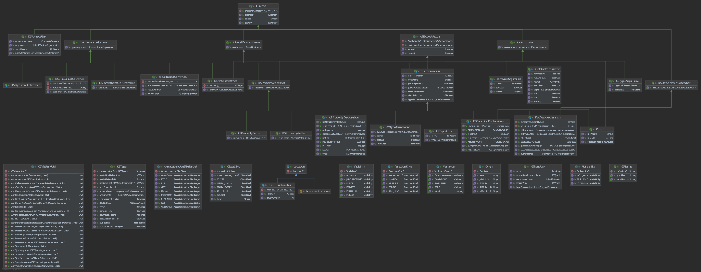

+++
title = "12.4.5 KSP 如何为 Kotlin 代码建模"
date = 2026-09-13T08:50:47+08:00
weight = 5
type = "docs"
description = ""
isCJKLanguage = true
draft = false
+++


> 原文链接: [https://kotlinlang.org/docs/ksp-additional-details.html](https://kotlinlang.org/docs/ksp-additional-details.html)

# 12.4.5 KSP 如何为 Kotlin 代码建模

你可以在 [KSP GitHub 仓库](https://github.com/google/ksp/tree/main/api/src/main/kotlin/com/google/devtools/ksp)中找到 API 定义。下图概览了 Kotlin 在 KSP 中的[建模](https://github.com/google/ksp/tree/main/api/src/main/kotlin/com/google/devtools/ksp/symbol/)方式：



> **注意：**[查看全尺寸图](https://kotlinlang.org/docs/images/ksp-class-diagram.svg)。

## 类型与解析 {#type-and-resolution}

解析占用了底层 API 实现的大部分开销。因此类型引用被设计为需要由处理器显式解析（有少数例外）。当引用一个*类型*（例如 `KSFunctionDeclaration.returnType` 或 `KSAnnotation.annotationType`）时，它始终是一个 `KSTypeReference`，即带有注解和修饰符的 `KSReferenceElement`。

```kotlin
interface KSFunctionDeclaration : ... {
  val returnType: KSTypeReference?
  // ...
}

interface KSTypeReference : KSAnnotated, KSModifierListOwner {
  val type: KSReferenceElement
}
```

`KSTypeReference` 可以解析为 `KSType`，它指向 Kotlin 类型系统中的一个类型。

`KSTypeReference` 有一个 `KSReferenceElement`，它为 Kotlin 的程序结构建模，也就是该引用是如何书写的。它对应 Kotlin 语法中的 [`type`](https://kotlinlang.org/grammar/#type) 元素。

`KSReferenceElement` 可以是 `KSClassifierReference` 或 `KSCallableReference`，它们包含大量有用信息而无需解析。例如 `KSClassifierReference` 有 `referencedName`，而 `KSCallableReference` 有 `receiverType`、`functionArguments` 和 `returnType`。

如果需要 `KSTypeReference` 所引用的原始声明，通常可以解析为 `KSType` 并通过 `KSType.declaration` 访问它。从一个类型被提及的位置移动到它的类被定义的位置，大致如下：

```kotlin
val ksType: KSType = ksTypeReference.resolve()
val ksDeclaration: KSDeclaration = ksType.declaration
```

类型解析开销较大，因此需要显式进行。通过解析得到的部分信息其实已经在 `KSReferenceElement` 中可用。例如，`KSClassifierReference.referencedName` 可以过滤掉大量不相关的元素。只有当你确实需要 `KSDeclaration` 或 `KSType` 中的特定信息时，才应该解析类型。

指向函数类型的 `KSTypeReference` 的大部分信息都在它的元素中。虽然它可以解析为 `Function0`、`Function1` 等家族，但这些解析并不会比 `KSCallableReference` 带来更多信息。解析函数类型引用的一个用例是处理函数原型（prototype）的同一性。
