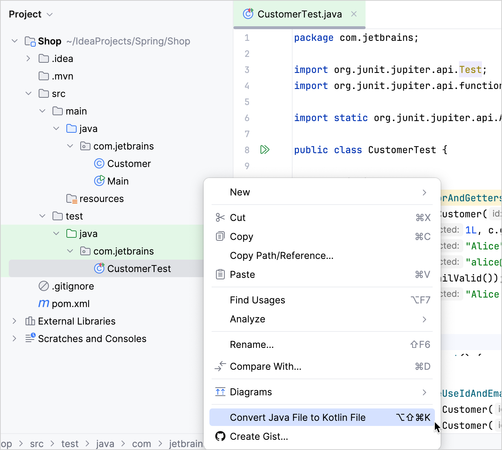

+++
title = "6.1.2 向 Java 项目添加 Kotlin —— 教程"
date = 2026-09-13T08:50:47+08:00
weight = 2
type = "docs"
description = ""
isCJKLanguage = true
draft = false
+++


> 原文链接: [https://kotlinlang.org/docs/mixing-java-kotlin-intellij.html](https://kotlinlang.org/docs/mixing-java-kotlin-intellij.html)

# 6.1.2 向 Java 项目添加 Kotlin —— 教程

把 Kotlin 集成到已有的 Java 项目中——配置 Maven 或 Gradle 构建文件、组织源文件，并在 IntelliJ IDEA 中把 Java 代码转换为 Kotlin。

Kotlin 与 Java 完全互操作，因此你可以在现有 Java 项目中逐步引入它，而不必重写所有内容。

在本教程中，你将学习如何：

* 配置 Maven 或 Gradle 构建工具，以便同时编译 Java 和 Kotlin 代码。
* 在项目目录中组织 Java 和 Kotlin 源文件。
* 使用 IntelliJ IDEA 把 Java 文件转换为 Kotlin。

> **提示：** 你可以使用任何现有的 Java 项目来完成本教程，也可以克隆我们的公开[示例项目](https://github.com/kotlin-hands-on/kotlin-junit-sample/tree/main/complete)，其中已经配好 Maven 和 Gradle 构建文件。你还可以用我们准备好的 [skill](https://kotlinlang.org/docs/https://github.com/Kotlin/kotlin-agent-skills/blob/main/skills/kotlin-tooling-java-to-kotlin/SKILL.html) 把转换工作交给你自己选择的 AI 代理。请记住，AI 的处理结果并不完全可预测。

## 项目配置 {#project-configuration}

要向 Java 项目添加 Kotlin，你需要根据所用的构建工具，把项目配置为同时使用 Kotlin 和 Java。

项目配置可确保 Kotlin 和 Java 代码都能被正确编译，并且能够无缝地相互引用。

### Maven {#maven}

> **注意：** 从 **IntelliJ IDEA 2025.3** 开始，当你向基于 Maven 的 Java 项目添加第一个 Kotlin 文件时，IDE 会自动更新你的 `pom.xml` 文件，加入 Kotlin Maven 插件和标准依赖。如果你想自定义版本或构建阶段，仍然可以手动配置。

要在 Maven 项目中同时使用 Kotlin 和 Java，请在 `pom.xml` 文件中应用 Kotlin Maven 插件并添加 Kotlin 依赖：

1. 在 `<properties>` 部分添加 Kotlin 版本属性：

```xml
```

2. 在 `<dependencies>` 部分添加所需的依赖，并添加到 `<plugins>` 部分：

```xml
```

3. 在 `<build><plugins>` 部分添加 Kotlin 插件：

```xml
```

在 Kotlin Maven 插件中启用 `<extensions>true</extensions>` 有助于：

* 自动向项目添加 `kotlin-stdlib` 依赖。
* 配置执行阶段，先编译 Kotlin，再编译 Java。
* 允许在 Java 代码中引用 Kotlin 代码，反之亦然。
* 自动把 JVM 目标版本与 Java 编译器版本对齐。

在使用带 extensions 的 Kotlin Maven 插件时，`<build><pluginManagement>` 部分不需要单独的 `maven-compiler-plugin`。

4. 在 IDE 中重新加载 Maven 项目。
5. 运行测试以验证配置：

```bash
    ./mvnw clean test
```

### Gradle {#gradle}

要在 Gradle 项目中同时使用 Kotlin 和 Java，请在 `build.gradle.kts` 文件中应用 Kotlin JVM 插件并添加 Kotlin 依赖：

1. 在 `plugins {}` 块中添加 Kotlin JVM 插件：

```kotlin
    plugins {
        // 其他插件
        kotlin("jvm") version "2.4.20"
    }
```

2. 设置 JVM 工具链版本，使其与你的 Java 版本一致：

```kotlin
    kotlin {
        jvmToolchain(17)
    }
```

这样可确保 Kotlin 使用与 Java 代码相同的 JDK 版本。

3. 在 `dependencies {}` 块中添加 `kotlin("test")` 库，它提供 Kotlin 测试工具并与 JUnit 集成：

```kotlin
    dependencies {
        // 其他依赖

        testImplementation(kotlin("test"))
        // 其他测试依赖
    }
```

4. 在 IDE 中重新加载 Gradle 项目。
5. 运行测试以验证配置：

```bash
    ./gradlew clean test
```

## 项目结构 {#project-structure}

使用这样的配置，你可以在同一批源目录中混放 Java 和 Kotlin 文件：

```none
src/
  ├── main/
  │    ├── java/          # Java and Kotlin production code
  │    └── kotlin/        # Additional Kotlin production code (optional)
  └── test/
       ├── java/          # Java and Kotlin test code
       └── kotlin/        # Additional Kotlin test code (optional)
```

你可以手动创建这些目录，也可以在你添加第一个 Kotlin 文件时让 IntelliJ IDEA 创建它们。

Kotlin 插件会自动识别 `src/main/java` 和 `src/test/java` 两个目录，因此你可以把 `.kt` 和 `.java` 文件放在同一批目录中。

## 把 Java 文件转换为 Kotlin {#convert-java-files-to-kotlin}

Kotlin 插件还内置了一个 Java 到 Kotlin 转换器（_J2K_），可以自动把 Java 文件转换为 Kotlin。要对某个文件使用 J2K，请在其上下文菜单或 IntelliJ IDEA 的 **Code** 菜单中选择 **Convert Java File to Kotlin File**。



虽然这个转换器并非万无一失，但它在把大多数 Java 样板代码转换为 Kotlin 方面做得相当不错。不过有时仍需要手动微调。

## 了解编译器插件 {#explore-compiler-plugins}

如果你有一个使用 [Spring](https://spring.io/) 或 Java Persistence API (JPA) 的较复杂项目，可以使用 Kotlin 编译器插件，它们会自动把 Kotlin 的语言特性适配到框架的期望，从而减少样板代码：

* **[`all-open`](../../../compilerandplugins/12.2-Kotlincompilerplugins/12.2.2-AllOpenPlugin/)** 插件会在类及其成员带有特定注解时自动把它们变为 `open`。这对 Spring 这类要求类不能是 final 的框架特别有用。

对于 Spring，你可以使用专门的 [`kotlin-spring`](../../../compilerandplugins/12.2-Kotlincompilerplugins/12.2.2-AllOpenPlugin/#spring-support) 插件，它是 `all-open` 之上的封装，会自动指定 Spring 的注解。
* **[`no-arg`](../../../compilerandplugins/12.2-Kotlincompilerplugins/12.2.5-NoArgPlugin/)** 插件会为带特定注解的类生成一个额外的无参构造函数。这让 JPA 能够实例化那些原本没有默认构造函数的类。

你也可以使用 [`kotlin-jpa`](../../../compilerandplugins/12.2-Kotlincompilerplugins/12.2.5-NoArgPlugin/#jpa-support) 插件，它是 `no-arg` 之上的封装，会自动指定无参注解。
* **[`power-assert`](../../../compilerandplugins/12.2-Kotlincompilerplugins/12.2.6-PowerAssert/)** 插件通过为断言提供带上下文信息的详细失败消息来改善调试体验。它会显示中间值，帮助你理解测试失败的原因。

## 下一步 {#next-step}

在 Java 项目中最简单地开始使用 Kotlin 的方式，是先添加 Kotlin 测试：

[向你的 Java 项目添加第一个 Kotlin 测试](../6.1.3-JvmTestUsingJunit/)

### 另请参阅 {#see-also}

* [Kotlin 与 Java 互操作详情](../../../interoperability/7.1-Javainterop/7.1.3-JavaToKotlinInterop/)
* [Maven 构建配置参考](../../../buildtools/11.2-Maven/11.2.1-Maven/)
