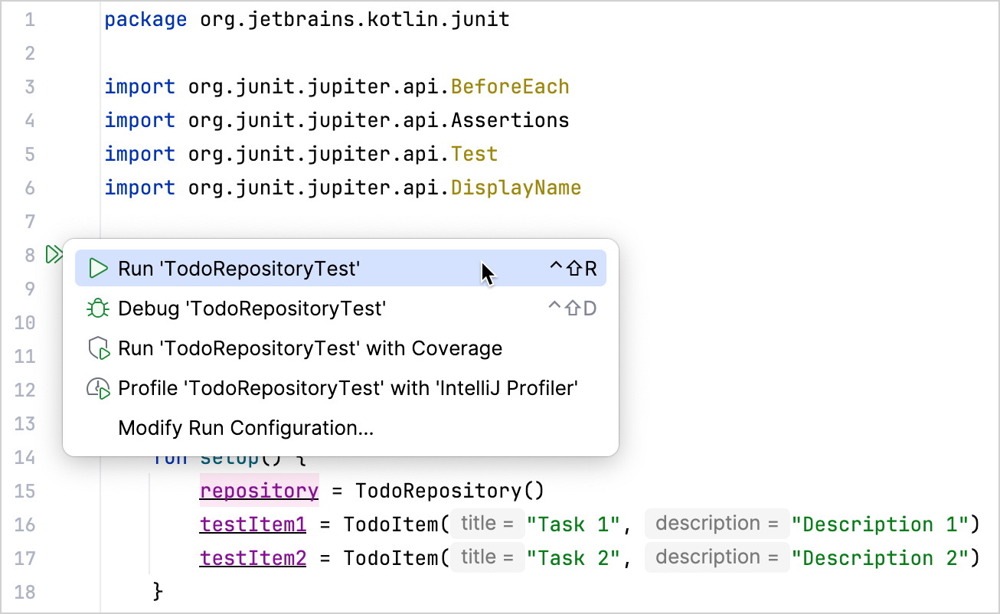
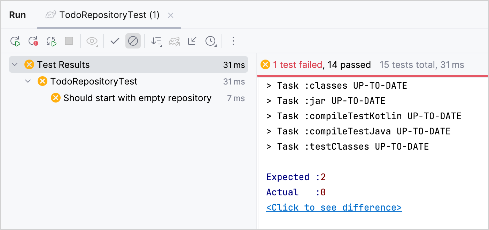

+++
title = "6.1.3 用 Kotlin 和 JUnit 测试 Java 代码 —— 教程"
date = 2026-09-13T08:50:47+08:00
weight = 3
type = "docs"
description = ""
isCJKLanguage = true
draft = false
+++


> 原文链接: [https://kotlinlang.org/docs/jvm-test-using-junit.html](https://kotlinlang.org/docs/jvm-test-using-junit.html)

# 6.1.3 用 Kotlin 和 JUnit 测试 Java 代码 —— 教程

配置一个由 Maven 或 Gradle 构建的 Java 项目，以集成用 Kotlin 编写的 JUnit 测试。

Kotlin 与 Java 完全互操作，也就是说你可以用 Kotlin 为 Java 代码编写测试，并在同一个项目中与现有的 Java 测试一起运行。

在本教程中，你将学习如何：

* 配置一个 Java–Kotlin 混合项目，以使用 [JUnit](https://junit.org/) 运行测试。
* 添加用于验证 Java 代码的 Kotlin 测试。
* 使用 Maven 或 Gradle 运行测试。

> **注意：** 开始之前，请确认你已安装：* [IntelliJ IDEA](https://www.jetbrains.com/idea/download/) 或安装了 [Kotlin 扩展](https://github.com/Kotlin/kotlin-lsp/tree/main?tab=readme-ov-file#vs-code-quick-start)的 [VS Code](https://code.visualstudio.com/Download)。* Java 17 或更高版本。

## 配置项目 {#configure-the-project}

1. 在 IDE 中，从版本控制克隆示例项目：

```text
   https://github.com/kotlin-hands-on/kotlin-junit-sample.git
```

2. 进入 `initial` 模块并查看项目结构：

```text
    kotlin-junit-sample/
    ├── initial/
    │   ├── src/
    │   │   ├── main/java/    # Java source code
    │   │   └── test/java/    # JUnit test in Java
    │   ├── pom.xml           # Maven configuration
    │   └── build.gradle.kts  # Gradle configuration
```

`initial` 模块包含一个用 Java 编写的简单 Todo 应用，以及一个测试。

3. 在同一个目录中打开构建文件，并更新其内容以支持 Kotlin：

**Maven**

```xml
```

**pom.xml 文件**

* 在 `<properties>` 部分设置 Kotlin 版本。
* 在 `<dependencies>` 部分添加 JUnit Jupiter 依赖以运行测试。
* 在 `<build><plugins>` 部分应用 `kotlin-maven-plugin`，并把 `<extensions>` 设为 `true`。它会自动向构建添加相应的执行配置和 `kotlin-stdlib` 依赖。
* 在使用带 extensions 的 Kotlin Maven 插件时，不需要把 `maven-compiler-plugin` 添加到 `<build><pluginManagement>` 部分。

**Gradle**

```kotlin
    // build.gradle.kts
    group = "org.jetbrains.kotlin"
    version = "1.0-SNAPSHOT"
    description = "kotlin-junit-complete"
    java.sourceCompatibility = JavaVersion.VERSION_17

    plugins {
        application
        kotlin("jvm") version "2.4.20"
    }

    kotlin {
        jvmToolchain(17)
    }

    application {
        mainClass.set("org.jetbrains.kotlin.junit.App")
    }

    repositories {
        mavenCentral()
    }

    dependencies {
        implementation("com.gitlab.klamonte:jexer:1.6.0")

        testImplementation(kotlin("test"))
        testImplementation(libs.org.junit.jupiter.junit.jupiter.api)
        testImplementation(libs.org.junit.jupiter.junit.jupiter.params)
        testRuntimeOnly(libs.org.junit.jupiter.junit.jupiter.engine)
        testRuntimeOnly(libs.org.junit.platform.junit.platform.launcher)
    }

    tasks.test {
        useJUnitPlatform()
    }
```

**build.gradle.kts**

* 在 `plugins {}` 块中添加 `kotlin("jvm")` 插件。
* 设置 JVM 工具链版本，使其与你的 Java 版本一致。
* 在 `dependencies {}` 块中添加 `kotlin.test` 库，它提供 Kotlin 的测试工具并与 JUnit 集成。

Kotlin/JVM 支持最新的稳定 JUnit 版本，即 JUnit 6。你可以在 `gradle/libs.versions.toml` 版本目录中找到它。

如果你习惯使用版本目录，甚至可以在其中添加 `kotlin("jvm")` 插件：

```toml
    # gradle/libs.versions.toml
    [versions]
    kotlin = "2.4.20"
    junit = "6.0.3"

    [libraries]
    org-junit-jupiter-junit-jupiter-api = { module = "org.junit.jupiter:junit-jupiter-api", version.ref = "junit" }
    org-junit-jupiter-junit-jupiter-params = { module = "org.junit.jupiter:junit-jupiter-params", version.ref = "junit" }
    org-junit-jupiter-junit-jupiter-engine = { module = "org.junit.jupiter:junit-jupiter-engine", version.ref = "junit" }
    org-junit-platform-junit-platform-launcher = { module = "org.junit.platform:junit-platform-launcher" }

    [plugins]
    kotlinJvm = { id = "org.jetbrains.kotlin.jvm", version.ref = "kotlin" }
```

**libs.versions.toml**

4. 在 IDE 中重新加载构建文件。

关于构建文件配置的更详细说明，请参阅[项目配置](../6.1.2-MixingJavaKotlinIntellij/#project-configuration)。

## 添加你的第一个 Kotlin 测试 {#add-your-first-kotlin-test}

`initial/src/test/java` 中的 `TodoItemTest.java` 测试已经验证了应用的基本功能：条目创建、默认值、唯一 ID 以及状态变化。

你可以通过添加一个验证仓库层行为的 Kotlin 测试来扩大测试覆盖率：

1. 进入同一个测试源目录 `initial/src/test/java`。
2. 在与 Java 测试相同的包中创建 `TodoRepositoryTest.kt` 文件。
3. 创建带字段声明和 setup 函数的测试类：

```kotlin
   package org.jetbrains.kotlin.junit

   import org.junit.jupiter.api.BeforeEach
   import org.junit.jupiter.api.Assertions
   import org.junit.jupiter.api.Test
   import org.junit.jupiter.api.DisplayName

   internal class TodoRepositoryTest {
       lateinit var repository: TodoRepository
       lateinit var testItem1: TodoItem
       lateinit var testItem2: TodoItem

       @BeforeEach
       fun setUp() {
           repository = TodoRepository()
           testItem1 = TodoItem("Task 1", "Description 1")
           testItem2 = TodoItem("Task 2", "Description 2")
       }
   }
```

* JUnit 注解在 Kotlin 中的用法与 Java 相同。
* 在 Kotlin 中，[`lateinit` 关键字](../../../languageguide/5.8-Classesandinterfaces/5.8.10-Properties/5.8.10.1-Properties/#late-initialized-properties-and-variables)允许声明稍后初始化的非空属性。这有助于避免在测试中使用可空类型（`TodoRepository?`）。

4. 在 `TodoRepositoryTest` 类中添加一个测试，检查仓库的初始状态及其大小：

```kotlin
   @Test
   @DisplayName("Should start with empty repository")
   fun shouldStartEmpty() {
       Assertions.assertEquals(0, repository.size())
       Assertions.assertTrue(repository.all.isEmpty())
   }
```

* 与 Java 的静态导入不同，Jupiter 的 `Assertions` 是作为类导入，并作为断言函数的限定符使用。
* 在 Kotlin 中，你不必调用 `.getAll()`，而是可以把 Java getter 当作属性访问，即 `repository.all`。

5. 再写一个测试，验证所有条目的复制行为：

```kotlin
   @Test
   @DisplayName("Should return defensive copy of items")
   fun shouldReturnDefensiveCopy() {
       repository.add(testItem1)

       val items1 = repository.all
       val items2 = repository.all

       Assertions.assertNotSame(items1, items2)
       Assertions.assertThrows(
           UnsupportedOperationException::class.java
       ) { items1.clear() }
       Assertions.assertEquals(1, repository.size())
   }
```

* 要从 Kotlin 类获取 Java 类对象，请使用 `::class.java`。
* 你可以把复杂的断言拆成多行，而不需要使用任何特殊的续行字符。

6. 添加一个测试，验证按 ID 查找条目：

```kotlin
   @Test
   @DisplayName("Should find item by ID")
   fun shouldFindItemById() {
       repository.add(testItem1)
       repository.add(testItem2)

        val found = repository.getById(testItem1.id())

        Assertions.assertTrue(found.isPresent)
        Assertions.assertEquals(testItem1, found.get())
   }
```

Kotlin 与 Java 的 [`Optional` API](https://docs.oracle.com/en/java/javase/17/docs/api/java.base/java/util/Optional.html) 配合顺畅。它会自动把 getter 方法转换为属性，因此这里的 `isPresent()` 方法是作为属性访问的。

7. 编写一个测试，验证条目移除机制：

```kotlin
    @Test
    @DisplayName("Should remove item by ID")
    fun shouldRemoveItemById() {
        repository.add(testItem1)
        repository.add(testItem2)

        val removed = repository.remove(testItem1.id())

        Assertions.assertTrue(removed)
        Assertions.assertEquals(1, repository.size())
        Assertions.assertTrue(repository.getById(testItem1.id()).isEmpty)
        Assertions.assertTrue(repository.getById(testItem2.id()).isPresent)
    }

    @Test
    @DisplayName("Should return false when removing non-existent item")
    fun shouldReturnFalseForNonExistentRemoval() {
        repository.add(testItem1)

        val removed = repository.remove("non-existent-id")

        Assertions.assertFalse(removed)
        Assertions.assertEquals(1, repository.size())
    }
```

在 Kotlin 中，你可以链式调用方法和属性访问，例如 `repository.getById(id).isEmpty`。

> **提示：** 你可以在 `TodoRepositoryTest` 测试类中添加更多测试，以覆盖更多功能。完整源码见示例项目的 [`complete`](https://github.com/kotlin-hands-on/kotlin-junit-sample/blob/main/complete/src/test/java/org/jetbrains/kotlin/junit/TodoRepositoryTest.kt) 模块。

## 运行测试 {#run-tests}

同时运行 Java 和 Kotlin 测试，以验证项目按预期工作：

1. 使用行号旁的图标运行测试：



你也可以在 `initial` 目录中使用命令行运行项目中的所有测试：

**Maven**

```bash
    mvn test
```

**Gradle**

```bash
    ./gradlew test
```

2. 通过修改某个变量值来检查测试是否正常工作。例如，把 `shouldAddItem` 测试改为期望一个不正确的仓库大小：

```kotlin
   @Test
   @DisplayName("Should add item to repository")
   fun shouldAddItem() {
       repository.add(testItem1)

       Assertions.assertEquals(2, repository.size()) // 从 1 改为 2
       Assertions.assertTrue(repository.all.contains(testItem1))
   }
```

3. 再次运行测试，确认它失败了：



> **提示：** 你可以在示例项目的 [`complete`](https://github.com/kotlin-hands-on/kotlin-junit-sample/tree/main/complete) 模块中找到配置完整、包含测试的项目。

## 接下来学什么 {#what-s-next}

进一步了解[用 Maven 测试 Kotlin 项目](../6.1.4-JvmTestMaven/)。
