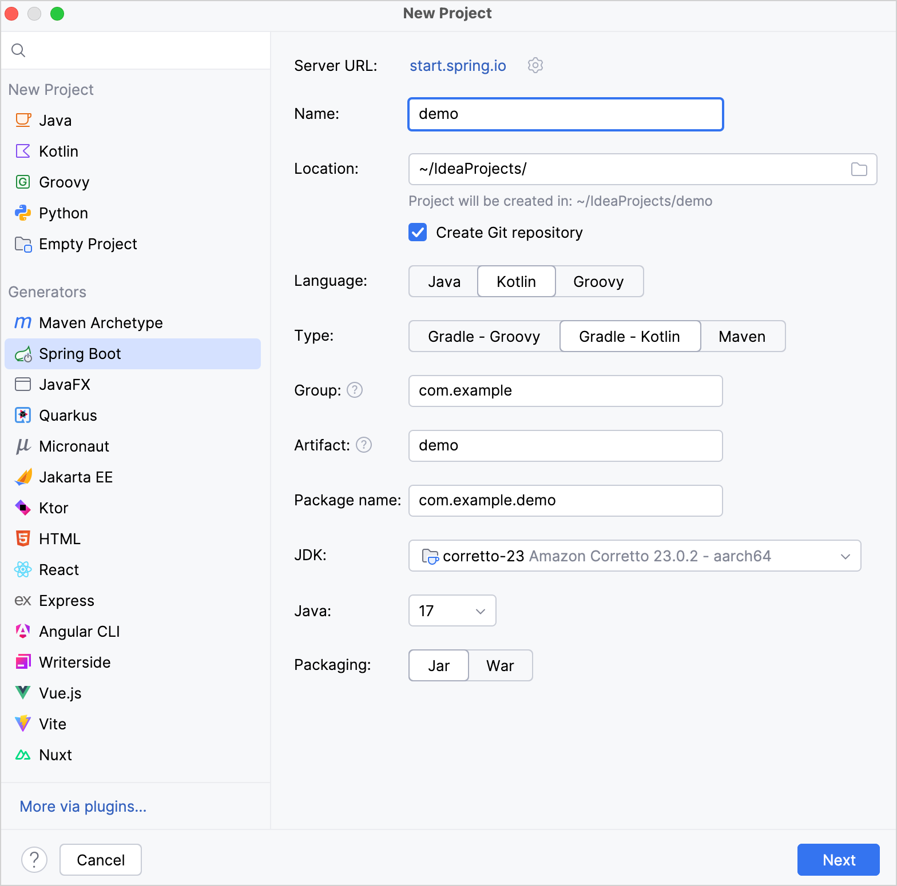
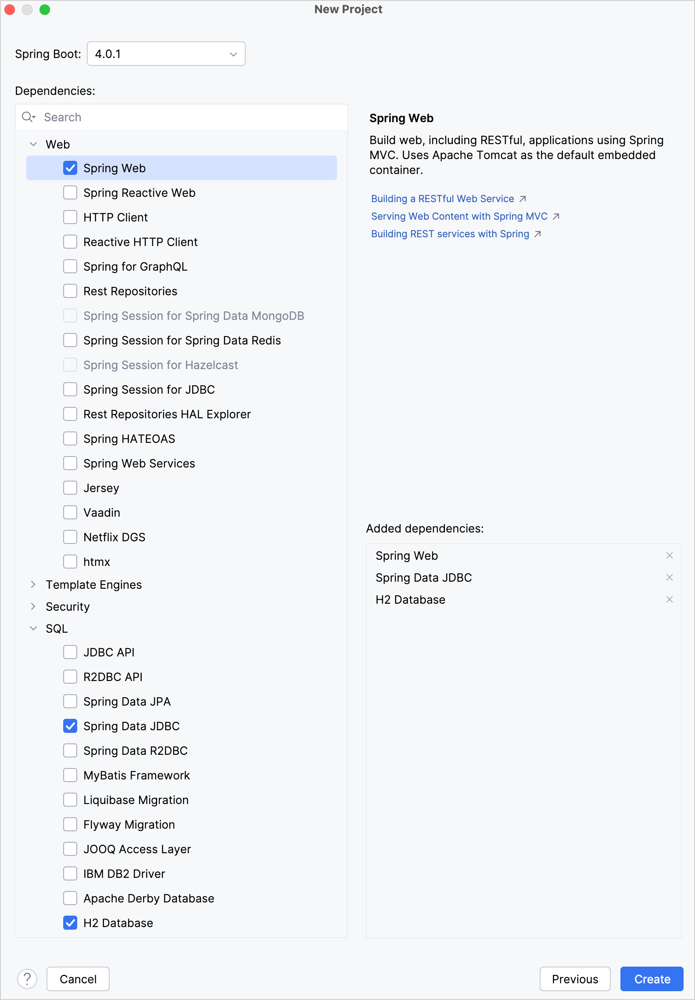
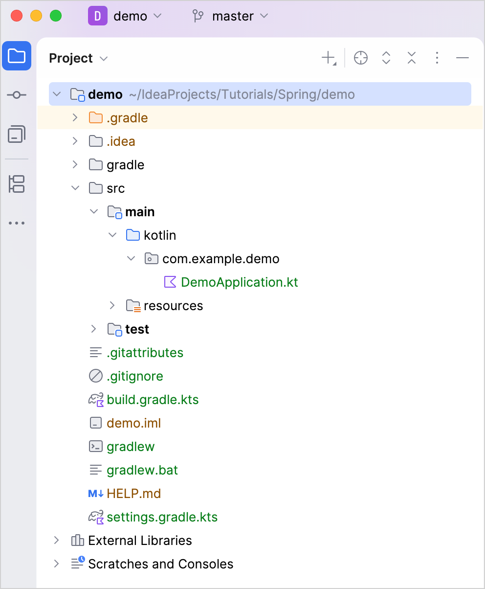
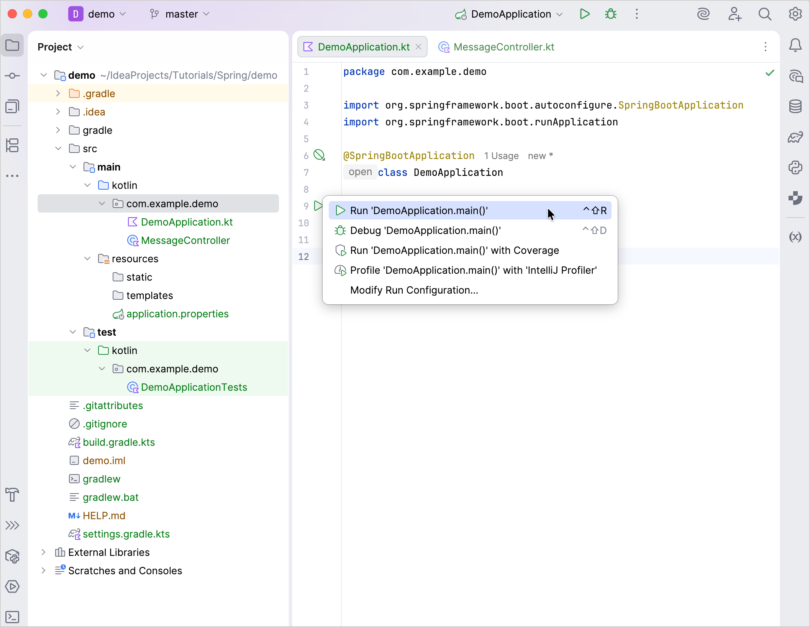
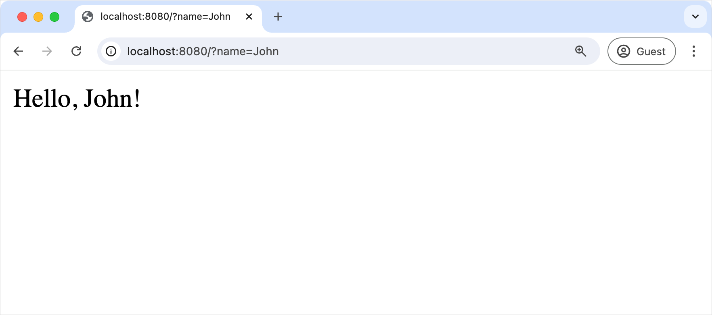

+++
title = "6.1.7.2 用 Kotlin 创建 Spring Boot 项目"
date = 2026-09-13T08:50:47+08:00
weight = 2
type = "docs"
description = ""
isCJKLanguage = true
draft = false
+++


> 原文链接: [https://kotlinlang.org/docs/jvm-create-project-with-spring-boot.html](https://kotlinlang.org/docs/jvm-create-project-with-spring-boot.html)

# 6.1.7.2 用 Kotlin 创建 Spring Boot 项目

使用 IntelliJ IDEA 用 Kotlin 创建 Spring Boot 应用。

本教程的第一部分演示如何在 IntelliJ IDEA 中使用项目向导创建基于 Gradle 的 Spring Boot 项目。

> **注意：** 本教程并不要求使用 Gradle 作为构建系统。如果你使用 Maven，也可以按照相同的步骤操作。

## 开始之前 {#before-you-start}

下载并安装最新版本的 [IntelliJ IDEA](https://www.jetbrains.com/idea/download/)，并使用 Ultimate 订阅。

> **提示：** 如果你使用的 IntelliJ IDEA 没有 Ultimate 订阅，或者使用其他 IDE，可以用[基于 Web 的项目生成器](https://start.spring.io/#!language=kotlin&type=gradle-project-kotlin)生成一个 Spring Boot 项目。

## 创建 Spring Boot 项目 {#create-a-spring-boot-project}

使用 IntelliJ IDEA 中的项目向导创建一个基于 Kotlin 的新 Spring Boot 项目：

1. 在 IntelliJ IDEA 中，选择 **File** | **New** | **Project**。
2. 在左侧面板的 **Generators** 区域中选择 **Spring Boot**。
3. 在 **New Project** 窗口中指定以下字段和选项：

* **Name**：demo
* **Language**：Kotlin
* **Type**：Gradle - Kotlin

> **提示：** 该选项用于指定构建系统和 DSL。

* **Package name**：com.example.demo
* **JDK**：Java JDK

> **注意：** 本教程使用 **Amazon Corretto 23**。如果你没有安装 JDK，可以从下拉列表中下载。

* **Java**：17

> **提示：** 如果你没有安装 Java 17，可以从 JDK 下拉列表中下载。



4. 确认所有字段都已指定，然后点击 **Next**。

5. 选择本教程所需的以下依赖：

* **Web | Spring Web**
* **SQL | Spring Data JDBC**
* **SQL | H2 Database**



6. 点击 **Create** 以生成并设置项目。

> **提示：** IDE 会生成并打开一个新项目。下载和导入项目依赖可能需要一些时间。

7. 之后，你可以在 **Project 视图**中看到如下结构：



生成的 Gradle 项目符合 Maven 的标准目录布局：
* `main/kotlin` 文件夹下是应用所属的包和类。
* 应用的入口是 `DemoApplication.kt` 文件中的 `main()` 方法。

## 了解项目的 Gradle 构建文件 {#explore-the-project-gradle-build-file}

打开 `build.gradle.kts` 文件：它是 Gradle Kotlin 构建脚本，其中包含应用所需依赖的列表。

这个 Gradle 文件是 Spring Boot 的标准配置，但它也包含必要的 Kotlin 依赖，其中包括 kotlin-spring Gradle 插件——`kotlin("plugin.spring")`。

以下是完整脚本，以及对各部分和依赖的说明：

```kotlin
// build.gradle.kts
plugins {
    kotlin("jvm") version "2.3.21" // 要使用的 Kotlin 版本
    kotlin("plugin.spring") version "2.3.21" // Kotlin Spring 插件
    id("org.springframework.boot") version "4.1.1"
    id("io.spring.dependency-management") version "1.1.7"
}

group = "com.example"
version = "0.0.1-SNAPSHOT"

java {
    toolchain {
        languageVersion = JavaLanguageVersion.of(17)
    }
}

repositories {
    mavenCentral()
}

dependencies {
    implementation("org.springframework.boot:spring-boot-h2console")
    implementation("org.springframework.boot:spring-boot-starter-data-jdbc")
    implementation("org.springframework.boot:spring-boot-starter-webmvc")
    implementation("org.jetbrains.kotlin:kotlin-reflect") // 与 Spring 配合使用所必需的 Kotlin 反射库
    implementation("tools.jackson.module:jackson-module-kotlin") // 用于处理 JSON 的 Kotlin Jackson 扩展
    runtimeOnly("com.h2database:h2")
    testImplementation("org.springframework.boot:spring-boot-starter-data-jdbc-test")
    testImplementation("org.springframework.boot:spring-boot-starter-webmvc-test")
    testImplementation("org.jetbrains.kotlin:kotlin-test-junit5")
    testRuntimeOnly("org.junit.platform:junit-platform-launcher")
}

kotlin {
    compilerOptions {
        freeCompilerArgs.addAll("-Xjsr305=strict", "-Xannotation-default-target=param-property") // `-Xjsr305=strict` 为 JSR-305 注解启用严格模式
    }
}

tasks.withType<Test> {
    useJUnitPlatform()
}
```

可以看到，Gradle 构建文件中添加了一些与 Kotlin 相关的构件：

1. 在 `plugins` 块中有两个 Kotlin 构件：

* `kotlin("jvm")` 插件定义了项目要使用的 Kotlin 版本。
* Kotlin Spring 编译器插件 `kotlin("plugin.spring")` 会为 Kotlin 类添加 `open` 修饰符，使它们与 Spring Framework 的特性兼容

2. 在 `dependencies` 块中列出了几个与 Kotlin 相关的模块：

* `tools.jackson.module:jackson-module-kotlin` 模块增加了对 Kotlin 类和数据类的序列化与反序列化支持。
* `org.jetbrains.kotlin:kotlin-reflect` 是 Kotlin 反射库，可完整支持[反射特性](../../../../languageguide/5.13-Reflection/)。

3. 在依赖部分之后，可以看到 `kotlin` 插件配置块。在这里可以给编译器添加额外参数，以启用或禁用各种语言特性。

在 [](../../../../buildtools/11.1-Gradle/11.1.5-GradleCompilerOptions/) 中进一步了解 Kotlin 编译器选项。

## 了解生成的 Spring Boot 应用 {#explore-the-generated-spring-boot-application}

打开 `DemoApplication.kt` 文件：

```kotlin
// DemoApplication.kt
package com.example.demo

import org.springframework.boot.autoconfigure.SpringBootApplication
import org.springframework.boot.runApplication

@SpringBootApplication
class DemoApplication

fun main(args: Array<String>) {
    runApplication<DemoApplication>(*args)
}
```

**声明类 —— class DemoApplication**

在包声明和导入语句之后，可以看到第一个类声明 `class DemoApplication`。
在 Kotlin 中，如果一个类不包含任何成员（属性或函数），完全可以省略类体（`{}`）。

**@SpringBootApplication 注解**

[`@SpringBootApplication` 注解](https://docs.spring.io/spring-boot/reference/using/using-the-springbootapplication-annotation.html#using.using-the-springbootapplication-annotation)是 Spring Boot 应用中的便捷注解。
它启用了 Spring Boot 的[自动配置](https://docs.spring.io/spring-boot/reference/using/auto-configuration.html#using.auto-configuration)、[组件扫描](https://docs.spring.io/spring-framework/docs/current/javadoc-api/org/springframework/context/annotation/ComponentScan.html)，并能够在"应用类"上定义额外配置。

**程序入口 —— main()**

[`main()`](../../../../languageguide/5.1-Basicsyntax/5.1.1-BasicSyntax/#program-entry-point)函数是应用的入口。
它被声明为 `DemoApplication` 类之外的[顶层函数](../../../../languageguide/5.7-Functions/5.7.1-Functions/#function-scope)。`main()` 函数调用 Spring 的 `runApplication(*args)` 函数，用 Spring Framework 启动应用。

**可变参数 —— args: Array&lt;String&gt;**

如果你查看 `runApplication()` 函数的声明，会看到该函数的参数带有 [`vararg` 修饰符](../../../../languageguide/5.7-Functions/5.7.1-Functions/#variable-number-of-arguments-varargs)：`vararg args: String`。
这意味着你可以向该函数传入可变数量的 String 实参。

**展开运算符 —— (*args)**

`args` 是 `main()` 函数的参数，声明为字符串数组。
既然它是一个字符串数组、而你想把它的内容传给函数，就应该使用展开运算符（在数组前加上星号 `*`）。

## 创建控制器 {#create-a-controller}

应用已经可以运行了，但我们先更新它的逻辑。

在 Spring 应用中，控制器用于处理 Web 请求。在同一个包中、`DemoApplication.kt` 文件旁边，创建包含 `MessageController` 类的 `MessageController.kt` 文件，内容如下：

```kotlin
// MessageController.kt
package com.example.demo

import org.springframework.web.bind.annotation.GetMapping
import org.springframework.web.bind.annotation.RequestParam
import org.springframework.web.bind.annotation.RestController

@RestController
class MessageController {
    @GetMapping("/")
    fun index(@RequestParam("name") name: String) = "Hello, $name!"
}
```

**@RestController 注解**

你需要告诉 Spring `MessageController` 是一个 REST 控制器，因此应当用 `@RestController` 注解标记它。
该注解意味着这个类会被组件扫描发现，因为它与 `DemoApplication` 类位于同一个包中。

**@GetMapping 注解**

`@GetMapping` 标记 REST 控制器中实现 HTTP GET 调用对应端点的函数：

```kotlin
@GetMapping("/")
fun index(@RequestParam("name") name: String) = "Hello, $name!"
```

**@RequestParam 注解**

函数参数 `name` 带有 `@RequestParam` 注解。该注解表示方法参数应绑定到 Web 请求参数。
因此，如果你访问应用的根路径并提供名为 "name" 的请求参数，例如 `/?name=<your-value>`，该参数值就会被用作调用 `index()` 函数的实参。

**单表达式函数 —— index()**

由于 `index()` 函数只包含一条语句，你可以把它声明为[单表达式函数](../../../../languageguide/5.7-Functions/5.7.1-Functions/#single-expression-functions)。
这意味着可以省略花括号，函数体写在等号 `=` 之后。

**函数返回类型的类型推断**

`index()` 函数没有显式声明返回类型。编译器会查看等号 `=` 右侧语句的结果来推断返回类型。
表达式 `Hello, $name!` 的类型是 `String`，因此该函数的返回类型也是 `String`。

**字符串模板 —— $name**

在 Kotlin 中，表达式 `Hello, $name!` 称为[*字符串模板*](../../../../languageguide/5.4-Types/5.4.6-Strings/#string-templates)。
字符串模板是包含嵌入表达式的字符串字面量。
它是字符串拼接操作的一种便捷替代方式。

## 运行应用 {#run-the-application}

现在 Spring 应用已经可以运行了：

1. 在 `DemoApplication.kt` 文件中，点击 `main()` 方法旁行号处的绿色 **Run** 图标：



> **提示：** 你也可以在终端中运行 `./gradlew bootRun` 命令。

这会在你的电脑上启动本地服务器。

2. 应用启动后，打开以下 URL：

```text
    http://localhost:8080?name=John
```

你应当看到响应中打印出 "Hello, John!"：



## 下一步 {#next-step}

在教程的下一部分，你将了解 Kotlin 数据类以及如何在应用中使用它们。

[下一步](../6.1.7.3-JvmSpringBootAddDataClass/)
