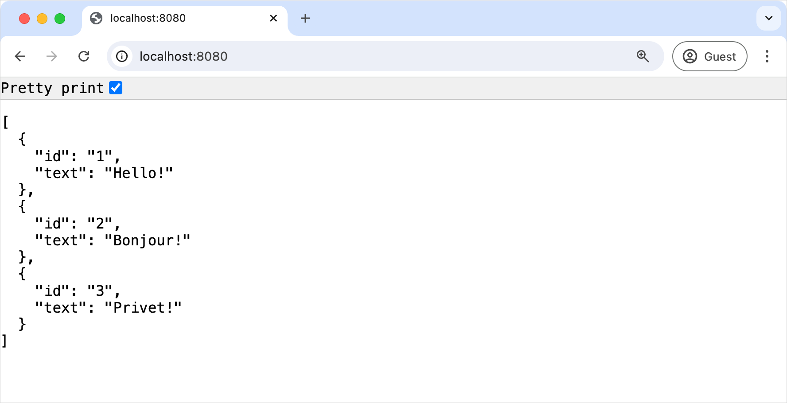

+++
title = "6.1.7.3 向 Spring Boot 项目添加数据类"
date = 2026-09-13T08:50:47+08:00
weight = 3
type = "docs"
description = ""
isCJKLanguage = true
draft = false
+++


> 原文链接: [https://kotlinlang.org/docs/jvm-spring-boot-add-data-class.html](https://kotlinlang.org/docs/jvm-spring-boot-add-data-class.html)

# 6.1.7.3 向 Spring Boot 项目添加数据类

向 Spring Boot 项目添加一个 Kotlin 数据类。

在教程的这一部分，你将向应用添加更多功能，并认识更多 Kotlin 语言特性，例如数据类。这需要修改 `MessageController` 类，让它返回一个包含已序列化对象集合的 JSON 文档。

## 更新你的应用 {#update-your-application}

1. 在同一个包中、`DemoApplication.kt` 文件旁边，创建 `Message.kt` 文件。
2. 在 `Message.kt` 文件中，创建一个带两个属性 `id` 和 `text` 的数据类：

```kotlin
    // Message.kt
    package com.example.demo

    data class Message(val id: String?, val text: String)
```

`Message` 类将用于数据传输：一组已序列化的 `Message` 对象将构成控制器响应浏览器请求时返回的 JSON 文档。

**数据类 —— data class Message**

Kotlin 中[数据类](../../../../languageguide/5.8-Classesandinterfaces/5.8.2-DataClasses/)的主要用途是保存数据。这类类用 `data` 关键字标记，一些标准功能和实用函数通常可以根据类的结构机械地推导出来。
在这个例子中，你把 `Message` 声明为数据类，因为它的主要用途就是存储数据。

**val 与 var 属性**

Kotlin 类中的[属性](../../../../languageguide/5.8-Classesandinterfaces/5.8.10-Properties/5.8.10.1-Properties/)可以声明为：

- *可变的*，使用 `var` 关键字
- *只读的*，使用 `val` 关键字

`Message` 类用 `val` 关键字声明了两个属性：`id` 和 `text`。
编译器会自动为这两个属性生成 getter。在创建 `Message` 类的实例之后，就无法再给这些属性重新赋值。

**可空类型 —— String?**

Kotlin 提供了[对可空类型的内置支持](../../../../languageguide/5.9-NullSafety/#nullable-types-and-non-nullable-types)。在 Kotlin 中，类型系统区分可以持有 `null` 的引用（*可空引用*）和不能持有 `null` 的引用（*非空引用*）。
例如，普通的 `String` 类型变量不能持有 `null`。要允许 null，你可以写成 `String?` 来声明可空字符串变量。

这次 `Message` 类的 `id` 属性被声明为可空类型。
因此，可以通过把 `null` 作为 `id` 的值来创建 `Message` 类的实例：

```kotlin
Message(null, "Hello!")
```

3. 在 `MessageController.kt` 文件中，用返回 `Message` 对象列表的 `listMessages()` 函数替换 `index()` 函数：

```kotlin
    // MessageController.kt
    package com.example.demo

    import org.springframework.web.bind.annotation.GetMapping
    import org.springframework.web.bind.annotation.RequestMapping
    import org.springframework.web.bind.annotation.RestController

    @RestController
    @RequestMapping("/")
    class MessageController {
        @GetMapping
        fun listMessages() = listOf(
            Message("1", "Hello!"),
            Message("2", "Bonjour!"),
            Message("3", "Privet!"),
        )
    }
```

**集合 —— listOf()**

Kotlin 标准库提供了基本集合类型的实现：集合（set）、列表（list）和映射（map）。
每种集合类型都可以是*只读*的或*可变*的：

- *只读*集合带有访问集合元素的操作。
- *可变*集合还带有添加、删除和更新元素等写操作。

Kotlin 标准库也提供了相应的工厂函数，用于创建这类集合的实例。

在本教程中，你使用 [`listOf()`](https://kotlinlang.org/api/core/kotlin-stdlib/kotlin.collections/list-of.html) 函数创建 `Message` 对象的列表。
这是用于创建*只读*对象列表的工厂函数：你不能向列表中添加或删除元素。如果需要对列表执行写操作，请调用 [`mutableListOf()`](https://kotlinlang.org/api/core/kotlin-stdlib/kotlin.collections/mutable-list-of.html) 函数来创建可变列表实例。

**尾随逗号**

[尾随逗号](../../../../languageguide/5.2-CodingConventions/#trailing-commas)是位于一系列元素中**最后一个元素**之后的逗号：

```kotlin
  Message("3", "Privet!"),
```

这是 Kotlin 语法中一个便利的特性，而且完全是可选的——没有它代码依然可以工作。

在上面的例子中，创建 `Message` 对象列表时在 `listOf()` 函数的最后一个实参之后加了尾随逗号。

现在 `MessageController` 的响应将是一个包含 `Message` 对象集合的 JSON 文档。

> **注意：** 如果 classpath 上有 Jackson 库，Spring 应用中的任何控制器默认都会渲染 JSON 响应。由于你在 `build.gradle.kts` 文件中[指定了 `spring-boot-starter-webmvc` 依赖](../6.1.7.2-JvmCreateProjectWithSpringBoot/#explore-the-project-gradle-build-file)，你以*传递*依赖的形式得到了 Jackson。因此，只要端点返回可序列化为 JSON 的数据结构，应用就会以 JSON 文档作出响应。

以下是 `DemoApplication.kt`、`MessageController.kt` 和 `Message.kt` 文件的完整代码：

```kotlin
// DemoApplication.kt
package com.example.demo

import org.springframework.boot.autoconfigure.SpringBootApplication
import org.springframework.boot.runApplication

@SpringBootApplication
class DemoApplication

fun main(args: Array<String>) {
    runApplication<DemoApplication>(*args)
}
```

```kotlin
// MessageController.kt
package com.example.demo

import org.springframework.web.bind.annotation.GetMapping
import org.springframework.web.bind.annotation.RequestMapping
import org.springframework.web.bind.annotation.RestController

@RestController
@RequestMapping("/")
class MessageController {
    @GetMapping
    fun listMessages() = listOf(
        Message("1", "Hello!"),
        Message("2", "Bonjour!"),
        Message("3", "Privet!"),
    )
}
```

```kotlin
// Message.kt
package com.example.demo

data class Message(val id: String?, val text: String)
```

## 运行应用 {#run-the-application}

Spring 应用已经可以运行了：

1. 再次运行应用。

2. 应用启动后，打开以下 URL：

```text
    http://localhost:8080
```

你将看到一个以 JSON 格式展示消息集合的页面：



## 下一步 {#next-step}

在教程的下一部分，你将向项目添加并配置数据库，并发起 HTTP 请求。

[上一步](../6.1.7.2-JvmCreateProjectWithSpringBoot/)

[下一步](../6.1.7.4-JvmSpringBootAddDbSupport/)
