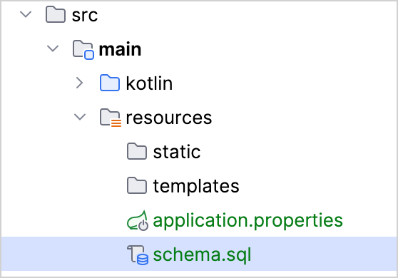
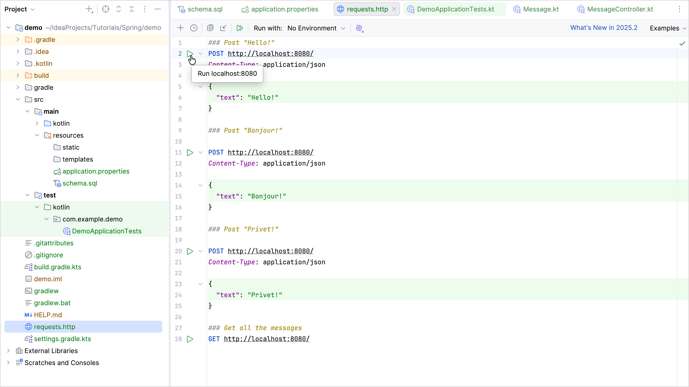
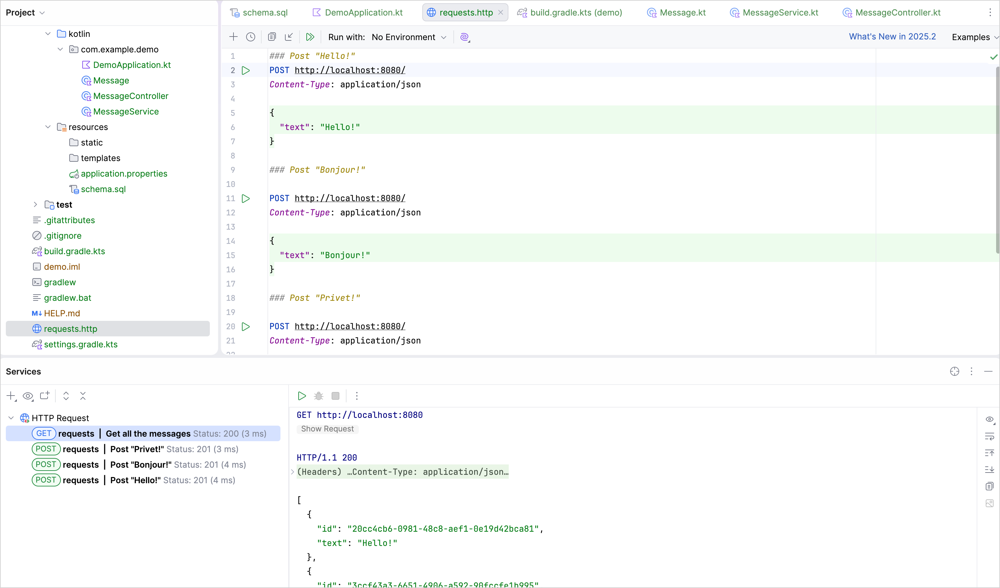
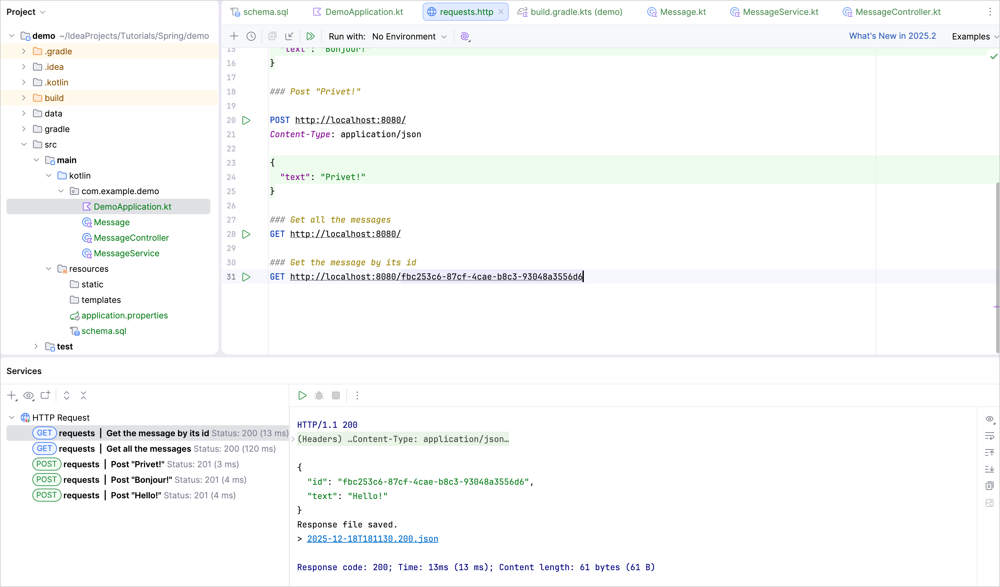

+++
title = "6.1.7.4 为 Spring Boot 项目添加数据库支持"
date = 2026-09-13T08:50:47+08:00
weight = 4
type = "docs"
description = ""
isCJKLanguage = true
draft = false
+++


> 原文链接: [https://kotlinlang.org/docs/jvm-spring-boot-add-db-support.html](https://kotlinlang.org/docs/jvm-spring-boot-add-db-support.html)

# 6.1.7.4 为 Spring Boot 项目添加数据库支持

使用 JDBC 模板为用 Kotlin 编写的 Spring Boot 项目添加数据库支持。

在教程的这一部分，你将使用*Java 数据库连接*（JDBC）向项目添加并配置数据库。在 JVM 应用中，你使用 JDBC 与数据库交互。为方便起见，Spring Framework 提供了 `JdbcTemplate` 类，它简化了 JDBC 的使用，并帮助避免常见错误。

## 添加数据库支持 {#add-database-support}

在基于 Spring Framework 的应用中，常见做法是把数据库访问逻辑实现在所谓的*服务*层中——业务逻辑就位于这里。在 Spring 中，你应该用 `@Service` 注解标记类，以表明该类属于应用的服务层。在本应用中，你将为此创建 `MessageService` 类。

在同一个包中，创建 `MessageService.kt` 文件和 `MessageService` 类，内容如下：

```kotlin
// MessageService.kt
package com.example.demo

import org.springframework.stereotype.Service
import org.springframework.jdbc.core.JdbcTemplate

@Service
class MessageService(private val db: JdbcTemplate) {
    fun findMessages(): List<Message> = db.query("select * from messages") { response, _ ->
        Message(response.getString("id"), response.getString("text"))
    }

    fun save(message: Message): Message {
        db.update(
            "insert into messages values ( ?, ? )",
            message.id, message.text
        )
        return message
    }
}
```

**构造函数参数与依赖注入 —— (private val db: JdbcTemplate)**

Kotlin 中的类有一个主构造函数。它也可以有一个或多个[次构造函数](../../../../languageguide/5.8-Classesandinterfaces/5.8.1-Classes/#secondary-constructors)。
*主构造函数*是类头部的一部分，位于类名和可选的类型参数之后。在我们的例子中，构造函数是 `(val db: JdbcTemplate)`。
`val db: JdbcTemplate` 是构造函数的参数：

```kotlin
@Service
class MessageService(private val db: JdbcTemplate)
```

**尾随 lambda 与 SAM 转换**

`findMessages()` 函数调用了 `JdbcTemplate` 类的 `query()` 函数。`query()` 函数接收两个参数：作为 String 实例的 SQL 查询，以及把每一行映射为一个对象的回调：

```sql
db.query("...", RowMapper { ... } )
```

`RowMapper` 接口只声明了一个方法，因此可以通过省略接口名的 lambda 表达式来实现它。Kotlin 编译器知道你希望把该 lambda 表达式转换成哪个接口，因为你把它用作了函数调用的参数。这称为 [Kotlin 中的 SAM 转换](../../../../interoperability/7.1-Javainterop/7.1.2-JavaInterop/#sam-conversions)：

```sql
db.query("...", { ... } )
```

SAM 转换之后，query 函数最终有两个参数：第一个位置是 String，最后一个位置是 lambda 表达式。按照 Kotlin 约定，如果函数的最后一个参数是函数，那么作为对应实参传入的 lambda 表达式可以放在圆括号之外。这种语法也称为[尾随 lambda](../../../../languageguide/5.7-Functions/5.7.2-Lambdas/#passing-trailing-lambdas)：

```sql
db.query("...") { ... }
```

**用下划线表示未使用的 lambda 参数**

对于带多个参数的 lambda，你可以用下划线 `_` 字符代替你不使用的参数名。
因此，query 函数调用的最终语法看起来是这样的：

```kotlin
db.query("select * from messages") { response, _ ->
Message(response.getString("id"), response.getString("text"))
}
```

## 更新 MessageController 类 {#update-the-messagecontroller-class}

更新 `MessageController.kt`，让它使用新的 `MessageService` 类：

```kotlin
// MessageController.kt
package com.example.demo

import org.springframework.http.ResponseEntity
import org.springframework.web.bind.annotation.GetMapping
import org.springframework.web.bind.annotation.PostMapping
import org.springframework.web.bind.annotation.RequestBody
import org.springframework.web.bind.annotation.RequestMapping
import org.springframework.web.bind.annotation.RestController
import java.net.URI

@RestController
@RequestMapping("/")
class MessageController(private val service: MessageService) {
    @GetMapping
    fun listMessages() = service.findMessages()

    @PostMapping
    fun post(@RequestBody message: Message): ResponseEntity<Message> {
        val savedMessage = service.save(message)
        return ResponseEntity.created(URI("/${savedMessage.id}")).body(savedMessage)
    }
}
```

**@PostMapping 注解**

负责处理 HTTP POST 请求的方法需要用 `@PostMapping` 注解标记。为了能把作为 HTTP Body 内容发送的 JSON 转换为对象，你需要对方法参数使用 `@RequestBody` 注解。由于应用的 classpath 中有 Jackson 库，转换会自动完成。

**ResponseEntity**

`ResponseEntity` 表示完整的 HTTP 响应：状态码、响应头和响应体。
 使用 `created()` 方法可以配置响应状态码（201），并设置 Location 响应头，指明所创建资源的上下文路径。

## 更新 MessageService 类 {#update-the-messageservice-class}

`Message` 类的 `id` 被声明为可空 String：

```kotlin
data class Message(val id: String?, val text: String)
```

不过，把 `null` 作为 `id` 值存进数据库并不正确：你需要优雅地处理这种情况。

更新 `MessageService.kt` 文件的代码，在把消息存入数据库时，如果 `id` 为 `null` 就生成一个新值：

```kotlin
// MessageService.kt
package com.example.demo

import org.springframework.stereotype.Service
import org.springframework.jdbc.core.JdbcTemplate
import java.util.UUID

@Service
class MessageService(private val db: JdbcTemplate) {
    fun findMessages(): List<Message> = db.query("select * from messages") { response, _ ->
        Message(response.getString("id"), response.getString("text"))
    }

    fun save(message: Message): Message {
        val id = message.id ?: UUID.randomUUID().toString() // 如果为 null 则生成新的 id
        db.update(
            "insert into messages values ( ?, ? )",
            id, message.text
        )
        return message.copy(id = id) // 返回带新 id 的消息副本
    }
}
```

**Elvis 运算符 —— ?:**

代码 `message.id ?: UUID.randomUUID().toString()` 使用了 [Elvis 运算符（if-not-null-else 简写）`?:`](../../../../languageguide/5.9-NullSafety/#elvis-operator)。如果 `?:` 左侧的表达式不为 `null`，Elvis 运算符就返回它；否则返回右侧的表达式。注意，只有当左侧为 `null` 时，右侧表达式才会被求值。

应用代码已经可以与数据库配合工作了。现在需要配置数据源。

## 配置数据库 {#configure-the-database}

在应用中配置数据库：

1. 在 `src/main/resources` 目录中创建 `schema.sql` 文件。它将保存数据库对象定义：



2. 用以下代码更新 `src/main/resources/schema.sql` 文件：

```sql
   -- schema.sql
   CREATE TABLE IF NOT EXISTS messages (
   id       VARCHAR(60)  PRIMARY KEY,
   text     VARCHAR      NOT NULL
   );
```

它创建了包含 `id` 和 `text` 两列的 `messages` 表。表结构与 `Message` 类的结构相对应。

3. 打开位于 `src/main/resources` 文件夹中的 `application.properties` 文件，并添加以下应用属性：

```none
   spring.application.name=demo
   spring.datasource.driver-class-name=org.h2.Driver
   spring.datasource.url=jdbc:h2:file:./data/testdb
   spring.datasource.username=name
   spring.datasource.password=password
   spring.sql.init.schema-locations=classpath:schema.sql
   spring.sql.init.mode=always
```

这些设置会为 Spring Boot 应用启用数据库。常见应用属性的完整列表见 [Spring 文档](https://docs.spring.io/spring-boot/appendix/application-properties/index.html)。

## 通过 HTTP 请求向数据库添加消息 {#add-messages-to-database-via-http-request}

你应该使用 HTTP 客户端来调之前创建的端点。在 IntelliJ IDEA 中，可以使用内置的 HTTP 客户端：

1. 运行应用。应用启动并运行后，你就可以执行 POST 请求把消息存入数据库。

2. 在项目根目录中创建 `requests.http` 文件，并添加以下 HTTP 请求：

```http request
   ### Post "Hello!"
   POST http: // POST http://localhost:8080/
   Content-Type: application/json

   {
     "text": "Hello!"
   }

   ### Post "Bonjour!"

   POST http: // POST http://localhost:8080/
   Content-Type: application/json

   {
     "text": "Bonjour!"
   }

   ### Post "Privet!"

   POST http: // POST http://localhost:8080/
   Content-Type: application/json

   {
     "text": "Privet!"
   }

   ### Get all the messages
   GET http: // GET http://localhost:8080/
```

3. 执行所有 POST 请求。使用请求声明旁行号处的绿色 **Run** 图标。这些请求会把文本消息写入数据库：



4. 执行 GET 请求，并在 **Run** 工具窗口中查看结果：



### 执行请求的其他方式 {#alternative-way-to-execute-requests}

你也可以使用任何其他 HTTP 客户端或 cURL 命令行工具。例如，在终端中运行以下命令可以得到相同结果：

```bash
curl -X POST --location "http://localhost:8080" -H "Content-Type: application/json" -d "{ \"text\": \"Hello!\" }"

curl -X POST --location "http://localhost:8080" -H "Content-Type: application/json" -d "{ \"text\": \"Bonjour!\" }"

curl -X POST --location "http://localhost:8080" -H "Content-Type: application/json" -d "{ \"text\": \"Privet!\" }"

curl -X GET --location "http://localhost:8080"
```

## 按 id 获取消息 {#retrieve-messages-by-id}

扩展应用的功能，以按 id 获取单条消息。

1. 在 `MessageService` 类中，添加新函数 `findMessageById(id: String)`，用于按 id 获取单条消息：

```kotlin
    // MessageService.kt
    package com.example.demo

    import org.springframework.stereotype.Service
    import org.springframework.jdbc.core.JdbcTemplate
    import org.springframework.jdbc.core.query
    import java.util.*

    @Service
    class MessageService(private val db: JdbcTemplate) {
        fun findMessages(): List<Message> = db.query("select * from messages") { response, _ ->
            Message(response.getString("id"), response.getString("text"))
        }

        fun findMessageById(id: String): Message? = db.query("select * from messages where id = ?", id) { response, _ ->
            Message(response.getString("id"), response.getString("text"))
        }.singleOrNull()

        fun save(message: Message): Message {
            val id = message.id ?: UUID.randomUUID().toString() // 如果为 null 则生成新的 id
            db.update(
                "insert into messages values ( ?, ? )",
                id, message.text
            )
            return message.copy(id = id) // 返回带新 id 的消息副本
        }
    }
```

**vararg 实参在参数列表中的位置**

`query()` 函数接收三个参数：

- 需要参数才能运行的 SQL 查询字符串
- `id`，它是 String 类型的参数
- `RowMapper` 实例，由 lambda 表达式实现

`query()` 函数的第二个参数被声明为*可变参数*（`vararg`）。在 Kotlin 中，可变参数的位置不必位于参数列表的最后。

**singleOrNull() 函数**

[`singleOrNull()`](https://kotlinlang.org/api/core/kotlin-stdlib/kotlin.collections/single-or-null.html) 函数返回单个元素；如果数组为空，或者存在多个值相同的元素，则返回 `null`。

> **警告：** 用于按 id 获取消息的 `.query()` 函数是 Spring Framework 提供的 [Kotlin 扩展函数](../../../../languageguide/5.8-Classesandinterfaces/5.8.3-Extensions/#extension-functions)。如上面的代码所示，它需要额外的导入 `import org.springframework.jdbc.core.query`。

2. 向 `MessageController` 类添加带 `id` 参数的新函数 `index(...)`：

```kotlin
    // MessageController.kt
    package com.example.demo

    import org.springframework.http.ResponseEntity
    import org.springframework.web.bind.annotation.GetMapping
    import org.springframework.web.bind.annotation.PathVariable
    import org.springframework.web.bind.annotation.PostMapping
    import org.springframework.web.bind.annotation.RequestBody
    import org.springframework.web.bind.annotation.RequestMapping
    import org.springframework.web.bind.annotation.RestController
    import java.net.URI

    @RestController
    @RequestMapping("/")
    class MessageController(private val service: MessageService) {
        @GetMapping
        fun listMessages() = ResponseEntity.ok(service.findMessages())

        @PostMapping
        fun post(@RequestBody message: Message): ResponseEntity<Message> {
            val savedMessage = service.save(message)
            return ResponseEntity.created(URI("/${savedMessage.id}")).body(savedMessage)
        }

        @GetMapping("/{id}")
        fun getMessage(@PathVariable id: String): ResponseEntity<Message> =
            service.findMessageById(id).toResponseEntity()

        private fun Message?.toResponseEntity(): ResponseEntity<Message> =
            // 如果消息为 null（未找到），则把响应码设为 404
            this?.let { ResponseEntity.ok(it) } ?: ResponseEntity.notFound().build()
    }
```

**从上下文路径中获取值**

由于你用 `@GetMapping("/{id}")` 注解了新函数，Spring Framework 会从上下文路径中获取消息 `id`。通过用 `@PathVariable` 注解函数参数，你告诉框架把获取到的值作为函数实参使用。这个新函数会调用 `MessageService`，以按其 id 获取单条消息。

**带可空接收者的扩展函数**

扩展可以定义在可空接收者类型上。如果接收者为 `null`，那么 `this` 也是 `null`。因此，在定义带可空接收者类型的扩展时，建议在函数体内执行 `this == null` 检查。
你也可以像上面的 `toResponseEntity()` 函数那样，使用空安全调用运算符（`?.`）来执行空检查：

```kotlin
this?.let { ResponseEntity.ok(it) }
```

**ResponseEntity**

`ResponseEntity` 表示 HTTP 响应，包括状态码、响应头和响应体。它是一个泛型包装器，让你能把自定义的 HTTP 响应发回客户端，并对内容拥有更多控制权。

以下是应用的完整代码：

```kotlin
// DemoApplication.kt
package com.example.demo

import org.springframework.boot.autoconfigure.SpringBootApplication
import org.springframework.boot.runApplication

@SpringBootApplication
class DemoApplication

fun main(args: Array<String>) {
    runApplication<DemoApplication>(*args)
}
```

```kotlin
// Message.kt
package com.example.demo

data class Message(val id: String?, val text: String)
```

```kotlin
// MessageService.kt
package com.example.demo

import org.springframework.stereotype.Service
import org.springframework.jdbc.core.JdbcTemplate
import org.springframework.jdbc.core.query
import java.util.*

@Service
class MessageService(private val db: JdbcTemplate) {
    fun findMessages(): List<Message> = db.query("select * from messages") { response, _ ->
        Message(response.getString("id"), response.getString("text"))
    }

    fun findMessageById(id: String): Message? = db.query("select * from messages where id = ?", id) { response, _ ->
        Message(response.getString("id"), response.getString("text"))
    }.singleOrNull()

    fun save(message: Message): Message {
        val id = message.id ?: UUID.randomUUID().toString()
        db.update(
            "insert into messages values ( ?, ? )",
            id, message.text
        )
        return message.copy(id = id)
    }
}
```

```kotlin
// MessageController.kt
package com.example.demo

import org.springframework.http.ResponseEntity
import org.springframework.web.bind.annotation.GetMapping
import org.springframework.web.bind.annotation.PathVariable
import org.springframework.web.bind.annotation.PostMapping
import org.springframework.web.bind.annotation.RequestBody
import org.springframework.web.bind.annotation.RequestMapping
import org.springframework.web.bind.annotation.RestController
import java.net.URI

@RestController
@RequestMapping("/")
class MessageController(private val service: MessageService) {
    @GetMapping
    fun listMessages() = ResponseEntity.ok(service.findMessages())

    @PostMapping
    fun post(@RequestBody message: Message): ResponseEntity<Message> {
        val savedMessage = service.save(message)
        return ResponseEntity.created(URI("/${savedMessage.id}")).body(savedMessage)
    }

    @GetMapping("/{id}")
    fun getMessage(@PathVariable id: String): ResponseEntity<Message> =
        service.findMessageById(id).toResponseEntity()

    private fun Message?.toResponseEntity(): ResponseEntity<Message> =
        this?.let { ResponseEntity.ok(it) } ?: ResponseEntity.notFound().build()
}
```

## 运行应用 {#run-the-application}

Spring 应用已经可以运行了：

1. 再次运行应用。

2. 打开 `requests.http` 文件并添加新的 GET 请求：

```http request
    ### Get the message by its id
    GET http://localhost:8080/id
```

3. 执行该 GET 请求，从数据库中获取所有消息。

4. 在 **Run** 工具窗口中复制其中一个 id，并把它加入请求，如下所示：

```http request
    ### Get the message by its id
    GET http://localhost:8080/f910aa7e-11ee-4215-93ed-1aeeac822707
```

> **注意：** 请替换成你自己的消息 id，而不是上面这个。

5. 执行该 GET 请求，并在 **Run** 工具窗口中查看结果：



## 下一步 {#next-step}

最后一步将展示如何使用更流行的方式通过 Spring Data 连接数据库。

[上一步](../6.1.7.3-JvmSpringBootAddDataClass/)

[下一步](../6.1.7.5-JvmSpringBootUsingCrudrepository/)
