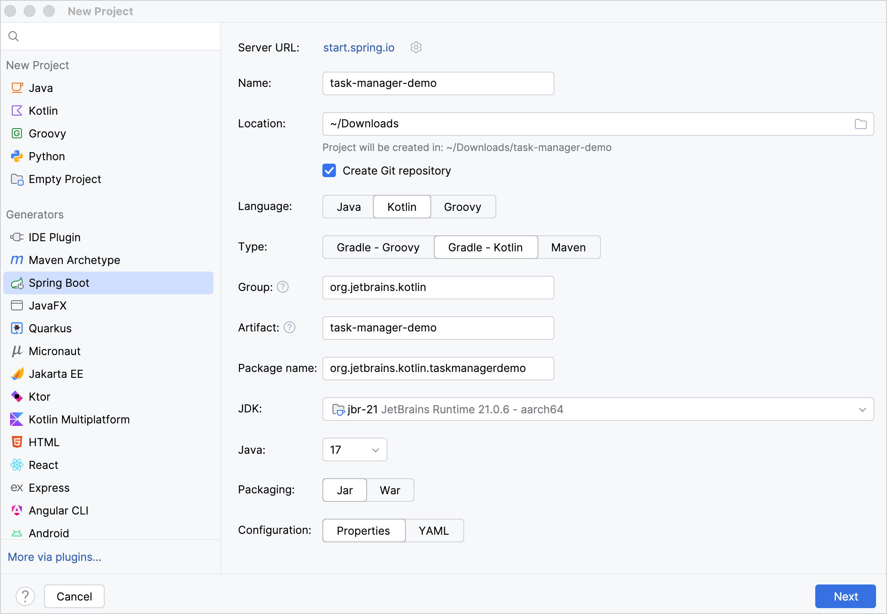
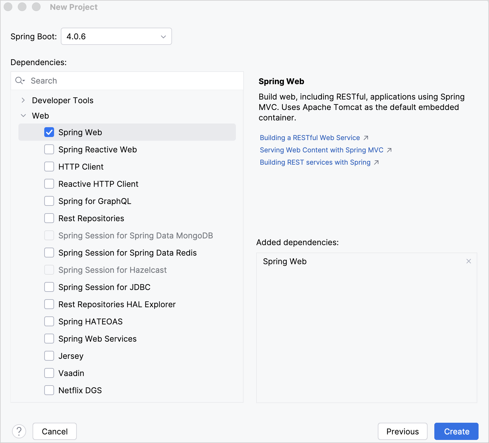
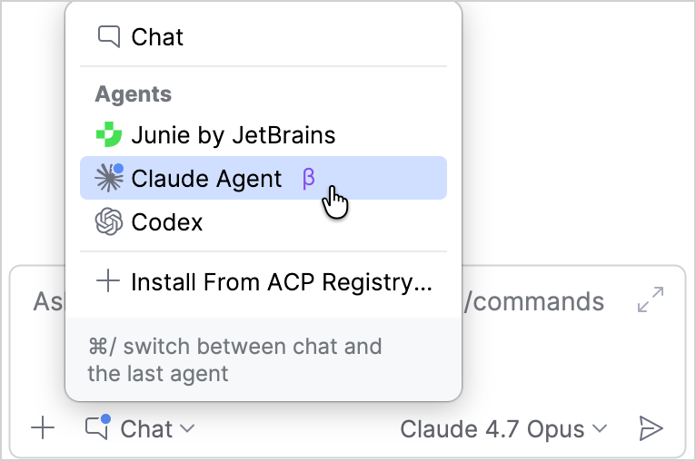
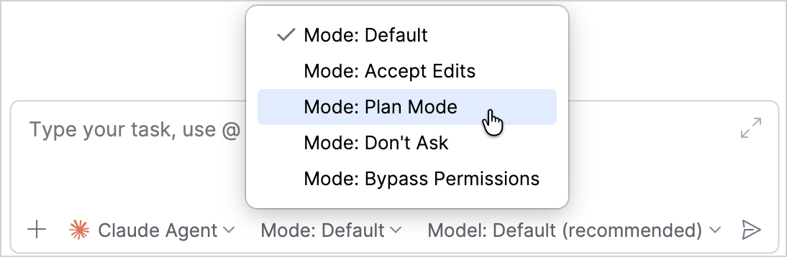
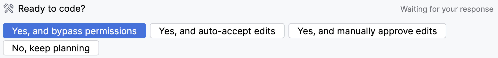
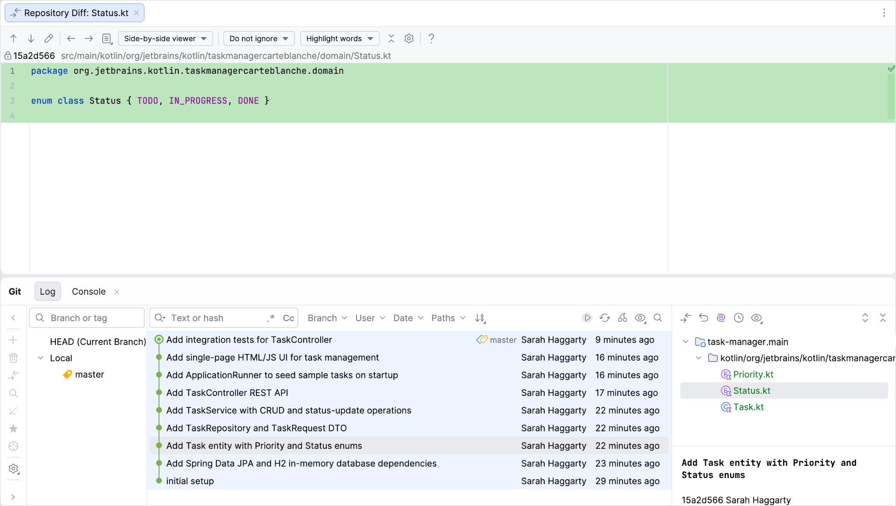
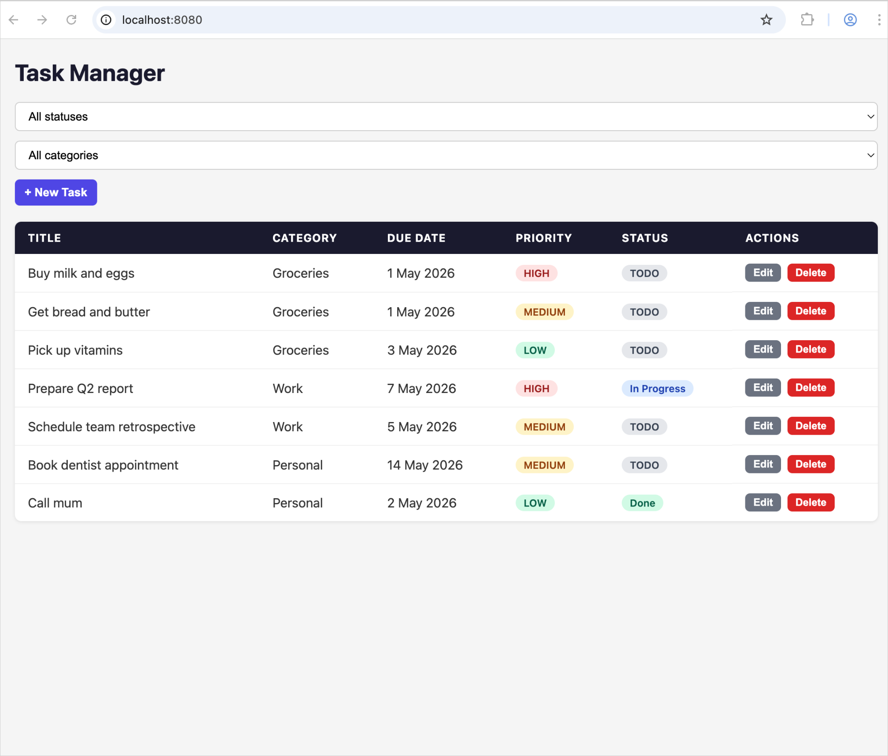
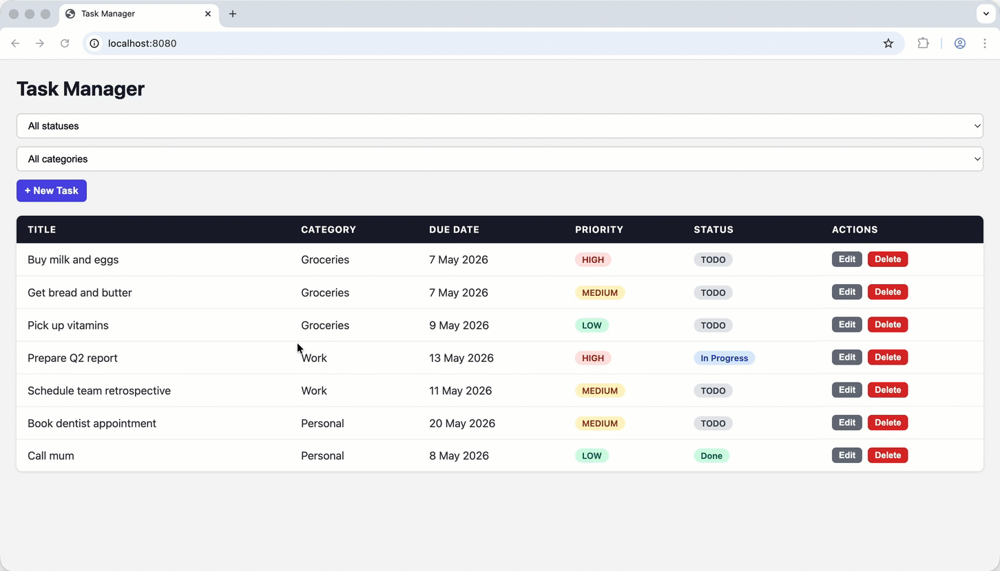

+++
title = "6.1.8 使用 Spring Boot 和 Claude 创建任务管理应用"
date = 2026-09-13T08:50:47+08:00
weight = 7
type = "docs"
description = ""
isCJKLanguage = true
draft = false
+++


> 原文链接: [https://kotlinlang.org/docs/spring-boot-claude.html](https://kotlinlang.org/docs/spring-boot-claude.html)

# 6.1.8 使用 Spring Boot 和 Claude 创建任务管理应用

了解如何用 Claude 和 Spring Boot 创建一个 Kotlin 应用。

在本教程中，你将学习如何使用 [Claude](https://claude.com/product/overview) 创建一个管理任务的 Kotlin 应用。教程使用 Spring Boot 管理后端基础设施，而 Claude 负责规划和开发应用。

如果你更希望在没有 AI 帮助的情况下创建应用，可以按照我们的[用 Kotlin 和 Spring Boot 创建 Web 应用](../6.1.7-Createawebappwithkotlinandspringboot/6.1.7.1-JvmGetStartedSpringBoot/)教程操作。

> **注意：** 与任何由 AI 驱动的工具一样，Claude 也可能犯错。请仔细审查 Claude 的更改，只在你可以信任的代码上使用它。关于 Claude 安全策略的更多信息，请参阅 [Claude Code 文档](https://code.claude.com/docs/en/security)。

## 搭建环境 {#set-up-the-environment}

> **提示：** 本教程通过 JetBrains AI Assistant 使用 Claude，但你也可以在终端中使用 Claude Code 来完成这些步骤。

1. 下载并安装最新版本的 [IntelliJ IDEA](https://www.jetbrains.com/idea/download/)。
2. 安装 [JetBrains AI Assistant](https://plugins.jetbrains.com/plugin/22282-jetbrains-ai-assistant)。
3. 通过以下方式之一激活 Claude Agent：
* [使用 JetBrains AI 订阅](https://www.jetbrains.com/help/ai-assistant/activate-agents.html#activate-claude-agent-with-jbai-subscription)
* [使用 API 密钥](https://www.jetbrains.com/help/ai-assistant/activate-agents.html#activate-claude-agent-with-api-key)
* [使用 Anthropic Console](https://www.jetbrains.com/help/ai-assistant/activate-agents.html#activate-agent-with-provider-specific-method)

## 创建项目 {#create-a-project}

> **提示：** 你也可以使用 [Spring 的基于 Web 的项目生成器](https://start.spring.io/#!language=kotlin&type=gradle-project-kotlin)创建 Spring Boot 项目。

在 IntelliJ IDEA 中创建一个新的 Spring Boot 项目：

1. 在 IntelliJ IDEA 中，选择 **File** | **New** | **Project**。
2. 在左侧面板中，选择 **New Project** | **Spring Boot**。
3. 在 **New Project** 窗口中指定以下字段和选项：

* **Name**：task-manager-demo
* **Language**：Kotlin
* **Type**：Gradle - Kotlin

> **提示：** 该选项用于指定构建系统和 DSL。

* **Package name**：org.jetbrains.kotlin.taskmanagerdemo
* **JDK**：jbr-21
* **Java**：17

> **提示：** 如果你没有安装这些 Java 和 JDK 版本，可以从下拉列表中下载。



4. 确认所有字段都已指定，然后点击 **Next**。
5. 在 **Spring Boot** 字段中选择最新的稳定 Spring Boot 版本。
6. 选择 **Web | Spring Web** 依赖。



7. 点击 **Create** 以生成并设置项目。

IDE 会生成并打开新项目。下载和导入项目依赖可能需要一些时间。

## 创建开发计划 {#create-a-development-plan}

在你的项目中：

1. 打开  **AI Chat** 工具窗口。默认选中 **Chat** 模式。请选择 **Claude Agent**。



2. 点击 **Mode: Default**  并选择 **Mode: Plan Mode**。现在 Claude Agent 已经准备好只做规划而不执行操作。



> **提示：** 关于不同运行模式的更多信息，请参阅[选择运行模式](https://www.jetbrains.com/help/ai-assistant/claude-agent.html#select-operation-mode)。

3. 编写一条提示，让 Claude 创建一个任务管理应用。说明一些你认为它应包含的细节。例如：

```text
   I'd like to create a task manager application for managing tasks, such as a grocery list.
   It should have a basic UI and include categories, due dates, priorities, and status tracking.

   Use VCS while working. Work step by step and create commits at each stage so I can review the changes afterward.
```

> **提示：** 关于如何设计提示的指导，请参阅 [Claude Code 最佳实践](https://code.claude.com/docs/en/best-practices)。

Claude 会探索现有项目结构并提出一个计划。

4. 在继续之前仔细审查该计划。如果你想做一些修改，请选择 **No, keep planning** 并补充你的后续意见。
5. 当你准备好继续时，根据你希望对 Claude 的更改拥有多少控制权，选择相应的 **Yes ...** 选项。



> **提示：** 关于不同选项的更多信息，请参阅 [Claude Code 权限模式](https://code.claude.com/docs/en/best-practices)。

6. Claude 会退出 **Plan Mode** 并开始工作。请等待工作完成。

## 审查提交 {#review-the-commits}

在运行应用之前，请仔细审查生成的更改：

1. 打开 **Git** 工具窗口查看提交列表。
2. 选择一个提交，双击每个被修改的文件，在 IntelliJ IDEA 的并排查看器中审查差异。



## 运行应用 {#run-the-app}

当你对更改满意后，就可以运行应用了：

1. 运行 `bootRun` Gradle 任务，或在终端中输入以下命令：

```bash
   ./gradlew bootRun
```

2. 在浏览器中打开 localhost URL。默认通常是：

```text
   http: // http://localhost:8080
```

现在你应该能看到 Claude 创建的基本 UI。



> **提示：** 由于 UI 是 Claude 设计的，你的 UI 可能与本教程中的版本不同。

## 测试应用 {#test-the-app}

现在轮到你测试应用了。

### 手动测试 UI {#test-the-ui-manually}

先测试 UI 功能。试一些简单的操作：

1. 创建一个任务并测试表单字段。
2. 编辑一个任务，检查更改是否被保留。
3. 更改任务状态。
4. 删除一个任务。
5. 更改任务的分类。

如果其中任何操作不工作，就向 Claude 发送一条新提示，让它调查并修复问题。

### 运行单元测试 {#run-unit-tests}

Claude 也会自动创建一些测试。运行以下命令检查所有测试是否通过：

```bash
   ./gradlew test
```

或者，在 `src/test` 目录中打开一个测试，点击行号处的运行图标 。测试成功时会显示
。

如果任何测试不通过，就向 Claude 发送一条新提示，让它调查并修复问题。

## 进行改进 {#make-refinements}

现在初始任务已经完成，你可以进行改进。例如，让我们改进 UI，让用户可以直接在列表中编辑任务。

你可以发送这样一条提示：

```text
As a next step, allow users to edit tasks inline. For example, let users click on a task title to edit it directly in the list,
and update fields like priority, due date, or status without leaving the current view.
This change should make the app feel faster and more intuitive to use.
```

与之前一样，Claude 会探索现有项目结构并提出计划。在你接受计划后，等待 Claude 完成，审查更改，然后再次运行应用。



恭喜！你已经在 IntelliJ IDEA 中直接用 Claude 规划、构建、测试并改进了 Kotlin Spring Boot 应用。

## 接下来学什么？ {#what-s-next}

* 了解 [](../../../kotlinforaianddataanalysis/8.1-Kotlinforai/8.1.1-KotlinAiSkills/)
* 查看我们关于[在 Kotlin AI 技能中使用 Junie](https://kotlinlang.org/docs/multiplatform/multiplatform-cocoapods-spm-migration-ai.html)的教程
