+++
title = "6.2.2.2 Kotlin/JS 入门"
date = 2026-09-13T08:50:47+08:00
weight = 2
type = "docs"
description = ""
isCJKLanguage = true
draft = false
+++


> 原文链接: [https://kotlinlang.org/docs/js-get-started.html](https://kotlinlang.org/docs/js-get-started.html)

# 6.2.2.2 Kotlin/JS 入门

本教程演示如何使用 Kotlin/JavaScript (Kotlin/JS) 为浏览器创建 Web 应用。要创建应用，请选择最适合你工作方式的工具：

* **[IntelliJ IDEA](#create-your-application-in-intellij-idea)**：从版本控制克隆项目模板，并在 IntelliJ IDEA 中进行开发。
* **[Gradle 构建系统](#create-your-application-using-gradle)**：手动创建项目的构建文件，以更好地理解底层配置的工作方式。

> **提示：** 除了面向浏览器之外，用 Kotlin/JS 你还可以为其他环境编译。更多信息请参阅[执行环境](../6.2.2.3-JsProjectSetup/#execution-environments)。

## 在 IntelliJ IDEA 中创建应用 {#create-your-application-in-intellij-idea}

要创建 Kotlin/JS Web 应用，你可以使用 [IntelliJ IDEA](https://www.jetbrains.com/idea/download/)。

### 搭建环境 {#set-up-the-environment}

1. 下载并安装最新版本的 [IntelliJ IDEA](https://www.jetbrains.com/idea/)。
2. 安装 [Kotlin Multiplatform IDE 插件](https://plugins.jetbrains.com/plugin/14936-kotlin-multiplatform)（不要与 Kotlin Multiplatform Gradle 插件混淆）。

### 创建项目 {#create-your-project}

1. 在 IntelliJ IDEA 中，选择 **File** | **New** | **Project from Version Control**。
2. 输入 [Kotlin/JS 模板项目](https://github.com/Kotlin/kmp-js-wizard)的 URL：

```text
   https://github.com/Kotlin/kmp-js-wizard
```

3. 点击 **Clone**。

### 配置项目 {#configure-your-project}

1. 打开 `kmp-js-wizard/gradle/libs.versions.toml` 文件。它包含项目依赖的版本目录。
2. 确认 Kotlin 版本与 Kotlin Multiplatform Gradle 插件的版本一致，这是创建面向 Kotlin/JS 的 Web 应用所必需的：

```toml
   [versions]
   kotlin = "2.4.20"

   [plugins]
   kotlin-multiplatform = { id = "org.jetbrains.kotlin.multiplatform", version.ref = "kotlin" }
```

3. 同步 Gradle 文件（如果你更新了 `libs.versions.toml` 文件）。点击构建文件中出现的 **Load Gradle Changes** 图标。

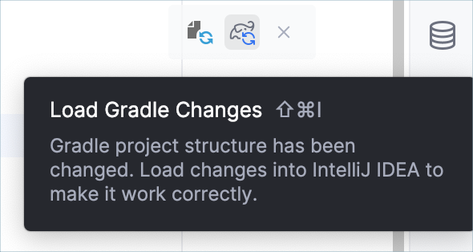

或者，点击 Gradle 工具窗口中的刷新按钮。

关于多平台项目 Gradle 配置的更多信息，请参阅 [Multiplatform Gradle DSL 参考](https://kotlinlang.org/docs/multiplatform/multiplatform-dsl-reference.html)。

### 构建并运行应用 {#build-and-run-the-application}

1. 打开 `src/jsMain/kotlin/Main.kt` 文件。

* `src/jsMain/kotlin/` 目录包含项目 JavaScript 目标的主要 Kotlin 源文件。
* `Main.kt` 文件中的代码使用 [`kotlinx.browser`](https://github.com/Kotlin/kotlinx-browser) API 在浏览器页面上渲染 "Hello, Kotlin/JS!"。

2. 点击 `main()` 函数中的 **Run** 图标来运行代码。

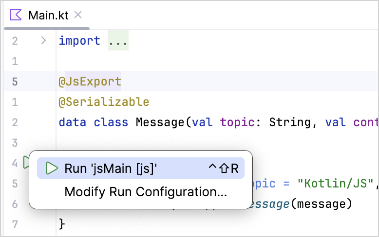

Web 应用会自动在浏览器中打开。或者，运行完成后，你可以在浏览器中打开以下 URL：

```text
   http: // http://localhost:8080/
```

你可以看到这个 Web 应用：

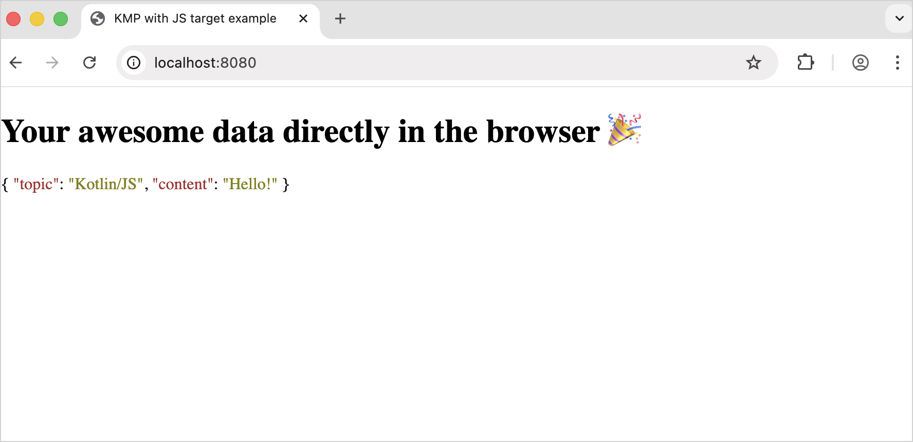

首次运行应用后，IntelliJ IDEA 会在顶部栏创建对应的运行配置（**jsMain [js]**）：

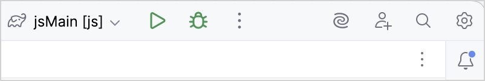

> 在使用 Ultimate 订阅的 IntelliJ IDEA 中，你可以使用 [JS 调试器](https://www.jetbrains.com/help/idea/configuring-javascript-debugger.html)直接在 IDE 中调试代码。 {style="tip"}

### 启用持续构建 {#enable-continuous-build}

Gradle 可以在你每次做出更改时自动重新构建项目：

1. 在运行配置列表中选择 **jsMain [js]**，然后点击 **More Actions** | **Edit**。

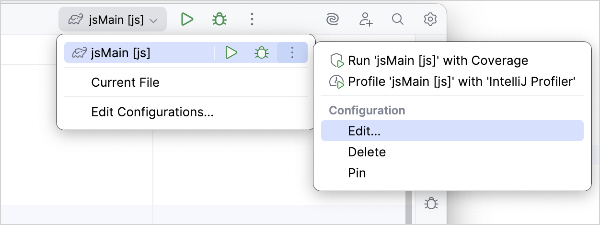

2. 在 **Run/Debug Configurations** 对话框的 **Run** 字段中输入 `jsBrowserDevelopmentRun --continuous`。

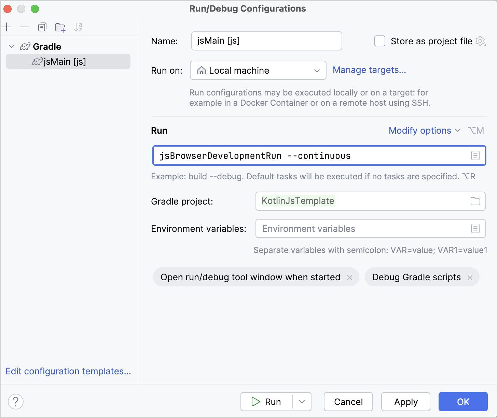

3. 点击 **OK**。

现在，当你运行应用并做出任何更改时，Gradle 会自动执行增量构建，并在你保存（Ctrl + S/Cmd + S）或更改类文件时热重载浏览器。

### 修改应用 {#modify-the-application}

修改应用，添加一个统计单词中字母数量的功能。

#### 添加输入元素 {#add-an-input-element}

1. 在 `src/jsMain/kotlin/Main.kt` 文件中，通过一个[扩展函数](../../../../languageguide/5.8-Classesandinterfaces/5.8.3-Extensions/#extension-functions)添加 [HTML 输入元素](https://developer.mozilla.org/en-US/docs/Web/HTML/Reference/Elements/input)以读取用户输入：

```kotlin
   // 替换 Element.appendMessage() 函数
   fun Element.appendInput() {
       val input = document.createElement("input")
       appendChild(input)
   }
```

2. 在 `main()` 中调用 `appendInput()` 函数。它会在页面上显示一个输入元素：

```kotlin
   fun main() {
       // 替换 document.body!!.appendMessage(message)
       document.body?.appendInput()
   }
```

3. [再次运行应用](#build-and-run-the-application)。

你的应用看起来是这样的：

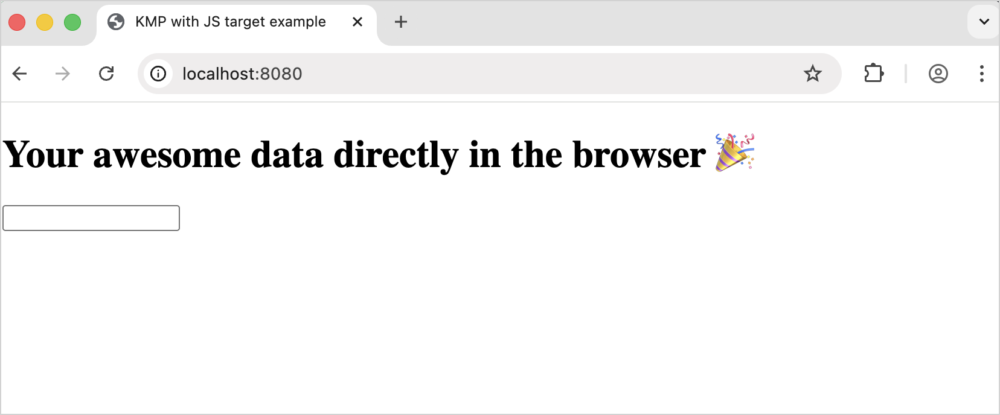

#### 添加输入事件处理 {#add-an-input-event-handling}

1. 在 `appendInput()` 函数中添加一个监听器，以读取输入值并对变化作出反应：

```kotlin
   // 替换当前的 appendInput() 函数
    fun Element.appendInput(onChange: (String) -> Unit = {}) {
        val input = document.createElement("input").apply {
            addEventListener("change") { event ->
                onChange(event.target.unsafeCast<HTMLInputElement>().value)
            }
        }
        appendChild(input)
    }
```

2. 按照 IDE 的建议导入 `HTMLInputElement` 依赖。

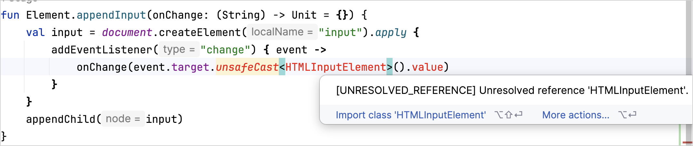

3. 在 `main()` 中调用 `onChange` 回调。它读取并处理输入值：

```kotlin
    fun main() {
        // 替换 document.body?.appendInput()
        document.body?.appendInput(onChange = { println(it) })
    }
```

#### 添加输出元素 {#add-an-output-element}

1. 通过定义一个创建段落的[扩展函数](../../../../languageguide/5.8-Classesandinterfaces/5.8.3-Extensions/#extension-functions)，添加一个用于显示输出的文本元素：

```kotlin
    fun Element.appendTextContainer(): Element {
        return document.createElement("p").also(::appendChild)
    }
```

2. 在 `main()` 中调用 `appendTextContainer()` 函数。它会创建输出元素：

```kotlin
    fun main() {
        // 为我们的输出创建一个文本容器
        // 替换 val message = Message(topic = "Kotlin/JS", content
        val output = document.body?.appendTextContainer()

        // 读取输入值
        document.body?.appendInput(onChange = { println(it) })
    }
```

#### 处理输入以统计字母数 {#process-the-input-to-count-the-letters}

处理输入：去除空白字符，并显示带有字母数量的输出。

在 `main()` 函数内的 `appendInput()` 函数中添加以下代码：

```kotlin
fun main() {
    // 为我们的输出创建一个文本容器
    val output = document.body?.appendTextContainer()

    // 读取输入值
    // 替换当前的 appendInput() 函数
    document.body?.appendInput(onChange = { name ->
        name.replace(" ", "").let {
            output?.textContent = "Your name contains ${it.length} letters"
        }
    })
}
```

从上面的代码可以看到：

* [`replace()` 函数](https://kotlinlang.org/api/latest/jvm/stdlib/kotlin.text/replace.html)会移除姓名中的空格。
* [`let{}` 作用域函数](../../../../libraryguides/9.1-Standardlibrary/9.1.4-ScopeFunctions/#let)会在对象上下文中运行函数。
* [字符串模板](../../../../languageguide/5.4-Types/5.4.6-Strings/#string-templates)（`${it.length}`）通过在变量前加美元符号（`$`）并用花括号（`{}`）括起来，把单词长度插入字符串中。而 `it` 是 [lambda 参数](../../../../languageguide/5.2-CodingConventions/#lambda-parameters)的默认名称。

#### 运行应用 {#run-the-application}

1. [运行应用](#build-and-run-the-application)。
2. 输入你的名字。
3. 按 Enter。

你可以看到结果：

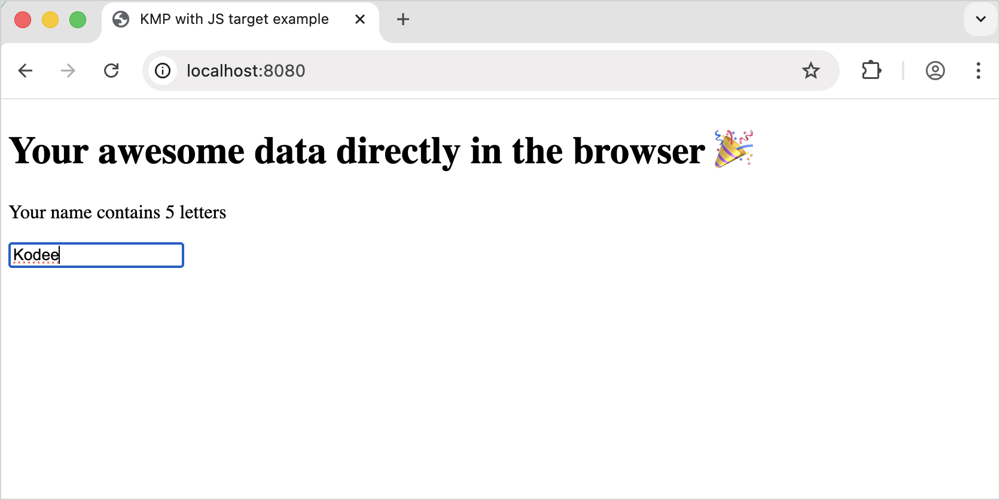

#### 处理输入以统计不同字母数 {#process-the-input-to-count-unique-letters}

作为额外练习，让我们处理输入，计算并显示单词中不同字母的数量：

1. 在 `src/jsMain/kotlin/Main.kt` 文件中，为 `String` 添加 `.countDistinctCharacters()` [扩展函数](../../../../languageguide/5.8-Classesandinterfaces/5.8.3-Extensions/#extension-functions)：

```kotlin
   fun String.countDistinctCharacters() = lowercase().toList().distinct().count()
```

从上面的代码可以看到：

* [`.lowercase()` 函数](https://kotlinlang.org/api/latest/jvm/stdlib/kotlin.text/lowercase.html)把名字转换为小写。
* [`toList()` 函数](https://kotlinlang.org/api/latest/jvm/stdlib/kotlin.text/to-list.html)把输入字符串转换为字符列表。
* [`distinct()` 函数](https://kotlinlang.org/api/latest/jvm/stdlib/kotlin.collections/distinct.html)只选取单词中不重复的字符。
* [`count()` 函数](https://kotlinlang.org/api/latest/jvm/stdlib/kotlin.collections/count.html)统计这些不同字符的数量。

2. 在 `main()` 中调用 `.countDistinctCharacters()` 函数。它会统计你名字中不同字母的数量：

```kotlin
    fun main() {
        // 为我们的输出创建一个文本容器
        val output = document.body?.appendTextContainer()

        // 读取输入值
        document.body?.appendInput(onChange = { name ->
            name.replace(" ", "").let {
                // 打印不同字母的数量
                // 替换 output?.textContent = "Your name contains $
                output?.textContent = "Your name contains ${it.countDistinctCharacters()} unique letters"
            }
        })
   }
```

3. 按照步骤[运行应用并输入你的名字](#run-the-application)。

你可以看到结果：

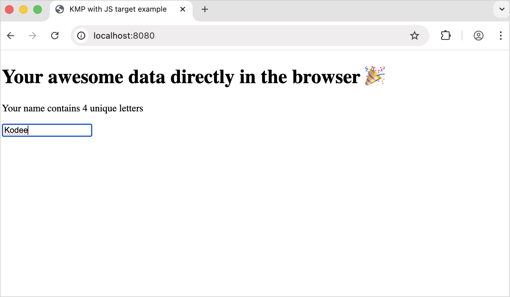

## 使用 Gradle 创建应用 {#create-your-application-using-gradle}

在本节中，你可以学习如何使用 [Gradle](https://gradle.org) 手动创建 Kotlin/JS 应用。

Gradle 是 Kotlin/JS 和 Kotlin Multiplatform 项目的默认构建系统。它也常用于 Java、Android 以及其他生态。

### 创建项目文件 {#create-project-files}

1. 确保你使用的 Gradle 版本与 Kotlin Gradle 插件 (KGP) 兼容。更多细节请参阅[兼容性表](../../../../buildtools/11.1-Gradle/11.1.3-GradleConfigureProject/#apply-the-plugin)。
2. 使用文件管理器、命令行或你喜欢的任何工具为项目创建一个空目录。
3. 在项目目录中创建内容如下的 `build.gradle.kts` 文件：

**Kotlin**

```kotlin
   // build.gradle.kts
   plugins {
       kotlin("multiplatform") version "2.4.20"
   }

   repositories {
       mavenCentral()
   }

   kotlin {
       js {
           // 在浏览器中运行用 browser()，在 Node.js 中运行用 nodejs()
           browser()
           binaries.executable()
       }
   }
```

**Groovy**

```groovy
   // build.gradle
   plugins {
       id 'org.jetbrains.kotlin.multiplatform' version '2.4.20'
   }

   repositories {
       mavenCentral()
   }

   kotlin {
       js {
           // 在浏览器中运行用 browser()，在 Node.js 中运行用 nodejs()
           browser()
           binaries.executable()
       }
   }
```

> 你可以使用不同的[执行环境](../6.2.2.3-JsProjectSetup/#execution-environments)，例如 `browser()` 或 `nodejs()`。每个环境都定义了代码的运行位置，并决定 Gradle 在项目中生成任务名称的方式。 {style="note"}

4. 在项目目录中创建一个空的 `settings.gradle.kts` 文件。
5. 在项目目录中创建 `src/jsMain/kotlin` 目录。
6. 在 `src/jsMain/kotlin` 目录中，添加内容如下的 `hello.kt` 文件：

```kotlin
   fun main() {
       println("Hello, Kotlin/JS!")
   }
```

按照约定，所有源代码都位于 `src/<target name>[Main|Test]/kotlin` 目录中：
* `Main` 是源代码的位置。
* `Test` 是测试的位置。
* `<target name>` 对应目标平台（在本例中是 `js`）。

**对于 `browser` 环境**

> 如果你使用的是 `browser` 环境，请继续以下步骤。如果你使用的是 `nodejs` 环境，请前往[构建并运行项目](#build-and-run-the-project)一节。 {style="note"}

1. 在项目目录中创建 `src/jsMain/resources` 目录。
2. 在 `src/jsMain/resources` 目录中，创建内容如下的 `index.html` 文件：

```html
   <!DOCTYPE html>
   <html lang="en">
   <head>
       <meta charset="UTF-8">
       <title>Application title</title>
   </head>
   <body>
       <script src="$NAME_OF_YOUR_PROJECT_DIRECTORY.js"></script>
   </body>
   </html>
```

3. 把 `<$NAME_OF_YOUR_PROJECT_DIRECTORY>` 占位符替换为你的项目目录名。

### 构建并运行项目 {#build-and-run-the-project}

要构建项目，请在项目根目录下运行以下命令：

```bash
# For browser
gradle jsBrowserDevelopmentRun

# OR

# For Node.js
gradle jsNodeDevelopmentRun
```

如果你使用的是 `browser` 环境，可以看到浏览器会打开 `index.html` 文件，并向浏览器控制台打印 `"Hello, Kotlin/JS!"`。你可以使用 Ctrl + Shift + J/Cmd + Option + J 命令打开控制台。

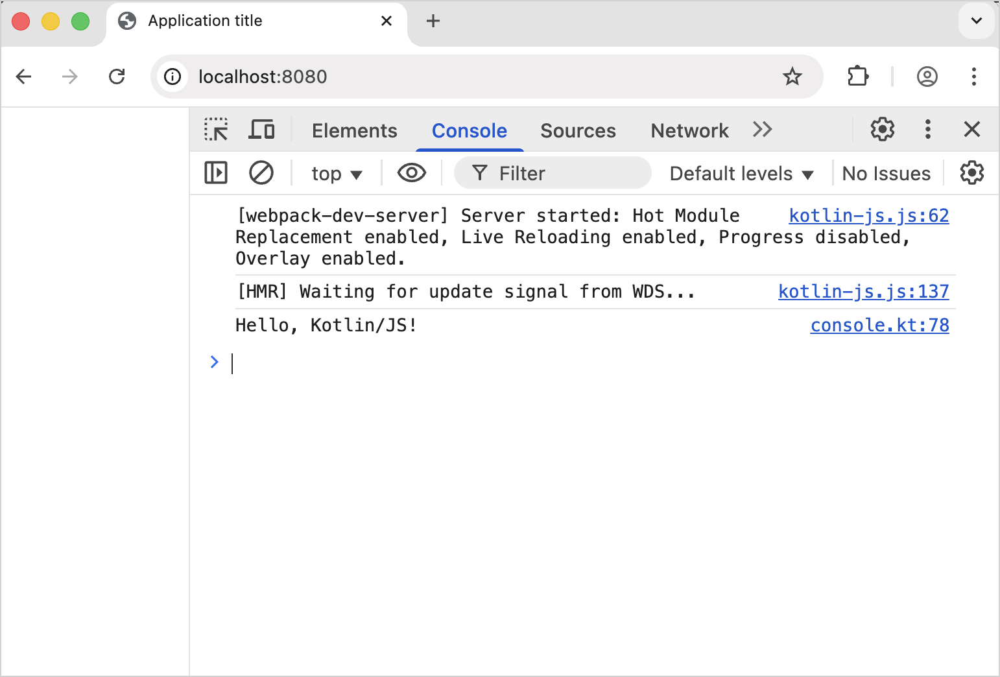

如果你使用的是 `nodejs` 环境，可以看到终端会打印 `"Hello, Kotlin/JS!"`。

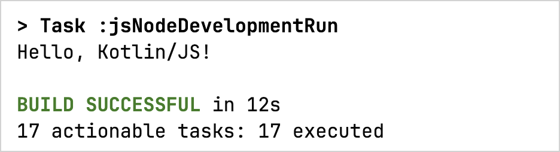

### 在 IDE 中打开项目 {#open-the-project-in-an-ide}

你可以在任何支持 Gradle 的 IDE 中打开项目。

如果你使用 IntelliJ IDEA：

1. 选择 **File** | **Open**。
2. 找到项目目录。
3. 点击 **Open**。

IntelliJ IDEA 会自动检测它是否是 Kotlin/JS 项目。如果项目遇到问题，IntelliJ IDEA 会在 **Build** 面板中显示错误信息。

## 接下来学什么？ {#what-s-next}

* [搭建你的 Kotlin/JS 项目](../6.2.2.3-JsProjectSetup/)。
* 学习如何[调试 Kotlin/JS 应用](../6.2.2.6-JsDebugging/)。
* 学习如何[用 Kotlin/JS 编写和运行测试](../6.2.2.7-JsRunningTests/)。
* 学习如何[为真实的 Kotlin/JS 项目编写 Gradle 构建脚本](https://kotlinlang.org/docs/multiplatform/multiplatform-dsl-reference.html)。
* 进一步了解 [Gradle 构建系统](../../../../buildtools/11.1-Gradle/11.1.1-Gradle/)。
