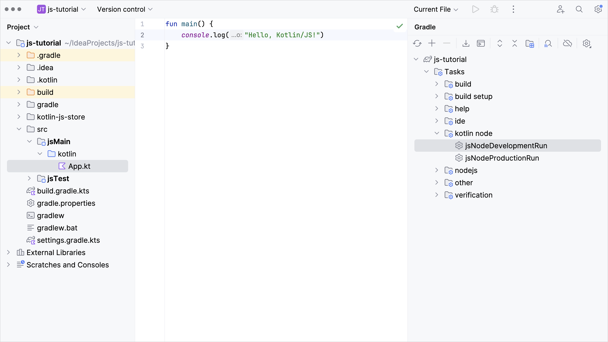
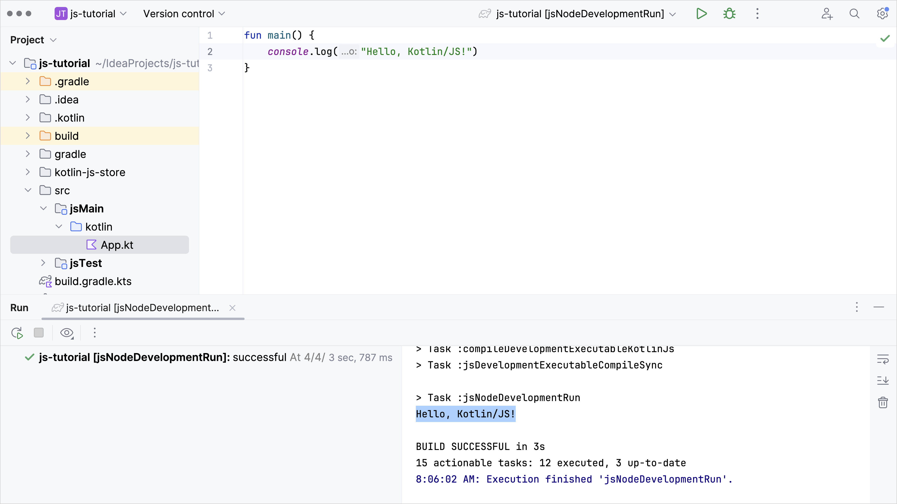
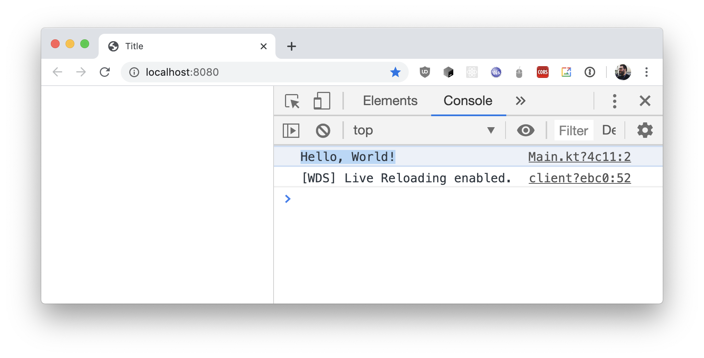

+++
title = "6.2.2.4 运行 Kotlin/JS"
date = 2026-09-13T08:50:47+08:00
weight = 4
type = "docs"
description = ""
isCJKLanguage = true
draft = false
+++


> 原文链接: [https://kotlinlang.org/docs/running-kotlin-js.html](https://kotlinlang.org/docs/running-kotlin-js.html)

# 6.2.2.4 运行 Kotlin/JS

由于 Kotlin/JS 项目由 Kotlin Multiplatform Gradle 插件管理，你可以使用相应的任务来运行项目。如果你从空白项目开始，请确保有一些可执行的示例代码。创建 `src/jsMain/kotlin/App.kt` 文件，并填入一小段 "Hello, World" 风格的代码：

```kotlin
fun main() {
    console.log("Hello, Kotlin/JS!")
}
```

根据目标平台的不同，首次运行代码时可能还需要一些平台特定的额外配置。

## 运行 Node.js 目标 {#run-the-node-js-target}

用 Kotlin/JS 面向 Node.js 时，你只需执行 `jsNodeDevelopmentRun` Gradle 任务即可。例如，可以通过命令行使用 Gradle wrapper 来完成：

```bash
./gradlew jsNodeDevelopmentRun
```

如果你使用 IntelliJ IDEA，可以在 Gradle 工具窗口中找到 `jsNodeDevelopmentRun` 操作：



首次启动时，`kotlin.multiplatform` Gradle 插件会下载所有必需的依赖，以让你能够运行。构建完成后，程序会被执行，你可以在终端中看到日志输出：



## 运行浏览器目标 {#run-the-browser-target}

面向浏览器时，你的项目需要一个 HTML 页面。在开发应用期间，该页面会由开发服务器提供，并且应当嵌入编译后的 Kotlin/JS 文件。创建并填写 HTML 文件 `/src/jsMain/resources/index.html`：

```html
<!DOCTYPE html>
<html lang="en">
<head>
    <meta charset="UTF-8">
    <title>JS Client</title>
</head>
<body>
<script src="js-tutorial.js"></script>
</body>
</html>
```

默认情况下，项目生成的构件名（由 webpack 创建）就是你的项目名（在本例中是 `js-tutorial`），需要引用它。如果你把项目命名为 `followAlong`，请确保嵌入的是 `followAlong.js` 而不是 `js-tutorial.js`

完成这些调整后，启动集成的开发服务器。你可以在命令行中通过 Gradle wrapper 来完成：

```bash
./gradlew jsBrowserDevelopmentRun
```

在 IntelliJ IDEA 中工作时，可以在 Gradle 工具窗口中找到 `jsBrowserDevelopmentRun` 操作。

项目构建完成后，内置的 `webpack-dev-server` 会开始运行，并打开一个（看起来是空白的）浏览器窗口，指向你之前指定的 HTML 文件。要验证程序是否正常运行，请打开浏览器的开发者工具（例如右键单击并选择 _Inspect_ 操作）。在开发者工具中进入控制台，即可看到所执行的 JavaScript 代码的结果：



使用这套配置，你可以在每次修改代码后重新编译项目来查看更改。Kotlin/JS 还支持在开发过程中自动重建应用这种更便捷的方式。要了解如何设置这种*持续模式*，请查看[相应的教程](../6.2.2.5-DevServerContinuousCompilation/)。
