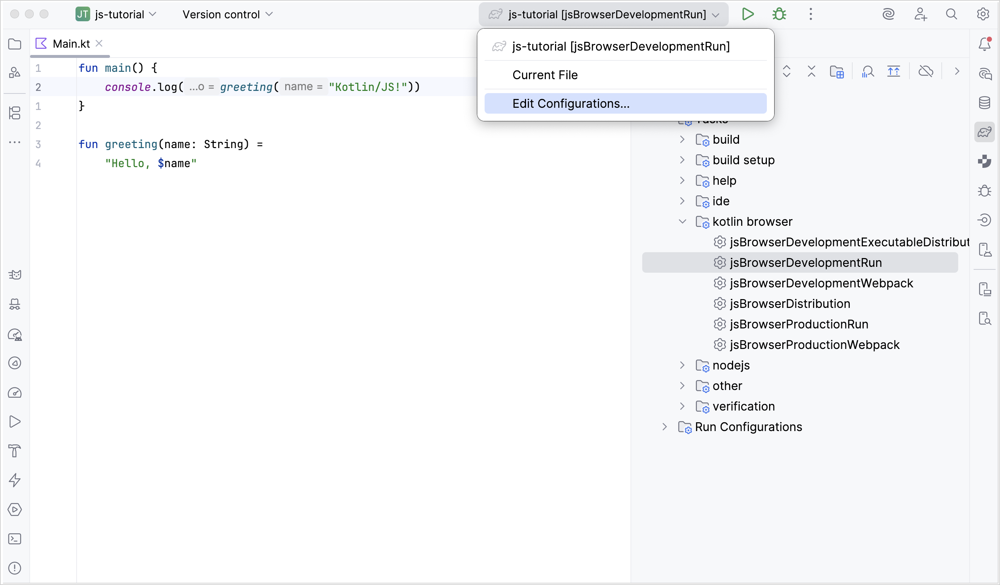
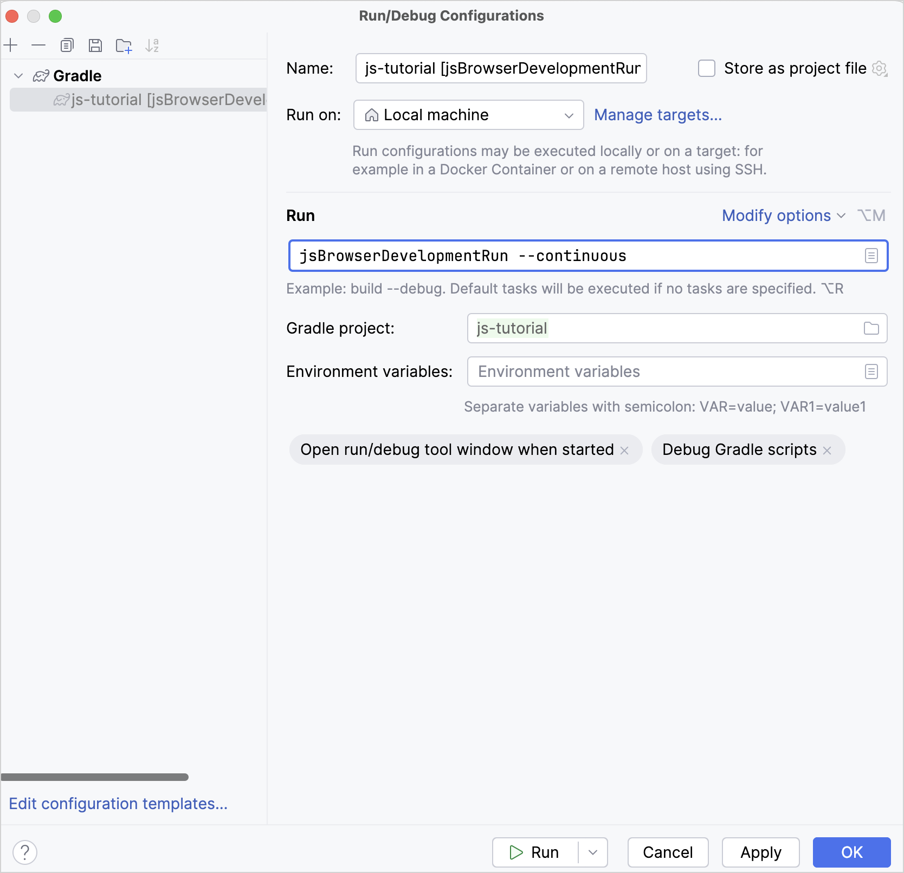
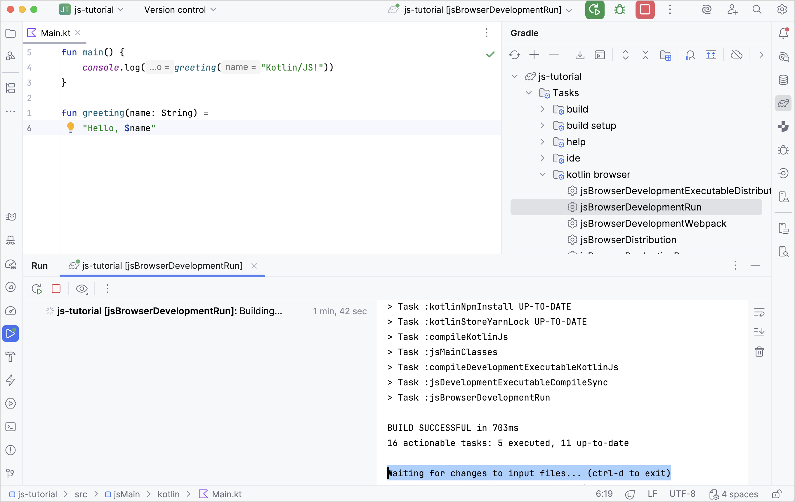

+++
title = "6.2.2.5 开发服务器与持续编译"
date = 2026-09-13T08:50:47+08:00
weight = 5
type = "docs"
description = ""
isCJKLanguage = true
draft = false
+++


> 原文链接: [https://kotlinlang.org/docs/dev-server-continuous-compilation.html](https://kotlinlang.org/docs/dev-server-continuous-compilation.html)

# 6.2.2.5 开发服务器与持续编译

如果你想看到所做的更改，不必每次都手动编译并运行 Kotlin/JS 项目，可以使用*持续编译*模式。不要使用常规的 `jsBrowserDevelopmentRun`（针对 `browser`）和 `jsNodeDevelopmentRun`（针对 `nodejs`）命令，而是以持续模式调用 Gradle wrapper：

```bash
 # For `browser` project
./gradlew jsBrowserDevelopmentRun --continuous

 # For `nodejs` project
./gradlew jsNodeDevelopmentRun --continuous
```

如果你在 IntelliJ IDEA 中工作，可以通过运行配置列表传入同样的标志。第一次从 IDE 运行 `jsBrowserDevelopmentRun` Gradle 任务后，IntelliJ IDEA 会自动为它生成一个运行配置，你可以在顶部工具栏中编辑该配置：



在 **Run/Debug Configurations** 对话框中，向运行配置的参数添加 `--continuous` 标志即可启用持续模式：



执行这个运行配置时，你可以注意到 Gradle 进程会持续监视程序的变化：



一旦检测到变化，程序就会自动重新编译。如果你的浏览器中仍打开着该网页，开发服务器会触发页面自动重新加载，更改随即可见。这要归功于由 [Kotlin Multiplatform Gradle 插件](https://kotlinlang.org/docs/multiplatform/multiplatform-dsl-reference.html)管理的、集成的 [`webpack-dev-server`](https://webpack.js.org/configuration/dev-server/)。
