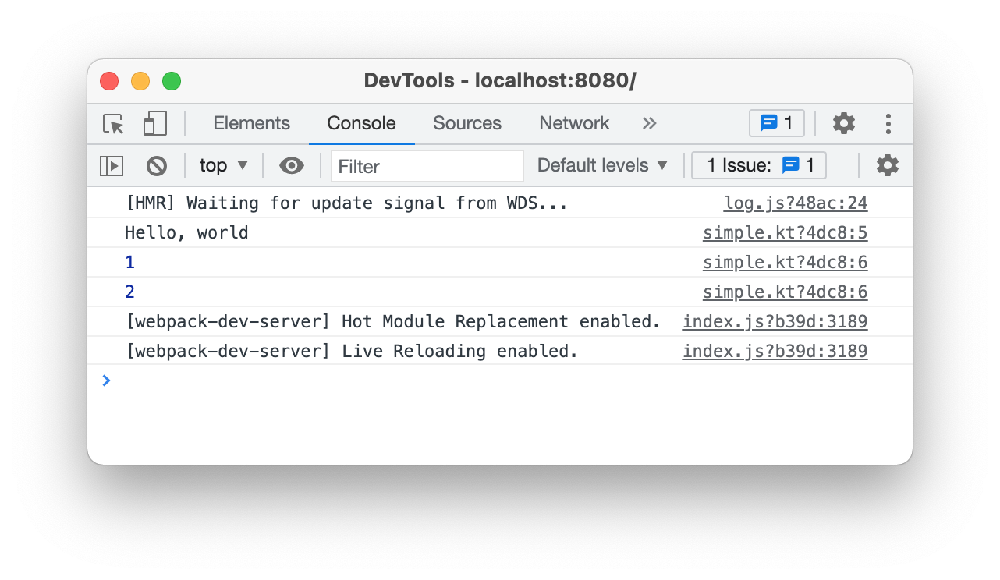
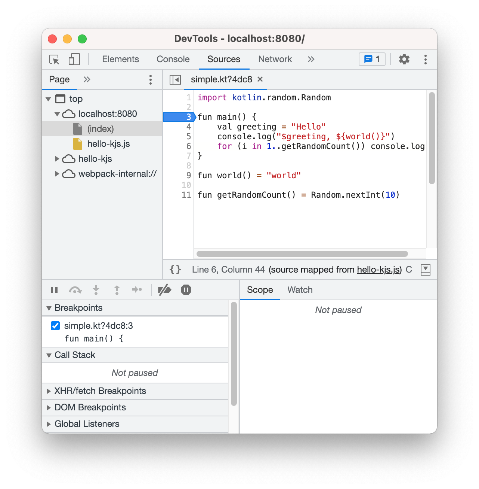
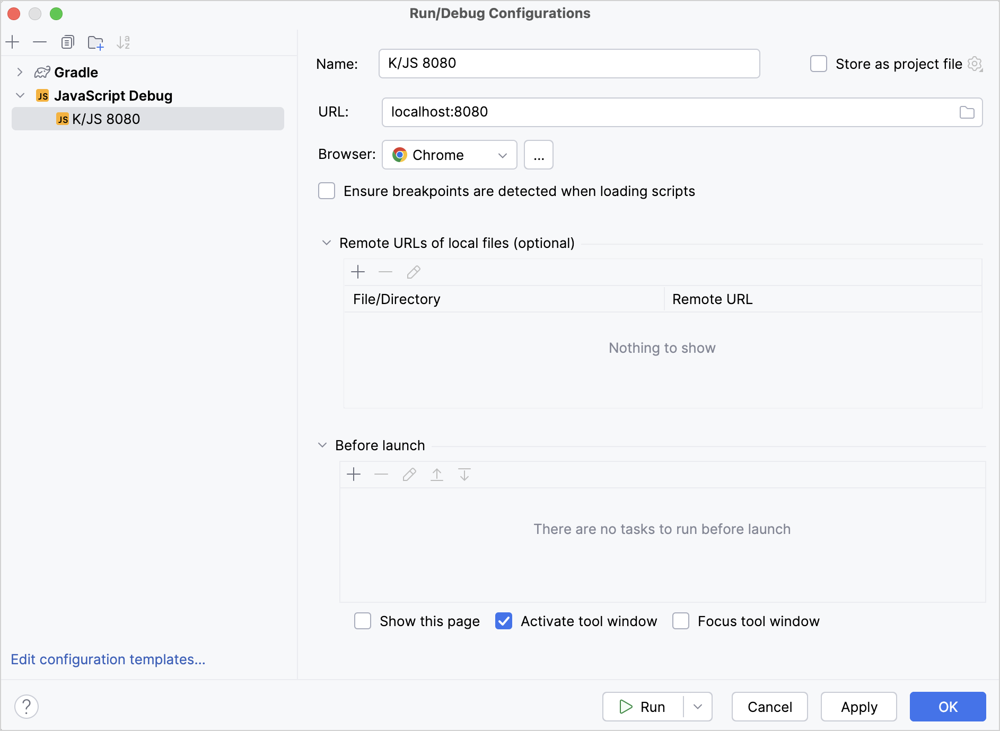
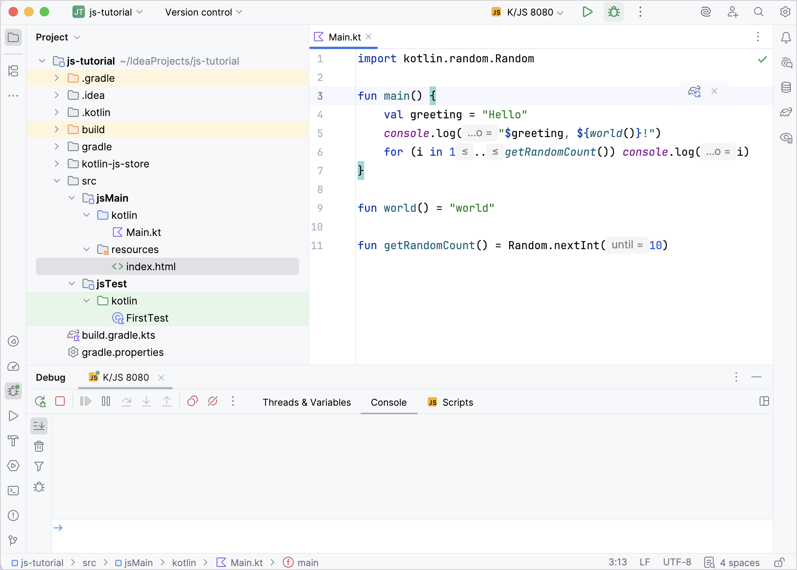
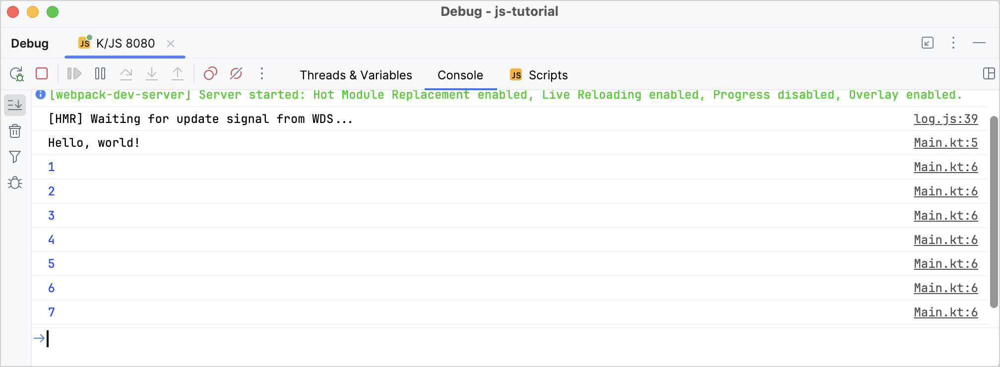

+++
title = "6.2.2.6 调试 Kotlin/JS 代码"
date = 2026-09-13T08:50:47+08:00
weight = 6
type = "docs"
description = ""
isCJKLanguage = true
draft = false
+++

> 原文链接: [https://kotlinlang.org/docs/js-debugging.html](https://kotlinlang.org/docs/js-debugging.html)

# 6.2.2.6 调试 Kotlin/JS 代码

JavaScript source map 在打包器或压缩器生成的最小化代码与开发者实际编写的源代码之间建立映射。通过这种方式，source map 支持在代码执行期间对其进行调试。

Kotlin Multiplatform Gradle 插件会为项目构建自动生成 source map，因此无需任何额外配置即可使用。

## 在浏览器中调试 {#debug-in-browser}

大多数现代浏览器都提供了查看页面内容并调试其中执行代码的工具。更多细节请参阅你所使用浏览器的文档。

要在浏览器中调试 Kotlin/JS：

1. 通过调用可用的 _run_ Gradle 任务之一来运行项目，例如 `jsBrowserDevelopmentRun`。进一步了解[运行 Kotlin/JS](../6.2.2.4-RunningKotlinJs/#run-the-browser-target)。
2. 在浏览器中打开该页面并启动其开发者工具（例如右键单击并选择 **Inspect** 操作）。了解如何在常用浏览器中[找到开发者工具](https://balsamiq.com/support/faqs/browserconsole/)。
3. 如果你的程序向控制台输出信息，请进入 **Console** 标签页查看这些输出。根据浏览器的不同，这些日志可能会引用它们来自的 Kotlin 源文件和行号：

4. 点击右侧的文件引用即可跳转到对应的代码行。或者，你也可以手动切换到 **Sources** 标签页，在文件树中找到需要的文件。跳转到 Kotlin 文件时，你会看到普通的 Kotlin 代码（而不是最小化后的 JavaScript）：

现在你可以开始调试程序了。点击某个行号即可设置断点。开发者工具甚至支持在语句内部设置断点。与普通 JavaScript 代码一样，已设置的断点会在页面重新加载后保留。这也使得调试脚本首次加载时执行的 Kotlin `main()` 方法成为可能。

## 在 IDE 中调试 {#debug-in-the-ide}

带有 Ultimate 订阅的 [IntelliJ IDEA](https://www.jetbrains.com/idea/) 提供了一套强大的开发期代码调试工具。

要在 IntelliJ IDEA 中调试 Kotlin/JS，你需要一个 **JavaScript Debug** 配置。要添加这样的调试配置：

1. 进入 **Run | Edit Configurations**。
2. 点击 **+** 并选择 **JavaScript Debug**。
3. 指定该配置的 **Name**，并提供项目运行所在的 **URL**（默认为 `http://localhost:8080`）。

4. 保存该配置。

进一步了解[设置 JavaScript 调试配置](https://www.jetbrains.com/help/idea/configuring-javascript-debugger.html)。

现在你可以开始调试项目了！

1. 通过调用可用的 _run_ Gradle 任务之一来运行项目，例如 `jsBrowserDevelopmentRun`。进一步了解[运行 Kotlin/JS](../6.2.2.4-RunningKotlinJs/#run-the-browser-target)。
2. 通过运行你之前创建的 JavaScript 调试配置来启动调试会话：

3. 你可以在 IntelliJ IDEA 的 **Debug** 窗口中看到程序的控制台输出。输出项会引用它们来自的 Kotlin 源文件和行号：

4. 点击右侧的文件引用即可跳转到对应的代码行。

现在你可以使用 IDE 提供的整套工具来调试程序：断点、单步执行、表达式求值等等。进一步了解[在 IntelliJ IDEA 中调试](https://www.jetbrains.com/help/idea/debugging-javascript-in-chrome.html)。

> **注意：** 由于 IntelliJ IDEA 中当前 JavaScript 调试器的限制，你可能需要重新运行 JavaScript 调试，执行才会在断点处停下。

## 在 Node.js 中调试 {#debug-in-node-js}

如果你的项目面向 Node.js，你可以在该运行时中调试它。

要调试面向 Node.js 的 Kotlin/JS 应用：

1. 通过运行 `build` Gradle 任务构建项目。
2. 在项目目录下的 `build/js/packages/your-module/kotlin/` 目录中找到面向 Node.js 的 `.js` 结果文件。
3. 按 [Node.js 调试指南](https://nodejs.org/en/docs/guides/debugging-getting-started/#jetbrains-webstorm-2017-1-and-other-jetbrains-ides)中的说明在 Node.js 中调试它。

## 接下来学什么？ {#what-s-next}

现在你已经知道如何为 Kotlin/JS 项目启动调试会话，接下来学习如何高效使用调试工具：

* 学习如何[在 Google Chrome 中调试 JavaScript](https://developer.chrome.com/docs/devtools/javascript/)
* 熟悉 [IntelliJ IDEA JavaScript 调试器](https://www.jetbrains.com/help/idea/debugging-javascript-in-chrome.html)
* 学习如何[在 Node.js 中调试](https://nodejs.org/en/docs/guides/debugging-getting-started/)。

## 如果遇到问题 {#if-you-run-into-any-problems}

如果你在调试 Kotlin/JS 时遇到任何问题，请向我们的问题跟踪器 [YouTrack](https://kotl.in/issue) 报告。
