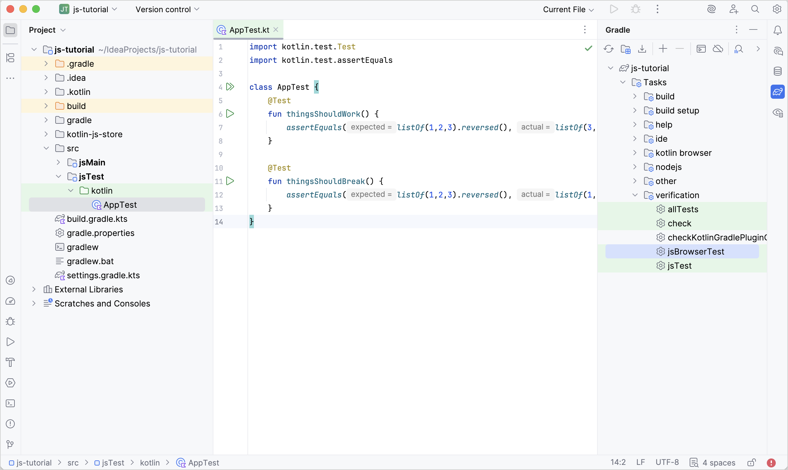
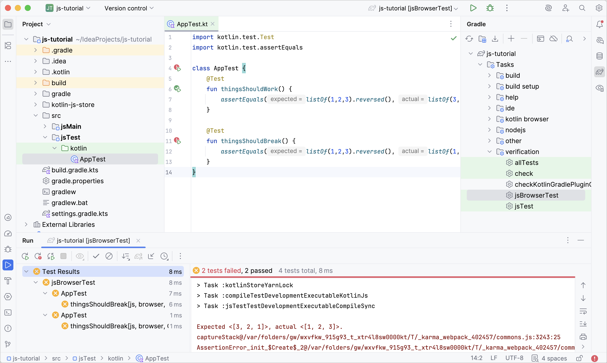
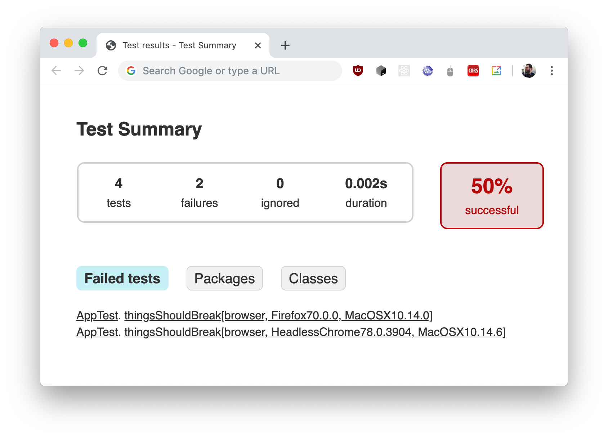
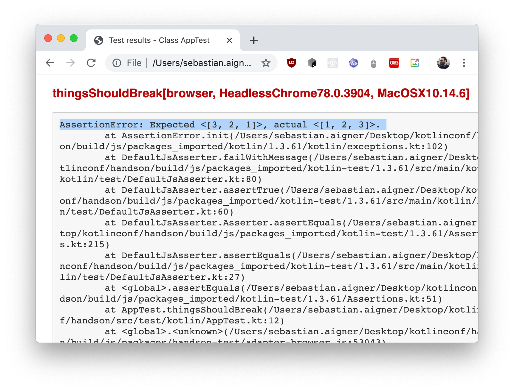

+++
title = "6.2.2.7 在 Kotlin/JS 中运行测试"
date = 2026-09-13T08:50:47+08:00
weight = 7
type = "docs"
description = ""
isCJKLanguage = true
draft = false
+++


> 原文链接: [https://kotlinlang.org/docs/js-running-tests.html](https://kotlinlang.org/docs/js-running-tests.html)

# 6.2.2.7 在 Kotlin/JS 中运行测试

Kotlin Multiplatform Gradle 插件让你可以通过多种测试运行器来运行测试，这些运行器可以通过 Gradle 配置来指定。

在 Kotlin/JS 中运行测试的一般流程是：添加测试依赖、在构建文件中配置测试任务、添加测试，然后运行它们。

对于浏览器测试，你可以在以下两者之间选择：

* [Karma](https://karma-runner.github.io/) 测试运行器。
* 用于浏览器测试的新 DSL。

> **警告：** Karma 项目已被[弃用](https://github.com/karma-runner/karma#karma)。预计不会再有新特性或缺陷修复。作为替代，请尝试用于浏览器测试的新 Kotlin DSL。用于浏览器测试的新 DSL 目前处于[实验性](../../../../kotlinevolutionandroadmap/13.4-ComponentsStability/#stability-levels-explained)阶段，随时可能发生变化。需要使用 `@OptIn(ExperimentalJsTestDsl::class)` 注解选择启用。

## 添加测试依赖 {#add-test-dependencies}

创建多平台项目时，你可以通过在 `commonTest` 中使用单个依赖，为所有源集（包括 JavaScript 目标）添加测试依赖：

**Kotlin**

```kotlin
// build.gradle.kts
kotlin {
    sourceSets {
        commonTest.dependencies {
            implementation(kotlin("test")) // 在 JS 中启用测试注解和功能
        }
    }
}
```

**Groovy**

```groovy
// build.gradle
kotlin {
    sourceSets {
        commonTest {
            dependencies {
                implementation kotlin("test") // 在 JS 中启用测试注解和功能
            }
        }
    }
}
```

## 配置浏览器 {#configure-browsers}

你可以针对特定浏览器运行 Kotlin/JS 测试。为此，请调整 Gradle 构建文件中 `browser {}` 配置块里的设置。

默认情况下，插件使用 [Headless Chrome](https://kotlinlang.org/docs/https://chromium.googlesource.com/chromium/src/+/lkgr/headless/README.html) 运行浏览器测试。Kotlin Multiplatform Gradle 插件默认不捆绑任何浏览器。要启用其他浏览器，请对 Karma 使用 `testTask {}` 块，对用于浏览器测试的新 DSL 使用 `test {}` 块。查看所有可用选项：

**Karma**

```kotlin
kotlin {
    js {
        browser {
            testTask {
                useKarma {
                    useIe()
                    useSafari()
                    useFirefox()
                    useChrome()
                    useChromeCanary()
                    useChromeHeadless()
                    usePhantomJS()
                    useOpera()
                }
            }
        }
    }
}
```

使用 Karma 时，你需要在目标系统（本地或 CI 中）安装所有必需的浏览器。

关于 Karma 功能的更多信息，请参阅[搭建 Kotlin/JS 项目](../6.2.2.3-JsProjectSetup/#karma)。

**用于浏览器测试的 DSL**

```kotlin
import org.jetbrains.kotlin.gradle.ExperimentalJsTestDsl

kotlin {
    js {
        browser {
            @OptIn(ExperimentalJsTestDsl::class)
            test {
                chromium()
                firefox()
                webkit() // Safari 浏览器
            }
        }
    }
}
```

使用用于浏览器测试的新 DSL 时，Kotlin Multiplatform Gradle 插件会在首次运行时通过 [`playwright install`](https://playwright.dev/docs/browsers#install-browsers) 命令安装所需的浏览器。随后 Playwright 会管理这些浏览器的位置，而不使用本地安装的浏览器。

关于用于浏览器测试的新 DSL 中提供的其他设置，请参阅[高级配置](#advanced-configuration)。

## 添加测试 {#add-a-test}

要检查测试是否被正确执行，请创建内容如下的 `src/jsTest/kotlin/AppTest.kt` 文件：

```kotlin
import kotlin.test.Test
import kotlin.test.assertEquals

@Test
fun thingsShouldWork() {
    assertEquals(listOf(3,2,1), listOf(1,2,3).reversed())
}

@Test
fun thingsShouldBreak() {
    assertEquals(listOf(1,2,3), listOf(1,2,3).reversed())
}
```

## 运行测试 {#run-tests}

要在浏览器中运行测试，请执行 `jsBrowserTest` 任务，或使用 IntelliJ IDEA 中的行号图标来执行全部测试或单个测试：



或者，如果你想在命令行中运行测试，请使用 Gradle wrapper：

```bash
./gradlew jsBrowserTest
```

在 IntelliJ IDEA 中运行测试后，**Run** 工具窗口会显示测试结果。你可以点击失败的测试查看其堆栈轨迹，双击它还可以跳转到对应的测试实现。



每次运行测试后，无论你以何种方式执行测试，都可以在 `build/reports/tests/jsBrowserTest/index.html` 中找到 Gradle 生成的格式良好的测试报告。在浏览器中打开该文件，可以看到测试结果的另一种概览：



如果你使用上面代码片段中所示的那组示例测试，会有一个测试通过、一个测试失败，成功率为 50%。要获取各个测试用例的更多信息，请使用提供的链接：



## 高级配置 {#advanced-configuration}
**实验性**

> **注意：** 本节仅适用于新的实验性浏览器测试 DSL。

新的浏览器测试 DSL 被设计为极简且与工具无关。当前实现包括：

* [Playwright](https://playwright.dev/) 充当浏览器驱动程序和分发管理器，支持 Chromium、Firefox 和 WebKit (Safari) 浏览器引擎。
* [Mocha](https://mochajs.org/) 充当测试运行器。
* [webpack](https://webpack.js.org/) 充当打包器（在[未来的版本](https://youtrack.jetbrains.com/issue/KT-48308/)中会被替换为 [Vite](https://vite.dev/)）。

该 DSL 把超时、无头模式和按运行器区分的选项作为 Gradle 属性暴露出来，因此你可以在各个运行器之间共享默认值、为特定浏览器覆盖它们，也可以用 provider 惰性计算值：

```kotlin
import org.jetbrains.kotlin.gradle.ExperimentalJsTestDsl
import kotlin.time.Duration.Companion.seconds

kotlin {
    js {
        browser {
            @OptIn(ExperimentalJsTestDsl::class)
            test {
                // 用 kotlin.Duration 配置所有运行器的默认超时
                timeout = 30.seconds

                // 使用 Gradle provider 配置无头模式
                headless = providers
                    .environmentVariable("IS_IN_CI")
                    .map { it.toBoolean() }
                    .orElse(false)

                // 启用并配置带自定义名称的 Chromium 运行器
                chromium("chromium-no-webgl2") {
                    // 为该运行器覆盖默认超时
                    timeout = 10.seconds

                    // Chromium 特有的额外启动参数
                    launchArgs.add("--disable-webgl2")
                }

                // 启用 Firefox 运行器
                firefox()

                // 启用并配置 WebKit 运行器
                webkit("safari") {
                    timeout = 35.seconds
                }
            }
        }
    }
}
```

你可以直接在 `test {}` 块中为所有测试运行器设置选项。要为某个特定运行器覆盖这些通用选项，请为它使用自定义名称，并在该运行器块中提供不同的值。在这个例子中，Chromium 和 WebKit (Safari) 浏览器分别使用 10 秒和 35 秒的超时，而 Firefox 使用 30 秒的通用超时。

每个运行器都以自己的名称注册，因此测试报告会告诉你某个结果来自哪个浏览器。

## 面向插件作者的配置 {#configuration-for-plugin-authors}
**实验性**

> **注意：** 本节仅适用于新的实验性浏览器测试 DSL。

如果你在 Kotlin Multiplatform Gradle 插件之上编写 Gradle 插件，新的浏览器测试 DSL 也能让你访问浏览器运行器以及生成的测试包的位置。

Kotlin 使用默认的[测试运行器页面](https://github.com/Kotlin/kotlin-web-helpers/blob/main/static/test.html)生成用于运行浏览器测试的测试包。你可以通过在 `testsLocation` 属性中指向其他位置来替换它：

```kotlin
kotlin {
    js {
        browser {
            @OptIn(ExperimentalJsTestDsl::class)
            test {
                // 实现 customJsTestsLocation 以修改或替换默认的 JS 测试包
                @OptIn(DelicateKotlinGradlePluginApi::class)
                testsLocation = customJsTestsLocation(extendFrom = defaultTestsLocationProvider)

                chromium()
            }
        }
    }
}
```

你的自定义测试打包器可以包含自己的开发服务器、打包器或测试运行器。`defaultTestsLocationProvider` 属性让你可以访问默认位置，因此你可以在其之上构建，而不必从零实现一切。

每个测试位置都通过 `KotlinJsTestsLocation` 接口暴露包含生成测试包的目录（`bundleLocation`）、测试页面的名称（`testHtmlFileName`），以及浏览器打开的 URL（`url`）。

有了对这些 API 的访问权限，你可以：

* 自定义浏览器打开的 URL。每个浏览器运行器都有自己的测试位置，因此你既可以在 `test {}` 块中为所有运行器覆盖它，也可以只为某个特定运行器覆盖。
* 覆盖包位置本身，例如向包中添加额外文件。
* 对生成的测试包进行后处理。注册自己的任务并在浏览器打开这些文件之前修改它们，例如把自己的配置注入 `test.html`。

在使用这些 API 构建插件时，请注意以下限制：

* 配置 `subtarget.test` 会启用新的测试流水线并禁用 Karma。目前没有可靠的方法检测用户选择了哪条流水线。
* 目前没有可靠的方法惰性配置某个特定的浏览器运行器，因此配置必须发生在 `afterEvaluate` 中。可以考虑让用户显式设置测试位置，或暴露诸如 `myPluginChromium()` 这样的装饰函数。

## 提供反馈 {#leave-feedback}

新的浏览器测试 DSL 正在积极开发中。新特性（例如调试）已列入接下来的 Kotlin 版本计划。

我们非常欢迎你在 [YouTrack](https://youtrack.jetbrains.com/issue/KT-66897) 或 [#javascript](https://kotlinlang.slack.com/archives/C0B8L3U69) Slack 频道中提供反馈。
