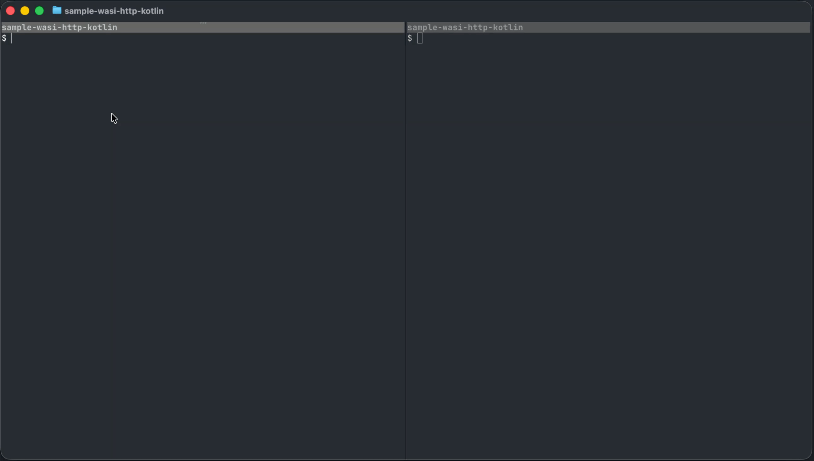
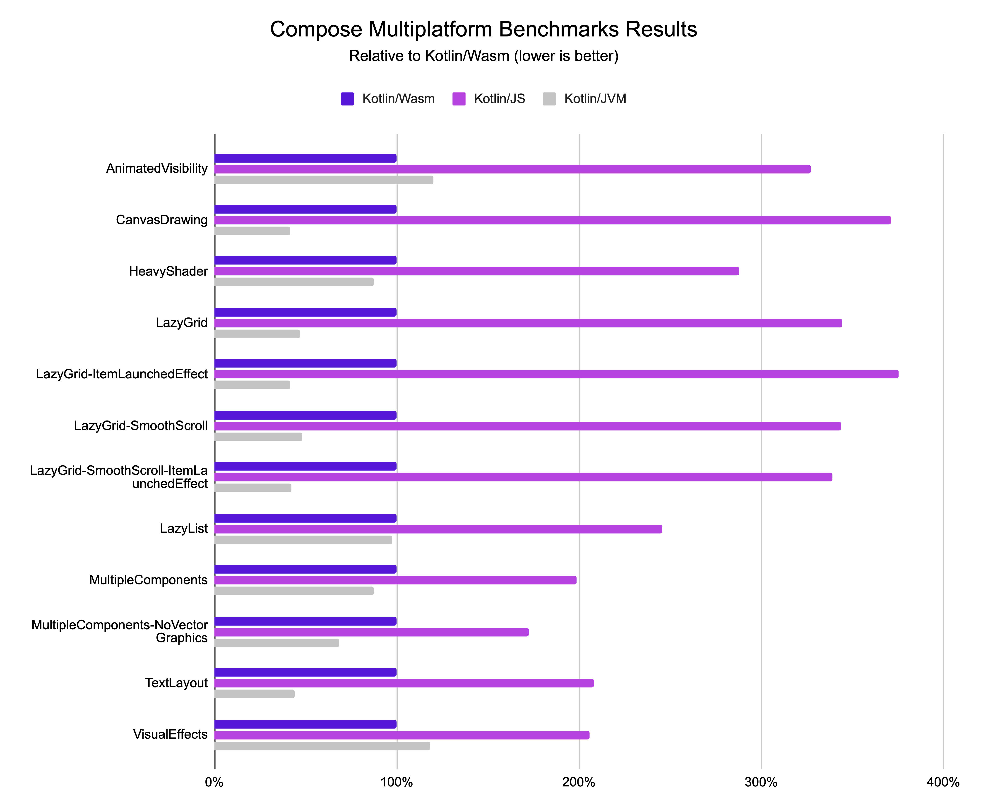

+++
title = "6.2.3.1 Kotlin/Wasm"
date = 2026-09-13T08:50:47+08:00
weight = 1
type = "docs"
description = ""
isCJKLanguage = true
draft = false
+++

> 原文链接: [https://kotlinlang.org/docs/wasm-overview.html](https://kotlinlang.org/docs/wasm-overview.html)

# 6.2.3.1 Kotlin/Wasm

**Beta**

Kotlin/Wasm 能够把你的 Kotlin 代码编译为 [WebAssembly (Wasm)](https://webassembly.org/) 格式。使用 Kotlin/Wasm，你可以创建能在支持 Wasm 并满足 Kotlin 要求的不同环境和设备上运行的应用。

Wasm 是一种面向基于栈的虚拟机的二进制指令格式。由于它运行在自己的虚拟机上，这种格式与平台无关。Wasm 为 Kotlin 及其他语言提供了一个编译目标。

你可以在不同的目标环境中使用 Kotlin/Wasm，例如在浏览器中开发用 [Compose Multiplatform](https://www.jetbrains.com/lp/compose-multiplatform/) 构建的 Web 应用，或在浏览器之外的独立 Wasm 虚拟机中运行。在浏览器之外的情况下，[WebAssembly 系统接口 (WASI)](https://wasi.dev/) 提供了对平台 API 的访问，你也可以加以利用。

> **提示：** 要在浏览器中运行用 Kotlin/Wasm 构建的应用，用户需要支持 WebAssembly 垃圾回收和旧式异常处理提案的[浏览器版本](../6.2.3.6-WasmConfiguration/#browser-versions)。要查看浏览器支持情况，请参阅 [WebAssembly 路线图](https://webassembly.org/roadmap/)。

[//]: # (TODO KT-85415: 关于与 Kotlin/Wasm 兼容的独立运行时，请参阅独立运行时。)

## Kotlin/Wasm 与 Compose Multiplatform {#kotlin-wasm-and-compose-multiplatform}

使用 Kotlin，你可以通过 Compose Multiplatform 和 Kotlin/Wasm 构建应用，并在 Web 项目中复用移动端和桌面端的用户界面（UI）。

[Compose Multiplatform](https://www.jetbrains.com/lp/compose-multiplatform/) 是一个基于 Kotlin 和 [Jetpack Compose](https://developer.android.com/jetpack/compose) 的声明式框架，让你只实现一次 UI，就能在所有目标平台之间共享。

对于 Web 平台，Compose Multiplatform 使用 Kotlin/Wasm 作为其编译目标。用 Kotlin/Wasm 和 Compose Multiplatform 构建的应用使用 `wasm-js` 目标，并在浏览器中运行。

此外，你可以在 Kotlin/Wasm 中开箱即用地使用最流行的 Kotlin 库。与其他 Kotlin 和多平台项目一样，你可以在构建脚本中加入依赖声明。更多信息请参阅[添加多平台库依赖](https://kotlinlang.org/docs/multiplatform/multiplatform-add-dependencies.html)。

想亲自试试吗？

[Kotlin/Wasm 入门](../6.2.3.2-WasmGetStarted/)

## Kotlin/Wasm 与 WASI {#kotlin-wasm-and-wasi}

Kotlin/Wasm 在后端应用中使用 [WebAssembly 系统接口 (WASI)](https://wasi.dev/)。用 Kotlin/Wasm 和 WASI 构建的应用使用 Wasm-WASI 目标，让你可以调用 WASI API 并在浏览器环境之外运行应用。

Kotlin/Wasm 借助 WASI 抽象掉平台特定的细节，让同一份 Kotlin 代码可以在多种平台上运行。这扩展了 Kotlin/Wasm 在 Web 应用之外的应用范围，而无需为每个运行时做专门处理。

WASI 提供了一个安全、标准化的接口，用于在不同环境中运行编译为 WebAssembly 的 Kotlin 应用。

> **提示：** 想看看 Kotlin/Wasm 与 WASI 的实际效果，请查看[Kotlin/Wasm 与 WASI 入门教程](../6.2.3.3-WasmWasi/)。

### WebAssembly 组件模型 {#webassembly-component-model}
**实验性-通用**

WASI 0.2 构建在 [WebAssembly 组件模型](https://github.com/WebAssembly/component-model)之上，后者定义了用标准化接口和类型从 Wasm 模块构建组件的方式。该模型让你可以在应用或库中定义与语言无关的组件，也可以把 Wasm 模块和已有组件组合成新的组件。

想探索 WebAssembly 组件模型与 Kotlin/Wasm 的可能性，请看这个[用 `wasi:http` 构建的简单服务器](https://github.com/Kotlin/sample-wasi-http-kotlin/)演示。

## Kotlin/Wasm 的性能 {#kotlin-wasm-performance}

尽管 Kotlin/Wasm 仍处于 Beta 阶段，运行在 Kotlin/Wasm 上的 Compose Multiplatform 已经展现出令人鼓舞的性能特征。可以看到，它的执行速度优于 JavaScript，并正在接近 JVM：

我们会定期在 Kotlin/Wasm 上运行基准测试，这些结果来自我们在近期版本 Google Chrome 中的测试。

## 浏览器 API 支持 {#browser-api-support}

Kotlin/Wasm 标准库提供了浏览器 API 的声明，包括 DOM API。有了这些声明，你可以直接使用 Kotlin API 来访问和利用各种浏览器功能。例如，在 Kotlin/Wasm 应用中，你可以操作 DOM 元素或调用 fetch API，而无需从零定义这些声明。要了解更多，请参阅我们的 [Kotlin/Wasm 浏览器示例](https://github.com/Kotlin/kotlin-wasm-browser-template)。

浏览器 API 支持的声明是使用 JavaScript [互操作能力](../6.2.3.5-WasmJsInterop/)定义的。你可以用同样的能力定义自己的声明。此外，Kotlin/Wasm 与 JavaScript 的互操作还允许你在 JavaScript 中使用 Kotlin 代码。更多信息请参阅[在 JavaScript 中使用 Kotlin 代码](../6.2.3.5-WasmJsInterop/#use-kotlin-code-in-javascript)。

## 提供反馈 {#leave-feedback}

### Kotlin/Wasm 反馈 {#kotlin-wasm-feedback}

*  Slack：[获取 Slack 邀请](https://surveys.jetbrains.com/s3/kotlin-slack-sign-up)，并在我们的 [#webassembly](https://kotlinlang.slack.com/archives/CDFP59223) 频道中直接向开发者提供反馈。
* 在 [YouTrack](https://youtrack.jetbrains.com/issue/KT-56492) 中报告任何问题。

### Compose Multiplatform 反馈 {#compose-multiplatform-feedback}

*  Slack：在 [#compose-web](https://slack-chats.kotlinlang.org/c/compose-web) 公共频道中提供反馈。
* [在 GitHub 中报告任何问题](https://github.com/JetBrains/compose-multiplatform/issues)。

## 进一步了解 {#learn-more}

* 在这个 [YouTube 播放列表](https://kotl.in/wasm-pl)中进一步了解 Kotlin/Wasm。
* 在我们的 GitHub 仓库中探索 [Kotlin/Wasm 示例](https://github.com/Kotlin/kotlin-wasm-examples)。
