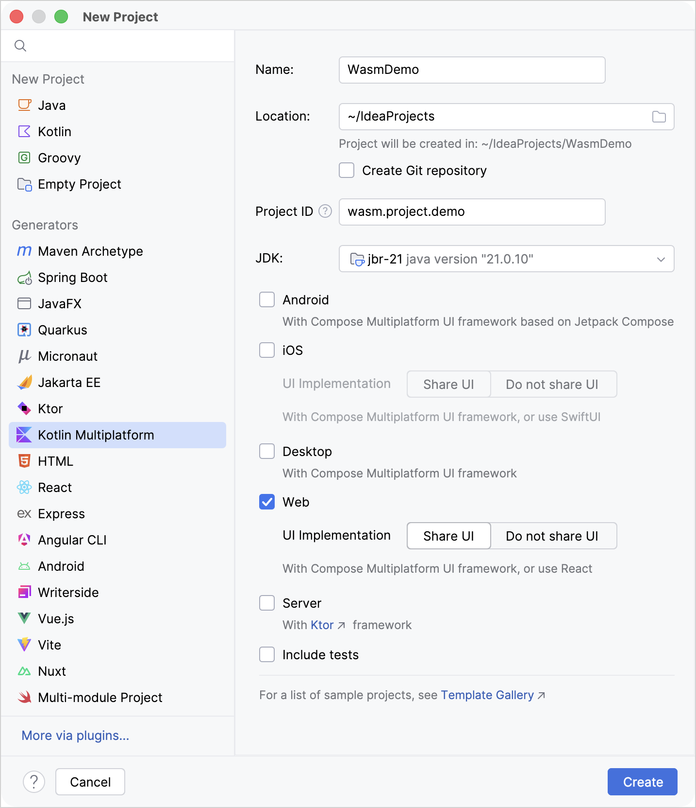
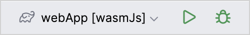
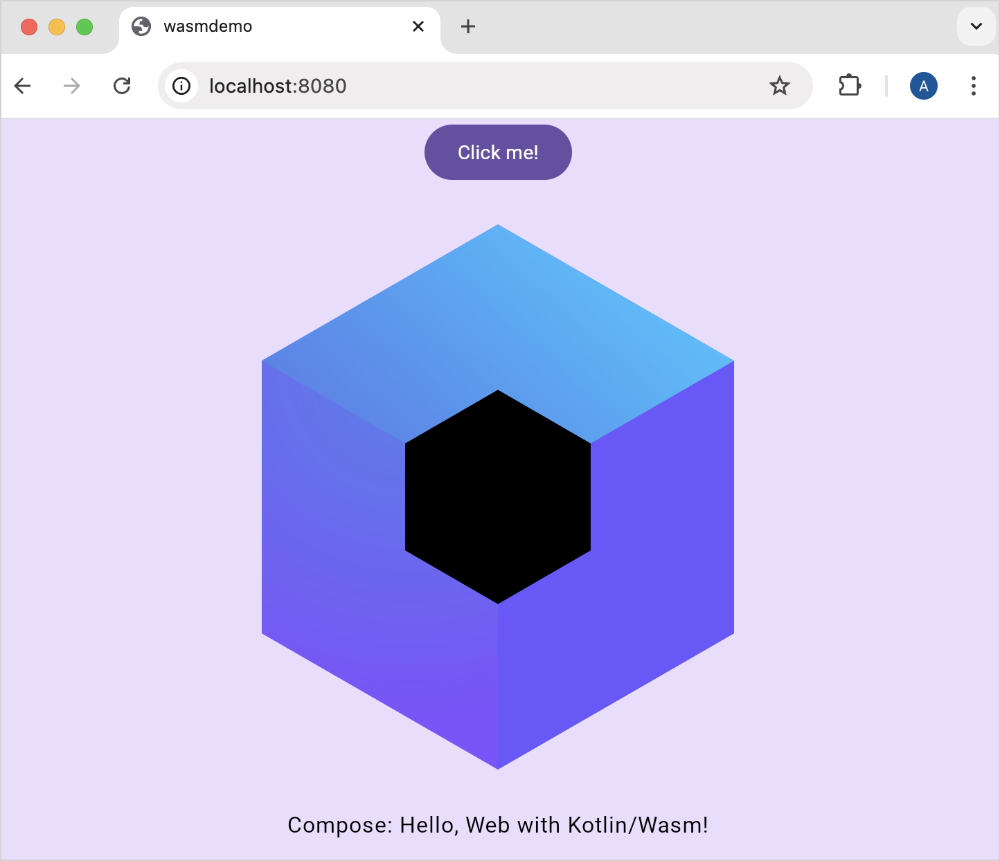
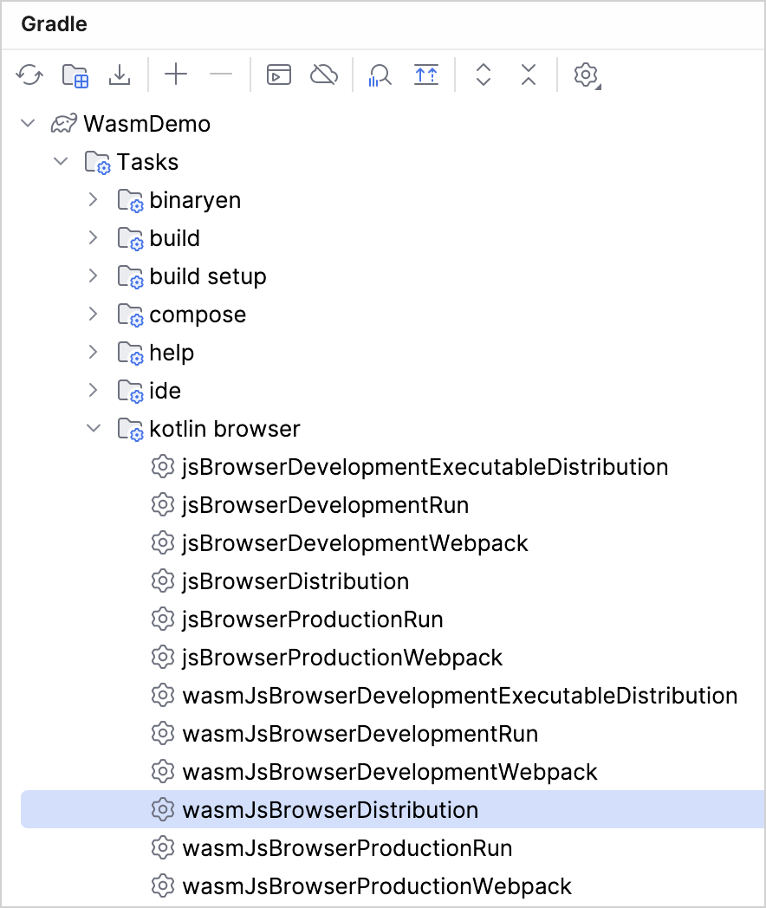
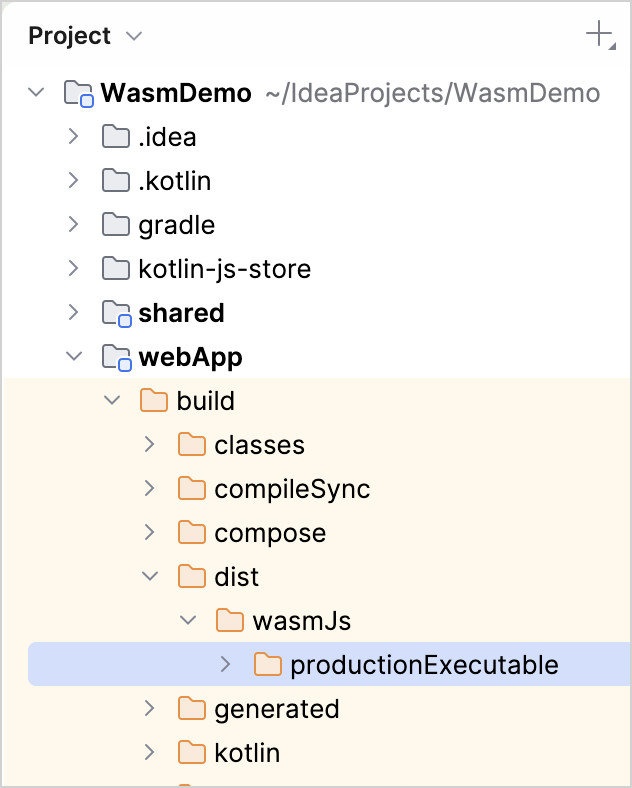
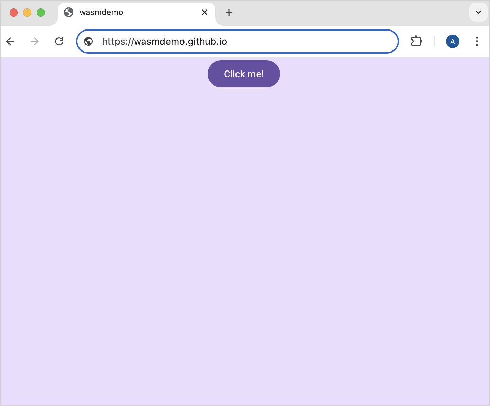

+++
title = "6.2.3.2 Kotlin/Wasm 与 Compose Multiplatform 入门"
date = 2026-09-13T08:50:47+08:00
weight = 2
type = "docs"
description = ""
isCJKLanguage = true
draft = false
+++


> 原文链接: [https://kotlinlang.org/docs/wasm-get-started.html](https://kotlinlang.org/docs/wasm-get-started.html)

# 6.2.3.2 Kotlin/Wasm 与 Compose Multiplatform 入门

**Beta**

本教程演示如何在 IntelliJ IDEA 中运行基于 [Compose Multiplatform](https://www.jetbrains.com/lp/compose-multiplatform/) 和 [](../6.2.3.1-WasmOverview/) 的应用，并生成可作为网站发布的构件。

## 创建项目 {#create-a-project}

1. [为 Kotlin Multiplatform 开发搭建环境](https://kotlinlang.org/docs/multiplatform/quickstart.html#set-up-the-environment)。
2. 在 IntelliJ IDEA 中，选择 **File | New | Project**。
3. 在项目模板列表中选择 **Kotlin Multiplatform**。

> **提示：** 如果你没有使用 Kotlin Multiplatform IDE 插件，可以用 [KMP Web 向导](https://kmp.jetbrains.com/?web=true&webui=compose&includeTests=true)生成同样的项目。

4. 在 **New Project** 窗口中指定以下字段：

* **Name：** WasmDemo
* **Project ID：** wasm.project.demo

> **注意：** 为保持一致，本教程使用 `wasm.project.demo` 作为 Project ID。不过我们建议沿用你常用的 group ID，例如 `org.example`。你在这里输入的内容会被作为未来项目的默认值推荐。

5. 选择 **Web** 目标和 **Share UI** 标签页。确保没有选中其他选项。
6. 点击 **Create**。



## 运行应用 {#run-the-application}

1. 项目加载完成后，在运行配置列表中选择 **webApp [wasmJs]**，然后点击 **Run**。



Web 应用会自动在浏览器中打开。或者，构建完成后，你可以手动打开以下 URL：

```shell
       http: // http://localhost:8080/
```

如果端口 `8080` 已被占用，端口号可能会不同。你可以在 Gradle 构建的输出中找到实际端口号。

2. 点击 **Click me!** 按钮。这会显示 Compose Multiplatform 的徽标：



## 生成构件 {#generate-artifacts}

生成项目的构件以便在网站上发布：

1. 通过选择 **View** | **Tool Windows** | **Gradle** 打开 **Gradle** 工具窗口。
2. 在 **WasmDemo** | **Tasks** | **kotlin browser** 中选择并运行 **wasmJsBrowserDistribution** 任务。

> **注意：** 你需要至少 Java 11 作为 Gradle JVM，任务才能成功加载。对于一般的 Compose Multiplatform 项目，我们建议使用 Java 17 或更高版本。



或者，你可以在 `WasmDemo` 根目录下于终端中运行以下命令：

```bash
    ./gradlew wasmJsBrowserDistribution
```

任务完成后，你可以在 `webApp/build/dist/wasmJs/productionExecutable` 目录中找到生成的构件：



## 发布应用 {#publish-the-application}

使用生成的构件来部署你的 Kotlin/Wasm 应用。选择你偏好的发布方式并按照说明操作：

* [GitHub pages](https://docs.github.com/en/pages/getting-started-with-github-pages/creating-a-github-pages-site#creating-your-site)
* [Cloudflare](https://developers.cloudflare.com/workers/)
* [Apache HTTP Server](https://httpd.apache.org/docs/2.4/getting-started.html)

站点创建完成后，打开浏览器并访问你的平台页面域名。例如 GitHub pages：



恭喜！你已经发布了构件。

## 接下来学什么？ {#what-s-next}

* [了解如何使用 Compose Multiplatform 在 iOS 与 Android 之间共享 UI](https://kotlinlang.org/docs/multiplatform/compose-multiplatform-create-first-app.html)
* 尝试更多 Kotlin/Wasm 示例：

* [KotlinConf 应用](https://github.com/JetBrains/kotlinconf-app)
* [Compose 图片查看器](https://github.com/JetBrains/compose-multiplatform/tree/master/examples/imageviewer)
* [Node.js 示例](https://github.com/Kotlin/kotlin-wasm-nodejs-template)
* [WASI 示例](https://github.com/Kotlin/kotlin-wasm-wasi-template)
* [Compose 示例](https://github.com/Kotlin/kotlin-wasm-compose-template)

* 在 Kotlin Slack 中加入 Kotlin/Wasm 社区：

[加入 Kotlin/Wasm 社区](https://slack-chats.kotlinlang.org/c/webassembly)
