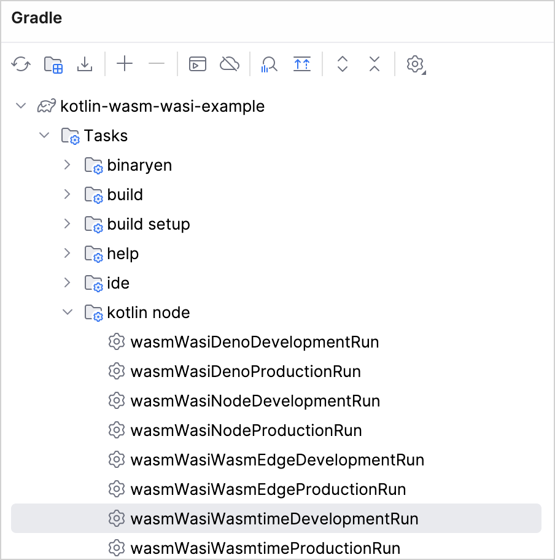
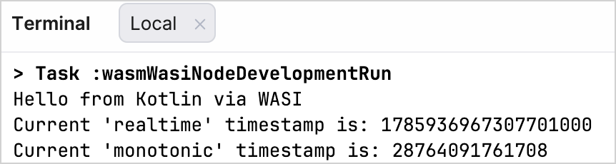
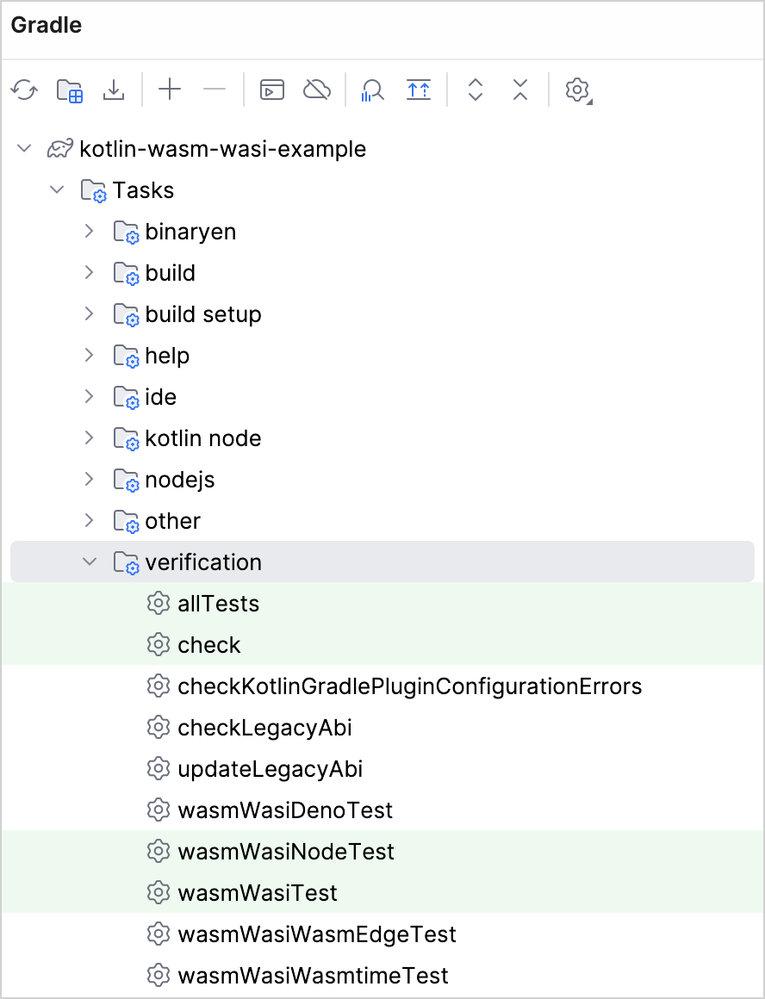

+++
title = "6.2.3.3 Kotlin/Wasm 与 WASI 入门"
date = 2026-09-13T08:50:47+08:00
weight = 3
type = "docs"
description = ""
isCJKLanguage = true
draft = false
+++


> 原文链接: [https://kotlinlang.org/docs/wasm-wasi.html](https://kotlinlang.org/docs/wasm-wasi.html)

# 6.2.3.3 Kotlin/Wasm 与 WASI 入门

**Beta**

本教程演示如何使用 [WebAssembly 系统接口 (WASI)](https://wasi.dev/) 在各种 WebAssembly 虚拟机中运行一个简单的 [Kotlin/Wasm](../6.2.3.1-WasmOverview/) 应用。

你可以找到应用在 [Node.js](https://nodejs.org/en)、[Wasmtime](https://docs.wasmtime.dev) [Deno](https://deno.com/) 和 [WasmEdge](https://wasmedge.org/) 虚拟机上运行的示例。输出是一个使用标准 WASI API 的简单应用。

目前，Kotlin/Wasm 支持 WASI 0.1，也称为 Preview 1。对 WASI 0.2 的支持计划在未来的版本中提供。[关注这个 YouTrack 问题以了解 WASI 0.2 支持的进展](https://youtrack.jetbrains.com/issue/KT-64568)。

[`wasmWasi`](../6.2.3.1-WasmOverview/#kotlin-wasm-and-wasi) 目标[默认使用新的异常处理提案](../6.2.3.6-WasmConfiguration/#exception-handling-proposal)，从而确保与现代 WebAssembly 运行时更好地兼容。

> **提示：** Kotlin/Wasm 工具链开箱即用地提供了 Node.js 任务（`wasmWasiNode*`）和 Wasmtime 任务（`wasmWasiWasmtime*`）。项目中的其他任务变体（例如使用 Deno 或 WasmEdge 的任务）是以自定义任务的形式提供的。

## 开始之前 {#before-you-start}

1. 下载并安装最新版本的 [IntelliJ IDEA](https://www.jetbrains.com/idea/)。

2. 在 IntelliJ IDEA 中选择
**File | New | Project from Version Control**，克隆 [Kotlin/Wasm WASI 模板仓库](https://github.com/Kotlin/kotlin-wasm-wasi-template)。

你也可以从命令行克隆它：

```bash
   git clone git@github.com:Kotlin/kotlin-wasm-wasi-template.git
```

## 运行应用 {#run-the-application}

1. 通过选择 **View** | **Tool Windows** | **Gradle** 打开 **Gradle** 工具窗口。

项目加载后，你可以在 **Gradle** 工具窗口中的 **kotlin-wasm-wasi-example** 下找到这些 Gradle 任务。

> **注意：** 你需要至少 Java 11 作为 Gradle JVM，任务才能成功加载。

2. 从 **kotlin-wasm-wasi-example** | **Tasks** | **kotlin node** 中选择并运行以下 Gradle 任务之一：

* **wasmWasiNodeDevelopmentRun** 在 Node.js 中运行应用。
* **wasmWasiWasmtimeDevelopmentRun** 在 Wasmtime 中运行应用。
* **wasmWasiDenoDevelopmentRun** 在 Deno 中运行应用。
* **wasmWasiWasmEdgeDevelopmentRun** 在 WasmEdge 中运行应用。

> **提示：** 在 Windows 平台上使用 Deno 时，请确保已安装 `deno.exe`。更多信息请参阅 [Deno 的安装文档](https://docs.deno.com/runtime/manual/getting_started/installation)。



或者，在 ` kotlin-wasm-wasi-template` 根目录下于终端中运行以下命令之一：

* 在 Node.js 中运行应用：

```bash
  ./gradlew wasmWasiNodeDevelopmentRun
```

* 在 Wasmtime 中运行应用：

```bash
  ./gradlew wasmWasiWasmtimeDevelopmentRun
```

* 在 Deno 中运行应用：

```bash
  ./gradlew wasmWasiDenoDevelopmentRun
```

* 在 WasmEdge 中运行应用：

```bash
  ./gradlew wasmWasiWasmEdgeDevelopmentRun
```

应用构建成功时，终端会显示一条消息：



## 测试应用 {#test-the-application}

你也可以测试 Kotlin/Wasm 应用在各种虚拟机上是否正常工作。

在 Gradle 工具窗口中，从 **kotlin-wasm-wasi-example** | **Tasks** | **verification** 运行以下 Gradle 任务之一：

* **wasmWasiNodeTest** 在 Node.js 中测试应用。
* **wasmWasiWasmtimeTest** 在 Wasmtime 中测试应用。
* **wasmWasiDenoTest** 在 Deno 中测试应用。
* **wasmWasiWasmEdgeTest** 在 WasmEdge 中测试应用。



或者，在 `kotlin-wasm-wasi-template` 根目录下于终端中运行以下命令之一：

* 在 Node.js 中测试应用：

```bash
  ./gradlew wasmWasiNodeTest
```

* 在 Wasmtime 中测试应用：

```bash
  ./gradlew wasmWasiWasmtimeTest
```

* 在 Deno 中测试应用：

```bash
  ./gradlew wasmWasiDenoTest
```

* 在 WasmEdge 中测试应用：

```bash
  ./gradlew wasmWasiWasmEdgeTest
```

## 接下来学什么？ {#what-s-next}

在 Kotlin Slack 中加入 Kotlin/Wasm 社区：

[加入 Kotlin/Wasm 社区](https://slack-chats.kotlinlang.org/c/webassembly)

尝试更多 Kotlin/Wasm 示例：

* [Compose 图片查看器](https://github.com/JetBrains/compose-multiplatform/tree/master/examples/imageviewer)
* [Node.js 示例](https://github.com/Kotlin/kotlin-wasm-nodejs-template)
* [Compose 示例](https://github.com/Kotlin/kotlin-wasm-compose-template)
