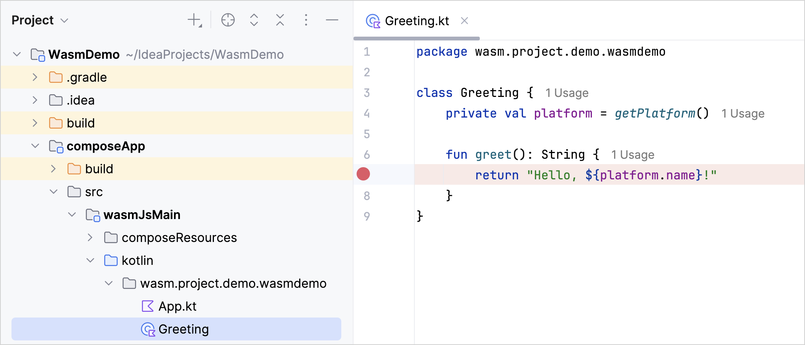
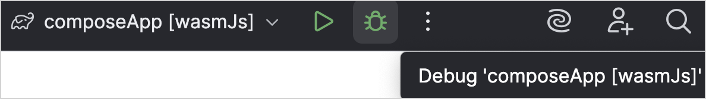
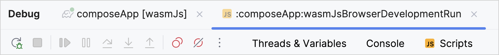
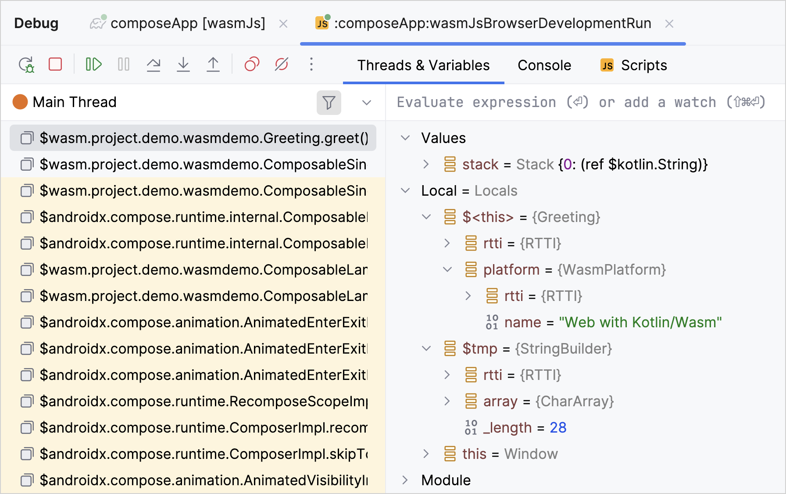
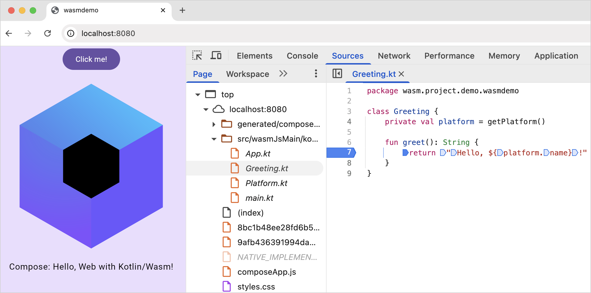
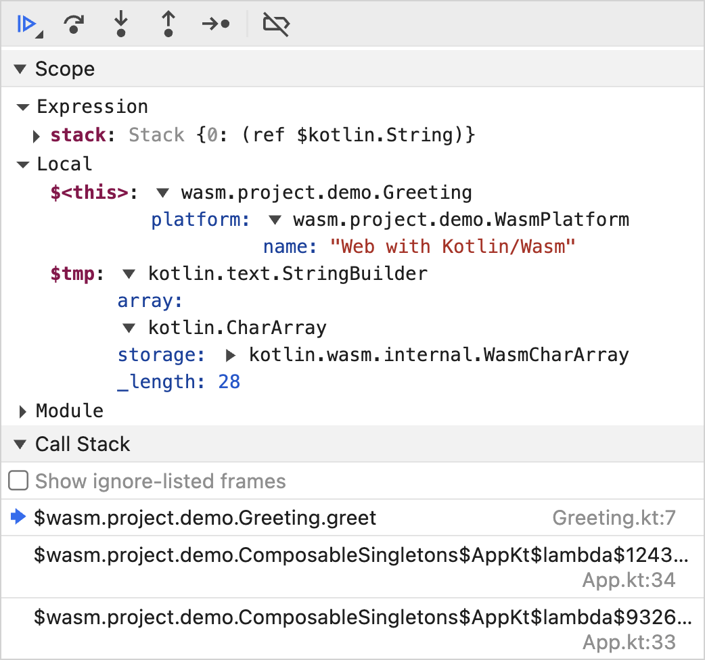

+++
title = "6.2.3.4 调试 Kotlin/Wasm 代码"
date = 2026-09-13T08:50:47+08:00
weight = 4
type = "docs"
description = ""
isCJKLanguage = true
draft = false
+++


> 原文链接: [https://kotlinlang.org/docs/wasm-debugging.html](https://kotlinlang.org/docs/wasm-debugging.html)

# 6.2.3.4 调试 Kotlin/Wasm 代码

**Beta**

本教程演示如何使用 IntelliJ IDEA 和浏览器来调试用 Kotlin/Wasm 构建的 [Compose Multiplatform](https://www.jetbrains.com/lp/compose-multiplatform/) 应用。

## 开始之前 {#before-you-start}

1. [为 Kotlin Multiplatform 开发搭建环境](https://kotlinlang.org/docs/multiplatform/quickstart.html#set-up-the-environment)。
2. 按照说明[创建一个面向 Kotlin/Wasm 的 Kotlin Multiplatform 项目](../6.2.3.2-WasmGetStarted/#create-a-project)。

> **注意：** * 在 IntelliJ IDEA 中调试 Kotlin/Wasm 代码需要 IDE 2025.3 及更高版本，目前处于[早期访问计划 (EAP)](https://www.jetbrains.com/resources/eap/)，正在走向稳定。如果你是在其他版本的 IntelliJ IDEA 中创建 `WasmDemo` 项目的，请切换到 2025.3 版本并在其中打开该项目，以继续本教程。* 要在 IntelliJ IDEA 中调试 Kotlin/Wasm 代码，你必须安装 JavaScript Debugger 插件。[查看关于该插件及安装方式的更多信息。](https://www.jetbrains.com/help/idea/debugging-javascript-in-chrome.html#ws_js_debugging_chrome_before_you_start)

## 在 IntelliJ IDEA 中调试 {#debug-in-intellij-idea}

你创建的 Kotlin Multiplatform 项目包含一个由 Kotlin/Wasm 驱动的 Compose Multiplatform 应用。你可以在 IntelliJ IDEA 中开箱即用地调试该应用，无需额外配置。

1. 在 IntelliJ IDEA 中，打开要调试的 Kotlin 文件。在本教程中，我们将处理 Kotlin Multiplatform 项目以下目录中的 `Greeting.kt` 文件：

`WasmDemo/composeApp/src/wasmJsMain/kotlin/wasm.project.demo.wasmdemo`

2. 点击行号，在你想要检查的代码上设置断点。



3. 在运行配置列表中选择 **composeApp[wasmJs]**。
4. 点击屏幕顶部的调试图标，以调试模式运行代码。



应用启动后会在新的浏览器窗口中打开。


同时，IntelliJ IDEA 中的 **Debug** 面板会自动打开。



### 检查你的应用 {#inspect-your-application}

> **注意：** 如果你是在[浏览器中调试](#debug-in-your-browser)，也可以按照相同的步骤检查应用。

1. 在应用的浏览器窗口中点击 **Click me!** 按钮与应用交互。该操作会触发代码执行，调试器会在执行到断点时暂停。

2. 在调试面板中，使用调试控制按钮检查断点处的变量和代码执行：
*  Step over 执行当前行并在下一行暂停。
*  Step into 更深入地调查某个函数。
*  Step out 执行代码直到退出当前函数。

3. 查看 **Threads & Variables** 面板。它可以帮助你追踪函数调用序列并定位任何错误的位置。



4. 修改代码并再次运行应用，以验证它的工作方式。
5. 调试完成后，点击带断点的行号以移除断点。

## 在浏览器中调试 {#debug-in-your-browser}

你也可以在浏览器中调试这个 Compose Multiplatform 应用，而无需额外配置。

当你运行开发用的 Gradle 任务（`*DevRun`）时，Kotlin 会自动把源文件提供给浏览器，让你可以设置断点、检查变量并单步执行 Kotlin 代码。

用于在浏览器中提供 Kotlin/Wasm 项目源码的配置现在已经包含在 Kotlin Gradle 插件中。如果你之前把该配置添加到了 `build.gradle.kts` 文件中，应当将其移除以避免冲突。

> **提示：** 本教程使用 Chrome 浏览器，但你应该也能在其他浏览器中按这些步骤操作。更多信息请参阅[浏览器版本](../6.2.3.6-WasmConfiguration/#browser-versions)。

1. 按照说明[运行 Compose Multiplatform 应用](../6.2.3.2-WasmGetStarted/#run-the-application)。

2. 在应用的浏览器窗口中右键单击并选择 **Inspect** 操作以访问开发者工具。或者，你也可以使用 **F12** 快捷键，或选择 **View** | **Developer** | **Developer Tools**。

3. 切换到 **Sources** 标签页并选择要调试的 Kotlin 文件。在本教程中，我们将处理 `Greeting.kt` 文件。

4. 点击行号，在你想要检查的代码上设置断点。只有数字颜色较深的行才能设置断点——在这个例子中是 4、7、8 和 9。



5. 像[在 IntelliJ IDEA 中调试](#inspect-your-application)那样检查你的应用。

在浏览器中调试时，用于追踪函数调用序列和定位错误的面板是 **Scope** 和 **Call Stack**。



### 使用自定义格式化器 {#use-custom-formatters}

在浏览器中调试 Kotlin/Wasm 代码时，自定义格式化器有助于以更友好、更易理解的方式显示和定位变量值。

自定义格式化器在 Kotlin/Wasm 开发构建中默认启用，但你仍需确保浏览器开发者工具中启用了自定义格式化器：

* 在 Chrome DevTools 中，在 **Settings | Preferences | Console** 中找到 **Custom formatters** 复选框：


* 在 Firefox DevTools 中，在 **Settings | Advanced settings** 中找到 **Enable custom formatters** 复选框：


该特性使用[自定义格式化器 API](https://firefox-source-docs.mozilla.org/devtools-user/custom_formatters/index.html)，在 Firefox 和基于 Chromium 的浏览器中受支持。

鉴于自定义格式化器默认只对 Kotlin/Wasm 开发构建生效，如果你想在生产构建中使用它们，就需要调整 Gradle 配置。把以下编译器选项添加到 `wasmJs {}` 块中：

```kotlin
// build.gradle.kts
kotlin {
    wasmJs {
        // ...

        compilerOptions {
            freeCompilerArgs.add("-Xwasm-debugger-custom-formatters")
        }
    }
}
```

## 提供反馈 {#leave-feedback}

我们非常欢迎你就调试体验提供任何反馈！

*  Slack：[获取 Slack 邀请](https://surveys.jetbrains.com/s3/kotlin-slack-sign-up)，并在我们的 [#webassembly](https://kotlinlang.slack.com/archives/CDFP59223) 频道中直接向开发者提供反馈。
* 在 [YouTrack](https://youtrack.jetbrains.com/issue/KT-56492) 中提供你的反馈。

## 接下来学什么？ {#what-s-next}

* 在这个 [YouTube 视频](https://www.youtube.com/watch?v=t3FUWfJWrjU&t=2703s)中看看 Kotlin/Wasm 调试的实际效果。
* 尝试更多 Kotlin/Wasm 示例：
* [KotlinConf 应用](https://github.com/JetBrains/kotlinconf-app)
* [Compose 图片查看器](https://github.com/JetBrains/compose-multiplatform/tree/master/examples/imageviewer)
* [Node.js 示例](https://github.com/Kotlin/kotlin-wasm-nodejs-template)
* [WASI 示例](https://github.com/Kotlin/kotlin-wasm-wasi-template)
* [Compose 示例](https://github.com/Kotlin/kotlin-wasm-compose-template)
